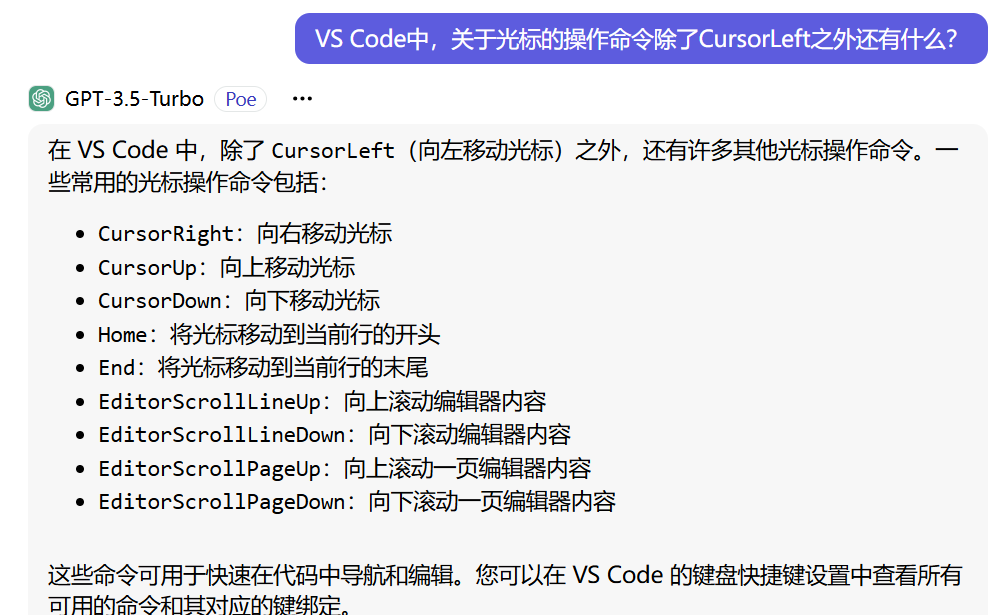
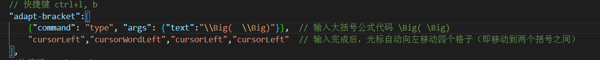
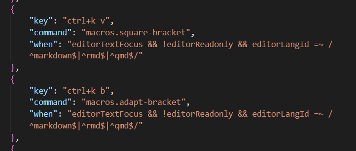

# 数学笔记分享（长期更新）


- 之前因为GitHub比较麻烦，所以我用的国内的Gitee。但是煞笔Gitee说我的笔记违规，擅自设置成了私有仓库，只好转到这里了
- 笔记大多以Markdown文件的格式写成，使用的是Katex编译器
- 由于我使用了自定义Katex宏的原因，在Github在线预览时，大多公式都显示不出来，需要下载到本地后，把我使用的宏也一并复制粘贴过去才行

## Katex宏的使用方法

- **宏命令（必看）**：因为Markdown使用的一些katex数学公式代码过于复杂，所以我在VS Code的Markdown Preview Enhanced（MPE）插件的设置文件中定义了一些宏，但它们在Github上无法显示，需要在本地Markdown编辑器（我个人推荐用 VS Code）中跟我设置一样的宏。
  - MPE的宏命令默认放在 **C:\Users\用户名\.crossnote\config.js** 路径下
  - 我把自己用的 **config.js** 文件复制了一份放在数学文件夹中，用它覆盖你电脑中上述路径下的该文件即可
    - 或者如果你的电脑本地已经安装了katex，那么也可以在其宏设置文件中复制粘贴一下
- **添加自动补全功能（选看）**：自定义的宏是没有代码自动补全功能的。但是我们也可以自己设置补全功能，只需在VS Code的 setting.json 文件中的 markdown all in one 相关属性 `markdown.extension.katex.macros` 中添加相应的设置即可
- **原理解释**：
  - 因为是某个作者先发布了 markdown all in one 插件，然后 MPE 插件的作者在其基础上优化了显示方式
  - 所以你下载这两个插件后看到的Markdown预览，其实是（MPE 的预览）覆盖了（Markdown all in one 的预览）后的结果
  - 所以（有关预览的宏命令）只能在 MPE 中设置，但（有关编辑的自动补全功能）还是要在 Markdown all in one 中设置
- **文件提供**：我目前在用的 **setting.json** 和 **keybinding.json** 文件也放在上面了，可以复制一些到VSCode的相应路径下。

```json
// Markdown all in one 的自动补全宏命令设置（示例）
"markdown.extension.katex.macros": {
    "\\pfrac":"\\frac{\\partial #1}{\\partial #2}",
    "\\dpfrac":"\\dfrac{\\partial #1}{\\partial #2}",
    // 矩阵
    "\\tvek": "\\begin{pmatrix} #1 \\\\ #2  \\end{pmatrix}",
    // 加粗1
    "\\bb": "\\bold{#1}",
    // 加粗2
    "\\bs": "\\boldsymbol{#1}",
    "\\vector": "\\overrightarrow{#1}",
    "\\arc" : "\\mathop{\\scriptsize #1}\\limits^{\\frown}",
},
```

### 推荐另一个VS Code宏命令插件：Macros（选看）

- **使用原因**：Macros可以给键盘编写宏。什么意思呢？
  - 比如我想要打一个求和符号，需要输入 `\sum\limits^\infty_{i=1} a_n` 这一长串数学公式代码，很麻烦
  - 但是我可以给 Ctrl + K, S 这三个键绑定一个输入的宏命令，这样每当我同时按下Ctrl键和K键后，再按下S键时，VS Code就会自动打出 `\sum\limits^\infty_{i=1}` 这一串代码。大大节省了输入的时间
- **使用方法**：
  - **Macros的宏命令操作内容**需要在 **setting.json** 文件中编写
  - **Macros的宏命令绑定哪些按键**需要在 **keybinding.json** 文件中编写
  - 这些代码的格式都是相似的。要编写新的宏命令时，直接复制粘贴之前宏命令的代码，然后在此基础上稍微修改一下就行
- **如何编写命令**：
  - 实际上Macros使用的宏命令语句就是VSCode内置的命令接口，也就是说，编写VSCode插件时用到的命令，都可以写在Macros的宏命令中
  - 但令人恼火的是，网上基本找不到关于这些VSCode命令的词典网站，不过我们只是想写个数学笔记而已，自动打字 + 自动移动光标这两个命令就已经够用了。下面是一个使用例：

---

- **询问ChatGPT**

---

- **利用学到的命令去编写宏**
  - **setting.json**文件中：
  - **keybinding.json**文件中：

## 使用git

### 作者：长期更新笔记

- **git的好处**：
  - 可以将多个版本存储在不同分支中，从而可以从中观察出不同时期的思想
  - 相对网盘来说比较方便，没有网速限制，且和Vs Code兼容
  - 可以查看之前每次提交时的变化，并附带一些个人标注的提交信息

### 读者：一键拉取笔记

- 将本地仓库和我在Github上的这个仓库关联后，每次我更新什么东西是，就可以直接用 `git pull` 命令将更新内容拉取到本地仓库中，不用一次次地下载和覆盖

## 关于笔记的阅读

### 笔记的阅读顺序

- 因为我学一些科目的顺序比较乱，参考的也不止一本书，所以很多地方补充的东西实际上有点超纲（不过超纲的部分我一般都注明了）
- 我比较认同的数学本科学习顺序写在  **阅读顺序.txt** 文件中
- 那张 **学习路线.png** 图片是网上发的一张科大培养方案，有一点参考意义，但并不会真有人把这些科目都给学完吧

<!-- ### 我在定理证明下面写的“理解”和“本质”是什么意思

- **“理解”是把书读厚的过程**
  - 一般来说，就是把证明的数学语言用文字再写一遍
  - 但是呢，众所周知，我们书上的定理在早期，是要有一个发现问题的契机、提出问题的动机，和解决问题的尝试，是一个漫长的发展过程，其中可能出现很多的冗杂、啰嗦的概念与手法。结果呢，初步做完后往往会发现，可简化的地方太多了。
  - 但是，直接去学习简化后的漂亮结果，也是挺反人类的。所以还是得重复一遍这个动机的提出和笨拙构造的过程。但是不同的人有不同的理解，而且尝试理解概念本身其实也是一个挺有意思的过程。毕竟学数学那么求快干啥，不如多看看沿途的风景
- **“本质”是把书读薄的过程**
  - 学了一个东西我总得用吧，但是用的时候如果光背定理，那岂不是白学了证明。如果每次都要思考一遍证明的过程，那岂不是跟没学一样。所以需要有一个自己的简化表达，不仅能快速体现这个定理的目的，同时也蕴含着证明的思路与手法。 -->

### 字体的颜色

- **绿色的字**（chartreuse）是我自己写的理解，其实如果你理解了该部分的知识，那绿色的字基本就不用看了
  - 因为写成黑字就突出不了内容的主体，所以我把这部分个人感悟换成了相对不扎眼的浅绿色
- **蓝色的字**（aqua）一般是上面的绿色字内容是错的，但是舍不得删时，在下面当第二次注释
- **红色的字**（red）是比较重要的，要么是数学证明的核心，要么是数学本质的浓缩