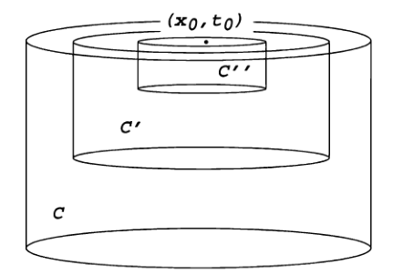

# 热方程

- **热方程**：$u_t-\D u = 0$
  - $u:\ol U\times [0,\infty)\to \R$
  - $x\in U，t>0$
- **物理意义（扩散）**：描述区域 $U$ 中某个量的密度 $u$ 在时间 $t$ 变化时恒成立的等式
  - 流量密度 $\bd F$ 一般沿梯度 $Du$ 的反方向：$\bd F = -aDu$
  - 某点流速是该点流量的散度：$u_t = -\divt\bd F$
  - 区域流量（左式）等于表面通量（右式）：$\cfrac{d}{dt}\dis\int_V udx = -\int_{\pa V}\bd F\cdot \nu dS$
    - 同时也是上一式在高斯格林定理下的结果
  - 综上即得 $u_t = a\divt Du = a\D u$，取 $a=1$ 即为热方程

## 求解

- **归纳法引理**：设 $n=1，u(x,t) = v(\dfrac{x}{\sqrt{t}})$，则
  - $u_t = u_{xx} \LR v'' + \dfrac{z}{2}v' = 0$
    - **证明**：两边求导易得
  - 右式的一般解为 $v(z) = c\dis\int^z_0 e^{-\dfrac{s^2}{4}}ds + d$
    - **证明**：常微分方程的驻定方程，高阶换元法即可
- **思路**：
  - **齐次性**：由于热方程中，$t$ 只有一阶导项，$x_i$ 只有二阶导项，故若 $u$ 是解，则对 $\forall \l\in\R$，$u(\l x,\l^2 t)$ 也是解
  - **换元简化**：由齐次性，解可写为单变量函数 $u(x,t) = \dfrac{1}{t^\a}v(\dfrac{x}{t^\b})$，设 $y = \dfrac{x}{t^\b}$
    - 将其代入热方程得 $$\frac{\a}{t^{\a+1}}v + \frac{\b}{t^{\a+1}}y\cdot Dv + \frac{1}{t^{\a+2\b}}\D v = 0$$
    - 容易发现，此时取 $\b = \dfrac{1}{2}$，则可消去系数，变为 $$\a v + \frac{1}{2}y\cdot Dv + \D v = 0$$
  - **$x$ 的旋转不变性**：由拉普拉斯算子的旋转不变性直得
    - 由旋转不变性，可设 $u(x,t) = v(y) = w(r)$，则方程变为 $$\a w + \frac{r}{2}w' + w'' + \frac{n-1}{r}w' = 0$$
    - 观察发现，若取 $\a = \dfrac{1}{2}$，则方程可合并为 $$(r^{n-1}w')' + \frac{1}{2}(r^nw)' = 0$$
    - 两边积分即得 $$r^{n-1}w' + \frac{1}{2}r^nw = a$$，由于等式恒成立，且 $\lim\limits_{r\to\infty} w = \lim\limits_{r\to\infty}w' = 0$，故 $a = 0$
  - **回代**：综上，解得 $w = be^{-\dfrac{r^2}{4}}$，再由于 $\begin{cases} \a = \b = \dfrac{1}{2} \\\\ r = |y| = \dfrac{|x|}{t^\b} \\\\ u = \dfrac{1}{t^\a}v(y) = \dfrac{1}{t^\a}w(r) \end{cases}$，即得一般解
- **基本解**：$\Phi(x,t) = \begin{cases} \cfrac{1}{(4\pi t)^{\frac{n}{2}}}\pad e^{-\dfrac{|x|^2}{4t}} & x\in\R^n，t>0 \\ 0 & x\in \R^n，t<0 \end{cases}$（热核，Fourier分析可得其为良核）
  - **积分归一性**：$\dis\int_{\R^n} \Phi dx = 1$
- **热初值问题**：$\begin{cases} u_t - \D u = 0 & \R^n\times (0,\infty) \\ u = g & \R^n\times \{t=0\} \end{cases}$
  - **卷积解**：$u(x,t) = \dis\int_{\R^n}\Phi(x-y)g(y)dy$ 也是解
  - **性质**：设 $g\in C(\R^n)\cap L^\infty(\R^n)$，$u$ 是卷积形式的解，则
    - **光滑性**：$u\in C^\infty(\R^n\times (0,\infty))$
      - **证明**：由于 $\Phi$ 的被积函数光滑，故 $\Phi$ 的任意阶导数均一致有界，从而由定义得 $u$ 光滑
      - **本质**：要证含参变量积分函数光滑，只需被积函数的含参因子光滑即可
    - **解性**：$u_t - \D u = 0$
      - **证明**：定义易得
    - **初时连续性**：$\lim\limits_{\substack{(x,t)\to (x^0,0) \\ x\in\R^n，t>0}} u(x,t) = g(x^0)\quad (x^0\in \R^n)$
      - **证明**：
        - 由 $g$ 连续，取 $y\in O(x^0, \d)$ 使得 $|g(y)-g(x^0)| < \e$
        - 再取 $x\in O(x^0,\dfrac{\d}{2})$，对 $|u(x,t)-g(x^0)| = I+J$ 划出积分区间
        - $I$ 在球 $B(x^0,\d)$ 中，$g$ 连续性 + 积分上界不等式即得 $I<\e$
        - $J$ 在球外，由积分上界不等式消去 $g$，再由 $|x-y|\geq \dfrac{|y-x^0|}{2}$，换元 $z = \dfrac{y-x^0}{\sqrt{t}}$，此时削去的 $B(x^0,\dfrac{\d}{\sqrt{t}})\to \R^n\pad (t\to 0_+)$，故 $J\to 0$
        - 综上即得初时部分的热方程解函数是连续的
  - **无限传播速度**：若 $g$ 连续有界非负，则 $u$ 始终为正

### 非齐次情况

- **Duhamel原理**：若齐次线性微分方程可解，则其非齐次形式也可解
  - 初边值均为0的非齐次线性微分方程 $\begin{cases} u_t - Lu = f \\ u|_{\pa D} = 0 \\ u(x,0) = 0 \end{cases}$ 中，设 $v$ 是初值为 $f$ 的延时齐次方程解，则上面方程的解为 $u= \dis\int^t_0 vds$
  - **理解**：齐次方程每一刻都具有初值 $f$ （延时解积分）等价于无初值的非齐次方程
  <!-- - **理解**：若在某时刻 $t_0$ 处添加一个外力 $f$，再设外力的影响为 $w$，那么有 $\dfrac{\pa w}{\pa t}|_{t = t_0} = f$，且其从初时 $t_0$ 到某时刻 $t$ 的积分即为总影响 $\dis\int^t_{t_0} wdt$ -->
- **非齐次热0初值问题**：$\begin{cases} u_t - \D u = f & \R^n\times (0,\infty) \\ u = 0 & \R^n\times \{t=0\}  \end{cases}$，其中 $f\in C^2_1(\R^n\times (0,\infty))$
- **求解**：
  - **延时解**：易得 $\Phi(x-y,t-s)$ 也是热方程 $u_t-\D u = 0$ 的解
    - 则 $u(x,t;s) = \dis\int_{\R^n}\Phi(x-y,t-s)f(y,s)dy$ 也是下面延时非齐次热0初值问题的解 $$\begin{cases} u_t - \D u = f & \R^n\times (0,\infty) \\ u = 0 & \R^n\times \{t=s\}  \end{cases}$$
  - 由Duhamel原理，此时 $U(t) = \dis\int^t_0 u(x,t;s)ds$ 即为题干中问题的特解
    - **证明**：
      - 易得 $U(0) = 0$
      - $\D_x U = \dis\int^t_0 \int_{\R^n} \D_x\Phi(x-y,t-s)f(y,s)dyds$
        - 由于 $\Phi$ 是热方程的解，$\D_x\Phi = \Phi_t$
        - 再由于 $U$ 是含参变量积分，由其求导公式得原式可化为 $$U_t - \dis\int_{\R^n}\Phi(x-y,0)f(y,t)dy$$
        - 再由于 $\Phi$ 是良核，得 $t\to 0$ 时其和任意 $f$ 的卷积都为 $f$，故等于 $U_t - f(x,t)$
        - 综上即得 $U_t - \D_x U = f$
- **解的叠加性原理（非齐次问题通解）**：$u(x,t) + U(x,t)$，即齐次初值问题通解 + 非齐次0初值问题特解
- **$U$ 的性质**：
  - **二阶连续可微**：$U\in C^2_1(\R^n\times (0,\infty))$
    - **证明**：
      - 含参变量求导得 $u_t$，易得其连续
      - $u_{x_ix_j}$ 等价于对 $f$ 二阶求偏导，由 $f$ 二阶连续可微性即得结论
  - **解性**：$U$ 是非齐次热方程的解
    - **分裂证明**：$U_t-\D U$ 分裂为 $I_\e + J_\e + \Phi*f|_{s=t}$
      - $s\in [0，\e]$ 部分放缩为 $0$
      - $s\in [\e, t]$ 部分关于 $t$ 分部积分（积 $f$ 导 $\Phi$），首项为0，尾项为 $-\Phi*f|_{s=t}$
        - 而中间项为 $\Phi*f|_{s=\e}$，收敛到良核卷积，故结果为 $f$
        - 呃呃，结果还是需要良核性质……
  - **初时连续性**：$\lim\limits_{\substack{(x,t)\to(x^0,0) \\ x\in\R^n，t>0}} U(x,t) = 0\pad (\forall x^0\in \R^n)$
    - **证明**：同齐次情况

## 解的性质

- **抛物柱**：$U_T = U\times (0,T]$
  - **抛物边界**：$\G_T = \ol U_T - U_T$
- **热球**：$E(x,t; r) = \set{(y,s)\in\R^{n+1} \mid s\leq t，\Phi(x-y,t-s) \geq \dfrac{1}{r^n}}$

### 均值公式

- 设 $u\in C^2_1 (U_T)$ 是热方程的解，则 $u(x,t) = \dis\frac{1}{4r^{n}}\iint_{E(x,t;r)} u(y,s)\frac{|x-y|^2}{(t-s)^2}dyds$
- **证明**：不妨设 $x = \bd 0，t=0$，否则可用变换达到这一目的，此时热球设为 $E(r) = E(0,0,r)$
  - 由解的旋转不变性，右式设为 $\dfrac{1}{4}\phi(r)$
  - 计算易得 $$\phi'(r) = \dfrac{1}{r^{n+1}}\dis\iint_{E(r)}\ts \Big[ \sum\limits^n_{i=1} u_{y_i}y_i\dfrac{|y|^2}{s^2} + 2u_s\dfrac{|y|^2}{s} \Big]dyds$$，将其中被积的两项设为 $A+B$
  - 我们希望把 $B$ 也取为导数和的形式，从而将两项融合
  - 可暂时取 $\psi = C\dfrac{|y|^2}{s} + d(r,s,t)$，此时 $\psi_{y_i} = \dfrac{2Cy_i}{s}$。在 $B$ 中进行代换可得 $$B = \dfrac{1}{r^{n+1}}\dis\iint_{E(r)}\ts\Big[ \dfrac{4}{C}u_s\sum\limits^n_{i=1} y_i\psi_{y_i} \Big]dyds$$
  - 接下来，为了将 $y_i$ 微分转移到 $u$ 上，要对 $B$ 分部积分。我们当然希望 $\psi$ 在边界 $\pa E(r)$ 上为0，这样可以少算一项。此时 $C$ 和 $d$ 尚未确定，我们通过这两个待定项达成目的
  - 取 $\psi = \dfrac{|y|^2}{4s} + \log\dfrac{r^n}{(-4\pi s)^{\frac{n}{2}}}$。由于在 $\pa E(1)$ 上 $\begin{cases} s = t \\ \Phi = \dfrac{1}{r^n} \end{cases}$，易得 $\psi|_{\pa E(r)} = 0$
  - 关于 $y_i$ 分部积分（积 $\psi$，导 $u$）即得 $$B = \dfrac{-1}{r^{n+1}}\dis\iint_{E(r)}\ts\Big[ 4nu_s\psi + 4\sum\limits^n_{i=1} u_{sy_i}y_i\psi \Big]dyds$$  
  - 易得 $\psi_s = -\dfrac{|y|^2}{4s^2} - \dfrac{n}{2s}$
  - 将 $B$ 中被积函数的第二项中关于 $s$ 分部积分（积 $u$，导 $\psi$）即得 $$B = \dfrac{1}{r^{n+1}}\dis\iint_{E(r)}\ts\Big[ -4u_s\psi - \dfrac{2n}{s}\sum\limits^n_{i=1} u_{y_i}y_i \Big]dyds - A$$
  - 再由于 $u$ 是热方程的解，用 $\D u$ 替换 $u_s$，即得 $$\phi'(r) = \dfrac{1}{r^{n+1}}\sum\limits^n_{i=1} \iint_{E(r)} \Big[ 4nu_{y_i}\psi_{y_i} - \frac{2n}{s}u_{y_i}y_i \Big] = 0 $$
  - 即 $\phi(r)$ 是常函数，从而 $\phi(r) = \lim\limits_{r\to 0} \phi(r) = u(0,0)\lim\limits_{r\to 0} \dis\iint_{E(r)}\ts\dfrac{|y|^2}{s^2}dyds$
  - 实际上有 $\dis\iint_{E(1)}\ts\dfrac{|y|^2}{s^2}dyds = 4$，那么此时 $\phi(r) = 4u(0,0)$，从而得到均值公式
    - 实际上是先有了均值公式，再有了热球的定义。这个定义就是为了最后一步积分取为 $4$ 服务的，不需要深究

### 强最大值原理

- 设 $u\in C^2_1(U_T)\cap C(\ol U_T)$ 是抛物柱内热方程的解，则
  - $\max\limits_{\ol U_T} u  = \max\limits_{\G_T} u$
  - 若 $U$ 连通，且最大值在抛物柱内能取到，则其为常值
- **证明**：设 $u(x_0,t_0) = M$，则存在足够小的 $r$ 使得 $E(x_0,t_0; r)\subset U_T$
  - **热球内的恒最大性**：由均值公式，$M = \dfrac{1}{4}\dis\iint_{E(x_0,t_0;r)}u(y,s)\ts\dfrac{|x_0-y|^2}{(t_0-s)^2}dyds$
    - 再已知 $\dis\iint_{E(1)}\ts\dfrac{|y|^2}{s^2}dyds = \dis\iint_{E(x_0,t_0;r)}\ts\dfrac{|x_0-y|^2}{(t_0-s)^2}dyds = 4$
    - 故只有 $u$ 在热球内恒为最大值 $M$ 时，才可能使 $u(x_0,t_0) = M\cdot \dfrac{1}{4}\cdot 4 = M$。（否则 $u$ 在积分过程中只可能取更小的值，从而积分值（在中心点上的值）达不到 $M$）
  - **扩展到直线**：在 $U_T$ 中取连接热球中心 $(x_0,t_0)$ 和某个处在其下方的点 $(y_0,s_0)$ 的线段 $L$，其中 $s_0<t_0$
    - 由于 $u$ 连续，设 $r_0$ 为 $L$ 使 $u$ 取最大值的分界点（从 $s_0$ 出发沿 $L$ 向上运动到 $r_0$ 之前，$u$ 均不取最大值。若继续沿 $L$ 向上运动，则 $u$ 恒取最大值） $$r_0 = \min\{ s\geq s_0 \mid u(x,t) = M， \forall (x,t)\in L，t\in [s,t_0]\}$$
    - 若线段 $L$ 确实上存在这个点（即 $r_0>s_0$）
      - 则 $\exists (z_0,r_0)\in L\cap U_T$ 使得 $u(z_0,r_0) = M$
        - 此时设 $z_0$ 为 $r_0$ 在 $L$ 上对应的点，即使 $u$ 取最大值分界点
      - 从而对足够小的 $r$，在 $E(z_0,r_0;r)$ 上都有 $u\equiv M$
        - 在这个分界点上取足够小的热球，则热球内恒为最大值 $M$
      - 再取足够小的 $\sigma>0$，则可使得 $L\cap \set{r_0-\sigma \leq t\leq r_0} \subset E(z_0,r_0;r)$
        - 但是热球是个球，在球心前后都有 $L$ 的交点。故在分界点 $z_0$ 之前也取最大值点 $M$，与分界点定义矛盾
      - 故只能是 $r_0 = s_0$，即在 $L$ 上都有 $u\equiv M$
  - **扩展到抛物柱**：对给定的 $x\in U，t\in [0,t_0]$，由 $\R^n$ 连通性，总存在一列点 $\{x_i\}^n_{i=0}$ 可被线段相连，且逼近任意的道路。同理在 $\R^n\times (0,\infty)$ 上，也存在一列纵坐标 $t_0>t_1>\cdots > t_m = t$，使得对应点 $(x_i,t_i)$ 位于线段 $L$ 上，且可逼近 $U_T$ 中任意道路。
    - 实际上就是在 $U_T$ 中使用热球链法

### 非齐次有界区域唯一性

- 设 $g\in C(\G_T)，f\in C(U_T)$，则 $U_T$ 内的非齐次热初值问题最多存在一个解 $u\in C^2_1(U_T)\cap C(\ol U_T)$
- **证明**：对 $w = \pm (u-\wt u)$ 应用强最大值原理即可

### Cauchy最大值原理（无界域）
  
- 设 $u\in C^2_1\Big(\R\times (0,T]\Big) \cap C(\R^n\times [0,T])$ 是齐次热初值问题的解，初值为 $g$
  - 若 $u$ 满足**增长估计式** $u\leq Ae^{a|x|^2} \quad (x\in\R^n，t\in [0,T])$
    - （常系数 $A$ 表示左右式子是同阶的）
  - 则 $\sup\limits_{\R^n\times [0,T]} u = \sup\limits_{\R^n} g$
- **证明**：
  - **较小时段**：首先考虑 $\exists \e>0$ 使得 $4a(T+\e)<1$  的情况
    - **辅助**：设 $\begin{cases} y\in \R^n \\ \mu>0\end{cases}$，易得 $v(x,t) = u(x,t) - \mu\Phi(x-y,T+\e-t)$ 也是热方程的解
      - $\mu$ 是待定系数，先放松条件来讨论 $v$ 的性质，再在后面将条件收紧（令 $\mu\to 0$ 来逼近 $u$），这是待定系数法的基本思想，同时也是一种常见的分析学技巧
      - $T-\e$ 的意义是为了后面引出 $\a+\g$ 来将函数化为一个容易比较阶数的形式
      - 再减去 $t$ 是因为要后面要讨论任意时刻情况，故需要取一个时间不定量。反正最后会用单调性把 $t$ 消去，所以影响不大
    - **有界区域最大值**：对 $r>0$，设 $\begin{cases} U = B^0(y,r) \\ U_T = B^0(y,r)\times (0,T] \end{cases}$，则由强最大值原理，$\max\limits_{\ol U_T} v = \max\limits_{\G_T} v$
    - **无界区域最大值**：
      - **初值**：由 $\Phi>0$ 得 $v(x,0)\leq u(x,0) = g(x)\pad (x\in \R^n)$
      - **任意时刻值**：固定 $x$，重新设 $|x-y| = r$
      - 由 $\Phi$ 关于 $t$ 单减 + 题设增长估计式得 $$v(x,t) \leq Ae^{a(|y|+r)^2} - \mu\Phi(x-y,T+\e)$$
        - 求导法易得 $\Phi$ 在 $t\in [0,\dfrac{|x|}{\sqrt{8n}}]$ 时关于 $t$ 单增，在 $t\in [\dfrac{|x|}{\sqrt{8n}},\infty]$ 时关于 $t$ 单减。由于是无界区域，只需考虑 $|x|\to\infty$，故可视为全域单减
      - 由假设，$\exists \g >0$ 使得 $\dfrac{1}{4(T+\e)} = a+\g$，同时再新取 $x\in O(y,r)$，单调性 + 代入得 $$\Phi(x-y,T+\e) \geq \Big[ 4(a+\g) \Big]^{\dfrac{n}{2}}e^{(a+\g)r^2}$$
        - 此时 $v(x,t) \leq Ae^{a(|y|+r)^2} - \mu\Big[ 4(a+\g) \Big]^{\frac{n}{2}}e^{(a+\g)r^2}$，易得第二项是第一项关于 $r$ 的高阶无穷大量，故此时给 $\mu$ 留了一个回旋余地（存在无穷小量 $\mu$ 使得右式 $\leq Ae^{a|x|^2} \sim u(x,t) \sim \sup\limits_{\R^n} g$）
      - 从而 $v(x,t) \leq \sup\limits_{\R^n} g$
    - **总结**：
      - 有界情况和无界初值情况均不依赖 $\mu$
      - 无界任意时刻时，已知可取 $\mu$ 为某个无穷小量的同时保持性质不变
      - 故我们将 $\mu\to 0$，此时 $v = u$，即得最终结论 $u(x,t) \leq \sup\limits_{\R^n} g(x)$，且取初值（$t=0$）时等号成立
  - **任意时段**：将 $[0,T]$ 划分为 $[0,\dfrac{1}{8a}]，[\dfrac{1}{8a},\dfrac{2}{8a}]，\cdots$
    - 由 $[0,\dfrac{1}{8a}]$ 的结论，$u|_{t = \frac{1}{8a}} = g_1 \leq \sup\limits_{\R^n} g$
    - 依次归纳可得 $\forall g_k \leq \sup\limits_{\R^n} g$，从而可推广到任意 $T$

### 初值问题解的唯一性

- 设 $g\in C(\G_T)，f\in C(U_T)$
  - 则热初值问题最多存在一个解 $u\in C^2_1(U_T)\cap C(\ol U_T)$ 满足增长估计式
- **证明**：对 $w = \pm (u - \wt u)$ 使用Cauchy最大值原理即可

### 解的光滑性

- **热圆柱**：$C(x,t,r) = \set{(y,s): |x-y|\leq r，t-r^2\leq s\leq t}$
- 设 $u(x,t)\in C^2_1(U_T)$ 是 $U_T$ 内齐次热方程初值问题的解，则 $u\in C^\infty(U_T)$
- **证明**：
  - **划分区域**
    - 设 
    - 取 $(x_0,t_0)\in U_T$ 和足够小的 $r>0$，使得 $\begin{cases} C = C(x_0,t_0,r) \subset U_T \\ C' = C(x_0,t_0,\dfrac{3}{4}r) \\ C'' = C(x_0,t_0,\dfrac{1}{2}r) \end{cases}$
      - 都是以 $(x_0,t_0)$ 为顶部中心的圆柱，但半径不同，连带着高也不同
    - 设 $\zeta(x,t)$ 是光滑函数，满足 $\begin{cases} \zeta\in [0,1] \\ \zeta \equiv 1 & (x,t)\in C' \\ \zeta\equiv 0 & 在C的抛物边界附近和C外 \end{cases}$
      - 它是分段截止函数，是为了将各个热圆柱中函数区别开来而进行的构造
      
  - **初值函数变形**
    - 设 $u\in C^\infty(U_T)，v(x,t) = \zeta(x,t)u(x,t)$
      - 由于 $\zeta$ 在 $C$ 边界处为 $0$，故 $v(x,0) = 0$
      <!-- - 综上，$v$ 为非齐次热初值问题（初值为 $\wt f$）的解 -->
      - 设 $\wt f = v_t - \D v = \zeta_t u -2D\zeta\cdot Du - u\D \zeta$
    - 设 $\wt v(x,t) = \dis\int^t_0\int_{\R^n} \Phi(x-y,t-s)\wt f(y,s)dyds$
      - 前面已经证明 $\wt v$ 为 $\begin{cases} u_t - \D u = \wt f & \R^n\times (0,t_0) \\ u = 0 & \R^n\times \{t=0\}  \end{cases}$ 的Duhamel解
      - 再由于 $\wt f = v_t - \D v$，得 $v$ 也是该问题的解
      - 由于 $v,\wt v$ 均有界，且解具有唯一性，故 $v \equiv \wt v$
  - **解函数变形**
    - 设 $(x,t)\in C''$，已知齐次热初值问题 $\begin{cases} u_t - \D u = 0 & U_T \\ u = \wt f & \G_T \end{cases}$ 的卷积解为 $$u(x,t) = \iint_C \Phi(x-y,t-s)u(y,s)\Big[ \zeta_s(y,s) - \D\zeta(y,s) \Big]\\\ \\ -2D\zeta(y,s)\cdot 2Du(y,s)dyds $$
    - 由于 $\zeta$ 在 $C$ 边界处为0，对最后一项分部积分（积 $u$，导 $\zeta$）得 $$ u(x,t) = \iint_C \Phi u\Big[ \zeta_s + \D\zeta \Big] + 2u\Phi_s D\zeta dyds $$
    - 提公因式 $u$，重写为 $u(x,t) = \dis\iint_C K(x,t,y,s)u(y,s)dyds，(x,t)\in C''$
      - 其中 $K = \Phi\Big[ \zeta_s + \D \zeta \Big] + 2\Phi_s D\zeta$
      - 由于 $C'$ 内 $\zeta \equiv 1$，故 $(y,s)\in C'$ 时 $K = 0$
      - 再由 $\zeta,\Phi$ 均光滑，得 $(y,s)\in C-C'$ 时 $K$ 光滑
      - 由于光滑函数的数乘和积分也光滑，即得 $u(x,t)$ 在 $(x,t)\in C''$ 时光滑
  - **推广到整个抛物柱**：
    - 由于 $C''$ 的顶点 $(x_0,t_0)$ 是任意的，故可简单推广到整个 $U_T$ 中

### 导数估计式

- 存在常数列 $C_{k,l} \pad (k,l = 0,1,...,a)$ 满足 $$\max\limits_{C(x,t,\frac{r}{2})} |D^k_x D^l_t u| \leq \frac{C_{k,l}}{r^{k+2l+n+2}}\|u\|_{L^1 \big( C(x,t,r) \big)}$$ 对所有的（$U_T$ 内部的热圆柱）和（$U_T$ 内的齐次热方程初值问题的解 $u$）都成立
- **证明 $(r=1)$**：
  - 首先，可通过变换使得 $(x,t)\mapsto (0,0)$，故只讨论原点
  - 已知 $$u(x,t) = \iint_{C(1)} K(x,t,y,s)u(y,s)dyds，(x,t)\in C(\frac{1}{2})$$
  - 由 $K$ 光滑，取 $C_{k,l} = \max\limits_{C(1)} |D^k_x D^l_t K|$，应用积分上界不等式即可
- **证明**：
  - 由热方程解的齐次性，设 $v(x,t) = u(rx,r^2t)$，易得其为 $C(1)$ 中的齐次热方程初值问题解
  - 再由易得 $\begin{cases} D^k_x D^l_t v(x,t) = r^{2l+k}\cdot D^k_x D^l_t u(rx,r^2t) \\\\ \|v\|_{L^1 \big( C(1) \big)} = \dfrac{1}{r^{n+2}}\|u\|_{L^1 \big( C(r) \big)} \end{cases}$，即得最终结论

### 偏解析性

- **部分解析性**：$x\mapsto u(x,t)$ 是解析的，但 $t\mapsto u(x,t)$ 不是全局解析的

### 能量方法

- **非齐次热初值问题解的唯一性**：仅有一个解 $u\in C^2_1(\ol U_T)$
  - **证明**：反设有两个解，$w = u-\wt u$，则 $w$ 是齐次热0初值问题的解
    - 设能量泛函 $e(t) = \dis\int_U w^2dx$
    - 则由热方程解性 + 格林公式得 $\dot e = -2\dis\int_U |Dw|^2dx \leq 0$
    - 从而 $e(t) \leq e(0) = 0$，由其定义得 $w \equiv 0$，解唯一
- **齐次热终值问题解的唯一性**：若 $u(x,T) = \wt u(x,T)\pad (\forall x\in U)$，则 $U_T$ 中 $u\equiv \wt u$
  - **引理**：
    - 再次求导 + 格林公式 + 热方程解性得 $\ddot e = 4\dis\int_U (\D w)^2dx$
    - 由于边界上 $w = 0$，故分部积分得 $\dot e = -2\dis\int_U w\D wdx$，再由Holder不等式得 $积分项 \leq 2\dis\dkh{\int_U w^2dx}^{\frac{1}{2}}\dkh{\int_U (\D w)^2dx}^{\frac{1}{2}}$
    - 综上得 $(\dot e)^2 \leq e\ddot e$
  - **证明**：
    - 反设存在 $[t_1,t_2]\subset [0,T]$ 满足 $\begin{cases} e(t) > 0 & t\in [t_1,t_2] \\ e(t_2) = 0 \end{cases}$
      - 设 $f(t) = \ln e(t)$，则 $f'' = \dfrac{\ddot e}{e} - (\dfrac{\dot e}{e})^2$，由引理不等式即得 $f'' \geq 0$，从而其为凸函数
      - 由凸函数Jensus不等式，$\forall \tau\in (0,1)，e\Big( (1-\tau)t_1 + \tau t \Big) \leq e(t_1)^{1-\tau}e(t)^\tau$
      - 再由初等函数连续性，$t = t_2$ 时也满足不等式，但此时左边非负，右边恒为0，故只能是两边均为0，即 $e(t) \equiv 0$
    - 由凸函数性，将 $e(t)$ 表示为 $e(t_1)e(t)$