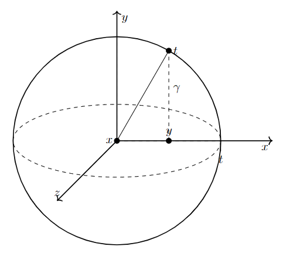
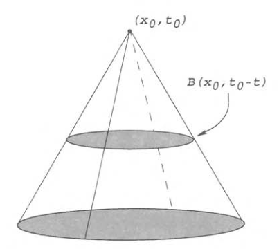

# 波动方程

- $u_{tt}-\D u = 0$，可简写为 $\square u = 0$

## 物理意义

- **维度意义**：
  - $n=1$，弦振动模型
  - $n=2$，膜振动模型
  - $n=3$，弹性体模型
- **变量**：设 $V$ 是 $U$ 的光滑子区域，$u(x,t)$ 是物体在 $t$ 时刻 $x$ 方向上的位移
  - $V$ 的加速度为 $\dfrac{d^2}{dt^2}\dis\int_V udx = \int_V u_{tt}dx$
  - $F$ 是以质量密度为单位，沿 $\pa V$ 作用于 $V$ 的力（相当于单位质量上的力 $\dfrac{dF}{dm}$）
  - 接触力为 $-\dis\int_{\pa V} F\cdot\nu dS$
- **等式**
  - 由牛顿第二定律，得积分形式等式 $\int_V u_{tt}dx = -\dis\int_{\pa V} F\cdot\nu dS$
    - 总质量的平均接触力等于加速度
  - 再由于 $V$ 的任意性 + 高斯格林定理，得微分形式等式 $u_{tt} = -\divt F$
  - 由于 $F$ 是 $Du$ 的函数，将其线性化即得 $u_{tt} - a\divt Du = \square u = 0$
- **实例**：
  - 弹簧振子中，力和位移成反比，称为简谐运动。方程为 $kx = F = mx_{tt}$，它是二阶ODE，不是波动方程

## 一维情况

- **齐次初值问题**：$\begin{cases} u_{tt} - u_{xx} = 0 & \R\times (0,\infty) \\ u = g，u_t = h & \R\times \{t=0\} \end{cases}$
- **解**：
  - **微分平方差公式**：易得 $(\dpfrac{}{t} + \dpfrac{}{x})(\dpfrac{}{t} - \dpfrac{}{x})u = u_{tt}-u_{xx} = 0$
  - **化为两个复合输运方程**：设 $v(x,t) = (\dpfrac{}{t} - \dpfrac{}{x})u(x,t)$
    - 则 $v_t + v_x = 0$，变为齐次输运方程，已知解为 $\begin{cases} a(x) = v(x,0) \\ v(x,t) = a(x-t) \end{cases}$
    - 再由 $v$ 定义即得 $u_t-u_x = a(x-t)$，变为非齐次输运方程，已知解为 $\begin{cases} b(x) = u(x,0) \\ u(x,t) = \dfrac{1}{2}\dis\int^{x+t}_{x-t}a(y)dy + b(x+t) \end{cases}$
  - **代入初值**：
    - 由初值条件得，$\begin{cases} b(x) = g(x) \\ a(x) = h(x)-g'(x) \end{cases}$，代入即得结果
- **达朗贝尔公式**：$$u(x,t) = \dfrac{g(x+t)+g(x-t)}{2} + \dfrac{1}{2}\dis\int^{x+t}_{x-t}h(y)dy$$
- **D函数的性质**：设 $g\in C^1(\R)，h\in C^1(\R)$，$u$ 是Dalembert
  - **二阶连续可微性**
  - **解性**
  - **初时连续性**：$\lim\limits_{\substack{(x,t)\to(x^0,0) \\ t>0}} u(x,t) = g(x^0)，\lim\limits_{\substack{(x,t)\to (x^0,0) \\ t>0}}u_t(x,t) = h(x^0)$

### 半平面的反射方法

- **上半平面的混合问题**：$x\in \R_+$，且 $x=0$ 时 $u=0$
- **奇反射**：$u(x,t)\to -u(-x,t)$
- **分段解**：
  - 对 $u,g,h$ 均取奇反射延拓，变成一维波动方程问题
  - 由达朗贝尔公式易得解为 $\begin{cases} \dfrac{g(x+t)+g(x-t)}{2} + \dfrac{1}{2}\dis\int^{x+t}_{x-t}h(y)dy & x\geq t\geq 0 \\\\ \dfrac{g(x+t)-g(x-t)}{2} + \dfrac{1}{2}\dis\int^{t+x}_{t-x}h(y)dy  & 0\leq x\leq t\end{cases}$
  - **对称条件**：当 $h\equiv 0$ 时，位移 $u$ 关于弦的固定点 $x=0$ 左右对称
    - 初速度为0时，仅由已有位移生成的弹力导出的波动是对称的
  - **非二阶连续性**：除非 $g''(0) = 0$

## 高维情况

- 设 $u\in C^m(\R^n\times [0,\infty))$ 是齐次波动初值问题的解，其中 $n,m\geq 2$
- **球均值**：设 $U(x,r;t)，G(x;r)，H(x;r)$ 分别是 $u,g,h$ 在 $\pa B(x,r)$ 上的均值积分
- **欧拉-泊松-达布方程**：
  - 设 $x\in \R^n，u$ 是齐次波动初值问题的解
  - 则 $U\in C^m(\R^n\times [0,\infty))$，且是下面初值问题的解 $$\begin{cases} U_{tt} - U_{rr} - \frac{n-1}{r}U_r = 0 & \R_+\times (0,\infty)\\ U = G，U_t = H & \R_+\times \{t=0\} \end{cases}$$
  - 此时 $U_{rr} + \frac{n-1}{r}U_r$ 就是拉普拉斯算子的径向极坐标形式
- **证明（光滑性）**：
  - $U_r(x;r,t) = \dfrac{r}{n}\dis\int_{B(x,r)} \D u(y,t)dy$
    - 仿照调和函数均值定理，半径换元 + 格林公式
  - $\lim\limits_{r\to 0^+} U_r(x;r,t) = 0$
    - 和调和函数均值定理的中间结论相同
  - $U_{rr}(x;r,t) = \aintp\D udS + (\dfrac{1}{n}-1)\aintb \D udy$
  - $\lim\limits_{r\to 0^+} U_{rr}(x;r,t) = \dfrac{1}{n}\D u(x,t)$
  - 以此类推即得 $U\in C^m$
- **证明（解性）**：
  - 由于 $u$ 是波动方程的解，上面结论变形得 $U_r = \dfrac{r}{n}\aintb u_{tt}dy$
  - 再变形得 $r^{n-1}U_r = \dfrac{1}{n\a(n)}\dis\int_{B(x,r)}u_{tt}dy$
  - 再由体积的半径微分是表面积，得 $\color{red}(r^{n-1}U_r)_r = r^{n-1}U_{tt}$，变形即得EPD方程

### 三维空间的解

- **齐次变形**：设 $u\in C^2$ 是齐次波动初值问题的解，$\begin{cases} \ol U = rU \\ \ol G = rG \\ \ol H = rH \end{cases}$
- **解性**：则此时 $\ol U_{tt} = rU_{tt} = r\Big[ U_{rr} + \dfrac{2}{r}U_r \Big] = (U+rU_r)_r = \ol U_{rr}$，从而 $\ol U$ 是齐次波动0边值混合问题的解
  - 当 $n=3$ 时，EPD方程恰好能配凑成导数形式。其它维度都做不到这一点
- **展开公式**：从而由达朗贝尔公式，$\ol U(x,r,t) = \dfrac{\ol G(t+r) + \ol G(t-r)}{2} + \dfrac{1}{2}\dis\int^{t+r}_{t-r} \ol H(y)dy$
- **回代**：再由勒贝格微分定理，$$u(x,t) = \lim\limits_{r\to 0^+} \frac{\ol U}{r} = \ol G'(t) + \ol H(t) = \pfrac{}{t}\Big[ t\int_{\pa B(x,t)}gdS \Big] + t\aint{B(x,t)}{2.6} hdS$$
- 大括号内，半径换元，取微分，再换回来，即得下面的Kirchhoff公式
- **Kirchhoff公式**：$$u(x,t) = \aint{\pa B(x,t)}{3.0} th(y) + g(y) + Dg(y)\cdot (y-x) dS(y)$$

### 二维空间的解

- 设 $u\in C^2$ 是齐次波动初值问题的解。现在将所有函数添加自变量，变为三维函数，如 $\ol u(x_1,x_2,x_3,t) = u(x_1,x_2,t)$
- 由Kirchhoff公式，$$u(x,t) = \ol u(x,t) = \pfrac{}{t}\Big[ t\aint{\pa \ol B(\ol x,t)}{3.0}\ol gd\ol S \Big] + t\aint{\pa \ol B(\ol x,t)}{3.0} \ol hd\ol S$$
  - 由三维球面的二维球体表示法，设高为 $\g(y) = \sqrt{t^2-|y-x|^2}$，则 $$\aint{\pa \ol B(\ol x,t)}{3.0}\ol gd\ol S = \dfrac{2}{4\pi t^2}\dis\int_{B(x,t)}g(y)\sqrt{1+|D\g(y)|^2}dy$$
    - 这里 $x$ 表示球心，$y$ 是当前点在二维平面的投影，$t$ 是三维球面的半径，故 $\g$ 就是当前点的高度
    <!-- - 三维球面积分的二维表示公式为 $$ \int_{\pa\ol B(x,t)} \ol gd\ol S = 2\int_{B(x,t)} g\sqrt{1+|D\g|^2}dy $$ -->
    - 已知一维中曲线积分的微分转化公式为 $ds = \sqrt{1+y'(x)^2}dx$
    - 推广到二维中，就是 $dS = \sqrt{1+|D\g|^2}dy = \sqrt{(dy)^2+(d\g)^2}$
    - 本质上说，三维半球面和二维球之间只有一个高度的差距。如果在积分过程中弥补了这个高度差，就可以用（二维球面上的第一类积分）来表示（三维球面上的第一类积分）。最终在式子中的体现，就是乘上了一个 $\sqrt{(dy)^2+(d\g)^2}$
    
    - 再计算得 $\sqrt{1+|D\g(y)|^2} = \dfrac{t}{\sqrt{t^2-|y-x|^2}}$，最终化为 $\dfrac{t}{2}\aint{B(x,t)}{2.6} \dfrac{g(y)}{\sqrt{t^2-|y-x|^2}}$
  - 故原式可化为 $$u(x,t)  = \pfrac{}{t}\Big[ t^2\aint{\pa  B(x,t)}{3.0}\dfrac{g(y)}{\sqrt{t^2-|y-x|^2}}dy \Big] + \dfrac{t^2}{2}\aint{B(x,t)}{2.6} \dfrac{h(y)}{\sqrt{t^2-|y-x|^2}} dy $$
  - 再半径换元，取微分，再换回来，即得下面的Poisson公式
- **Poisson公式**：$$ u(x,t) = \frac{1}{2}\aint{B(x,t)}{2.6}\dis\frac{t^2h(y)+tg(y)+tDg(y)\cdot(y-x)}{\sqrt{t^2-|y-x|^2}}dy $$

### 奇数维空间的解

- **波动恒等式**：设 $\phi:\R\to \R \in C^{k+1}$，则对 $\forall k\in\N^+$ 有
  - **微分形式**：$$\left( \frac{d^2}{dr^2} \right) \dkh{\frac{1}{r}\frac{d}{dr}}^{k-1} (r^{2k+1}\phi(r)) = \dkh{\frac{1}{r}\frac{d}{dr}}^k   \dkh{r^{2k}\frac{d\phi}{dr}} $$
  - **展开形式**：$$\dkh{\frac{1}{r}\frac{d}{dr}}^{k-1} (r^{2k+1}\phi(r)) = \sum^{k-1}_{j=0} \b^k_j r^{j+1} \phi^{(j)}(r)$$
  - **证明**：归纳法即可
- 设 $\begin{cases} \ol U(r,t) = \dkh{\dfrac{1}{r}\dfrac{d}{dr}}^{k-1}\Big( r^{2k-1}U(x;r,t) \Big) \\ \ol G(r,t) = \dkh{\dfrac{1}{r}\dfrac{d}{dr}}^{k-1}\Big( r^{2k-1}G(x;r,t) \Big) \\ \ol H(r,t) = \dkh{\dfrac{1}{r}\dfrac{d}{dr}}^{k-1}\Big( r^{2k-1}H(x;r,t) \Big) \end{cases}$

- **齐次定理**：此时 $\ol U$ 是齐次波动方程的解 $$\begin{cases} U_{tt} - U_{rr} - \frac{n-1}{r}U_r = 0 & \R_+\times (0,\infty) \\ U = G，U_t = H  & \R_+\times \{t=0\} \\ \ol U = 0 & \{r=0\}\times (0,\infty) \end{cases}$$
  - **证明**：
    - 由恒等式微分形式，易得方程成立
    - 由于 $r$ 与 $t$ 无关，易得 $t$ 边值关系成立（$\ol U(r,0) = \ol G(r)，\ol U_t(r,0) = \ol H(r)$）
    - 由恒等式展开形式，易得 $r$ 边值条件成立
- **求解**：
  - 由齐次定理，可对 $\ol U$ 应用达朗贝尔公式。再由恒等式展开形式，将 $\ol U$ 变为 $U$，易得 $\lim\limits_{r\to 0} \dfrac{\ol U}{\b^k_0 r} = \lim\limits_{r\to 0} U = u$
  - 综上，$u = \dfrac{1}{\b^k_0} \Big[ \ol G'(t) + H(t) \Big]$
- **表示公式**：$$ u(x,t) = \frac{1}{\g_n} \biggm[ \dkh{\pfrac{}{t}}\dkh{\frac{1}{t}\pfrac{}{t}}^{\frac{n-3}{2}}\dkh{t^{n-2}\aint{\pa B(x,t)}{3.0}gdS} + \\\ \\ \qquad\dkh{\frac{1}{t}\pfrac{}{t}}^{\frac{n-3}{2}}\dkh{t^{n-2}\aint{\pa B(x,t)}{3.0}hdS} \biggm] $$，其中 $\g_n = 1\cdot 3\cdots (n-2)$
  - **性质**：设 $g\in C^{\frac{n+3}{2}}(\R^n)，h\in C^{\frac{n+1}{2}}(\R^n)$
    - **二阶连续可微性**：
    - **解性**
    - **初时连续性**：$\lim\limits_{\substack{(x,t)\to(x^0,0) \\ t>0}} u(x,t) = g(x^0)，\lim\limits_{\substack{(x,t)\to (x^0,0) \\ t>0}}u_t(x,t) = h(x^0)$

### 偶数维空间的解

- **表示公式**：$$ u(x,t) = \frac{1}{\g_n} \biggm[ \dkh{\pfrac{}{t}}\dkh{\frac{1}{t}\pfrac{}{t}}^{\frac{n-2}{2}}\dkh{t^{n}\aint{\pa B(x,t)}{3.0}gdS} + \\\ \\ \qquad\dkh{\frac{1}{t}\pfrac{}{t}}^{\frac{n-2}{2}}\dkh{t^{n}\aint{\pa B(x,t)}{3.0}hdS} \biggm] $$，其中 $\g_n = 2\cdot 4\cdots (n-2)\cdot n$

### 惠更斯原理

- 

## 非齐次情况

- **Duhamel原理求解**
- **性质**
  - **二阶连续可微性**
  - **解性**
  - **初时连续性**：$\lim\limits_{\substack{(x,t)\to(x^0,0) \\ t>0}} u(x,t) = g(x^0)，\lim\limits_{\substack{(x,t)\to (x^0,0) \\ t>0}}u_t(x,t) = h(x^0)$

## 能量方法

- **唯一性**：一般的波动边值问题 $\begin{cases} u_{tt}-\D u = f & U_T \\ u = g & \G_T \\ u_t = h & U\times \{t=0\} \end{cases}$ 只有一个解 $u\in C^2(\ol U_T)$
  - **证明**：反设 $w = u-\wt u$
    - 设能量函数 $E(t) = \dfrac{1}{2}\dis\int_{U} (w_t^2 + |Dw|^2 )dx$
    - 则对 $t$ 求导，再对最右项分部积分得 $\dfrac{dE}{dt} = \dis\int_U w_t(w_{tt} - \D w)dx$
    - 由于 $w$ 是齐次波动方程的解，故 $\dfrac{dE}{dt} \equiv 0$，从而 $w$ 是常函数。再由 $w$ 边界上为0，即得两解等价

### 波锥

- **反向波锥 $apex(x_0,t_0)$**：$K(x_0,t_0) = \set{(x,t)\mid t\in [0,t_0]，x\in B(x_0,t_0-t)}$
  
- **有限传播速度（独立性）**：若 $B(x_0,t_0)\times \{t=0\}$ 上有 $u\equiv u_t \equiv 0$，则在反向波锥上 $u\equiv 0$
  - **证明**：
    - 设局部能量函数 $e(t) = \dfrac{1}{2}\dis\int_{B(x_0,t_0-t)} \Big( u_t^2 + |Du|^2 \Big)dx$
    - 则对 $t$ 求导（移动区域微分公式，或半径换元法），再对最右项分部积分得 $$\frac{de}{dt} = \int_{\pa B(x_0,t_0-t)} \pfrac{u}{\nu} u_t - \frac{1}{2}u_t^2 - \frac{1}{2}|Du|^2dS$$
    - 再已知 $|\dpfrac{u}{\nu}u_t| = |(Du\cdot \nu)u_t| \leq |Du||u_t| \leq \dfrac{u_t^2 + |Du|^2}{2}$
    - 故 $\dfrac{de}{dt} \leq 0$。再由其定义得只能是 $e(t) \equiv 0$，即 $u_t \equiv Du \equiv 0$，即 $u\equiv 0$
  - **本质**：波锥之外的扰动对波锥内部没有影响。也就是说，波具有有限的传播速度。