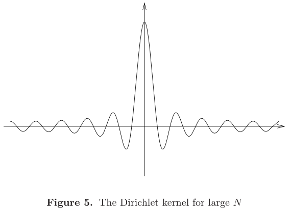

# 第一章

- 参考教材：stein
- 条件
  - F均黎曼可积
  - 认为周期函数是在圆上而不是区间上定义的
  - $2\pi$ 周期函数 $f$ 可以表示为 $F(e^{i\theta}) = f(\theta)$

## 基础知识

- **n阶Fourier系数**（指数表示）：$\hat f(n) = a_n = \frac{1}{L}\int^b_a f(y)e^{-\frac{2n\pi}{L}iy}dy$
- Fourier级数：$f(x) \sim \sum\limits^\infty_{n = -\infty}a_n\cdot e^{\frac{2n\pi}{L}ix}$
- **n阶Dirichlet核**：$D_N(x) = \sum\limits^N_{n=-N} e^{inx}$
  - **Fourier系数**：$a_n = \begin{cases} 1,\quad |n|\leqslant N \\ 0,\quad 其它 \end{cases}$
  - **收敛形式（等比数列）**：$D_N(x) = \large\frac{sin((N+\frac{1}{2})x)}{sin(\frac{x}{2})}$
- **Poisson核**：$P_r(\theta) = \sum\limits^\infty_{n=-\infty} r^{|n|}e^{in\theta}  \quad \theta\in[-\pi,\pi]，r\in[0,1)$
  - **收敛形式（等比数列）**：$P_r(\theta) = \large\frac{1-r^2}{1-2rcosx + r^2}$
- **Fejer核**：$F_N(x) = \large\frac{\sum\limits^{N-1}_{i=0} D_i}{N}$
  - **收敛形式（复变函数三角级数+）**：$\large\frac{1}{N}\frac{sin^2(\frac{Nx}{2})}{sin^2(\frac{x}{2})}$
- 如果仅仅改变可积函数的一个点，不足以改变其傅里叶级数（积分的消奇点性）

### 唯一性

- **（定理2.1）陈纪修收敛原理的弱化**：假设 $f$ 是圆上的可积函数，且所有整数阶Fourier系数均为0，则 $f$ 在所有连续点上值为0
  - **证明**：首先假设 $f$ 是实值函数， $f(0)>0$ 且为连续点，定义域 $[-\pi,\pi]$
    - 构造三角多项式族 $p_k$，使得 $\lim\limits_{k\to\infty} \int p_k(\theta)f(\theta)d\theta = \infty$，则若 $f(0)\neq 0$
    - 设 $p(\theta) = \varepsilon + cos\theta$，该形式具有以下性质：
      1. $|\theta| < \eta$ 时，$p \geqslant 1+\frac{\varepsilon}{2}$
      2. $\eta< |\theta| < \delta$，暂时不管
      3. $\delta < |\theta| < \pi$ 时，$p < 1 + \frac{\varepsilon}{2}$
    - $p_k(\theta) = \big[ p(\theta) \big]^k$
    - 因为Fourier系数为0， $\int^\pi_{-\pi}f(\theta)p_k(\theta)d\theta = 0$
      1. 由积分下界不等式，其上积分 $\geq 2\eta\frac{f(0)}{2}(1+\frac{\varepsilon}{2})^k$，趋近于无穷大
      2. 由函数非负性，其上积分非负
      3. 由积分上界不等式，其上积分 $ \leq 2\pi B(1-\frac{\varepsilon}{2})^k$，趋近于0
   - $f(0)$ 必须为0，否则与Fourier系数为0矛盾
   - **推广到复数**：$f(\theta)=  u(\theta) + iv(\theta)$，且 $\hat{\overline{f}}(n) = \overline{f(\theta)}$
  - **本质**：三角多项式零峰值法
- **（推论2.2）**：若 $f$ 在圆上连续，且所有整数阶Fourier系数为0，则 $f=0$
- **（推论2.3）**：若 $f$ 在圆上连续，且Fourier系数的部分和绝对收敛，则Fourier级数一致收敛于 $f$
  - $\lim\limits_{N\to\infty} S_N(f)(\theta) = f(\theta)$（关于 $\theta$ 一致）
  - **证明**：系数级数绝对收敛，则与其同阶的Fourier级数也绝对收敛
  - 再由连续性，得Fourier级数的极限函数 $g$ 连续
  - 由交换求积性，得 $f$ 与 $g$ 的Fourier系数相等
  - 将上个推论应用到 $f-g$ 上，则 $f=g$

### 平滑性

- 函数越平滑（多阶可微），Fourier系数衰减（收敛速度）越快
- **（推论2.4）**：圆上的二阶连续可微函数，若其n阶Fourier系数 $\hat f(n) = O(\frac{1}{|n|^2})，|n|\to\infty$，从而Fourier级数绝对一致收敛于 $f$
  - **证明**：由分部积分以及周期性，得到下面的Fouier系数求导性质
    - 再由积分上界不等式 + 绝对值不等式，$2\pi |n|^2\hat f(n) \leqslant B$
  - **推论**：
    - **Fourier系数求导性质**：$\hat f'(n) = in\hat f(n)$
    - 存在连续导数的函数，Fourier系数绝对收敛
    - 满足Holder条件的函数，Fourier系数绝对收敛
- **平滑性**：$f\in C^k$（函数k阶连续可导）

## 卷积

- **卷积**：两个圆周期实变函数在 $[-\pi,\pi]$ 上的 $(f*g)(x) = \frac{1}{2\pi} \int^\pi_{-\pi} f(y)g(x-y)dy$
  - **本质**：
    - 加权平均性
    - 函数的点积
- **Fourier级数的卷积表示**：$S_N(f)(x) = (f*D_N)(x)$
  - 系数是积分（y），后面跟着三角函数的指数形式（x），线性合并得N阶Dirichlet核
- **卷积性质**
  - 对称性（交换律）
    - **证明**：由积分的对称性，固定 $x$ 时，$\int^T_{-T} F(x-y)dy = \int^T_{-T} F(y)dy$（实际上，它就是$F$ 和 $1$ 的卷积），再取 $F(y) = f(y)g(x-y)$ 即可
  - 双线性（积分线性即可）
  - 结合律（累次积分 + 换元）
  - 连续性
    - **弱化条件**：$f$ 和 $g$ 均连续时成立
      - **证明**：定义作差，绝对值不等式 + $g$ 连续 + 积分有界，导出 $\varepsilon$ 不等式
    - **（引理3.2）可积逼近定理**：若 $f$ 是圆上可积有界函数（上界为 $B$），则存在圆上的连续函数列，满足
       
      - $\sup\limits_{x\in[-\pi,\pi]} |f_k(x)| \leqslant B，(\forall k\in N^+)$
       
      - $\lim\limits_{k\to\infty} \int^\pi_{-\pi} |f(x) - f_k(x)|dx =0$
       
      - **证明**：（实分析逼近）
    - **强化条件证明**：$f*g - f_k*g_k$，添项配凑
      - $|(f-f_k)*g|$，积分绝对值不等式 + 数列有界性 + 数列逼近性，得其收敛于0
      - 由卷积对称性，得卷积列 $f_k*g_k$ 一致收敛。再由函数列连续性得卷积连续性
  - 可积性：乘法可积定理
  - **Fourier乘法性**：$\widehat{(f*g)}(n) = \hat f(n)\hat g(n)$
    - **证明**：左式展开，积分换序，卷积对称性传递到积分区间上，从而 $g(x-y)$ 换元为 $x$，从而分离x和y的积分，得到独立乘法，即右式

### 对于卷积意义的解释

- 卷是指翻转，积是指“点积”（相乘并积分）
- 概率论：分布函数求和
- 信号处理：一串信号持续输入并不断衰减。其中f是（输入值）关于（输入时间点）的函数，g是（衰减后的值）关于（输入后经过时间）的函数，则T时刻的总信号存在值为 $(f*g)(T)$
- 机器学习：图像的平滑处理，即将其与边缘值关联起来，那么应该进行某种加权平均。离当前点越远的矩阵元影响越小，即权重越小

## 良核

- **良核 $\{K_n(x)\}^\infty_{n=1}$**：满足下述条件的函数族
  - $\frac{1}{2\pi}\int^\pi_{-\pi} K_n(x)dx = 1，(\forall n\in N^+)$
   
  - $\int^\pi_{-\pi} |K_n(x)|dx \leqslant M$
   
  - $\lim\limits_{n\to\infty}\ \int_{0\leqslant |x| \leqslant \pi} |K_n(x)| dx = 0$
  - **本质**：
    - 性质1+2：良核刻画了将有界的值分配到圆上的方式
    - 性质3：逼近原点处，良核分配的值极大
- **（定理4.1）恒等近似定理**：可积函数的连续点上满足 $\lim\limits_{n\to\infty} (f*K_n)(x) = f(x)$
  - **本质**：良核将 $y$ 的权重全部赋予到原点上，从而 $x-y=x$（详细解释见stein实变第三章）
  - **证明**：收敛定义作差 + 积分绝对值不等式 + 区间分离，良核极大处区间极小（良核积分有界），函数有界处良核为0，同时由函数连续性得到另一个 $\varepsilon$。
  - **推论**：处处连续时可导出一致的结果
- **Fourier级数的推论**：Fourier级数是原函数与Dirichlet核的卷积。若Dirichlet核是良核，则级数收敛。但Dirichlet核只满足第一条性质，不满足第二条， 从而Fourier级数的点态收敛性是复杂的。
   

## 级数的弱收敛性

### Cesaro求和

- **N阶切萨罗均值**：设 $s_n = \sum\limits^\infty_{k=0}c_k$ ，则 $\sigma_N = \large\frac{s_0+...+s_{N-1}}{N}$ 即为N阶切萨罗均值
- **切萨罗可加性**：切萨罗均值若收敛，则收敛到级数和
  - **证明**：应该不难
- **费耶尔（Fejer）定理**：
  - 费耶核的卷积是Fourier级数的Cesaro均值
    - $\sigma_N(f)(x) = \frac{S_0(f)(x) + ... + S_{N-1}(f)(x)}{N} = (f*F_N)(x)$
  - **（引理5.1）**：费耶核是良核，$F_N(x) = \large\frac{1}{N}\frac{sin^2(\frac{Nx}{2})}{sin^2(\frac{x}{2})}$
    - 证明：$sin^2(\frac{x}{2}) \geqslant c_\delta（\delta < |x| < \pi）$，得到积分归零性
  - **（定理5.2）**：圆上可积函数，其任意连续点上Fourier级数切萨罗可加
    - 证明：恒等近似定理即可
  - **（推论5.3）陈纪修收敛弱化定理的另一个证明**：圆上可积函数，若所有Fourier系数均为0，则其在任何连续点上为0（Fourier级数也为0，从而其切萨罗均值为0。由收敛性即可得）
  - **（推论5.4）**：圆上连续函数可被三角多项式一致逼近
    - 证明：Fourier级数的Cesaro部分和即为三角多项式

### Abel求和

- **Abel均值 $A(r)$**
- **Abel可加**：$\forall r\in [0,1)，A(r) = \sum\limits^\infty_{k=1} c_kr^{k}$ 收敛，且 $\lim\limits_{r\to 1} A(r) = s$
- 级数收敛 $\subseteq$ Cesaro可加 $\subseteq$ Abel可加
- **函数的Abel均值**：$A(r)(f)(\theta) = \sum\limits^\infty_{n=-\infty} r^{|n|} a_ne^{in\theta}$
- **泊松定理**：
  - $A_r(f)(\theta) = (f*P_r)(\theta)$
  - **（引理5.5）**：$P_r(\theta) = \sum\limits^\infty_{n= -\infty} r^{|n|}e^{in\theta} =  \large\frac{1-r^2}{1-2rcos\theta + r^2}$，且 $r\to 1$ 时为良核
    - **证明**：易得泊松和一致收敛，从而可交换求积分
      - 分母化为 $(1-r)^2+2r(1-cos\theta) \geqslant c_\delta > 0（\delta < |\theta < \pi|）$，得到积分归零性
  - **（定理5.6）**：圆上的函数，其任意连续点上Fourier级数Abel可加
    - **证明**：Abel弱化性 + 陈纪修 弱化收敛性
  - **（定理5.7）**：单位圆上的可积函数，则其与泊松核的卷积（**泊松积分**） $u(r,\theta) = (f*P_r)(\theta)$ 的性质为
    - u存在两个连续导数，且全微分恒为0
      - **证明**：
    - 在连续点上 $\lim\limits_{r\to 1} u(r,\theta) = f(\theta)$
      - **证明**：
    - 若 $f$ 连续，则u为满足上面两个条件的稳态热方程 $\frac{\partial^2 u}{\partial r^2} + \frac{1}{r}\frac{\partial u}{\partial r} + \frac{1}{r^2}\frac{\partial^2 u}{\partial \theta^2}$ 的唯一解
      - **证明**：设 $v(r,\theta)$ 是满足稳态热方程，且收敛到 $f$ 的数
        - 代入稳态热方程，由指数导数的不变性，约去指数部分，得到Fourier系数的方程 $ a''_n(r) + \frac{1}{r}a'_n(r) - \frac{n^2}{r^2} a_n(r) = 0$
        - 这个方程的解为 $a_n(r) = A_nr^n + B_nr^{-n}$
          - 由Fourier系数与 $r$ 的有界性，$B_n = 0$
          - 由Fourier级数收敛性，$A_n$ 为 $f(\theta)$ 的Fourier系数
          - 由连续函数Fourier级数唯一性，$u=v$