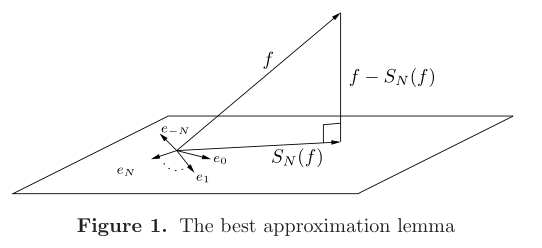
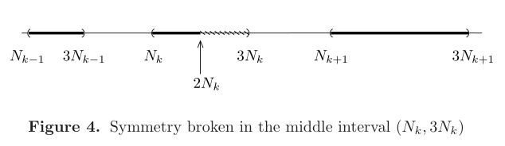

# Fourier级数的收敛性

## 均方收敛（即陈纪修的平方收敛）

- **（定理1.1）均方收敛定理**：若函数在圆上可积，则Fourier级数均方收敛 $\\ \lim\limits_{N\to\infty}\frac{1}{2\pi} \int^{2\pi}_0 |f(\theta)-S_N(f)(\theta)|^2d\theta = 0$

### 正交性理解

- **收敛空间**：$\mathbb{C}$ 上的 $\mathcal{L}^2(\mathbb{Z})$ 是所有满足 $\sum\limits_{n\in\mathbb{Z}} |a_n|^2<\infty$ 的数列的集合
  - **内积**：$(A,B) = \sum\limits_{n\in\mathbb{Z}} a_n\overline{b_n}$
  - **范数**：$\|A\| = \sqrt{\sum\limits_{n\in\mathbb{Z}} a_n^2}$
  - **限制收敛空间**：$A_N \overset{d}{=} (..,0,...,a_{-N},...,a_0,...,a_{N},0,...)$
- **希尔伯特空间**：满足正定性、完备性的内积空间
  - R和C是有限维Hilbert空间，收敛空间是无穷维Hilbert空间
- **准希尔伯特空间**：只满足正定性或完备性的内积空间
- **Riemann可积空间 $\mathcal{R}$**：$\mathbb{C}$ 的圆上黎曼可积函数集合
  - **Hermit内积**：$(A,B) = (f,g) = \frac{1}{2\pi} \int^{2\pi}_0 f(\theta)\overline{g(\theta)}d\theta$
  - **范数**：$\|f\| = \sqrt{\frac{1}{2\pi}\int^{2\pi}_0 |f(\theta)|^2d\theta}$
  - **C-S不等式**：设 $A = \sqrt{\lambda}|f(\theta)|，B = \frac{1}{\sqrt{\lambda}}|g(\theta)|$
    - 对AB运用基本不等式后，两端积分，得到范数下的不等式
    - 再令 $\lambda = \frac{\|g\|}{\|f\|}$，即得C-S不等式
  - **类Hilber性**：
    - 等测正定性：范数为0等价于等测核上为0，但零测差集上不一定，因此不满足正定性。不过因为零测，所以可以忽略？
    - 不完备性：见习题与实变

### 正交性证明

- **正交函数族**：$\{e_n\} = e^{in\theta}$，其满足正交性
  - **内积**：可得Fourier系数 $(f,e_n) = a_n$
  - **投影性质**： $(f-\sum\limits_{|n|\leq N}a_ne_n) \perp \sum\limits_{|n|\leq N}b_ne_n（\forall b_n\in C）$
    - （第一项内积是 $a_nb_n$，第二项内积除 $a_nb_n$ 项外均为0，从而相减得0）
  - **广义勾股定理**：$\|f\|^2 = \|f-\sum\limits_{|n|\leq N}a_ne_n\|^2 + \|\sum\limits_{|n|\leq N}a_ne_n\|^2$，
- **（引理1.2）最佳逼近引理**：圆上可积函数，其Fourier级数满足 $\\ \|f-S_N(f)\| \leqslant \|f-\sum\limits_{|n| \leq N} c_ne_n \|（\forall c_n\in C）$
  - **证明**：因为 $S_N(f) = \sum\limits_{|n| \leq N} a_ne_n$
    - 则添项变形可得 $f-\sum\limits_{|n| \leq N} c_ne_n = f - S_N(f) + \sum\limits_{|n| \leq N} (a_n-c_n)e_n$
    - 应用勾股定理即可
    - 
  - **理解**：每个 $e_n$ 是维度上的正交基，Fourier级数是有效维度贡献的和。再由于级数收敛到函数，因此大于 $|N|$ 的维度贡献值为无穷小
    - 将维度写成线性空间的形式，就是投影不等式（陈纪修）
- **证明均方收敛定理**：$\|f-S_N\|\to 0$
  - 若 $f$ 连续，则可用三角多项式逼近。再因为 $S_N$ 是最佳的三角不等式，即得结果
  - 若 $f$ 仅可积，则由可积逼近定理（见第一节），存在连续函数 $g$ 被控制在 $|f|$ 的上界内，从而 $\|f-g\|^2 \leq B\int |f-g|d\theta \leq \varepsilon$
    - 再因为 $g$ 可被三角逼近，得到结果

### 均方收敛性的等式形式

- **（定理1.3）均方收敛推论**：圆上可积且存在Fourier收敛级数的函数，其均方收敛且Parseval恒等式成立
- **Parseval恒等式**：$\sum\limits^\infty_{n=-\infty} |a_n  |^2 = \|f\|^2$
  - **证明**：由积分线性 + $e_n$ 单位性，$\sum\limits_{|n|\leq N} |a_n  |^2 = \|\sum\limits_{|n| \leq N} a_ne_n\|^2 = \|S_N(f)\|^2$
    - 再用最佳逼近定理即可
  - **理解**：其实前面正交基 + 投影性质 + 广义勾股定理，已经呼之欲出了
  - **推论**：
    - **Bessel不等式**：对于任意正交函数族，设其与函数的内积为 $a_n$，则有 $\sum\limits^\infty_{n=-\infty} \|a_n\|^2 \leqslant \|f\|^2$（P不等式 + 三角不等式）
    - **（定理1.4）Riemann-Lebesgue引理**：圆上可积函数，Fourier系数收敛于0 
      - **等价命题**：圆上可积函数，$\int^{2\pi}_0 f(\theta)sin(N\theta)d\theta \to 0$（$cos$ 同理）（实虚部分比较）
        - **理解**：否则永远有无穷多个有效项
    - **（引理1.5）Parseval恒等式推论**：两个圆上可积函数，均存在收敛Fourier级数，则 $(F,G) = \sum\limits^\infty_{n=-\infty}a_n\overline{b_n}$
      - **证明**：
      - $(F,G) = \frac{1}{4}\big[ \|F+G\|^2 - \|F-G\|^2 + i(\|F+iG\|^2 - \|F-iG\|^2) \big]$
- **不完备性推论**：Fourier系数族 $\{a_n\} \in \mathcal{L}^2(C)$（收敛空间），其为Hilbert空间。再由可积函数不完备性，则存在不收敛于任何函数的Fourier系数族

## 点态收敛

- **（定理2.1）可微收敛定理**：圆上可积函数 $f$，在 $\theta_0$ 处可微，则Fourier级数收敛
  - **证明**：设 $F(t) = \begin{cases} \frac{f(\theta_0-t)-f(\theta_0)}{t}，t\neq 0且|t|<\pi \\ -f'(\theta_0)\quad\ ，t=0\end{cases}$
    - 由可微性，$F$ 在圆上可积
    - $S_N(f)(\theta_0) - f(\theta_0)$，选择Dirichlet核卷积意义，可将右项化为积分再合并，得 $\frac{1}{2\pi}\int^{2\pi}_0 F(t)tD_N(t)dt$（Fourier系数形式）
    - 拆分Dirichlet核，得被积函数连续性。由R-L引理，该积分收敛到0
  - **推论**：只需满足Lipschitz条件也可
- **（定理2.2）局部收敛定理**：若两个圆上可积函数，在 $\theta_0$ 的邻域上相等，则它们的Fourier级数极限相等
  - **证明**：$f-g$ 在邻域中为0，从而可微，从而收敛

### 连续函数发散情况

- **对称破坏**：分离Fourier级数为正负两部分
  - **锯齿函数反例**：
    - 设圆上奇函数 $f$ 在 $(0,\pi)$ 上值为 $i(\pi-\theta)$，可计算得 $f(\theta) \sim \sum\limits_{n\neq 0} \frac{e^{in\theta}}{n}$
    - 取其负部分，则不再收敛到Riemann可积函数
    - **证明**：反设收敛到 $\tilde{f}$，则其0上的Abel均值为 $|A_r(\tilde{f})(0)| = \sum\limits^\infty_{n=1} \frac{r^n}{n}$，其对于r不一致收敛
  - **锯齿函数性质**：设 $f_N(\theta) = \sum\limits_{1\leq|n|\leq N} \large\frac{e^{in\theta}}{n}$，$\tilde{f}_N(\theta)$ 同理。此时有：
    - $|\tilde{f}_N(0)| \geq c\log N$
      - $\sum\limits^N_{n=1}\frac{1}{n} > log N$（调和级数转化为积分级数）
    - $f_N(\theta)$ 一致有界
      - 由下面的引理，此时 $c_n = \large\frac{e^{in\theta}}{n} + \frac{e^{-in\theta}}{-n}$，原级数有界
- **（引理2.3）**：若级数 $\sum\limits^\infty_{n=1}c_n$ 的Abel均值 $r\to 1$ 有界，且 $c_n\sim O(\frac{1}{n})$，则其部分和有界
  - **证明**：
    - 设 $r = 1-\frac{1}{N}$，$n|c_n| \leq M$
    - 作差 $S_n - A_r$，应用三角不等式，提 $c_n$ 公因（适当使用上界不等式），化为 $r$ 的常级数和等比级数，最后得 $|S_n-A_r|\leq 2M$
    - 由 $A_r$ 有界得 $S_N$ 有界
- **N度的三角多项式**：$|n| > N$ 的项均为0（对称中心为0）
  - 构造 $P_N(\theta) = e^{i(2N)\theta}f_N(\theta)$，$\tilde{P}_N(\theta)$ 同理
  - 即将所有度均增加 $2N$。此时不为0的项是 $N\leq n \leq 3N(n\neq 2N)$（对称中心为$N$
- **（引理2.4）对称破坏引理**：部分和的通项为 $S_M(P_N) = \begin{cases} P_N, \quad M\geq 3N \\ \tilde{P}_N, \quad M = 2N \\ 0, \quad M<N \end{cases}$
- **对称破坏性证明**：
  - 找到满足以下性质的两个数列（$\alpha_k = \frac{1}{k^2}$，$N_k = 3^{2^k}$）
    - $N_{k+1} > 3N_k$（*保证P有间隔区间定义域*）
    - $\alpha_k\log N_k\to \infty\ (k\to\infty)$（*导出无界性*）
  - 设 $f(\theta) = \sum\limits^\infty_{k=1} \alpha_k P_{N_k}(\theta)$
  - $f(\theta)$ 收敛到一个圆上连续函数
    - 由对称破坏引理，$|S_{2N_m}(f)(0)| = |\alpha_m\tilde{P}_{N_m}(0) + \sum\limits^{m}_{k=1 , k\neq m} \alpha_k P_{N_k}(0)|$
      - $n$ 从 $1$ 连续加到 $2N_m$，在 $(3N_k,N_{k+1})$ 区间上均为0，在 $(N_k,3N_k)$ 上累加的结果为 $P_{N_k}$，在最后的半个区间 $(N_m,2N_m)$ 上类加成 $\tilde{P}_{N_m}$
       
      - 由于 $P_N$ 只是 $f_N$ 转了度，所以它们模相等，从而 $P_N$ 一致有界，但 $\tilde{P}_N$ 可能无界
    - 由锯齿函数性质，$|S_{2N_m}(f)(0)| \geq c\alpha_m\log N_m + O(1)$
      - 左项是 $k=m（即\tilde{P}_{N_m}）$ 的贡献，右项是 $k\neq m（即\sum P_{N_k}）$ 的贡献
    - 从而 $m\to\infty$ 时无界，而此时 $S(f)(0)\to f(0)$，即在0上连续的函数 $f(\theta)$，其Fourier级数不收敛
