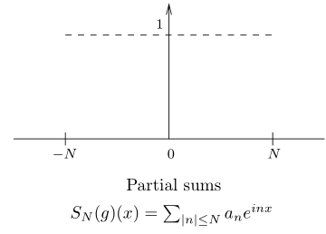
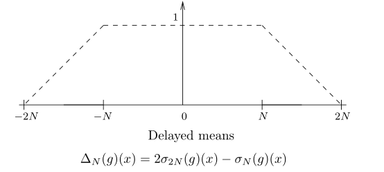

# Fourier级数的应用

## 三个问题

- 等周问题：内部面积最大的等长闭曲线
- 无理数 $\gamma$ 形成的数列 $n\gamma$ 的小数分布规律
- 处处不可导的连续函数

### 等周问题

- **（定理1.1）等周定理**

### 等分布定理

- **有理循环定理**：若 $\gamma$ 是有理数，则 $\{n\gamma\}$ 中只有有限项的小数部分不同
  - **证明**：因为分母的存在，该数列存在周期 $q$
  - **推论**：若是无理数，则均可不同
  - **本质**：类似实分析中Vitali集
- **等分布**：$[0,1)$ 上的数列 $\{\xi_n\}$，若对于 $\forall (a,b)\in[0,1)$，满足  $\lim\limits_{N\to\infty} \large\frac{^\#\{1\leq n\leq N\mid \xi_n\in (a,b)\}}{N} \normalsize = b-a$，则数列等分布
  - **本质**：数列均匀扫过 $[0,1)$
- **（定理2.1）Weyl等分布定理**：无理数的小数部分序列等分布
  - **证明**：
    - 用特征函数表示，则定理转化为：$\lim\limits_{N\to\infty} \frac{1}{N}\sum\limits^N_{n=1} \chi_{(a,b)}(n\gamma) = \int^1_0 \chi_{(a,b)}(x)dx$
    - 由下面的引理，即可证明
  - **（引理2.2）**：周期为1的连续函数满足上式
    - **证明**：
      - 可行域包括三角不等式
        - 若 $f$ 是 $e^{2\pi kx}$，则满足上式（等比收敛形式）
        - 上式的可行域有线性封闭性
      - $\forall f$ 周期为1，可被三角多项式 $P$ 逼近（√）
  - **（推论2.3）**：$[0,1]$ 上任意Riemann可积的周期为1函数符合上式
    - **证明**：取分割，上下界Darboux和，其为特征函数的有限线性组合，从而可分别证明
  - **推论**：设 $\rho^n = \rho\ \omicron\ \rho ...\ \omicron\ \rho = \theta + 2\pi n\gamma$，则时间均值 $\lim\limits_{N\to\infty} \frac{1}{N}\sum\limits^N_{n=1}f(\rho^n(\theta))$ 等于 空间均值 $\frac{1}{2\pi}\int^{2\pi}_0 f(\theta)d\theta$
- **Weyl原则**：实数列 $\{\xi_n\}\in [0,1)$ 等分布 $\Leftrightarrow \forall k\neq 0,\ \lim\limits_{N\to\infty}\frac{1}{N}\sum\limits^N_{n=1}e^{2\pi ik\xi_n} = 0$
- **现实意义**：一个正方形中的射线，若光源坐标是有理数，则形成回路。若是无理数，则形成密集的图形

### 处处不可微的连续函数

- **（定理3.1）无处可微函数**：$f(x) = \sum\limits^\infty_{n=0} 2^{-n\alpha}e^{i2^nx}（\alpha\in (0,1)）$
- **连续性证明**：由绝对收敛，该函数连续
- **无处可微性证明**：若在 $x_0$ 处可微，则由上述引理中的 $g$
  - **缺项傅里叶级数**：周期中出现sin或cos的0值，从而缺少无限多个项的级数
  - 设 $g \sim \sum a_ne^{inx}$
    - **部分和** $S_N = g*D_N$
    - **Cesaro均值** $\sigma_N(g) = g*F_N \\ = \frac{\sum\limits^{N-1}_{\ell = 0}S_\ell(g)(x)}{N} = \frac{1}{N}\sum\limits_{|n|\leq N} (N-|n|)a_ne^{inx} = \sum\limits_{|n|\leq N} (1-\frac{|n|}{N})a_ne^{inx}$
    - **延迟均值**：$\triangle_N (g) = 2\sigma_{2N}(g) - \sigma_N(g)$
      - Cesaro和的Cauchy列形式
      - **本质**：将Cesaro均值延迟到部分和之后 
  
  
  - 综上，可得 $\begin{cases} S_N(f) = \triangle_{N'}(f) \\ N' = \max \{2^k\mid 2^k < N\} \end{cases}$

- **（引理3.2）延迟导数收敛速度**：$x_0$ 上可微的连续函数 $g$，若Cesaro均值的导数 $\sigma_N(g)'(x_0) = O(\log N)$，则延迟均值的导数 $\triangle_N(g)'(x_0) = O(\log N)$
  - **证明**：
    - 首先取 $g$ 和Fejer核的卷积形式
      - 先将导数选在 $F_N'(x_0-t)$ 上，由卷积对称性化为 $F_N'(t)$，由良核对称得 $F_N'(t)$ 积分为0
        - 从而 $\sigma_N(g)'(x_0) = \int^\pi_{-\pi}F_N(t)\big[ g(x_0-t) - g(x_0) \big]dt$
      - 取绝对值，由 $g$ 可微（导数有界） + 积分上界不等式
        - $|\sigma_N(g)'(x_0)| \leq C\int^\pi_{-\pi}|F_N'(t)||t|dt$
    - 再证明 $|F_N'(t)|$ 的上下界
      - 因为Fejer核是Dirichlet核（N度三角多项式，系数小于N）的均值，故 $|F'(t)|\leq (2N+1)N = AN^2$
      - 对Fejer核收敛形式求导，放缩为 $|F'(t)| \leq \frac{A}{|t|^2}$
    - 原积分分离区间得 $CA\int_{|t|\geq \frac{1}{N}}\frac{dt}{|t|} + CAN\int_{|t|<\frac{1}{N}} dt = O(\log N) + O(1)$
- **（引理3.3）延迟均值作差性**：取 $2N = 2^n$，则 $\triangle_{2N}(f) - \triangle_N(f) = 2^{-n\alpha}e^{i2^nx}$
  - **证明**：其等于 $S_{2N} - S_N$
- **最终证明**
  - 其延迟收敛导数为 $O(\log N)$，从而作差形式 $\triangle_{2N}(f) - \triangle_N(f) = O(\log N)$
  - 但作差形式的绝对值却 $= 2^{n(1-\alpha)} \geq cN^{1-\alpha}$，从而得到矛盾
- **推论**：该函数不仅复数域上不可微，实部和虚部也均不可微
- （未完，先不写了）