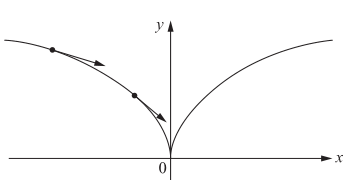
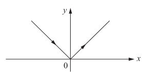
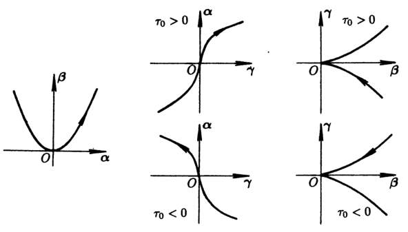

# 曲线理论

- [前置知识](../数学分析/多元函数微分学/4.基础微分几何.md)
- **符号约定**：
  - 本节所有空间默认为 $E^2$ 或 $E^3$
  - $r$ 表示曲线的位置矢量，$t$ 表示时间指数，$s$ 表示弧长指数，$a,b$ 表示曲线的端点（如果存在的话）
  - 为了方便表述，设切向量 $\bs t(s) = r'(s)$。它和时间指数的 $t$ 仅符号相同，彼此没有关系

## 曲线的表示方法

### 曲线的光滑性

- **曲线的参数表示**：$\bs r(t) = \Big( x(t),y(t) \Big)，t\in (a,b)$
- **几何光滑曲线**：切向量非零且连续转动的曲线。全体几何光滑曲线写为 $C^1$
  - 实际上就是参数形式下，分量函数均连续可微的曲线
- **光滑曲线**：无穷阶连续可微的曲线。全体光滑曲线写为 $C^\infty$
  - **实例**：$\bs r(t) = \Big( t,\sin t \Big)\in C^\infty$
- **曲线的奇点**：切向量为 $\bs 0$ 的点
  - 若参数曲线 $r(t)$ 上某点满足 $\|r'(t_0)\|_2 = 0$，则 $r(t_0)$ 称为该曲线的奇点
  - **实例**：曲线 $\bs r(t) = (t^3,t^2)$，在 $t = 0$ 处可微，导数为 $0$，是奇点（切向量的模不变，但发生180°转动）
  
  - **反例**：曲线 $\bs r(t) = (t,|t|)$ 中，$t = 0$ 处不可微，是不可微点，而不是奇点（切向量发生跳跃）
  
- **曲线的正则点**：切向量非零的点
- **曲线的切向量**：$\bs r'(t) = \Big( x'(t),y'(t) \Big) = \Big( 1,y'(x) \Big)$
  - **速度性**：切向量又称为速度向量
    - **微分证明**：$\cfrac{d\bs r}{dt} = \bs r'(t)$，若 $t$ 是时间指数，那么显然 $\bs r'(t)$ 就是速度指数
    - **积分证明（弧长积分公式）**：设 $s(t_0)$ 表示曲线从 $t=c$ 到 $t=t_0$ 的弧长，则 $s(t) = \dis\int^t_c |\bs r'(u)|du$
- **正则曲线**：分量函数均无穷可微、无奇点的曲线
  - 正则曲线定义为光滑无奇点曲线，因为我们希望它具有良好的形状和性质
  - **实例**：
    - 隐函数曲线 $C:F(x,y) = 0$，满足 $\exists F_y(x_0,y_0)\neq 0$
      - **证明**：由隐函数定理，存在邻域 $U$，其中有显函数表示，且曲线可微
  - **反例（光滑非正则曲线）**：
    - $r(t) = (t^3,t^2)$，其在 $t=0$ 处光滑，但不是正则点
      - 曲线光滑性的本质是：切向量是连续变动的。因此光滑和几何直觉稍微相悖

### 曲线的参数表示

- **位置矢量 $r$**
- **时间指数 $t$**：
  - 速度可定义为当 $t$ 增加一个单位时，位置矢量 $r$ 沿曲线的移动量。所以 $t$ 又称为时间指数
  - **实例**：
    - 平面圆周 $\bs r(t) = (R\sin t,R\cos t)$，时间指数为 $(0,1)$ 向右的角度（角速度）
    - 三维球面 $\bs r(u,v) = (R\sin u\sin v , R\cos u\sin v, R\cos v)$，是两个垂直的三维圆张成的曲面，时间指数为两个垂直角度（球坐标的直角系表示）
- **弧长指数 $s$**：正则曲线均存在弧长函数 $s(t) = \dis\int^t_c |\bs r'(u)|du$，且存在反函数 $t(s)$，从而可用 $s$ 作为参数表示 $\bs r$
  - **证明**：
    - 由正则曲线光滑性，弧长上限函数总存在
    - 由正则曲线切向量非零，$s(t)$ 单增非零，从而总存在可微反函数 $t(s)$
    - 正则曲线的性质一个不落地全都利用上了，也许正则曲线就是为了取弧长参数才这么定义的
  - **速度-弧长公式**：$\bs r'(s)$ 是单位切向量
    - **证明**：
      - 易得 $\biggm|\cfrac{dr}{ds}\biggm| = \biggm|\cfrac{dr}{dt}\cdot\cfrac{dt}{ds}\biggm| = \biggm|r'(t)\biggm|\cdot\biggm|\cfrac{1}{r'(t)}\biggm| = 1$
    - **本质**：以 $s$ 为参数时，运动速度恒为 $1$
  - **实例**：
    - 平面圆 $r(s) = (R\sin\dfrac{s}{R}, R\cos\dfrac{s}{R})$，以 $(0,1)$ 为起点
      - 此时 $r'(s)$ 表示线速度
    - 三维球面 $r(s_1,s_2) = (R\sin\dfrac{s_1}{R}\sin\dfrac{s_2}{R}， R\cos\dfrac{s_1}{R}\sin\dfrac{s_2}{R}， R\cos\dfrac{s_2}{R})$，以 $(1,0,0)$ 为起点
      - $s_1,s_2$ 分别是两个曲线基的弧长
<!-- - **速度-弧长公式**
  - **切向量的速度意义**：$\bs t'(s) = \dfrac{d\bs t}{ds} = \dfrac{d\bs t}{dt}\cdot \dfrac{dt}{ds} = \bs t'(t)\cdot \dfrac{dt}{ds}$
    - 也就是说，时间指数 $t$ 表示的切向量，和弧长指数表示的切向量，它们的长度相差一个因子 $\dfrac{dt}{ds}$，易得该因子即为速度与弧长的比
  - **正则曲线的弧长表示**：单位切向量 $|\bs t(s)| = |\dfrac{dr}{ds}| = |\dfrac{dr}{dt}\dfrac{dt}{ds}| = \dfrac{ds}{dt}\dfrac{dt}{ds} = 1$
    - $t$ 的意义是曲线切向量的长度（速度），$s(t)$ 的意义是参数移动单位距离时，弧长相应移动多少，$\bs t(s)$ 的意义是弧长移动单位距离时，参数相应移动多少
    - 由 $r$ 位矢性（数学意义）或 $s$ 上限函数性（数学本质），在对 $t$ 求导时，$s$ 和 $r$ 是相同的 -->
  - 弧长指数有很多良好性质，故前两节都倾向于使用弧长参数表示曲线

## 二维曲线

### Frenet标架

- **位矢**：$\bs r(s)$ 表示（点 $s(0)$ 沿曲线走过 $s(t)$ 弧长后到达的点）在空间中的坐标
  - 曲线的弧长参数表示中，需要先选定一个起始点 $s(0)$，这样其它点都可以用到起始点的弧长来表示。
- **单位切向量**：规定 $\bs t(s)$ 表示 $\bs r'(s)$
  - 这么写其实是为了和单位法向量 $\bs n(s)$ 统一起来，不然一个导数向量和一个函数向量放一起比较别扭
- **单位法向量**：规定 $\bs n(s)$ 表示和 $\bs t(s)$ 垂直的向量，即单位法向量
- **曲线上某点的Frenet标架**：以参数曲线上某点 $r(s)$ 为原点，单位切向量 $\bs t(s)$ 和单位法向量 $\bs n(s)$ 构成的标架 $\set{r(s);\pad \bs t(s),\bs n(s)}$
  - 标架不同于坐标轴。坐标轴是为了描述一个空间中点的位置，故它在空间中是固定的。而标架是为了描述曲线上某点的切向量、法向量等的关系，故它是随着点沿曲线运动而不断变化的。

### 二维曲线的曲率

- **曲率**：
  - 内积表述 ：$\kappa(s) = \lang \bs t',\bs n \rang$
    - 内积表述是最本质的表述，它是 $t'$ 在 $n$ 方向上的投影长度 $|t'(s)|\cos$。再由于 $t'$ 和 $n$ 是同向的，故 $\cos = 1$
  - 比率表述：$\bs t'(s) = \kappa(s)\bs n(s)$
    - 由内积表述直得
  - 常值表述：$\kappa(s) = |\bs t'(s)|$
    - 由比率表述或内积表述都可直得
  - **几何意义**：
    - 切向量转动的速率
      - 切向量导数的模长
    - 曲线的弯曲程度
      - 法向量表示转向速度，切向量表示移动速度，故 $\bs t'(s) \parallel \bs n(s)$。再已知转向速度与曲线的弯曲程度正相关，故得到结论
    - 曲线运动的加速度大小
      - 因此我们也可看到，曲线方程Taylor展开后，曲率出现在二阶近似项中
  - **实例**：
    - 直线的曲率：$\kappa\equiv 0$
    - 圆的曲率：$\kappa \equiv \dfrac{1}{r}\neq 0$
- **曲率方程（Frenet公式）**：$$\cfrac{d}{ds}\begin{bmatrix} \bs t(s) \\ \bs n(s) \end{bmatrix}  = \begin{bmatrix}  & \kappa(s) \\ -\kappa(s) &  \end{bmatrix}\begin{bmatrix} \bs t(s) \\ \bs n(s) \end{bmatrix}$$
  - **证明**：
    - 对 $\begin{cases} \lang \bs t,\bs t \rang = 1 \\ \lang \bs t,\bs n \rang = 0 \end{cases}$ 求导（内积微分公式）即可
  - **理解**：
    - 由于 $\bs t(s)$ 是单位切向量，故长度恒定，只会改变方向，即总是做圆周运动。故导数就是垂直向量，即法向量
    - 对 $\bs n(s)$ 同理
- **Gauss映射**：将曲线上某点的弧长参数映射为该点法向量 $g:\G\to S^1，s\mapsto \bs n(s)$
  - 高斯映射主要在曲面中用的多
- **高斯映射曲率定理**：Gauss映射下，$n(s+\D s) \overset{曲率方程}{=} n(s) - \kappa(s)t(s)\D s + \cdots$
  - **证明**：
    - 由泰勒展开 + 曲率方程易得结论
  - **几何意义**：
    - 由于 $t(s)$ 是单位切向量，故 $|\kappa(s)|$ 也可表示 $s$ 变化时，像点在单位圆上转动的速率（$\kappa(s) > 0$ 时为逆时针）

### 习题

- **求曲线弧长公式**：定义即可，无论是数分法还是积分法，最后都会回归到 $s = \sqrt{(x')^2 + (y')^2}$ 上来
- **曲率参数公式**：$\kappa(t) = \cfrac{x'y''-x''y'}{[(x')^2+(y')^2]^{\frac{3}{2}}}\pad (t) = \Big[\cfrac{(x'')^2+(y'')^2}{(x')^2+(y')^2}\Big]^{\dfrac{1}{2}}\pad(s)$
  - **证明（前式，旋转法）**：先求
  - **证明（后式，换元法）**：后式没什么用…… $s''(t)$ 太难算了
  - **本质**：就是考察换元法。把换元法折腾明白了就好了
- **曲率极坐标公式**：$\kappa(\t) = \cfrac{\rho^2 + 2(\rho')^2 - \rho\rho''}{[\rho^2+(\rho')^2]^{\frac{3}{2}}}$
  - 坐标系和坐标是两个不同的概念。$(\rho\cos\t,\rho\sin\t)$ 是直角坐标系中的极坐标，$(\rho,\t)$ 是极坐标系中的极坐标。坐标变换的本质是把坐标系变换，从而对所有坐标建立对应，然后把原像的坐标代入对应关系  
  - **本质**：
- **已知每点曲率，求平面曲线**

## 三维曲线

### Frenet标架

- **主法向量**：设 $\bs t'(s) = \cfrac{d^2\bs r}{ds^2}$，则 $\bs n(s) = \dfrac{1}{\kappa(s)}\bs t'(s)$ 称为主法向量
  - 上面的 $\bs t'(s)$ 实际上就是曲线加速度向量
  - 因为三维曲线法向量不唯一，故取一个主法向量，即 $\bs t'(s)$ 方向上的单位向量
- **曲率**：$\kappa(s) = |\bs t'(s)| = \sqrt{(x'')^2 + (y'')^2 + (z'')^2}$
  - **几何意义**：三维曲线在主法向上的弯曲程度
- **副法向量**：$\bs{b}(s) = \bs t(s)\land \bs{n}(s)$
  - 正则曲线中，切向量 $\bs t$ 连续变动。如果我们只考虑曲线切向量的当前移动趋势，则只需退到一个平面上研究即可（即切向量 $\bs t$ 和导数向量 $\bs t'$ 张成的平面，密切平面）。故曲率的定义还和原来不变
  - 但显然整体的三维曲线不一定只处在同一个平面，也就是说，每个微分段中，还存在一个无法只用一阶导数 $t'$ 表出的向量 $\bs b$，它使曲线偏离本来的平面。
    - 二维曲线中，$\bs t''$ 的含义是切向量运动的加速度向量，由于平面只有两个方向的限制，它的方向只能和切向相同，故也可称其为加速率
      - 同时 $\bs t''$ 还可以是法向量 $|\bs t|\bs n$ 的速度，即 $\bs t''ds$ 是法向量 $|\bs t|\bs n$ 的偏移量。但因为 $|\bs t|\bs n$ 只能在切向上偏移，故在二维中没什么用
    - 而三维曲线中，出现了第三个方向
      - 取切向量的一阶导数时，它表示切向量的转动向量（即偏离当前直线的方向和速率）（即主法向量 $|\kappa|\bs n$）。无论往哪个方向偏，我们都只需要取（偏离方向和当前直线所处的平面）（即 $\bs t, \bs t'$ 张成的平面）即可
      - 取切向量的二阶导数时，它表示（切向量的转动向量）的转动向量。由于不一定往什么方向偏移，所以应当取它在垂直于 $\bs t,\bs t'$ 平面方向（即 $\bs b$ 方向）上的投影，即取内积 $\lang \bs n',\bs b \rang$
  - 从上面的讨论中发现，$b$ 方向上的偏移量，即三维曲线脱离密切平面的趋势，在切向量（速度向量）的一阶导数中无法表出，但在二阶导数中可以表出
  - 为此我们可以提出一个很有意思的猜想：越高阶的导数，其与函数整体情况的相关性越强。事实上，通过对曲线Taylor展开，由Taylor级数的收敛域理论，就可以为此提供佐证（越是高阶的项，其收敛域越狭窄）。而物理上的例子则是，在曲线运动各初值已知的情况下，知道加速度比只知道速度更能推出运动和偏移了多少
- **单位向量性**：$\bs t,\bs n,\bs b$ 是相互正交的单位向量
  - **证明**：
    - 只需证明 $\bs b$ 是单位向量即可
    - 易得 $|\bs b| = |\bs t||\bs n|\sin (\bs t,\bs n) = 1$
      - 根据定义即可
    - 易得 $|\bs b'| = |\bs 0 + \bs n'\land \bs t| = |\bs n'|\sin(\bs t,\bs n')$
      - 外积求导公式计算即可
- **Frenet标架**：$\set{r(s);\pad \bs t(s),\bs n(s),\bs b(s)}$
  - **坐标向量**：
    - 切向量
    - 主法向量
    - 副法向量
  - **坐标平面**：
    - **法平面**（由 $\bs b$ 和 $\bs n$ 张成，垂直于 $t$），穿过该平面的速度是速率
    - **密切平面**（由 $\bs t$ 和 $\bs n$ 张成，垂直于 $b$），偏离该平面的速度是挠率 
    - **从切平面**（由 $\bs t$ 和 $\bs b$ 张成，垂直于 $n$），偏离该平面的速度是曲率

### 三维曲线的挠率

- **挠率**：
  - 内积表述：$\tau = \lang \bs n',\bs b \rang$
    - 内积表述是最本质的表述
  - 比率表述：$\bs b' = -\tau \bs n$
    - 由外积求导公式 $\bs b' = \bs t'\land \bs n +\bs t\land \bs n' = \bs t\land \bs n'$
    - 由 $\begin{cases} \lang \bs n',\bs t \rang = -\kappa \\ \lang \bs n',\bs b \rang  = \tau \end{cases}$ 且 $\bs n'$ 与 $\bs t,\bs b$ 共面，可得 $\bs n' = -\kappa\bs t + \tau\bs b$
    - 结合上面两个等式即得结论
  - 常值表述：$\tau = -|b'(s)|$
    - 由比率表述可直得
- **挠率方程（Frenet公式）**：$\cfrac{d}{ds}\begin{bmatrix} \bs t \\ \bs n \\ \bs b \end{bmatrix} = \begin{bmatrix} & \kappa & \\ -\kappa & & \tau \\ & -\tau &  \end{bmatrix}\begin{bmatrix} \bs t \\ \bs n \\ \bs b \end{bmatrix}$
  - **证明**：
    - 根据挠率的三个表述易得结论
  - **本质**：
    - Frenet标架是曲线前三阶导数向量经过正交化的结果
    - 曲线的更高阶导数也能表成Frenet标架向量的线性组合，系数是曲率挠率与各阶导数
  - **几何意义**：曲线在副法向上的弯曲程度
    - 曲率 $\kappa$ 是 $\lang\bs t',\bs n\rang = -\lang \bs n',\bs t \rang  = |t'|$，即密切平面内，$t$ 变化量在主法向上的投影，表示曲线移动微元弧长 $ds$ 时，曲线在主法向上转动的长度
    - 挠率 $\tau$ 是 $\lang \bs n',\bs b \rang = \lang \pad( |t|\bs n)',\bs e_b \pad \rang$，即法平面内，$|t|n$ 变化量在副法向上的投影，表示曲线移动微元弧长 $ds$ 时，曲线在副法向上偏移的长度
      - 因为 $t'$ 所在方向永远是主法向，所以 $t$ 变化量无论如何也无法表示副法向偏移量的
- **退化定理**：设空间曲线 $\bs r$ 的曲率 $\kappa > 0$，则 $r$ 在平面上 $\LR \tau\equiv 0$
  - **引理（挠率弧长公式）** $\tau(s) = \dfrac{(r',r'',r''')}{|r''|^2}(s)$
    - **证**：已知 $b' = -\tau n$，再由 $t = r'，n = \dfrac{r''}{|r''|}，b = t\land n$ 即得结论
  - **理解**：挠率的本质是，使曲线偏离当前微分段所处平面的程度。故其为0时退化为2维平面直线
  - **反例（挠率为零的三维曲线）**：$$ \bs r(t) = \begin{cases} (t,0,e^{-\dfrac{1}{t^2}}) & t>0 \\\\ (t,e^{-\dfrac{1}{t^2}},0) & t<0 \\\\ (0,0,0) & t=0 \end{cases} $$
    - **证明**：易得它是可微无奇点的曲线，但是 $\kappa(0) = 0，\tau\equiv 0$
      - 当 $t\to 0+$ 时密切平面的极限是平面 $y=0$
      - 当 $t\to 0-$ 时密切平面的极限是平面 $z=0$
      - 法向量在 $\kappa = 0$ 处不连续，从而即使挠率非零，也是立体曲线

### 习题

- **求三维曲率、挠率**：换元公式基本不用，还是几何公式方便
  - **曲率参数公式**：
    - **换元公式**：$\kappa = |\bs t'(s)|$，然后再换元
    - **几何公式**：$\kappa = \cfrac{|r'(t)\land r''(t)|}{|r'(t)|^3} = \cfrac{\vvec{y' & z' \\ y'' & z''}^2 + \vvec{x' & z' \\ x'' & z''}^2 + \vvec{x' & y' \\ x'' & y''}^2}{[(x')^2+(y')^2+(z')^2]^{\frac{3}{2}}}\pad (t)$
      - **证明（数学本质）**：分母易得，分子用行列式与外积关系即可
      - **证明（数学意义）**：$r'(t) = |\bs t|\bs t_e$，求导得 $r''(t) = \kappa\bs n\cdot |\bs t|^2 + \bs t_e(|\bs t|)'$
        - 两边对 $\bs t_e$ 外积即可得到结论
  - **挠率参数公式**：
    - **换元公式**：难
    - **几何公式**：$\tau = \cfrac{(r',r'',r''')}{|r'\land r''|^2}(t)$
      - **证明（数学意义）**：仿照曲率公式，再求 $r'''(t)$，然后计算即可
   
- 球面上曲线满足 $(\dfrac{1}{\kappa(s)})^2 + (\dfrac{1}{\tau(s)}\dfrac{d}{ds}(\dfrac{1}{\kappa(s)}))^2 = C$
  - **证明**：
- 设 $l$ 是 $P_0$ 附近的切线，则 $\lim\limits_{P\to P_0} \dfrac{2d(P,l)}{d^2(P,P_0)} = \kappa(P_0)$
  - **证明**：
- 三维弧长参数曲线满足
  - $(r',r'',r''') = \kappa^2\tau$
  - $(t',t'',t''') = \kappa^5\cdot \dfrac{d}{ds}(\dfrac{\tau}{\kappa})$

#### 派生曲线

- **切线像**：单位切向量移动过程中，在单位球上形成的曲线
  - 曲率 $\wt \kappa = \sqrt{1+(\dfrac{\tau}{\kappa})^2}$
  - 挠率 $\wt \tau = \cfrac{\frac{d}{ds}(\frac{\tau}{\kappa})}{\kappa[1+(\frac{\tau}{\kappa})^2]}$
- **副法向曲线**：副法向量移动过程中，在 $E^3$ 上形成的曲线
  - 弧长参数不变
  - $\wt \kappa = \tau，\wt\tau = \kappa$
- **反向曲线**：
  - 平面曲线：$\wt\kappa = -\kappa(-t)$
  - 三维曲线：$\wt \kappa = \kappa(-t)，\wt\tau = \tau(-t)$

## 不同曲线的关系

### 曲线的近似

- **曲线的渐进展开**：取 $s_0 = 0$，将 $\bs r(s)$ 在 $s_0$ 处三阶Taylor展开
  - 由曲率方程，$\begin{cases} \bs r'(0) = \bs t(0) \\ \bs r''(0) = \kappa(0)\bs n(0) \\ \bs r'''(0) = \kappa'\bs n - \kappa^2 \bs t + \kappa\tau \bs b \end{cases}$
  - 代入得在Frenet标架上三个方向的分量为：$\begin{cases} x(s) = s-\dfrac{\kappa^2}{6}s^3 + \e_x & t方向 \\\\ y(s) = \dfrac{\kappa}{2}s^2 + \dfrac{\kappa}{6}s^3 + \e_y & n方向 \\\\ z(s) = \dfrac{\kappa\tau}{6}s^3+\e_z & b方向 \end{cases}$
  - 这三个分量组成曲线的渐近展开（又称**局部规范形式**）
- **近似曲线**：取三个分量中最低阶项，组成曲线 $\wt r(s) = (s,\dfrac{\kappa_0}{2}s^2, \dfrac{\kappa_0\tau_0}{6}s^3)$（此时 $s$ 不为弧长）
  - 易得曲率为 $|\wt r''(0)| = \kappa_0$，挠率为 $\dfrac{(r',r'',r''')}{|r''|^2} = \tau_0$，从而标架、曲率、挠率均不变，可反映原曲线的局部性质
  - 下面三个图依次是近似曲线在密切平面（t,n）、从切平面（t,b）、法平面（n,b）上的投影
  
- **切触**：
  - **定义**：
    - 设两条曲线的交点为 $p_0$，$\begin{cases} p_1 = p_0+\D s  & 曲线1上 \\ p_2 = p_0+\D s & 曲线2上 \end{cases}$
    - 若 $\lim\limits_{\D s\to 0} \cfrac{|p_1p_2|}{(\D s)^n} = 0，\lim\limits_{\D s\to 0} \cfrac{|p_1p_2|}{(\D s)^{n+1}} \neq 0$，则称两曲线在 $p_0$ 有 $n$ 阶切触
    - 即两曲线在交点处的渐进展开，直到 $n$ 阶项都相同
    - 它描述了两条相交曲线在交点附近的近似程度
  - **存在条件**：在 $s = 0$ 处有 $n$ 阶切触 $\LR r_1^{(i)}(0) = r_2^{(i)}(0)\pad (\forall 1\leq i\leq n)$ 且下一阶导数不等
    - **证明**：此时 $r_1(s) - r_2(s)$ 的Taylor展开只有第 $n+1$ 次项后才不为0，代入定义即得结论
  - **推论**：
    - 正则曲线与其切线至少有1阶切触，与其近似曲线至少有两阶切触
    - $r_1,r_2$ 至少具有两阶切触 $\LR r_1,r_2$ 相切、密切平面相同、曲率相同
- **密切圆**：与曲线有二阶切触的圆
  - **位置**：$r(s_0)$ 的密切平面上，$\bs r(s_0) + \cfrac{\bs n(s_0)}{\kappa(s_0)}$ 为圆心（**曲率中心**），$\cfrac{1}{\kappa(s_0)}$ 为半径（**曲率半径**）的圆
  - 只需证明曲率圆的圆心位置即可。显然可以退化到二维
  - 再由于 $\bs n$ 是单位向量，$\dfrac{1}{\kappa}$ 是曲率圆半径，该结论是显然的
- **密切球面**：与曲线有三阶以上切触的球面
  - **球心**：$r + \cfrac{1}{\kappa}n + \cfrac{1}{\tau}(\cfrac{1}{\kappa})'b$
  - **半径**：$\Big[ (\cfrac{1}{\kappa})^2 + \Big( \cfrac{1}{\tau}(\cfrac{1}{\kappa})' \Big)^2 \Big]^{\dfrac{1}{2}}$
  - **曲率轴**：通过曲率中心，垂直于密切平面的直线 $r + \cfrac{1}{\kappa}n + \l b$

### 决定曲线的参量

- **参数变换**：$t = t(u)$
  - **同定向参数**：$\dfrac{dt}{du} > 0$
  - **本质**：参数变换改变的是速度大小，如 $r(t)\to r(s)$ 就是把速度变为1
- **刚体运动不变性**：弧长、曲率、挠率在刚体运动下不变
  - **证明**：
    - 设 $\mc T(P) = PT + P_0\quad (T\in O(3),P_0\in E^3)$ 是刚体运动，$\det T = 1$，$r(s)$ 是弧长参数曲线，$\tilde{r} = \mc T\circ r$
    - **弧长不变性**：由等距性，$s$ 也是 $\tilde{r}$ 的弧长参数
    - **曲率不变性**：此时由，变换后速度为 $\tilde t = \dfrac{d\tilde r}{ds} = \dfrac{d\bs r}{dt}T = \bs tT$，$\dfrac{d\tilde t}{ds} =  \dfrac{d\tilde t}{ds} = T$，从而 $\tilde{n} = nT$，即 $\tilde\kappa = \kappa$
    - **挠率不变性**：由定向相同性，$\tilde b = \tilde{t}\land \tilde{n} = (tT)\land (nT) = (t\land n)T$，从而 $\tilde{b} = bT$，则 $\tilde\tau = |\tilde b'| = |b'|\det T =  \tau$
- **同构性定理**：端点、曲率、挠率都相同的两个曲线可被刚体运动互换
  - **证明**：    
    - 由Frenet公式易得 $\dfrac{d}{ds}(|t-\ol t|^2 + |n-\ol n|^2 + |b-\ol b|^2) = 0$，从而 $r = \ol r + C$
    - 由欧氏变换群与标架的一一对应性，任取弧长 $s_0$，存在刚体运动使得运动后的两曲线满足 $r(s_0) =  \ol r(s_0)$，从而 $C = 0$
    - 最后由 $s_0$ 的任意性即得刚体运动下的唯一性
- **曲线论基本定理**：若给定可微函数 $\kappa(s) > 0,\tau(s)$，则存在对应的正则参数曲线，且在刚体运动意义下唯一
  - **证明**：由Frenet公式 + 常微分方程解的存在唯一性即可

### 曲线偶

- **Bertrand曲线偶**：一对互不重合的曲线，若存在一一对应，使每个对应点有公共主法线，则称两曲线构成曲线偶
  - 即对应点的距离和切线夹角始终不变
  - **侣线（共轭曲线）**：构成曲线偶的两个曲线
- **平移公式**：曲线族 $\bs R_a(s) = \bs r(s) + a \bs n(s)$ 是 $\bs r$ 的全部侣线
  - 平面曲线的主法线是唯一的，故易得侣线只能是主法线方向平移
- **线性约束定理**：侣线都满足线性约束关系 $\l\kappa + \mu\tau = 1$
  - **证明**：
    - 由Frenet公式易得 $\dfrac{d\bs R}{ds} = (1-a\kappa)\bs t + a\tau \bs b$
      - 也就是说，$\bs R$ 的切向量总是位于 $\bs r$ 的法平面内
    <!-- - 由主法向量的公共性，$\dfrac{d\bs R}{ds}\cdot \bs n = 0$ -->
    - 对上式再次求导，由Frenet公式得 $\cfrac{d}{ds}\dkh{\cfrac{1-a\kappa}{\tau}} = 0$，从而得到线性关系
  - 从几何上来看，为了保持法线的平行，我们在改变曲线时，必须按照特定比例扭转，以补偿法平面在空间的旋转

### 习题

- **验证两曲线是否合同**
  - **解**：只需看曲率和挠率是否相同即可
- 曲率和挠率均为常数的曲线是圆螺旋线 $r = (a\cos t,a\sin t,bt)$
- 欧氏变换下，弧长、曲率、挠率值不变，符号可能改变（参考刚体运动）
