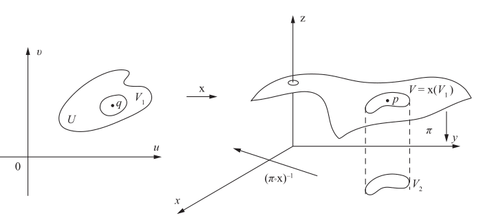

# 正则曲面及其参数化

- **符号约定**：
  - $S$ 表示正则曲面，$X$ 表示参数化映射
  - $U$ 表示开集
    - 为了防止边界处无法定义微分的问题，参数化映射必须定义在开集上

## 正则曲面

- 古典微分几何研究的曲面都是正则曲面，它保证切平面存在且唯一
- **简单正则参数曲面**：参数函数满足同胚性、光滑性、正则性的曲面
  - 这是数分中计算曲面积分时的规定，但是它有点太强了，微分几何一般用下面的规定
- **正则参数曲面**：参数函数满足光滑性、正则性的曲面
  - 没有要求它是简单曲面。因为我们在研究一些复杂曲面时，往往需要先研究局部，再将多个正则参数曲面拼凑起来。而拼凑时如果要求不能自相交会非常麻烦
  - 正则参数曲面的定义依赖于具体的坐标系与参数函数，而微分几何中不能这样。所以有了正则曲面的定义。但具体研究时，仍然需要落到正则参数曲面上来（参数化）
- **正则曲面**：
  - **定义**：
    - 设 $S$ 是 $\R^3$ 中的子集
    - 若对任意点 $p\in S$，都存在邻域 $V$、开集 $U\subset \R^2$、映射 $X_p:U\to V\cap S$ 满足 $X_p$ 是简单正则参数曲面
    - 则称 $S$ 是正则曲面
    - 这里是逐点定义。它和数分中的整体定义逻辑上完全相同，但应用上有区别
      - 微分几何是给一个点集，判断它是什么曲面。所以逐点定义
      - 数分是给一个曲面方程，判断它是否正则。所以整体定义
      - 另外，数分中是给好了坐标系和参数，而微分几何还要研究一个参数化的过程，所以它的定义不依赖于参数选取
  - **临界值**：设 $F:(U\subset \R^n)\to \R^m$ 光滑，若 $dF_p$ 不是满射，则 $p$ 称为**临界点**，$F(p)$ 称为**临界值**
    - 即雅可比矩阵退化的点
  - **正则值**：$F(U)$ 中非临界值的点
- **显判定定理**：若二元函数 $f$ 光滑，则其确定的显格式曲面是正则曲面
  - 显然
- **隐判定定理**：若三元函数 $f$ 光滑，且 $a\in f(U)$ 是 $f$ 的正则值，则 $f^{-1}(a)$ 是正则曲面
    - 由于是正则值，故雅可比矩阵非退化。再由隐函数存在定理，$f^{-1}(a)$ 存在

### 正则曲面的参数化

- **微分同胚**：若光滑映射的逆映射也光滑，则称为微分同胚
  - 类似同胚是连续范畴的同构，微分同胚是光滑范畴中的同构
  - 正则曲面的参数变换必须是微分同胚
- **参数化**：将给定的正则曲面表示成参数函数 $\bs r(u,v)$
- **参数光滑定理**：正则曲面的参数化函数必定光滑
  - **证明**：由定义中局部参数化的双射性 + 光滑性，即得整体参数化也光滑
- **局部显参数化定理**：正则曲面一定可局部参数化为显格式 $z(x,y)$
  - **证明**：
    - 设 $X:(U\subset \R^2)\to \R^3，(u,v)\mapsto (x,y,z)$ 是正则曲面的参数化
    - 取投影映射 $\pi:\R^3\to \R^2，(x,y,z)\mapsto (x,y)$
      - 由反函数定理，存在某点 $q\in U$ 的邻域 $V_1$ 和 $\pi X(q)$ 的邻域 $V_2$，使得 $\pi X(V_1) = V_2$ 是微分同胚
    - 此时 $(\pi X)^{-1}:V_2\to V_1，(x,y)\mapsto (u,v)$
      - 由于反函数定理的限制，这里必须取局部定义域
    - 再取分量映射 $X_z:(u,v)\mapsto z$，则 $X_z(\pi X)^{-1}$ 就是局部显格式参数化
    
  - **反例**：
    - 球面不可能整体参数化为 $z(x,y)$ 格式
- **参数化简化定理**：
  - 设 $S$ 是正则曲面，$X:(U\subset \R^2)\to \R^3$ 是向量值函数
  - 若 $X(U) \subset S$，且满足光滑性、正则性、双射性
  - 则 $X$ 是同胚映射
  -  这个定理说明，给定正则曲面，要将其参数化时，不需要验证逆连续性。所以数分中的定义更加简洁
  - **证明**：
    - 取同上构造，易得此时 $X(V_1)$ 上满足 $X^{-1} = (\pi X)^{-1}\pi$，再由连续的复合传递性即得结论

### 正则曲面的参数变换

- **曲面上函数的可微性**：
  - 设曲面上的函数 $f:(V\subset S)\to \R$
  - 取曲面的某个参数化 $X$，若 $p\in X(U)\subset V$ 满足 $fX$ 在平面 $X^{-1}(p)$ 处可微
  - 则称 $f$ 在 $p$ 处可微
  - 即用参数化，将 $f$ 对应到平面上再定义可微
  - 只有线性空间中的函数才能微分（将增量进行局部线性化，略去增量的非线性部分）
  - 而曲面是非线性空间，对向量加法不封闭，故无法定义标准的增量
  - 实际上，度量空间中的泛函都不能微分，除非满足线性结构
- **参数变换定理**：
  - 设 $S$ 是正则曲面，$X:U\to S$ 和 $Y:V\to S$ 是它的两个参数化
  - 则参数变换 $h=X^{-1}Y$ 是微分同胚
  - **证明**：
    - **同胚性**：$h$ 是同胚复合，故也是同胚
    - **可微性**：通过上面用复合定义可微性的思想，我们将 $X$ 扩充为普通函数 $F$，然后对 $F$ 求逆，再取 $F^{-1}$ 的分量函数，用来代替 $X^{-1}$
    - 设 $W = X(U)\cap Y(V)$，$r\in Y^{-1}(W)$，$q = h(r)$
    - 取**无限柱体映射** $F(u,v,t) = \Big( x(u,v)，y(u,v)，z(u,v)+t \Big)$
      - 它将 $\R^3$ 中的无限长柱体映射为 $\R^3$ 中的无限长柱体，所以是普通的向量值函数，与曲面无关
    - 易得 $F$ 可微，且雅可比矩阵非退化。由反函数定理，存在 $q$ 的邻域 $M$ 使得 $F^{-1}$ 存在且可微
    - 设 $r\in Y(N)\subset M$，则 $h|_N = F^{-1}Y|_N$ 可微，即 $h$ 在 $r$ 处可微。再由任意性即得结论
- **限制可微性**：$\R^3$ 中可微函数在曲面上的限制也可微
  - **实例**：
    - 高度函数
    - 距离平方函数

### 曲面之间的映射

- **曲面间映射的可微性**：
  - 设 $\phi:(V\subset S_1)\to S_2$
  - 取两曲面参数化 $\begin{cases} X_1:U_1\to S_1 \\ X_2:U_2\to S_2 \end{cases}$，若 $X_2^{-1}\phi X_1:U_1\to U_2$ 在 $X^{-1}_1(p)$ 处可微
  - 则称 $\phi$ 在 $p$ 处可微
- **曲面的微分同胚**：若两正则曲面之间存在微分同胚映射，则称它们微分同胚
  - 这两个曲面在微分几何意义上相等
- **流形定理**：正则曲面都局部微分同胚于一个平面
  - **证明**：
    - 设 $X:U\to S$ 是参数化，易得 $X^{-1}X$ 光滑，由定义得 $X^{-1}$ 光滑
    - 再由定义中局部同胚性即得 $X$ 是 $U$ 和 $S$ 的微分同胚
  - 这个性质是微分流形的核心。它使得我们可以将欧氏空间中的微积分理论通过度量修正后搬到曲面上来
  - 但局部性不能去掉，因为曲面不一定整体同胚于平面，比如球面
- **限制可微性**：$\R^3$ 中可微映射在曲面上的限制也可微
  - **实例**：
    - 设 $S$ 关于 $xy$ 面对称，则对称映射 $\sigma:S\to S，(x,y,z)\to (x,y,-z)$ 可微
      - 即 $\R^3$ 中对称映射在 $S$ 上的限制

### 局部参数化

<!-- - 有的书定义正则曲面时是 $X:U\to \R^3$，然后再补充条件 $X(U) = V\cap S$。当然上面因为规定了 $X$ 是同胚，已经蕴含了满射条件，所以没有专门写出该条件
  - 但是该条件是非常重要的，它本质是要求小曲片 $V\cap S$ 的拓扑结构和小平片 $U$ 相同，即不能发生自相交 -->
- 前面虽然讲了正则曲面的参数化，但都建立在已知参数化映射 $X$ 的基础上。一般情况下很难找到这个 $X$。下面的定理提供了解决方案
- **局部正则定理**：设 $X:U\to \R^3$ 是正则参数曲面，则对任意 $q\in U$ 都存在邻域 $V$ 使得 $X(V)$ 是正则曲面
  - **证明**：
    - 只需要验证同胚性即可。不妨把它同胚到平面
    - 取无限柱体映射 $F(u,v,t)$，已知雅可比矩阵非退化，故存在微分同胚的邻域 $F(W_1) = W_2$
    - 由于 $X|_V = F|_V$，故取 $V = W_1\cap U$ 即得小平面 $V$ 和小正则参数曲面 $X(V)$ 微分同胚
  - 这个定理也是核心，它允许我们在局部上用正则参数曲面研究，然后拼接成正则曲面
- **拼接方法**：
  - **坐标卡覆盖**：寻找曲面的一个正则参数曲面覆盖 $\hkh{X_i:U_i\to S_i}$，它们称为**图卡**或**坐标卡**
  - **过渡映射**：对某个坐标卡重叠部分 $W = X_1(U_1) \cap X_2(U_2)$，设坐标变换 $\p = X_2^{-1}X_1$。它可以将重叠部分的坐标系进行过渡
    - 坐标卡由局部区域 $U_i$ 和参数化 $X_i$（坐标系）唯一决定。但有的坐标卡可能不满足正则性，此时需要重新选取
    - 因为最终要整合成一个光滑的分段映射 $X$，所以过渡映射必须是光滑的。如果不光滑也需要重新选取坐标卡
    - 对于复杂曲面（如亏格为 $g$ 的多孔曲面），坐标卡数量可能很多，此时一般只关心性质，不关心具体表达式
- **紧闭曲面**：由闭集性，不可能用单个映射将开集与它同胚，故必须取多个坐标卡。再由紧性，总能找到有限个坐标卡覆盖它
  - **实例**：球面、环面

### 曲面的表示方法

- **曲面的表示**：
  - 三维显式表示：$\bs r = \Big( x,y,z(x,y) \Big)$
  - 三维隐式表示：$F(x,y,z) = 0$，其中 $\nabla F(x_0,y_0,z_0)\neq 0$
  - 二维参数表示：$\bs r(u,v): U\to E^3$
  - 后面会知道，正则曲面在局部上都可以写成这三种格式，但整体上只有参数表示是必定存在的
- **曲面的常用坐标**：
  - 正交系坐标
  - 球坐标：$\begin{cases} x = r\cos u\cos v \\ y = r\cos u\sin v \\ z=r\sin u \end{cases}$
  - 球极投影坐标：$\begin{cases} x = 2r^2\cfrac{u}{u^2+v^2+r^2} \\\\ y = 2r^2\cfrac{v}{u^2+v^2+r^2} \\\\ z = r\cfrac{u^2+v^2-r^2}{u^2+v^2+r^2} \end{cases}$
    - 考虑以原点为心的球面。（$xy$ 平面某点与北极的连线）和球面的交点坐标即为球极投影坐标
- **平面对应定理**：
  - （原点心球面上某点与北极的连线）与 $xy$ 平面的交点坐标为 $(\dfrac{rx}{r-z},\dfrac{ry}{r-z},0)$
    - **证明**：易得连线为 $\dfrac{x}{x_0} = \dfrac{y}{y_0} = \dfrac{z-r}{z_0-r}$，令 $z=0$ 即可
  - （原点心球面上某点与南极的连线）与 $xy$ 平面的交点坐标为 $(\dfrac{ax}{r+z},\dfrac{ay}{r+z},0)$
    - **证明**：易得连线为 $\dfrac{x}{x_0} = \dfrac{y}{y_0} = \dfrac{z+r}{z_0+r}$，令 $z=0$ 即可
- **球面拼接定理**：南极和北极的球极投影坐标是两个正则参数曲面，它们的拼接构成整个球面
  - 用球坐标处理球面时，南北极处的雅可比矩阵退化。即单个坐标卡不可能描述闭曲面
  - **证明**：
    - 设北极投影坐标为 $(u_1,v_1)$，南极投影坐标为 $(u_2,v_2)$
    - 取过渡映射 $\p(u_1,v_1) = (u_2,v_2)$，易得具体形式为 $u_2 = \cfrac{u_1}{u_1^2+v_1^2}，v_2 = \cfrac{v_1}{u_1^2+v_1^2}$，显然它是光滑的
- **旋转面方程**：
  - 若二维曲线可表示为 $\begin{cases} x = f(u) \\ z = g(u) \end{cases}$，则其绕 $z$ 轴的三维旋转面为 $\begin{cases} x = f(u)\cos v \\ y = f(u)\sin v \\ z = g(u) \end{cases}$

### 切平面的参数表示

- **自然定向标架**：$\set{P_0;\pad r_u,r_v,r_u\land r_v}$
  - **切平面**：$\span\set{r_u(x_0,y_0)，r_v(x_0,y_0)}$
    - 所有过 $(x_0,y_0)$ 的曲线的切向量的整体
  - **法向量**：$r_u(x_0,y_0)\land r_v(x_0,y_0)$
- **恒定性**：切平面和法线与参数选取无关
  - 显然
  - **推论**：当 $\cpfrac{(u,v)}{(\ol u,\ol v)} > 0$ 时是同向参数变换，否则是反向参数变换
- **速度-弧长公式**：若 $u$ 是该方向上曲线的弧长参数，则 $|r_u| = 1$
  - 几何意义：切向量 $r_u$ 的长度就是参数 $u$ 的速度
  - **证明**：易得

### 习题

- 求直角坐标系曲面的参数表示
  - **方法**：选取适当的参数 $u(x,y),v(x,y)$ 进行简化
    - 可以用已有的坐标，比如球坐标、球极投影坐标
  - **错例**：椭球面 $\dfrac{x^2}{a^2} + \dfrac{y^2}{b^2} + \dfrac{z^2}{c^2} = 1$
    - 若设 $\begin{cases} u = \dfrac{x}{a} \\ v = \dfrac{y}{b} \end{cases}$，则最终 $|r| = \sqrt{(a^2-c^2)u^2 + (b^2-c^2)v^2 + c^2}$ 也是方程
    - 但因为我们只是在直角坐标系中换了坐标而已，坐标系没变，故必须写成 $r = (x(u,v),y(u,v),z(u,v))$ 形式。上面的方程只给了长度，没有给三个具体坐标，即两个正交角度 $\t，\p$ 是必须的
    - 正确的方法是直接使用球坐标或正交变换等，比自己硬搓一个坐标变换要好
  - **本质**：求反函数 $x(u,v),y(u,v)$
- 判断典型曲面
  - **方法**：套方程即可
- 给定一个曲面 $r(u,v)$ 和一个切向量 $w = ar_u+br_v$，如何写出以 $w$ 为切向量的一个曲线
  - **解（积分法）**：在参数平面 $D$ 上，取路径 $u = at，v = bt$
    - **求某路径中变量的约束关系（本质就是方向导数）**：此时参数平面路径为 $v = \dfrac{b}{a}$，显然曲面上曲线约束也为 $v = \dfrac{b}{a}u$。还可推出在该参数路径下，对应的曲面曲线的切向量为 $\dfrac{d}{dt}\vec r(u(t),v(t)) = r_u\dfrac{du}{dt} + r_v\dfrac{dv}{dt} = ar_u + br_v$
      - 若 $u,v$ 在数学意义上是无关参数，则 $\dfrac{du}{dv} = 0$。但是此时 $u,v$ 被 $t$ 给定了约束，故 $\dfrac{du}{dv}$ 就有了值。由此可见，微分几何中，数学意义太重要了。我们研究问题时，如何设置一个对象的数学本质，完全是由其数学意义决定的。也就是说，数学意义决定了数学本质的性质
    - 那么，曲线可表为向量值函数的第一类曲线积分，$\vec r(t) = \dis\int^t_0 \Big  [a\vec r_u\Big(u(t),v(t)\Big) + b\vec r_v\Big(u(t),v(t)\Big)\Big]dt = \int\limits_{L：bu=av} \vec r_udu + \vec r_vdv$
    - 发现前者可对应切向量 $\vec w = ar_u + br_v$，故改为 $\vec r(t) = \dis\int^0_t \vec w(t)dt$，由数分求切向量知识得，该曲线即为所求曲线
      - 虽然感觉说明白了，但总的一看又好像什么都没说……
    - **推论（曲线无穷性）**：
      - 这里只是用在参数平面上约束法选取了一个较为规范（易求）的以 $w$ 为切向量的曲线而已。实际上还有其它的选法，比如在曲面所处的 $E^3$ 中取约束方向，或在干脆取变化的约束方向（非一次函数约束）等。这些方法选出的曲线都不同。
      - **实例**：球 $(R\cos u\cos v, R\sin u\cos v, R\sin v)$，取参数约束 $v = 2u$
        - 切向量 $w = r_u + 2r_v = R(-\sin u\cos v-2\cos u\sin v， \cos u\cos v-2\sin u\sin v，2\cos v)$
        - 设 $P = (1,0,0)$，则 $u_0 = 0，v_0 = 0$，$w(P) = (0,R,2R)$
        - 此时 $P$ 点引出的 $u$ 参数曲线为 $z=0$ 的圆，$v$ 参数曲线为 $y=0$ 的圆，以 $w$ 为参数的曲线即为曲面加上 $v=2u$ 和穿过 $P$ 点的两个约束条件所退化成的圆
- **正交参数系**：使得 $\lang r_u,r_v \rang = 0$ 的 $(u,v)$
  - **存在性**：曲面上每点的某个邻域内均存在正交坐标系
    - **证明**：由向量可正交化，讨论其该变换所对应的数学意义即可