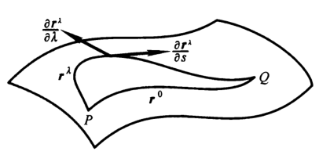
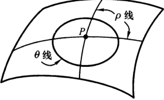
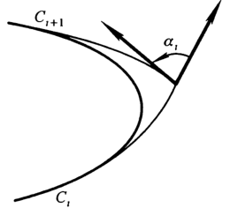

# 曲面的内蕴几何学

## 等距变换

- **等距同构**：设 $\phi: S\to \ol S$ 是曲面间双射，如果它保持任意两点距离不变，则称为等距同构
  - 即两曲面的等距同构，不需要可微性，也不保基本形式（基本形式定义在切平面上）
- **等距变换**：设 $\phi: S\to \ol S$ 是微分同胚。若对任意 $p\in S$ 和 $w_1,w_2\in T_p(S)$ 都有 $\Bip{d\phi_p(w_1)，d\phi_p(w_2)} = \ip{w_1,w_2}$，则称为等距变换
  - 即微分映射是切平面的等距同构
  - **等距性**：它的微分映射保持第一基本形式不变
  - **实例**：
    - 欧氏变换
    - 不同柱面之间的等距对应
    - 圆柱面与螺旋面之间的等距对应
  - **反例**：
    - **非等距性**：将旋转抛物面压扁成平面
    - **非双射性**：柱面到平面的展开
- **局部等距变换**：每点都存在邻域使得其内是等距变换
  - **定义**：
    - 设 $V$ 是 $p\in S$ 的邻域，$\phi:V\to \ol S$ 是局部微分同胚
    - 若存在 $\phi(p)$ 的邻域 $\ol V$，使得 $\phi:V\to \ol V$ 是等距变换，则称 $\phi$ 为局部等距变换
  - **实例**：柱面到平面的展开
    - 只有整体参数化时，柱面和平面才有所谓的"黏合点"处不是双射。但仅考虑每个局部参数化时，是没有黏合点的概念的
- **参数判定法**：
  - **形式1**：曲面双射 $\sigma(u,v) = (\wt u,\wt v)$ 是等距变换 $\LR \bvec{E & F \\ F & G} = J_\sigma \bvec{\wt E & \wt F \\ \wt F & \wt G} J^T_\sigma$
    - **证明**：由等距性，$ds^2 = d\wt s^2$，再由 $J_\sigma$ 的过渡矩阵性，$ds^2$ 的 $I$ 形式表出式，即得结论
  - **形式2**：设两曲面的参数表示 $\begin{cases} x:U\to S \\ \ol x:U\to \ol S \end{cases}$，则 $\ol x\circ x^{-1}$ 是等距变换 $\LR I = \ol I$
    - **证明**：取曲面上曲线后，验证内积相等性即可
  - 容易发现上面两种叙述是等价的，因为第二个中两曲面是相同的参数域，而第一个是两个不同的参数域，中间还掺杂着一个参数变换 $\sigma$（即 $\phi = \ol{\bs r}\circ \sigma \circ \bs r^{-1}$）。两参数平面也需要面积代换，即用这个 $\p$ 的雅可比矩阵
- **微分判定法**：双射 $\sigma$ 是等距变换 $\LR$ 存在两个正交标架，满足 $w_1 = \wt w_1，w_2 = \wt w_2$
  - **证明**：
    - 由等距性，$dr = d\wt r$，即 $w_1^2+w_2^2 = \wt w_1^2 + \wt w_2^2$
    - 设 $[w_1,w_2]$ 的变换矩阵为 $A$，代入上述等式即得 $A^TA = I$，从而是正交矩阵，从而两正交基存在。反之同理
  - **本质**：正交形式的 $I$ 形式相等

### 应用

- **求曲面等距变换**：令 $I$ 形式相等，解向量方程即可

<!-- ### 切映射

- **切映射**：$\sigma_* : T_PS\to T_{\sigma(P)} \wt S，v\mapsto \wt v$
  - $v$ 是 $P$ 点切向量，$\wt v$ 是等距变换 $\sigma$ 下的像
  - **曲线无关性**：切映射不依赖于曲线的选取
    - **证明**：基变换下保持不变即可
  - **线性**：自然标架下，存在系数矩阵 $J_\sigma^T$
    - **证明**：切向量可分解为 $r_u,r_v$ 的线性组合。再由等距变换的微分线性即得结论
- **切向判定法**：双射 $\sigma$ 是等距变换 $\LR \forall v,w\in T_PS，\lang \sigma_*(v),\sigma_*(w) \rang = \lang v,w \rang$
  - **证明**：
    - 由欧氏空间内积理论，同一内积在两个基下的矩阵是合同的
    - 设 $\lang v,w \rang = [e_1,e_2]A^TA\bvec{e_1 \\ e_2}，\lang \sigma_*(v),\sigma_*(w) \rang = [e_1,e_2]B^TB\bvec{e_1 \\ e_2}$
    - 已知 $B = J_\sigma A$，而前面已证等距变换中，正交标架的Jacobi矩阵满足正交性，故$B^TB  = A^TIA$，结论成立 -->

## 保角变换（共形映射）

- **保角变换**：设 $\phi:S\to \ol S$ 是微分同胚，若对任意 $p\in S$ 和 $v_1,v_2\in T_p(S)$ 都有 $\Bip{d\phi_p(v_1)，d\phi_p(v_2)} = \l^2(p)\ip{v_1,v_2}$，则称为保角变换
  - 任意两条曲线在交点处夹角不变
  - **实例**：
    - 等距变换
    - 合同变换（欧氏运动）
    - 正交变换
- **局部保角变换**：同上
- **内积判定法**：$\cfrac{\lang v,w \rang}{|v|\cdot|w|} = \cfrac{\lang \sigma_*(v),\sigma_*(w) \rang}{|\sigma_*(v)|\cdot|\sigma_*(w)|}$
  - **证明**：易得
- **参数判定法**：曲面双射 $\phi$ 是保角变换 $\LR \exists \l(u,v) > 0，\ol I = \l^2(u,v) I$
  - **证明**：
    - 只需存在关系 $d\wt r = \l dr$ 即可
    - 由于夹角不变，$\lang \wt r_u,\wt r_v \rang = |\wt r_u||\wt r_v| \cos(r_u,r_v)$，从而只需 $\dfrac{|\wt r_u|}{|r_u|} = \dfrac{|\wt r_v|}{|r_v|} = \l$ 即可
    - 再由于所有曲线均保角，故交点处，切向 $w = ar_u + br_v$ 对应曲线和 $r_u,r_v$ 对应曲线的夹角也不变，从而 $w$ 必须只能伸缩不能旋转，从而上面结论成立
- **参数变换判定法**：
- **存在性定理**：任意曲面上任意点均存在邻域，可被保角变换为 $E^3$ 上区域
  - **推论（等温参数存在性）**：若 $I = \l^2(u,v)(du^2+dv^2)$，则 $(u,v)$ 为等温参数

## 内蕴观点

- **内蕴几何**：只考虑切向量在曲面内的变化，不考虑曲面法向方向的任何量
  - **内蕴几何量**：只与曲面的 $I$ 有关，与 $II$ 和 $III$ 等无关
    - **实例**：联络形式、协变微分、Gauss曲率
- 由于现实的局限性，研究内蕴几何学是很有必要的。以前我们无法飞到太空，只能在地球表面测量它的信息，这就是内蕴几何提出的动机。后来我们发现时空也是四维流形，但飞出宇宙是不可能的，所以只能内蕴地研究
- 内蕴几何学在数学上的意义也是非凡的。它使几何体摆脱了"嵌入"的视角，大大简化了流形的研究（因为在不同的浸入空间、不同的嵌入方式下，外蕴几何量的形式也不同。如果总引入外蕴几何量来计算内蕴几何量，就非常麻烦且不必要）
- 对于直观认知，也有大大的帮助作用
  - 比如可展曲面在外部看是弯曲的，但内部看它是平的，三角形内角和仍是 $\pi$，即它是个"假弯曲"的面
- 但是它的限制也很多，bi不能得出整体的形状、嵌入、拓扑信息

### 绝妙的定理

- **曲面关于切向标架 $\{e_1,e_2\}$ 的联络形式 $w_{12}$**
  - **唯一性**：一阶形式的曲面结构方程可唯一决定 $w_{12}$
    - **证明**：只需证明 $w_1,w_2$ 给定时，$w_{12}$ 唯一即可（也即一阶结构方程只有唯一解）
  - **变换性**：标架 $\{e_1,e_2\}$ 在曲面上旋转 $\t$ 后，$\wt w_{12} = w_{12} + d\t$
    - **证明**：
- **Gauss绝妙定理**：曲面的Gauss曲率只与 $I$ 有关
  - **证明**：由 $dw_{12}、w_1\land w_2$ 只与 $I$ 有关，结合Gauss方程直得
  - **本质**：Gauss曲率是内蕴几何量
    - 特征值法给出的是外蕴公式，需要 $n_u$
    - Gauss方程给出的是内蕴公式，只需 $w_1,w_2$
  - 这个定理是内蕴几何的基本定理，是内蕴几何的起点
  - 高斯曲率是唯一的内蕴局部不变量（黎曼曲率张量的唯一独立分量），曲面是否非欧（三角形内角和、圆周率大小、测地线的汇聚）完全取决于它
  - 高斯曲率唯一决定内蕴弯曲度，是真正的弯曲。外蕴弯曲度则由嵌入方式决定
  - 主曲率都是外蕴量，但乘积却是内蕴的。这
  - **推论**：等距对应的曲面，Gauss曲率不变

### 协变微分

- **标架的协变微分**：标架微分 $de_\a$ 在切平面 $\span\{e_1,e_2\}$ 上的投影
  - $De_1 = w_{12}e_2，De_2 = w_{21}e_1$
- **切向量场的协变微分**：切向量微分 $dv$ 在切平面 $\span\{e_1,e_2\}$ 上的投影
  - 设 $v = f_1e_1 + f_2e_2$
  - 则 $Dv \red= \lang dv,e_1 \rang e_1 + \lang dv,e_2 \rang e_2 \red= (df_1+f_2w_{21})e_1 + (df_2 + f_1w_{12})e_2$
- **运算律**：协变微分和普通微分相同

### 曲面平移

- **欧氏平移**：移动两个向量，满足
  - 向量长度不变
  - 向量夹角不变
  - 与平移路径无关
- **切向量场沿曲线 $\g$ Levi-Civita平行**
  - **定义**：设 $\g(t)$ 是曲面 $S$ 上的曲线， $w$ 是 $S$ 的切向量场
    - 若 $w(t)$ 满足 $\dfrac{Dw}{dt} = 0$，则 $w(t)$ 沿曲线平行
  - **理解**：$w$ 沿 $\g$ 移动时，切平面投影是常向量（方向不变），从而视为与该曲线平行
  - **二维平行常微分方程组**：设 $\vec v = f_1\vec e_1 + f_2\vec e_2$
    - 则平行等价于 $\begin{cases} \dfrac{df_1}{dt} + f_2\dfrac{w_{21}}{dt} = 0 \\\\ \dfrac{df_2}{dt} + f_1\dfrac{w_{12}}{dt} = 0 \end{cases}$
  - **几何性质**：两个沿曲线平行的切向量场满足 $\lang v,w \rang \equiv C$
    - **证明**：取导数，利用平行方程组即可
- **曲面唯一平行定理**：
  - 设 曲面 $S$ 上参数曲线 $r(t)$ 的两端为 $P = r(a)，Q = r(b)$
  - 则 对任意曲面切向量 $v_0$，均唯一存在沿 $r(t)$ 的平行切向量场 $v(t)$，使得 $v(a) = v_0$
  - **证明**：由向量场平行定义，可构造一阶常微分方程组，在初值条件下，解存在且唯一
- **曲面的平行移动**：
    - 切向量长度不变
    - 切向量夹角不变
    - 与路径（曲线）有关

### 习题

- 已知 $I$，求Gauss曲率
  - **解法**：正交参数之间用前面的公式即可
    - 非正交参数，使用正交变换，观察法或待定系数法

## 内蕴的直线

- **曲线的测地曲率**：$S$ 上的 $r(s)$ 中，$k_g = \lang \dfrac{De_1}{ds},e_2 \rang$
  - **本质**：
    - 平面中曲线的曲率 $\lang \dfrac{dt}{ds},n \rang$ 在曲面内蕴下的对应
    - 其表示曲线在曲面内部的弯曲程度
- **测地曲率向量**：$\vec k_g = k_g\vec e_2 = \dfrac{De_1}{ds}$
  - **几何意义**：同外蕴观点比较
    - 由于 $e_1$ 在切平面上，故 $k_g=  \lang \dfrac{de_1}{ds},e_2 \rang = \lang \dfrac{d^2r}{ds^2},e_2 \rang$，再易得 $k_n = \lang \dfrac{d^2r}{ds^2},e_3 \rang$，$\lang \dfrac{d^2r}{ds^2},e_1 \rang = 0$
    - 故曲率向量 $\dfrac{d^2r}{ds^2} = k_g\vec e_2 + k_n\vec e_3$
    - 从而曲面上曲线的曲率满足 $\kappa^2 = k_g^2 + k_n^2$
- **参数形式（自然标架）**：
  - 首先由链式法则，$\dfrac{d^2r}{ds^2} = \dfrac{d}{ds}(r_\a\dfrac{du^\a}{ds})$
  - 再由自然标架运动方程， $原式 = \G^\g_{\a\b} \dfrac{du^\a}{ds}\dfrac{du^\b}{ds}r_\g + \dfrac{d^2u^\a}{ds^2}r_\a + b_{\a\b}\dfrac{du^\a}{ds}\dfrac{du^\b}{ds}\vec n$
  - 从而可得测地曲率的参数形式
- **Louville公式**：设 $(u,v)$ 是正交参数，$C(s)$ 是弧长参数曲线，其与 $u$ 线的夹角为 $\t$
   
  - 则其测地曲率为 $\dis k_g = \frac{d\t}{ds} - \frac{1}{2\sqrt{G}}\frac{\pa \ln E}{\pa v}\cos\t + \frac{1}{2\sqrt{E}}\frac{\pa\ln G}{\pa u}\sin\t$
  - **本质**：正交参数的测地曲率规范化（类似Euler公式）
  - **证明**：
- **测地线**：曲面上测地曲率 $k_g = 0$ 的线
  - **本质**：曲面内蕴意义下的直线
  - **测地线参数方程**：$\begin{cases} \dfrac{d^2u^1}{ds^2} + \G^1_{\a\b}\dfrac{du^\a}{ds}\dfrac{du^\b}{ds} = 0 \\\\ \dfrac{d^2u^2}{ds^2} + \G^2_{\a\b}\dfrac{du^\a}{ds}\dfrac{du^\b}{ds} = 0 \end{cases}$
  - **唯一存在性**：对曲面 $S$ 上任意点 $P$ 上的单位切向量 $v$，都存在唯一一条过 $P$ 的测地线与 $v$ 相切
    - **证明**：测地线方程的初值问题，解存在唯一
  - **等距传递性**：测地线的等距变换像还是测地线
    - **证明**：测地线由 $I$ 唯一决定，而等距变换保 $I$ 不变
  - **等价命题**：$C$ 是测地线 $\LR$ 沿 $C$ 的主法向量与曲面法向量平行
    - **证明**：
      - 设 $C$ 的弧长参数表示为 $r(s)$，则 $\dfrac{d^2r}{ds^2} = \kappa n_C(s)$
      - 再由 $\dfrac{d^2r}{ds^2} = \vec k_g + k_n\vec n$，而测地线中 $\vec k_g = 0$，从而 $n_C\parallel n$
    - **推论**：曲面上的直线是测地线
- **测地线实例**：
  - **平面**：任意直线
  - **单位球面**：位矢 $\or OP$ 和切向 $\vec v$ 张成一个圆，主法向和球法向重合，其即为测地线
  - **圆柱面**：将其剪开铺平，由 $I$ 形式不变，得其为等距变换。再由平面上所有直线为测地线，得圆柱面上平行圆、圆柱螺线是测地线
- **测地线最短性**：连接两点的长度最短的曲面曲线是测地线
  - **证明**：
    - 取正交标架，沿 $C$ 有 $e_1 = t(s)，e_3 = n(s)$，则可设 $e_2 = a^1r_1 + a^2r_2$
    - **$r(s)$ 的变分**：设 $r^\l(s) = r\Big( u^1(s)+\l f(s)a^1(s)，u^2(s)+\l f(s)a^2(s) \Big)$，其中 $\l\in (-\e,\e)$（往曲线切向 $e_1$ 的正交方向 $e_2$ 偏移的一族曲线）
      - 若满足
        - **原点退化性**：$r^0(s) = r(s)$
        - **可偏导性**：$\dfrac{\pa r^\l}{\pa \l}\biggm|_{\l = 0} = f(a^1r_1 + a^2r_2) = fe_2$
        - **起始点恒定**：$r^\l(0) = P，r^\l(l) = Q\quad (\forall \l)$
      - 则称为变分
      
    - 设 $L(\l)$ 是 $r^\l$ 的长度，若 $C$ 长度最短，则 $L(0) = \inf\limits_{\l} L(\l)$。由Fermat极值定理，$\dfrac{dL(\l)}{d\l}\biggm|_{\l = 0} = 0$
      - 再由弧长公式，$L(\l) = \dis\int^l_0 \ts|\dfrac{\pa r^\l(s)}{\pa s}|ds$
      - 从而 $\dfrac{dL(\l)}{d\l}\biggm|_{\l = 0} = -\dis\int^l_0 fk_g ds = 0$，只能是 $k_g = 0$，从而是测地线
  - **本质**：求导法而已
  - **实例**：
    - 蚂蚁爬圆柱，螺旋线最短

## 测地坐标系

### 分类

- **测地平行坐标系**：曲面 $S$ 中，点 $P$ 的测地线为 $C$，弧长参数为 $v$，过 $C$ 每点作正交测地线，弧长参数为 $u$，则 $(u,v)$ 构成正交参数网
  - **第一基本形式**：$ds = du^2 + G(u,v)dv^2$
    - **证明**：由 $u$ 是弧长参数，故 $E = \lang r_u,r_u \rang = 1$
      - 对 $F$ 求 $u$ 偏导，得其为常数。再由 $F(0,v) = 0$ 得 $F \equiv 0$
      - 只有在 $u=0$ 时，$v$ 才是弧长参数。故 $G(0,v) = 1$
  - **实例**：
    - 三维球 $r(s_1,s_2) = (R\sin\dfrac{s_1}{R}\sin\dfrac{s_2}{R}, R\cos\dfrac{s_1}{R}\sin\dfrac{s_2}{R}, R\cos\dfrac{s_2}{R})$
      - $P = (1,0,0)$
      - 测地线 $C$ 为赤道，弧长参数 $v$
      - 正交测地线为经线，弧长参数 $u$
      - 即 $u = s_2,v = s_1$，计算易得 $E = \lang r_u,r_u \rang = 1$
- **测地极坐标系**：曲面 $S$ 中，$v$ 是点 $P$ 的一个单位切向量，$\g_v(s)$ 为沿 $v$ 方向的**测地射线**
  - **测地射线存在性**：$v$ 的全体是单位圆周，是紧集，故 $\exists\e>0，\forall v\in T_PS，\g_v(s)$ 在 $s\in [0,\e)$ 时有定义
  - **指数映射**：$\exp_P:T_PS\to S，\vec w\mapsto \g(\dfrac{\vec w}{\rho},\rho)$（其中 $|w| = \rho$）
    - **定义域**：$\rho < \e$
    - **几何意义**：
      - 把切平面原点的小邻域 $O(0,\e)$ 映射到曲面上
      - 把（切平面上过原点的直线 $\rho\vec v$）映射为（曲面上过 $P$ 点的测地射线 $\g(\vec v,\rho)$
    - **本质**：将内蕴极坐标变为外蕴极坐标
  - **切平面法坐标系**：
    - 取 $P$ 点正交标架 $\{e_1,e_2\}\in T_PS$，使得 $w = x^1e_1 + x^2e_2$
    - 易得 $(x^1,x^2)$ 构成 $T_PS$ 的坐标系
    - **本质**：切平面上直角坐标系
    - **极坐标变换**：由数分知识，切平面可建立极坐标系，对应变换为 $\begin{cases} x^1 = \rho\cos\t \\ x^2 = \rho\sin\t \end{cases}$
  - **曲面测地极坐标系**：
    - 若已知某点切向量 $w$ 和其对应的法坐标 $x^1,x^2$，则该方向测地射线可表为 $r(x^1,x^2) = \exp_P(w)$
    - 再由于 $S$ 任意点均可由 $P$ 点某测地射线的方向+弧长表出，故 $(\rho,\t)$ 构成 $S$ 的坐标系
    - **测地射线（$\rho$ 线）**：$\t = \t_0$
    - **测地圆（$\t$ 线）**：$\rho = \rho_0$
    

### 测地坐标系的性质

- **测地射线族**：$\{C_\t\mid \t\in [0,2\pi]\}$，其中 $C_\t$ 是与切向量 $e_1$ 夹角为 $\t$ 的 $\rho$ 线
- **正则参数**：使得曲面在该参数表示下局部可微的参数
  - **判定方法**：将其表示为某已知正则参数的变换，证明Jacobi矩阵不为0
- **法坐标系正则性**：$(x^1,x^2)$ 是 $P$ 附近的正则参数
  - **证明**：
    - 设 $(u_1,u_2)$ 是 $P$ 附近的正交参数，且 $r_1(P) = e_1，r_2(P) = e_2$，已知其具有正则性，故只需证明 $P$ 附近Jacobi矩阵不为0
    - 对 $u^\a(\rho)$ 在 $\rho = 0$ 进行渐进展开，再对其求偏导，易得 $(\dfrac{\pa u^\a}{\pa x^\b}) = (\d^\a_\b)$ ，从而 $\det (\dfrac{\pa u^\a}{\pa x^\b}) \neq 0$，正则性传递
- **弧长系数公式**：设 $P$ 为原点的法坐标系下，$I = g_{\a\b}dx^\a dx^\b$，则 $\begin{cases} (g_{\a\b})(P) = (\d_{\a\b}) \\\\ \cfrac{\pa g_{\a\b}}{\pa x^\g}(P) = 0 \end{cases}$
  - **证明**：由于 $(x^1,x^2)$ 是正交的弧长参数测地线，故 $E = G = 1，F = 0$，从而第一式直得
    - 过 $P$ 的测地线均可设为 $\t = \t_0$，则将 $(\rho\cos\t_0,\rho\sin\t_0)$ 代入测地线方程，令 $\rho\to 0$，即得 $\G^\a_{\b\g}(P) \cdot \dfrac{dx^\b}{d\rho}\cdot \dfrac{dx^\g}{d\rho} = 0$，再由 $\t_0$ 任意性，只能是 $\G^\a_{\b\g}(P) = 0$。最后由ch符号定义式即得结论
- **测地极坐标系正则性**：
  - **证明**：由数分知识，切平面上极坐标变换的Jacobi矩阵为 $\dfrac{\pa (x^1,x^2)}{\pa (\rho,\t)} = \rho \neq 0$，从而 $x^\a$ 的正则性可传递
- **测地极坐标系性质**：
  - $I = ds^2 = d\rho^2 + G(\rho,\t)d\t^2$
    - **证明**：$\rho$ 是切向量长度，在指标映射下是测地线弧长参数，从而 $E = 1$
      - 测地线方程代入 $u^1 = \rho，u^2 = \t$ 即得 $\G^2_{11} = 0$
      - 再由Ch符号定义，计算得 $\dfrac{\pa F}{\pa \rho} = 0$，故 $F$ 在测地线上为常数
      - 再由 $r_\t = r_{x^\a}\cdot x^\a_{\rho}$，计算得 $\lim\limits_{\t\to 0} r_\t = 0$，从而 $\lim\limits_{\t\to 0} F = \lang r_\rho,r_\t \rang = 0$
  - $\lim\limits_{\rho\to 0}\sqrt{G} = 0$
    - **证明**：此时 $\sqrt{G} = \sqrt{EG-F^2}$，设法坐标系下 $I = (g_{\a\b})$，则由极坐标变换，$\sqrt{EG-F^2} = \dfrac{\pa (x^1,x^2)}{\pa (\rho,\t)}\sqrt{\det(g_{\a\b})}$
    - 再由之前结论， $(g_{\a\b}) = I_{2\times 2}$，$\det(J) = \rho$，即得结论
  - $\lim\limits_{\rho\to 0}(\sqrt{G})_\rho = 1$
    - **证明**：由上式求导计算即可
- **测地线最短性**：设 $P$ 是曲面 $S$ 上一点，则存在曲面邻域 $U$，使得 $\forall Q\in U$，连接 $P,Q$ 两点的测地线长度是曲面曲线中最短的
  - **证明**：
    - 可设 $U = \set{\exp_P(w)\mid w\in T_PS,，|w|<\e}$，$Q = r(\rho_0,\t_0)$，则 $C_{\t_0}$ 即为PQ测地线，长为 $\rho_0$
    - 设 $C$ 为PQ曲线，$t\in [0,t_0]，r(0) = P，r(t_0) = Q$
    - 若 $C\subset U$，则可表为 $r(\rho(t),\t(t))$
      - 此时极坐标下 $I = |\dfrac{dr}{dt}|^2 = (\dfrac{d\rho}{dt})^2 + G(\dfrac{d\t}{dt})^2 \geq (\dfrac{d\rho}{dt})^2$，从而 $l(C) \geq \rho(t_0) = \rho_0$
    - 若 $C$ 不完全位于 $U$ 中，则其落入 $U$ 中的部分 $t_1$，仿照上式得 $l(t_1)\geq \rho(t_1)$，再由 $\rho(t_1)\geq \e$ 即得 $l(C) \geq l(t_1)\geq \e > \rho(t_0)$
- **Gauss曲率为常数的曲面分类（测地极坐标系法）**

## 曲率公式

- **Gauss-Bonnet公式**：设 $D$ 是 $S$ 上单连通区域，$\pa D$ 是分段光滑闭曲线
  - 设 $\a_i$ 是 $\pa D$ 的顶点的外角
  - 则 $\dis\iint_D KdA + \int_{\pa D}k_gds + \sum \a_i = 2\pi$
   
  - **引理**：$\dis\iint_D KdA + \int_{\pa D} k_g ds = \int_{\pa D}d\a$
    - **证**：已知Gauss方程 $dw_{12} = -KdA$
      - 在 $D$上积分并使用Green公式得 $\dis\iint_D KdA = -\int_{\pa D}w_{12}$
      - 由边界分段光滑性，可设 $\pa D = \mathop{\bigcup}\limits^n_{i=1} C_i$，其中每段是光滑的
        - 设 $\a$ 是 $C_i$ 切向和 $e_1$ 的夹角，则 $\dfrac{dr}{ds} = \cos\a e_1 + \sin\a e_2$
        - 再由 $k_g = \biggm\lang \cfrac{D}{ds}(\cfrac{dr}{ds})，e_3\land \cfrac{dr}{ds}  \biggm\rang$，即得 $k_g ds = d\a + w_{12}$，代入积分式即可
  - **证明**：
    - 首先，证明 $\dis\int_{\pa D}d\a = 2\pi$
      - 设 $\pa D = r(s)，s\in [0,l]$，由光滑性，$\dfrac{dr}{ds}\biggm|_{s=0} = \dfrac{dr}{ds}\biggm|_{s=l}$，从而 $\a(l) = \a(0) + 2k\pi$
      - 将 $\pa D$ 连续缩小至等温坐标系中，则 $\int_{\pa D}d\a$ 应当连续变化，但与 $2k\pi$ 的跳跃性矛盾，故 $k$ 在过程中不变
      - 在等温参数平面上连续形变为圆，则此时 $k=1$，再由其不变性即得结论
    - 构造一个光滑外部边界 $\wt D$，仅在顶点附近不同于 $\pa D$
      
      - 设相同处为 $\G_1$，不同处为 $\G_2$，则 $2\pi = \dis\int_{\G_1}d\a + \int_{\G_2}d\a$
      - 当 $\wt D\to D$ 时，前者趋于原式，后者趋于 $\sum\limits^n_{i=1} \a_i$，从而结论成立
  - **应用**：
    - 曲面三角形的内角和
      - **计算**：内角 $\b_i = \pi - \a_i$，从而内角和 $\b_1+\b_2+\b_3 = \dis\iint_D KdA + \int_{\pa D} k_g ds + \pi$
        - **测地三角形**：三角形三边都是测地线
          - 若 $K = 0$，则内角和为 $\pi$
          - 若 $K>0$，则内角和大于 $\pi$
    - 曲面向量沿闭曲线平移时，产生的角度差

## 曲面的Laplace算子

- **标架导数**：设 $df = f_1w_1 + f_2w_2$，则 $f_1,f_2$ 是 $f$ 关于 $e_1,e_2$ 的导数
  - **本质**：正交标架是内蕴观点下的偏导数，自然标架是内蕴观点下的方向导数
- **梯度**：$\nabla f = f_1e_1 + f_2e_2$
  - **函数量**：梯度与正交标架的选取无关
- **导数的协变微分**：$D(\nabla f) = (df_1 + f_2w_{21})e_1 + (df_2 + f_1w_{12})e_2$
  - **函数量**：协变微分与正交标架的选取无关
- **Hessian阵**：$H = \bvec{f_{11} & f_{12} \\ f_{21} & f_{22}}$ 是 $f$ 关于 $e_1,e_2$ 的导数的协变微分阵
  - **对称性**：$d(df) = 0$ 即可
  - **函数量**：迹与正交标架的选取无关
- **Laplace算子**：$\D_S f = \text{tr} H$

### 实例

### 性质

## Riemann度量

- **参数区域的R度量**：二次型 $Edu^2 + 2Fdudv + Gdv^2$，满足 $E>0，EG-F^2 > 0$
  - **理解**：参数区域 $D$ 相当于其对应曲面 $r(u,v)$ 被拉直后的空间，定义R度量则是保留了曲面的一些信息
  - **本质**：定义了曲线的弧长微元
- **D上曲线长度**：$s(t) = \dis\int^t_a\sqrt{\frac{I}{dt^2}}dt$
- **参数区域的面积元**：$dA = \sqrt{EG-F^2}du\land dv$

### 实例

- **平面上单位圆盘**：$D = \{(u,v)\mid u^2+v^2<1\}$
  - **Poincare度量**：$ds^2 = \cfrac{4}{(1-(u^2+v^2))^2}(du^2 + dv^2)$
    - **复数表示**：$ds^2 = \cfrac{4}{(1-|z|^2)^2}dzd\ol z$
- **上半平面**：$U = \{(x,y)\mid y>0\}$
  - **Poincare度量**：$ds^2 = \cfrac{1}{y^2}(dx^2+dy^2)$
    - **复数表示**：$ds^2 = \cfrac{1}{(\Im w)^2}dwd\ol w$
- 等距变换：$w = i\cfrac{1-z}{1+z}$

### 结构方程

-