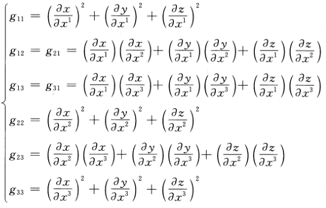

# 张量

- **符号约定**：
  - 一般用 $\bs a\otimes \bs b$ 表示张量，但这里省去运算符号
  - 上标表示逆变，下标表示协变

## 张量积（并矢）

- **并矢**：设 $\bs a = \bvec{a_1 \\ a_2 \\ a_3},\bs b = \bvec{b_1 \\ b_2 \\ b_3}$，则 $\bs a\bs b = [a_ib_j] = \bvec{a_1b_1 & a_1b_2 & a_1b_3 \\ a_2b_1 & a_2b_2 & a_2b_3 \\ a_3b_1 & a_3b_2 & a_3b_3}$ 称为两向量的并矢
  - **实例**：
    
- **运算律**：
  - **数乘交换结合律**：$mn\bs{ab} = (mn\bs a)\bs b = \bs a(mn\bs b) = (m\bs a)(n\bs b) = (n\bs a)(m\bs b)$
  - **向量无交换律**
  - **向量结合律**：$\bs{abc} = \bs{(ab)c} = \bs{a(bc)}$
  - **数乘分配律**：$mn(\bs{ab} + \bs{cd}) = mn\bs{ab} + mn\bs{cd}$
  - **向量分配律**：$(\bs a + \bs b)(\bs c + \bs d) = \bs{ac} + \bs{ad} + \bs{bc} + \bs{bd}$
- **转置**：$(\bs{ab})^T = \bs{ba}$

### 缩并

- **缩并**：并矢中取两个向量进行点积
  - 一次缩并会将张量降低 $2$ 阶
  - 向量内积本质就是二阶张量的缩并，结果是标量（零阶张量）
  - **实例**:
- **数量公式**：$n$ 阶并矢 $\bs{abcd}$ 有 $C^2_n$ 种缩并方式

### 内积

- **内积**：（取相邻向量进行缩并）称为两个并矢的内积
  - 物理中多数张量运算都是相邻场量作用（力作用于面元），所以这套规则是先有物理直观，再匹配数学记号
  - **实例**：
    - 向量 $\bs f$ 在 $\bs n$ 方向上的投影为 $(\bs f\cdot \bs n)\bs n = \bs f\cdot (\bs {nn})$
      - 此时 $\bs{nn}$ 就是投影算子的矩阵
      - 向量 $\bs f$ 和矩阵 $\bs{nn}$ 的内积就是矩阵乘法。更高的不同阶张量同样可定义类似乘法
- **运算律**：
  - **内积结合律**：
    - $(\bs a\cdot \bs b)\bs c = \bs a\cdot(\bs {bc})$
    - $(\bs a\cdot \bs b)\bs{cd} = (\bs {ca})\cdot(\bs {bd})$
    - $(\bs{ab})\cdot \bs c = (\bs b\cdot \bs c)\bs a$
    - $(\bs{ab})\cdot(\bs{cd}) = (\bs b\cdot\bs c)\bs{ad}$
  - **内积无交换律**
- **双内积**：（取相邻的四个向量进行缩并）称为两个并矢的双内积
  - **并联式**：$\bs{ab:cd = (a\cdot c)(b\cdot d)}$
  - **串联式**：$\bs{ab\ccdot cd = (a\cdot d)(b\cdot c)}$
  - 有的教材只用并联式

### 并基分解

- **并基分解定理**：
  - 设 $\bs {a_i,b_j}$ 是两组向量，$\bs A = A^i\bs a_i，\bs B = B^j\bs b_j$，张量 $\bs T = \bs {AB}$
  - 则 $T = A^iB^j\bs{a_ib_j}$
  - **证明**：
    - 直接计算即可
  - **实例**：
    - **二阶并乘**：$T^{ij} = A^iB^j$，
    - **二阶并基**：$\bs{a_ib_j}$
- **数量公式**：
  - $n$ 阶张量可被 $n^2$ 个 $n$ 阶并基分解

## 张量

- **张量**：
  - 设 $\hkh{\large T^{i_1,...,i_p}_{i_{p+1}...i_{p+q}}}^{a = 1,...,p+q}_{i_a = 1,...,n}$ 是 $n^{p+q}$ 元有序数组，有 $p$ 个上指标和 $q$ 个下指标，每个指标有 $n$ 个不同取值
  - 若某个坐标系进行坐标变换时，该数组有如下的变化规律，则称为 $n$ 维 $(p,q)$ 型张量 $$\Large T^{j_1,...,j_p}_{j_{p+1}...j_{p+q}} = \large\dkh{\prod_{a=1}^p \frac{\partial y^{j_a}}{\partial x^{i_a}}} \dkh{\prod_{b=p+1}^{p+q} \frac{\partial x^{i_b}}{\partial y^{j_b}}}\Large T^{i_1\cdots i_p}_{i_{p+1}\cdots i_{p+q}} $$
    - $y$ 表示变化后的基矢，$x$ 表示变化前的基矢
    - 右式是关于 $i_1,...,i_{p+q}$ 求和
    - $T^{i_1...i_p}_{i_{p+1}...i_{p+q}}$ 其实只是张量的分量，它们组成的 $n^{p+q}$ 阶数表才是张量
      - 张量本身不随坐标变换而改变，但它的各个分量（某组基矢下的坐标）会改变
  - **实例**：
    - 标量是零阶张量，变换式为 $y = x$
    - 向量是一阶张量
      - $(1,0)$ 型是逆变向量 $\bs g^i$，变换式为 $\bs g'^i = \cpfrac{y^i}{x^j}\bs g^j $
      - $(0,1)$ 型是协变向量 $\bs g_i$，变换式为 $\bs g_i' = \cpfrac{x^j}{y^i}\bs g_j$
      - 一阶张量比较特殊，它只有一个系数，故各个分量的变换式可写到一起。但更高阶张量的各个分量的变换式系数都不同，故不能写到一起
    - 矩阵是二阶张量
      - $(2,0)$ 型是全逆变张量 $T^{ik}$，变换式为 $$ (T^{jl})' = \cpfrac{y^j}{x^i}\cpfrac{y^l}{x^k}T^{ik} $$
      - $(1,1)$ 型是混合张量 $T^i_k$，变换式为 $$ (T^j_l)' = \cpfrac{y^j}{x^i}\cpfrac{x^k}{y^l}T^i_k $$
      - $(0,2)$ 型是全协变张量 $T_{ik}$，变换式为 $$ (T_{jl})' = \cpfrac{x^i}{y^j}\cpfrac{x^k}{y^l}T_{ik} $$

### 张量空间

- **张量空间**：全体 $n$ 维 $(p,q)$ 型张量组成 $n^{p+q}$ 维线性空间
  - **证明**：验证即可
- **张量积传递性**：张量的张量积都是张量
  - **证明**：计算易得
- **可分张量**：可以写成张量积的张量
  - **反例**：
    - $\tvec{1 & \\ & 1} = e_1\otimes e_2 + e_2\otimes e_1$ 不能写成张量积

### 张量的基

- **统一定理**：张量的几何定义是代数定义在欧氏空间上的特例
  - **证明**：
    - 易得欧氏空间的张量积满足代数定义
- **张量分解定理**：张量空间同构于有限维线性空间的张量积
  - **证明**：详见抽代
- **标准张量基定理**：
  - 设 $T^p_q(V) = V^{\otimes p}\otimes (V^*)^{\otimes q}$ 是张量空间
  - 若 $e_1,...,e_n$ 是 $V$ 的一组基，$\e_i$ 是其对偶基
  - 则 $e_{i_1}\otimes ...\otimes e_{i_p}\otimes \e^{j_1}\otimes ... \otimes \e^{j_q}$ 是张量空间的基
  - **证明**：
  - **实例**：
- **几何不变性**：张量是几何实体
  - **证明**：
    - 只需证明张量在坐标变换下不变
      - 即在坐标变换下，张量在张量空间的原基和像基下的分解式系数相同
      - 即各个分量
- 

### 

- **协变分量**：取定坐标系后，张量在协变基下的分量称为协变分量
- **逆变分量**：取定坐标系后，张量在逆变基下的分量称为逆变分量
- **混合分量**：若改变坐标时，张量的某个分量既乘协变转换系数，又乘逆变转换系数，则称为混合分量
  - **实例**：
    - 二维 $(2,0)$ 张量 $\tvec{T^{11} & T^{12} \\\\ T^{21} & T^{22}}$，所有分量都是逆变分量下·
    - 二维 $(0,2)$ 张量 $\tvec{T_{11} & T_{12} \\\\ T_{21} & T_{22}}$，所有分量都是协变分量
    - 二维 $(1,1)$ 张量，所有分量都是混合分量
- **协变分量组**：若张量的某组分量是协变量，则称为协变分量组
  - **实例**：
    - 二维 $(1,1)$ 张量 $\tvec{T^1_1 & T^1_2 \\\\ T^2_1 & T^2_2}$，坐标变换式可写为矩阵乘法 $$ \tvec{T^1_1 & T^1_2 \\\\ T^2_1 & T^2_2}' = \tvec{\dpfrac{y^1}{x^1} & \dpfrac{y^1}{x^2} \\\\ \dpfrac{y^2}{x^1} & \dpfrac{y^2}{x^2}} \tvec{T^1_1 & T^1_2 \\\\ T^2_1 & T^2_2}  \tvec{\dpfrac{x^1}{y^1} & \dpfrac{x^1}{y^2} \\\\ \dpfrac{x^2}{y^1} & \dpfrac{x^2}{y^2}} $$
      - 显然矩阵的每行都是逆变向量组，每列都是协变向量组
      - 每行中，分量的上指标（逆变指标）固定
      - 每列中，分量的下指标（协变指标）固定
- **逆变分量组**：若张量的某组分量是逆变量，则称为逆变分量组

## 三维空间的张量

### 度量张量

- **度量张量**：
  - 设 $g_{ij} = \bs g_i\cdot\bs g_j$，则矩阵 $(g_{ij})$ 称为协变度量张量
  - 设 $g^{ij} = \bs g^i\cdot\bs g^j$，则矩阵 $(g^{ij})$ 称为协变度量张量
- **分量计算式**：
  
  - **证明**：
    - 易得求笛卡尔坐标系 $O(x,y,z)$ 到曲线坐标系 $\bs r(x^1,x^2,x^3)$ 的坐标变换式即可

### 张量的性质

## 张量代数

- **相等**：
