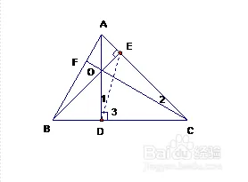
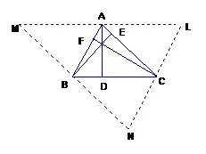

# 向量代数

- 参考教材：《解析几何简明教程》

## 坐标系中向量的意义

- **标量**：只有大小的量
- **向量**：有大小和方向的量
- **标架**：一点 $O$ 与三个不共面的向量 $\ve{OA},\ve{OB},\ve{OC}$ 组成的图形
  - **基本向量**：三条坐标轴的三个单位向量 $[O;\vec{e_1},\vec{e_2},\vec{e_3}]$
  - **点P的定位向量**：$\overrightarrow{OP} = x\vec e_1 + y\vec e_2 + z\vec e_3$，坐标为 $(x,y,z)$
  - **正交标架**：右手单位正交标架，坐标为笛卡尔坐标系
    - **定向性**：。只有左手系和右手系两种方向
      - **定向相同**：正交变换的行列式为1，旋转可得
      - **定向相反**：正交变换的行列式为-1，需要翻转

## 向量运算

### 内积（点积）

- **内积**：$\lang a,b \rang = a\cdot b = |a||b|\cos\lang a,b \rang$
- **水平支量（内支量）**：$a_e$
- **垂直支量（外支量）**：$a_h$
- **运算律**：
  - 加法交换律：在泛函分析中称为平行四边形性质，有这个性质的度量空间才可定义内积
  - 加法结合律
    - **证明**：分解成标准正交基
  - 数乘交换律、结合律、分配律
    - **证明**：内积定义直得
  - 内积分配律：
    - 数学本质：利用基本向量和结合律，把数乘变成点乘来消去e
    - 数学意义：分解为内支量，然后利用算数运算律即可

### 外积（叉积）

- **外积**：$a\times b$ 是垂直于 $a,b$ 的向量，长度为 $|A\land B| = |A\times B| = |A||B|\sin \lang A,B \rang$
  - **理解**：
    - 右手坐标系的旋转意义
    - 线性包的法向量意义
  - **面积意义**：$\R^3$ 中，外积表示两个向量组成的平行四边形的面积
- **性质**：
  - **反交换律（反称性）**：
    - **理解**：旋转方向改变
  - **数乘结合律**：
    - **理解**：就是外积定义
  - **外积分配律**：$(a+b)\times (c+d) = \cdots$
    - **证明**：分解为外支量，然后发现旋转和加法不冲突
- **外积的行列式性**：$\vec a\times \vec b = \begin{vmatrix} a_1 & a_2 \\ b_1 & b_2 \end{vmatrix} (\vec e_a\times \vec e_b)$
  - **自反归零性**：$a\times a = \vec 0$
  - **反对称性**：$a\times b = -b\times a$
  - **外支投影性**：因为自反等于0，所以只取外支量计算即可
- **高维外积**：[外微分](../数学分析/多元函数积分学/4.外微分.md)、[外微分积分](../数学分析/约束积分/5.外微分积分.md)

### 外积的应用

- **求点到直线的距离**
  - 利用内积：取直线上点，得到向量，得到夹角，sin得到距离
  - 利用外积：平行四边形的高 = 面积÷底
- **二重外积展开式**：$a×(b×c) = (a\cdot c)b - (a\cdot b)c$
  - **几何法证明**：
    - $b×c$ 与 $b$ 和 $c$ 垂直，而 $a×(b×c)$ 与 $a$ 和 $b×c$ 垂直
      - 首先，$a×(b×c)$ 在 $b$ 和 $c$ 组成的平面上，设为 $\lambda b + \mu c$
      - 再由与 $a$ 垂直，得 $\dfrac{a·b}{a·c} = -\dfrac{\mu}{\lambda}$
      - 原式两边取向量长度即得比例 $k=1$
- **Lagrange恒等式**：$\lang v_1\land v_2,v_3\land v_4 \rang = \lang v_1,v_3 \rang\lang v_2,v_4 \rang - \lang v_1,v_4 \rang\lang v_2,v_3 \rang$
  - **几何法证明**：
  - **本质**：用平面向量表出法向量内积（高中解析几何公式）
    - **方向（均化为正交单位向量）**：两平面法向量的内积（平面的夹角余弦） = 
    - **长度**：
- 

### 混合积

- **混合积**：$(a,b,c) = (a\times b)\cdot c = \vvec{a_1 & a_2 & a_3 \\ b_1 & b_2 & b_3 \\ c_1 & c_2 & c_3}$
  - **几何意义**：$a,b,c$ 张成的平行六面体的体积
  - **交换律**：向量顺序颠倒，结果不变
- 平行坐标系：不同基下的坐标
  - 基本向量
  - 平行坐标：相应的坐标
  - 度量矩阵：

## 习题

### 证明

- 三角形三条中线交于一点：向量证明
- 重心性质：
- 垂心性质：
- 外心性质：
- 内心性质：
- 证明圆上 $n$ 等分点向量 $\{\or{OA_i}\}^n_{i=1}$ 的和为 $\vec 0$：
  - 若 $n$ 是偶数，则直径一一对应
  - 若 $n$ 是奇数，则取其中一个为 $y$ 轴正向，x轴上一一抵消，y轴上利用cos性质（有点拉）
- **证明中线是 $\dfrac{2}{3}$**：中位线相似
- **证明三角形三条高交于一点**：
  - 反证，找相似，发现AQ=AP
  - 四点共圆证垂直
  
  - 扩大三角形，转化为证明中垂线交于一点
  