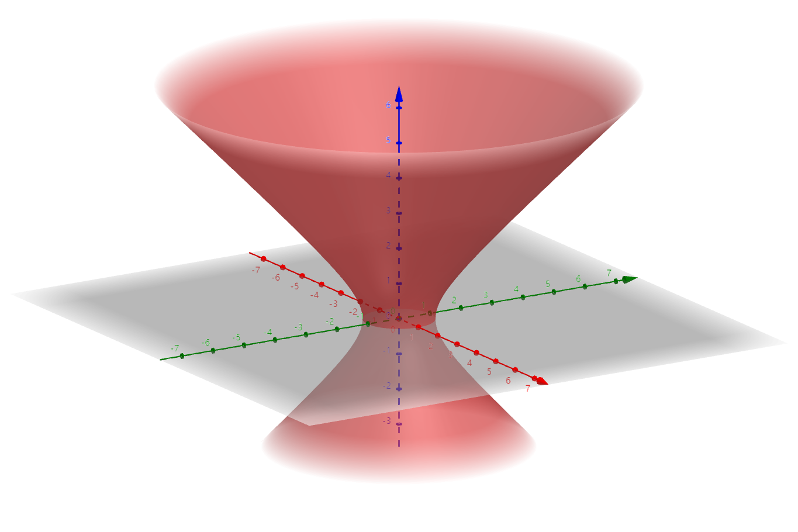
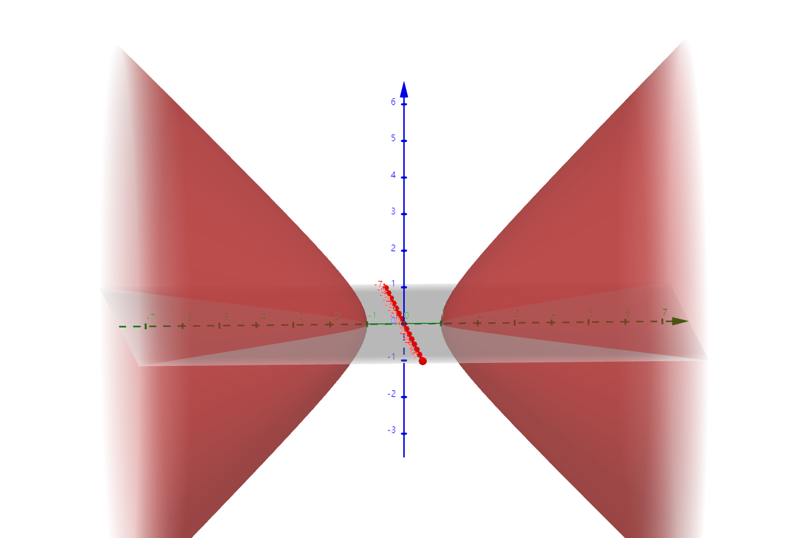
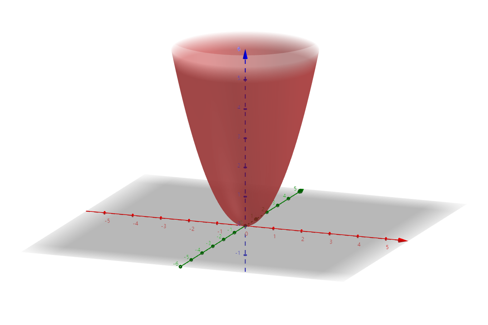
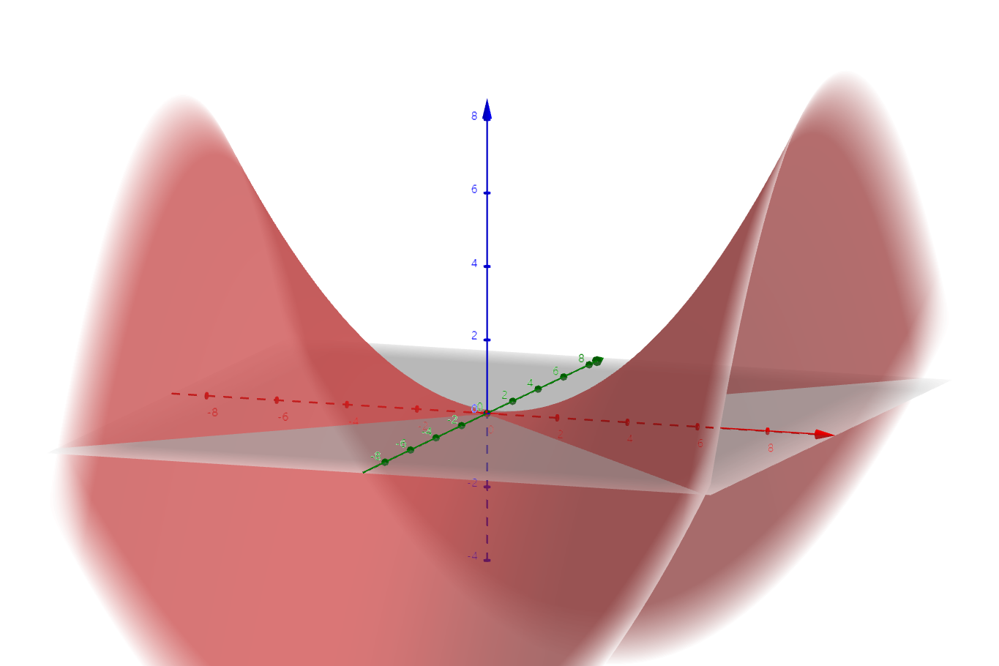

# 二次曲面

## 图形和方程

- **曲面的一般方程**：$F(x,y,z) = 0$
- **曲线的一般方程**：将两个曲面的一般方程联立起来
- 点在曲面上 $\Leftrightarrow$ 点在准线/母线上
- 在这里，我们只研究最简单的曲面。

### 球面

- **球面定义方程**：$(x-x_0)^2 + (y-y_0)^2 + (z-z_0)^2 = R^2$
- **辨认特征**：没有非平方二次项，且各平方项的系数相等
- **圆**：
  - **一般方程**：一个球面和一个平面联立
  - **定义方程**：$x^2 + y^2= r^2$，再线性变换

### 柱面

- **圆柱面定义方程**：$x^2+y^2 =\rho^2$
- **圆**：
  - **一般方程**：一个圆柱面和一个平面联立
- **一般柱面**：一簇平行直线形成的曲面
  - **母线**：构成柱面的平行直线
  - **准线**：柱面上和所有母线相交的曲线
  - **定义方程（垂直于XY面）**：$F(x,y) = 0$

### 锥面

- **一般锥面**：由一簇经过顶点的直线形成的曲面
- **母线**：形成锥面的直线
- **顶点**：母线都经过的点
- **准线**：和所有母线相交但不经过顶点的曲线
- **定义方程（顶点是原点）**：齐次的 $F(x,y,z) = 0$
  - 因为经过原点的直线都是正比例直线，所以经过母线（在锥面上）的条件就是齐次

### 旋转面

- **旋转面**：一条平面曲线绕与它同平面的一条直线旋转，轨迹所形成的曲面
  - **轴**：该直线
  - **子午线**：该平面曲线
- **一般方程（YZ平面上绕Z轴旋转）**：$\begin{cases} F(y,z) = 0 \\ x = 0 \end{cases}$ $\Rightarrow$ $F(\pm\sqrt{x^2+y^2},z) = 0$（简单的旋转变换）

#### 旋转双曲面

- **单叶旋转双曲面（绕虚轴旋转）**
- **双叶旋转双曲面（绕实轴旋转）**
- 绕另一个轴旋转：一个平面

#### 旋转抛物面

## 经典的二次曲面

- **压缩变换**：将两个基向量的夹角变小的变换，易得它是线性的
- 下面的二次曲面都是将经典对称曲面进行压缩变换的结果
- **中心二次曲面**：具有对称中心的二次曲面

### 椭球面

- **方程**：对球面进行压缩变换 $$\frac{x^2}{a^2} + \frac{y^2}{b^2} + \frac{z^2}{c^2} = 1$$
- **中心**：对称中心
- **主轴**：对称轴
- **主平面**：对称平面
- **顶点**：和坐标轴的交点
- 半长轴、半中轴、半短轴

### 单叶双曲面

- **方程**：对旋转双曲面进行压缩变换 $$\frac{x^2}{a^2} + \frac{y^2}{b^2} - \frac{z^2}{c^2} = 1$$

### 双叶双曲面

- **方程**：压扁的旋转双曲面（下图中朝右的是y轴）$$-\frac{x^2}{a^2} + \frac{y^2}{b^2} - \frac{z^2}{c^2} = 1$$

### 椭圆抛物面

- **方程**：压扁的旋转抛物面 $$z = \frac{x^2}{a^2} + \frac{y^2}{b^2}$$

### 双曲抛物面（马鞍面）

- **方程**：$$z = \frac{x^2}{a^2} - \frac{y^2}{b^2}$$

## 曲线的投影

- **投影**：曲线$\Gamma$的每一点在平面上的垂足形成的曲线
- **投影柱面**：垂线的集合
- **求投影**
  - 先求投影柱面，只需要把z消去即可
  - 因为这些变化都是同解变换，所以解空间（曲线点集）都是不变的，仍然表示原先的曲线

## 习题

### 求曲线方程

- **大体思路**：
  1. 首先求对称轴
  2. 然后设曲面上一点，并**善用题目中给出的另一个条件**，即可求得方程

- **已知半径、对称轴，求圆柱面方程**：
  - **参数方程解法**：
     - 首先设对称轴上的参数点为 $(tl,tm,tn)$
     - 然后求每个参数点对应的圆：
       - 求出参数平面 $\a(t)$
         - 易得为 $lx+my+nz = (l^2+m^2+n^2)t$
       - 求出参数球面 $B(t)$
         - 易得为 $(x-lt)^2+(y-mt)^2+(z-nt)^2 = R^2$
       - 将两个方程联立求解
         - 易得解为 $x^2+y^2+z^2 = (l^2+m^2+^2)t^2+R^2$
     - 最后得到带 $t$ 参数的一般方程
     - 也可以再进一步，配凑并化简成不带 $t$ 的形式
       - 易得为 $x^2+y^2+z^2 = \cfrac{(lx+my+nz)^2}{l^2+m^2+n^2}+R^2$
  - **旋转面解法（这里先以两直线相绕旋转为例）**：
     - 首先设曲面上的某点为 $P(x,y,z)$
     - ~~然后求平面——法向量（对称轴）和某个点（P）~~
     - ~~再得到平面和对称轴的交点（参数点）~~
     - 然后**旋转面的核心：P和参数点到对称轴的距离相等**
  - **坐标变换解法**：
    - 先由半径求标准曲面
    - 然后再构造平移+旋转变换（仿射变换）即可
    - 有点麻烦，算了
- **已知顶点 $A$、对称轴 $l$、夹角 $\t$，求圆锥面方程**
  - 参数方程我觉得万能，可惜不是想要的形式
  - **旋转面解法**：设圆锥面上某点为 $P(x,y,z)$
    - 作内积，得到等式 $\or{AP}\cdot \vec l = |\or{AP}||\vec l|\cos\t$，将其化简即可
- **已知准线，求曲线**
  - 参数方程即可，因为二次曲面的准线沿方向向量平移就是二次曲面的方程
- **已知三条母线，求圆柱面**
  - **对称轴解法**：以母线的方向向量（同时也是对称轴的方向向量）$\vec l$ 为法向量求平面 $\a$，再求出 $\a$ 与三条母线的三个交点 $A,B,C$，再求 $A,B,C$ 构成的圆的外心，即得对称轴，然后用对称轴方法求解即可
  - **准线解法**：以方向向量为法向量求平面，得到三个交点，再求准线（讲道理，不如上面），然后用准线方法求解即可