# 图论介绍

- 参考教材：graph theory with applications（J.A.Bondy）

## 基本概念

- **图**：$G = (V,E,W)$，$V$ 是顶点集，$E$ 是边族，$W$ 是边的权
  - **抽象图**：只要存在两个集合 $V,E$，彼此的元素满足一一对应 $\begin{cases} \psi(e_i) = v_{i_1}v_{i_2} \\ \t(v_{i_1}v_{i_2}) = e_i \end{cases}$，其就可构成一个图
    - **同构**：顶点的标签不同，但双射相同
  - **顶点集合**：$V(G)$，**顶点数量**：$\nu(G) = |V(G)| = \nu$
  - **边集合**：$E(G)$，**边数量**：$e(G) = |E(G)| = \e$
- **有向图、无向图、混合图**：边是否有方向
  - **弧**：有方向的边
    - 头尾：弧和顶点关系
    - 前继后继：顶点关系
- **单图**：所有两顶点间仅有一条边（无重边multiple edge），且边的端点不重合（无环loop）
  - **基础单图**：删去重边和环后得到的子图
- **顶点的度 $d(v)$**：与顶点 $v$ 相关联的边的数量
  - **度序列**：每个顶点的度按非严格单增顺序排成的序列
    - **最小度**：$\d(G)$
    - **最大度**：$\D(G)$
  - **握手引理**：所有顶点的度数之和是边数的2倍
    - **推论**：度为奇数的顶点只能有偶数个
      - **证明**：反设为奇数个，则将所有这些顶点的度加起来，得到 $d(V_1)$，易得其为奇数
        - 而显然 $d(V-V_1)$ 是偶数，两者相加是奇数，与顶点度之和是偶数矛盾
- **顶点的距离**：两个顶点间最短轨道的长度
- **赋权图**：每条边都有一个或多个实数对应的图
  - **权**：距离或花费时间等

### 分类

- 实际上下面这些概念的不同定义方法非常牛魔的多，所以怎么称呼需要自己来定
- **walk路径（途径）**：可重复的有限顶点序列
  - 起点、终点、路长
- **trail迹（简单路）**：边不重复的walk
- **path轨道（初级路/路）**：顶点不重复的trail（边和顶点均不重复的walk）
  - **两点之间的距离 $d_G(u,v)$**：以 $u,v$ 为端点的所有轨道中最短长度
- **cycle圈（回路）**：闭合的path
  - **奇圈/偶圈**：边数为奇数或偶数的圈
- **连通图**：任意两个顶点间有轨道
  - **不连通图**：可以表示为两个图的并
  - **分支**：连通的子图
  - **分支数量**：$\o(G)$
- **强连通性**：有向图中，若两个顶点存在双向轨道，则称为强连通

## 基础图与结构

- **同构**：顶点可以一一对应，与之相应的边也一一对应
- **标签**：给各个顶点安排编号（如果不安排编号，则由群论和组合数学知识，某些图之间通过平移、旋转、翻转等变换重合时，应当将这些等价类视为一个图）
  - **无标签图**：种类少于有标签图
- **图的运算**：
  - 并：获得母图 $S_1 + S_2$，其中 $V = V_1\cup V_2，E = E_1\cup E_2$
    - **连通并**：获得连通图
    - **不连通并**：获得不连通图
    - **连通分支**：图中具有连通性的分支
  - 交：获得子图 $S_1\cap S_2$
  - 差：获得子图 $G-S$
    - **差运算**：消去两个图共有的边和顶点
    - **不合并差** $G-e$，消去边 $e$，且 $e$ 两端的顶点不合并为一个
    - **合并差（收缩）** $G \backslash e$，消去边 $e$，但 $e$ 两端的顶点合并为一个
  - 补：获得补图
    - **合并补** $\ol S(G) = E(G)\backslash S(G)$：消去原图中存在的边，连接原图中不邻接的顶点

### 矩阵表示

- **邻接矩阵**：$A_{\nu\times \nu} = (a_{ij})_{\nu\times \nu}$（对称方阵）
  - $i、j$ 表示两个顶点的编号
  - 矩阵元的值为两顶点之间的重边数量
- **关联矩阵**：$B_{\nu\times \e} = (b_{ve})_{\nu\times \e}$（逻辑矩阵）
  - 行表示顶点，列表示边
  - $b_{ve} = \begin{cases} 1 & v是e的尾 \\ -1 & v是e的头 \\ 0 & v与e不关联 \end{cases}$

#### 矩阵定理

- **度的矩阵表示**：$d(v) = \sum\limits_{b_{ve}\neq 0} |b_{ve}|$（关联矩阵中第 $v$ 行所有元的和）
- **握手引理的矩阵形式**：$\sum\limits_{v\in G} d(v) = 2|E|$
- **出入定理**：
  - **入度 $d^-(v)$**：有向图中，以 $v$ 为头的边的数量
  - **出度 $d^+(v)$**：有向图中，以 $v$ 为尾的边的数量
  - **出入度的矩阵表示**：$d(v) = d^+(v) - d^-(v) = \sum\limits_{b_{ve}\neq 0} b_{ve}$
    <!-- - 给定顶点 $v$，（出去的边）比（进来的边）多（$v$ 的度） -->
  - **握手引理的出入度形式**：$\sum\limits_e d^+ = \sum\limits_e d^- = |E|$
    <!-- - 出度和入度的总数相等 -->
- **奇偶性**：奇数度顶点有偶数个
  - **证明**：设 $V_1,V_2$ 分别是奇数度和偶数度顶点的集合，已知它们度的和为偶数，偶数度顶点的度总数必定是偶数，故结论易得。

### 子图

- **子图**：母图 $G = (V,E)$
  - 设 $\begin{cases} V_1\subset V \\ E_1\subset E \end{cases}$
  - 若 $\forall e_1 = v_1v_2 \in E_1$，均有 $v_1,v_2\in V_1$
  - 则 $G_1 = (V_1,E_1)$ 是子图
- **支撑子图（生成子图）**：顶点和原图相同的子图（满足 $V_1 = V$ 的 $G_1$）
- **点导出子图**：$G[V']$，依赖于点集 $V'$
  - 顶点子集关联的所有边
- **边导出子图**：$G[E']$，依赖于边集 $E'$
  - 边子集关联的所有点
- **不相交子图**：无公共点的两子图
- **不重边子图**：无公共边的两子图

### 经典图

- **$r$-正则图**：所有顶点的度均为 $r$
  - **空图 $N_n$**：无边的 $n$ 顶点图
  - **循环图 $C_n$**：所有顶点的度均为 $2$（例如 $C_6$ 是六边形）
    - **路径图 $P_n$**：循环图减去一条边
    - **轮图 $W_n$**：$C_{n-1}$ 中，将每个顶点连接到一个新顶点上（例如 $W_6$ 是有中心的五边形）
  - **三次图**：3-正则图
    - **Peterson图**
    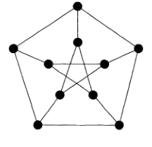
  - **完全图 $K_n$**：任意顶点都相邻的图
    - $n-1$ **正则性**
    - **最大性**：$n$ 个顶点的单图均同构于 $K_n$ 的子图
    - **边数** $\frac{n(n-1)}{2}$
      - **证明**：任取一个顶点 $v_1$，有 $n-1$ 条边。再取相邻顶点 $v_2$，除去 $v_1v_2$ 后有 $n-2$ 条边……最终得 $|E| = \sum\limits^{n}_{k=1} n-k$
  - **柏拉图图**：正 $x$ 面体
- **二分图（偶图） $S(A,B,E)$**：
  - **二分定义法**：图 $G = (V,E)$ 中，存在两个顶点子集 $A,B$，使得 $\forall e = v_1v_2 \in G$ 满足 $v_1\in A，v_2\in B$
    - **二分类**：$(A,B)$ 称为 $G$ 的二分类
  - **邻接定义法**：完全由两个子图 $A$ 和 $B$ 构成的图 $G$，子图内部的顶点不相邻？
  - **奇偶定义法**：不含奇圈的图
    - **必要性**：二分图中，每经过一个边，都切换一次子图。故只有切换偶数次子图时才能换回来形成一个圈
    - **充分性（构造性证明）**：任取顶点 $u$，设 $\begin{cases} X = \set{x\in V\mid d(u,x)是偶数} \\ Y = \set{y\in V\mid d(u,y)是奇数} \end{cases}$
      - 设 $\begin{cases} P:u\to v\in X \\ Q:u\to w\in X \end{cases}$ 均为最短路，$u_1$ 是它们最后的公共点
        - **最短遗传性**：易得两路中的 $u\to u_1$ 部分也都是最短路，从而长度相等
      - 由定义，$P,Q$ 总路长为偶数，且由无奇圈性得圈 $(u,u_1)$ 长为偶数，故剩余部分 $P_1:u_1\to v，Q_1:u_1\to w$ 具有相同的奇偶性，从而 $P_1^{-1}Q_1:v\to w$ 的长度 $|P_1|+|Q_1|$为偶数。
      - 若 $v$ 和 $w$ 邻接，则 $P_1^{-1}Q_1wv$ 是奇圈，矛盾。再由 $v,w$ 任意性即得 $X$ 中任意两点均不邻接。同理 $Y$ 中两点均不邻接，由二分图定义即得结论
    - **理解**：用奇偶数路长构造出二分类
  - **顶点估计**：$|V| \leq \cfrac{|E||E-1|}{2}$，取等时是完全二分图
    - **证明**：同下
  - **边数估计**：$|E| \leq \cfrac{|V|^2}{4}$，取等时是完全二分图
    - **证明**：其具有单调性，故讨论完全二分图情况即可
  - **邻接定理**：$G$ 是二分图 $\LR G$ 的邻接矩阵为 $A = \tvec{O & \ol A \\ \ol{A^T} & O}$
    - **证明**：由于内部不关联，故左上角和右下角为 $O$。再由邻接矩阵对称性即得结论
- **完全二分图 $K_{p,q}$**：顶点数为 $p,q$ 的二分图中，分支 $A$ 和 $B$ 的每对顶点间恰有一条边
  - **边数定理**：$K_{p,q}$ 的边数为 $|E| = |\nu(A)|\cdot |\nu(B)| = pq$
  - **补图定理**：$\ol K_{p,q} = A\cup B$
- **k-方体**：存在顶点二进制序列 $(a_1,...,a_k)$，使得所有相邻顶点只有一个数位不同
    - **顶点数**：$|V| = 2^k$
    - **边数**：$|E| = k2^{k-1}$
    - $k$-**正则性**

#### 习题  
  
- **$k$ 部图**：
- **完全 $k$ 部图**：
- $T_{m,n}$：$|V| = n$，可分为 $m$ 个子集
  - $\e(T_{m,n}) = C^2_{n-k} + (m-1)C^{k+1}_2$
- **自补图**：补图等于自身的图
  - **顶点**：$\nu \equiv 0,1\pmod 4$
- **正则二分图**：若 $k$ 正则二分图具有二分类 $(X,Y)$，则 $|X| = |Y|$
  - **证明**：
  - **理解**：实际上就是配对问题
- **边图（线图）**：$G$ 中顶点是 $G'$ 中的边，$G$ 中边是 $G'$ 中的顶点
  - **对偶性**：线图的顶点相交 $\LR$ 顶点对应的的边相交
- **图序列**：是某个图的度序列的序列
  - $\sum\limits^k_{i=1} d_i \leq k(k-1) + \sum\limits^n_{i=k+1} \min\{k,d_i\}$
  - **变换**：$d=(d_1,...,d_n)$ 和 $d' = (d_2-1,d_3-1,...,d_{d_1} - 1，d_{d_1+2},...,d_n)$ 同时为或不为图序列

### 经典问题

- **八圆问题**：将八个序号放入下图中，使得相邻的序号在图中不相邻
  - 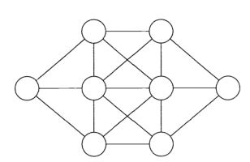
  - 因为A和H是端点序号，最容易排列。而中间的两个圆最难排列，所以当然将它们放在中间两个圆中
  - 然后B和G的位置也相应确定了，在左右端点上
  - 从而其余四个序号的位置也确定
- **六人问题**：不孤立的六个顶点中，存在三个顶点彼此相邻，或存在三个顶点彼此都不相邻
  - **证明（分类讨论法）**
    - 定义虚边，使图转化为完全图。则问题转化为：必定存在实三角形或空三角形
    - 对任意顶点，其必定存在五条边
      - 若五条边均为实边，则任何其余实边均会构成实三角形。而若没有实边，则存在虚边三角形，舍去
      - 若四条边为实边，则剩余的一个顶点为了不形成虚三角形，必须与至少三个顶点连上实边。其它顶点再以此类推，结果还是形成实边三角形，舍去
      - 若三条边为实边，……
  - **证明（度优选法）**
    - 孤立点倾向于和低度点相连
- **四立方体问题**：四个颜色如下的立方体，如何摆放可以使柱子每侧都有四个颜色
  - 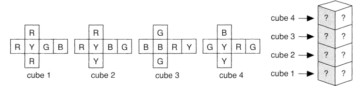
  - **证明**：将四个颜色作为顶点，针对四个立方体画四个图，并将四个图叠加起来，得到题目的完全信息
    - （子图分别对应正背面和左右面）
    - （一条边对应一个编号，即一个矩体）
    - （一个顶点对应一个颜色）
    - 寻找满足以下性质的两个子图
      - 每个编号在子图中只有一条边
        - 一条边对应两个顶点
      - 子图没有编号和顶点均相同的边
        - 一个矩体只能有一个摆放方向
      - 子图是2-正则
        - 保证每个颜色均出现

## 连通性

### 数量关系

- **（定理5.1）二分圈定理**：二分图 $\LR$ 每个圈长度为偶数
  - **必要性**：有去必有回，从而是偶数
  - **充分性**：列出所有cycle，然后构造 $A$ 和 $B$ 即可
- **（定理5.2）边数上下界定理**：具有 $n$ 个顶点，$k$ 个分支，$m$ 条边的单图，满足 $\\ n-k \leqslant m \leqslant \frac{(n-k)(n-k+1)}{2}$
  - **证明**：
    - **边数下界**：
      - 易得圈中 $m=n，k=1$，满足左不等式。再由于左不等式是线性的，直接把图相加减时关系不变，故只需考虑无圈图
      - 易得连通时（此时 $G$ 是树），$k=1$，$m=k-1$，满足左不等式
        - 在连通无圈图的基础上，每删去一条边，分支数量+1（不在圈内的边是割边）
        - 也就是说，删边过程中，边数和分支数之和始终为初始值 $m_0+k_0$
        - 再由顶点数 $n=n_0=m_0+k_0$ 不变，故 $m+k=n$ 恒成立，即左不等式成立
    - **边数上界**：
      - 易得右式关于 $k$ 单减，关于 $n$ 单增，故求上界时不妨令 $k=2$，$n$ 最大
      - ？？
      - 假设分支均为完全图，存在两个分支 $C_i$ 和 $C_j$，顶点数分别为 $n_i\geq n_j\geq 1$
        - 此时边数 $m = \dfrac{n_i(n_i-1)}{2} + \dfrac{n_j(n_j-1)}{2}>0$
      - 考虑将两分支替换为 $n_i+1$ 和 $n_j-1$ 的完全图
        - 易得顶点数量不变
        - 边数 $m$ 变为 $\dfrac{(n_i+1)n_i - n_i(n_i-1)}{2} - \dfrac{n_j(n_j-1) - (n_j-1)(n_j-2)}{2} = n_i - n_j + 1>0$
      - 因此，由（$n-k+1$ 个顶点的完全图）与（$k-1$ 个孤立点）组成的图边数最多。易得此时边数为右式，故由上界性即得右不等式
  - 很多不等式其实是一个东西的变体，而且变体之后往往还没有什么实际意义，只能用来当证明游戏而已，没有什么深挖的价值。
  - **（推论5.3）**：顶点为 $n$ 的单图，若边数多于 $\frac{(n-1)(n-2)}{2}$，则其为连通图

### 割边

- **二分边集 $\{S,T\}$**：设 $S,T$ 是不相交的顶点集，则 $\{S,T\}$ 表示一个端点在 $S$ 中，一个端点在 $T$ 中的边全集
- **边割（断开集）**：若 $S\subset V$，则 $\{S,\ol S\}$ 是边割（顶点子集和其补集构成的二分边集）
  - **最大定义法**：$S$ 的最大二分边集
  - **二分性**：边割的边导出子图 $G[\{S,\ol S\}]$ 是二分图
  - **删去定义法**：$G$ 连通，但 $G-\{S,\ol S\}$ 不连通，形成 $G[S]，G[\ol S]$ 两个不连通分支
  - 下图中，左边顶点为 $S$，右边顶点为 $\ol S$，它们之间全部的二分边集为加粗部分
  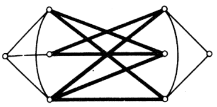
- **割集（键）（最小边割）**：子集均不为边割的边割（$$）
  - **删去定义法**：删去后使得整体不连通的最小边集
  - 在上图中，由于右边居中的顶点是 $\ol S$ 中的孤立点，故删除它关联的边不影响结果的连通性，也即下图依然是边割
  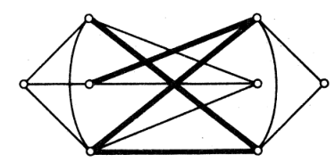
  - **特例**：若 $G$ 存在割边 $e$，则割集为 $\{e\}$
- **割边（桥）**：移除后会使图分支数增加的边（$\o(G-e) > \o(G)$）
  - **回路定义法**：不在任何单圈中的边
    - **证明**：定义即可
      - **必要性**：设割边为 $e = xy$
        - 由割边定义，存在两顶点 $u,v$ 在 $G$ 中连通，但在 $G-e$ 中不连通。则存在道路 $P:u\to v$ 穿过 $e$
        - 反设 $e$ 在圈 $C$ 中，则 $x,y$ 在 $C-e$ 中连通，当然也在 $G-e$ 中连通，矛盾
      - **充分性**：反设不是割边，则 $\o(G-e) = \o(G)$
        - $G$ 中存在道路 $Q:x\to y$，且 $x,y$ 在同个分支中
        - 由分支数相等，得连通性不变，故 $G-e$ 中也有道路 $P:x\to y \in G-e$，但此时 $e$ 在圈 $P+e$ 中，矛盾
  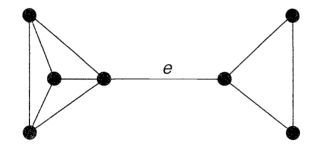
- **点割**：
  - **删去定义法**：删去后会使图片不连通的顶点集合（$\o(G-C) > \o(G)$）
- **割集**：定义同上？
- **割点**：
  - **交集定义法**：若边集 $E(G)$ 可被分为 $E_1,E_2$，其中边导出子图 $G[E_1],G[E_2]$ （两个连通分支）的交点仅有 $v$，则其为 $G$ 的割点
  - **删去定义法**：$\o(G-v) > \o(G)$
    - **证明**：
      - **必要性**：删去后，两个边导出子图无公共点，从而成为连通分支
      - **充分性**：易得删去一点只能生成两个连通分支，且这两个连通分支只有这一个交点
- **关系**：割集 $\subset$ 边割
  - **区别**：
    - 边割是依赖于两个互补顶点集合的，可能有无用边（删去后不能使连通度增加）
    - 割集是最小的边割，即删去了无用边的最优边集
    - 割边不一定能并出所有的割集，但一定是最小的割集
  - **关系**：边割是不相交割集的并
- **割集定理**：设 $C$ 是 $G$ 中单圈，$\Omega = \{S,T\}$ 是割集
  - 若 $E(C) \cap E(\Omega) \neq \varnothing$，则 $|E(C)\cap E(\Omega)| \geq 2$
  - **证明**：显然，用定义讨论即可
  - **理解**：圈中要割出分支来，必须至少割两条边才行

### 连通度

- **边连通度 $\lambda(G)$**：最小边割的大小（若要使 $G$ 不连通，至少要删去 $\l$ 条边）
  - **k边连通**：$\lambda(G) \geqslant k$（至少有k个冗余边）
  - **k边割**：含有 $k$ 个边的边割
- **点连通度 $\kappa(G)$**：最小点割的大小（若要使 $G$ 不连通，至少删去 $\kappa$ 个点）
  - **k连通**：$\kappa(G) \geqslant k$（至少有 $k$ 个冗余点）
  - **k点割**：含有 $k$ 个顶点的点割
- **连通度比较定理**：$\kappa \leq \l \leq \d$
  - **归纳证明**：
    - 当 $\l = 0$ 时，$G$ 是平凡图或不连通图，显然 $\kappa = 0$
    - 设 $\l < k$ 时均成立，考虑 $\l = k$ 的情况
      - 设图 $G$ 满足 $\l(G) = k$，边 $e$ 在某个k边割中
      - 取 $H = G-e$，易得 $\l(H) = k-1$。从而由归纳假设，$\kappa(H) \leq k-1$
        - 若 $H$ 存在完全支撑子图，则易得 $G$ 也存在，再由于点割与边无关，故 $\kappa(G) = \kappa(H) \leq k-1$
          - 由于 $H$ 和 $G$ 只相差一条边，顶点相同，故支撑子图是相同的。接下来我们在讨论点割之前，先把点割比较难处理的情况（完全图的点割是所有顶点）给讨论一下，不留后顾之忧
        - 若 $H$ 不存在完全支撑子图，设 $|S| = \kappa(H)$ 是 $H$ 的点割。由点割定义，$H-S$ 不连通。
          - 若 $G-S$ 不连通，则 $\kappa(G) \leq \kappa(H) \leq k-1$
            - 此时 $G$ 需要割去的点不可能比 $H$ 多
          - 若 $G-S$ 连通，则 $e$ 是 $G-S$ 的割边。易得此时只有两种情况：
            - $H$ 的点割 $S$ 几乎就是 $G$ 的点割（仅与 $e$ 关联的顶点可能不同）。故删去 $S$ 后只需要讨论与 $e$ 关联的顶点即可。再由 $e$ 此时是差图的割边，故情况就简化地非常单纯。
            - $\nu(G-S) = 2$，从而 $\kappa(G) \leq \nu(G)-1 = \kappa(H)+1 \leq k$
            - $G-S = \{v\}$，从而 $S\cup \{v\}$ 是点割，则 $\kappa(G) \leq \kappa(H)+1 \leq k$
  - **本质**：点连通度 < 边连通度 < 最小度
  - **理解**：
    - 割去一个点 $v$，则其关联的边均被删去。即至少删去 $d(v)$ 条边
      - 故最少删点数 $\leq$ 最少删边数（当删去的点度均为 $1$ 时取等）
    - 将点 $v$ 关联的边全部删去，则 $v$ 肯定变为孤立点，从而图不连通
      - 故最小删边数 $\leq$ 最小度
  - **实例**：下图中 $\kappa = 2，\l = 3，\d = 4$
    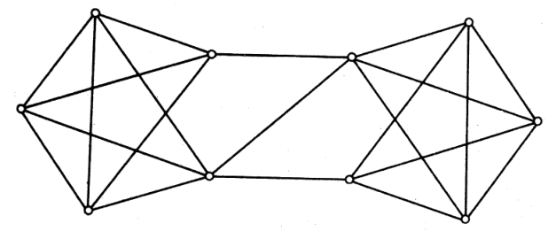

### 块

- **块**：没有割点的图
  - **连通性**：$v\geq 3$ 的块均为 $2$ 连通图
    - **证明**：由于没有割点，故必须至少删去两个点才能使图不连通，从而最小点割至少有两个点。由定义即得其2-连通
    - **本质**：事实上这就是没有割点的等价定义
  - **分支性**：每个图都是其块的并
    - **证明**：易得删去割点时不会导致新割点出现，故将图的所有割点删去后，所得的各个子图均没有割点，从而都是块。
    - **本质**：实际上，块就是图删去其所有割点后，分离成的各个部分
- **图 $G$ 的块**：子图中最大的块
- **内不相交轨道族**：顶点交集为空
- **Whitney定理**：图 $\nu(G)\geq 3$ 是二连通图 $\LR G$ 的任意两个顶点都至少被两个内不相交轨道连接
  - **证明**：
    - **必要性**：对两点距离 $d(u,v)$ 归纳即可。任取两个顶点 $u,v\in V(G)$
      - 当 $d(u,v) = 1$ 时，由二连通性，存在边 $uv$，且其不是割边，从而其含于某个圈 $C$。此时 $C-uv$ 就是另一条内不相交轨道
      - 设 $d(u,v) < k$ 时必要性均成立
        - 设 $M:u\to v$ 是长为 $k$ 的轨道，$w$ 是 $M$ 中 $v$ 前面的点，则 $d(w,v) = k-1$。由归纳假设，存在两个内不相交轨道 $P,Q:w\to v$
        - 再由 $G$ 二连通，故无割点，故 $G-w$ 连通，从而必定存在一条不经过 $w$ 的轨道 $P':u\to v$
          - 设 $x$ 是 $P'\cap (P\cup Q)$ 中的最后一个顶点
            - 实际上就是路 $P'$ 和圈 $PQ$ 的最后一个公共顶点
            - （$x$ 肯定不是起点 $u$，但可能是终点 $v$）
          - 不妨设 $x\in P$，则 $(P_0\subset P):u\to x$ 和 $(P_0'\subset P'):x\to v$ 的复合 $P_0P_0'$ 是 $u\to v$ 的轨道
          - 易得该轨道 $P_0P_0'$ 和轨道 $Qwv$ 内不相交
        - 再由 $u,v$ 任意性即得结论
        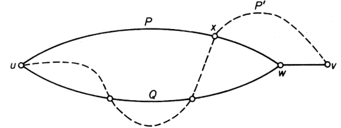
      - **本质**：就是一步步构造了两个内不相交路，相当于阐述一下，不难
        - 归纳假设得 $P,Q$
        - 二连通性得 $P'$
        - 讨论即可
    - **充分性**：定义易得此时 $G$ 连通，且无割点，从而 $G$ 二连通
  - **推论（块中的圈存在定理）**：
    - **点共圈性**：$2$ 连通图中任意两顶点共圈
      - **证明**：
        - 任取两顶点 $u,v$
        - 由Whiteney定理得存在两个内不相交轨道 $P,Q:u\to v$
        - 取最后一个公共顶点 $x\in P\cap Q$，则两个轨道的 $x\to v$ 部分即构成包含 $u,v$ 的圈。由任意性即得结论
    - **边共圈性**：$2$ 连通图 $\nu(G)\geq 3$ 中任意两边共圈
      - **证明**：
        - 在两边 $e_1,e_2$ 中分别新取顶点 $v_1,v_2$，构成新图 $G'$
        - 由于 $v_1,v_2$ 均不为点割，故 $G'$ 是块，且顶点至少为 $5$ 个，从而是二连通图，则由Whiteney定理，$v_1,v_2$ 都在某个圈 $C$ 中。再由 $v_1,v_2$ 定义，$e_1,e_2$ 也都在圈 $C$ 中
      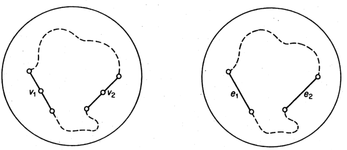
- **Menger定理**：图 $\nu(G)\geq k+1$ 是k-连通图 $\LR G$ 任意两个不同的顶点都至少被k个内不相交轨道连接
  - **证明**：略
  - **本质**：二连通图情况的推广

#### 考试题

- **边不重轨道族**：边交集为空的一族路
- **Whiteney定理（边形式）**：$2$ 边连通图 $\LR$ 任意两个顶点都至少被两个边不重路连接
  - **证明**：
    - **必要性**：对两顶点距离归纳，任取两不同顶点 $u,v\in G$
      - 当 $d(u,v) = 1$ 时，由二边连通性，存在
      - 设 $d(u,v) < k$ 时均成立
        - 归纳假设得 $P,Q$
        - 由二边连通性，存在不包含边 $G-wv$ 的路 $P'$
        - 讨论即可
    - **充分性**：定义易得此时 $G$ 连通，且无割边，从而 $G$ 二边连通

### 欧拉图

- **半欧拉图**：具有欧拉通路，但没有欧拉回路的图
  - **欧拉迹（欧拉通路）**：包含所有边的迹（顶点可重合，边不可重合，不一定闭合）
- **欧拉图**：具有欧拉回路的图
  - **环游**：和所有边都相交过至少一次的闭合walk（顶点和边均可重合，闭合）
  - **欧拉环游（欧拉回路）**：和所有边只相交过一次的环游（或者定义为闭合的欧拉迹）（顶点可重合，边不可重合，闭合）
- **（引理6.1）有界收敛引理？**：若 $G$ 的每个顶点的度不小于2，则G包含一个圈
  - **证明（非数）**：
    - 若 $G$ 不是单图，此时其重边就是一个圈
    - 若 $G$ 是单图，由于度不小于2，故沿着顶点走，可以一直找到相邻的不重复点。再因为是有限图，不断走下去必定会出现第一个重复点，此时形成一个圈
- **（定理6.2）Euler性质定理**：连通图是欧拉图 $\LR$ 每个顶点的度是偶数
  - **证明**：
    - **必要性**：欧拉迹每经过一个顶点，来路和去路共贡献2个度。再因为包括所有边，且顶点不重复，所以顶点度数均是偶数
    - **充分性**：
      - 由有界收敛引理，$G$ 存在一个圈。移除圈中所有边，新图的所有顶点依然是偶数度。不断归纳，直到最后 $G$ 退化为一个圈
  - **（推论6.3）欧拉图的圈分解性**：连通图是欧拉图 $\LR$ 边集可被分为不相交的圈
    - **证明（非数）**：上述的归纳过程即为寻找圈的过程
  - **（推论6.4）半欧拉图奇数性**：连通图是半欧拉图 $\LR$ 奇数度顶点只有两个
    - **证明（非数）**：继续归纳过程，由于起点终点不重合，最后必定只剩下起点和终点
- **（定理6.5）Fleury算法**：欧拉图中得到欧拉迹
  - 在欧拉图中
    - 从顶点 $u$ 开始遍历边，移除（经过的边）和（产生的孤立点）
    - 仅当分支中无边时才使用桥
  - 最终可得到欧拉迹
  - **证明**：归纳法
    - 设当前到达顶点 $v$，现存子图 $H$ 是连通的，且仅有两个奇数度的点 $v、u$
      - 由于最终要回到 $u$，所以 $u$ 是奇数度
      - 由于 $v$ 只移除来路，没有移除去路，所以是奇数度
    - 设到达下一个顶点 $w$，删去 $vw$
      - 若不破坏连通性，则此时 $v$ 最多与1个桥相连（？）
        - 若与两个桥相连，则因为回来时不能走 $v$，会使另一个分支被分割
        - 若与三个桥相连，则因为 $u$ 中路被移除了，所以无法再次回到v
      - 若会破坏连通性，则 $vw$ 是桥，且分割出的 $H-vw$ 分支 $K$ 不包含 $u$
        - 减去 $vw$ 后 $w$ 是奇数度，从而K中某些对应顶点也是奇数度，与欧拉图性质矛盾

### 哈密顿图

- **半哈密顿图**：含有Hamilton轨的图
  - **Hamilton轨**：含有所有顶点的轨道（顶点和边均不重复，不一定闭合）
- **哈密顿图**：含有Hamilton圈的图
  - **Hamilton圈**：闭合的Hamilton轨（顶点和边均不重复，闭合）
- **传递性**：哈密顿图的母图也是哈密顿图
  - **证明**：定义易得
  - **反例**：完全图不一定是哈密顿图，
- **连通判定法**：设 $G$ 是哈密顿图，$S$ 是顶点集，则 $\o(G-S) \leq |S|$
  - **证明**：
    - 已知存在Hamilton圈 $C$，由圈的性质易得 $\o(C-S) \leq |S|$
      - 仅删去一个点时，圈连通分支数不变
      - 删去 $n$ 个相邻点时，圈的连通分支数不变
      - 删去 $n$ 个不相邻点时，每次删去都只增加一个分支
    - 再由Hamilton圈包含全部顶点，得 $C-S$ 是 $G-S$ 的支撑子图，从而 $\o(G-S) \leq \o(C-S)$
      - 顶点相同，边越少，图越不连通，连通分支越多
  - **理解**：本质是边数上下界定理（删点数和删边数与连通分支数的关系）
  - **实例**：
    - 完全二分图 $K_{m,n}$ 不是哈密顿图
      - **证明**：设 $S$ 是度为 $n-1$ 的顶点全集，则 $\o(K_{m,n}-S) = m+1 > |S|$
    - 下图中删去 $3$ 个黑色顶点后，剩下 $4$ 个连通分支，不满足条件，故不是哈密顿图
    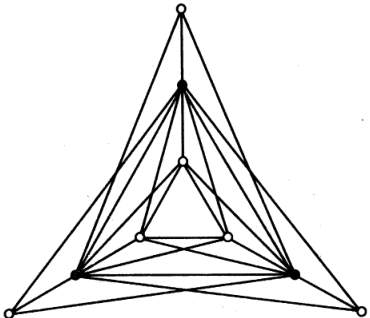
  - **反例（非必要性）**：Peterson图是非哈密顿图，但无法使用连通判别法
- **最小度判定法（狄拉克定理）**：设 $G$ 是顶点数 $n\geq 3$ 的连通单图
  - 若 $\d \geq \dfrac{n}{2}$，则 $G$ 是哈密顿图
  - **证明**：反设不是哈密顿图，取 $G$ 为哈密顿图中满足该条件的最大子图
    - 由于 $n\geq 3$，得 $G$ 不是完全图
      - 完全图的度均为 $n-1$，故 $\d = n-1 \geq \dfrac{n}{2}$ 满足题设条件
    - 设 $u,v$ 是两个不相邻的顶点，由 $G$ 最大性，$G+uv$ 是哈密顿图，从而每个哈密顿圈都包含 $uv$ 边。从而存在哈密顿轨 $u = v_1\to v_2\to\cdots\to v_n = v$
    - 设 $S = \set{v_i\mid uv_{i+1}\in E(G)}，T = \set{v_i\mid v_iv\in E(G)}$
      - $S$ 是后继点和起点关联的顶点全集，$T$ 是和终点关联的顶点全集）
      - 易得 $v_n\notin S\cup T$，从而 $|S\cup T| < n$
      - 再易得若 $|S\cap T| \neq 0$，则存在如下面Ore定理所示的Hamilton圈，与非哈密顿性矛盾
    - 最后，$d(u) + d(v) = |S|+|T| = |S\cup T| + |S\cap T| < n$，与 $\d\leq \dfrac{n}{2}$ 的假设矛盾
  - **理解**：
  - **本质**：这个证明挺没意思的，就是Ore定理加了点其它东西，本质上是Ore定理 $\to$ 狄拉克定理的方法
- **Ore总结**：设 $G$ 是顶点数 $n\geq 3$ 的连通单图，$u,v$ 是不相邻的顶点
  - 若 $d(u) + d(v) \geq n$
  - 则 $G$ 是哈密顿图 $\LR G+uv$ 是哈密顿图
  - **证明**：
    - **必要性**：Hamilton图的传递性直得
    - **充分性**：狄拉克定理或Ore定理直得
  - **本质**：Hamilton图的删点归纳条件。有了它，我们就可以用归纳法处理Hamilton图
- **（定理7.1）Ore定理**：设 $G$ 是顶点数 $n\geq 3$ 的连通单图
  - 若对任何不相邻的顶点 $u,v$，有 $d(u) + d(v) \geq n$，则其为哈密顿图
  - **构造性证明（非数）**：
    - 由连通性，$G$ 中存在路 $P:u\to v$，给路上顶点编号。其中 $u = v_1，v = v_n$
    - 考虑 $G$ 中的其它边
      - 由不相邻性，$u,v$ 之间无边
      - 再由题设度数条件，必定存在两条边 $uv_i$，$v_jv$ 使得 $i>j$
      <!-- - 由 $u,v$ 不相邻性，得只有中间的 $v_i$ 之间、$u,v$ 和中间的 $v_i$ 之间才有边 -->
      - 以 $j=i+1$ 情况举例，容易发现下图中就存在一个H圈 $v_1\to\cdots\to v_{i-1}\to v_n\to\cdots\to v_i\to v_1$
    - 再由Hamilton图的传递性，即得 $G$ 是哈密顿图
  - **理解**：很显然的证明，不用理解
    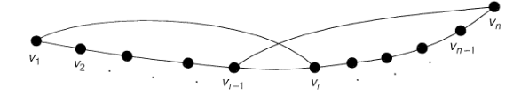
- **Ore-Dirac等价性**：Ore定理的条件和狄拉克定理的条件等价，所以两者可互推
  - **证明**：
    - $D \to O$：由于 $d(u),d(v) \geq \d$，故 $d(u) + d(v) \geq \d \geq 2\cdot \dfrac{n}{2} = n$
    - $O\to D$：设 $u$ 是度最小的顶点，则任取不相邻的 $v$，可设 $d(v) = \d+k$
      - 则 $d(u)+d(v) = 2\d + k \geq n$，故 $\d\geq \dfrac{n-k}{2}$，没法得到直接结论，还是得仿照狄拉克定理的方法
- **图的闭包 $c(G)$**：将 $G$ 中所有满足 $d(u)+d(v)\geq n$ 的不相邻顶点连接起来得到的图
  - 以 $G$ 为子图的最大哈密顿图
  - **生成性**：$G$ 是 $c(G)$ 的生成子图
  - **唯一性**
    - **证明**：反设 $G_1,G_2$ 都是闭包，$\{e_i\}^m_{i=1}，\{f_i\}^n_{i=1}$ 分别是它们添加的边序列
      - 只需 $\{e_i\}^m_{i=1}\subset G_2$ 且 $\{f_i\}^m_{i=1}\subset G_1$ 即可
      - 反设 $e_k = uv$ 是第一个不同的边
        - 设 $H = G + \set{e_1,...,e_k}$，则 $d_H(u) + d_H(v) \geq \nu(G)$
        - 再由于 $H\subset G_2$，故 $d_{G_2}(u) + d_{G_2}(v) \geq \nu(G)$
        - 这与 $uv\notin E(G_2)$ 矛盾
  - **实例**：
  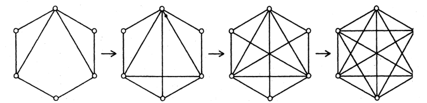
- **闭包判定法**：单图 $G$ 是哈密顿图 $\LR$ 闭包 $c(G)$ 是哈密顿图
  - **证明**：在闭包构造过程中，每添加一条边，都应用一次Ore引理判定，由闭包定义，每次添加的边都满足引理条件，故可得到等价关系
  - **推论**：设 $\nu(G)\geq 3$ 是单图，若 $c(G)$ 是完全图，则 $G$ 是哈密顿图
    - **证明**：由于完全图各顶点的度均为 $n-1$，故任意一条边 $uv$ 都有 $d_c(u)+d_c(v) \geq n$，从而 $c(G)-uv$ 也是哈密顿图。逐次删去这些边即得 $G$ 也是哈密顿图
    - **本质**：完全图是最大的图，它是闭包判定法的终点（但完全图不一定是哈密顿的）
- **度序列判定法（Chvatal引理）**：设 $\nu = \nu(G)\geq 3$ 是单图，顶点的单增度序列为 $(d_1,...,d_v)$
  - 若不存在 $m<\dfrac{\nu}{2}$ 使得 $d_m\leq m，d_{\nu-m} < \nu-m$，则 $G$ 是哈密顿图
  - **证明**：只需证明其闭包是完全图即可
    - 反设 $c(G)$ 不是完全图，$d_c(u)\leq d_c(v)$ 是闭包中两个不相邻顶点，且 $d_c(u) + d_c(v)$ 最大
    - 设 $S$ 是 $V(G)$ 中不与 $v$ 相邻的顶点，$T$ 是 $V(G)$ 中不与 $u$ 相邻的顶点，易得 $|S| = \nu-1-d_c(v)，|T| = \nu - 1-d_c(u)$
    - 再易得 $S$ 中所有顶点的度 $\leq d_c(u)$，$T\cup \{u\}$ 中所有顶点的度 $\leq d_c(v)$。只需设 $d_c(u) = m$，则 $c(G)$ 至少有 $m$ 个度不超过 $m$ 的点，$\nu - m$ 个度小于 $\nu-m$ 个点
    - 再由于 $G$ 是闭包的生成子图，从而该结论对 $G$ 也成立，但此时与假设矛盾
  - **实例**：
    - 下图是哈密顿图，可用Ch判定
    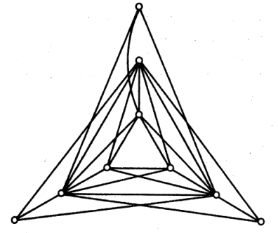
  - **反例**：
    - 上面闭包中的例子是哈密顿图，但无法Ch判定
  - Ch引理强于Ore引理，但不强于闭包判定法
- **优序列**：若 $\forall i，p_i\leq q_i$，则 $\{p_i\}^n_{i=1}$ 优于 $\{q_i\}^n_{i=1}$
- **度优图**：若 $\nu(G) = \nu(H)$，且 $G$ 的非降度序列优于 $H$，则 $G$ 度优于 $H$
  - **实例**：5-圈的度序列是 $(2,2,2,2,2)$，$K_{2,3}$ 的度序列是 $(2,2,2,3,3)$
- **拼接 $G\land H$**：两个不相交图 $G,H$，将每个 $G$ 顶点和 $H$ 顶点连接即可
- **优化判定法（Chvatal定理）**：若 $G$ 是非哈密顿单图，$\nu\geq 3$，则 $G$ 度优于 $C_{m,\nu}$
  - **证明**：
    - 由Chvatal引理，存在 $m<\dfrac{\nu}{2}$ 满足两个度序列不等式，从而 $(\underset{m个}{\underbrace{m,...,m}}，\underset{\nu-2m个}{\underbrace{\nu-m-1,...,\nu-m-1}}，\underset{m个}{\underbrace{\nu-1,...,\nu-1}})$ 优于 $(d_1,...,d_\nu)$
    - 而第一个不等式是 $C_{m,\nu}$ 的非降度序列
  - **Bondy推论**：设 $G$ 是单图，$\nu\geq 3，\e>C^2_{\nu-1}+1$，则 $G$ 是哈密顿图
    - **证明**：已知 $G$ 度优于 $C_{m,\nu}$
      - 故 $\e(G) \leq \e(C_{m,\nu}) = \dfrac{m^2 + (\nu+2m)(\nu-m-1) + m(\nu-1)}{2} \\\ \\ = C^2_{\nu-1} + 1 - \dfrac{(m-1)(m-2)}{2} - (m-1)(\nu-2m-1) \\\ \\ \leq C^2_{\nu-1}+1$
    - **推论**：
      - $v$ 个顶点，$C^2_{v-1}+1$ 个边的非哈密顿单图只能是 $C_{1,v}$
      - 特别地，若 $v = 5$，则是 $C_{2,5}$
      - **证明**：第一个取等时，度序列相等。第二个取等时，$m=2$ 或 $\begin{cases} \nu = 5 \\ m = 1 \end{cases}$。从而两个均取等时便有结论
      
### 考试题

- **分解性增强**：若 $G$ 没有奇数度点，则存在边不重的圈 $C_1,...,C_m$，使得 $E(G) = E(C_1)\cup E(C_2)\cup \cdots\cup E(C_m)$
  - **证明**：呃呃，上面已经给了
  - **推论**：若 $G$ 有 $2k$ 个奇数度点，则存在 $k$ 个边不重的迹，使得 $G$ 是它们的并
    - **证明**：只需证明此时 $G$ 相当于 $k$ 个半欧拉图即可。
- **所有圈的交点**：设 $G$ 是非平凡的欧拉图，$v\in V(G)$，则
  - $G$ 的每条具有起点 $v$ 的迹都能扩充成 $G$ 的欧拉环游 $\LR G-v$ 是森林
  - **证明**：
    - 右侧条件等价于 $G-v$ 无圈，即 $v$ 是所有圈的交点
    - **必要性**：
      - 反设 $G-v$ 存在圈 $C$，由于 $G$ 是欧拉图，故 $C$ 和其它圈边不重
      - 此时我们取一条迹，它走过所有和 $C$ 关联的圈，但没有走 $C$。则它显然无法再扩充为走过 $C$ 的迹（因为边不能重复，无法再回去）
    - **充分性**：
      - 已知欧拉图是边不重圈的并集
      - 再由充分性条件，$v$ 是所有圈的交点，即不存在与 $v$ 不相交的圈。故任意以 $v$ 为起点的迹，它的终点一定在和 $v$ 相交的圈 $C$ 中，将其沿 $C$ 继续走回 $v$，然后接着进入新圈，最终即可得到欧拉环游
- **非哈密顿情况**：若 $G$ 满足下列条件之一，则 $G$ 是非哈密顿图
  - $G$ 不是二连通图
    - **证明（哈密顿圈法）**：等价于 $G$ 存在割点。由于哈密顿轨不能重复踩点，故必须在割点一侧走完全部的顶点，但这样就不能闭合，即不存在哈密顿圈
  - $G$ 是二分图，且其二分类满足 $|X| \neq |Y|$
    - **证明（连通判定法）**：不妨考虑极端情况（完全二分图）。
      - 设 $|X| < |Y|$，则删去 $X$ 时增加了 $|Y|$ 个连通分支，即 $\o(G-X) > |X|$，故不是哈密顿图
- **狄拉克推论**：若 $G$ 是 $\nu>2\d$ 的连通单图，则 $G$ 有长至少为 $2\d$ 的路
  - **证明**：此时恰好是不满足狄拉克定理的情况
    - 反设最长的路为 $P:u\to v$，其中 $|P| = n < 2\d$
      - 依然将顶点编号为 $u = v_1，v = v_{n+1}$
    - 依然设 $S = \set{v_i\mid uv_{i+1} \in E(G)}，T = \set{v_i\mid vv_{i} \in E(G)}$
      - 则 $|S| = d(u) \geq \d，|T| = d(v) \geq \d$
      - 由定义，$v\in S\cup T$，故 $|S\cup T| \leq n < 2\d$，故 $S\cap T \neq \varnothing$
      - 上面都是对狄拉克定理方法的逆命题重述，没啥意思
    - 设 $v_i\in S\cap T$，则可得到圈 $C:uv_2...v_nv\to uv_{n-1}...v_{n+1}u$
      - 由于 $v>2\d，l+1\leq 2\d$，故 $C$ 外存在 $v_0\in V(G)$
      - 再由 $G$ 连通得存在 $C$ 外的路 $P'$ 和 $C$ 相连，不妨设和 $u$ 相连
      - 此时得到 $P' + uv_2...v_nv_{n+1}v_1...v_{n+1}$ 路，其长度大于 $n$，与 $P$ 最长矛盾
  - **理解**：铁有问题，先不看了

### 习题

- **块遗传性**：欧拉图的块也是欧拉图
  - **证明**：由于割点两端的子图之间不存在圈，故删去一个割点外的图时，相当于删去了整数个圈。再由欧拉图等价于边不重圈的并，直得结论
- 设 $G$ 是具有二分类的 $(X,Y)$ 的单偶图，$|X| = |Y| \geq 2$，且 $G$ 有度序列 $(d_1,...,d_\nu)$
  - 若不存在小于等于 $\dfrac{\nu}{4}$ 的 $m$ 使得 $d_m \leq m$，且 $d_{\frac{\nu}{2}} \leq \dfrac{\nu}{2} - m$
  - 则 $G$ 是哈密顿图
  - **证明**：

## 树

- **树**：连通的无圈图
- **森林**：无圈图（分支为树的图）
- **（定理9.1）树的性质/判定定理**：$n$ 节点的树，等价命题为
  - 无圈，边数为 $n-1$
  - 无圈，添加任何边后出现圈
  - 连通，边数为 $n-1$
  - 连通，边均为桥
  - 任意两个顶点间存在唯一轨道
- **证明**：归纳法，首先 $n=1 $易得
    - 无圈，则移除边后变为两个分支，且依然无圈。最后剩下一个顶点，从而顶点数比边数多1
- **推论（枝叶性）**：
  - 每个树至少有两个度为 $1$ 的点
  - 若恰好有两个，则其它点的度均为 $2$（树退化为一条轨道）
  - **证明**：
    - 由于树 $T(V,E)$ 连通，故每个点的度至少为 $1$
    - 再由握手引理 + 鸽巢原理即得结论
      - $\sum d(v) = 2\e$，则
- **（推论9.2）森林边数定理**：$n$ 个顶点，$k$ 个分支的森林，有 $n-k$ 个边

### 考试题

- **连通与割点关系**：每个连通单图至少有两个点不是割点
  - **证明**：
    - 易得树中的 $v$ 是割点 $\LR d(v) > 1$
    - 再由于树中，至少有两个一度顶点，故 $G$ 的支撑树 $T$ 至少存在两个非割点 $v_1,v_2$
    - 再由于 $G$ 和 $T$ 只相差圈边，故删去 $v_1,v_2$ 后，依然连通，从而不是割点
- **（考试原题）**：
  - 若 $G$ 是欧拉图（原条件：顶点的度均为偶数），则 $G$ 无割边
    - **证明**：
      <!-- - 反设存在割边 $uv$，设两分支为 $u\in G_1，v\in G_2$
      - 由于 $u,v$ 的度均为偶数，则 $u$ 在 $G_1$ 中的度为奇数，
        - 因为圈和偶点密切相关，故我们把焦点放在讨论 $G_1$ 中的圈上 -->
  - 若 $G$ 是 $k$ 正则二分图，则 $G$ 无割边
    - **证明**：

### 支撑树（生成树）

- **$G$ 的支撑树（生成树）$T(G)$**
  - **支撑定义**：支撑子图，满足树的定义
  - **生成定义**：将图 $G$ 的圈依次移除一个边，最后形成的树
  - **不唯一性**：只有一个生成树 $T$ 的无圈图 $G=T$（定义易得）
    - **支撑树的数量**： $\tau(G)$
  - **圈秩 $\gamma(G)$**：移除的边数量（$m-n+k$）
- **连通存在性**：$G$ 有支撑树 $\LR G$ 是连通的
  - **证明**：
    - **必要性**：由树的连通性，$G$ 存在连通支撑子图，从而连通
    - **充分性**：极小连通支撑子图 $T$ 的每条边都是桥，从而 $T$ 是支撑树
  - **推论（连通边数定理）**：连通图满足 $e\geq v-1$
    - **证明**：由连通性，$e(G) \geq e(T) = \nu(T)-1 = \nu(G)-1$
- **$G$ 的余树**：$T^* = G\j T(G)$
- **余树无割集性**：设 $G$ 的支撑树为 $T$，则余树 $T^*$ 中不存在 $G$ 的割集
    - **证明**：反设存在割集 $B$，则 $G-B$ 不连通。再由于 $G-T^* = T\subset G-B$，即 $G-B$ 是 $T$ 并上某些关联的边，故连通性强于 $T$。再由 $T$ 的连通性即得矛盾
    - **理解**：若余树存在割集，则删去余树后图不连通，与支撑树的连通性矛盾
- **余树割集**：$\forall e\in E$，$T^*(G)+e$ 存在唯一的 $G$ 割集，写作 $\Omega(e)$
  - **证明**：
    - **存在性**：
      - 由树的定义，$T-e$ 不连通，且连通分支最多为两个，设为 $T_1,T_2$，且 $V(T_1) = S$
      - 易得 $\ol S = V(T_1)$，从而 $\Omega(e) = \{S,\ol S\}$ 是割集
    - **唯一性**：反设 $\Omega'(e)$ 也是割集
      - 由割集最小性，$G\j\Omega'(e)\supset T-e$，即 $G[S']\cup G[\ol S'] \supset T_1\cup T_2$
      - 再由补集不相交性，必有 $G[S']\supset T_1，G[\ol S']\supset T_2$，从而 $S' = V(T_1) = S$，从而割集唯一
  - **本质（对偶性）**：余树和割集的关系，类似支撑树和圈的关系（余树是不含割集的最大子图）
- **对称引理**：两个支撑树中，$T_1\j T_2$ 和 $T_2\j T_1$ 的顶点数与边数相等
- **正交定理**：
  - 设 $G = (V,E)$，其中 $|V| = n，|E| = m$
  - 若用 $m$ 维向量表示回路和割集，则向量族相互正交，且维数分别为 $m-n+1，n-1$
  - **证明**：
- **迭代**：已知两个支撑树 $T_1,T_2$
  - 设 $e = T_1\j T_2$，则 $T_2+e$ 包含唯一回路 $C(e)$，且 $C(e)$ 至少含有 $e'\in T_2\j T_1$
  - 从而 $T_2' = T_2+e-e'$ 也是支撑树，但 $|T_1\cap T_2| = |T_1\cap T_2'| - 1$
  - $T_2\to T_2'$ 称为迭代
- **迭代定理**：两个支撑树中，若 $|T_1\j T_2| = k$，则 $T_2$ 经过 $k$ 次迭代即可变为 $T_1$
  - **应用**：贪心算法

### 习题

- **支撑树运算传递性**：若 $T$ 是 $G$ 的生成树，$e$ 是非环边，则
  - $\begin{cases} \nu(G\j e) = \nu(G)-1 \\ e(G\j e) = e(G)-1 \\ \o(G\j e) = \o(G) \end{cases}$
  - $T-e$ 是 $G-e$ 的生成树
  - $T\j e$ 是 $G\j e$ 的生成树
- **支撑树分解定理**：$\tau(G) = \tau(G-e) + \tau(G\j e)$
  - **证明**：
    - 由于支撑树削去任意边后就不再是支撑树，故 $\tau(G-e)$ 对应不含 $e$ 的 $G$ 支撑树数量。
    - 再由 $G\j e$ 的支撑树加上 $e$ 后就是 $G$ 的支撑树，故 $\tau(G\j e)$ 对应含 $e$ 的 $G$ 支撑树数量。
  - 分解过程中，可能会出现非单图

### 支撑森林（生成森林）

- **生成森林**
  - **切集秩 $\xi(G)$**：森林的圈秩
  - **补集**
- **（定理9.3）公共定理**：图的切集与生成森林存在一个公共边，图的圈与补存在一个公共边
  - **证明**：
    - 设 $C^*$ 是 $G$ 切集，移除后增加分支 $K、H$。则生成森林中，连接K和H的边即为公共边
    - 设 $C$ 是 $G$ 的圈，反设无公共边，则 $C$ 含于某个 $T$，与圈矛盾
- **T关联的基础圈集**：添加一个与G不同的边到生成森林 $T$ 上所形成的圈，全集是基础圈集
  - 数量等于圈秩
- **T关联的基础割集**：移走 $T$ 的一个边，将其分成两个不相交集合 $V_1$、$V_2$。所有连接 $V_1$ 和 $V_2$ 的G的边 $e$ 是切集，全集 $\{e\}$ 是基础切集
  - 数量等于切集秩

### 计数树

- **标记树**：给树的节点编号，则原树成为标记树
- **（定理10.1）Caylay定理**：过 $n$ 个有标志顶点的树的数目等于 $n^{n-2}$
  - **等价命题**：用 $n-1$ 条边连接 $n$ 个顶点的连通图个数为 $n^{n-2}$
  - **等价命题**：$\tau(K_n) = n^{n-2}$
  - **证明（一一对应法）**：
    - 给树叶编号为 $1\sim n$
    - **删除方法**
      - 首先找到标号最小的顶点 $a_1$，其邻接点设为 $b_1$。消去 $a_1$ 和边 $a_1b_1$，则 $b_1$ 成为新顶点。
      - 重复 $n-2$ 次，则最后剩下一条边，一棵树对应序列 $b_1,b_2,...,b_{n-2}$ 
    - **恢复方法**
      - 已知数列 $1,...,n$ 和节点编号序列 $b_1,...,b_{n-2}$，则在数列中找到一个不出现在节点编号序列中的数，设为 $a_1$，从而得到边 $(a_1,b_1)$
      - 重复至编号集为空集，剩下最后一条边
    - 由于取编号任意，因此共有 $n^{n-2}$ 种方案
- **（定理10.3）矩阵树定理**：G是具有顶点 $\{v_1,...,v_n\}$ 的连通单图
  - 设度数矩阵 $M = (m_{ij}) = \begin{cases} m_{ii} = deg(v_i) \\ m_{ij} = -1\quad 相邻 \\ m_{ij} = 0\quad 不相邻\end{cases}$
  - 则G的生成树数量等于M任何元素的余子式

### 最小树

- **$G$ 的最小树**：权最小的支撑树
- **余树最大定理**：支撑树 $T$ 最小 $\LR \forall e\in T^*$，都有 $W(e) = \max\limits_{e'\in C(e)}W(e')$
  - $C(e)\subset T+e$ 是唯一的回路
  - **证明**：
    - **必要性**：反设 $e$ 不是最大边。设最大边为 $\tilde{e}$
      - 由树的回路性得 $T' = T+e-\tilde{e}$ 也是支撑树，且权更大，与最小性矛盾
    - **充分性**：最小性易得，只需证明唯一性
      - 设 $e \in T_1\j T_2$，则 $T_2+e$ 包含回路 $C(e)$，其上有 $e'\notin T_1$
      - 由对称引理，两树的两个差的边存在对应关系 $\p(e_i) = e_{j_i}'$，且均在 $T_2+e_i$ 的回路 $C(e_i)$ 上
      - 由题设 $W(e_i) \geq W(e'_{j_i})$。再由迭代定理，即得 $W(T_1)\geq W(T_2)$，反之同理，故它们权相等，唯一性得证
    - **理解**：由支撑性，$G$ 中任何回路，都只有一个余树边，其余的均为支撑树边。再由最小性即得余树边的权最大性
    - **推论**：支撑树 $T$ 唯一最小 $\LR \forall e\in T^*$，$e$ 是 $C(e)$ 中唯一最大边
- **原树最小定理**：支撑树 $T$ 最小 $\LR \forall e\in T$，都有 $W(e) = \min\limits_{e'\in \Omega(e)}W(e')$
  - $\Omega(e)\subset T^*+e$ 是唯一的割集
  - **证明**：
    - **必要性**：同上
    - **充分性**：反设 $T^\circ$ 满足题设，但不是最小支撑树
      - 设最小支撑树集合为 $\ms D$
      - 最小支撑树 $\widetilde{T}$ 满足 $|\wt T\cap T^\circ| = \max\limits{T\in\ms D} |T\cap T^\circ|$
      - 设 $e\in T^\circ\j\wt T$，则 $\wt T+e$ 包含回路 $C(e)$
      - 由 ，$|C(e)\cap \Omega(e)| \geq 2$，从而存在 $\wt e\in (\Omega(e)\cap C(e))$
        - 设 $T' = \wt T+e-\wt e$，故 $W(T')\leq W(\wt T)$，从而 $T'$ 最小
        - 但 $|T'\cap T^\circ| > |\wt T\cap T^\circ|$，矛盾
  - **推论**：支撑树 $T$ 唯一最小 $\LR \forall e\in T^*$，$e$ 是 $\Omega(e)$ 中唯一最大边
