# 图论基本问题

## 图论算法

### 最短路问题

### 旅行商问题TSP

- 给定城市、距离、成本，找到最短路径访问所有城市，并回到起始城市

### 邮差问题CPP

- 无向图中找到最短回路，使得每条边至少被经历一次

## 图论证明

### 斯佩纳引理

- **单纯剖分**：只有一条边或一个顶点相交的两个三角形，可被分为有限个更小的三角形
- **标签化**：给分出来的小三角形的顶点赋予数字标签
- **真标签化**：若原本的三个顶点被赋予 $0,1,2$ 标签，且和三者
  - **可分辨三角形**：单纯剖分中，具有 $0,1,2$ 标签的三角形
  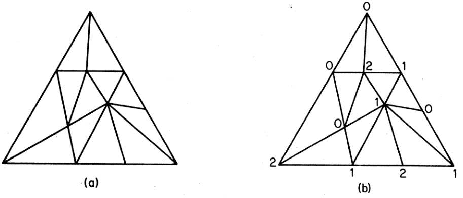
- **sperner引理**：每个真标签化的三角形单纯剖分都有偶数个可分辨三角形
  - **证明**：设 $T_0$ 是 $T$ 外的区域，$T_1,...,T_n$ 是剖分的三角形。将有公共边 $(0,1)$ 的 $T_i$ 和 $T_j$ 所对应的的 $v_i,v_j$ 连接起来，得到如下的图
  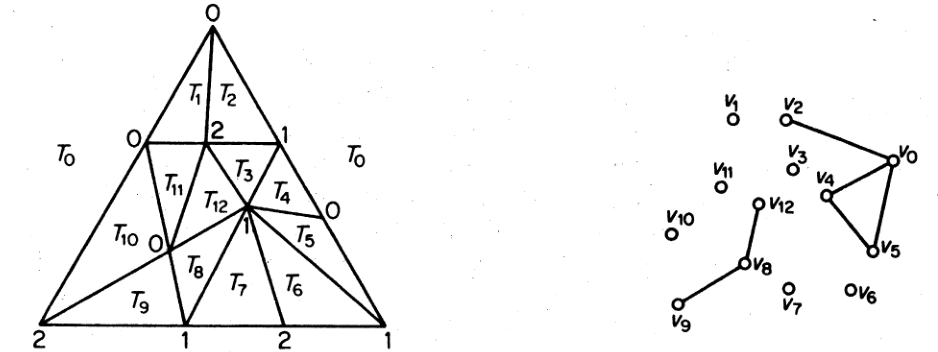
  - 易得 $v_0$ 是奇数度，从而。易得没有顶点的度为 $3$，从而奇数度顶点只能为 $1$ 度。再由 $v_i$ 的度为 $1$ 等价于 $T_i$ 是可分辨三角形，即得结论
- **Brouwer不动点定理**：详见泛函和代数拓扑
  - **证明**：已知闭圆盘同胚于闭三角形，设 $T$ 是顶点为 $x_0,x_1,x_2$ 的三角形，则由三点共线知识，$T$ 边上的点都可唯一写成 $x = a_0x_0 + a_1x_1 + a_2x_2\pad (\sum a_i = 1)$ 的形式
    - 设 $f:T\to T，(a_0,a_1,a_2)\mapsto (a_0',a_1',a_2')$ 是连续映射
    - 设 $S_i = \set{(a_0,a_1,a_2)\mid a_i'\leq a_i}$。若 $\bigcap S_i$ 中有点 $(a_0,a_1,a_2)$，则由定义，只能是 $(a_0',a_1,a_2') = (a_0,a_1,a_2)$，从而是不动点
    - 反设 $\bigcap S_i = \varnothing$
      - 易得存在 $T$ 的剖分满足真标签化，且 标签为 $i$ 的顶点在 $S_i$ 中
      - 由Sperner引理，存在可分辨三角形，三个顶点分别在 $S_i$ 中
      - 再由剖分的任意性，可取三个顶点距离极小的剖分。再由于 $S_i$ 是闭集，即得交集不为空

## 图与运筹

### 最小树问题

- **最小树问题**：已知 $n$ 个节点，求连通这些节点的最短的树
- **破圈法**：
  - 若连通 $G$ 不存在回路，则其最小
  - 若存在回路，则选取一个，去掉权最大的边，直到不含回路
- **（定理11.1）Kruskal算法（贪心算法）**：
  - 设 $e_1$ 是最小权重的边
  - 每个步骤中，选取和已选边不构成圈的，权重最小的边
  - 当无法选取时，需要的树就是这些边的子图
  - **证明**：
    - 无法选取时，易得该子图 $T$ 是生成树
    - 反设存在生成树 $W(S) < W(T)$，则设 $e_k$ 是第一个和S不重合的边，则添加 $e_k$ 到S上，从而形成圈 $C$
    - 圈 $C$ 中必定含有 $e$ 不与T重合，则将 $e$ 替换为 $e_k$，形成新生成树 $S'$
      - 由于构造规则，$W(e_k)\leqslant W(e)$，从而 $W(S') \leqslant W(S)$
      - 不断重复这个过程，我们发现 $S'$ 越来越偏离S而变为T，从而矛盾
  - **应用**：
    - **第一步**：将 $E$ 按权升序排列 $\{e_1,\cdots, e_m\}$，$S = \varnothing，i=0,j=1$
    - **第二步**：若 $S = i = n-1$，则停止，$G[S]$ 即为最小树，否则到第三步
    - **第三步**：若 $G[S\cup \{e_j\}]$ 不构成回路，则 $e_{j+1} = e_j$，$S\cup $
  - **复杂性分析**：$O(n^2\log_2 n)$
    - 第一步：排列边 $m\log_2 m$ 次
    - 第二步：最多循环 $n$ 次
    - 第三步：
- **Dijkstra算法**：
  - 设 $V = \{1,\cdots,n\}$
  - **第一步**：设 $u_j = w_{1j}$，$T = \varnothing$，$R = 1$，$S = V-\{1\}$
  - **第二步**：$u_k = \min\limits_{j\in S}\{u_j\} = w_{ik}$，$T\cup \{e_{ik}\}$，$R\cup \{k\}$，$S-\{k\}$
  - **第三步**：若 $S = \varnothing$，则停止，否则 $u_j = \min\{u_j,w_{kj}\}\quad (j\in S)$，返回第二步

### 最短有向路问题

- **有向网络** $G(N,A,W)$
  - 点集 $N=\{1,\cdots,n\}$
  - 弧集 $A$
  - $u_j$：$1$ 到 $j$ 的最短有向路长度
  - $w_{kj}$：弧 $(k,j)$ 的长度（若不是弧则长度为无穷大）
- **最短有向路方程**：$\begin{cases} u_1 = 0 \\ u_j = \min\limits_{k\neq j} \{u_j + w_{kj}\}，j = 2,...,n \end{cases}$
- **存在和唯一性定理**：
  - 若
    - $G$ 不含非正向回路
    - $\forall j\neq 1，u_j < +\infty$
  - 则最短有向路方程有唯一有限解 $\{u_j\}^n_{j=2}$
  - **证明**：设一组有限解为 $\{u_1,...,u_n\}$
    - 对 $\forall u_j$，可构造有向路集合 $P = \{(1,i_1),(i_1,i_2),\cdots,(i_{k},j)\}$ 使得 $u_{ik} = u_{i_{k-1}} + w_{i_{k-1},i_k}$
    - 反设解不唯一，设 $u_j \neq u'_j$，则由 $u_j$ 最短性，$u_j < u'_j$
      - 由于 $u_1 = u_1'$，故存在 $k$，使得 $(k,j)$ 是最短有向路的弧，且 $u_k = u'_k$
      - 则 $u_j' > u_j = u_k + w_{kj} = u_k' + w_{kj}$，与方程矛盾
- **特殊解法**：
  - 若 $G$ 中的点满足 $i<j$ 时成立两种情况之一
    - $\begin{cases} u_i\leq u_j \\ w_{ji} \geq 0 \end{cases}$（等号不同时成立）或 $\begin{cases} u_i > u_j \\ w_{ji} = +\infty \end{cases}$
  - 则方程 $k\neq j$ 可简化为 $k<j$
  - **理解**：此时后项依赖于前项，可依次求出
- **Dijkstra算法**：权为正值的有向网络 $G(N,A,W)$ 中，最短有向路的长大于其真子有向路的长
  - **应用**：
    - **第一步（初始化）**：$\begin{cases} u_1 = 0 \\ u_j = w_{1j} \end{cases}$，$P = \{1\}$，$T = N-P$
    - **第二步（指出永久标号）**：找出最短路序号 $k$（$u_k = \min\limits_{j\in T} \{u_j\}$），$P\cup \{k\}$，$T-\{k\}$
    - **第三步（修改临时标号）**：对 $T$ 中所有 $j$，$u_j = \min\{u_j，u_k+w_{kj}\}$，返回第二步
  - **复杂度分析**：$O(n^2)$
    - 最多 $n-1$ 次循环
    - 第二步 $\dfrac{1}{2}(n-1)(n-2)$ 次比较
    - 第三步 $\dfrac{1}{2}(n-1)(n-2)$ 次加法，$\dfrac{1}{2}(n-1)(n-2)$ 次比较

### 最大流问题

- **有向网络**：$G(N,A,C)$
  - **弧 $(i,j)$ 的容量 $c_{ij}$**
  - **发点 $s$**：流的起始点
  - **收点 $t$**：流的终点
  - **流量**：$x_{ij}\in [0,c_{ij}]$
- **守恒方程**：$\sum\limits_j x_{ij} = \sum\limits_i x_{ij} = \begin{cases} +v，\quad i=s \\ 0，\quad\pad i\neq s,t \\ -v，\quad i=t \end{cases}$
- **$(s,t)$ 可行流**：满足容量条件和守恒方程
  - **前向弧**：从发点指向收点
  - **后向弧**：从收点指向发点
- **$(S,T)$ 割**：$(s,t)$ 流满足 $s\in S，t\in T$
  - **割 $(S,T)$ 的容量**：$C(S,T) = \sum\limits_{i\in S}\sum\limits_{j\in T} c_{ij}$
- **增广路**：前向流非饱和，后向流非零
  - **可增性**：前向增加，后向减少
- **增广路定理**：可行流是最大流 $\LR$ 不存在 $s\to t$ 的增广路
  - **证明**：
    - **必要性**：定义直得
    - **充分性**：设 $x$ 是不存在增广路的流，$S$ 是满足 $s\to j$ 均有增广路的最大点集
      - 设 $S$ 补集为 $T$ ，则 $\forall i\in S,j\in T$，有 $\begin{cases} x_{ij} = c_{ij}\\ x_{ji} = 0 \end{cases}$
      - 总流量 $v = \sum\limits_{i\in S}(\sum\limits_{j\in G}x_{ij} - \sum\limits_{j\in G}x_{ji})$
        - 可分离为 $S$ 和 $T$
        - 再由守恒方程，$S$ 的项均为0
        - 故最终化为 $v = \sum\limits_{i\in S}\sum\limits_{j\in T} x_{ij}$
      - 再由不存在增广路，$x_{ij} = c_{ij}$，故 $v = C(S,T)$。由容量最大性，得$v$ 是最大流
  - **推论（最大流最小割定理）**：$(s,t)$ 流的最大值 $= (s,t)$ 割的最小值
- **整流定理**：若弧容量均为整数，则存在值为整数的最大流
  - **证明**：若流不是最大，则允许增广，且一定可以增广到某个路的最大容量
    - 再由容量整数性，该流可以增广到整流
    - 若还不是最大，再次进行增广。但始终增广为整流，故最大流也是整流
- **Ford-Fulkerson标号法**：
  - **标号法**：$\begin{cases} (+j,\d(i))，\quad \exist 弧(j,i)，使得 x_{ji}<c_{ji} \\ \d(i) = \min\{\d(j),c_{ji}-x_{ji}\} \\\\ (-j,\d(i))，\quad \exist 弧(j,i)，使得 x_{ji}>0 \\ \d(i) = \min\{\d(j),x_{ji}\} \end{cases}$
    - 标号已检查：自身和相邻点均有标号
    - 标号未检查：只有自身有标号
    - 未标号
  - **应用**：
    - **第一步（开始）**：寻找整数可行流 $x = (x_{ij})$，给 $s$ 标号 $(-,\infty)$
    - **第二步（找增广路）**：
      - 找一个标号但未检查的点 $i$，进行检查并标号，转到第三步
      - 若所有标号点均被检查，转到第四步
      - 若已被标号，转到第三步
    - **第三步（增广）**：使用指示标号构造增广路
      - **后继节点**：$i$
      - **$i$ 的可增流量**：$\d(i)$
    - **第四步（构造最小割）**：
      - 把所有标号点记为 $S$，未标号点记为 $T$，便得到最小容量割
  - **复杂度分析**：$O(mv)$
    - 弧数为 $m$，寻找增广路最多需要检查 $2m$ 次
    - 弧容量为整数，最多需要 $最大流值v$ 次增广

### 最小费用流问题

- **$(x_{ij})$ 的费用**：$\sum\limits_{i,j} w_{ij}x_{ij}$
- **最小费用流问题**：求一个 $s$ 到 $t$ 值为 $v$ 的流，使得流的费用最小
  - **线性规划性**：
    - 目标函数：费用最小
    - 约束：
      - $s$ 流出的总量为 $v$
      - $t$ 流入的总量为 $-v$
      - 总流量为 $0$
      - 可行流
- **对偶算法**：本质是对偶单纯形法
  - 点 $i$ 的对偶变量 $p(i)$
  - 弧 $(i,j)$ 的对偶变量 $r_{ij}$
- **步骤**：
  - **初始化**：$x_{ij} = 0，p(i) = 0$
  - **变流条件**：
    - $I = \{(i,j)\mid p(j)-p(i) = w_{ij}，x_{ij}<c_{ij}\}$
    - $R = \{(i,j)\mid p(j)-p(i) = w_{ij}，x_{ij}>0\}$
    - 不可行流 $Q = (I\cup R)^c$
  - **改变流量**：
    - 用最大流算法，在 $I\cup R$ 上找增广路
      - 若流量已经是 $v$，则得到最小费用流
      - 若无增广路，则在全集 $Q\cup I\cup R$ 上找增广路
        - 若也无增广路，则无解
        - 若有增广路，使有标号点 $S$ 上的 $p(i)$ 不变，无标号点 $T$ 上的 $p(i)$ 增加1，然后重新查看变流条件

#### 运输问题

- **运输问题**：
  - 发点 $i$ 可供应的产品数量：$a_i$
  - 收点 $j$ 所需的产品数量：$b_j$
  - $ij$ 之间的单位产品运输费用 $w_{ij}$
  - $ij$ 之间的产品数量 $x_{ij}$
  - **线性规划**：
    - $\min \sum\limits_{i,j} w_{ij}x_{ij}$
    - $\begin{cases} \sum\limits_{j} x_{ij} = a_i\quad (1,...,m) \\ \sum\limits_{i} x_{ij} = b_j\quad (1,...,n) \\ x_{ij} \geq 0 \end{cases}$
- **原始算法**：本质也是对偶单纯形法

## 对集

### 大小关系

- **对集**：图 $G$ 中，若边集 $M$ 的元素两两不相邻，则 $M$ 是 $G$ 的对集
  - **配对定义法**：$M$ 的端点可看作两两配对
- **最大基数对集**：不存在比 $M$ 边数更多的对集
- **完美对集**：$G$ 的每一个点都是 $M$ 的饱和点
  - **$M$ 饱和点**：存在 $M$ 的一条边与该点关联
  - **最大性**：完美对集 $\subset$ 基数最大对集（左下角(a)不是完美对集，因为有两个 $1$ 度顶点）
  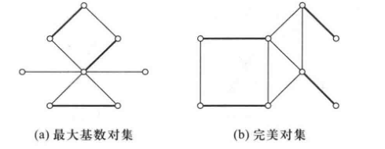
- **M交错路**：在 $M$，$\ol M$ 中交替的路
- **M增广路**：起点和终点都是 $M$ 非饱和点的 $M$ 交错路
- **Berge定理**：对集 $M$ 是最大基数对集 $\LR G$ 不包含 $M$ 增广路
  - **证明**：
    - **必要性**：反设存在M增广路 $P = (i_0,i_1,\cdots,i_{2k+1})$，则可设
      - $M' = \Big\{M\backslash\{i_1i_2，i_3i_4，...，i_{2k-1}i_{2k}\}\Big\} \bigcup \Big\{i_0i_1，...，i_{2k}i_{2k+1}\Big\}$
      <!-- - $M' = \left[ M\j \Big\{\{i_1,i_2\},\{i_3,i_4\},\cdots,\{i_{2k-1},i_{2k}\}\Big\} \right]\bigcup \\  \Big\{\{i_0,i_1\},\cdots, \{i_{2k},i_{2k+1}\}\Big\}$ -->
        - 删去头奇尾偶（k个），增添头偶尾奇（k+1个）
        - 由于 $i_0，i_{2k+1}$ 都是非饱和点，故 $i_0i_1，i_{2k}i_{2k-1}$ 都不在 $M$ 中
        - 再由交错路定义，即得本质是 $M$ 删除 $P$ 中出现的k个边，但增加 $P$ 中不出现的k+1个边
      - 由构造易得端点不相邻，从而 $M'$ 也是对集
      - 但 $|M'| = |M|+1$，与最大基数矛盾
      - 对于 $P$ 长为偶数的情况，同理讨论即可
    - **理解**：
      - 增广路交错性与奇偶一一对应
      - 再由起始点非饱和性，与偶数比奇数多契合，从而得到构造方法
      - 本质是两头栽树问题
    - **充分性**：反设不包含 $M$ 增广路，但 $M$ 不是最大基数对集，最大基数对集为 $M'$
      - 设对称差生成的子图为 $H = G[M\D M']$，则其中每个点的度为1或2
        - 对称差运算后，都不包含的边和都包含的边均被消去。再由端点不相邻性，得图如下
        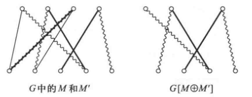
        - 从而 $H$ 的连通分支是（$M，M'$ 中交错出现的偶回路）或（$M，M'$ 中交错出现的路）
      - 再由 $H$ 中 $|M'| > |M|$，故由对称差交错性，存在一个连通分支 $P$ 起始并终止于 $M'$ 的边，即起点和终点是 $G$ 中的 $M$ 非饱和点，从而是 $G$ 的 $M$ 增广路，矛盾 
    - **理解**：（对称差交错性）得（增广路可增广性）
  - **本质**：最大基数得补集对称性，对集得交错性，从而与增广路的对称性、交错性契合

### 二分图的饱和关系

- **子集 $X$ 的邻集 $\Gamma_G(X)$**：与 $X$ 中的点相邻的所有点的集合
- **二分图饱和**：设 $G$ 是二分图，$S,\ol S$ 是二分划，若对集 $M$ 满足 $S$ 的每个点都是 $M$ 饱和点，则称对集 $M$ 饱和 $S$ （的每个点）
  - 由于“二分”本身就具有一些配对性质，故二分图和对集可以导出很好的性质
  - **非边割性**：$M$ 不是边割 $\{V(S),V(T)\}$
    - **反例**：完全二分图中，每个顶点都关联 $|\ol S|$ 个边，仅仅削除配对边的话，是无法去除连通性的
  - **割边性**：二分图的每条边都是割边（也不关M什么事）
- **Hall定理**：设二分图 $G$ 有二分类 $(S,T)$，则
  - 存在饱和 $S$ 的对集 $\LR \forall X\subset S$，有 $|\Gamma(X)| \geq |X|$
  - **证明**：
    - **必要性**：设 $G$ 有对集 $M$ 饱和 $S$ 的每个顶点，$X$ 是 $S$ 的子集
      - 则 $X$ 的点通过 $M$ 和 $\G(X)$ 中的相异点连接，构成对应关系，从而 $|\G(X)|\geq |X|$
    - **理解**：二分对应性，通过 $M$ 建立规则，得到单射性，从而得到基数关系
    - **充分性**：反设 $G$ 满足题设，但不包含饱和 $S$ 的对集
      - 设 $M'$ 是 $G$ 的最大基数对集，此时存在 $u$ 是 $S$ 的 $M'$ 非饱和点
      - 设 $Z$ 是通过 $M'$ 交错路和 $u$ 连接的点的全集
        - 由最大基数性得 $u$ 是 $Z$ 中唯一的 $M'$ 非饱和点。否则 $M'$ 添加边 $(u,v)$ 即可构成更大基数对集
      - 设 $X = Z\cap S，Y = Z\cap T$
        - 易得 $X\j \{u\}$ 的点在 $M'$ 下与 $Y$ 配对，故 $|Y| = |X|-1$
      - 再由 $\G(X)$ 中的每个点均通过 $M'$ 交错路和 $u$ 连接，得 $\G(X)\subset Y$
      - 再由题设 $|\G(X)|\geq |X| > |Y|$，得 $\G(X) = Y$。但 $|\G(X)| = |X|-1 < |X|$，矛盾
      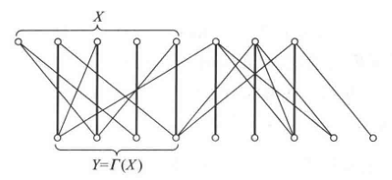
    - **理解**：还是配对性
      - 利用了非饱和点在最大基数对集下的唯一性，得到基数关系
      - 再由二分连接性和对集连接性的契合，得到邻集和补集的包含关系
      - 从而得到基数与包含的矛盾
  - **本质**:
  - **推论（婚姻定理）**：若 $G$ 是k-正则二分图，则其存在完美对集
    - **证明**：设二分划为 $(X,Y)$，由k-正则性得 $k|X| = |E| = k|Y|$，从而 $|X| = |Y|$
      - 设 $S$ 是 $X$ 子集，$E_1$ 是和 $S$ 关联的边集，$E_2$ 是和 $\G(S)$ 关联的边集
        - 由邻集定义，和 $x\in S$ 关联的边 $e = xy$ 满足 $y\in \G(S)$，即 $e$ 也和 $\G(S)$ 关联。故 $E_1\subset E_2$
          - 从而 $k|\G(S)| = |E_2| \geq |E_1| = k|S|$
          - 从而由Hall定理，$X$ 中存在饱和对集 $M$。再由 $|X| = |Y|$ 即得 $M$ 是完美对集
    - **理解**：Hall定理的直接应用（容易理解，邻集在正则二分图中是必定大于原点集的）
    - **本质**：若每个女都认识 $k$ 个男，每个男认识 $k$ 个女，则每个男女都可配对
- **点覆盖**：若 $G$ 的每条边都至少有一个端点在顶点集 $K$ 中，则称 $K$ 是点覆盖
- **最小点覆盖 $\wt K$**
  - **对集关系**：$|M| \leq |\wt K|$，若取等则分别为最大基数对集和最小点覆盖
    - **证明**：对集是相邻点的匹配，其基数当然不可能比点覆盖更大
- **Konig定理（对偶定理）**：二分图中，最大对集和最小点覆盖的基数相等（$|M| = |\wt K|$）
  - **证明**：
    - 易得若满足等式，则必定是最大对集、最小点覆盖
    - 设
      - $S$ 中 $M'$ 非饱和点全集为 $U$
      - $Z$ 是通过 $M'$ 交错路和 $u\in U$ 连接的点的全集
      - $X = Z\cap S，Y = Z\cap T$
    - 则已知 $Y$ 中点均 $M'$ 饱和，$\G(X) = Y$
    - 设 $\wt K = (S\j X)\cup Y$，则 $G$ 的每条边至少有一个端点在 $\wt K$ 中，否则矛盾
    - 从而 $\wt K$ 是 $G$ 的点覆盖，且 $|M'| = |\wt K|$，从而是最小点覆盖
  - **理解**：

### 完美对集判定

- **奇/偶分支**：奇/偶数个顶点的连通分支
  - **奇分支的个数 $\omicron(G)$**
- **分支判定法（Tutte定理）**：$G$ 存在完美对集 $\LR \forall S\subset V，\omicron(G-S)\leq |S|$
  - **证明（Lovasz）**：
    - **必要性**：设 $M$ 是完美对集，任取顶点集 $S$，设 $G_1,...,G_n$ 是 $G-S$ 的奇分支
      - 由于分支是奇的，故 $\forall G_i$ 中必定存在顶点 $u_i$ 与（$S$ 中顶点 $v_i$）通过（$M$ 的边）匹配。从而 $\omicron(G-S) = n = |\set{v_1,...,v_n}| \leq |S|$
    - **充分性**：反设 $G$ 没有完美对集，则存在一个最大的无完美对集图 $G^*$，且 $G$ 是它的生成子图。易得 $G-S$ 也是 $G^*-S$ 的生成子图，从而 $\omicron(G^*-S) \leq \omicron(G-S)\leq |S|$
      - 设 $U$ 是 $G^*$ 中度为 $\nu-1$ 的顶点，由于 $U = V$ 时显然有完美对集，设 $U\neq V$，只需 $G^*-U$ 是完全图的不交并即可
      - 反设其存在非完全图的连通分支，易得在这些分支中有顶点 $x,y,z$ 满足 $\begin{cases} xy\in E(G^*) \\ yz\in E(G^*) \\ xz\notin E(G^*) \end{cases}$。再由 $y\notin U$，存在顶点 $w\in G^*-U$ 满足 $yw\notin E(G^*)$
      - 再由 $G^*$ 的最大性，增添某边后 $G^*+e$ 均存在完美对集。故可设 $M_1,M_2$ 分别是 $G^*+xz$ 和 $G^*+yw$ 的完美对集，$H = G^*\cup \{xz,yw\}$
      - 由于 $H$ 的顶点均为2度，其为圈的不交并。再由交错性，这些圈都是偶圈
        - 若 $xz$ 和 $yw$ 在 $H$ 的不同分支中，设 $yw$ 在圈 $C\subset H$ 中，则 $M_1\cap C$ 和 $M_2-C$ 就组成了完美对集，矛盾
        - 若 $xz$ 和 $yw$ 在 $H$ 的同一分支 $C$ 中，由 $x,z$ 的对称性，可以假设顺序如下面的b图
        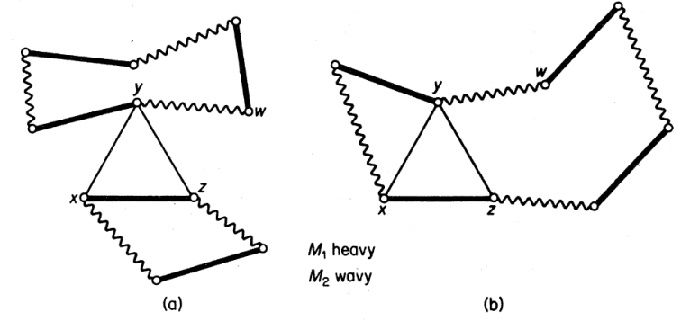
      - 综上，$G-U^*$ 是完全图的不交并，$\omicron(G^*-U) \leq |U|$，从而最多有 $|U|$ 个分支是奇分支
        - 则此时令奇分支中某点和 $U$ 中某顶点配对，剩余部分配对如下图：
        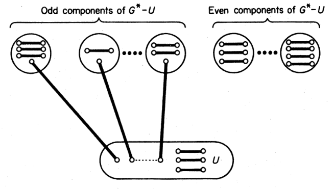
    - 综上，$G$ 存在完美对集
  - **推论**：无割边的3-正则图中存在完美对集
    - **证明**：
      - 任取顶点集 $S$，设 $G_1,...,G_n$ 是 $G-S$ 的奇分支，$m_i$ 是两端点分别在 $G_i$ 和 $S$ 中的边的数量
      - 由3-正则性，$\sum\limits_{v\in V(G_i)} d(v) = 3\nu(G_i)，\sum\limits_{v\in S} d(v) = 3\nu(G_i)$
      - 此时 $m_i = \sum\limits_{v\in V(G_i)} d(v) - 2\e(G_i)$ 是奇数，再由于没有割边，$m_i\neq 1$，从而 $m_i\geq 3$
      - 即 $\omicron(G-S) = n\leq \dfrac{1}{3}\sum\limits^n_{i=1} m_i \leq \dfrac{1}{3} \sum\limits_{v\in S} d(v) = |S|$
    - **理解**：
    - **反例**：
      - 下图是存在割边的3-正则图，其没有完美对集
      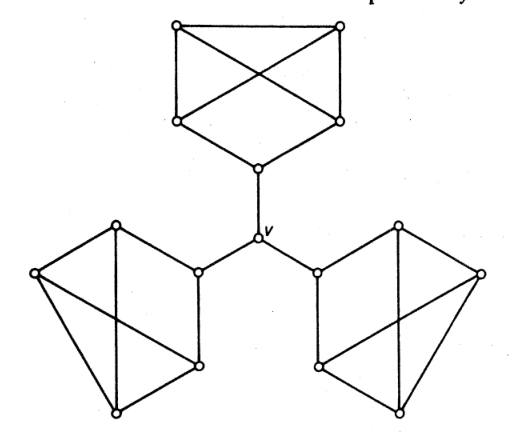
      - **证明**：$\omicron(G-v) = 3$，从而没有完美对集
      

### 最大对集问题

- **最大对集问题**：求二分图的最大基数对集
- 最大流算法
- **匈牙利算法**：

### 最大权对集问题（分派问题）

- **原始对偶方法**

### 考试题

- **完美二分定理**：二分图 $G$ 有完美对集 $\LR$ 对所有顶点集 $S$ 都有 $|\G(S)|\geq |S|$
  - **证明**：
    - **充分性**：此时由Hall定理得，任意顶点集均存在饱和对集。故取 $V$ 的饱和对集就是完美对集
    - **必要性**：同上，反推即可
  - **反例**：若 $G$ 不是二分图，则不成立
    - 考虑邻点最多的图——完全图即可。容易发现 $K_{2n+1}$ 就没有完美对集
- **完美树定理**：树 $G$ 有完美对集 $\LR \forall v\in V(G)，o(G-v) = 1$
  - **证明**：
    - **必要性**：
      - 由Tutte定理，此时 $o(G-v) \leq |\{v\}| = 1$
      - 再由 $\nu(G)$ 为偶数，故 $\nu(G-v)$ 是奇数，故 $o(G-v) \geq 1$
    - **充分性**：
      - 设 $G-v$ 中唯一奇分支为 $C_0(v)$，和 $v$ 的关联边为 $e(v) = vu$
        - 易得 $e(v)$ 依赖于 $v$ 唯一
        - 再易得 $e(u) = uv$
          - 因为此时 $C_0$ 变为 $C_0-u$，成为偶分支。而另外一个偶分支加上了 $v$，成为奇分支。故关联边还是 $uv$
        - 故 $M = \{e(v)\mid v\in G\}$ 构成 $G$ 的完美对集
      <!-- - 归纳即可。$\nu(G) = 1$ 时显然成立
        - 删去一个顶点后，$G-v$ 是 $d(v)$ 个分支的森林。设在 $G_1$ 中再删去一个点 $v_1$，则 -->
- **婚姻定理推论**：若 $G$ 是 $k-1$ 边连通的 $k$ 正则图，$\nu$ 是偶数，则 $G$ 有完美对集
  - **证明**：对 $k$ 归纳
    - $k=1$ 时显然成立
    - 任取顶点集 $S$，设 $G_1,...,G_n$ 是 $G-S$ 所有奇分支，即 $\o(G-S) = n$
    - 再设 $m_i$ 是奇分支数，

## 边染色问题

- **无圈图的 $k$ 边染色 $\ms C$**：将 $k$ 种颜色分配给 $G$ 的边
  - **分划定义法**：一个 $k$ 边染色相当于 $E$ 的 $k$ 分类 $(E_1,...,E_k)$
- **真染色**：相邻的边颜色均不同
  - **分划定义法**：每个 $E_i$ 均为一个对集
  - **实例**：下图中的真4边染色为 $(\{a,g\},\{b,e\},\{c,f\},\{d\})$，易得这四个边集均为对集，且前三个是最大基数对集，从而是2边可染的
    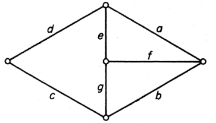
- **$k$ 边可染**：存在真 $k$ 边染色
  - **父传递性**：设 $k<l$，若 $G$ 是 $k$ 边可染的，则其也是 $l$ 边可染的
    - **证明**：只需将原先的某些染色边替换成新颜色即可
  - **边色数 $\chi'(G)$**：最小的可染色数
    - **边色数的度关系**：$\chi' \geq \D$
      - **证明**：由定义，交于同一顶点的边不可能是同一颜色，直得结论
- **颜色 $i$ 被顶点 $v$ 表出**：若 $v$ 邻接某个颜色 $i$ 的边，则称颜色 $i$ 被顶点 $v$ 表出
  - **顶点表色数**：$c(v)$ 是顶点 $v$ 表出颜色的数量
  - **表色数的度关系**：
    - $c(v) \leq d(v)$
    - 真边染色 $\LR \forall v\in V(G)，c(v) = d(v)$
- **2边染色存在性**：非奇圈的连通图中，存在2边染色，且每个颜色都被每个至少两度的顶点表出
  - **证明**：
    - 若 $G$ 是欧拉图
      - 当其为偶圈时，取其真2边染色即可
      - 若不是偶圈，则由欧拉图性质，其存在四度顶点 $v_0$，设 $v_0e_1v_1...e_\e v_0$ 是欧拉环游，设 $E_1 = \{e_i\mid i是奇数\}，E_2 = \{e_i\mid i是偶数\}$，则 $(E_1,E_2)$ 即为所需分划
    - 若 $G$ 不是欧拉图
      - 添加一个顶点 $v_0$，将它和每个奇数度顶点拼接，得到 $G^*$。显然其为欧拉图，此时 $(E_1\cap E,E_2\cap E)$ 即为所需分划
- **提升**：若两个 $k$ 边染色 $\ms C，\ms C'$ 满足 $\sum\limits_{v\in V}c'(v) > \sum\limits_{v\in V} c(v)$，则称 $\ms C'$ 是 $\ms C$ 的提升
  - 单个点表出的染色数量越多越好
- **最优边染色**：不存在提升的边染色
- **奇圈判定引理**：设 $\ms C = (E_1,...,E_k)$ 是最优 $k$ 边染色
  - 若存在顶点 $u$ 和颜色 $i,j$，其中 $i$ 不被 $u$ 表出，$j$ 至少被 $u$ 表出两次
  - 则 $G[E_i\cup E_j]$ 是奇圈
  - **证明**：设 $H = G[E_i\cup E_j]$，反设不是奇圈，则由2边染色存在性，可设 $\ms C'$ 为 $i,j$ 的2边染色
    - $c'(v)$ 是 $\ms C'$ 中 $v$ 的染色数量，则 $c'(u) = c(u) + 1$
    - 再由 $i,j$ 均被 $u$ 表出，从而 $c'(v)\geq c(v) \quad (\forall v\neq u)$，从而 $\sum\limits_{v\in V}c'(v) > \sum\limits_{v\in V} c(v)$，与 $\mc C$ 的最优性矛盾
- **二分色数定理**：若 $G$ 是二分图，则 $\chi' = \D$
  - **证明**：
    - 反设 $G$ 中 $\chi' > \D$，$\ms C = (E_1,...,E_\D)$ 是最优 $\D$-边染色，$u$ 是某个满足 $c(u) < d(u)$ 的顶点
    - 易得 $u$ 满足奇圈判定条件，从而 $G$ 含奇圈，从而不可能是二分图

### Vizing定理

- **单图色数定理（vizing定理）**：若 $G$ 是单图，则 $\chi' = \D$ 或 $\chi' = \D + 1$
  - **证明**：只需 $\chi'\leq \D + 1$ 即可
    - 反设 $\chi' > \D +1$，则存在最优 $\D+1$ 边染色 $\ms C = (E_1,...,E_{\D+1})$
    - 设顶点 $u$ 满足 $c(u) < d(u)$，则存在 $i_0,i_1$ 分别不被表出、被表出至少两次
    - 设 $uv_1$ 是 $i_1$ 色，由于 $d(v_1)  < \D + 1$，必定存在 $i_2$ 不被 $v_1$ 表出。
      - 若 $i_2$ 不被 $u$ 表出，则将 $uv_1$ 重新染成 $i_2$ 会得到 $\ms C$ 的提升，与其最优性矛盾，故 $u$ 必定表出 $i_2$
    - 同理由于 $d(v_2) < \D+1$，必定存在 $i_3$ 不被 $v_2$ 表出，且 $i_3$ 被 $u$ 表出
    - 不断进行下去，即得到两序列 $v_j，i_j$ 满足 $uv_j$ 为 $i_j$ 色，且 $i_{j+1}$ 不被 $v_j$ 表出
      - 由于 $u$ 的度有限，故存在最小的 $l$ 使得存在 $k<l$ 满足 $i_{i+1} = i_k$
    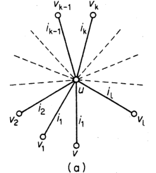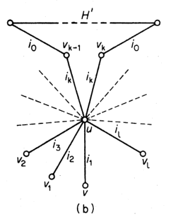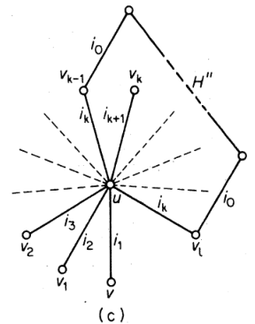
    - 重新将 $uv_j\pad (1\leq j\leq k-1)$ 染成 $i_{j+1}$，得到 $\ms C'$ 如图b
      - 易得 $c'(v) \geq c(v)\pad (\forall v\in V)$，从而 $\ms C'$ 也是最优 $\D+1$ 边染色，从而连通分支 $H'$ 包含 $u$，是奇圈
    - 重新将 $uv_j\pad (k-1\leq j\leq l-1)$ 染成 $i_{j+1}$，$uv_l$ 染成 $i_k$，得到 $\ms C'$ 如图c
      - 易得 $c''(v) \geq c(v)\pad (\forall v\in V)$，从而 $\ms C''$ 也是最优 $\D+1$ 边染色，从而连通分支 $H''$ 包含 $u$，是奇圈
      - 但是此时 $d_{H'}(v_k) = 2$，从而 $d_{H''}(v_k) = 1$，与假设矛盾
- **复合 $\mu(G)$**：$G$ 中连接两个顶点的边的最大数量
  - **广义vizing定理**：若 $G$ 是无圈图，则 $\D \leq \chi'\leq \D + \mu$
    - **等价命题**：$\forall \mu\in \N^+，\exists G$ 使得 $\chi' = \D + \mu$
    - **实例**：下图中 $\D = 2\mu$ 且任意两边相邻，从而 $\chi = \D = \e = 3\mu$
    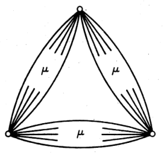

### 考试题

- **二分图点染色的单顶点表出性**：若 $G$ 是二分图，且 $\d>0$
  - 则 $G$ 存在一个 $\d$ 边着色，使得所有颜色都由一个顶点表出
  - **证明**：
    - 反设不存在，则存在最优 $\d$ 边染色，和顶点 $v\in V(G)$ 满足 $d_G(v) > c(v)$，满足奇圈判定条件，与二分图矛盾
  - **理解**：二分图就要用反证法 + 奇圈判定条件来证
- **奇数顶点正则图的边色数**：若 $G$ 是非空的正则单图，$\nu$ 是奇数，则 $\chi' = \D+1$
  - **证明**：
    - 由于 $\nu$ 是奇数，故 $G$ 的真边染色中，每个色最多有 $\dfrac{\nu-1}{2}$ 条边
      - （对集的最大基数，一旦超过这个数量，必定出现相邻的同色边）
      - 则所有色的边数上界为 $\dfrac{\nu-1}{2}\chi' \geq \e$
    - 再由 $G$ 是正则图，故边数为 $\e = \dfrac{\D\cdot\nu}{2}$，综上即得 $\chi' > \D$
      - 正则图中 $\d = \D = k$，故每个顶点对应 $\D$ 个边，再除去重复情况即得边数公式
    - 再由Vizing定理，$\chi'(G) \leq \D+1$，即 $\chi'(G) = \D+1$
  - **理解**：Vizing定理相关推论中，需要结合图本身的性质来灵活作答
    - 比如这里用了正则图的边数可求性，用真染色条件导出边数的上界来得到不等式
- **奇数顶点图的边色数**：若 $G$ 是无环单图，$\nu = 2n+1，\e >n\D$，则 $\chi' = \D+1$
  - **证明**：
    - 同上，由奇数顶点性，真边染色中，每个颜色最多 $n$ 条边
    - 反设可真染 $\D$ 个颜色，则其最多染 $n\D$ 条边（边数上界）
    - 再由 $\e > n\D$，即得矛盾。只能是真染 $\D+1$ 种色
  - **推论**：
    - 若 $G$ 是在偶数个顶点的无环正则单图中剖分一条边得到的图，则 $\chi' = \D + 1$
      - **证明**：设 $\nu(G) = 2n+1$，则 $\e(G) = \dfrac{\D\cdot(\nu - 1)}{2} + 1 > n\D$，矛盾
      - **理解**：好像无环单图都可以用边数上界当作通法来做
    - 若 $G$ 是在奇数个顶点的无环正则单图中删去少于 $\dfrac{k}{2}$ 条边得到的图，则 $\chi' = \D + 1$
      - **证明**：设 $\nu(G) = 2n+1$，设除去 $k_1< \dfrac{k}{2}$ 条边，则 $\e = \dfrac{\nu k}{2}-k_1 > kn = \D n$，矛盾
- 若 $G$ 是无环图，则 $G$ 有 $\D$-正则无环母图
- 若 $G$ 是无环图，$\D$ 是偶数，则 $\chi' \leq \dfrac{3\D}{2}$
  - **证明**：

## 独立集和簇

### 独立集（对集的对偶概念）

- **独立集**：图 $G$ 中，若顶点集合 $S$ 的顶点两两不相邻，则 $S$ 是 $G$ 的独立集（类似对集）
- **最大基数独立集**：
  - **独立数 $\a$**：最大独立集中的顶点数量
  - **点覆盖数 $\b$**：最小点覆盖中的顶点数量
- **对偶判定法**：$S$ 是独立集 $\LR V\backslash S$ 是点覆盖
  - **证明**：独立集等价于每个边都有一个顶点在 $V\j S$ 中，故满足点覆盖的定义
  - **推论**：$\a + \b = \nu$
    - **证明**：设 $S$ 是最大独立集，$K$ 是最小点覆盖，则 $\begin{cases} |\nu-\b| = |V\j K| \leq \a \\ |\nu-\a| = |V\j S| \geq \b \\  \end{cases}$，综上即得结论
- **边覆盖**：若 $G$ 的每个顶点都至少在边集 $L$ 的一个边中，则称 $L$ 是 $G$ 的边覆盖
  - **存在条件**：存在边覆盖 $\LR \d>0$
  - **反例**：离散图无边覆盖
- **最小边覆盖**
  - **最大对集基数 $\a'$**
  - **边覆盖数 $\b'$**：最小边覆盖中的边数量
- **Gallie定理**：若 $\d > 0$，则 $\a' + \b' = \nu$
  - **证明**：设 $M$ 是最大对集，$U$ 是 $M$ 的非饱和顶点全集
    - 由于 $\d > 0$ 且 $M$ 最大，存在边集 $|E'| = |U|$，且与 $U$ 中的顶点均邻接
    - 易得 $M\cup E'$ 是边覆盖，从而 $\b' \leq |M\cup E'| = \a' + (\nu + \a') = \nu - \a'$，或 $\a' + \b' \leq \nu$
    - 设 $L$ 是最小边覆盖，设 $H = G[L]$，$M$ 是 $H$ 的最大对集，$U$ 是 $M$ 的非饱和顶点全集
      - 由 $M$ 最大，得 $H[U]$ 没有非环路的边，从而 $|L|-|M| = |L\j M| \geq |U| = \nu-2|M|$
    - 由于 $H$ 是子图，$M$ 是对集，从而 $\a' + \b' \geq |M| + |L| \geq \nu$
    - 综上即得结论
- **Konig定理（对偶定理）**：二分图中，$\a = \b'$
  - **证明**：易得此时 $\a+\b = \a' + \b'$，再由二分性 + 之前的Konig定理，即得 $\a' = \b$，从而得到结论

### Ramsey定理

- [组合数学的Ramsey数](../组合数学/3.容斥原理.md)
- **簇**：单图 $G$ 中，若顶点集 $S$ 满足 $G[S]$ 是完全图，则 $S$ 称为 $G$ 的簇
  - **独立定义法**：$S$ 是补图 $G^c$ 的独立集
  - 为了讨论完全子图，我们首先探讨它的互补概念（独立集）
- **Ramsey数（图论）**：每个顶点数为 $r(k,l)$ 的图，要么有 $k$ 个顶点的簇，要么有 $l$ 个顶点的独立集
- **递推定理**：$r(k,l) \leq r(k,l-1) + r(k-1,l)$
  - **证明**：见组合数学
- **$(k,l)$ 莱姆希图**：顶点数为 $r(k,l)-1$ 的图
  - **实例**：下面分别是 $(3,3)，(3,4)，(3,5)，(4,4)$ 的图
  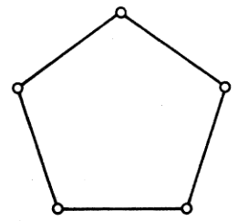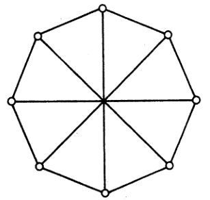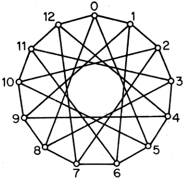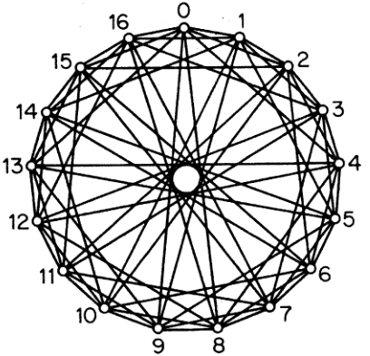

### 图灵定理

- **Erdos定理**：若单图 $G$ 不含 $K_{m+1}$，则存在完全 $m$ 分图 $H$ 度优于 $G$
  - **推论**：若度序列相等，则 $G\cong H$
  - **证明**：
- **Turan定理**：设 $T_{m,n}$ 是有 $n$ 个顶点的完全 $m$ 分图，且各个部分尽量大小相同
  - 若单图 $G$ 不含 $K_{m+1}$，则 $\e(G) \leq \e(T_{m,\nu})$
  - **证明**：
    - 由Erdos定理，可设 $H$ 度优于 $G$，从而 $\e(G) \leq \e(H)$
    - 再易得 $\e(H)\leq \e(T_{m,\nu})$，即得结论
  - **推论**：若 $\e(G) = \e(T_{m,\nu})$，则 $G\cong T_{m,\nu}$
    - **证明**：结合第一个和第二个等式的取等条件即可

### 一些几何问题

- **点集的直径**：

### 考试题

- $G$ 是二分图 $\LR$ 对每个子图 $H$ 都有 $\a(H) \geq \dfrac{1}{2}\nu(H)$
  - **证明**：
    - **必要性**：
      - 由于 $G$ 二分，故子图也二分。再由二分类 $X,Y$ 均为独立集，故 $\a(H) \geq \max\{|X(H)|，Y(H)\} \geq \dfrac{\v(H)}{2}$
    - **充分性**：
      - 反设不是二分图，则含有奇圈 $H$，但 $\a(H) = \dfrac{\nu(H)-1}{2} < \dfrac{\nu(H)}{2}$，矛盾
    - **理解**：二分图在对集和独立集上的良好性质，本质都是奇圈的良好性质
- $G$ 是二分图 $\LR$ 对每个子图 $H\pad (\d>0)$ 都有 $\a(H) = \b'(H)$
  - **证明**：
    - **必要性**：由二分图的遗传性直得
    - **充分性**：反设含奇圈 $H$，则 $\a(H) = \a(H) = \dfrac{\nu(H)-1}{2} < \b'(H) = \dfrac{\nu(H)}{2}$，矛盾
    - **本质**：奇圈的良好性质
- 九个人中，有 $1$ 个人认识两个，$2$ 个人认识四个，$4$ 个认识五个，$2$ 个认识 $6$ 个，则有三个互相认识的人
  - **证明**：
    - 将人看作图 $G$ 的顶点，相邻等价于认识。即证 $G$ 存在完全子图 $K_3$
    - 此时 $G$ 的度序列为 $(6,6，5,5,5,5，4,4，2)$
    - 用之前图序列变换结论，可将图序列简化为 $(1,1,1,1)$
    - 易得其为 $K_2+K_2$ 的度序列，故 $G$ 存在
    - $\e(G) = \dfrac{1}{2}\sum d(v) = 21$，而 $\e(T_{3,3})  = 20$，故 $G$ 中存在子图同构于 $T_{3,3} = K_3$，结论成立

## 点染色问题

- **$k$ 点染色**：将 $k$ 个颜色分配给每个顶点
  - **配对定义法**：无圈图中，顶点的分划 $(V_1,...,V_k)$
- **真 $k$ 点染色**：两个相邻顶点颜色不同
- **k点可染**：图 $G$ 可被真 $k$ 点染色
  - **单图传递性**：$G$ 可染 $\LR$ 其底层单图 $k$ 可染
  - **平凡可染性**：
    - 单图 $1$ 点可染 $\LR$ 其为空图
    - 单图 $2$ 点可染 $\LR$ 其为二分图
  - **点颜色数 $\chi$**：最小的可染数
  - **k色图**：点颜色数为 $k$ 的图
- **关键图**：对任意真子图 $H$ 都有 $\chi(H) < \chi(G)$（点颜色数满足单调性）
- **$k$ 关键图**：点颜色数为 $k$ 的关键图
- **性质定理**：
  - 关键图是连通图
    - **证明**：
  - $k$ 关键图满足 $\d \geq k-1$
    - **证明**：反设 $\d<k-1$，则存在 $d(v) = G$
      - 由于是 $k$ 关键图，$G-v$ 是 $k -1$ 可染的。设 $(V_1,...,V_{k-1})$ 是其分划
      - 易得 $v$ 与某个 $V_j$ 不相邻，但此时 $(V_1,...,V_{j}\cup \{v\},...,V_{k-1})$ 就是 $k-1$ 点染色，矛盾
  - $k$ 色图至少有 $k$ 个度 $\geq k-1$ 的点
    - **证明**：设 $H$ 是 $k$ 关键子图，则 $H$ 中每个顶点至少为 $k-1$ 度，易得在 $G$ 中也成立。再由 $k$ 关键图至少有 $k$ 个顶点，即得结论
  - **度关系**：$\chi\leq \D+1$
    - **证明**：由上易得
- **$S$-分支**：设 $S$ 是连通图的点割，$G-S$ 的连通分支的顶点集为 $V_1,...,V_n$，则 $G_i = G[V\cup S]$ 称为 $S$-分支
- **一致染色**：$G_1,...,G_n$ 的染色中，若 $\forall v\in S$ 都被分配相同的颜色，则称这些染色在 $S$ 上一致
- **定理**：关键图中，没有点割是簇
  - **证明**：设 $G$ 是 $k$ 关键图，反设点割 $S$ 是簇。则其S分支都是 $k-1$ 可染的。再由于 $S$ 是簇，其中顶点在这些染色中必定颜色不同，从而有 $k-1$ 个一致染色，但是它们只能导出 $k-1$ 个 $G$ 染色，矛盾
  - **推论**：关键图是块
    - **证明**：设 $v$ 是割点，则 $\{v\}$ 是簇，由结论即得关键图均不含割点，从而是块
    - 关键图的2-点割中，两点不相邻
- **1形式2-点割**：每个 $G_i$ 的 $k-1$ 染色对点割元素都分配一样的颜色
- **2形式2-点割**：每个 $G_i$ 的 $k-1$ 染色对点割元素都分配不同的颜色
- **Dirac定理**：设 $G$ 是存在 $2$ 点割 $\{u,v\}$ 的 $k$ 关键图，则
  - $G = G_1\cup G_2$ 是两个形式2点割的并
  - $G_1 + uv$，$G_2\cdot uv$ 均为 $k$ 关键图
  - **证明**：
  - **推论**：设 $G$ 是存在 $2$ 点割 $\{u,v\}$ 的 $k$ 关键图，则 $d(u) + d(v) \geq 3k-5$
    - **证明**：

### 布鲁克定理

- **Brook定理**：若 $G$ 是连通单图，且不是奇圈或完全图，则 $\chi \leq \D$

### Hajo猜想

- **图的剖分**：可被图 $G$ 的一列边剖分得到的图
- **Hajo猜想**：若图 $G$ 是 $k$ 色图，则其包含一个 $K_k$ 的剖分
  - **反例**：4圈是 $K_3$ 的剖分，但不是3色图
- $k=1$ 时，
- $k=2$ 时，
- $k=3$ 时，由于3色图必定含有奇圈，而奇圈都是 $K_3$ 的剖分，故成立
- $k=4$ 时，
  - **证明**：不妨设 $G$ 是关键图，从而是 $\d\geq 3$ 的块
    - 若 $\nu = 4$，则 $G$ 是 $K_4$，显然成立
    - 对 $\nu$ 归纳，假设对 $n$ 顶点以下的4色图均成立
      - 若 $G$ 有2点割 $\{u,v\}$，则由Dirac定理，存在 $G_1,G_2$
        - 此时 $\nu(G_1+uv) < \nu(G)$，从而由归纳假设，其含有 $K_4$ 剖分。从而若 $P:u\to v$ 是 $G_2$ 中的轨道，则 $G_1\cup P$ 包含 $K_4$ 剖分，从而 $G$ 也包含
      - 若 $G$ 是三连通图，由 $\d\geq 3$，其有一个至少长为 $4$ 的圈 $C$。设 $u,v$ 是 $C$ 中不相邻点，由于 $G-\{u,v\}$ 是连通的，故存在连接 $C-\{u,v\}$ 的两个连通分支的轨道 $P\subset G-\{u,v\}$。不妨设起点 $x$ 和终点 $y$ 是仅有的 $P\cap C$ 中点，同理得存在轨道 $Q\subset G-xy$
        - 若 $P$ 和 $Q$ 无公共顶点，则 $C\cup P\cup Q$ 是 $K_4$ 的剖分，否则设 $w$ 是 $P\cap Q$ 的第一个顶点，$P'$ 表示 $P$ 的 $(x,w)$ 部分。则 $C\cup P'\cup Q$ 是 $K_4$ 的一个剖分。
  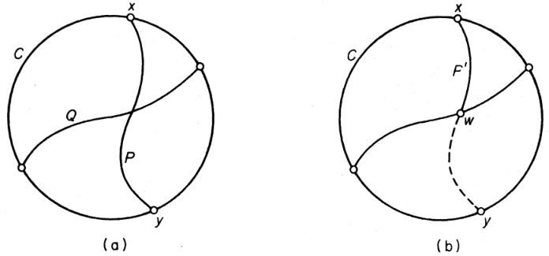

### 染色多项式

- **染色数量**：$G$ 不同的 $k$ 染色数量为 $\pi_k(G)$
  - **标号性**：两种染色相同 $\LR$ 每个顶点对应的颜色都相同
  - **实例**：三角形有六种3染色
  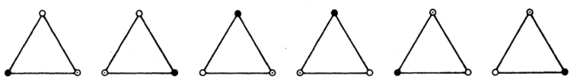
- **染色递推公式**：若 $G$ 是单图，则对任意边 $e$ 都有 $\pi_k(G) = \pi_k(G-e) - \pi_k(G\cdot e)$
  - **证明**：设 $e$ 的端点为 $u,v$
    - 若在 $G-e$ 的 $k$ 点染色的基础上再对 $u,v$ 染相同的色，则其也构成 $G\cdot e$ 的 $k$ 染色。易得这两者是双射关系，即得到 $\pi_k(G\cdot e)$
    - 若在 $G-e$ 的 $k$ 点染色的基础上再对 $u,v$ 染不同的色，易得其也是 $G$ 的 $k$ 染色
    - 综上，通过排中律即得到等式
  - **推论（多项式性）**：$\pi_k(G)$ 是 $k$ 的 $\nu$ 次整系数多项式，首项系数为 $1$，常数项为 $0$
    - **证明**：对 $\e$ 归纳，不妨设 $G$ 是单图
      - 若 $\e = 0$，易得 $\pi_k = k^\nu$
      - 若对 $\e<m$ 均成立，则可设 $\begin{cases} \pi_k(G-e) = \sum\limits^{\nu-1}_{i=1} (-1)^{\nu-i}a_ik^i + k^\nu \\ \pi_k(G\cdot e) = \sum\limits^{\nu-2}_{i=1} (-1)^{\nu-i-1}b_ik^i + k^{\nu-1} \end{cases}$
      - 从而由递推公式即得结论

### 周长和染色数

- **染色存在定理**：$\forall k\in\N^+，\exists G$ 是无三角形的 $k$ 色图
  - **归纳证明(Mycielski)**：
    - $k=1,2$ 时，图为 $K_1,K_2$
    - 若已存在无三角形的 $k$ 色图 $G_k$，顶点为 $\{v_i\}^n_{i=1}$，添加 $n+1$ 个顶点 $u_1,...,u_n,v$，将 $u_i$ 和 $v_i$ 的相邻点和 $v$ 接合
    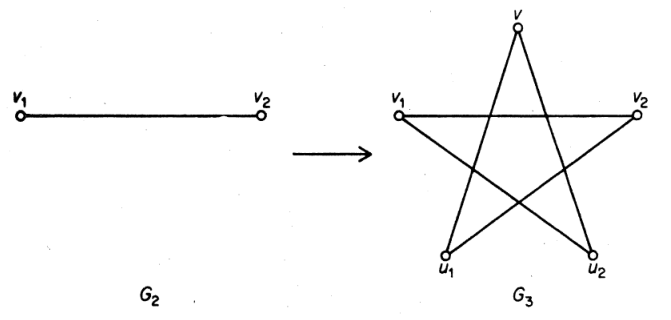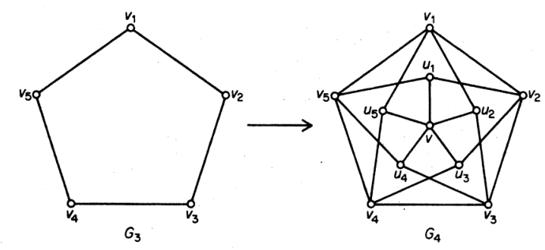
    - **无三角形性**：易得 $u_1,...,u_n$ 是独立集，故没有三角形可以包含多个 $u_i$。而若 $u_iv_jv_k$ 是三角形，则 $v_iv_jv_k$ 就是 $G_k$ 的三角形，与归纳假设矛盾
    - **染色性**：$G_k$ 的 $k$ 染色中，将 $u_i$ 和 $v_i$ 染相同的色，将 $v$ 染新颜色，易得其是 $G_{k+1}$ 的 $k+1$ 染色
      - 反设 $G_{k+1}$ 是k可染的，若 $v$ 染颜色 $k$，则 $u_i$ 均不染颜色 $k$，从而可让 $v_i$ 均染颜色 $k$，此时构成了 $k-1$ 染色，与 $G_k$ 的k可染假设矛盾

### 考试题

- 

## 具体应用

### 化学分子枚举

### 电网络

### 查找树
