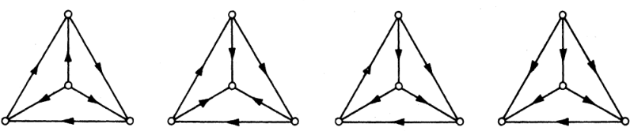
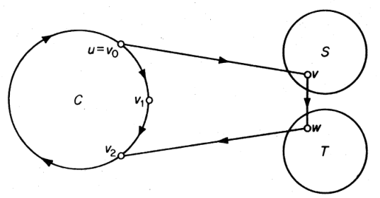
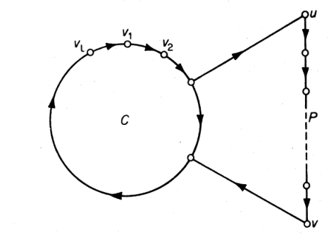

# 有向图论问题

## 有向图

- **有向图**：$D(V,A,\psi)$
  - **顶点**：$V(D)$
  - **弧**：$A(D)$
  - **邻接函数**：$\psi_D:A\leftrightarrow V\times V，a\mapsto (u,v)$
  - **基础图**：无向图 $G(V,E,\psi)$（$D$ 是 $G$ 的**定向图**）
- 有向
- **$u$ 的可达顶点**：存在 $(u,v)$
- **不连通顶点**
- **严格有向图**：没有loop和重弧
- **最大有向路长定理**：有向图中存在长为 $\chi-1$ 的有向路
  - **证明**：设 $A'$ 是使得 $D' = D-A'$ 无圈的最小弧集，$D'$ 中有向路最长为 $k$
    - 将 $D'$ 的顶点染 $k+1$ 个颜色，规则是：若从 $v$ 出发的有向路最长为 $i$，则染颜色 $i-1$。只需 $(V_1,...,V_{k+1})$ 是真 $k+1$ 点染色即可
    - **$D'$ 中路的两端颜色不同**：
      - 设 $P=(u,v)$ 是有向路，其中 $v\in V_i$。则由定义，$D'$ 中存在有向路 $Q = (v_1 = v,...,v_i)$
      - 再由 $D'$ 中无有向圈，得 $PQ$ 是起点为 $u$ 的长大于 $i$ 的路，从而 $u\notin V_i$
    - **$D$ 中弧的两端颜色不同**：设 $(u,v)\in A$
      - 若 $(u,v)\in A(D')$，则其为 $D'$ 中有向路，由之前结论，颜色不同
      - 若 $(u,v)\in A'$，由其最小性，$D'+(u,v)$ 包含有向圈 $C$，且 $C-(u,v)$ 是 $D'$ 中的有向路 $(v,u)$，由之前结论，颜色不同
    - 由真点染色的度关系，$\chi \leq k+1$，从而存在长为 $k\leq \chi - 1$ 的有向路
  - **推论**：没有包含 $\chi$ 以上个顶点的有向路，否则两端颜色相同

### 竞赛图

- **有向完全图（竞赛图）**：
  - **竞赛意义**：$n$ 个顶点的竞赛图可表示 $n$ 个玩家之间的胜利关系
  - **实例**：四个顶点的有向完全图
    
- **有向哈密顿路**：包含所有顶点的有向路
- **Redei**：每个竞赛图都包含有向哈密顿路
  - **证明**：已知若 $D$ 是完全图，则 $\chi = \nu$。再由最大有向路长定理，此时最大有向路就是哈密顿路
- **内邻点**：
- **外邻点**：
- **有向邻点定理**：无环有向图 $D$ 中，存在独立集 $S$，满足 $\forall u\in V-S，\exists v\in S$，存在不超过 $2$ 的有向路连接它们
  - **证明**：对 $\nu$ 归纳
  - **推论**：竞赛图中，任意顶点间存在不超过 $2$ 的有向路
    - **证明**：若 $D$ 是竞赛图，则 $\a = 1$

### 有向圈

- **圈包含定理**：有向连通 $\nu\geq 3$ 的竞赛图 $D$ 中，$\forall u\in V，\forall 3\leq k\leq\nu$，都存在一个有向 $k$ 圈包含 $u$
  - **归纳证明**：对 $k$ 归纳
    - $k=3$ 时：
      - 设 $S = N^{out}(u)，T = N^{in}(u)$
      - 由有向连通性，$S,T$ 均非空，从而划分 $(S,T)$ 非空。从而存在 $(v,w)\in A(D)$，其中 $v\in S,w\in T$，从而存在3圈 $(u,v,w,u)$
    - 假设 $u$ 均可含于 $3\sim n$ 的有向圈中
      - 设 $C = (v_0,v_1,...,v_n)$ 是有向 $n$ 圈，其中 $v_0 = v_n = u$
      - 若 $\exists v\in V(D)\j V(C) $ 使得 $\begin{cases} \exists v_i\in C   & \text{s.t.} (v_i,v)\in A(D) \\ \exists v_{i+1}\in C & \text{s.t.} (v,v_{i+1})\in A(D)\end{cases}$，则此时存在 $n+1$ 圈 $(v_0,v_1,...,v_i,v,v_{i+1},...,v_n)$
        - 本质就是在中间添加上一节
      - 若不存在，可设 $S$ 是 $V(D)\j V(C)$ 中的顶点集，满足 $$
        - 再由有向连通性，$S,T,(S,T)$ 均非空，从而存在 $(v,w)\in A(D)$，其中 $v\in S,w\in T$，构造出 $n+1$ 圈 $(v_0,v,w,v_2,...,v_n)$
        
- **有向哈密顿圈**：
- **圈存在定理**：若 $D$ 是严格有向图，$\min\{\d^{in},\d^{out}\} \geq \dfrac{\nu}{2} > 1$，则 $D$ 包含一个有向哈密顿圈
  - **证明**：
  

### 考试押题

- 不含有向圈的有向图中，$\d^- = 0$
  - **证明**：
- 不含有向圈的有向图中，存在顶点排序，使得头为 $\forall v_i$ 的弧，尾都在 $v_1,...,v_{i-1}$ 中
  - **证明**：存在 $d^-(v_1) = 0$，考虑 $D-v_1$ ，其仍不含有向圈，故存在 $d^-(v_2) = 0$，归纳即可
- 若 $G$ 是严格有向图，则 $D$ 含有长不小于 $\max\{\d^-,\d^+\}$ 的有向路
  - **证明**：不妨设 $\d^+$ 最大，$P:u_0\to v_0$ 是最长有向路，若长度小于 $\d^+$，由严格性，必定存在以 $v_0$ 为尾，头不在 $P$ 中的弧。即 $P$ 可继续延长
- 若 $G$ 是严格有向图，$\max\{\d^-,\d^+\} = k>0$，则 $D$ 含有长不小于 $k+1$ 的有向圈
  - **证明**：最长性 + 度定义易得结论
- $D$ 是单向图 $\LR D$ 中存在生成有向walk

## 网络

- **网络 $N$**：有向图 $D$（**基础图**） 中，两个非空不相交顶点集 $X,Y$ 和**容量函数** $c:A(D)\to \N^+$ 组成的图
  - **发点**：$X$ 的顶点
  - **收点**：$Y$ 的顶点
  - **中间顶点**：不是发点或收点，全集为 $I$
  - **弧的容量**：$c(a)$
- **网络函数公式**：若 $f:A(N)\to \R$，$K\subset A$，则 $f(K) = \sum\limits_{a\in K} f(a)$
  - **弧集 $S$ 的出函数**：$f_{out}(S) = f(S,\ol S)$
  - **弧集 $S$ 的入函数**：$f_{in}(S) = f(\ol S,S)$
- **流**：函数 $f:A(N)\to \Z$，满足下面两个条件
  - **容量约束** $0\leq f(a) \leq c(a)，\forall a\in A$
  - **守恒公式**：$f_{in}(v) = f_{out}(v)，\forall v\in V$
- **合成流**：
  - **合成出流**：$f_{out}(S) - f_{in}(S)$
  - **合成入流**
- **流量**：$\val f = f_{out}(X) - f_{in}(X)$
  - （流出X的合成流）
  - （直到这里才算是完成了收点发点的定义）
  - **最大流**：流量最大的 $f$
- **网络的简化**：可以构造一个新的网络 $N'$ 来简化求最大流问题
  - 在 $N$ 中添加新顶点 $x,y$
  - 用容量为 $\infty$ 的弧连接 $x$ 到所有 $X$ 顶点
  - 用容量为 $\infty$ 的弧连接所有 $Y$ 顶点 到 $y$
  - 设 $x$ 是 $N'$ 发点，$y$ 是 $N'$ 收点
- **同流函数**：$f'(a) = \begin{cases} f(a) & 若 a\in A(N) \\ f_{out}(v) - f_{in}(v) & 若 a = (x,v) \\ f_{in}(v) - f_{out}(v) & 若 a = (v,y) \end{cases}$
  - **流量相等**：$\val f = \val f'$
    - **证明**：
  - **同流性**：$f'$ 在 $N$ 上的限制是相同值的流
 
### 割

- **割**：$K = (S,\ol S)$，满足 $x\in S，y\in \ol S$
- **割的容量**：$\capa K = \sum\limits_{a\in K}c(a)$
- **割流量公式**：$\val f = f_{out}(S) - f_{in}(S)$
  - **证明**：易得 $f_{out}(S) - f_{in}(S) = \begin{cases} \val f & 若 v = x \\ 0 & 若 v\in S-\{x\}\end{cases}$
    - （第一式为流量定义，第二式为守恒条件）
    - 将上面所有方程加起来，化简即得 $$\val f = \sum\limits_{v\in S} \Big[ f_{out}(v) - f_{in}(v) \Big] = f_{out}(S) - f_{in}(S)$$
  - **本质**：
    - 不仅仅是
- **割容量公式**：$\val f \leq \capa K$，仅当割正向饱和，反向零流时取等
  - **证明**：由容量条件，$f_{out}(S) \leq \capa K$，$f_{in}(S) \geq 0$，代入刚才的割流量公式即得结论
  - **推论（最大流最小割必要性）**：若相等则必定为最大流和最小割

### 流与割

- **弧可增流量**：$\iota(a) = \begin{cases}  c(a) - f(a) & 若a是P的顺向弧 \\ f(a) & 若a是P的反向弧 \end{cases}$
  - **路可增流量**：$\iota(P) = \min\limits_{a\in A(P)} \iota(a)$
    - 由于容量约束，任何一条路的可增流量都由其最小的那个弧决定
    - 正向流和反向流同时存在
- $f$ **饱和路**：$\iota(P) = 0$
- $f$ **非饱和路**：$\iota(P) > 0$
- $f$ **可增路**：从发点 $x$ 到收点 $y$ 的非饱和路
- **基于路 $P$ 的修改流**：$\wh f(a) = \begin{cases} f(a) + \iota(P) & a是P正向弧 \\ f(a) - \iota(P) & a 是P反向弧 \\ f(a) & 其它情况 \end{cases}$
  - （方向与 $P$ 相反的弧就是反向弧）
  - 正向的话，流量是正贡献，故将流量扩充到容量。反向的话，流量是负贡献，故将流量削减到0。最后统计所有弧的改变流量，取其最小值就是路上的修改流量 $\iota(P)$
  - **修改流量**：$\val \wh f = \val f + \iota(P)$
    - **证明（其是流）**：
      - **容量约束**：
      - 当 $a$ 是 $P$ 正向弧时，由定义中的最小性，$\iota(P) \leq \iota(a) = c(a)-f(a)$，从而 $c(a) \geq f(a) + \iota(P) = \wh f(a) \geq 0$
      - 当 $a$ 是 $P$ 反向弧时，由定义中的最小性，$\iota(P) \leq \iota(a) = f(a)$
      - 综上，$0\leq f(a) - \iota(P) = \wh f(a) \leq f(a) \leq c(a)$，故满足容量约束条件
      - **守恒公式**：
      - 任取中间点 $v\in I$
        - 若 $v\notin P$，则 $\wh f_{in}(v) = f_{in}(v) = f_{out}(v) = \wh f_{out}(v)$
        - 若 $v\in P$，且关联的两弧同向，则 $\wh f(a) - \wh f(b) = f(a) - f(b)$，故仍然有 $\wh f_{in}(v) = \wh f_{out}(v)$
        - 若 $v\in P$，且关联的两弧反向，则 $\wh f(a) + \wh f(b) = f(a) + f(b)$，故仍然有 $\wh f_{in}(v) = \wh f_{out}(v)$
      - 综上，满足守恒条件
    - **证明（流量相等）**：设 $P$ 和发点 $x$ 关联的边是 $e$
      - 若 $e$ 是 $x$ 的出弧，则其是 $P$ 的正向弧。
        - 由定义，$\val \wh f = \wh f_{out}(x) - \wh f_{in}(v) = \Big(f_{in}(x) + \iota(P)\Big) - \wh f(x) = \val f + \iota(P)$
      - 若 $e$ 是 $x$ 的入弧，则其是 $P$ 的反向弧。
        - 由定义，$\val \wh f = \wh f_{out}(x) - \wh f_{in}(v) = f_{in}(x) - \Big( \wh f(x) - \iota(P) \Big) = \val f + \iota(P)$
- **引理**：$f$ 是最大流 $\LR N$ 不包含 $f$ 可增路
  - **证明**：必要性已证
    - **充分性**：
      - 设 $S$ 是所有 （通过 $f$ 非饱和路和 $x$ 连接） 的顶点 $\cup \{x\}$
        - 由于 $x$ 的弧均为出弧，故所有与 $x$ 连接的路都同时存在正向弧和反向弧。反设 $x\notin S$，则只能是 $x$ 的正向弧都是满流，反向弧都是零流。但是这样的话，所有 $\iota(P)$
        - 再由条件，$f$ 无可增路，故 $y\in \ol S$
        - 则由割的定义，$K = (S,\ol S)$ 是一个割，只需 $(S,\ol S)$ 每条弧均饱和，$(\ol S,S)$ 每条弧均 $f$ 零即可
      - 任取 $a$ 是 $u\in S\to v\in \ol S$ 的弧
        - 由于 $u\in S$，由 $S$ 定义得存在 $f$ 非饱和路 $Q:x\to u$
        - 反设 $a$ 是非饱和的，则 $Q$ 可扩充成 $f$ 非饱和路 $(Q+a):x\to v$
        - 但是 $v\in \ol S$，故不存在 $Q+a$，从而 $a$ 是饱和的
      - 同理，任取 $a'$ 是 $v\to u$ 的弧
        - 由于 $v\in \ol S$，由 $S$ 定义得存在 $f$ 零路 $Q':y\to v$
        - 反设 $a'$ 是非零的，则 $Q'$ 可扩充成 $f$ 非饱和路 $(Q'+a'):y\to u$
        - 但是 $u\in S$，故不存在 $Q'+a'$，从而 $a'$ 是零的
    - 由之前的取等条件，即得 $f$ 是最大流（同时还得到 $K$ 是最小割）
  - **推论（最大流最小割定理）**：最大流的流量等于最小割的容量
    - **证明**：由 $K$ 的定义，最小割 $K$ 等价于所有通过 $f$ 非饱和路和 $x$ 连接的顶点。其就是所有可增加的流量，从而扩充完毕后就是最大流