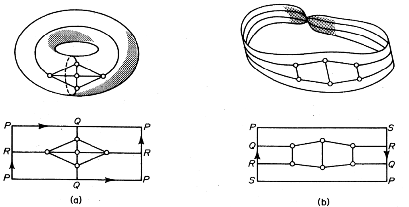
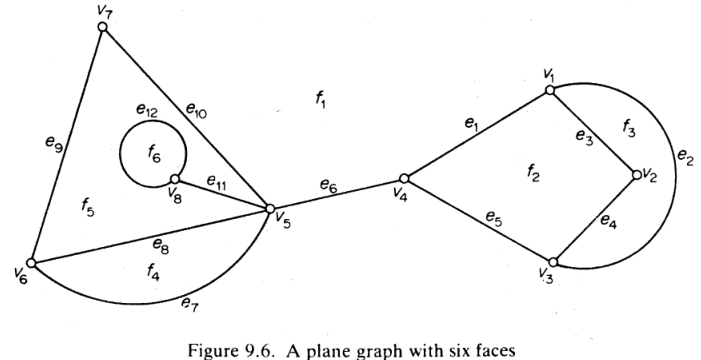
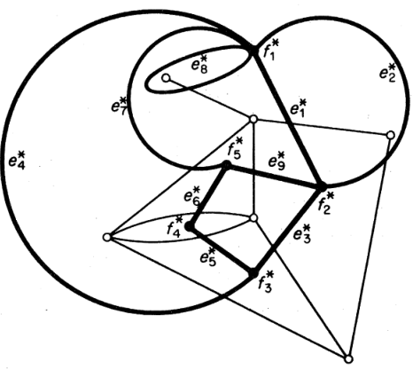
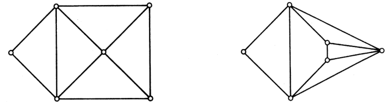

# 拓扑图理论

- 底层理论在[代数拓扑：图的嵌入](../拓扑学/代数拓扑/3.平面分割.md)中，但是这里我们只关心它的组合性质

## 嵌入

### 平面化

- **平面可嵌图（可平面图）**：可以被画在平面上，且各边只在顶点处相交的图
- **平面图**：平面可嵌图画在平面上的样子（后面全都简称为平面图）
- **（定理12.1）经典非平面图**：$K_{3,3}$ 和 $K_5$ 不是平面可嵌图
  - **证明($K_5$)**：
    - 易得 $K_5$ 中的圈 $C = v_1v_2v_3$ 是Jordan曲线，故 $v_4$ 要么在圈内侧，要么在圈外侧
    - 若 $v_4$ 在圈内侧，则 $v_4v_1，v_4v_2，v_4v_3$ 将内部分割成三个区域 $C_1 = v_1v_4v_2，C_2 = v_2v_4v_3，C_3 = v_3v_4v_1$
      - 若 $v_5$ 在圈外侧，则由Jordan曲线定理，$v_4v_5$ 必定与 $C$ 相交，与平面可嵌性矛盾
    - 若 $v_4$ 在圈外侧，则分别讨论 $v_5$ 在 $C_1,C_2,C_3$ 内部的情况即可
  - **证明($K_{3,3}$)**：
    - 易得 $K_{3,3}$ 中的圈 $C = v_1v_2v_3v_4v_5v_6$ 是Jordan曲线，故 $v_7$ 要么在圈内侧，要么在圈外侧
      - 若 $v_7$ 在圈内侧，则分成六个区域
        - 若 $v_8$ 在圈外侧，则 $v_7v_8$ 必定与 $C$ 相交，与平面可
  - **推论**：平面图的子图也是平面图，含有非平面子图的图是非平面图
- **同胚定理**：两个图 $G_1$、$G_2$ 同胚 $\LR$ $G_1$ 可以在边上插入2度顶点构造 $G_2$
  - **证明**：
- **（定理12.2）Kuratowski定理**：G是平面图 $\LR$ 不包含经典非平面图的同胚
  - **证明**：忽略
- **可收缩图**：
- **（定理12.3）**：图是平面图 $\LR$ 不包含可收缩至经典非平面图的子图

### 曲面化

- **实例**：$K_5$ 嵌入环面 $\whhhh\whhh\whhh K_{3,3}$ 嵌入莫比乌斯带
  
- **立体嵌入定理**：图均可嵌入到 $\R^3$ 中
- **立体投影**：类似复平面的球坐标投影
  - **$z\in B^3$ 诱导的球面投影**：$\pi:S^2\j \{z\}\to \R^2，s\mapsto p$，其中 $s,z,p$ 共线
- **球面嵌入定理**：$G$ 可嵌入平面 $\LR G$ 可嵌入三维球面
  - **证明**：设 $\wt G$ 是球嵌入，任取其外一点 $z\in S^2$，易得 $\wt G$ 在 $z$ 诱导的立体投影下的像就是平面嵌入

## 对偶图

- **面**：图 $G$ 的平面嵌入将 $\R^2$ 分割成连通的区域，这些区域的闭包称为 $G$ 的面
  - **几何意义**：三维空间中的图展开到二维平面上时，其（立体图形中的各个面）对应（平面嵌入分割出的各个区域）
  - **$G$ 的面集合**：$F(G)$
  - **$G$ 的面数**：$\phi(G)$
  - **外面**：无界的面
- **外嵌入定理**：对于平面图 $G$ 的任意顶点 $v$，都存在一个嵌入，使得 $v$ 的像在外面
  - **证明**：设 $\wt G$ 是球面嵌入，在包含 $v$ 的面内任取一点 $z$，则其诱导的立体投影即为所需嵌入
- **平面图中面 $f$ 的边界**：$b(f)$
  - 若 $G$ 连通，则易得 $b(f)$ 是闭walk，且每个在 $b(f)$ 中的割边都被至少走过两次（进入 $f_i$ 时走一次，出去 $f_i$ 时再走一次）
  
  - **邻接**：$b(f)$ 上的点与边称为与 $f$ 邻接
    - 割边只与一个面邻接
    - **分离**：其它边与两个面邻接，称为该边分离这两个面
  - **面的度 $d_G(f)$**：与面 $f$ 邻接的边的数量（其中割边记为两次）
  - **实例**：上面的图中，$f_1$ 和顶点 $v_1,v_3,v_4,v_5,v_6,v_7$、边 $e_1,e_2,e_5,e_6,e_7,e_9,e_{10}$ 邻接
    - $e_1$ 分离 $f_1,f_2$
    - $e_6$ 只与 $f_1$ 邻接
- **对偶图**：将面 $f$ 看作顶点 $f^*$，边 $e$ 看作边 $e^*$，分离两个面 $f_1,f_2$ 的边是顶点 $f_1^*,f_2^*$ 的邻接边
  - **平面传递性**：平面图的对偶图是平面图
    - **证明**：将顶点 $f^*$ 放在 $f$ 内部，让邻接边 $e^*_{ij}$ 穿过分离 $f_i，f_j$ 的边 $e_{ij}$ 即可（其中割边的对偶是单点环路loop）
    
  - **第二对偶**：若 $G$ 连通，则 $G^{**} \cong G$
  - **无同构传递性**：同构的平面图 $G_1,G_2$，其对偶图不一定同构（对偶图仅在平面图中有意义，在平面可嵌图中无意义）
    - **反例**：左边的图中，外面是5度面。右边的图没有5度面
    
- **对偶定理**：$\begin{cases} \nu(G^*) = \phi(G) \\ \e(G^*) = \e(G) \\ d_{G^*}(f^*) = d_G(f)  \\\\ \sum\limits_{f\in F} d(f) = 2\e\end{cases}$
  - **证明**：前三个就是定义
    - 第四个由 $\sum\limits_{f\in F(G)} = \sum\limits_{f^*\in V(G^*)} d(f^*) = 2\e(G^*) = 2\e(G)$ 即得结论

### 欧拉拓扑公式

- **欧拉拓扑公式**：连通平面图中，$\nu - \e + \phi = 2$
  - **证明**：对 $\phi$ 归纳
  - **推论**：
    - 连通平面图的平面嵌入有相同的面数
      - **证明**：
    - 单平面图中，若 $\nu \geq 3$，则 $\e \leq 3\nu - 6$
      - **证明**：
    - 单平面图中，$\d\leq 5$
      - **证明**：
    - **经典非平面图的另一种证法**：
      - $K_5$：反设是平面图，则 $10 = \e(K_5) \leq 3\nu(K_5) - 6 = 9$
      - $K_{3,3}$：反设是平面图，设 $G$ 是平面嵌入，由于 $K_{3,3}$ 没有长度小于4的圈，故其面的度至少为4，从而 $4\phi \leq \sum\limits_{f\in F} d(f) = 2\e = 18$，即 $\phi\leq 4$，但此时 $2 = \nu-\e+\phi \leq 1$，矛盾

### 桥

