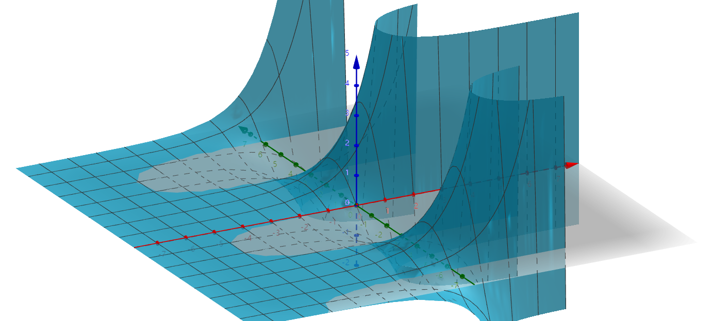
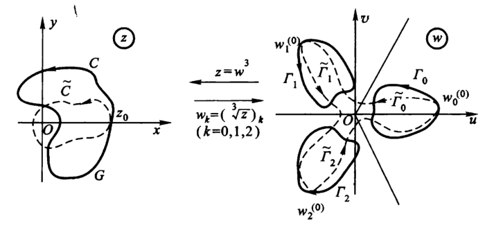
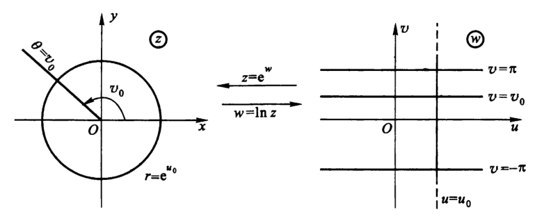

# 解析函数

- **符号约定**：
  - 默认设 $f(x,y) = u(x,y) + iv(x,y)$

## 复变函数的可微性

- **导数**：$f'(z) = \lim\limits_{\D z\to 0} \dfrac{f(z+\D z)-f(z)}{\D z}$
- **可微**：若 $f$ 在 $z$ 处各方向的导数相同，则称 $f$ 在 $z$ 点可微
- **导数的四则运算法则**
- **复合函数求导法则**

### 复变函数与实向量函数的区别

- **复数域是商域**：$\C = \R/(x^2+1)$
  - **证明**：详见抽象代数
- **函数区别**：
  - 实向量函数：$\vec f(x,y) = \begin{cases} f_1 = u(x,y) \\ f_2 = v(x,y) \end{cases}$
  - 复变函数：$f(x,y) = u(x,y) + iv(x,y)$
- **导数区别**
  - 向量值函数的导数是雅可比矩阵。$\large\begin{pmatrix} u' \\ v' \end{pmatrix} = \begin{pmatrix} \frac{\partial u}{\partial x} & \frac{\partial u}{\partial y} \\  \frac{\partial v}{\partial x} & \frac{\partial v}{\partial y} \end{pmatrix}_{2×2}$
  - 复变函数的导数依然是复变函数。$f' = u_x+u_y+iv_x+iv_y$
  - **关联性**：向量函数的分量在求导计算时彼此无关，但复变函数的实部和虚部在求导计算时可以相互影响
  - **各向同性**：向量函数仅需要各方向导数存在，但复变函数可微还需要各个方向导数相等

## 复变函数的解析性

- **解析函数（全纯函数）（正则函数）**：
  - **区域解析**：若函数 $f(z)$ 在区域 $D$ 中可微，则称其为 $D$ 中的解析函数，或称 $f(z)$ 在 $D$ 内解析
  - **点解析**：若函数 $f(z)$ 在 $z$ 的某个邻域中解析，则称 $f$ 在 $z$ 处解析
- **强弱关系**：解析函数必定可微，反之不然
  - 解析必须定义在开集上，从而解析点必须存在可微邻域，所以解析比可微更强
  - **反例**：
- **孤立奇点**：若函数 $f$ 在 $z$ 上不解析，但是在 $z$ 的任意邻域内总有解析点，则称 $z$ 为 $f$ 的孤立奇点
  - **分类**：
    - **无定义点**：扩充复平面上，无穷远点是 $f(z) = z$ 的孤立奇点
    - **无界点**：设 $f(z) = \dfrac{1}{z}$，则原点是孤立奇点

### 习题

- **切线定理**：设复变函数 $f$ 可导，则任意两点存在割线，且其导数不为零的点存在切线
  - **证明1**：$x(t)$、$y(t)$ 参数函数求导
  - **证明2**：
    - 首先证明极小邻域内无重点，是简单曲线，存在割线
    - 然后证明割线极限是切线
- **洛必达法则**：
  - 设 $f$ 和 $g$ 在 $z_0$ 处解析
  - 若 $f(z_0)=g(z_0)=0，g'(z_0)\neq 0$，则 $\lim\limits_{z\to z_0}\dfrac{f(z)}{g(z)} = \dfrac{f'(z_0)}{g'(z_0)}$
  - **理解**：
    - 首先它在极限点有定义且可导，所以条件是比实函数要强的，直接构造就完事了，甚至不用L中值的极限形式
    - 另外，复变函数定义域和值域都有无穷个方向，所以本来也没有中值定理，只能把条件加强

### 反例

- **定义域内任何点均不解析的函数（方向问题）**
  - **取模函数**：$f(z) = |z|$
    - **证明**：
      - 此时对于 $\lim\limits_{\D z\to 0} \cfrac{f(z+\D z)-f(z)}{\D z}$，其分子是常数，分母是复数
      - 如果 $\D z$ 取不同的方向，则极限值不同，从而极限不存在
  - **分部函数**：$f(x+yi) = x+y$
    - **证明**：
      - 同上，$\D z$ 取不同方向时，极限不存在
  - **投影函数**：$\Re z$ 和 $\Im z$
    - **证明**：
      - 同上
  - **含共轭的函数**：$f(z) = \bar{z}$ 和 $f(z) = \dfrac{1}{\bar{z}}$
    - **证明**：
      - 此时 $\lim\limits_{\D z\to 0} \cfrac{f(z+\D z)-f(z)}{\D z} = \lim\limits_{\D z\to 0} \cfrac{\ol{\D z}}{\D z}$，上下同时乘一个 $\D z$，即变为方向问题

## 解析的条件

### 柯西-黎曼方程

- **C-R方程**：$\begin{cases} \dpfrac{u}{x} = \dpfrac{v}{y} \\\\ \dpfrac{u}{y} = -\dpfrac{v}{x} \end{cases}$
  - **推导思路**：
      - 设 $f(x,y) = u(x,y) + iv(x,y)$
      - 首先考虑平行于实轴趋于 $z_0$ 的方向导数，即求 $x$ 的偏导数
      - 然后设平行虚轴趋于 $z_0$ 的方向导数，即求 $y$ 的偏导数。
      - 由复变函数可微定义，各方向导数相同，变形即得上面的方程组
- **复变函数导数公式**：
  - **$x$ 形式**：$f'(z) = \dpfrac{u}{x} + i\dpfrac{v}{x} = \dpfrac{f}{x}$
    - 求全导数后，代入C-R方程即可
  - **$y$ 形式**：$f'(z) = \dpfrac{v}{y} - i\dpfrac{u}{y}$
    - 由C-R方程直接替换即可

### 可微条件

- **可微必要条件**：若 $f$ 可微，则四个偏导数都存在且满足C-R方程
  - **证明**：定义易得
  - **反例**：
    - 偏导数存在，但 $u$ 和 $v$ 不可微：
      - 当 $\dpfrac{u}{x} = \dpfrac{u}{y} = \dpfrac{v}{x} = \dpfrac{v}{y} = 0$ 时，$f$ 的不同方向上导数值不相等
    - 满足C-R方程，但是不可微： 
      - 取 $f(z) = \sqrt{|xy|}$
        - 它在原点处的偏导数均为0，从而满足C-R方程
        - 但此时 $\lim\limits_{\D z\to 0} \dfrac{f(z+\D z)-f(z)}{\D z} = \dfrac{\sqrt{k}}{1+ki}$，不同方向上的结果不同
- **可微充要条件**：$u,v$ 都可微且满足C.-R.方程
  - C-R方程是一种对称性，用于把独立性和相加性组合起来。它是可微的核心
  - （复数的独立性和相加性）本身就契合（全微分的独立和相加形式）
  - **证明**：
    - **必要性**：
      - 由全微分的线性可得 $\D f = \D u + i\D v$
      - 由 $f$ 可微性，可设 $\D f = f'(z)\D z + \eta\D z$
        - 将偏移量写成实数对形式 $\D z = \D x + i\D y$
        - 设 $f'(z) = \a + i\b$
          - 代入后与全微分形式进行比较，可得偏导数就是 $\a$ 和 $\b$。再由可微比较条件即得 $u,v$ 满足C.-R.方程
    - **充分性**：
      - 由C.-R.方程逆推导即可
      - 利用 $\eta_1、\eta_2\to 0$ 证明新余项 $\eta$ 也是高阶无穷小，从而可微
  - **理解**：
    - 必要性很显然，但充分性不显然。为什么两个方向就可以决定所有方向？
    - 其实和全微分类似，两个线性无关方向的线性组合可以导出所有方向。而可微依赖于余项极小，余项在有限系数线性组合后依然极小，从而两个方向的可微性传递到所有方向上
- **可微充分条件**：$f$ 的偏导数均连续

### 习题

- **极坐标C-R方程**：$\begin{cases} \dpfrac{u}{r} = \dfrac{1}{r}\dpfrac{v}{\t} \\\\ \dpfrac{v}{r} = -\dfrac{1}{r}\dpfrac{ u}{\t} \end{cases} \LR f$ 可微
  - **证明**：
     - 直接把 $r(x,y)$ 和 $\t(x,y)$ 当作 $x$ 和 $y$ 的函数，然后直接复合函数求导即可
  - **推论（极坐标导数）**：$f'(z) = (\cos\t-i\sin\t)(u_r+iv_r)$
    - **证明**：
      - 计算即可

### 共轭形式的复函数

- **复平面上的基变换**：一般我们以 $(1,0),(0,i)$ 作为基向量，但实际上也可以用 $z,\ol z$ 两个正交向量作为基向量
- **C.-R.方程的 $z$ 表达**：$f(z)$ 解析 $\LR \dpfrac{f}{\bar{z}} = 0$
  - **证明（微分算子法）**：
    - 首先，$\begin{cases} dz = dx + idy \\ d\ol z = dx-idy \end{cases}$，故 $dx = \dfrac{dz+d\bar{z}}{2}$，$dy = \dfrac{dz-d\bar{z}}{2i}$
    - 从而得到等式 $$df = \pfrac{ f}{ x}dx + i\pfrac{ f}{ y}dy = \frac{1}{2}(\pfrac{ f}{ x} - i\pfrac{ f}{ y})dz + \frac{1}{2}(\pfrac{ f}{ x} + i\pfrac{ f}{ y})d\bar{z}$$
    - 从而可得微分算子的关系式 $$\begin{cases} \dpfrac{}{z} = \dfrac{1}{2}(\dpfrac{}{x} - i\dpfrac{}{y}) \\\\ \dpfrac{}{\ol z} = \dfrac{1}{2}(\dpfrac{}{x} + i\dpfrac{}{y}) \end{cases}$$
    - 代入C-R方程即可得到结论
    - 代入计算易得 $\dpfrac{\ol z}{z} = \dpfrac{z}{\ol z} = 0$，即 $dz$ 和 $d\ol z$ 正交，故当 $f(z)$ 解析时，导数必须与 $d\bar{z}$ 无关
  - **理解**：
    - $d\ol z$ 是 $dz$ 的正交方向，故不存在能够影响到 $dz$ 的分量，从而 $dz$ 方向上的导数不可能存在 $d\ol z$ 方向的自变量
  - **本质**：
- **调和**：$\D f = 4·\cfrac{\partial^2 f(z)}{\partial z\partial\bar{z}}$

### 习题

- **讨论函数的可微性和解析性**：
  - 对于可微性，写出C.-R.条件成立的点集即可
  - 对于解析性，看可微点是否满足邻域上可微
- **可微反例**：下面的函数在原点满足C-R方程，但不可微 $$ f(z) = \begin{cases} \lfrac{x^3-y^3+i(x^3+y^3)}{x^2+y^2} & z\neq 0 \\\\ 0 & z=0  \end{cases} $$
- **曲线正交性**：设 $f(z) = u(x,y) + iv(x,y)$，则此时 $\begin{cases} u(x,y) = c_1 \\ v(x,y) = c_2 \end{cases}$ 两曲线相交，且在交点处正交
  - **证明**：
    - 对两个隐函数求导，分别得到斜率，再由C.-R.条件即得结论
- **常函数定理**：若满足以下条件之一，则 $f$ 为常数
  - **导数恒为0**：
    - **证明**：
      - 分解后中值定理，或用C.R.方程发现为常函数（本质都是分解）
  - $\overline{f(z)}$ 在 $D$ 内解析
    - **证明**：
      - 两个函数均解析，C.R.方程可得常函数（分解）
    - **理解**：类似于不解析函数的方向问题，这里共轭解析只能是常函数
  - **$|f(z)|$ 为常数**：
    - **证明**：
      - 还是分解
    - **理解**：除非u和v保持平方和相等关系而分别变化，但这样的话一方就是另一方的函数，从而不能满足在各个方向上导数均相等的严苛条件
  - **$\Re f(z)$ 为常数**：
    - **证明**：分解
    - 理解：各个方向上导数必须全部相同，但x方向上导数为0
- **雅可比行列式的共轭定理**：$\vvec{\dpfrac{u}{x} & \dpfrac{ u}{ y} \\\\ \dpfrac{ v}{ x} & \dpfrac{ v}{ y} } =  \vvec{ \dpfrac{ f}{ z} & \dpfrac{ \overline{f}}{ z} \\\\ \dpfrac{ f}{ \overline{z}} & \dpfrac{ \overline{f}}{ \overline{z}} }$

## 初等解析函数

### 自然指数函数

- **自然指数函数**：$e^z = e^{x+yi} = e^x(\cos y + i\sin y)$
  - **导数恒定性**：$(e^z)' = e^z$
    - **证明**：
      - 展开后求导即可
  - **周期性**：当 $x$ 不变时，$y$ 的周期为 $2\pi i$
    - **证明**：
      - 易得 $u$ 和 $v$ 两个函数都以 $2\pi i$ 为周期
  - **指数线性**：$e^{z_1+z_2} = e^{z_1}e^{z_2}$
    - **证明**：
      - 易得
  - **幂性**：$e^{{z_1}^{z_2}} = e^{z_1z_2}$
    - **证明**：
      - 棣莫弗公式即可
  - **非零性**：$e^z\neq 0$
    - **证明**：易得 $u$ 和 $v$ 不可能同时为 $0$
  - **无中值定理**：不满足Roll中值定理，即不满足任何微分中值定理，但是满足L'Hospital法则
  - **图像**：
    - **实部图像** $e^x\cos y$：
    - **虚部图像** $e^x\sin y$：

### 三角函数

- **三角函数**：$\begin{cases} \cos z = \dfrac{e^{iz}+e^{-iz}}{2} = e^{-y}(\cos x+i\sin x) \\\\ \sin z = \dfrac{e^{iz}-e^{-iz}}{2i} = e^{y}(\cos x-i\sin x) \end{cases}$
  - **周期性**：当 $y$ 不变时，$x$ 以 $2\pi$ 为最小正周期
  - **诱导公式**：
    - **证明**：
      - 易得双曲三角函数满足诱导公式，故复变三角函数也满足
  - **导数**：$\begin{cases} (\cos z)'= \sin z \\ (\sin z)' = \cos z  \end{cases}$
    - **证明**：
      - 展开后求导即可
  - **非零性**：$\cos z \neq 0$，$\sin z \neq 0$
    - **证明**：
      - 和指数函数相同
  - **图像**：三角函数的图像类似指数函数

### 习题

- **共轭传递**：
  - $\ol {e^z} = e^{\ol z}$
    - **证明**：
  - $\ol{\sin z} = \sin \ol z$，$\ol{\cos z} = \cos \ol z$
    - **证明**：
- **三角函数与双曲函数**：
  - $\sin(iz) = i\sinh z$，$\sinh(iz) = i\sin z$
    - **证明**：
  - **平方公式**：
    - $\cosh^2 z - \sinh^2 z = 1$
    - $\sech^2 z - \tanh^2 z = 1$
  - **诱导公式**：
    - $\cosh(z_1+z_2) = \cosh z_1\cosh z_2 + \sinh z_1\sinh z_2$
  - **实虚拆解**：
    - $\sin z = \sin x\cdot \cosh y + i\cos x\cdot \sinh y$
    - $\cos z = \cos x\cdot \cosh y - i\sin x\cdot \sinh y$
  - **模长拆解**：
    - $|\sin z|^2 = \sin^2 x+\sinh^2 y$，$|\cos z|^2 = \cos^2 x+\sinh^2 y$
- **线性代数三角公式**：
  - $\large\sum\limits^n_{k=1}cos(a+kb) = \frac{sin\frac{n+1}{2}b}{sin\frac{b}{2}}cos(a+\frac{nb}{2})$
  - $\large\sum\limits^n_{k=1}sin(a+kb) = \frac{sin\frac{n+1}{2}b}{sin\frac{b}{2}}sin(a+\frac{nb}{2})$

## 初等多值函数

- **多值函数**：
- **复变函数的逆**：设 $f$ 是复变函数，则 $f^{-1}(w) = \hkh{z \mid f(z) = w}$
  - 即 $f^{-1}$ 把 $w$ 映射成全体 $w$ 的原象
  - 当 $f$ 不是单射时，$f^{-1}$ 是多值函数

### 单叶区域

- **单叶函数（单射）**：若单值函数 $f$ 在区域 $D$ 中是单射，则称 $f$ 在 $D$ 上是单叶函数
- **单叶区域**：上面的 $D$ 称为 $f$ 的单叶区域
- **区域双射性**：设 $f$ 是多值函数，$f^{-1}$ 在区域 $D$ 上是单叶函数，则 $f|_{f^{-1}(D)}$ 是 $f(D)\to D$ 的双射
  - **证明**：
    - 定义易得显然
<!-- - **多值函数的单叶区域**：满足上面条件时，$D$ 也称为 $f$ 的单叶区域
  - 容易发现对于多值函数 $f$ 来说，只能在 $\Img f$ 上定义单叶区域 -->

### 多值函数的分支

- **单值分支**：
  - 设 $f$ 是多值函数，$D(f)$ 是定义域
  - 若可将 $\Img f$ 划分为不相交的单叶区域 $D_k$，使得 $\mathop{\bigcup}\limits_{k}D_k = \Img f$，则每个 $D_k$ 称为 $f$ 的一个单值分支
- **单值分支函数**：
  - 沿用上面的定义时，每个 $f_k: D(f) \to D_k$ 称为 $f$ 的一个单值分支函数
- **支点和支割线**：
  - **支点**：
    - 设 $f$ 是多值函数，$z_0$ 是定义域中某点
    - 若存在 $z_0$ 的邻域 $O$，使得 $O$ 内的任意包裹 $z_0$ 的圆周 $\Gamma$ 满足当 $z$ 从 $\G$ 上绕一圈时，$f(z)$ 从一支变到另一支。则称 $z_0$ 是 $f$ 的支点
  - **支割线**：
    - **定义**：我们选取某条线段 $R$，规定当曲线穿过 $R$ 时，$f$ 从一支变为另一支，并称 $R$ 是支割线
    - **连接性**：支割线的端点都是支点
      - **证明**：定义易得
    - **不唯一性**：
      - **证明**：由支点的定义，易得任意以 $z_0$ 为起点的射线都可以是支割线
    - **两岸**：支割线的两侧区域称为两岸
- **单值连续分支函数**：连续的单值分支函数
- **单值解析分支函数**：解析的单值分支函数
- **支割线上的取值**：
  - 单值分支函数在支割线上不连续
    - **证明**：
      - $\t$ 在负实轴的上方和下方趋向的极限不同
  - 可以通过在支割线上定义值，使得单值分支函数连续延拓到支割线的某一岸上
    - **证明**：
      - 显然

### 根式函数

- **角形区域**：$\hkh{z = re^{i\t}\mid \t\in P，P是区间}$
- **根式函数**：$f(z) = \sqrt[n]{z}，n\in\N$
  - **单值分支**：顶点在原点，张度 $\leq \dfrac{2\pi}{n}$ 的角形区域（共 $n$ 个）
    - **支点**：$z=0$ 和 $z=\infty$
    - **支割线**：负实轴
      - 只要没有绕原点一周，那么角度改变量就小于 $2\pi$
  - **单值分支函数**：$(\sqrt[n]{z})_k = \sqrt[n]{r}e^{\large \frac{\t+2k\pi}{n}i} \pad (-\pi < \t < \pi)$
    - **解析性**：每个 $(\sqrt[n]{z})_k$ 都是解析函数
      - **证明**：
        - 在角形内部可以使用极坐标的C.-R.方程判别，较为简便
    - **导数**：$\dfrac{d}{dz}(\sqrt[n]{z})_k = \dfrac{1}{n}\dfrac{(\sqrt[n]{z})_k}{z} \ (k=0,1,2,...,n-1)$
      - **证明**：
        - 直接计算即可
    - **主值支**：$(\sqrt[n]{z})_0 = \sqrt[n]{r}e^{\dfrac{i\t}{n}}\pad (-\pi < \t < \pi)$
  - **几何意义**：
    - 定义域上绕支点转动 $1$ 次时，值域上转动 $1$ 圈，并穿过 $n$ 个单值连续分支区域
    - 定义域上不绕支点转动 $1$ 次时，值域上仅在每个单值连续分支区域内部转动 $1$ 圈
    
  - **几何变换**：
    - $\sqrt[n]z$ 将向量的长度变为 $\sqrt[n]r$ 倍，角度变为 $\dfrac{1}{n}$ 倍
    - 由于一个向量可以有多个角度，所以是多值函数
    - $z^n$ 虽然将向量角度变为 $n$ 倍，但 $2k\pi$ 变为 $2nk\pi$ 后还是等价于 $0\pi$，故不会出现多值
    - 整数幂函数把小角形变成大角形
      - **非单射性**：
    - 根式函数把大角形变成多个小角形
      - **多值性**：原像平面上一点，在每个被压缩的角形上都有像
      - **单值分支相似性**：各个单值分支上像点的分布彼此相似

### 自然对数函数

- **自然对数函数**：$\Ln z = \ln r + i(\t + 2k\pi)，k\in\Z$
  - **推导**：
    - 设 $f(z) = u + iv$，由定义得 $z = e^{f(z)} = e^{u+iv} = re^{i\t}$，即 $$\begin{cases} u=\ln r\ (r>0) \\ v = \t + 2k\pi \end{cases}$$
  - **多值性**：
    - 因为自然指数函数是在 $y$ 轴上以 $2\pi i$ 为周期的，所以它的反函数也必定是以 $2\pi i$ 为角形大小的多值函数
  - **单值分支**：$\hkh{u+iv\mid (k-1)\pi < v < k\pi，k\in\Z}$
    - 平行于横轴，宽度为 $2\pi$ 的带状区域
    - **支点**：$z=0$ 和 $z=\infty$
    - **支割线**：负实轴
      - 只要没有绕原点一周，那么角度改变量就小于 $2\pi$
    - **解析性**：
      - **证明**：
        - C-R方程易得
  - **主值支**：满足 $-\pi < \t \leq \pi$ 的分支，此时 $f(z) = \ln|z|+i\Arg z$
  - **几何意义**：
    - 定义域上的长度 $\LR$ 值域上 $x$ 轴的数
    - 定义域上的角度 $\LR$ 值域上 $y$ 轴的数
    - $\Ln z$ 把向量的长短变为实部，把向量的角度变为虚部
      - 由于一个向量可以有多个角度，所以是多值函数
  
  

### 幂函数

- **一般的幂函数**：$f(z) = z^\a \quad (z,\a \in \Complex)$
  - 若 $\a$ 是自然数，则 $f$ 为单值函数
  - 若 $\a$ 是有理数
    - 设 $\a = \dfrac{q}{p}$，则 $z^\a = e^{\a\Ln z} = e^{\large\frac{q\Big[\ln r + i(\t + 2k\pi)\Big]}{p}}$
    - 共有 $p$ 个单值分支
  - 若 $\a$ 是无理数
    - 此时 $z^\a = e^{\a\Ln z} = e^{\a\Big[\ln r + i(\t + 2k\pi)\Big]}$
    - 由于 $k\in\Z$，故每一点都有无限多值，没有单值区域。
  - 若 $\a$ 是虚数
    - 设 $\a = mi$，则 $z^\a = e^{\a \Ln z} = e^{mi\Big[\ln r + i(\t + 2k\pi)\Big]} = e^{i(m\ln r)}·e^{-m(\t+2k\pi)}$
    - 由于 $k\in\Z$，故有无限个单值分支

### 指数函数

- **一般指数函数**：$\a^z  \quad (z,\a \in \Complex)$
  - 因为此时 $z$ 和 $\a$ 地位相等，所以按照同上讨论方法即可得到同样结论

### 根式多项式函数

- **根式多项式函数**：$f(z) = \sqrt[n]{p(z)}$，其中 $p$ 是多项式函数
- **判断支点的方法**：在定义域上绕 $z_0$ 走一圈，若终点处像的值发生变化，则 $z_0$ 是支点
  - 写成指数形式更容易判断辐角变化量
- **实例**：：以 $w = \sqrt{z(1-z)}$ 为例，它有两个单值连续分支
  - 支点是 $(0,0)$ 和 $(1,0)$
    - **证明**：
      - $\sqrt{1-z}$ 相当于 $\sqrt{z}$ 的平移变换，此时 $(1,0)\to (0,0)，(0,0)\to (-1,0)$
      - 绕 $(0,0)$ 走一圈时
        - $\sqrt{z}$ 的辐角变化 $\dfrac{1}{2}\cdot 2\pi = \pi$
        - $\sqrt{1-z}$ 相当于绕 $(-1,0)$ 走一圈，辐角并没有发生变化
        - 故总体辐角变化量为 $\pi$，即 $w$ 的值改变，从而是支点
      - 绕 $(1,0)$ 走一圈时
        - 同上
      - 因为绕其中一点走一圈，都只走了其中一个单项式的周期而没有走另一个。构成一个小循环而不构成大循环
  - 其它点不是支点
    - **证明**：
      - 绕其它点走一圈时，并没有绕 $(0,0)$ 或 $(1,0)$ 走任何一圈，故总体辐角变化量为 $0$，即 $w$ 的值没发生改变
    - 因为绕其它点走一圈并不构成任何循环
  - 无穷远点不是支点
    - **证明**：
      - 绕无穷远点走一圈时
        - 此时绕 $(0,0)$ 走了一圈，故 $\sqrt{z}$ 的辐角变化 $\dfrac{1}{2}\cdot 2\pi = \pi$
        - 此时绕 $(1,0)$ 走了一圈，故 $\sqrt{1-z}$ 的辐角变化 $\dfrac{1}{2}\cdot 2\pi = \pi$
        - 故总体辐角变化量为 $2\pi$，即 $w$ 的值没发生改变，从而不是支点
    - 因为绕无穷远点走一圈，相当于同时绕所有支点走一圈，会构成一个大循环（$w$ 和 $z$ 都回到周期起点），从而不会改变 $w$ 的值
- **根式多项式的支点定理**：对于 $f(z) = \sqrt[n]{(z-a_1)^{\a_1}...(z-a_N)^{\a_N}}$
  - $n$ 是根式阶数（单值分支的数量）
  - $a_i$ 是零点（可能的支点）
  - $N$ 是零点数量（影响无穷远点的辐角改变量）
  - $\a_i$ 是每一项的重数（影响零点 $a_i$ 的辐角改变量）
  - **无穷远点**：
    - 无穷远点是支点 $\LR$ 全体支点数量 $N$ 不是 $n$ 的倍数，即 $n\nmid N$
    - 否则会构成大循环，总体辐角变化量为 $\dfrac{\a_1+...+\a_N}{n}\cdot 2\pi$，不会改变 $w$
  - **零点**：
    - 零点 $a_i$ 是支点 $\LR$ 零点重数不是 $n$ 的倍数，即 $n \nmid \a_i$
    - 否则会构成大循环，总体辐角变化量为 $\dfrac{\a_i}{n}\cdot 2\pi$，不会改变 $w$
  - **抱团现象**：
    - 当绕 $m$ 个支点旋转一圈时，若满足 $n\mid (\a_1+...+\a_m)$，则 $f(z)$ 的值不会改变
    - 因为构成了一个大循环，总体辐角变化量为 $\dfrac{\a_1+...+\a_m}{n}\cdot 2\pi$，不会改变 $w$

### 对数多项式函数

- **对数多项式函数**：$f(z) = \Ln\Big[ (z-a_1)^{\a_1}...(z-a_N)^{\a_N} \Big]$
- **判断支点的方法**：
  - **分解法**：
    - 易得 $f(z) = \a_1\Ln(z-a_1) + ... + \a_N\Ln(z-a_N)$
    - 由自然对数函数的支点性质，绕任意 $a_i$ 转一圈，只有第 $i$ 项值会改变，其它项均不会改变，从而 $f(z)$ 的值改变。因此 $a_i$ 都是支点
    - 当绕无穷远点转一圈，则所有的项均会改变
      - 转一圈时，第 $i$ 项改变 $i\a_i (2\pi)$，故总体改变量为 $2\pi i\sum\limits^N_{i=1} \a_i \neq 0$，故无穷远点是支点

### 习题

- **辐角的连续改变量** $\Delta C arg\ f(z)$：$z$ 从 $z_1$ 沿曲线C到终点 $z_2$ 时，$f(z)$ 的辐角连续改变量
  - **终值角**：$\t = \Delta C argf(z) + argf(z_1)$
  - **初值角**：$\t_0 = arg\ f(z_1)$（通过函数性质求取）
  - **计算分支数量标准写法举例**：设 $f(z) = \sqrt{z(1-z)}$，则 $\Delta C\ arg\ f(z) = \frac{1}{2}[\Delta C\ arg\ z + \Delta C\ arg(1-z)]$。
- **单值分支的数量与支点的数量无关**：
  - 单值分支的数量与根式阶数 $n$ 有关
  - 支点数量和辐角的改变量有关
  - 支点是用来提供支割线，从而导出单值分支的边界的
  - 由于是多值函数，故一个支割线可能被映射成多个边界
  - 一个边界也可能由多个支割线组成
- **求分支数量**：$f(z) = \sqrt[3]{z(1-z)}$ 存在三个单值分支
  - **证明**：
    - 通过讨论辐角的改变量，易得支点为 $0,1,\infty$，支割线为负实轴和 $0$ 到 $1$ 的线段
    - 绕某点一圈时，最多穿过两次支割线，故单值分支最多变化两次，从而存在三个单值分支
    - 如果要严格证明，按照以下方法即可
      - $$
- **求具体分支**：求上例中 $f$ 在 $f(2)$ 时取负实数的分支中 $f(i)$ 的值
  - **解（序号法）**：
    - $f(2) = \sqrt[3]{-2} = \sqrt[3]{2}e^{\large i\frac{(2k+1)\pi}{3}}$
    - 由取负实数，得 $k$ 满足 $\dfrac{(2k+1)}{3}$ 是奇数，即 $k=1$
    - 此时 $f(i) = \sqrt[3]{1+i} = \sqrt[6]{2}e^{\large i \frac{(8k+1)\pi}{12}} = \sqrt[6]{2}e^{\large i \frac{3\pi}{4}}$（**错误**）
      - 事实上，如果在 $f(2)$ 处取角度为 $\dfrac{2k-1}{\pi}$，则会得到 $k=2$，出现两个不同的结果，显然不对
    - 此时 $f(i) = \sqrt[3]{i(1-i)} = \sqrt[6]{2}\exp\Big(\large i \cfrac{\frac{\pi}{2} + 2\pi}{3} + i\cfrac{-\frac{\pi}{4} + 2\pi}{3} \Big) =  \sqrt[6]{2}e^{\large i\frac{17\pi}{12}}$（**正确**）
      - 用分别计算的方法后，即使在 $f(2)$ 处取角度为 $\dfrac{2k-1}{\pi}$，结果也不会改变
      - 也就是说，必须分别计算根号下每个因式的角度才行，不能合并后计算
  - **解（旋转法）**
    - 本质就是求 $2$ 转动到 $i$ 时对应的旋转角度
    - 易得 $\D_C\arg f = \dfrac{1}{3}\Big[ \D_C \arg z + \D_C \arg(1-z) \Big] = \dfrac{1}{3}\Big[ \dfrac{\pi}{2}+\dfrac{3\pi}{4} \Big] = \dfrac{5\pi}{12}$
      - 当定义域上从 $2$ 转动到 $i$ 时
        - $z$ 相当于从 $2$ 转动到 $i$，即旋转 $\dfrac{\pi}{2}$ 角度
        - $1-z$ 相当于从 $-1$ 转动到 $1-i$，即旋转 $\dfrac{3\pi}{4}$ 角度
        - 即 $f$ 的总体旋转角度为 $\dfrac{5\pi}{12}$
    - 再因为取负实数，故 $\arg f(2) = \pi$
      - 找到分支对应角和分支旋转角，即可得最终的辐角
    - 故此时 $f(i) = \sqrt[3]{i(1-i)} = \sqrt[6]{2}\exp\Big( i\arg f(2) + i\D_C\arg f \Big) = \sqrt[6]{2}e^{\large i\frac{17\pi}{12}}$

### 反三角函数/反双曲函数

- **反正弦**：$\Arcsin w = \dis\frac{1}{2i}\Ln(iz+\sqrt{1-z^2})$
  - **证明**：
    - 设 $\sin w = z$，则 $\cfrac{e^{iw}-e^{-iw}}{2i} = z$，求解方程即可
    - 上式可以变形成以 $e^{iw}$ 为自变量的一元二次方程
- **反余弦**：$\Arccos w = \lfrac{1}{2i}\Ln(z+i\sqrt{1-z^2})$
  - **证明**：
    - 设 $\cos w = z$，则 $\cfrac{e^{iw}+e^{-iw}}{2} = z$，求解方程即可
    - 上式可以变形成以 $e^{iw}$ 为自变量的一元二次方程
- **反正切**：$\Arctan w = \lfrac{1}{2i}\Ln\dfrac{1+iz}{1-iz}$
  - **证明**：
    - 设 $\tan w = z$，则 $\cfrac{1}{i}·\cfrac{e^{iw}-e^{-iw}}{e^{iw}+e^{-iw}} = z$，求解方程即可
    - 上式可以变形成以 $e^{iw}$ 为自变量的一元二次方程

## 习题

- **讨论无穷远点的解析性**
  - $f(z) = e^z$ 在无穷远点不解析
    - **证明**：
      - 已知 $e^{\large\frac{1}{z}}$ 在扩充复平面上的原点处 $z=x$ 方向上不可微，从而原点处不解析，则 $e^z$ 在无穷远点不解析
  - $f(z) = \Ln(\dfrac{z+1}{z-1})$ 的单值分支在无穷远点解析
    - **证明**：
- **常用不等式**：
  - $|\Im z| \leq |\sin z| \leq e^{|\Im z|}$
    - **证明**：
      - 三角不等式即可
  - 若 $|z| \leq R$，则 $|\sin z| \leq \cosh R$ 且 $|\cos z| \leq \cosh R$
    - **证明**：
      - 利用上述不等式即可
- **函数单叶性**：$f(z) = z^2+2z+3$ 在单位圆内部是单叶的
  - **证明1**：反设 $\exist f(z_1) = f(z_2) (z_1 \neq z_2)$
  - **证明2**：只需证明圆内任意两点的满足 $\biggm| \cfrac{f(z_1)-f(z_2)}{z_1-z_2}\biggm| \neq 0$