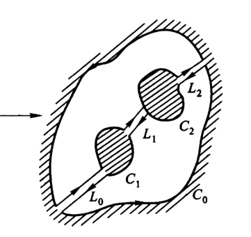
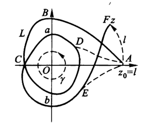

# 复变函数3：积分

- **符号约定**：
  - **点集的距离**：$\rho(E,F) = \inf\{|z_1-z_2|: z_1\in E，z_2\in F\}$
  - $F$ 表示 $f$ 的上限函数
  - 默认逆时针为正方向，沿顺时针方向时写为 $C^-$
<!-- - **重点**：向量微分的相消性，复数的共轭性、乘积旋转性
- 难点在于定理太多，容易想复杂（尤其是自由度较高的证明不等式，需要对性质有很熟悉的把握） -->
- **小技巧**：
  - 零点相关证明：取函数的倒数
  - 等式相关证明：作差，证明误差无穷小

## 定积分

- **周线**：逐段光滑的简单闭曲线
- **复变函数的定积分**：
  - 设 $C$ 是复平面上的有向曲线，在其上取分点 $a = z_0,z_1,...,z_n = b$
  - 设 $\D z_k = z_k-z_{k-1}$，$\z_k$ 为每个弧段上的某点
  - 设 $f$ 是复变函数，$S_n = \sum\limits_{i=1}^n f(\zeta_k)\D z_k $，若 $\lim\limits_{n\to\infty} S_n$ 存在，则称 $f$ 可积。极限值称为 $f$ 在 $C$ 上的定积分
- **定积分**：$J = \dis\int_{C+} f(z)dz$
  - **有向性**：积分必须定义在有向曲线上
    - 因为 $\D z_k$ 的符号受到方向影响，从而积分的符号受到方向影响
  - **有界性**：可积复变函数必有界
    - **证明**：定义易得
- **向量积分定理**：设 $f = u+iv$，则 $\dis\int_C f(z)dz = \int_C (udx - vdy) + i\int_C (vdx + udy) $ 
  - 复变函数积分可以转化为实函数的第二类路径积分
  - **证明**：
    - 已知 $S_n = \sum\limits^n_{k=1} f(\zeta_k)(z_k-z_{k-1})$
    - 对每一项进行拆解重组得 $S_n = \sum\limits^n_{k=1} (u_k\D x_k - v_k\D y_k) + i\sum\limits^n_{k=1} (v_k\D x_k + u_k\D y_k)$，从而由定义即得结论
- **变量代换公式**：$\dis \int_C f(z)dz = \int^\alpha_\beta f\Big( z(t) \Big)z'(t)dt $
  - 复变函数的定积分可以转化为实函数的定积分
  - **证明**：利用实虚部的可微性，重组即可
  - **本质**：
    - 复变函数定积分的参数方程形式
- **基本函数的积分**
  - **常函数积分**：$\dis\int_C dz = b-a$
    - **证明**：
      - 裂项相消即可
      - 体现了向量微分自身的相消性
  - **恒等映射积分**：$\dis\int_C zdz = \frac{1}{2}(b^2-a^2)$：
    - **证明（向量法）**
    - **证明（平方差法）**：
       - 分别取 $\z_k$ 为每个弧段的两端点，即得 $\begin{cases} \sum_1 = \sum\limits^n_{k=1} z_{k-1}\D z_k \\\\ \sum_2 = \sum\limits^n_{k=1} z_k\D z_k \end{cases}$
       - 再由于 $S_n = \dfrac{1}{2}(\sum_1 + \sum_2)$，即可凑出平方差公式，从而得到结果
    - **证明（定义法）**：综合下面两式，即可得到结果 $$\begin{cases} \sum\limits^n_{k=1} \Big( a+\sum\limits^{k-1}_{i=0}\D z_i \Big)\D z_k = a(b-a)+\sum\limits^n_{k=1}(\sum\limits^{k-1}_{i=0} \D z_i)\D z_k \\ \\ \sum\limits^n_{k=1}(b-\sum\limits^{k-1}_{i=0}\D z_{k-i})\D z_{n-k} = b(b-a)-\sum\limits^n_{k=1}(\sum\limits^{k-1}_{i=0} \D z_{k-i})\D z_{n-k} \end{cases}$$
      - **理解**：
        - 这种方法比较本源，体现了向量乘积的旋转性（相当于z一直在跟dz搞旋转）
        - 再往高幂扩展时，分解式变复杂了，不能再应用了
  - **圆周积分**：设 $C$ 是以 $a$ 为圆心的圆周，则 $\dis\int_C \frac{dz}{(z-a)^n} = \begin{cases} 2\pi i\quad (n=1)\\ 0\qquad (n\neq 1) \end{cases}$
    - **证明（$n=1$）**：
      - 化为指数形式，以 $ \t $ 为自变量，进行变量代换，转化为计算 $\dis\int_C\frac{\bar{z}}{r^2}dz$
      - 因为微分向量和被积向量的模均不变，所以只考虑方向即可
      - 由圆的切线和半径垂直，得到 $\bar{z}$ 和 $dz$ 的积永远指向 $y$ 轴正方向。从而积分是常数积分，从而结果为 $2\pi i$
    - **证明（$n>1$）**：
      - 同上，进行变量代换
      - 按照定积分的定义式，只需计算 $\cfrac{i}{r^{2n}}\sum_C \bar{z}^{n-1}\D z_k$
      - 由于圆周是中心对称图形，故正负向量一一对应，结果为 $0$
- **绝对值不等式**： $\dis\biggm|\int_C f(z)dz\biggm| \leq \int_C |f(z)||dz| = \int_C |f(z)|ds$
  - 可以将复变函数积分转化为实函数在复平面上的积分
  - **证明**：
    - 定积分的定义式 + 三角不等式即可
  - **理解**：
    - 向量积分由于符号问题，各个弧段的积分值会彼此相消，所以小于第一类曲线积分值
- **积分上界不等式**：设 $C$ 长度为 $L(C)$，则 $\dis\int_C f(z)dz \leq L(C)\max\limits_C f(z)$
  - **证明**：
    - 由绝对值不等式 + 积分线性易得结论
- **无积分中值定理**：
  - **反例**：$\dis\int^{2\pi}_{0} e^{i\t}d\t = 0$
    - 因为积分的是向量，而向量自身方向不定，可以相消。不像实数那样直接累积

### 习题

- **可积性**：
  - $C$ 上的连续函数存在定积分
- **绝对值积分**：$\dis\int_{|z|=1} \frac{|dz|}{z}$
  - **证明**：
    - 将 $z$ 换元为 $\t$ 即可
- **xy（分离为实数积分）**：
  - 若x和y独立，则可以化为累次积分
  - 确定的路径上 $x$ 和 $y$ 有相互关系，即存在隐函数 $y(x)$ 和 $x(y)$，则化为路径积分（转化为相应的一元积分，而不是视为常数）
- **积分中值定理估值**：

## 不定积分

### 单连通区域内的周线积分

- **柯西积分定理**：若 $f(z)$ 在单连通区域 $D$ 上解析，$C$ 为 $D$ 上任一周线，则 $\dis\int_C f(z)dz = 0$
- **证明（导数连续时）**：
    - 利用C.-R.方程和格林定理即可
  - **推论**：
    1. 非简单闭曲线（重合）可以看成有限条周线的衔接
    2. 割裂任意一个周线为两条路径，则这两条路径的积分值相等（即积分值与路径无关）
- **证明（导数存在时）**
  - **$C$ 为三角形时**：设沿周线 $C$ 的积分值为 $M$
    - **第一步（收缩）**：
      - 取 $C$ 的三条中位线，分割成四个三角形。它们的积分路径相抵消后正好是原三角形上的积分
      - 四个三角形中，存在其上积分值最大的一个，设其积分值为 $\D^{(1)} \geqslant \frac{M}{4}$ 
        - 周界：三角形所构成的闭曲线
      - 因为 $D$ 单连通，所以可以不断做下去，一直到 $\dis|\int_{\D^{(n)}} f(z)dz| \geqslant \frac{M}{4^n} $ 
    - **第二步（讨论极限）**：
      - 取闭矩形套，最终收缩为一个点。由题设得该点导数存在
      - 设 $\D^{(n)}$ 的周长为 $\cfrac{U}{2^n}$，由导数定义可得 $\forall \e > 0，\exists \d > 0，\forall |z-z_0|<\d$ 都有 $$|f(z) - f(z_0) - f'(z_0)(z-z_0)| < \e(z-z_0) < \frac{\e U}{2^n}$$
      - 再由周线上常值积分和比例积分均为 $0$，可添项将周线积分化为上述形式，即 $$ \int_{\D^{(n)}} f(z)dz = \int_{\D^{(n)}} \big[ f(z) - f(z_0) - f'(z_0)(z-z_0) \big] dz$$
        - 由绝对值不等式，对弧长积分得 $\dis|\int_{\D^{(n)}} f(z)dz| < \frac{\e U}{2^n} · \frac{U}{2^n}$
    - 最后放缩即可得到 $M = 0$
    - **理解**：
      - $\dis\frac{M}{4^n} \leqslant |\int_{\D^{(n)}} f(z)dz| < \frac{\e U}{2^n} · \frac{U}{2^n}$
        - 右侧三个无穷小，一个是极小邻域（$2^n$），一个是四分三角形周长（$2^n$），一个是导数定义作差（$\e$）
        - 左侧一个无穷小，是弧上积分的模（$4^n$）
        - **阶的比较**：弧上积分的模是二阶无穷小。从而整体的模M是无穷小（$\e$）
    - **本质**：核心还是两个重要积分，也就是向量微分的相消性和旋转性
  - **$C$ 闭折线时**：将其切割成三角形即可
  - **$C$ 为 $D$ 内任意周线时**：
    - **第一步（区域）**：
      - 取 $D$ 内闭子区域 $\ol{G} \supset C$，由Cantor定理得到函数在 $\ol{G}$ 上一致连续
      - 再设 $C\ol{G}$ 的最小距离为 $\rho$
    - **第二步（化曲为直，极限作差）**：
      - 在 $C$ 上取划分，设每一段的弧长为 $\d_j$，弦长为 $r_j$
      - 设 $\d = \min(\d_1,\rho)$
      - 取划分足够细，使得 $\forall \d_j < \d$
        - $\d_1$ 和函数连续性结合，用于得到 $\e$
        - $\rho$ 用于将讨论局限在区域 $\ol G$ 中
      - 由三角不等式易得 $|周线积分| \leqslant |每段弧的积分之和|$
        - 右式中，添项 $\dis\int f(z_j)dz$ 作差分离，得到 $$|弧积分-弦积分|(极限) \leqslant |弧积分| + |弦积分|(极限)$$
        - 再由函数连续性，$f(\D z) < \e$，从而 $上式 < \dfrac{\e}{l}\cdot l = \e$
    - **第三步（讨论极限）**：
      - 已知闭折线上的积分为 $0$，则弧线上的积分 $\dis\abs{\int_C f(z)dz}< \e-0 \to 0$
    - **理解**：
      <!-- - **数学本质**：还是两个重要积分的添项，把整体变成极小，再把极小变成作差，把作差变成弧积分 -->
      - 本来函数值远远大于弧，但是在周线积分中它们就相等（因为重要积分的归零性），这体现了向量积分中的相消性（函数值中存在的相抵向量积在积分中抵消，从而只剩下了弧积分）
    - **本质**：
      - **单连通区域**：把整体分割为极小
      - **基本积分**：把极小积分变形为作差形式
      - **函数连续 + 导数存在**：得出 $\e$

### 单连通区域内的不定积分

- **上限函数**：设 $f$ 在 $D$ 上解析，$z_0\in D$，则 $F(z) = \dis\int^z_{z_0} f(\zeta)d\zeta$ 存在，称为上限函数
  - **原函数性**：$F'(z) = f(z)$
    - **证明**：
      - 由导数定义 + 区间可加性 + 函数连续性，作差证明误差无穷小即可
- **上限解析定理**：
  - 设 $f$ 在单连通区域 $D$ 内连续
  - 若任取 $D$ 内周线 $C$，都有 $\dis\int_C fdz = 0$，则上限函数 $F(z)$ 解析
  - **证明**：
    - 仿照数分证明即可，中值定理变成作差 + 利用连续性
- **不定积分定理**：若满足以下条件之一，则 $f$ 的定积分只与端点有关，与具体路径无关
  - 满足柯西积分定理
  - 存在上限函数
- **N-L公式**：设 $\Phi$ 是 $f$ 在单连通区域内的原函数，则 $\dis\int^z_{z_0} fdz = \Phi(z) - \Phi(z_0)$
  - **证明**：
    - 易得 $\Big[ \Phi(z)-F(z) \Big]' = 0$，故只能是 $\Phi(z) - F(z) = C$
    - 再由 $F$ 的上限函数定义即得结论
- **不定积分存在条件**：
  - 设 $C$ 是周线，$D$ 是其内部
  - 若 $f$ 在 $\ol D$ 上解析，则 $\dis\int_C fdz = 0$
    - **证明**：
      - 由柯西积分定理易得结论
  - 若 $f$ 在 $D$ 上解析，$C$ 上连续，则 $\dis\int_C fdz = 0$
    - **证明**：
      - 在 $D$ 的内部作周线，使其逼近于 $C$，即可得到结论

### 多连通区域

- **复周线**：
  - 周线 $C_0$ 包含n个互不重叠的周线 $C_1,C_2,……C_n$
  - 这些周线构成的n+1连通区域D的边界，在 $C_0$ 上逆时针，在其余周线上顺时针，则称为复周线
- **复周线积分定理**：
  - 设 $f$ 是复变函数，$D$ 是多连通区域，总边界为 $C_0$，各个子区域的边界为 $C_1,...,C_n$
  - 若 $f$ 在 $D$ 内部解析，边界连续
  - 则 $\dis\int_C fdz = 0 \LR \int_{C_0}fdz = \int_{C_1} fdz+...+\int_{C_n}fdz$
  - **证明**：
    - 按照如下图做法，取 $n+1$ 条光滑弧线把 $D$ 割破，分割成 $n$ 个单连通区域。
    - 下图是一个三连通区域，$L_0$，$L_1$，$L_2$ 是三条内部割线
    
  - 容易发现，由于顺时针与逆时针方向相反，所以割线上的积分正好彼此抵消。而由柯西积分定理，单连通区域周线上的积分等于 $0$，所以总体积分值就是各个子区域边界上的积分值
  - **应用**：

### 习题

#### 计算积分

- **周线转化法**：将被积周线转化为自己构造的曲线
- **一般的圆周积分**：设 $C$ 是内部包含 $a$ 的任意周线，求 $\dis\int_C \frac{dz}{(z-a)^n}$
  - **解（转化法）**：
    - $C$ 是周线，但可以转化为 $a$ 为圆心的圆
  - *不是基本积分*：无论怎么取复周线，都必须包含奇点，从而定义域总是二连通区域
- **幂函数积分**：
  - 设 $D = \hkh{z\in\C \mid z\neq 0，z\neq \infty}$，则函数 $f(z) = \dfrac{1}{z^n}$ 可在 $D$ 内不定积分
  
  - **证明**：
    - 取如上图的曲线 $L$，其绕原点若干圈
    - 添加上述虚线，由复周线积分定理，易得 $f$ 沿 $L$ 的积分值等价于沿 $n$ 个圆周 $\gamma$ 和连接 $L$ 两端的曲线 $l$ 的积分 $$\int_L f(z)dz = n\int_\gamma f(z)dz + \int_l f(z)dz$$
    - $\gamma$ 上是圆周积分
    - $l$ 上 $f(z)$ 解析，且位于单连通区域，因此积分值与路径无关。可用常规不定积分求解
    - 最终可得结果 $\dis\int^z_1 \frac{d\zeta}{\zeta} = \ln z + 2n\pi i = \Ln z$
    - 同理可得 $\dis\int^z_1 \frac{d\zeta}{\zeta^2} = -\frac{1}{z} + 1$

#### 简化计算

- **三角函数的对称性（角度积分，换元 $\p = 2\pi - \p $）**：参数变量转化，讨论奇点和解析性
  - 已知 $\int_C \frac{e^z}{z}dz = 0\quad (C: |z|=1)$，则令 $z = e^{i\t}$，则原式化为 $\int^{2\pi}_0 e^{cos\t}[cos(sin\t)+isin(sin\t)]d\t = 2\pi$
  - 然后换元 $\p = 2\pi - \t$，得到 $\int^{2\pi}_0 e^{cos\t}[cos(sin\t)-isin(sin\t)]d\t = 2\pi$，从而 $\int isin(sin\t)d\t = 0$（√）
- **不定路径积分**：讨论奇点和解析性
  - 多值函数积分 $\int_C \frac{1}{\sqrt{z}}dz = 2\sqrt{z}$（C为 $1$ 到 $-1$ 的上半圆弧）
    - **换元法**：不同的路径主值支的值不同。转换为角度才可以得出 $k$
- **N-L公式**
  - 证明不等式 $|e^{bs} - e^{as}| \leq |s||b-a|e^{max\{a,b\}·Re(s)}$
  - **证明**：
    - 左式利用N-L公式转化为积分
    - 运用积分上界不等式，设 $s = \sigma + it$，简单放缩即可得到右式
- **直线中值定理**：
  - 设 $f$ 在区域 $D$ 内解析，$l$ 是 $D$ 内以 $a,b$ 为端点的直线
  - 则 $f(b)-f(a) = \lambda(b-a)f'(\xi) (\lambda\leq 1)$
  - **证明**：
    - 首先N-L公式化为 $\int^b_a (f'(z)-\lambda f'(\xi))dz =0$
    - 然后分离实部、虚部，由于是直线，y和x具有 $y = kx+m$ 的形式
      - $\int(u-\lambda Ref'(\xi))+ k(v-\lambda Imf'(\xi)) = 0$
      - $\int [k(u-\lambda Ref'(\xi))+(v-\lambda Imf'(\xi))] = 0$
      - 即 $u \Leftrightarrow \lambda Ref'(\xi)$，$v \Leftrightarrow \lambda Imf'(\xi)$，只要 $f'(\xi)$ 的实部和虚部分别超过u和v的积分中值，就可以保证 $\lambda \leq 1$
  - **理解**：普通的中值定理也可以由N-L公式得出
- **通过提取路径来简化不定积分**
  - $Re\int^z_0 \frac{dz}{1+z^2} = \frac{\pi}{4}$（$z$ 是单位圆右半圆周上任意一点）
    - 可以使用不定积分来做，但会得到多值函数，讨论比较麻烦
    - 也可以寻找路径0~1和1~z的圆弧，轻易就划分为了实部和虚部
  - 已知 $f(z)\leq \frac{1}{1-|z|}$，证明 $|f^{(n)}(0)| \leq (n+1)!(1+\frac{1}{n})^n < e(n+1)!$
    - **证明**：
      - 提取积分路径为 $|z| = \frac{n}{n+1}$
      - 由导数的积分形式 + 弧长积分公式即可

## 柯西积分公式（用积分值表示函数值）

### 周线上的柯西积分公式

- **柯西积分公式**：
  - 设 $D$ 是单连通区域，边界为周线 $C$
    - 若不是单连通区域，则无法应用圆周积分结论
  - 若 $f(z)$ 在 $D$ 内部解析，边界连续
    - 为了得到不定积分存在性，从而应用复周线积分定理
  - 则 $\forall z\in D$，都有 $\dis f(z) = \frac{1}{2\pi i}\int_C \frac{f(\zeta)}{\zeta - z}d\zeta$
  - **证明**：
    - 首先易得 $z$ 是被积函数 $\dfrac{f(\zeta)}{\zeta-z}$ 的奇点
    - 通过复周线积分定理，设 $\g$ 是以 $z$ 为圆心，半径为 $r$ 的圆周。则只需证明 $\dis\lim\limits_{r\to 0}\int_\gamma \frac{f(\zeta)}{\zeta-z}d\zeta = 2\pi if(z)$
    - 两边作差，讨论发现结果为 $0$
      - 由圆周积分结论得右式等于 $\lim\limits_{r\to 0}\dis\int_\g \frac{f(z)}{\z-z}d\z$
      - 作差后由半径极小性 + 解析函数连续性即得差值 $\to 0$，即左右相等
  <!-- - **理解**：
    - 连续性 $\to$ 得到 $f(\zeta)和f(z)$ 的相等关系
    - 向量微分的相消性和旋转性 $\to$ 解析函数周线积分的归零性 $\to$ 复周线积分的任意转化性 $\to$ 得到 $C、f(\zeta)、f(z)$ 的任意性
    -  定积分与上限函数 $\to f(z)$ 在积分中的常数性 $\to$ 把函数相等关系变形为积分相等关系，再变形为积分和函数值的相等关系
    - 复数的分式形式 $\to$ 共轭复数 $\to$ 角度恒定+圆的半径恒定 $\to$ 圆周积分的守恒性（不会出现多余 $g(z)$） $\to$ 确定积分和函数值的具体式子 -->
  - **本质**：
    - $2\pi i$ 用来把函数转化成积分，复周线和极限逼近用来确立两个积分的相等关系
    - 实际上只需调整周线，就可以确立多连通区域下的柯西积分公式
- **二连通区域的柯西积分公式**：
  - 设 $D$ 是二连通区域，外围周线为 $C$，内围周线为 $\G$，点 $z\in D$
    - $f$ 在 $D$ 内不一定解析
    - 此时被积函数 $\frac{f(\zeta)}{\zeta-z}$ 存在两个非解析区域
      - 奇点 $z$
      - $\Gamma$ 内部的非解析区域
  - 则任意包裹 $z$ 的周线都满足 $$f(z) = \frac{1}{2\pi i}\int_{\gamma} \frac{f(\zeta)}{\zeta-z}d\zeta = \frac{1}{2\pi i}\dkh{\int_{C^反} \frac{f(\zeta)}{\zeta-z}d\zeta + \int_\Gamma \frac{f(\zeta)}{\zeta-z}d\zeta}$$
  - **证明**：
    - 由复周线积分定理，仿照上面即可
  - **本质**：就是洛朗展式的推导……同时它还是柯西留数定理的二阶形式……后面几章没有新东西
- **外部区域柯西积分公式**：
  - 设 $z$ 是复平面上一点，$C$ 是某个周线
  - 若
    - $f$ 在周线 $C$ 外的区域 $D$ 上解析，在 $C$ 上连续
      - $f$ 在 $C$ 的内部不解析
    - $\lim\limits_{z\to \infty}f(z) = A$
  - 则 $\dis\frac{1}{2\pi i}\int_{C^-} \frac{f(\zeta)}{\zeta-z}d\zeta = \begin{cases}-A & z\in C内部 \\ f(z)-A & z\in C外部 \end{cases}$
  - **证明**：
    - 设 $\G$ 为以原点为心，半径无穷大的圆周
      - 只是个简便说法，严格来说需要 $\e-\d$ 语言，比较麻烦
    - **若 $z$ 在 $C$ 外部**
      - 由二连通区域的柯西积分公式得 $$f(z) = \frac{1}{2\pi i}(\int_{C^{反}} \frac{f(\zeta)}{\zeta-z}d\zeta + \int_\Gamma \frac{f(\zeta)}{\zeta-z}d\zeta)$$      
      - 再求解 $\G$ 上的积分值
        - 作差得 $$\biggm|\frac{1}{2\pi i}\int_\Gamma \frac{f(\zeta)}{\zeta-z}d\zeta-A\biggm| = \frac{1}{2\pi i}\biggm|\int_\Gamma \frac{f(\zeta)-A}{\zeta-z}d\zeta\biggm|$$
        - 由 $f$ 的极限性质，外部无穷大周线 $\Gamma$ 上有 $A = f(z)$
        - 再换元为 $\t$，即可转换为弧长积分。最后由 $f$ 的连续性得上式 $\to 0$
      - 综上即得 $$\dis\frac{1}{2\pi i}\int_{C^反} \frac{f(\zeta)}{\zeta-z}d\zeta = f(z)-A$$
    - **若 $z$ 在 $C$ 内部**
      - 已知 $C$ 内部不解析，故此时 $z$ 不构成被积函数的奇点，所以是二连通区域积分，仅两个周线
      - 此时 $C$ 和 $\Gamma$ 构成二连通区域，内部解析
      - 由复周线积分定理，周线积分之和为0，再由上面结论，$\dis\int_\Gamma f = A$，故 $$\frac{1}{2\pi i}\int_{C^反} \frac{f(\zeta)}{\zeta-z}d\zeta = A$$
  - **本质**：将无穷大周线看作无穷远点的邻域周线
   - 以后可以知道，A，即 $\int_{\Gamma}\frac{f(\zeta)}{(\zeta-z)}dz$ ，是洛朗展式的 $f(z)$ 系数，即 $f(\infty)$ 
- **柯西积分公式的弱化定理**
  - 设 $f$ 是复变函数，$a$ 是复平面上某点
  - 若 $f$ 在 $a$ 的某邻域内连续，则 $\dis f(a) = \frac{1}{2\pi i}\lim\limits_{r\to 0}\int_{\g}\frac{f(z)}{z-a}dz$
  - **证明**：
    - $f(a)$ 是常数，左式可以写为圆周积分形式，然后两边作差 + 放缩即可
  - **理解**：因为 $f(a)$ 是常数，不会有进一步的导数性质推论，所以也不要求邻域内解析了
  - **本质**：本来柯西积分公式就用不到解析性，只是为了和后面的导数性质保持条件一致而已

### 圆周上的柯西积分公式

- **解析函数平均值定理**：设 $f$ 在圆 $|\z-z_0| < R$ 内部解析，边界连续，则 $$f(z_0) = \frac{1}{2\pi}\int^{2\pi}_{0}f(z_0+Re^{i\p})d\p$$
  - **本质**：圆心上的值等于圆周上值的平均数
  - **证明**：
    - 柯西积分公式中，换元 $\zeta =z_0 + Re^{i\p}$，则此时 $d\zeta = Rie^{i\p}d\p$，代入即得结论
    - 圆周是一类性质比较好的周线，所以拥有更强的结论

### 导函数的柯西积分公式

- **解析函数高阶导公式**：若 $f$ 在周线 $C$ 的内部解析、边界连续，则 $$f^{(n)}(z) = \frac{n!}{2\pi i}\int_C \frac{f(\zeta)}{(\zeta-z)^{n+1}}d\zeta$$
  - 导数与积分可以相互表出
  - **证明**：
    - 根据柯西积分公式 + 导数定义，直接计算易得 $f'(z)$ 的结论
      - 由于 $z$ 的符号为负，使得求导变号和分式求导变号中和，从而导函数的符号总是正的
    - 最后不断归纳即得结论
  - **推论**：
    - **解析函数无穷可微性**
- **柯西圆周不等式**：
  - 设 $a$ 是单连通区域 $D$ 内的半径为 $R$ 的圆周上某点
  - 则 $|f^{(n)}(a)| \leq \dfrac{n!M(R)}{R^n}$，其中 $M(R) = \max\limits_{z\in a}|f(z)|$
  - **证明**：
    - 由解析函数高阶导公式，将导数写成积分形式
      - 由绝对值不等式，积分转化为实函数的弧长积分，此时 $|d\zeta|$ 变成 $2\pi R$
      - 由于圆的半径不变，故此时 $|\zeta-z|$ 变成 $R$
      - 由积分上界不等式，此时可将 $f(\zeta)$ 变成 $M(R)$
      - 综上即得结论

### 积分不等式 $\to$ 函数不等式

- **整函数**：在整个复平面上解析的函数
  - **实例**：
    - 多项式函数
- **Liouville定理**：有界整函数必为常函数
  - **证明**：
    - 由整函数的解析区域无穷大，故可将柯西圆周不等式取极限，得 $\lim\limits_{R\to\infty} |f'(a)| \leqslant \dfrac{M}{R} = 0$
    - 再由于上面的圆心可任意取，故对 $\forall a\in \C$ 都成立上式，从而 $f$ 是常函数
  - **理解**：
    - 由导数与积分的互逆性，转化为积分
    - 再由积分的有界性，被半径的无界性消除为0。
  <!-- - **几何理解**：一个无穷大的圆，圆心任意取，从而圆周可以扫过所有的C平面点 -->
  - **本质**：根本原因是因为解析条件太强，需要各个方向导数相等，所以解析函数的性质也很强
  - **反例（无界的整函数）**：
    - 多项式函数
    - 指数函数
    - 复三角函数
      - 可以化为指数函数的线性组合，从而无界
  - **反例（不是整函数）**：
    - 实函数在复平面上只有实轴有定义，不是整函数
- **代数基本定理**：复数域上的 $n$ 次多项式至少有一个零点
  - **证明**：
    - 整函数性
      - 易得复数多项式 $\dfrac{1}{p(z)}$ 在有限区域上解析，从而是整函数
      - 无穷远点处 $\lim\limits_{z\to \infty}\dfrac{1}{p(z)} = 0$，从而有界
    - 又因为 $p(z)$ 无零点，由 $p$ 的连续性得也没有逼近0的奇点，所以 $\dfrac{1}{p(z)}$ 有界。由刘维尔定理，其为常数，矛盾。
  - **理解**：实函数的定义域在C上只是一个轴，所以任何高级定理都无法适用。但由于多项式方程解的复数性，所以其可以应用复变函数的性质。

### 积分与导数的互逆关系$\to$ 解析关系

- **莫雷拉定理（柯西积分定理的逆定理）**：
  - 若 $f$ 在单连通区域 $D$ 内连续，且对其中任意周线 $C$ 都有 $\dis\int_Cf(z) = 0$，则 $f(z)$ 解析
  - **证明**：
    - 由 $f(z)$ 单连通区域内连续、周线积分为 $0$，得其存在解析的原函数 $F$
    - 由解析函数的无穷可微性，得被积函数解析，从而 $f$ 解析
  - **推广（多连通解析）**：若 $D$ 是多连通区域，结论依然成立
    - **证明**：
      - 根据周线的任意性，可以绕开奇点去取周线。此时等价于单连通区域情况，所以多连通区域内部也可以得到解析
  - **实例**：
    - $f(z) = \dfrac{1}{z}$ 在原点处不解析（无定义），但在二连通区域 $\C\j\{0\}$ 内解析
- **柯西型积分**：
  - 设 $C$ 是简单逐段光滑曲线，$f(z)$ 在上面有定义且可积
    - 条件很弱，$f$ 不解析，不连续，且 $C$ 也不是周线
  - 则 $\dis F(z) = \frac{1}{2\pi i}\int_C \frac{f(\zeta)}{\zeta-z}d\zeta\ (z\notin C)$ 称为柯西型积分
    - $F(z)$ 和 $f(z)$ 没有积分关系，可以看作是一种变形
- **简单曲线解析定理**：如果 $f(z)$ 在 $C$ 上连续，则柯西型积分 $F(z)$ 在不包含 $C$ 的区域 $D$ 内解析
  - **证明**：
    - 假设 $F(z)$ 导数为 $\dis\frac{2!}{2\pi i}\int_C \frac{f(\zeta)}{(\zeta - z)^2}d\zeta$，直接使用定义作差证明即可
      - 连续的作用是使得 $f(z)$ 有界，从而可以放缩积分
    <!-- - **数学意义（？未完）**：
      - 由 $f(z)$ 在C上连续，得 $\frac{f(\zeta)}{\zeta - z}$ 在C上连续，从而 $F(z)$ 在定义域上连续
      - 然后 $2\pi iF(z) = \int_\odot \frac{F(z)}{\xi-z}d\xi = \displaystyle\int_\odot\frac{ \int_C \frac{f(\zeta)}{\zeta - z}d\zeta}{\xi - z} d\xi$ -->

### 习题

#### 证明

- **圆平均定理推论**：
  - 设 $f$ 在闭圆 $|z|\leqslant R$ 上解析
  - 若 $\exist a$，使 $|z| = R$ 时，有 $|f(z)|>a$ 且 $|f(0)|<a$
  - 则 $f$ 在圆的内部至少有一个零点
  - **理解**：
    - 首先圆心值是圆上值的平均数
      - $|f(0)| = |\frac{\int f(z)}{2\pi R}| < a$
      - 若 $f(z)$ 均为正，则 $平均值 = |f(\xi)| > a$ 矛盾，所以圆周上必定有负值
    
    - 下面讨论一下可能的情况
      - 若u和v均为负，则由 $f(z)$ 连续性，必定有零点。但若有零点则不满足 $|f(z)| > a$，舍去
      - 这个负值不一定是 $u$ 和 $v$ 都为负，可能只有一个为负，另一个为正
        - 设 $u$ 为负，由于 $|f(z)|>a$，以及 $f(z)$的连续性，所以一定存在 $u=0$。此时 $v>a$，不为零点
      - 这个负值不一定是 $u$ 和 $v$ 同时趋向于 $0$ 的，而可能是 $u$ 先变成负，然后 $v$ 再变成负
        - 这样还是没有零点。
      - 综上，应当是这些情况保证了没有零点，但平均值的模依然小于 $a$
    
    - 但连续函数将连通集映射成连通集，所以圆周上没有零点，圆内部就一定有零点。
  - **本质**：连续性 + 负数约束
  - **证明**：反设无零点，则在闭圆上无零点，令 $F(z) = \frac{1}{f(z)}$
    - **平均值定理**：得 $F(0) = \cfrac{\int_\odot F(\p)d\p}{2\pi}$，而 $F(0)>\frac{1}{a}，F(Re^{i\p})=\cfrac{1}{f(Re^{i\p})} <\frac{1}{a}$
    - **积分上界不等式、中值定理**：得到积分值为中值 $|F(\xi)| = \frac{1}{a}$，矛盾
- **复常函数包括实常函数**：若 $\Re f(z)$ 有界，则其为常数
  - **扩充法证明**
    - 它不解析，不是整函数
    - 但它的变形 $F(z) = e^{f(z)}$ 是整函数，且有界，所以是常数
    - 所以它也是常数
- **保光滑性**：解析函数将光滑曲线映射成光滑曲线
    - **证明**：
      - 由连续函数的性质、换元成 $f(z(t))$ 形式，再由解析函数无穷可微性得导数连续

#### 计算

- **将计算积分转化为计算函数值**：
  - **经典例子**：$\int_C \frac{f(\zeta)}{(\zeta-z)^k}d\zeta$ 类函数
  - **绕开奇点**：计算 $\displaystyle\int_C \frac{sin\frac{\pi}{4}z}{z^2-1}dz\quad (C: |z+1|=\frac{1}{2})$
    - **解**：取 $f(z) = \frac{sin\frac{\pi}{4}}{z-1}$
      - 奇点为1，在 $C$ 的外部，从而可以使用单连通柯西积分公式
      - 从而 $2\pi if(-1) = 原式 = \frac{\pi i}{\sqrt{2}}$
    - **推论**：若两个奇点都包含，则直接复周线转化，然后利用之前求的结果即可

## 解析函数与调和函数

### 二元调和函数

- **拉普拉斯算子**：$\D = \cfrac{\partial^2 }{\partial x^2} + \cfrac{\partial^2 }{\partial y^2}$
  - **线性**：$\D(f+g) = \D f + \D g$
    - **证明**：由微分的线性易得结论
- **拉普拉斯方程**：$\D f = 0$，即 $\begin{cases} \D u = 0 \\ \D v = 0 \end{cases}$
- **调和函数**：若二元实函数 $H(x,y)$ 有二阶连续偏导数，且满足拉普拉斯方程 $\D H = 0$，则称其为调和函数

### 解析函数的调和性

- **共轭调和函数**：若 $u,v$ 满足C.-R.方程，则称为共轭调和函数
- **解析函数调和性**：设 $f = u+iv$ 是解析函数，则 $u,v$ 是共轭调和函数
  - **证明**：
    - 由解析得 $u$ 的二阶偏导数连续，从而 $u$ 的混合偏导数相等，则 $\dpfrac{^2 u}{ x^2}+ \dpfrac{^2 u}{ y^2} = 0$
    - 对 $v$ 同理
  - 两个调和函数必须共轭，其组成的复变函数才可能解析
- **构造定理**：$\R^2$ 上的单连通区域内，若已知调和函数 $u(x,y)$，则可唯一求出其共轭调和函数 $v(x,y)$
  - **证明**：
<!-- - **二阶导数**：$\dis\pfrac{^2 u}{ x^2} = \pfrac{^2 v}{ x y}，\pfrac{^2 u}{ y^2} = -\pfrac{^2 v}{ y x}$ -->
- **导数调和性**：$\dpfrac{ u}{ x}$ 和 $\dpfrac{ u}{ y}$ 互为共轭调和函数
  - **证明**：
    - 由解析函数无穷可微性，其导数也解析，故得到结论

### 习题

- 由解析性（C.-R.方程）知一求二
  - 积分法即可
- $\D f = 4·\cfrac{\partial^2 f(z)}{\partial z\partial\bar{z}}$
  - **证明**：拆分右式即可
  - **理解**：$\frac{\partial f}{\partial z}$ 和 $\frac{\partial f}{\partial x}$ 等的关系是由$df$的微分重组决定的
- $\D |f(z)|^2 = 4|f'(z)|^2$
  - **证明**：拆分左式，由 $\D u/v = 0$ 和C.-R.方程可得
- 证明是调和函数：
  - $ln|f'(z)|$
    - **证明**：利用解析函数的实虚部调和性

## 平面向量场

### 

- 平行于一个平面的定常向量场
  - 向量与时间无关
  - 向量都平行于一个平面$S_0$
  - 有无限个平面平行于$S_0$，上面的点可以连接成一个垂直直线
- 平面向量场中的点：一条垂直直线
- 平面向量场中的曲线：以该曲线为准线的柱面
- 平面向量场中的区域：以Ｄ为底面的一个柱体
- **理想流体**
  - 质量均匀、不可压缩、定常流动

### 流量与环量（曲线的切向、法向 $\rightarrow$ 水平、垂直方向）

- **流量**$v_nds$：
  - 曲线$\gamma$有两个端点$A、B$
  - 流体单位时间内穿过$\gamma$的量
- 流速：$\vec{v}(z) = p(x,y)+q(x,y)i$，p为水平分速，q为垂直分速
- 切向量：$dz = dx+idy$（$\star$ **关键一步**）
  - 弧元：$ds = |dz|$（以直代曲）
  - 单位切向量：$\vec{\tau} = \frac{dx}{ds} + i\frac{dy}{ds}$
    - 则$\vec{n} = e^{i·(-\frac{\pi}{2})}\vec{\tau} = \frac{dy}{ds} - i\frac{dx}{ds}$
    - 单位法向量：$\vec{n}$，指向$\gamma$的右边
- 法向流速：$\vec{v}_n = \vec{v}·\vec{n} = p\frac{dy}{ds} + q\frac{dx}{ds}$
- 沿曲线积分结果：$单位时间流量N_\gamma = \int_\gamma (-qdx + pdy)$
- **环量**$\Gamma_\gamma$
  - 流速在曲线$\gamma$上的切线分速
  - $\Gamma_\gamma = \int_\gamma (pdx + qdy)$
- **复数下的环流量**：$\Gamma_\gamma + iN_\gamma = \int_\gamma (p-qi)(dx+idy) = \int_\gamma \overline{\vec{v}(z)} dz$
  - **复速度**：$\overline{\vec{v}(z)} = (p-qi)$