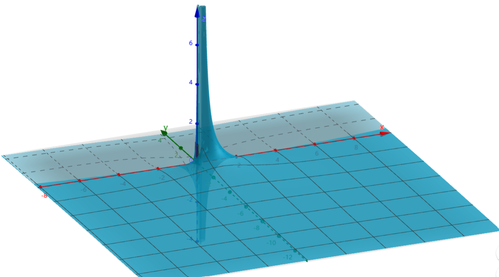

# 复变函数5：Laurent展式

- 数分中常用的级数分解法：
  - 待定系数法
  - 裂项法
  - 直接相除法（见组合数学）

## 洛朗展式

### 双边幂级数

- **正侧幂级数**：$\sum\limits^\infty_{n=1} c_n(z-a)^n$，收敛区域为开圆 $|z-a|<R$
  - **证明**：
    - 就是上一章的结论
- **负侧幂级数**：$\sum\limits^\infty_{n=1} \lfrac{c_{-n}}{(z-a)^n}$，收敛区域为开圆的外侧 $|z-a|>r$
  - **证明**：
    - 可换元 $\xi = \dfrac{1}{z-a}$ 成为幂级数，易得收敛区域为 $|\xi| < \frac{1}{r}$，再换回来即得结论
- **双边幂级数**：$\sum\limits^\infty_{n=-\infty} c_n(z-a)^n$，同时具有正侧和负侧的幂级数，收敛区域为圆环
  - **绝对收敛性**：若双边幂级数在圆环内收敛，则其绝对收敛
    - **证明**：
      - 同幂级数
  - **内闭一致收敛性**：若 $f_1,f_2$ 分别是正负侧幂级数的极限函数，则双边幂级数在圆环中内闭一致收敛于 $f(z) = f_1(z) + f_2(z)$
    - **证明**：
      - 同幂级数
  - **解析性**：双边幂级数若收敛，则极限函数 $f(z)$ 在圆环内解析
    - **证明**：
      - 由Weierstrass定理易得结论

### 洛朗展式

- **洛朗定理**：
  - 若 $f$ 在圆环 $H$ 内解析，$a$ 为圆心
  - 则
    - $f$ 可唯一展为双边幂级数
    - 系数公式如下（$\G$ 是圆环内的任意圆周） $$c_n = \frac{1}{2\pi i} \int_\G \frac{f(\z)}{(\z-a)^{n+1}}d\z$$
  - 洛朗展式就是泰勒展式的推广版
- **证明（存在性）**：
  - 设 $\G_1$ 是逼近圆环内侧的圆周，$\G_2$ 是逼近圆环外侧的圆周
  - 由二连通区域的柯西积分公式得 $$f(z) = \frac{1}{2\pi i}\int_{\G_2} \frac{f(\z)}{\z-z}d\z - \frac{1}{2\pi i} \int_{\G_1} \frac{f(\z)}{\z-z} d\z \color{blue}$$
  - 再仿照泰勒级数的变形法，可将上式化为 $$\sum\limits^\infty_{n=0} (z-a)^n\frac{1}{2\pi i} \int_{\G_2} \frac{f(\z)}{(\z-a)^{n+1}}d\z\quad +\quad \sum\limits^\infty_{n=0} \frac{1}{(z-a)^n}\frac{1}{2\pi i} \int_{\G_1} \frac{f(\z)}{(\z-a)^{n+1}}d\z$$
    - 前项可以直接展成泰勒级数 $$\dis\frac{f(\z)}{\z-z} = \frac{f(\z)}{\z-a}·\frac{1}{1-\frac{z-a}{\z-a}} = \frac{f(\z)}{\z-a}\sum\limits^\infty_{n=0} (\frac{z-a}{\z-a})^n$$
      - $z$ 在圆环内，$\z$ 逼近外圆，从而 $|z-a| < |\z-a|$，即后面的幂级数收敛
    - 后项反换元，展成Laurent级数的负部分 $$\frac{f(\z)}{\z-z} = \frac{f(\z)}{z-a}·\frac{-1}{1-\frac{\z-a}{z-a}} = -\frac{f(\z)}{z-a}\sum\limits^\infty_{n=1}(\frac{\z-a}{z-a})^{n-1}$$
      - $z$ 在圆环内，$\z$ 逼近内圆，从而 $|\z-a| < |z-a|$，即后面的幂级数收敛
  - 最后，由复周线积分定理，圆环内任意圆周上的积分值相同，故 $\G_2$ 和 $\G_1$ 可替换为圆环内的任意圆周 $\G$，从而得到系数公式
- **证明（唯一性）**
    - 反设存在另一种洛朗展开，系数为 $c_n'$
    - 则其在收敛域内一致收敛，且乘以有界量 $\dfrac{1}{(z-a)^{m+1}}$ 后仍然收敛
    - 对应用逐项积分定理，得 $$\int_\G \frac{f(\z)}{(\z-a)^{m+1}}d\z = \sum\limits^\infty_{n=-\infty}c'_n \int_\G (\z-a)^{n-m-1}d\z$$
      - 已知正次幂函数 $z^n$ 的圆周积分为 $0$
        - （正次幂函数是整函数，故由柯西积分定理得圆周积分为 $0$）
      - 已知负次幂函数 $\dfrac{1}{z^n}$ 的圆周积分只有 $-1$ 次项不为 $0$
        - （负次幂函数仅以 $a$ 为奇点，故应用圆周积分结论即可）
      - 综上即得右式结果为 $c'_m$
      - 而已知左式是 $c_m$ 的定义式，从而 $c'_m = c_m$，即得唯一性

## 计算洛朗展式

- **求洛朗展式的步骤**：
  - **寻找奇点**：根据函数的性质直接寻找即可
  - **寻找展开区域**：
    - 一般题目中会给出展开区域
    - 若题目中没有展开区域，则一般取圆心为原点、圆周上存在奇点的圆环
  - **寻找展开对象**：
    - 一般来说是关于 $z-a$ 展开（$a$ 为奇点），即展开成 $\sum\limits^\infty_{n=1} c_n(z-a)^n$ 或 $\sum\limits^\infty_{n=1} c_n\dfrac{1}{(z-a)^n}$
    - 但若题目中指定具体区域 $D$，可能出现  $|z-a| < 1$  或 $|\dfrac{1}{z-a}| < 1$ 在 $D$ 中不能总是满足的情况
      - 比如区域 $|z-(a+1)| < 1$
      - 这时候只需新添加一个系数，使得 $|k(z-a)| < 1$ 在 $D$ 上总满足即可
  - **选择具体方法**
- **求洛朗展式的原则**：
  - **指定区域**：
    - 如果指定区域不存在奇点，则洛朗展式就是泰勒展式
    - 如果指定区域存在奇点，则需要取圆环，且圆环内部不能存在奇点（即奇点在内圆内或外圆外）
  - **换元原则**：必须展成双侧幂级数，所以系数和底数的 $z$ 函数必须可以合并
  - **实例**：
    - $f(z) = \dfrac{2}{z^2+1}$，在圆环 $(1<|z|<2)$中
      - 应当换元为 $\dis\frac{1}{1+\frac{1}{z^2}}·\frac{2}{z^2}$，而不是 $\dis\frac{1}{1-(z-1)}·\frac{2-z}{z^2+1}·2$

### 分式多项式的换元法

- **换元法**：$f(z) = \dfrac{1}{(z-1)(z-2)}$
  - **解**：
    - **寻找奇点**：易得函数的奇点为 $z=1，z=2$
    - **寻找展开区域**：只需分别对圆 $|z|<1$、圆环 $1<|z|<2$、圆环 $2<|z|<+\infty$ 进行求解即可
    - **裂项**：$f(z) = \dfrac{1}{z-2}-\dfrac{1}{z-1}$
    - **换元配凑（圆 $|z|<1$）**：
      - 变形成下列形式，再写成等比级数即可 $$ f(z) = -\frac{1}{2}\cdot\frac{1}{1-\frac{z}{2}} + \frac{1}{1-z} $$
    - **换元配凑（圆环 $1<|z|<2$）**：
      - 此时 $|z|>1$， $\dfrac{1}{1-z}$ 对应的幂级数不收敛
      - 但此时相应有 $|\dfrac{1}{z}| < 1$，故只需再变形为 $\cfrac{1}{z}\cdot\cfrac{1}{1-\frac{1}{z}}$ 即可
      - 变形成下列形式，再写成等比级数形式即可 $$ f(z) = -\frac{1}{2}·\frac{1}{1-\frac{z}{2}} - \frac{1}{z}·\frac{1}{1-\frac{1}{z}}$$
    - **换元配凑（圆环 $2<|z|<+\infty$）**：
      - 此时 $|z| > 1$ 且 $|\dfrac{z}{2}| > 1$，对应的幂级数均不收敛
      - 故应该转换为它们的倒数，即 $\dfrac{1}{z}$ 和 $\dfrac{2}{z}$
      - 变形成下列形式，再写成等比级数形式即可 $$ f(z) = \frac{1}{z}·\frac{1}{1-\frac{2}{z}} - \frac{1}{z}·\frac{1}{1-\frac{1}{z}}$$
- **指定区域后的换元法**：$f(z) = \dfrac{1}{(z-1)(z-3)^2}$
  - **裂项**：$$f(z) = \frac{1}{2}\cdot \frac{1}{(z-3)^2} - \frac{1}{2}\cdot \frac{1}{z-3} + \frac{1}{2}\cdot \frac{1}{z-1}$$
  - **解（圆环 $0 <|z-1|<2$）**：
    - 此时我们不能保证 $|z-1| < 1$，所以只能针对 $|\cfrac{z-1}{2}| < 1$ 进行展开
    - 此时 $\cfrac{1}{z-3} = -\cfrac{1}{2}\cdot\cfrac{1}{1-\frac{z-1}{2}}$，展开即可
    - 此时 $\cfrac{1}{(z-3)^2} = -\Big(\cfrac{1}{z-3}\Big)'$，应用逐项求导定理即可
      - 除了逐项求导好像也没好办法
    - 而 $\cfrac{1}{z-1}$ 可以直接融入负侧幂级数
  - **解（圆环 $2< |z-1|<+\infty$）**
    - 此时我们虽然能保证 $|\dfrac{1}{z-1}| < \dfrac{1}{2}$ 满足相应幂级数的收敛性，但是它太强了，用 $|\dfrac{2}{z-1}| < 1$ 更好一些
    - 此时 $\cfrac{1}{z-3} = \cfrac{1}{z-1}\cdot\cfrac{1}{1-\frac{2}{z-1}}$，展开即可
    - 其它同上处理即可
- $f(z) = \cfrac{1}{(z^2+1)^2}$
  - **解**：
    - **寻找奇点**：易得奇点为 $i$
    - **寻找展开区域**：取 $0 < |z-i| < 1$ 即可
    - **计算**：
    - 首先确定好，用幂级数展开后再平方计算，所以换成$(\frac{1}{z^2+1})^2$
    - 然后再换元$m = z-i$，从而 $f(z) = (\frac{1}{(m+i)^2+1})^2 = (\frac{1}{m})^2·(\frac{1}{m+2i})^2$
    - 最后转化为幂级数形式：$\frac{1}{m+2i} = \frac{1}{\frac{m}{2i} + 1}$，最终得到 $\frac{1}{(z-i)^2} · (\sum\limits^\infty_{n=0} (-1)^n·(\frac{z-i}{2i})^n)^2$
    - 平方计算得到每项系数为$\frac{n+1}{2}（首尾匹配） × 2（两个顺序）$
    - 因为底数是$\frac{z-i}{2i}$，所以邻域是 $|z-i|<2$

### 初等复合函数

- $f(z) = \cfrac{\sin z}{z}$
  - **解**：
    - **寻找奇点**：只有 $z=0$
    - **寻找展开区域**：取 $0<|z|<+\infty$ 即可
    - **计算**：直接对 $\sin z$ 关于 $z$ 进行展开，然后将 $\dfrac{1}{z}$ 融入即可
- $f(z) = e^z + e^{\frac{1}{z}}$
  - **解**：
    - **寻找奇点**：只有 $z=0$
    - **寻找展开区域**：取 $0<|z|<+\infty$ 即可
    - **计算**：前一项是已知结论，对于后一项，直接将 $z$ 换为 $\dfrac{1}{z}$ 即可
- $f(z) = \sin\dfrac{z}{z-1}$
  - **解**：
    - **寻找奇点**：只有 $z=1$
    - **寻找展开区域**：取 $0<|z-1|<+\infty$ 即可
    - **计算**：
      - 利用诱导公式，容易发现 $$\sin\frac{z}{z-1} = \sin(1+\frac{1}{z-1}) = \sin 1\cdot\cos\frac{1}{z-1} + \cos 1 \cdot \sin\frac{1}{z-1}$$
      - 分别进行泰勒展开后换元即可
- $f(z) = \cosh(z+\dfrac{1}{z})$
  - **解**：
    - **寻找奇点**：只有 $z=0$
    - **寻找展开区域**：取 $0<|z|<+\infty$ 即可
- $f(z) = e^{\dfrac{1}{1-z}}$
  - **解**：
    - **寻找奇点**：只有 $z=1$
    - **寻找展开区域**：
    - **计算**：$$e^{\dfrac{1}{1-z}} = e^{\cfrac{\frac{1}{z}}{\frac{1}{z}-1}} = e^{\large -\frac{1}{z} · (1+\frac{1}{z} + (\frac{1}{z})^2+...)}$$
      - 再将 $e^{f(z)}$ 展开后，可化为无穷乘积 $\displaystyle\prod\limits^\infty_{k=1}\sum\limits^\infty_{n=0}(-1)^n\frac{(\frac{1}{z})^{kn}}{n!}$

### 多值函数

- **判断多值函数在去心邻域内能否展开**：
  - 若圆心是支点，则在邻域圆内会从一支变到另一支中，则一点对应多值。因为多值函数不解析，所以任何邻域都无法展开
  - 若圆心不是支点，则可以展开
- $f(z) = \sqrt{z}，z=0$：
  - **解**：
    - **判断解析性**：支点为 $z=0$，无法展开
- $f(z) = \sqrt{z(z-2)}，z=1$
  - **解**：
    - **判断解析性**：支点为 $z=0，z=2$，可以展开

### 习题

- **指定区域内的洛朗展式**：首先根据定义域确定要换的元，然后利用反函数把给出的函数换元

## 孤立奇点

- **孤立奇点**：设 $a$ 是 $f$ 的奇点，若 $f(z)$ 在 $a$ 的某个去心邻域内解析，则称 $a$ 是 $f$ 的孤立奇点
  - **实例**：
    - 初等多值函数的支点
    - 分式函数的奇点
- **孤立奇点邻域内的洛朗展式**
  - 孤立奇点是一个内部圆收缩成一个点的圆环，所以它虽然不可以展成Taylor展式，但它的Laurent展式在形式上和Taylor展式具有相似性
  - 存在多个孤立奇点时，只要绕开它们分别取圆环，也可以覆盖整个复平面
- **函数在点 $a$ 的正则部分**：负侧幂级数
- **函数在点 $a$ 的主要部分**：正侧幂级数
  - 因为幂级数中，只有分式项才会出现奇点。主要部分体现了函数的奇异性
- **函数的奇点和其展式的奇点不相同，根据它们之间的关系可以分为以下三种：**
  - 可去奇点
  - 极点
  - 本质极点
  - 对它们，有三个判断视角：
    - **定义视角**：Laurent展式的主要部分的项数
    - **普通视角**：$f(z)$ 是否有限大但无定义（可去奇点）、有阶无穷大（极点）、无极限或无阶无穷大（本质奇点）
      - （无阶的意思是无论如何求导都无法化为0）
    - **反转视角**：$\frac{1}{f(z)}$ 的零点阶数（极点）、是否任意阶导数为0（由于不是单连通区域，所以不能Taylor展开得到常函数）
      - **不严谨的理解**：我们现在主要研究的是初等解析函数，而初等解析函数里只有分式函数有奇点，所以反转几乎可以解决所有目前问题
      - **重要引论：收敛级数的二象性**
        - 对于一个收敛级数，我们不能简单粗暴地仅仅把它看成一个和式，而应当同时把它看成极限函数与和式的联合（C语言术语）
        - 需要把它看成级数的时候：$z·\frac{1}{1-z}$，此时直接把z乘入级数即可
        - 需要把它看成极限函数的时候：$\frac{1}{\sum (z-a)^n}$，此时需要适当转化，变成 $\p(z)$ 后重新展开（转化一般只存在于理论，用于证明题）

### 可去奇点

- **可去奇点**：
  - **展开定义法**：洛朗展示的主要部分为 $0$
  - **极限定义法**：$\lim\limits_{z\to a}f(z) = c_0 \quad (c_0\neq \infty)$
    - $\lim\limits_{z\to a}\frac{1}{f(z)} = \frac{1}{c_0} \quad (\frac{1}{c_0} \neq 0)$，依然是可去奇点
  - **有界定义法**：$f(z)$ 在 $a$ 的去心邻域内有界
  - **证明**：
    - $(1)\to (2)$
      - 若主要部分为 $0$，则此时洛朗展式就是泰勒展式，直接对展开式求极限
      - 由幂级数连续性，极限值即为 $f(a) = c_0$
      - 若 $c_0 = \infty$，则展开式不解析，不可能存在，与题设矛盾。
    - $(2)\to (3)$：
      - 若 $a$ 去心邻域内有界
      - 由 $c_{-n}$ 的积分定义式 + 积分圆周的半径可任意小 + 积分上界不等式，可得 $c_{-n}\to 0$
  - **实例**：$\dfrac{\sin z}{z}$，原点是其可去奇点
- **解析函数的不连续点**：
  - 设 $f(z)$ 为区域 $D$ 上的解析函数，则 $D$ 中不可能存在孤立奇点 $a$，使得复平面上各个方向趋近于 $a$ 时，有下列情况之一：
    - $f(z)$ 均有界，但存在某两个方向的极限值不相等
    - $f(z)$ 均有界，但存在某个方向发散
    - 总的来说即不可能在 $f(z)$ 有界时极限不存在
  - 现在的工具似乎还不足以用解析的定义来证明，先不管了
  - **证明**：不妨设 $a=0$
    - 法一：Laurent展式法，就是上面的方法，但不直观
    - 法二：反设存在，则情况可能有：
      - 直线方向：设 $y = kx$，则 $\lim\limits_{z\to a}f(z) = \frac{k}{1+k}$ 时满足情况一。但由解析定义，此时
      - 其它情况：设 $y = \psi(x)$，则 $f(z) = u(x,\psi(x)) + iv(x,\psi(x))$
  - **理解**：虽然用解析的定义证不出来，但是由洛朗展式的推导过程不难发现：洛朗展式证法就等于柯西积分公式证法。只要用到两者之一，则不用另一个就证不出来
  - 比如说，这里要用到二连通区域的柯西积分公式，但它的本质不就是转换成内圆和外圆的积分么？而内圆和外圆积分的进一步转化就是Laurent展式，用它可以很方便地给出证明。所以说，任何试图在内圆外圆积分的基础上用其它方法证明的尝试都是舍近求远
- **Schwarz引理（模压缩映射）**：
  - 设函数 $f$ 在单位圆内解析
  - 若 $\begin{cases} f(0) = 0 \\ |f(z)|<1 \end{cases}$，则在单位圆内 $\begin{cases} |f'(0)| \leq 1 \\ |f(z)|\leq |z|  \end{cases}$
  - **证明**：
    - 令 $\p(z) = \dfrac{f(z)}{z}$，并扩充定义 $\p(0) = c_1 = f'(0)$
    - 易得 $\p$ 的奇点只有 $f$ 的奇点和 $z=0$，再由 $f$ 在单位圆内解析，即得 $\p$ 也在单位圆内解析
    - 由最大模原理，$\p$ 的最大值取在边界上，故 $\forall r<1，\p(z) \leq \dfrac{\max |f|}{r} \leq \dfrac{1}{r}$
      - 令 $r\to 1$ 则有 $|\p(z)| \leq 1$，从而得到题设结论
  - **推论（取等条件）**：
    - **证明**：
      - 如果在单位圆内能取到最大模，则 $\p(z)$ 为常函数，此时 $f(z) \equiv e^{i\alpha}z \pad (\a\in\R)$
  - **几何意义**：
    - 如果整体上 $f(z)$ 是压缩的（把单位圆变成更小的区域），那么每一点上它也是压缩的（像的模 $|f(z)|$ 小于原像的模 $|z|$）
    - 如果 $f(z)$ 是常函数的话，就是一个旋转变换

#### 习题

- **施瓦茨定理的一般形式**：
  - 若 $f$ 在圆 $|z|<R$ 内有界且解析，且 $f(0) = 0$，则 $\begin{cases} |f(z)|\leq \frac{M}{R} \\\\ |f'(0)| \leq \frac{M}{R} \end{cases}$
  - 若圆内存在取等的点，则 $f(z) \equiv \dfrac{M}{R}e^{i\alpha}z$
- **施瓦茨定理的加强形式**：
  - 若 $f$ 在圆 $|z|<R$ 内有界且解析，且原点是 $\l$ 阶零点，则 $\begin{cases} |f(z)|\leq \dfrac{M}{R}|z|^\l \\\\ |\dfrac{f^{(\l)}(0)}{\l!}| \leq \dfrac{M}{R} \end{cases}$
  - 若圆内存在取等的点，则 $f(z) \equiv \dfrac{M}{R}e^{i\alpha}z^\l$
  - **证明**：
    - 取 $\p(z) = \cfrac{f(z)}{z^\l}$ 即可

### 极点

- **极点**：
  - **展开定义法**：若 $f$ 在点 $a$ 的主要部分只有 $m$ 项，则 $a$ 称为 $f$ 的 $m$ 阶极点
  - **极点解析表达式**：若存在非零函数 $\l(z)$ 满足在邻域内 $O(a,|z-a|)$ 内解析，且 $f(z) = \cfrac{\l(z)}{(z-a)^m}$，则 $a$ 是 $f$ 的 $m$ 阶极点
    - 这是 极点 $\Leftrightarrow$ 零点 的主要渠道，也是快速判断极点阶数的简化方法（只看分母）
    - **证明**：
      - 将 $f$ 洛朗展开，再对主要部分提公因式即可
    - **推论**：正因为此，极点的四则运算和零点相同
  - **零点定义法**：若 $\dfrac{1}{f(z)}$ 以 $a$ 为 $m$ 阶零点，则 $a$ 是 $f$ 的 $m$ 阶极点
      - **证明（分离分式 + 乘法求导）**：
        - **洛朗展开**：$f(z) = \sum\limits^\infty_{n=0} (z-a)^n + \sum\limits^m_{k=1}\frac{1}{(z-a)^k}$
        - **分离分式得** $f(z) = \frac{1}{(z-a)^m} (\sum\limits^\infty_{n=1} (z-a)^n)$
        - **取极限**：可以Laurent展开 $\Rightarrow$ 在两个幂级数的收敛半径内 $\Rightarrow$ 存在极限函数 $\p(z)$，由W定理，$\p(z)$ 解析
        - **取倒数** $\frac{1}{f(z)} = (z-a)^m\frac{1}{\p(z)}$
        - **倒数展开**：由于 $\p(z)$ 解析且无零点，其分式也解析且无孤立奇点，所以可Taylor展开，构成零点解析表达式
      - **理解**：
        - 无穷大点取分母自然是零点。导数降阶性得到 无穷大的阶数 对应 零点阶数
        - 不能僵硬地想把级数整个取倒数，而是应该把极限函数（展开前的函数）取倒数再展开。由于奇点变成零点，原区域变成解析的单连通区域，所以必定可以 Taylor 展开。
- **极点的极限判别法**：若 $a$ 是孤立奇点，则 $a$ 是极点 $\LR$ $\lim\limits_{z\to a}f(z) = \infty$
  - 这个方法只能用来判定极点，不能刻画具体的阶数，所以不是定义
  - **证明**：定义易得
  - **反例**：
    - $f(z) = e^z$，容易发现 $z\to \infty$ 时 $f(z)$ 无论求导多少次都是无穷大，它显然没有阶
    - 将其变换为 $e^{\dfrac{1}{z}}$ 时，我们发现 $z\to 0$ 时 $f(z)$ 各个方向上的极限不同，是本质奇点，不是极点
    - 通过这个例子我们发现，由于复变函数对极限的强定义，导致我们必须寻找一个稳定的函数，既存在无穷阶的无穷大，又任意方向符号相等

### 本质奇点

- **本质奇点**：
  - **展开定义法**：若 $f$ 的洛朗展式的主要部分项数无限，则 $a$ 是 $f$ 的本质奇点
  - **零点定义法**：若 $a$ 是 $\dfrac{1}{f(z)}$ 的无限阶零点，则 $a$ 是 $f$ 的本质奇点
- **本质奇点的极限判别法**：若 $a$ 是孤立奇点，则 $a$ 为本质极点 $\LR \lim\limits_{z\to a}f(z)$ 不存在
  - 情况一：某个方向发散，另外某个方向上为无穷大
  - 情况二：各个方向上的极限值不同，其中某个方向上为无穷大
  - **实例**：
    - $e^{\dfrac{1}{z}}$ 以原点为本质奇点
    - $\sin\dfrac{1}{z}$ 以原点为本质奇点
- **本质奇点的零点判别法**：若 $a$ 关于 $\dfrac{1}{f(z)}$ 是本质奇点，则关于 $f(z)$ 也是本质奇点
  - **证明**：
    - 反设是可去奇点和极点，发现均不成立，所以只能是本质奇点
- **Picard定理**：若 $a$ 是 $f$ 的本质奇点，则 $\forall A\in\ol\C，\exist\{z_n\}\to a$，使得 $\lim\limits_{z_n\to a}f(z_n) = A$
  - $A$ 可以是无穷远点
  - **证明**：
    - 若 $A = \infty$
      - 因为邻域内有界时必为可去奇点，所以只能是存在某个方向使得 $f(z)\to \infty$，取该方向即可
    - 若 $A \neq \infty$
      - 构造 $\p(z) = \cfrac{1}{f(z)-A}$，易得 $O(a,\rho)$ 内 $\p(z)$ 解析，且 $a$ 为本质奇点
      - 此时必定存在某个方向使得 $\p(z)\to \infty\quad (z\to a)$，则此时 $f(z) = A$，在该方向上取一个收敛点列即可
  - **实例**：$\sin\dfrac{1}{z} = A$
    - 若 $A = \infty$，则 $z_n = \frac{i}{n}$
    - 若 $A \neq \infty$，则 $z_k = \cfrac{i}{\ln(iA + \sqrt{1-A^2})+2k\pi i}$
  - **实例**：$e^{\dfrac{1}{z}}$
    - 若 $A = \infty$，则 $z_n = \dfrac{1}{n}$ 即可
    - 若 $A = 0$，则 $z_n = -\dfrac{1}{n}$ 即可
    - 若 $A \neq 0、\infty$，则 $z_k = \cfrac{1}{\ln A + 2n\pi i}$ 即可
<!-- - **皮卡大定理**：$\exist$ 非极限形式的点列，每一项都满足 $f(z_n) = A$ -->

### 图片示例

- $e^{\large\frac{1}{z}} = e^{\dfrac{x}{x^2+y^2}}(\cos\dfrac{y}{x^2+y^2} - i\sin\dfrac{y}{x^2+y^2})$
  - 当 $y = x^2$ 时，$z\to 0$ 无界
  -  
- $\sin\dfrac{1}{z}$（xy展开式太复杂不写了，直接用wolfram的现成图片）
  -  

### 习题

- **选取适当圆环**
  - $sin[t(z+\frac{1}{z})] = c_0 + \sum\limits^{+\infty}_{n=1} c_n(z^n + (\frac{1}{z})^n)$
    - 其中 $c_n = \frac{1}{2\pi}\int^{2\pi}_0 sin(2tcos\theta)cosn\theta d\theta$ （选择 $|\xi| = 1 即\xi = e^{i\theta}$）
- **判断极点阶数**（$\frac{1}{f(z)}$的零点阶数）：
  - **分式**：
    - $\frac{5z+1}{(z-1)(2z+1)^2(z^2+i)}$在$z=1$为一阶，在$z=-\frac{1}{2}$为二阶，在 $z = \pm \sqrt{-i}$为一阶
    - $\frac{1}{e^z-1}$ 只考虑分母即可（Laurent分离分式 + 乘法求导）
  - **三角函数式**：
    - $\frac{1}{asinz+bcosz}$：任意角公式
    - $tan^2z$：只需要考虑分母即可（Laurent分离分式 + 乘法求导）
  - **复合函数**
    - $cos\frac{1}{z+i}$，可以直接展开为 $1-(\frac{1}{z+i})^2+...$。这里是对标了实数域上Taylor公式的复合展开（只要余项 $\to 0$ 即可）
      - 严格的Taylor展开必须是多项式的形式，但Laurent展开可以有分式。而复合展开可以有任意形式，这里恰巧复合展开是Laurent展式的形式而已
    - $e^{z-\frac{1}{z}}$，本质奇点
  - **四则运算混合式**
    - $\Large\frac{e^{\frac{1}{z-1}}}{e^z-1}$：（**分离法**）
      - 证明可分离：
        - 观察法：别笑，这方法有用
        - **二象性法**：分子分母分别Laurent展开，可以达到一维递进（完全转化效果），此时虽然还不是Laurent展式形式，但是转化成了统一的分式形式，可以更方便地观察（或使用提公因式法，也就是解析表达式法）
- **扩充刘维尔定理**：在扩充复平面上解析的函数是常函数
  - **证明**：解析必有界，则为有界整函数，Cauchy不等式得是常函数（核心是扩充复平面存在 $\infty$ 点）
  - **几何意义**：
    - 非常数整函数的值不能全含于一圆之内 $\rightarrow$ 值域无界 $\rightarrow$ 是无界函数
    - 同时也不能全含于一圆之外 $\rightarrow$ 分式转换即可

## 无穷远点

- **无穷远点的奇点性**：无穷远点是任意复变函数的奇点
  - **证明**：
    - 任意复变函数均在无穷远点处无意义，从而不解析
  - **推论（无穷远点孤立条件）**：若 $f$ 在无穷远点的邻域 $(N\j\infty): 0 \leq r < |z| < +\infty$ 内解析，则无穷远点是孤立奇点
- **分式变换**：$\p(z') = f(\frac{1}{z'}) = f(z)$，则问题转化为原点是否为孤立奇点
  - **关系**：
    - 奇点类型一一对应
    - 洛朗系数序号相反
- **多值函数，在无穷远点去心邻域内，展成洛朗级数**
  - $Ln\cfrac{z-a}{z-b} = ln\cfrac{1-\frac{a}{z}}{1-\frac{b}{z}} = ln(1-\frac{a}{z}) - ln(1-\frac{b}{z}) + 2k\pi i$
    - 为各单值主值分支的单值性孤立奇点中的可去奇点
- **多连通区域的非孤立零点**：
  - 若
    - $f(z)$ 在仅含孤立奇点 $a$ 的多连通区域内解析
    - $f(z)$ 不恒为0
    - 存在一列以a为聚点的零点，
  - 则a为本质奇点
  - **证明**：
    - 若是可去奇点，则可以补充定义，变成单连通区域。零点孤立性得到 $f(z)$ 恒为0
    - 若是极点，则奇点附近 $f(z)$ 无穷大，零点不可能以 $a$ 为聚点
    - 所以只能是本质奇点
- **复球面上的洛朗级数**：邻域为 $N(\infty): r < |z-a|$

### 习题

- **指数函数**：$f(z) = e^{\large\frac{z}{z+2}}$：令 $z = \frac{1}{\z}$，则 $f(\frac{1}{\z})= e^{\large\frac{1}{1+2\z}} = \p(\z)$，然后用导数求洛朗系数
- **三角函数**：$f(z) = \frac{tan(z-1)}{z-1}$ 的奇点
  - $\frac{tan(z-1)}{z-1} = \frac{sin(z-1)}{(z-1)cos(z-1)}$
    - $z=1$是可去奇点
    - $z = 1+\frac{2k+1}{2}\pi$ 是一阶极点
    - $z=\infty$ 是极点的聚点，因此是非孤立奇点

## 整函数和亚纯函数

- 亚纯函数其实就是广义解析函数，把无穷大也当作极限

### 整函数

- **整函数**：在整个 $z$ 平面上解析的函数
  - **孤立奇点**：整函数只有无穷远点一个孤立奇点
- **超越整函数**：设 $f$ 是整函数，若其泰勒展式有无穷多项，则称为超越整函数
  - **实例**：$e^z、\sin z、\cos z$
- **整函数的分类**：
  - 无穷远点是可去奇点 $\LR f$ 是常函数
  - 无穷远点是 $m$ 阶极点 $\LR f$ 是 $m$ 次多项式
  - 无穷远点是本质奇点 $\LR f$ 是超越整函数

### 亚纯函数

- **全纯函数**：解析函数
- **亚纯函数**：在 $\C$ 上的奇点均为极点的单值解析函数
  - 无穷远点可以不是亚纯函数的极点
  - **实例**：
    - 整函数是亚纯函数
    - 超越亚纯函数
- **超越亚纯函数**：不是非有理函数的亚纯函数
  - **实例**：
    - $\dfrac{1}{e^z-1}$，极点为 $z = 2k\pi i$，有非孤立奇点 $z = \infty$，所以不是有理函数
- **有理函数亚纯性**：$f(z)$ 是有理函数 $\LR f(z)$ 在扩充复平面上是亚纯函数
  - **证明（必要性）**：
    - 设 $f(z) = \dfrac{P(z)}{Q(z)}$。易得 $Q(z)$ 的零点是 $f$ 的极点
    - 现在看无穷远点的情况，设分子次数为 $m$，分母次数为 $n$
      - 若 $m>n$，则 $\cfrac{1}{f(\frac{1}{z})}$ 的次数为 $\dfrac{-n}{-m} = m-n$，即无穷远点是 $m-n$ 阶零点。从而是 $f(z)$ 的 $m-n$ 阶极点
      - 若 $m\leq n$，则易得 $\lim\limits_{z\to\infty}f(z) = 0$，即无穷远点是 $f$ 的可去奇点，也就是解析点
    - 从而亚纯性得证
  - **证明（充分性）**：
    - 若 $f$ 在 $\ol C$ 上是亚纯函数，则由孤立奇点定义，极点个数至多有限
    <!-- - 由 $f(\dfrac{1}{z}) = \dfrac{\l(z)}{z^m}$，得零点解析表达式 $f(z) = z^m\p(z)$ -->
      - 设极点为 $z_1,...,z_n$，阶数分别为 $\l_1,...,\l_n$
    - 构造函数 $g(z) = (z-z_1)^{\l_1}(z-z_2)^{\l_2}...(z-z_n)^{\l_n}f(z)$
      - 容易发现，此时 $g(z)$ 的孤立奇点只有无穷远点，且在复平面上解析
      - 由广义刘维尔定理，$g$ 只能是多项式函数或常函数，即 $f(z)$ 是有理函数
- **整函数单射性**：$f$ 是单叶整函数 $\LR f(z) = az+b\quad (a\neq 0)$
  - **证明（充分性）**：
    - 易得一次函数和其反函数（一次函数）都是单值整函数
  - **证明（必要性）**：
    - 整函数就三种，分类讨论即可
    - 常函数：不满足单射性（×）
    - 超越整函数（皮卡大定理）：
      - Taylor展开，只有一个奇点 $z=\infty$，且其为本质奇点
      - 再由Picard大定理，有无穷点列每一项都等于一个值，不满足单射性（×）
    - $n$ 次多项式函数（代数基本定理）：
      - 由代数基本定理，$f(z) = A$ 必定有n个解
      - 再由单叶性，根必须为1，则只能是一次函数
  - **理解**：幂级数展开可以把函数形式统一，从而性质统一，从而得到很强的结论

## 平面向量场
