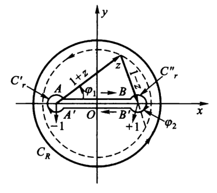
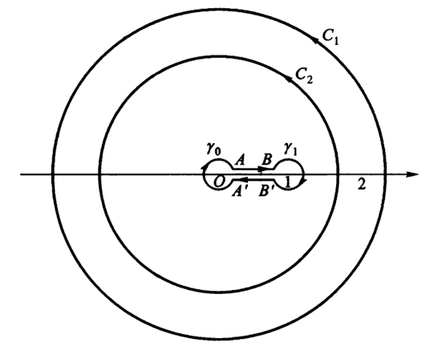

# 复变函数6：留数

## 留数

- **留数**：若 $f$ 以有限点 $a$ 为孤立奇点，$\G$ 是 $a$ 的解析邻域内的周线，则 $\dis\Res_{z=a} f(z) = \frac{1}{2\pi i}\int_\G f(z)dz$ 称为留数
  - **唯一性**：$f$ 在 $a$ 点的留数是唯一的
    - **证明**：
      - 由二连通复周线柯西积分定理，得到内部任意包含 $a$ 的周线积分都相等
  - **系数性**：留数是 $f$ 在点 $a$ 洛朗展式的一阶系数
    - **证明**：
      - $C_{-1} = \Res_{z=a} f(z) = \dis\int_{\G} \frac{f(\z)}{\z-a}d\z$
- **柯西留数定理**：
  - 设 $f$ 在复周线 $C$ 上连续，在围成的区域 $D$ 内，除 $a_1,...,a_k$ 外解析
  - 则 $\dis\int_C f(z)dz = 2\pi i\sum\limits^n_{k = 1}\Res_{z = a_k}f(z)$
  - **证明**：
    - 由复周线积分定理直得结论

### 求留数

- **可去奇点留数定理**：若 $a$ 是可去奇点，则 $\Res_{z=a}f(z) = 0$
  - **证明1**：
    - 由可去奇点的性质，此时可以在 $a$ 处进行解析延拓。再由柯西积分定理 + 单点集上积分值为 $0$，即得结论
  - **证明2**：可去奇点的洛朗展式主要部分为 $0$，所以 $C_{-1} = 0$
- **极点留数定理**：设 $a$ 是 $f$ 的 $n$ 阶极点，则 $\Res_{z=a} f(z) = \cfrac{\p^{(n-1)}(a)}{(n-1)!}$
  - **证明**：
    - 首先写出极点解析表达式：$f(z) = \dfrac{\p(z)}{(z-a)^n}$
    - **洛朗系数法**
      - 此时 $\p(z)$ 是解析函数，且易得 $f$ 的 $C_{-1}$ 对应 $\p(z)$ 的展开式中 $n-1$ 次项的系数 $\dfrac{\p^{(n-1)}(a)}{(n-1)!}$
    - **柯西高阶导公式法**：$$\frac{\p^{(n-1)}(a)}{(n-1)!} = \frac{1}{2\pi i}\int_C\frac{\p(z)}{(z-a)^{n}}dz = \frac{1}{2\pi i}\int_C f(z)dz = \Res_{z=a} f(z)$$
  - **推论**：
    - **一阶极点**：$\Res_{z=a}f(z) = \p(a)$
    - **二阶极点**：$\Res_{z=a}f(z) = \p'(a)$
    - **非分式函数的极点留数**：
      - **极限法**：直接求 $\lim\limits_{z\to a}\lfrac{\p^{(n-1)}(z)}{(n-1)!}$
      - **分式法**：
        - 写出极点解析表达式 $f(z) = \dfrac{\p(z)}{\psi(z)}$，上下两个函数均解析，且 $a$ 为一阶极点，则用上述方法，在极小圆取周线，从而化为导数形式，得到 $\Res_{z=a}f(z) = \dfrac{\p(a)}{\psi'(a)}$
- **本质奇点留数定理**：
  - **求解方法**：直接洛朗展开，求 $C_{-1}$

### 用留数计算积分

- **分式多项式函数**：直接裂项求解即可，不用留数
- **三角函数**：无穷留数
  - $\dis\int_{|z| = n}\tan(\pi z)dz$，已知 $\Res_{z = k+\frac{1}{2}}\tan(\pi z) = -\dfrac{1}{\pi}$，所以原式 $ = 2\pi i(-\frac{2n}{\pi})$

- **分离法（洛朗系数法）**
  - 首先将函数划分为几个部分，分别洛朗展开
  - 因式分解后，将余式 $\l(z)$ 看作整体，再次洛朗展开
  - 不断进行下去，直至出现 $C_{-1}$，即得答案
  - （Laurent/Taylor展式 $\Leftrightarrow$ 积分）
  - **实例**：
    - $\large\int_{|z| = 1}\frac{zsinz}{(1-e^z)^3}dz$：
    - 分子分母同时展开，因式分解得到幂级数分式 $\Large-\frac{1}{z} · \frac{(1-\frac{z^2}{3!}+...)}{(1+\frac{z}{2!}...)^3}$
    - 右式在原孤立奇点 $z=0$ 处解析，**故利用二象性**，可以重新Tylor展开为 $-\frac{1}{z} · (1+...)$
    - 从而 $C_{-1} = -1$，$\Res_{z=a}\frac{zsinz}{(1-e^z)^3} = -2\pi i$
- **极点留数公式法**：$\dis\int_{|z| = 1}\frac{z\sin z}{(1-e^z)^3}dz$：
    - **解**：
      - 易得被积函数只有一个 $1$ 阶极点 $z = 0$，$f(z) \rightarrow \p(z) = zf(z) $
      - 从而 $\Res_{z=a}f(z) = \p(0) = \frac{sinz}{z} · \frac{z^3}{(1-e^z)^3} = -1$

### 无穷远点的留数

- **无穷远点的留数**：若无穷远点是 $f$ 的孤立奇点，则存在 $\dis\Res_{z=\infty}f(z) = \frac{1}{2\pi i}\int_{\G^反}f(z)dz\quad (\G: |z| > r)$
  - **证明**：
    - 逐项积分证明
  - **推论**：反号性：$-C_{-1}$
- **可去奇点无留数定理**：当无穷远点是可去奇点时，其留数可能不为零
  - 此时只能使用洛朗展开求系数的解法
  - **反例**：$f(z) = 2+\dfrac{1}{z}$，无穷远点是可去奇点，但留数为 $2+2\pi i$
- **柯西留数定理**：若 $f$ 在扩充复平面上仅有限个孤立奇点 $a_1,...,a_n,\infty$，则这些点的留数和为 $0$
  - **证明**：
    - 由复周线柯西积分定理易得结论
  - **应用**：若内部孤立奇点较多，则可以直接画一个无穷大圈计算总留数
- **留数换元公式**：若令 $t = \dfrac{1}{z}$，则 $\Res_{z=\infty}f(z) = -\Res_{t=0}\Big[ f(\dfrac{1}{t})\dfrac{1}{t^2} \Big]$
  - **证明**：
    - 显然
  - **应用**：可以应用极点留数定理求解无穷远点的留数

### 习题

- 复变和高代交叉题目：$\frac{z^{2m}}{1+z^m}$ 的孤立奇点留数

## 实积分化为复积分

- 洛朗展式和积分的相互转化非常便利强大，甚至可以应用到实数积分中，为此我们需要掌握一些对实函数扩充到复函数的技巧

### 三角函数

- **三角函数留数定理**：设 $R(\cos \t,\sin \t)$ 表示在 $[0,2\pi]$ 上的有理实函数，则实函数积分 $\dis\int_0^{2\pi} R(\sin\t,\cos\t)d\t$ 可用留数求解
  - **证明**：
    - 令 $z = e^{i\t}$，则由欧拉公式，$\begin{cases} \cos\t = \dfrac{z+z^{-1}}{2} \\\\ \sin\t = \dfrac{z-z^{-1}}{2i}  \end{cases}$，$d\t = \dfrac{dz}{iz}$
    - 此时转化为有理复函数的积分，积分路径为单位圆周 $|z| = 1$

#### 实例

- $\dis\int^{2\pi}_0\frac{d\t}{1 - 2p\cos\t + p^2}$
  - **解**：
    - 可以使用三角函数的万能公式求解
    - 也可以用留数法换元为复变函数，再应用极点留数定理求解
- **韦达定理转化法**：$\dis\int^{2\pi}_0\frac{\sin^2\t}{a+b\cos\t}d\t$
  - **解**：
    - 化为复有理函数积分后，分母是二次函数，可因式分解为 $(x-\a)(x-\b)$
    - 利用韦达定理，可以判断 $|\a|$ 和 $|\b|$ 的值，从而判断极点的位置
    - 用极点留数定理计算即可（可以配凑 $\a\pm\b$、$\dfrac{1}{\a}$ 来简化计算）
- **积分换元法**：$\dis\int^{2\pi}_0 \frac{d\t}{1+\cos^2\t}$
  - **解**：
    - 化为复有理函数积分后，换元 $u = z^2$，即 $u = e^{2i\t}$，此时积分路径变为两个单位圆周，只需将积分变成二倍即可，但积分函数的形式被大大简化了
- **整体配凑法**：$\dis\int^\pi_0 \frac{\cos mx}{5-4\cos x}dx$
  - **解**：
    - 易得被积函数是偶函数，故不妨计算 $[-\pi,\pi]$ 上的积分
      - 只需将计算结果除以 $2$ 即可
    - 再由欧拉公式，不妨计算分子为 $e^{imx}$ 的积分，然后取其实部
      - 因为是实函数积分，所以可以直接取实部
    - 化为复有理函数积分后计算即可

### 反常积分：有理形式

- **有理函数留数定理**：设 $P,Q$ 是多项式函数，则 $\dis\int^{+\infty}_{-\infty}\frac{P(x)}{Q(x)}dx$ 可用留数计算
- **极大圆弧积分引理**：
  - 若
    - $f(z)$ 在圆弧 $S_R: z = Re^{i\t}\pad (\t_1 \leq \t \leq \t_2)$ 上连续
    - $\lim\limits_{R\to +\infty}zf(z) = \l$ 在 $\R$ 上一致成立
  - 则
    - $\dis\lim_{R\to +\infty}\int_{S_R} f(z)dz = i(\t_2-\t_1)\l$
  - **证明**：
    - 易得右式等于 $\dis\l\int_{S_R}\frac{dz}{z}$
    - 直接将两个积分作差，再由极限条件 + 积分上下界不等式可得 $\leq \e\dfrac{R(\t_1-\t_2)}{R} \to 0$，从而相等
  - **理解**：证明方法其实和柯西积分公式、柯西积分定理、柯西高阶导定理相同，都是作差后求极限
  - **本质**：圆周积分的原理是共轭和切线乘积始终为 $i$。将其从圆周推广到圆弧时，同样可得一些结论
- **有理函数留数和定理**：
  - 若
    -  $P(z)$ 是 $m$ 次多项式，$Q(z)$ 是 $n$ 次多项式，且 $n-m \geqslant 2$
    - 在实轴上 $Q(z) \neq 0$
  - 则
    - $\dis\int^{+\infty}_{-\infty}\frac{P(x)}{Q(x)}dx = 2\pi i\sum_{\Im a_k > 0}\Res_{z = a_k}\frac{P(x)}{Q(x)}$
  - **本质**：
    - $\R$ 上有理函数反常积分 = $\C$ 上无穷大半圆积分
  - **理解**：
    - 用上半平面半圆包裹所有的孤立奇点，使得半圆上积分等于全体留数和，再证明圆弧积分为 $0$ 即可
    - 又由于有理函数收敛于0，所以极限值为0（√）
  - **证明**：
    - 首先由p-积分结论得反常积分 $\dis \int^{+\infty}_{-\infty} \frac{P(x)}{Q(x)}dx$ 收敛
    - 取上半平面半圆 $\G_R$ 作为辅助曲线，令半径 $R$ 充分大，使得 $\G_R$ 包含 $\dfrac{P(z)}{Q(z)}$ 的所有孤立奇点
      - 由柯西留数定理，$\G_R$ 上的积分 = 孤立奇点留数和
    - 又由于 $\dis \biggm|z\frac{P(z)}{Q(z)}\biggm| = \biggm|\frac{z^{m+1}}{z^n}\biggm| · \biggm|\frac{c_0 + ... + \frac{c_m}{z^m}}{b_0 + ... + \frac{b_n}{z^n}}\biggm|$
      - 易得当 $z\to\infty$ 时，右式有界，左式 $\to 0$
      - 由极大圆弧积分引理，$\dfrac{P(z)}{Q(z)}$ 在极大圆弧上的积分为 $0$，从而实轴积分值（直径上的积分值）就等于全体留数和（半圆上的积分值）

#### 实例

- **极难积分简化**：$\dis\int^{+\infty}_{0} \frac{dx}{x^4+a^4}$
  - **解1**：
    - 可以用数分的因式分解法进行计算
  - **解2**：
    - 易得被积函数是偶函数，从而可转化为 $\dis\lim_{R\to\infty}\frac{1}{2}\int_{\G_R}\frac{dz}{z^4+a^4}$
      - 容易发现该积分收敛
    - 由代数基本定理，其在复平面上共有 $4$ 个一阶极点
    - 计算易得留数为 $\Res_{z=a_k}f(z) = \large\frac{1}{4z^3}|_{z=a_k} = -\frac{a_k}{4a^4}$，从中取上半平面的极点相加即可
- **幂级数转化法**：$\dis\int^{+\infty}_{-\infty}\frac{x^4}{(2+3x^2)^4}dx$
  - **解**：
    - 易得被积函数在上半平面内只有一个四阶极点
    - 设极点为 $a$，换元 $z = t+a$，则被积函数可以直接因式分解，变为幂级数展式，从而得到留数

### 反常积分：有理指数型

- **有理指数函数留数定理**：设 $P,Q$ 是多项式函数，则 $\dis\int^{+\infty}_{-\infty}\frac{P(x)}{Q(x)}e^{imx}dx$ 可用留数计算
- **若尔当引理（极大圆弧积分引理）**：
  - 若
    - $g$ 在半圆周 $\G+\R$ 上连续
    - $\lim\limits_{R\to +\infty}g(z) = 0$ 在 $\R$ 上一致成立
  - 则
    - $\dis\lim_{r\to +\infty} \int_{\G+\R}g(z)e^{imz}dz = 0 \quad (m>0)$
  - **本质**：$e^{imx}$ 的本质是三角函数，只会对积分起到收敛作用
  - **证明**：
    - 首先换元 $z = Re^{i\t}$，再由绝对值不等式 + 积分上界不等式放缩得原积分 $\leq \dis R\e\int^\pi_{0} e^{-mR\sin\t}d\t$
    - 得到 $\dis|\int^\pi_{\G + R} g(z)e^{imz}dz| \leq R\e\int^{\pi}_{0}e^{-mRsin\t}d\t$，变为实数积分
    - 已知若尔当不等式 $\dfrac{2\t}{\pi} \leq \sin\t$
      - 左式是三角函数图像的割线
      - 故再将上式放缩，此时积分计算结果为 $\dfrac{\pi\e}{m}(1-e^{mR}) < \dfrac{\pi\e}{m}\to 0$（**证毕**）
- **有理指数函数的留数和定理**
  - 设 $P(z), Q(z)$ 是互质多项式
  - 若
    - $Q$ 的次数比 $P$ 高
    - 在实轴上 $Q(z) \neq 0$
    - $m>0$
  - 则
    - $\dis\int^{+\infty}_{-\infty}\frac{P(x)}{Q(x)}e^{imx}dx = 2\pi i\sum_{\Im a_k > 0}\Res_{z = a_k}\Big[ \frac{P(x)}{Q(x)}e^{imx} \Big]$  
  - **证明**：同有理积分，证明圆弧上积分为0即可

### 习题

- **整体配凑法**：$\dis\int^{+\infty}_0 \frac{\cos mx}{1+x^2}dx$
  - **解**：
    - 易得是偶函数，仿照上面方法配凑成自然指数函数即可
- **整体配凑法**：$\dis\int^{+\infty}_{-\infty}\frac{x\cos x}{x^2-2x+10}dx$
  - **解**：
    - 同上，整合 $isinx$ 和 $cosx$，配凑 $e^{iz}$即可

### 无界函数（积分路径上有奇点）

- **极小圆弧积分定理**：
  - 若
    - $f(z)$ 在圆弧 $S_r: z-a = re^{i\t}\pad (\t_1\leq \t\leq \t_2)$ 上连续
    - $\lim\limits_{r\to 0} (z-a)f(z) = \l$ 在 $S_r$ 上一致成立
  - 则 $\dis\int_{S_r}f(z)dz = i(\t_2-\t_1)\l$
  - **证明**：
    - 方法和极大圆弧积分一样
  - **理解**：其实主要看的是极限，如果极限是无穷远，则为极大圆弧积分，如果极限是邻域，则为极小圆弧积分
  - **应用**：可以在奇点邻域内再取一个小扇形，和原本的大扇形构成一个扇形环

### 习题（选择适当的积分路径）

- **狄利克雷积分**：$\dis\int^{+\infty}_0 \frac{\sin x}{x}dx$
  - **解**：
    - **构造辅助函数**：已知其条件收敛，且为偶函数，故将积分区域扩大为 $\R$ 后，将分子配凑为自然指数函数
    - **选择积分区域**：绕过奇点 $z=0$ 取半圆环
      - 总积分为 $0$（柯西积分定理）
      - 外圆周积分为 $0$（极大圆弧积分定理）
      - 内圆周积分为 $i\pi$（计算圆弧积分即可）
      - 从而在 $[-R,-r]\cup[r,R]\pad (r\to 0,R\to +\infty)$ 区域的积分为 $i\pi$
    - **最终结果**：对上述结果取虚部再取 $\dfrac{1}{2}$，即得原积分结果为 $\dfrac{\pi}{2}$
- **菲涅尔积分**：$\dis\int^{+\infty}_0 \cos x^2dx、\int^{+\infty}_0 \sin x^2 dx$
  - **解**：
    - 已知泊松积分 $\dis\int^{+\infty}_0 e^{-t^2}dt = \frac{\sqrt{t}}{2}$
    - **构造辅助函数**：配凑自然指数函数 $f(z) = e^{-z^2}$
    - **选择积分区域**：选择右上平面的扇形积分，由柯西积分定理得 $$\int^R_0 e^{-x^2}dx + \int_{\G}e^{-z^2}dz + \int^0_R e^{-x^2e^{\frac{\pi}{2}i}} e^{\frac{\pi}{4}i}dx = 0$$（角度为 $\frac{\pi}{4}$）
      - 总积分为 $0$
      - 圆弧积分：
        - 仿照前面例子，换元 $z = Re^{i\t}$，再由绝对值不等式 + 积分上下界不等式 + 若尔当不等式，最终可放缩为 $\dfrac{4\pi}{R}(1-e^{-R^2}) \to 0$
      - 剩余的两积分：
        - 易得可配凑为 $\dis\frac{1+i}{\sqrt{2}}\int^{+\infty}_{0}e^{-ix^2}dx$，再换元 $x = iy$，即可转化为泊松积分，计算得 $\dfrac{\sqrt{\pi}}{2}$
    - **最终结果**：取上述结果的实虚部，即得到 $I_1 = I_2 = \dfrac{1}{2}\dfrac{\sqrt{\pi}}{2}$
- **无穷分部积分**：$\dis\int^{+\infty}_0e^{-ax^2}\cos(bx)dx \quad (a>0)$
  - **解**：
    - 若 $b=0$，则退化为泊松积分
    - 若 $b\neq 0$，不妨设 $b>0$
      - **取辅助函数**：
        - 易得 $\cos (bx) = \Re e^{ibx}$
        - 由于 $f(z)$ 是偶函数，故可转化为 $\R$ 上的积分，此时的线性换元不会影响到积分域
        - 换元 $z = x+\frac{b}{2a}i$，对指数进行配方，即可转化为 $$I = \frac{1}{2}e^{-\dfrac{b^2}{4a}}\cdot\Re\dkh{\int^{+\infty + \frac{b}{2a}i}_{-\infty + \frac{b}{2a}i}e^{-az^2}dz} $$
        - 综上，只需计算 $f(z) = e^{-az^2}$ 的相应积分即可
      - **选取积分路径**：选取积分路径为矩形 $[-R,R]\times [0,\dfrac{b}{2a}i]$
        - 总积分为 $0$（柯西积分定理）
        - $I$ 为顶边上的积分（观察易得）
        - 底边上是泊松积分（观察易得），结果为 $\sqrt{\dfrac{\pi}{a}}$
        - 两竖边积分为 $0$（根据积分上下界不等式，简单放缩即可）
      - **最终结果**：$\dfrac{1}{2}e^{-\dfrac{b^2}{4a}}\sqrt{\dfrac{\pi}{a}}$

### 多值函数的积分

- **寻找主值支的方法**：给出arg关系式，然后确定某个点的角度取值 $e^{i\t}$，即可推出所有其它点
  - （上面例题均用的第二种方法）
- **自然对数函数**：$\dis\int^{+\infty}_0 \frac{\ln x}{(1+x^2)^2}dx$
  - **解**：
    - **取辅助函数**：$f(z) = \cfrac{\Ln z}{(z+i)^2(z-i)^2}$
    - **求支点**：$z=0,\infty$ 是支点
    - **取积分路径**：绕开原点的半圆环（此时积分路径不包裹支点，从而不需要求单值分支。但极点被积分路径包裹，所以要用留数定理）
      - 总积分：
        - 此时奇点只有 $z=i$。由极点留数定理可计算 $\Res_{z=i}f(z)$
      - 外圆弧处积分：
        - 由极大圆弧积分引理，放缩为 $0$
      - 内圆弧处积分：
        - 由极小圆弧积分引理，放缩为 $0$
      - 右半段底边积分：
        - 就是题设积分 $I$
      - 左半段底边积分：
        - 换元 $z = xe^{i\pi}$，再取主值支 $\ln z = \ln x + i\pi$
      - 此时左右半段同构，所以比较实虚部即可
- **根式多项式函数**：$\dis\int^1_{-1}\frac{dx}{\sqrt[3]{(1-x)(1+x)^2}}$
  - **解（求主值支）**：
    - **构造辅助函数**：设 $\begin{cases} f(z) = \sqrt[3]{(1-z)(1+z)^2} \\\\ \p_1 = 1-z \\\\ \p_2 = 1+z \end{cases}$，即 $\arg f(z) = \dfrac{\p_1 + 2\p_2}{3}$
      - 易得分式函数的辐角是分母函数的倒数，所以为了简化过程，先讨论分母函数，再在计算积分时取倒数
    - **寻找支点（孤立奇点）**：$z = 1,-1$ 是支点
    - **取支割线**： $[-1,1]$
    - **单值解析分支**：易得有三个单值解析分支 $0/2\pi/4\pi < \arg f(z) < 2\pi/4\pi/6\pi$
    - **积分路径**：取无限逼近实轴的骨头状闭曲线（它可看作端点处存在辐角变化的直线段）
      - 左圆周 $C_r'$，右圆周 $C_r''$，上岸 $AB$，下岸 $A'B'$
    
    - **取主值支**：取上岸中 $\arg f(z) = 0$ 的分支，即上岸 $f(z) = e^{0i}f(x)>0$
    - **求下岸分支**：当该分支顺时针转到下岸时，$\p_1$ 的辐角减小 $2\pi$，$\p_2$ 不变。故 $\arg f(z)$ 转过 $-\dfrac{2}{3}\pi$，从而下岸的分支为 $f(z) = e^{-\dfrac{2\pi}{3}i}f(x)$
  - **解（求积分）**：
    - 骨头上积分为无穷远点留数
      - 构造极大圆周 $C_R$，由复周线积分定理可直得骨头积分值等于 $C_R$ 上的积分值，即只需计算 $\Res_{z=\infty} \dfrac{1}{f(z)}$ 即可
      - **换元法**：设 $z = \dfrac{1}{t}$，此时积分转化为 $-\Res_{t=0}\cfrac{1}{t\sqrt[3]{(t-1)(t+1)^2}}$
        - 由极点留数定理，计算得 $-\cfrac{1}{\sqrt[3]{-1}}$
        - 这是一个多值函数，所以还需要求 $t = 0$（即 $z=+\infty$）时的所处分支
        - **旋转法求分支**：从上岸沿右侧圆弧顺时针旋转到 $z = 1$，再在实轴上延伸到 $+\infty$ 后，$\p_1$ 减小 $\pi$，而 $\p_2$ 不变，因此 $f(z) = f(x)e^{-\dfrac{\pi}{3}i}$
      - 综上，骨头上积分结果为 $-e^{\dfrac{\pi}{3}i}$
    - 两个圆周：
      - 由积分绝对值不等式 + 积分上下界不等式，放缩为 $\dis\int_{|1\pm z|=r} \frac{|dz|}{\sqrt[3]{r}}$，计算积分可得 $\to 0$
    - 上下两岸：
      - 由前面的讨论结果，上岸积分值为 $I$，下岸积分值为 $-e^{\dfrac{2\pi}{3}i}I$
  - **最终结果**：
    - 最后求解方程 $(1-e^{\dfrac{2\pi}{3}i})I = 2\pi i(-e^{\dfrac{\pi}{3}i})$，即得 $I = \dfrac{2\pi}{\sqrt{3}}$
- **反常积分**：$\dis\int^1_0 \frac{dx}{(x-2)\sqrt[5]{x^2(1-x)^3}}$
  - **解（求主值支）**：
    - **取辅助函数**：设 $f(z) = \cfrac{1}{(z-2)\sqrt[5]{z^2(1-z)^3}}$
    - **寻找支点**：$z=0、z=1$ 是支点
    - **取支割线**：$[0,1]$
    - **单值解析分支**：易得有5个单值解析分支
    - **取积分路径**：取与上题类似的骨头状闭曲线
    - **取主值支**：令在 $z=2$ 处取负值的一支为主值支，即 $f(z) = e^{-\pi i}f(x)$
  - **解（求积分）**：
     - 由于在支点外还有一个极点，故复周线还需要多画一个圆
    - 如下图所示，设半径 $R_2\in (1,2)$ 的逆时针圆周为 $C_2$，半径大于 $2$ 的逆时针圆周为 $C_1$
    
    - $C_1$ 上积分
      - 由定义易得 $C_1$ 上的积分即为负的 $2\pi i$ 倍无穷远点留数
      - 容易求得 $f$ 的洛朗展式，发现 $C_{-1} = 0$，故 $\Res_{z=\infty} f(z) = 0$
      - $C_1$ 的作用就是求 $C_2$ 积分
    - $C_2$ 上积分
      - 由复周线积分定理，$C_2$ 上积分就是负的的 $2\pi i$ 倍 $z=2$ 和 $z=\infty$ 的留数和
      - 由选取的主值支，可以直接计算出 $\Res_{z=2} f$
      - 最终计算结果为 $-\sqrt[5]{8}\pi i$
    - 骨头积分
      - 由复周线积分定理，$C_2$ 上积分就是负的骨头上积分
    - 圆周积分
      - 由极小圆弧引理，易得可放缩为 $0$
    - 上下两岸积分
      - 从 $z=1$ 逆时针转到上岸时，$f$ 的辐角减小 $\dfrac{3\pi}{5}$，即上岸积分值为 $-e^{\dfrac{8\pi}{5}i}I$
        - 因为这里的 $f$ 是分式函数，所以逆时针旋转时辐角减小
      - 从 $z=1$ 顺时针转到下岸时，$f$ 的辐角增加 $\dfrac{3\pi}{5}$，即 $f(z) = e^{-\dfrac{2\pi}{5}i}I$
  - **最终结果**：
    - 最后求解方程 $\fkh{ e^{-\dfrac{8\pi}{5}i} - e^{-\dfrac{2\pi}{5}i} }I = -\sqrt[5]{8}\pi i$ 即可

<!-- ### 图形解析（第二题）

  - 
  - 这幅图是第二题的函数的像，以上岸 $argf(z) = 0$ 为主值支（另外两个主值支中，上岸 $argf(z) = 2\pi 和 4\pi$）
    - 通过**原像的旋转角度**和**辐角的映射关系式**，求出x轴和下岸的对应辐角
      - 因为支点的位置特殊，它们的像是直线，辐角不变
      - 此时可以用实数 $x$ 来指代 $z$，同时乘上一个角度常数来表示旋转 -->

## 辐角原理

- $\D Cargf(z)$ $\xLeftrightarrow{欧拉公式+柯西积分}$ 对数留数 $\xLeftrightarrow{柯西积分+幂展开} N-P$
- **符号约定**：
  - 对数留数的被积函数统一写为 $\psi(z) = \cfrac{f'(z)}{f(z)}$
  - 零点总阶数写为 $N$，极点总阶数写为 $P$

### 对数留数

- **函数的对数留数**：设 $C$ 是周线，则 $\dis\frac{1}{2\pi i}\int_C\frac{f'(z)}{f(z)}dz$ 称为函数 $f$ 的对数留数
  - **零点转化定理**：$a$ 是 $f(z)$ 的 $n$ 阶零点 $\red\Rightarrow$ $a$ 是 $\psi(z)$ 的一阶极点，且对数留数为 $n$
    - **证明**：
      - 将 $f$ 的零点解析表达式代入易得 $\psi(z) = \dfrac{n}{z-a} + \dfrac{\p'(z)}{\p(z)}$
      - 由 $\p$ 在 $C$ 内解析且无零点，得 $\dfrac{\p'}{\p}$ 在 $C$ 内也解析。由柯西积分定理，其积分为 $0$
      - 再计算即易得前项积分为 $n$
  - **极点转化定理**：$b$ 是 $f(z)$ 的 $m$ 阶极点 $\Rightarrow b$ 是 $\psi(z)$ 的一阶极点，且对数留数为 $-m$
    - **证明**：
      - 将 $f$ 的极点解析表达式代入易得 $\psi(z) = \dfrac{-m}{z-b} + \dfrac{\p'(z)}{\p(z)}$
      - 方法同上即可
  - **本质**：
    - 一阶极点：展式的导数迭代性
    - 对数留数：柯西积分定理归0性
- **对数留数计算定理**：
  - 设 $C$ 是周线
  - 若 $f(z)$ 在 $C$ 内部亚纯，在 $C$ 上解析且非零，则对数留数为 $N-P$
  - 对数留数 = 零点总阶数 - 极点总阶数
  - **证明**：
    - 由亚纯性得 $f$ 的奇点均为极点，从而都是孤立奇点。再由 $C$ 内部有界，凝聚定理即得 $f$ 的极点个数有限
    - 由解析函数的零点孤立性，同上可得 $f$ 的零点的个数有限
    - 再由对数留数的两个转化定理即得结论

### 应用：用辐角讨论零点分布

- **辐角引理**：$f$ 的对数留数为 $\cfrac{\Delta C\arg f(z)}{2\pi}$
  - **证明**：
    - 由微分的线性可得 $$\int_C \frac{f'(z)}{f(z)} dz = \int_C d\Big( \ln f(z) \Big) = \int_C d\Big(\ln|f(z)|\Big) + i\int_C d\Big( \arg f(z) \Big)$$
    - 由 $\ln |f|$ 的解析性 + 柯西积分定理，右式第一项为 $0$
      - 由于 $\Ln z$ 的多值性，右式第二项不一定为 $0$
    - 容易发现右式第二项可由积分定义直接计算，结果为 $\cfrac{i(\p_1-\p_0)}{2\pi i} = \cfrac{\D C\arg f(z)}{2\pi}$（**证毕**）
  - **理解**：对数函数中虚部是函数的辐角（线性余项），而辐角函数的积分性质非常好
- **辐角原理**：若 $f(z)$ 在周线 $C$ 内部亚纯，$C$ 上解析且非零，则 $N - P = \cfrac{\D C \arg f(z)}{2\pi}$
  - **证明**：
    - 由辐角引理 + 对数留数计算定理直得结论
- **辐角原理（连续版本）**：若 $f(z)$ 在周线 $C$ 中内闭连续，$C$ 上非零，则上式也成立
  - **证明**：
    - 易得可去奇点不影响对数留数计算定理
    - 由 $f$ 连续得有界，从而无极点
    - 而已知本质奇点必定存在某个方向无界，所以也无本质奇点
  - **本质**：亚纯（仅极点无界不解析）和连续（有界但不一定解析）并没有强弱之分，所以是两个平行的定理
- **奈奎斯特定理**：（奈奎斯特稳定性判据）
  - 若 $n$ 次多项式 $P(z)$ 在虚轴上没有零点
  - 则
    - $P$ 的零点全在左半平面上 $\LR$ $\underset{y(-\infty\nearrow +\infty)}{\D \arg}P(iy) = n\pi$
    - 若函数遍历虚轴，则函数值旋转 $\dfrac{n\pi}{2}$
  - **证明**：
    - 取右半平面的极大圆弧 + 虚轴，构成闭半圆周 $\G_R$
    - 易得 $n$ 次多项式 $P(z)$ 可以分解为两个函数的乘积 $\l z^n \dkh{1+\cfrac{\sum\limits_k (z-a_k)^{\a_k}}{\mu z^n}}$，设为 $f$ 和 $g$
      - 由复数乘积的旋转性，$P(z)$ 的辐角等于 $f,g$ 的辐角之和
      - 易得 $\lim\limits_{R\to +\infty} g(z) \to 0$，即在极大圆弧上 $g$ 的辐角无变化
      - 所以角度只取决于 $f$。再由于它是幂函数，故走过半圆弧时，辐角改变 $n\pi$
    - 当零点全在左半平面时，右半平面没有零点。再易得多项式没有极点，故由辐角原理，走过闭半圆周时，辐角无变化。可得圆弧和虚轴角度变化相等，即走过虚轴时，角度变化 $n\pi$（**证毕**）
  - **理解**：多项式的分解性 + 幂函数辐角倍增性
  - **本质**：多项式的好性质在辐角上的体现
- **鲁歇Roche定理**：
  - 设 $C$ 是周线
  - 若
    - $f(z),\p(z)$ 在 $C$ 内解析，$C$ 上连续
    - $|f(z)| > |\p(z)|$
  - 则
    - $f(z)$ 和 $f(z)+\p(z)$ 在 $C$ 的内部有同样多的零点总阶数
  - **证明**：
    - 设 $F(z) = 1 + \dfrac{\p(z)}{f(z)}$，则易得 $f(z)+\p(z) = f(z)F(z)$
      - 为了更好的计算辐角，需要将加法关系转化为乘法关系
    - 由题设易得 $\biggm|\dfrac{\p(z)}{f(z)}\biggm| < 1$，所以 $\Img F$ 位于开圆 $|z-1| < 1$ 中，则任意周线在 $F$ 下的像均不会绕过原点，即 $\D_C \arg F \equiv 0$
    - 再由复数乘积的旋转性，即得题设结论
  - **本质**：模关系得到辐角关系，辐角原理 + 解析性得到零点关系
  - **几何理解**：
    - 原像上的任意周线，其在 $f(z)$ 下的像是外圈，在 $\p(z)$ 下的像是内圈
    - 沿 $C$ 走一圈，$f(z)$ 走过的路和 $\p(z)$ 相同，但转过的角度更小
    - 结合前面的支点大循环和小循环。显然此时 $f$ 是小循环，$\p$ 是总循环。所以 $f$ 的辐角可以全部决定 $f+\p$ 的辐角
- **单叶解析函数没有驻点**：
  - 即没有一阶以上的零点
  - **证明**：
    - 反设存在驻点 $z_0$
    - 取极小邻域 $\G:|z-z_0|<\d$，由无穷可微性 + 零点孤立性，其内部只有一个驻点，即 $f(z)-f(z_0)$ 只有一个高阶零点
    - 构造 $a$ 满足 $0<|-a|<\inf|f(z)-f(z_0)|$
      - 为了让 $F(z) = -a$ 和 $G(z) = f(z)-f(z_0)$ 满足鲁歇定理
      - 因为在 $\G$ 内只有一个驻点，所以 $F(z)+G(z) = f(z)-f(z_0)-a$ 在 $\G$ 内的零点只能为一阶
      - 再由鲁歇定理，零点总阶数相等，只能是 $f$ 在 $\G$ 内存在 $n$ 个一阶零点，但这与单叶性矛盾（**证毕**）
  - **理解**：导数消去常数项，鲁歇定理分离常数项并打通导数和函数的零点关系，零点和常数项有关，从而得到矛盾
  - **本质**：单射当然没有驻点，只不过用鲁歇定理说明一下罢了

### 习题

- $n$ 次多项式中，$t$ 次项系数 $|a_t| > \sum|a_i|$，则其在单位圆内有 $t$ 个零点
  - **证明**：分解成 $f(z) = a_tz^t$ 和 $\p(z) = \sum a_iz^i$，应用鲁歇定理 + 代数基本定理
  - **应用**：分圆多项式中，快速判断单位根
- $|a| > e$ 时，方程 $e^z-az^n =0$ 在单位圆内部有n个根
  - **证明**：根就是零点，分解成两个函数 $e^z和-az^n$，应用鲁歇定理
- **证明代数基本定理**
  - **证明**：取 $f(z) = a_nz^n$，$\p(z)$ 为余项
    - （**有n个零点**）取充分大的R（分步放缩），使得 $|\p(z)|$ 首先放缩成R的幂级数，然后把R都放缩成 $R^{n-1}$，再迭代放缩得到 $< |a_n|R^n = |f(z)|$，满足鲁歇定理条件
      - 这里有一个分步放缩的技巧，即取 $R > max\{\frac{|a_1|+...+|a_n|}{|a_0|},1\}$，可以同时把里面两个数的性质都应用出来
    - 从而多项式和幂函数在R圆内的零点个数相等，为n
    - （**仅有n个零点**）$p(z) \geq |f(z)| - |\p(z)| > 0（在圆外不等号方向相反）$，从而在圆外没有根
- 方程 $z^7-z^3+12 = 0$ 的根都在圆环 $1<|z|<2$ 内
  - **证明**：
    - 首先 $12 > 1+|-1|$，它在单位圆内没有根
    - 然后在 $|z|=2$ 上，$|12-z^3|<|z^7|$，满足鲁歇定理，（**证毕**）
    - （简单应用而已，很容易看出来）
- **Hurwitz定理**：
  - $\{f_n(z)\}$ 是区域D内的解析函数序列，在D内一致收敛于 $f(z)\not\equiv 0$
  - 周线 $C \subset D$，$f(z)$ 在C上无零点，则 $\exist N，\forall n>N，f_n(z)和f(z)$ 在C内有相同的零点
  - **证明**：
    - 首先设 $\mathop{min}\limits_{z\in C}|f(z)| = m$ 
    - 由一致收敛定义，令 $\e = m$，逆用三角不等式得 $f_n(z)$ 和 $f(z)-f_n(z)$ 满足鲁歇定理条件，从而零点数量相等
  - **理解**：余项函数模无穷小，即始终小于 $f_n(z)$，从而是大循环
  - **本质**：零点的一致收敛性传递