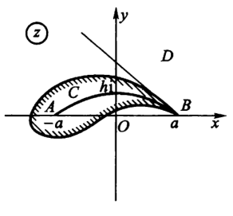
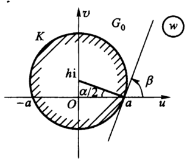
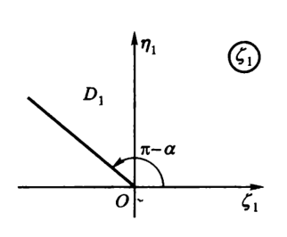

# 复变函数7：共形映射

- **符号约定**：
  - $L(z)$ 表示分式线性变换，$A(z)$ 表示仿射变换，$I(z)$ 表示反演变换

## 解析函数的拓扑性质

### 保域性

- **保域变换**：将单连通区域映射为单连通区域的变换
- **保域定理**：若复变函数 $f(z)$ 在单连通区域 $D$ 内解析且不为常数，则 $f(D)$ 也是单连通区域
  - **证明**：
    - **保内点性**
      - 取 $f(D)$ 内一点 $w_0 = f(z_0)$，只需证明对任意与 $w_0$ 足够近的 $w_*$，方程 $f(z) = w_*$ 在 $D$ 内均有解
        - 即 $f$ 将内点映射成内点
      - 将方程变形为 $\Big( f(z) -w_0 \Big) + (w_0-w_*) = 0$
        - 由零点孤立性，存在 $O(w_0,\d)$ 使得前项不为0，从而由实数稠密性，$\exist\d <  前项$。
        - 再把 $w_*$ 取在 $O(w_0,\e)$ 内，得到 $|前项| < |后项|$（稳定的模大小关系），从而满足鲁歇定理，即 $f(z)-w_*$ 的零点数量等于 $f(z)-w_0$ 的零点数量，显然它的零点就是 $z_0$，故方程有解
    - **保连通性**
      - 在 $D$ 内取折线 $z(t)$，由解析性得 $f\Big( z(t) \Big)$ 是可求长的折线或曲线。如果是曲线，由可求长性也可用折线逼近曲线，所以可以证明单连通
  - **理解**：用鲁歇定理，将 $f(z)$ 连续转为像平面连续
  - **本质**：拓扑中连续函数的保连通性
  - **推论（几个相似的条件）**：
    - 若 $f(z)$ 单叶解析，则是保域变换
      - **证明**：由单叶性得 $f$ 必定不为常数
    - 若 $f(z)$ 在扩充复平面内亚纯，且不恒为常数，则是保域变换
      - **证明**：广义域上的解析函数
- **局部单叶性定理**：若 $f$ 在点 $z_0$ 处解析，且 $f'(z_0)\neq 0$，则必定存在一个单叶解析邻域
  - **证明**：
    - 解析性得到解析邻域，导数不为 $0$ 得到单叶性，再由保域定理即得结论

### 保角性

- **导数夹角定理**：设 $f$ 是解析函数，则对任意曲线 $\G$ 上的任意点 $z$，$f'(z_0)$ 的辐角是 $f(z_0)$ 处切向量与 $z_0$ 处切向量的夹角
  - **证明**：
    - 设 $f$ 是解析函数
    - 设 $z(t)$ 是原象上的光滑路径，切向量为 $z'(t_0)$，切向量倾角为 $\psi = \arg z'(t_0)$
    - 由解析函数无穷可微性，导函数连续可微，故该路径的像是光滑曲线
      - 切向量为 $w'(t_0) = f'(z_0)z'(t_0)$（导数的乘法运算律）
      - 切向量倾角为 $\Psi = \arg f'(z_0) + \arg z'(t_0)$（复数乘积的旋转性）
    - 设 $f'(z_0) = Re^{i\a}$，计算易得 $$\begin{cases} \Psi-\psi = \a & 导数的辐角  \\\\ \dis\lim\limits_{\D z\to 0}|\frac{\D w}{\D z}| = |\frac{f'(z(t_0))z'(t_0)}{z'(t_0)}| \normalsize = R & 导数的模\end{cases}$$
  - **导数的辐角（旋转角）**：变换 $f$ 在任意一条曲线上，任意像点和其原像点的切向量的夹角
    - **旋转角不变性**：若旋转角与曲线方向无关，则称变换具有旋转角不变性
  - **导数的模（伸缩率）**：像和原像中无穷小阶数的比
    - **伸缩率不变性**：若伸缩率与曲线方向无关，则称变换具有伸缩率不变性
- **曲线的夹角**：
  - **有限点**：两曲线在相交点处切向量的夹角
  - **无穷远点**：两曲线函数取倒数后，在原点处切向量的夹角
- **保角点**：若 $f(z)$ 在 $z_0$ 处满足以下条件，则称 $z_0$ 是 $f$ 的保角点
  - 伸缩率不变性
  - 任意两曲线的夹角在映射后大小和方向不变（它不是旋转角不变性）
- **保角变换**：所有点均为保角点的变换
- **解析点保角定理**：解析函数在导数不为 $0$ 的点保角
  - **证明**：由导数夹角定理直得结论
- **单叶保角定理**：函数在单叶解析区域内保角
  - **证明**：易得

### 习题

- **直线族变换**：$\begin{cases}A:Re\ z = C_1 \\ B:Im\ z = C_2\end{cases}$，其中这个 $C_1、C_2$ 是可变常量，而不是常量。所以变换可以直接写成 $u+iv = e^{i(C_1+iC_2)}$，这就已经囊括了复平面上的所有的点

### 共形性

- **共形映射**：单叶且保角的映射
  - **相似性**：像和原像相似
  - **复合传递性**：共形映射的复合是共形映射
    - **证明**：
      - 易得单叶性和解析性在复合后不变，故共形性也不变
  - **反例**：
    - 多值解析函数在单叶解析区域共形，若跨过分支则不共形
- **邻域共形定理**：解析变换在导数不为 $0$ 的点的邻域内共形
  - **证明**：由局部单叶性定理 + 解析点保角定理即可
- **反函数定理**：单叶解析函数的反函数也单叶解析，且满足反函数求导定理
  - **证明**：
    - 已知单叶解析函数无驻点，从而是双射，即存在反函数，且反函数单叶
    - 由隐函数存在定理，实部和虚部的实函数均存在连续反函数。再仿照数分方法处理即可得到反函数导数

## 分式线性变换

- **分式线性变换（莫比乌斯变换）**：$L(z) = \cfrac{az+b}{cz+d}$，且 $\vvec{a & b \\ c & d} \neq 0$（不能退化为常函数）
- **延拓定理**：一般设 $\lim\limits_{z\to\infty} L(z) = \dfrac{a}{c}$，即无穷远点是可去奇点

### 复合性

- **仿射变换**：$A(z) = kz + h = \rho e^{i\a}z + h\pad (k,z,h\in\C)$
  - **几何意义**：
    - 旋转变换、伸缩变换、平移变换的复合（$\a$ 表示旋转、$\rho$ 表示伸缩、$h$ 表示平移）
  - **局限性**：不能改变顶点的顺序（不能翻转图形）
- **反演变换**：$I(z) = \cfrac{1}{z} = \overline{\cfrac{1}{(\overline{z})}}$
  - **几何意义**：
    - 共轭：关于实轴取对称
    - 取倒数后共轭：关于单位圆周取对称
  - **局限性**：只能翻转图形
- **分式线性变换的复合定理**：分式线性变换是仿射变换和反演变换的复合
  - **证明**：显然

### 共形性

- **不动点定理**：若 $L(z) = z$，则 $cz^2 + (d-a)z - b = 0$，即不动点最多只有两个
  - **证明**：
- **分式线性变换的共形定理**：分式线性变换在扩充复平面上共形
  - **引理1**：反演变换在解析点共形
    - **证明**：
      - 单叶性：易得
      - 保角性：
        - 已知反演变换仅在 $z=0,\infty$ 处不解析
        - 已知两条曲线在无穷远点的交角 $\a\LR$ 反演变换下在原点的交角 $\a$
        - 定义 $0$ 和 $\infty$ 关于单位圆周对称
        - 则此时无穷远点也是保角的
  - **引理2**：仿射变换是整函数，且是共形映射
    - **证明**：
      - 整函数：易得
      - 保角性：
        - 若 $z\neq \infty$，易得单叶解析性，从而保角
        - 若 $z=\infty$
          - 设 $\l = \dfrac{1}{z}\to 0，\mu = \dfrac{1}{A(z)}$，则 $\mu = \dfrac{\l}{h\l + k}$，从而 $\dfrac{d\mu}{d\l} \to \dfrac{1}{k}\neq 0$
          - 由解析点保角定理，其保角
      - 单叶性：易得
  - 最后由共形映射的复合传递性即得结论（**证毕**）
- **分式线性变换的几何意义**：在 $L(z) = \cfrac{z-b}{z-d}$ 中
  - 已知

### 保交比性

- **交比**：$\dis(z_1,z_2,z_3,z_4) = \frac{z_4-z_1}{z_4-z_2}:\frac{z_3-z_1}{z_3-z_2}$
  - **几何意义**：
    - 交比是射影几何中少有的不变量
    - 保交比变换能够保持直线和圆上的对称关系，是莫比乌斯变换的核心特征
- **分式线性变换的保交比性**：对任意四点，像与原象的交比相同
  - **证明**：直接算
- **三点确定定理**：若已知三个点的分式变换的原像和像，则可以唯一确定分式线性变换
  - **证明**：
    - 用保交比性直接算
    - 设 $\dis w_i = \frac{az_i + b}{cz_i + d}$
      - 则 $\dis w_i-w_j = \frac{(ad-bc)(z_i-z_j)}{(cz_i+d)(cz_j+d)}$
    - 交比为 $\dis (w_1,w_2,w_3,w_4) = \frac{w_4-w_1}{w_4-w_2}:\frac{w_3-w_1}{w_3-w_2}$
      - 约分得 $\dis \frac{z_4-z_1}{z_4-z_2}:\frac{z_3-z_1}{z_3-z_2} = (z_1,z_2,z_3,z_4)$

### 保圆周性

- **复平面圆周的标准表达式**：$Az\bar{z} + \bar{\b}z + \b\bar{z} + C = 0\quad (|\b|^2 > AC)$
  - **退化性**：若 $A=0$，则退化为直线
- **保圆周性**：分式线性变换将圆周映射成圆周
  - **证明**：
    - 易得仿射变换不改变圆周和直线的表达式
    - 易得反演变换仅把 $A$ 和 $C$、$\ol z$ 和 $z$ 的位置改变，总体表达式依然是圆周和直线
    - 综上即得结论
- **确定圆周的像的内部和外部是否颠倒**：
  - **取点法**：在圆周内部取一点，观察它的像的位置
  - **取方向法**：沿圆周取有向路径，观察圆周内部在正方向的左边还是右边（变换到像平面后，这个相对方位是不会变的）
- **保圆周存在定理**：对任意两个圆周 $\G_1,\G_2$，存在一个共形映射使得 $f(\G_1) = \G_2$
  - **证明**：
    - 由三点唯一确定一个圆周 + 三点唯一确定一个分式线性变换 + 分式线性变换的共形性即得结论

### 保对称点性

- **圆周对称**：若 $z_1,z_2$ 所处直线经过圆心 $a$，且 $|z_1-a||z_2-a| = R^2$，则称 $z_1,z_2$ 关于圆周对称
  - 此时 $\cfrac{|z_1-a|}{R} = \cfrac{R}{|z_2-a|}$，即可构建一个相似直角三角形
  - **扩充性**：设 $a$ 是圆周 $\odot\g$ 的圆心，则我们认为 $a$ 和 $\infty$ 关于 $\odot\g$ 对称
    - 无法证明，只是为了统一叙述所作的规定
  - **退化性**：当圆周退化为直线时，圆周对称退化为轴对称
    - 无法证明，只是为了统一叙述所作的规定
  - **几何意义**：两点关于 $\odot\g$ 对称 $\LR$ 通过两点的任意圆周与 $\odot\g$ 正交（交点切线过圆心）
    - **证明**：见下图，利用相似三角形即可得到正交性
    
- **保对称点性**：分式线性变换下，“两个圆周对称点的像” 关于 “圆周的像” 对称
  - **证明**：
    - 由分式线性变换的保角性易得结论

### 求分式线性变换

- **上半平面 $\to$ 上半平面**：系数行列式 > $0$ 的分式线性变换
  - **证明（分类讨论法）**：
    - **实轴**：易得分式线性变换把实轴变成实轴
    - **象限**：由分式连续性，象限内的点依然在象限中
    - **方向**：易得导数 $\dis\frac{dw}{dz} = \frac{\small\begin{vmatrix} a & b \\ c & d \end{vmatrix}}{(cz+d)^2} > 0$，实轴的像和实轴同向，故平面位置相同
    - 综上即得结论
  - **证明（算式分析法）**：
    - $\Im w = \cfrac{w-\ol w}{2i} = \cfrac{\frac{az+b}{cz+d} - \frac{a\ol z+b}{c\ol z+d}}{2i} = \cfrac{1}{2i}\cdot\cfrac{ad-bc}{|cz+d|^2}(z-\ol z) = \cfrac{\vvec{a & b \\ c & d}}{|cz+d|^2}\Im z$
    - 即当行列式> $0$ 时，像和原象的虚部同号，从而位于相同的半平面中
  - **推论（保半平面性）**：分式线性变换要么保半平面（$det>0$），要么反半平面（$det<0$）
  - **推论（给定方向的求法）**：若添加条件 $L(i) = 1+i，L(0) = 0$，只需代入两个点求分式线性变换的系数即可
- **上半平面 $\to$ 单位圆**：$w = e^{i\b}\lfrac{z-a}{z-\bar{a}}，(\b\in\C)$
  - **证明**：
    - **形状**：已知上半平面是一个圆，故由保圆周存在定理，必定是一个分式线性变换
    - **原点**：设原点的原象是 $a$，则由保对称点性，其关于实轴的对称点 $\bar{a}$ 的像为 $\infty$
    - **待定系数法**：设 $w = k\lfrac{z-a}{z-\bar{a}}$
      - 其像为某个圆
      - 直径的原像是以过 $a、\bar{a}$ 的圆周在上半平面的半圆弧
      - 取实轴上一点代入，发现 $|k|=1$，故设 $k = e^{i\b}$ 即可
  - **推论**：$\b$ 依赖于该映射的旋转角
    - **求解**：
      - 代入法求解：代入某点的像与原象后解方程即可得到 $\b$
      - 旋转角法求解：$\arg w'(a) = \b - \frac{\pi}{2}$ （?）
  - **推论**：如果改为映射到单位圆外部，将分式取倒数即可
- **单位圆 $\to$ 单位圆**：$w = e^{i\b}\lfrac{z-a}{1-a\bar{z}}$
  - **解**：
    - **形状**：由保圆周存在定理，必定是一个分式线性变换
    - **代入法**：讨论特殊点（无穷远点和零点），得只能是 $w = k\cfrac{z-a}{z-\frac{1}{(\bar{a})}}$
    - **待定系数**：旋转角法求解：$\arg w'(a) = \b$
    - 直径的原像是（过 $a、\frac{1}{(\bar{a})}$ 的圆周在单位圆内的圆弧）
- **复合映射**：求将上半平面 $\to |w-w_0| < R$ 的分式线性变换
  - **解**：
    - 已知存在上半平面 $\to$ 单位圆的映射 $f(z) = \xi$
    - 易得此时 $\xi = \dfrac{w-w_0}{R}$，再将 $w\circ\xi^{-1}$ 复合即可
- 总结：解析表达式 $w = k\cfrac{z-a}{z-b}$
  - 分式线性变换的奇点：无穷远点的原像
  - 分式线性变换的零点：零点的原像
  - 分式线性变换的系数：伸缩率
  - 它们可以完全确定分式线性变换

## 初等共形映射

### 初等解析函数

- **幂函数是共形映射**：
  - **证明**：
    - **保角域**：$\ol\Complex \j \{0,\infty\}$
    - **共形域**：单叶解析区域（角形区域）
    - **几何意义**：将大角形映射成小角形
- **自然指数函数是共形映射**
  - **证明**：
    - **保角域**：$\C$（导数恒不为 $0$）
    - **共形域**：带状区域（单叶区域）
    - **几何意义**：带状区域 $\to$ 角形区域
      - 竖线的像是圆（$x$ 恒定，即模恒定。取遍所有 $y$，即取遍所有辐角）
      - 横线的像是角形边（取遍所有 $x$，即取遍所有模。$y$ 恒定，则辐角恒定）
  <!-- - **证明（$a^z$）**：需要分类讨论，不够初等，不再讨论范围 -->
- **三角函数是共形映射**：
  - **证明（$\sin z$）**：
    - **保角域**：$\C\j\{z = (2k+1)\pi\}$（导数不为 $0$ 的区域）
    - **共形域**：（单叶区域）
    - **几何意义**：区域 $\to$ 区域

### 初等多值函数

- **根式函数是共形映射**：
  - **证明**：
    - **保角域**：$\C$（其为整函数，且导数恒不为0）
    - **共形域**：$\C$（其为多值函数，总单叶）
    - **几何意义**：将小角形映射成大角形
- **对数函数是共形映射**
  - $Ln\ z$：角形区域 $\to$ 带状区域

### 分步法求共形映射

- **分步复合法**：求将（具有割线段 $\begin{cases} \Re z = a \\ 0\leq \Im z \leq h \end{cases}$ 的上半平面）映射为（上半平面）的共形映射，且满足 $a+ih\mapsto a$
  - 根据几何意义，逐步选取已知的共形映射，最终组合成所需的共形映射
  - **解**：
    - 割线段平移到虚轴上（平移变换）： $z_1 = z-a$
      - （$z_1$ 指第一次变换的像，只是一个中间变量）
    - 将上半平面扩大为全平面（角形扩大）：$z_2 = z_1^2$
      - 第一象限 $\to$ 上半平面，第二象限 $\to$ 下半平面
      - 实轴 $\to$ 右半实轴，虚轴 $\to$ 左半实轴
      - 即虚轴上割线段旋转到左实轴上
    - 割线平移到右半实轴上（平移变换）：$z_3 = z_2 + h^2$
      - 因为割线长度也被平方变换扩大，所以平移距离是 $h^2$
    - 带割线的全平面，缩小成上半平面（角形缩小）：$z_4 = \sqrt{z_3}$
      - 此时割线可以保留在右半实轴上，也可以旋转到左半实轴，不影响结果
    - 最后调整位置（平移变换）：$w = z_4+a$
      - 只是为了满足题设 $a+ih\mapsto a$ 的要求
    - 综上，$w = \sqrt{(z-a)^2+h^2}+a$
  - **本质**：将割线作为参照物，应用共形映射的复合传递性
- **分式线性变换调整法**：求将角形区域 $\{\arg z\in (-\dfrac{\pi}{4},\dfrac{\pi}{2})\}$ 映射为上半平面的共形映射，满足 $\begin{cases} 1-i\mapsto 2 \\ i\mapsto -1 \\ 0 \mapsto 0 \end{cases}$
  - **证明**：
    - 将角形区域变为标准角形（旋转）：$z_1 = e^{\dfrac{\pi i}{4}}\cdot z$
    - 将标准角形扩充成上半平面（角形扩大）：$z_2 = \sqrt[3]{z_1^4}$
    - 再用三点确定定理，根据已知三点求分式线性变换
    - 最终复合到一起即可

### 圆弧角形变换

- **圆弧角形**：角边为圆弧的角形（形状类似阴阳鱼）
  - 交角为 $\dfrac{\pi}{n}$ 的两个圆弧构成的有限区域（月牙） $\to$ 上半平面
    - **解**：
      - 首先把圆弧映射成直线（分式线性变换）
        - 因为是保圆周变换，所以应该取分式线性变换
      - 然后把角形映射成平面（幂函数）
      - 综上，$w = \dkh{k\cfrac{z-a}{z-b}}^n$
  - 上半单位圆 $\to$ 上半平面
    - **解**：
      - 上半单位圆其实就是两个圆弧围成的有限区域
      - 变为第一象限：$z_1 = k\cfrac{z+1}{z-1}$
        - 本质是将上半单位圆变成了半径无穷大的 $\dfrac{1}{4}$ 圆，所以是保圆周变换，即分式线性变换
      - 变为上半平面：$z_2 = (-z_1)^2$
      - 最终复合在一起即可
  - 相切于 $a$ 点的两个圆周围成的月牙区域 $\to$ 上半平面
    - **解**：
      - 将两圆周变为平行直线：$z_1 = \cfrac{cz+d}{z-a}$
        - 此时 $a$ 被映射为无穷远点，从而像必定是半径无穷大的圆（即直线），所以一个变换能同时扳直两个圆周
        - 此时月牙变为带状区域 $0 < \Im z_1 < \pi$
      - 变为上半平面：$z_2 = e^z_1$
      - 最终复合在一起即可

### 机翼剖面变换

- **机翼剖面区域**：在实际应用中，机翼剖面可以看成圆弧角形（阴阳鱼）
- **机翼剖面变换**：求圆弧角形 $\to$ 圆的变换，且下图中 $A,B$ 是不动点
  
  - **求解（分步法）**：
    - **设坐标系**：在圆弧角形内部取圆弧 $AB$，设坐标系使 $AB$ 关于 $y$ 轴对称，且两端落在 $x$ 轴上
    - **设点**：设 $A = (-a,0)，B = (a,0)$，$AB$ 和 $y$ 轴的交点为 $H = (0,hi)$
    - **被弧AB割开的上半平面** $D_0 \to$ **割线平面** $D_1$
    
      - 将圆弧 $AB$ 变为直线（分式线性变换）：$z_1 = e^{i\b}\cfrac{az+b}{cz+d}$
        - 令 $A\mapsto 0，B\mapsto \infty$，代入可求得分式为 $\cfrac{z-a}{z+a}$
        - 可用两种方法求 $\b$
          - **代入法**：
            - 已知 $(0,hi)$ 的像的辐角为 $\pi-\a$
            - 代入得 $w = -\cfrac{(a-hi)^2}{a^2+h^2} = -1+\cfrac{2ahi}{a^2+h^2} = R\cos(\pi-\a)+ iR\sin(\pi-\a)$
            - 比较最后等式的实虚部发现 $\pi-\a = \arctan\dkh{-\cfrac{2ah}{a^2+h^2}}$
          - **导数法**：$w' = \frac{1}{2a}$，$argf'(a) = 0$，因此a点处的切线角度不变，而其角度为 $\pi-\a$，因此像的角度可以得出
    - **圆外部** $ G_0 \to$ **一般半平面** $G_1$
      - 圆周外区域 $G_0:|z-hi| > |AH|$
      - 一般半平面 $G_1: \arg w_1\in (\b-\pi,\b)$，其中 $\b = \dfrac{\pi}{2}-\dfrac{\a}{2}$
    
      - **三点代入法**：容易求出 $z_2 = \cfrac{w-a}{w+a}$
    - **一般半平面** $ G_1 \to$ **割线平面** $D_1$
      - **几何意义法**：容易求出 $z_3 = z_2^2$
        - 显然是角形扩大，故应当取幂函数
        - 再求辐角，因为 $2\b = \pi - \a$，故直接取平方即可，不需要旋转变换
    - **取复合**：综上可得 $D_0 \xto{\large z_1} D_1 \xto{\large z_3^{-1}} G_1 \xto{\large z_2^{-1}} G_0$
      - **复合结果**：$w = z+\sqrt{z^2-a^2}$（解方程 $\dkh{\cfrac{w-a}{w+a}}^2 = \cfrac{z-a}{z+a}$ 即可）
    <!-- - **理解**：上述三个映射，以及 $D_0\to G_0$ 的映射 $w$，构成一个映射圈。只要寻找一个比较好计算的节点即可 -->
  - **推论**：机翼剖面函数的像是与单位圆相切于 $B$ 的圆 $K'$
    - **证明**：
      - 像平面上和单位圆K相切的圆K'，其原像和圆弧 $AB$ 在a点也相切
      - 再由上述共形映射的几何性质，圆 $K'$ 就是圆弧角形（机翼剖面）的像
- **机翼参数**：
  - 厚度：$d = |BH| = |w_0-hi|$
    - $K'$ 的圆心 $w_0$ 到 $H$ 的距离
  - 宽度：$a$
  - 高度：$h$

#### 茹科夫斯基函数

- **茹科夫斯基函数**：$R(z) = \dfrac{1}{2}(z + \dfrac{a^2}{z})$
  - 它是机翼剖面函数 $w = z+\sqrt{z^2-a^2}（D_0\to G_0）$ 的反函数，将单位圆映射成机翼剖面
- **单叶性区域**：圆的外部和内部
  - **证明**：
    - **标准形式**：
      - 因为 $a$ 对单叶性没有影响，不妨设 $a=1$
      - 此时 $R(z)$ 把（圆外部）映射到（割线平面） $\begin{cases} \Re z \in [-1,1] \\ \Im z = 0 \end{cases}$
    - **反演复合**：
      - 设 $\eta = \dfrac{1}{z}$，再由 $R(z)$ 反演变换下还是 $R(z)$，得（单位圆内部）也映射到（割线平面）
    - 综上，$z = 0、z=\infty$ 都是 $R(z)$ 的一阶极点，其余部分解析。故可以分出两个单值解析分支

## 共形映射的同构

### 存在和唯一性定理

- **黎曼存在与唯一性定理**：
  - 设 $D$ 是扩充复平面上的单连通区域
  - **存在性条件**：
    - 若 $D$ 的边界不止一点
    - 则有一个 $D$ 内的共形映射 $f$ 满足 $D\to C:|w|<1$（单位开圆）
  - **唯一性条件**：
    - 若 $f(a) = 0$，$f'(a)$ 是正实数
    - 则该共形映射唯一（**导数是实数**）
- **推论**：
  - **几何意义**：$a$ 被映射为单位圆的圆心，$a$ 点切向量的旋转角为 $0$
    - 此时导数为实数，故其虚部为 $0$，从而无旋转角
  - **唯一性条件的一般形式**：$f(a)=b，f'(a)=\a$ 都是正实数
    - 此时 $D，C$ 都是一般的单连通区域，且 $a\in D，b\in C$
  - **唯一性条件的有界区域形式**：$f(a)=b，f'(\xi)=\eta$
    - 此时 $D，C$ 都是边界为周线的区域，$\xi，\eta$ 分别是两区域的边界点
  - **唯一性条件的三点形式**：$f(\xi_i) = \eta_i，(i=1,2,3)$
    - 此时 $D,C$ 都是边界为周线的区域，$\xi_i,\eta_i$ 均为两区域上绕行方向一致的边界点
- **证明（存在性）**：略
- **证明（唯一性）**：
  - 反设不唯一，存在 $w_1 = f_1(z)$ 也把 $D$ 映射成单位圆 $C$
  - 因为 $f_1(z)\neq f(z)$，所以存在置换映射 $w_1 = \varPhi(w)$
    - $\varPhi = f_1\circ f^{-1}$，由复合传递性，其单叶解析
    - 由 $f、f_1$ 的题设性质得 $\varPhi(0)=0，\varPhi'(0) = \cfrac{f_1'(a)}{f'(a)}$ 是正实数
  - 由像是单位圆，得 $|w|,|w_1| < 1$，正反函数均满足Schwarz引理（压缩映射性）
    - $|\varPhi(w)| = |w_1| |w|$，$\varPhi^{-1}(w_1) = |w| |w_1|$
    - 即模相等，从而 $\varPhi(w) = e^{i\a}w$
  - 再由 $\varPhi'(0)$ 是正实数，得 $e^{i\a} = 1$
  - 从而 $\varPhi(w) = w$，即 $f_1(z) = f(z)$（**证毕**）
- **理解**：
  - 单位开圆的置换映射，其正反映射均是压缩映射，从而不等号互包得模相等，是旋转变换
  - 导数是正实数，则旋转角度为0，从而置换是恒等置换，从而唯一
  - 在推论中，可以再复合一个单位圆共形映射，化为单位圆情况。
- **弱刘维尔定理**：$\C$ 上的解析函数 $f(z)$，若其像不取某条简单弧 $\g$ 上的值，则为常函数
  - **证明**：
    - 首先设 $m = \p(w)$，定义域是 $\Complex - \g$（非整个z平面，不是整函数）
      - 由黎曼存在定理，函数存在且共形（单叶解析），不是常数
      - 它的像是单位开圆，有界
    - $\p$ 的定义域和 $f$ 的值域相等，从而可设 $w = f(z)$，则 $m = \p(f(z))$，此时变为有界整函数
      - 由刘维尔定理，其为常函数。但是 $\p$ 单叶，所以只能是 $f$ 为常函数
  - **理解**：有界非整函数 $\p$ 复合后更换定义域，从而变为整函数
    - 但仍保持单叶性不变，从而常数性转移到另一个函数上
  - **本质**：

### 边界对应定理

- **边界对应定理**：
  - 若
    - 有界单连通区域D、G，周线分别为 $C、\Gamma$
    - 存在共形映射 $w=f(z):D\to G$。
  - 则：
    -  $f(z)$ 可以连续延拓成 $F(z)$，使D内 $F(z) = f(z)$
       - 其在D的闭包上连续
       - 其在周线 $C$ 上是单值连续双射
  - **证明**：略
  - **本质**：共形导出的连续延拓性
- **边界对应逆定理**：
  - 若：
    - $f(z)$ 在D内解析，在C上连续
    - 周线上是单值双射
  - 则：
    - $f(z)$ 在D内单叶，从而把D共形映射成G
  - **证明**：只需单叶性即可
    - **原像平面**
      - 设 $w_0\in G$
        - 由辐角原理，$C$ 内 $f(z)-w_0$ 的零点数量等于其沿周线一圈的辐角
          - $N(f(z)-w_0,C) = \cfrac{1}{2\pi}\D_\Gamma\arg(w-w_0)$
        - 再因为是边界，所以旋转角为 $\pm2\pi$，从而 $f(z)-w_0$ 在D内只有一个根
      - 设 $w_0\notin G$，则辐角原理得到D内无根
    - **像平面**
      - 设 $w_1\in \Gamma$，反设在D内有根，则有 $f(z_1) = w_1$
        - 因为D是区域，所以 $z_1$ 是内点。由保域定理，$w_1$ 也是内点，和周线矛盾
        - 所以必须在D内无根，即周线映射到周线
      - 综上，$f$ 在 $D$ 内单叶
  - **理解**：
  - **本质**：彰显了解析和单叶的关系，是很有意义的定理

### 习题

- $w = z^2$，表示成极坐标：$w = \rho e^{i\p} = r^2e^{2i\theta}$。则圆周 $r=cos\theta$ 的像变成心脏线 $\rho = cos^2\frac{\p}{2} = \frac{1}{2}(1+cos\p)$