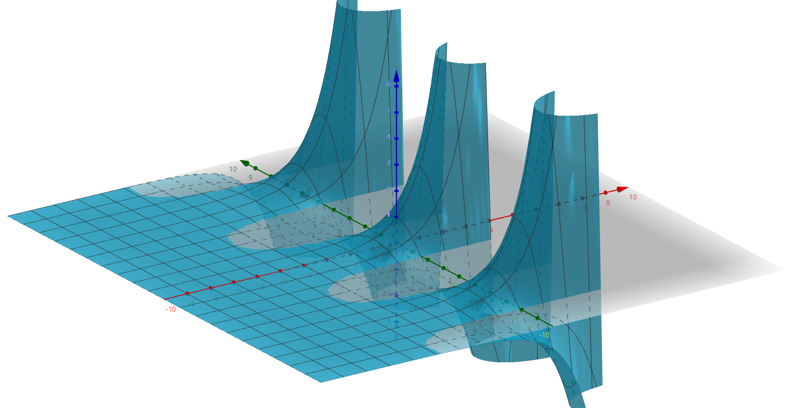

**A乘积范数**# 复变函数2：解析函数

## 导数和微分

- **处处连续但处处不可微的函数**：
  - $f(z) = \bar{z}$
    - 最后 $\triangle x$ 和 $\triangle y$分子分母阶数相同，则各方向极限值不一致，极限不存在
  - $f(z) = Re\ z或 Im\ z$
    - 同上
  - $f(z) = |z|$
    - $\triangle z$ 的方向不同时极限值也不同，极限不存在
- **复变函数可微的条件**：各个方向的导数相同
  - **理解**：因为复数是一个整体，是向量，但向量各个部分可以相加、同时运算

### 习题

- 证明复变连续函数导数不为零的点有切线
  - 法一：$x(t)$、$y(t)$ 参数函数求导
  - 法二：
    - 首先证明极小邻域内无重点，是简单曲线，存在割线
    - 然后证明割线极限是切线

### 解析函数/全纯函数/正则函数

- **解析函数**：若函数 $f(z)$ 在区域D中可微，则称其为D中的解析函数（$f(z)$ 在D内解析）
  - **开集性**：解析必须定义在开集上，从而解析点必须存在可微邻域，因而比可微严格
- **孤立奇点**：函数在该点上不解析，但是在该点任意邻域内总有解析点
  - 分类：
    - **定义域类型奇点**：$w = \frac{1}{z}$ 的 $(0,0)$
- **导数的四则运算法则、复合函数求导法则**：跟复数没关系，就是原来的添项凑项

### 习题

- **L'Hospital法则**：$f(z)$ 和 $g(z)$ 在 $z_0$解析，且$f(z)=g(z)=0，g'(z_0)\neq 0$，则 $\lim\limits_{z\to z_0}\frac{f(z)}{g(z)} = \frac{f'(z_0)}{g'(z_0)}$
  - **理解**：
    - 首先它在极限点有定义且可导，所以条件是比实函数要强的，直接构造就完事了，甚至不用L中值的极限形式
    - 另外，复变函数定义域和值域都有无穷个方向，所以本来也没有中值定理，只能把条件加强
- **定义域内任何点均不解析的函数**（常数问题——方向问题）
  - $|z|$：分子是常数，分母是复数，方向问题极限不存在
  - $x+y$：
  - $Re\ z和Im\ z$：常数会导致方向问题
  - $\bar{z}和\frac{1}{\bar{z}}$：上下同乘一个 $\triangle z$ 就变成了常数问题

### 柯西-黎曼方程

- **代数形式**：$\lim\limits_{\substack{\triangle x\to 0 \\ \triangle y\to 0}} f'(z) = \frac{\triangle u+i\triangle v}{\triangle x+ i\triangle y}$
  - **推导**：
    - 首先考虑平行于实轴趋于 $z_0$ 的方向导数，即求 $x$ 的偏导数
    - 然后设平行虚轴趋于 $z_0$ 的方向导数，即求 $y$ 的偏导数。
    - 由复变函数可微定义，各方向导数相同，得到偏微分方程组：$\begin{cases}
      \frac{\partial u}{\partial x} = \frac{\partial v}{\partial y} \\
      \frac{\partial u}{\partial y} = -\frac{\partial v}{\partial x}
    \end{cases}$
    - 该方程组称为**C.-R.方程**
- **复变函数的导数**：$f'(z) = \frac{\partial u}{\partial x} + i\frac{\partial v}{\partial x}$ （沿实轴求导的结果。还有其它3种等价形式）
- **同向量值函数的区别**
  - 向量值函数的导数是Jacobi矩阵。$\large\begin{pmatrix} u' \\ v' \end{pmatrix} = 
  \begin{pmatrix}
    \frac{\partial u}{\partial x} & \frac{\partial u}{\partial y} \\ 
    \frac{\partial v}{\partial x} & \frac{\partial v}{\partial y}
  \end{pmatrix}_{2×2}$
  - 首先，复变函数的实部和虚部可以相互影响，所以它的求导定义式和向量值函数就不一样。
  - 其次，复变函数可微比向量值函数多了一个条件：各个方向导数相等。所以它的导数求法可以有奇技淫巧
  - 综上，复变函数的导数和向量值函数没啥关系。
- **对称性**：两复数的乘积中，实部和虚部的多项式存在一定的对称性。这一点在C.-R.方程的偏导数中也有体现

### 可微条件

- **必要条件**：四个偏导数存在且满足C.-R.方程
  - **反例**：
    - 偏导数存在，但u和v不可微：偏导数为0
      - 此时不同方向上导数值不相等
    - 满足C.-R.方程，但是不可微：$f(z) = \sqrt{|xy|}$
      - 在 $z=0$ 处，偏导数均为0
      - 求导结果 $\frac{\sqrt{k}}{1+ki}$ 受方向影响
- **充要条件**：两个函数可微（**复数的独立性和相加性**本身就契合**全微分的独立和相加形式**）且满足C.-R.方程（**对称性，用于把独立性和相加性组装起来。它是可微的核心**）
  - **必要性**：$f(\triangle z) = f'(z)\triangle z + \eta\triangle z$
    - **全微分线性**：$f(\triangle z) = \triangle u + i\triangle v$
    - **实数对形式**：$\triangle z = \triangle x + i\triangle y$
    - 设 $f'(z) = \alpha + i\beta$
    - 代入后发现其符合互相对称的全微分形式，因此可得偏导数就是 $\alpha$ 和 $\beta$，则满足C.-R.方程
  - **充分性**：
    - 由C.-R.方程逆推导即可
    - 利用 $\eta_1、\eta_2\to 0$ 证明新余项 $\eta$ 也是高阶无穷小，从而可微
  - **理解**：必要性很显然，但充分性不显然。为什么两个方向就可以决定所有方向？
    - 其实和全微分类似，两个线性无关方向的线性组合可以导出所有方向。而可微依赖于余项极小，余项在有限系数线性组合后依然极小，从而两个方向的可微性传递到所有方向上
- **充分条件**：偏导数均连续
 

- **极坐标的C.-R.方程的充要条件**：$\begin{cases}
    \frac{\partial u}{\partial r} = \frac{1}{r}\frac{\partial v}{\partial \theta} \\ \frac{\partial v}{\partial r} = -\frac{1}{r}\frac{\partial u}{\partial \theta}
\end{cases}$ $\Leftrightarrow$ $f$ 可微且 $f'(z) = (cos\theta-isin\theta)(u_r+iv_r)$
  1. 方法一：直接代换
     - 发现极坐标C.-R.就是$\begin{cases} x = rcos\theta \\ y = rsin\theta \end{cases}$的复合偏导数
     - 而且导数也是复合形式
     - 所以可以直接把 $r$ 和 $\theta$ 当作x和y的复合函数，然后直接复合求导即可从代数形式推导到极坐标形式
  2. 方法二：同理推导（？未完）
     - 看题设中的 $f'(z)$ 形式就知道，$x\to u$ 且 $y\to v$。则有 $\triangle f = \triangle u + i\triangle v = \triangle u(cosv)$

### 共轭形式的复函数

- **复数的向量全微分**：$dz = dx + idy$
  - 由共轭性，$dx = \frac{dz+d\bar{z}}{2}$，$dy = \frac{dz-d\bar{z}}{2i}$
   
  - 从而得到等式 $df = \frac{\partial f}{\partial x}dx + i\frac{\partial f}{\partial y}dy = \frac{1}{2}(\frac{\partial f}{\partial x} - i\frac{\partial f}{\partial y})dz + \frac{1}{2}(\frac{\partial f}{\partial x} + i\frac{\partial f}{\partial y})d\bar{z}$
   
- **C.-R.方程的 $z$ 表达**：$f(z)$ 解析 $\Leftrightarrow \frac{\partial f}{\partial\bar{z}} = 0$
  - **推论**：若 $f(z)$ 解析，则导数必须与 $d\bar{z}$ 无关
  - **理解**：一个方向上的导数，不可能将另一个方向作为自变量
  - $\triangle f = 4·\frac{\partial^2 f(z)}{\partial z\partial\bar{z}}$

### 习题

1. **讨论可微性、解析性**：可微性写出C.-R.条件成立的点集，解析性看可微点是否是邻域
   - 拆解法：C.-R.方程
   - 定义法
2. **曲线正交性**：$f(z) = u(x,y) + iv(x,y)$，则有$\begin{cases}
    u(x,y) = c_1 \\ v(x,y) = c_2
\end{cases}$（隐函数形式曲线）。两曲线在交点$(x,y)$处正交（隐函数求导得斜率+C.-R.条件）
3. **常函数判定**
   - 先插一句：刘维尔定理和零点孤立性定理
   - 普通的判定方法（C.R.方程）（不解析函数突然解析，只能是常函数）：
     - **导数恒为0**：分解后中值定理，或用C.R.方程发现为常函数（本质都是分解）
       - 理解：导数的变化率意义，以及方向的严格性
     - $\overline{f(z)}$在D内解析：两个函数均解析，C.R.方程可得常函数（分解）
       - 理解：类似于不解析函数的方向问题，这里共轭解析只能是常函数
     - **$|f(z)|$ 为常数**：
       - 法一：
       - 法二：还是分解
       - 理解：除非u和v保持平方和相等关系而分别变化，但这样的话一方就是另一方的函数，从而不能满足在各个方向上导数均相等的严苛条件
     - **$Re\ f(z)$ 为常数**：同理，分解
       - 理解：各个方向上导数必须全部相同，但x方向上导数为0

## 初等解析函数

- **指数函数exp z**：$e^z = e^{x+yi} = e^x(cosy + isiny)$，值>0，导数为本身，周期为 $2\pi i$（u和v两个函数都以 $2\pi i$ 为周期才可以）
  - **指数线性**：易得
  - **幂性**：棣莫弗公式即可
  - **正定性**：u和v不同时为0，所以 $e^z$ 在实轴上可能为0，但在复平面上不可能为0
  - 不满足Roll中值定理，即不满足任何微分中值定理，但是满足L'Hospital法则
  - u的图像 $e^xcosy$：
  - v的图像 $e^xsiny$：
- **三角函数**：$\large\begin{cases}
    cosz = \frac{e^{iz}+e^{-iz}}{2} = e^{-y}(cosx+isinx) \\
    sinz = \frac{e^{iz}-e^{-iz}}{2i} = e^{y}(cosx-isinx)
\end{cases}$（类似共轭复数形式的导数）（又叫双曲正/余弦函数）
  - **周期**：在 $x$ 轴上以 $2\pi$ 为最小正周期
  - **诱导公式**：双曲三角函数满足，故复数三角函数也满足
  - **导数**：$(cosz)'=sinz$，反之同理
    - **理解**：exp函数导数的自返性
- 三角函数的形状和指数函数一样，方向变了。它的值就不恒大于0了（两个分量可以相消）
- 相关证明使用e和欧拉公式即可

## 初等多值函数

- **单叶函数（单射）**：$f在区域D中\forall z_1,z_2，有f(z_1) \neq f(z_2)$
- **单叶性区域**：D（没有重点）

### 根式函数

- **根式函数**：$w = \sqrt[n]{z}$
  - **角形**：满足 $\theta \in$ 区间P 的点集
    - 幂函数把小角形变成大角形
      - **非单叶性**：不同角形内相似对应的两点，其像相同（转过头了就重叠了）
    - 而根式函数把大角形变成多个小角形
      - **多值性**：原像平面上一点，在每个被压缩的角形上都有像
      - **相似性**：每个被压缩的角形上，像点有相似的排布（像图形全等）
  - **幂函数的单叶性区域**：顶点在原点，张度 $\leqslant \frac{2\pi}{n}$ 的角形区域
    - **值域**：整个扩充复平面
  - **单值连续分支函数**：$w_k = (\sqrt[n]{z})_k = \sqrt[n]{r}e^{\large i\frac{\theta(z)+2k\pi}{n}}$，称为w的n个单值连续分支函数
    - 其中k表示第k个函数。这些函数具有类周期性
    - **解析性**：单值连续分支函数是解析函数
      - **证明**：在角形内部可以使用极坐标的C.-R.方程判别，较为简便
    - **导数**：$\frac{d}{dz}(\sqrt[n]{z})_k = \frac{1}{n}\frac{(\sqrt[n]{z})_k}{z} \ (k=0,1,2,...,n-1)$
  - **支点和支割线**：
    - **割线的作用**：沿着负实轴割开两个区域是为了使多值函数的定义域不经过负实轴，从而随便画一个不穿过负实轴的闭曲线，其像不会穿过角形边界，而是在角形内形成闭曲线
      - **独立性**：割线是为了使单值连续分支函数彼此独立，由一个不穿过负实轴的闭合曲线变成不穿过角形边界的多个闭合曲线
        - 一般将负实轴设定成支割线
      - **拓扑变换**：不穿过支割线的变换就是拓扑变换，反之则不是
    - **点 $z_0$ 称为 $f(z)$ 的支点**：在 $z_0$ 处的一个充分小的邻域内，作一个圆周 $\Gamma$，当 $z$ 从圆周上绕一圈时，$f(z)$ 从一支变到另一支
    - **支割线**：以支点为起点，延伸到无穷远的一条线。
      - **两岸**：支割线的两端，称为上岸和下岸，或左岸右岸
    - **主值支**：在正实轴上取正值的分支
      - 根式函数中为 $(\sqrt[n]{z})_0 = \sqrt[n]{r}e^{\frac{i\theta}{n}}\ (-\pi < \theta < \pi)$
  - **支割线的连续/解析延拓**：
    - 穿过支割线时，函数不连续
      - 比如 $arg\ z$ 在负实轴的上方和下方趋向的极限不同
    - 但是每个岸上的点均可被连续延拓
  - **单叶性区域** $\Rightarrow$ **单值连续分支区域**
    - **几何对应**：多值函数的定义域闭曲线（单叶性区域）上连续转动n次，则多值函数的值域上就穿过了n个单值连续分支区域

### 对数函数

- **推导**：$w=Ln\ z$ $\color{red}{\Rightarrow}$ $e^w = z \color{red}{\Rightarrow}$ $z = e^{u+iv} = re^{i\theta}$
  - $\begin{cases} r = e^u \Leftrightarrow u=ln\ r\ (r>0) \\ v = \theta + 2k\pi \end{cases}$
- **对数函数**：$Ln\ z = lnr + i(\theta + 2k\pi)$
  - **对多值的理解**：因为指数函数是在y轴上以 $2\pi i$ 为周期的，所以它的反函数也必定是以 $2\pi i$ 为角形大小的多值函数
  - **特定值**：$ln\ z$ 和 $arg\ z$
  - **主值支**：$-\pi < arg\ z \leq \pi$，有 $ln\ z=ln|z|+iarg\ z$。它们在实轴上
- **几何意义理解**：x轴上分量是实数，在e看来是幂，y轴分量上是虚数，在e看来是角
  - **几何意义变换**：把虚部变成 $\theta$ 射线的角度，把实部变成射线的长短
- **指数函数的单叶性区域**：
  - （值域）宽为 $2i\pi$ 的带型（除去边界） $\Leftrightarrow$ （定义域）C上除去原点和负实轴
- **对数函数的单值解析分支**：
  - $Ln\ z = lnr + i(\theta + 2k\pi)$，主值支对应 $-i\pi < y \leq i\pi$ 区域

### 一般函数

- **一般幂函数**：$z^\alpha \quad (z,\alpha \in \Complex)$
  - $\alpha$ 是实数，则单值
  - $\alpha$ 是有理数，则 $z^\alpha = e^{\alpha Lnz} = e^{\large\frac{q(ln|z_0| + 2ki\pi)}{p}}$，共有p个值
  - $\alpha$ 是无理数，则 $cos\alpha k\pi$ 中，k是自由的，没有周期，即没有单值区域。每一点有无限多值
  - $\alpha$ 是虚数，则 $z^\alpha = [cos(ln|z_0|)+isin(ln|z_0|)]·e^{-2k\pi}$，k是自由的，有无限多值
- **一般指数函数**：$\alpha^z  \quad (z,\alpha \in \Complex)$
  - 性质同上。因为此时 $z$ 和 $\alpha$ 地位相等（数学意义相同，都是任意复数）

### 具有多个支点

- **根式多项式函数**
  - 以2阶根式、2阶多项式为例：$w = \sqrt{z(1-z)}$。它有两个单值连续分支
  - **判断支点的方法**：看绕一圈后是否构成**小循环**（$w$的值改变，但是$z$的值回到周期起点）（使用指数形式比较简便）
    - 支点是 $(0,0)和(1,0)$，因为绕它们之中的任意一个一圈，都只走了其中一个单项式的周期而没有走另一个。构成一个小循环而不构成大循环
    - 其它点不是支点，因为绕一圈并不构成小循环
    - 无穷远点不是支点。因为如果同时包含所有支点，则因为构成一个**大循环**（$w$和$z$都回到周期起点），并不会改变$w$的值
  - **再看完全体**
    - n是根式阶数（分支数量），N是多项式次数（指示总体支点角度变换），$\alpha_i$ 是每一项的重数（指示单个支点角度变换），$a_i$ 是预备支点
    - **构成大循环的条件**：
      - 无穷远点：所有支点数量N是n的倍数，即 $n\mid N$
      - 包含支点数量是n的倍数，即 $n \mid \sum\limits^{k<m}_{i=i_1}\alpha_{i_n}$
        - 此时可能出现“**抱团**”现象，也就是同时绕多个支点的“团”会改变 $f(z)$ 的值（即跨越单值分支）
    - **构成小循环的条件**：
      - 包含至少一个支点
- **单值连续分支的数量与支点的数量无关**：
  - 单值连续分支的数量与 $\frac{2k\pi}{n}$ 中的n有关（不同的函数n出处不同）
  - 支点数量和 $\Delta Carg$ 有关
  - **理解**：
    - 每次通过支割线，都会从一个分支跳到另一个分支，过N次就跳过了所有的分支
    - 一共有n个支点提供支割线

### 已知初值，计算终值

- 法一：直接利用角度（多项式易通过指数形式得角度）
  - $r = |f(z_2)|$
  - **辐角的连续改变量** $\Delta C arg\ f(z)$：$z$ 从 $z_1$ 沿曲线C到终点 $z_2$ 时，$f(z)$ 的辐角连续改变量
  - **终值角**：$\theta = \Delta C argf(z) + argf(z_1)$
  - **初值角**：$\theta_0 = arg\ f(z_1)$（通过函数性质求取）
  - **计算分支数量标准写法举例**：$设f(z) = \sqrt{z(1-z)}$，则 $\Delta C\ arg\ f(z) = \frac{1}{2}[\Delta C\ arg\ z + \Delta C\ arg(1-z)]$。
- 法二：求出 $k$ 后再求解
  - 已知 $w(i) = -i$，求 $w(-i)$
    - 根据已知值确定分支序号，得到分支函数
    - 代入即可

### 不同函数的支点情况

- **根式多项式函数**：判定方法如上
- **对数多项式函数**：可以分解为多个对数函数。而因为对数函数的定义中就有角，所以无论怎么转都会影响 $f(z)$，所以实际支点就是预备支点。而实际支点其实就是奇点（由对数函数的几何意义推出）

### 反三角函数/反双曲函数

- **推导**：$tan\ w = z$ $\color{red}\Rightarrow$ $\displaystyle\frac{1}{i}·\frac{e^{iw}-e^{-iw}}{e^{iw}+e^{-iw}} = z$，求解方程即可
- **结果**
  - $Arctan\ w = \frac{1}{2i}Ln\frac{1+iz}{1-iz}$
  - $Arcsin\ w = \frac{1}{2i}Ln(iz+\sqrt{1-z^2})$
  - $Arccos\ w = \frac{1}{2i}Ln(z+i\sqrt{1-z^2})$

## 习题

- **L'Hospital法则**：$f(z)在z_0解析，且f(z_0)=0，g(z_0)=0$
  - 这里的条件本身就比实数强。不仅在该点有定义，还解析。
  - 应用：求重要极限。
- **切线存在**：$z(t)$ 连续，导数不为0
  - 存在割线
  - 割线有极限
  - （或者分裂 $x(t)$ 和 $y(t)$，然后参数方程求导）
- **共轭的函数传递**：$e^z、sin\ z$
- **线性代数三角公式**：
  - $\large\sum\limits^n_{k=1}cos(a+kb) = \frac{sin\frac{n+1}{2}b}{sin\frac{b}{2}}cos(a+\frac{nb}{2})$
  - $\large\sum\limits^n_{k=1}sin(a+kb) = \frac{sin\frac{n+1}{2}b}{sin\frac{b}{2}}sin(a+\frac{nb}{2})$
- **三角函数与双曲函数**：
  - $sin(iz) = isinh\ z$，$sinh(iz) = isin\ z$
  - $cosh^2 -sinh^2 = 1$，$cosh(z_1+z_2) = cosh\ z_1cosh\ z_2 + sinh\ z_1sinh\ z_2$
  - $sinz = sinx·cosh\ y + icosx·sinh\ y$，$cosz = cosx·cosh\ y - isinx·sinh\ y$
  - $|sin\ z|^2 = sin^2x+sinh^2y$，$|cos\ z|^2 = cos^2x+sinh^2y$
- **无穷远点的解析**
  - $e^z$：已知 $e^{\large\frac{1}{z}}$ 在扩充复平面上的 $z=x$ 方向上，有点 $x=0$ 处不解析，则 $e^z$ 在无穷远点不解析
  - $Ln(\frac{z+1}{z-1})$：单值分支在无穷远点解析
- **拆解与不拆解**：
  - Jacobi行列式：$\Large\begin{vmatrix}
    \frac{\partial u}{\partial x} & \frac{\partial u}{\partial y} \\
    \frac{\partial v}{\partial x} & \frac{\partial v}{\partial y}
  \end{vmatrix} = 
  \begin{vmatrix} 
    \frac{\partial f}{\partial z} & \frac{\partial \overline{f}}{\partial z} \\
    \frac{\partial f}{\partial \overline{z}} & \frac{\partial \overline{f}}{\partial \overline{z}}
  \end{vmatrix}$
- **不等式**：
  - $|Im\ z| \leq |sin\ z| \leq e^{|Im\ z|}$（三角不等式的延伸）
  - 若 $|z| \leq R$，则：$|sinz|、|cosz| \leq cosh\ R$（利用上述不等式）
- **证明单叶性**：
  - 法1：反设 $\exist f(z_1) = f(z_2) (z_1 \neq z_2)$
  - 法2：证明单调性
- **寻找支点**：
  - 首先把函数分解成已知函数，然后把非标准自变量还原成标准自变量。
  - 然后观察函数的几何意义（……）