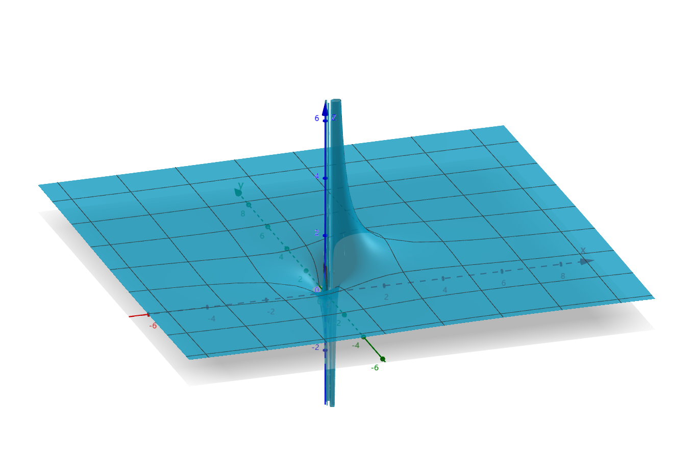
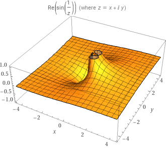
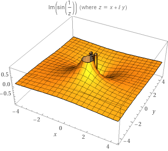

# 复变函数5：Laurent展式

- 数分中常用的级数分解法：
  - 待定系数法
  - 裂项法
  - 直接相除法（见组合数学）

## 洛朗展式

### 双边幂级数

- $\sum\limits^\infty_{n=1} c_n(z-a)^n$
  - **收敛区域**：$|z-a|<R$
- $\sum\limits^\infty_{n=1} \frac{c_{-n}}{(z-a)^n}$
  - **收敛区域**：$|z-a|>r$
    - 可换元 $\xi = \frac{1}{z-a}$ 成为幂级数，则收敛区域为 $|\xi| < \frac{1}{r}$
- 若 $r<R$，则存在公共收敛圆环，则两级数之和称为**双边幂级数**
  - $\sum\limits^\infty_{n=-\infty} c_n(z-a)^n$：分式级数和整式级数的和
- **双边幂级数性质**
  - 在圆环内绝对收敛，内闭一致收敛于 $f(z) = f_1(z) + f_2(z)$（分式极限函数和整式极限函数的和）
  - 极限函数 $f(z)$ 在H内解析（Weierstrass定理）

### 洛朗展式

- **洛朗定理**：圆环内解析的函数可以唯一展为双边幂级数
  - **系数**：$c_n = \frac{1}{2\pi i} \int_\Gamma \frac{f(\zeta)}{(\zeta-a)^{n+1}}d\zeta = \frac{f^{(n)}(a)}{n!}$（$a$ 为圆心，$\Gamma$ 为圆环内圆周）
  - **唯一性**
- **证明**：
  - $f(z) \color{red} = \frac{1}{2\pi i}\int_{\Gamma_2} \frac{f(\zeta)}{\zeta-z}d\zeta - \frac{1}{2\pi i} \int_{\Gamma_1} \frac{f(\zeta)}{\zeta-z} d\zeta \color{blue} = \sum\limits^\infty_{n=0} (z-a)^n\frac{1}{2\pi i} \int_\Gamma \frac{f(\zeta)}{(\zeta-a)^{n+1}}d\zeta + \sum\limits^\infty_{n=0} \frac{1}{(z-a)^n}\frac{1}{2\pi i} \int_\Gamma \frac{f(\zeta)}{(\zeta-a)^{n+1}}d\zeta$
  - **存在性**
    - 应用二连通区域的柯西积分公式，前项周线 $\Gamma_2\to$ 外圆，后项周线  $\Gamma_1\to$ 内圆
    - **前项**：可以直接展成Taylor级数
      - $\frac{f(\zeta)}{\zeta-z} = \frac{f(\zeta)}{\zeta-a}·\frac{1}{1-\frac{z-a}{\zeta-a}} = \frac{f(\zeta)}{\zeta-a}\sum\limits^\infty_{n=0} (\frac{z-a}{\zeta-a})^n$
      - z在圆环内，$\zeta$ 逼近外圆，从而 $|z-a| < |\zeta-a|$
    - **后项**：反换元，展成Laurent级数的负部分
      - $\frac{f(\zeta)}{\zeta-z} = \frac{f(\zeta)}{z-a}\sum\limits^\infty_{n=1}(\frac{\zeta-a}{z-a})^{n-1}$
      - z在圆环内，$\zeta$ 逼近内圆，从而 $|\zeta-a| < |z-a|$
    - **统一**：多连通区域的多个周线积分可以转化为一个复周线积分，所以两个周线可以共同转化到一个周线上，从而合并为 $\Gamma$ 上的Laurent级数展开
  - **唯一性**
    - 反证，设 $f(z) = c'_n(z-a)^n$，则其在收敛域内一致收敛
    - 乘以有界量 $\frac{1}{(z-a)^{m+1}}$ 仍然收敛
    - 逐项积分，$\int_\Gamma \frac{f(\zeta)}{(\zeta-a)^{m+1}}d\zeta = \sum\limits^\infty_{n=-\infty}c'_n \int_\Gamma (\zeta-a)^{n-m-1}d\zeta$
    - 正幂函数周线积分为0，负幂函数只有-1次幂积分不为0，则右式结果为 $c'_m$
    - 而左式正好是 $c_m$，从而 $c'_m = c_m$
- **Laurent展式的超集性**：
  - Taylor展式是一个单连通的圆区域
  - 而Laurent展式是一个二连通的圆环区域
  - 而且它们的证明方法都相同，所以Taylor展式的方法都可以在Laurent中使用
- **换元法求展式（Taylor级数的方法升级版）**
  - $f(z) = \frac{1}{(z-1)(z-2)}$
    - **寻找收敛域**：易得在圆环 $1<|z|<2$ 内，$|\frac{1}{z}|<1，|\frac{z}{2}|<1$
    - **裂项配凑**：$\displaystyle f(z) = -\frac{1}{2}·\frac{1}{1-\frac{z}{2}} - \frac{1}{z}·\frac{1}{1-\frac{1}{z}}$
  - **洛朗换元的原则**：
    - 必须展成纯粹的幂级数，所以系数和底数的 $z$ 函数必须可以合并
    - **实例**：$(1<|z|<2)\quad \large\frac{2}{z^2+1} = \frac{1}{1+\frac{1}{z^2}}·\frac{2}{z^2}$，而不能展成 $\large\frac{1}{1-(z-1)}·\frac{2-z}{z^2+1}·2$

### 习题

- **类三角函数的正负幂同类性**：
  - $cosh(z+\frac{1}{z}) = c_0 + \sum\limits^\infty_{n=1}c_n(z^n+z^{-n})$
- **指定区域内的洛朗展式**：首先根据定义域确定要换的元，然后利用反函数把给出的函数换元
- **换元法求收敛半径**：根据给定的奇点确定要换的元
  - 奇点为$i$，$f(z) = \frac{1}{(z^2+1)^2}$
    - 首先确定好，用幂级数展开后再平方计算，所以换成$(\frac{1}{z^2+1})^2$
    - 然后再换元$m = z-i$，从而 $f(z) = (\frac{1}{(m+i)^2+1})^2 = (\frac{1}{m})^2·(\frac{1}{m+2i})^2$
    - 最后转化为幂级数形式：$\frac{1}{m+2i} = \frac{1}{\frac{m}{2i} + 1}$，最终得到 $\frac{1}{(z-i)^2} · (\sum\limits^\infty_{n=0} (-1)^n·(\frac{z-i}{2i})^n)^2$
    - 平方计算得到每项系数为$\frac{n+1}{2}（首尾匹配） × 2（两个顺序）$
    - 因为底数是$\frac{z-i}{2i}$，所以邻域是 $|z-i|<2$
  - 非分式函数
    - 直接展开：$e^\frac{1}{1-z}$，奇点为$z=1$
    - 无穷乘积：$\Large e^\frac{1}{1-z} = e^\frac{\frac{1}{z}}{\frac{1}{z}-1} = e^{-\frac{1}{z} · (1+\frac{1}{z} + (\frac{1}{z})^2+...)}$，化为无穷乘积 $\displaystyle\prod\limits^\infty_{k=1}\sum\limits^\infty_{n=0}(-1)^n\frac{(\frac{1}{z})^{kn}}{n!}$
- **判断多值函数在去心邻域内能否Laurent展开**：
  - 若圆心是支点，则在邻域圆内会从一支变到另一支中，则一点对应多值。因为**多值函数不解析**，所以任何邻域无法Laurent展开
  - 若圆心不是支点，则可以展开
  - **实例**
    - $\sqrt{z}，z=0$：
      - 支点为 $z=0$，无法展开
    - $\sqrt{z(z-2)}，z=1$
      - 支点为 $z=0，z=2$，可以展开

## 孤立奇点

- **孤立奇点**：$f(z)$ 在 $a$ 的某个去心邻域内解析，且 $a$ 是 $f(z)$ 的奇点
  - **实例**：多值函数的支点
- **孤立奇点邻域内的洛朗展式**
  - 孤立奇点是一个内部圆收缩成一个点的圆环，所以它虽然不可以展成Taylor展式，但它的Laurent展式在形式上和Taylor展式具有相似性
  - 存在多个孤立奇点时，只要绕开它们分别取圆环，也可以覆盖整个复平面
- **函数在点 $a$ 的正则部分**：非负幂部分
- **函数在点 $a$ 的主要部分**：负幂部分
  - 只有在分式中才会出现无意义的点。主要部分体现了函数的奇异性
- **函数的奇点和其展式的奇点不相同，根据它们之间的关系可以分为以下三种：**
  - 可去奇点
  - 极点
  - 本质极点
  - 对它们，有三个判断视角：
    - **定义视角**：Laurent展式的主要部分的项数
    - **普通视角**：$f(z)$ 是否有限大但无定义（可去奇点）、有阶无穷大（极点）、无极限或无阶无穷大（本质奇点）
      - （无阶的意思是无论如何求导都无法化为0）
    - **反转视角**：$\frac{1}{f(z)}$ 的零点阶数（极点）、是否任意阶导数为0（由于不是单连通区域，所以不能Taylor展开得到常函数）
      - **不严谨的理解**：我们现在主要研究的是初等解析函数，而初等解析函数里只有分式函数有奇点，所以反转几乎可以解决所有目前问题
      - **重要引论：收敛级数的二象性**
        - 对于一个收敛级数，我们不能简单粗暴地仅仅把它看成一个和式，而应当同时把它看成极限函数与和式的联合（C语言术语）
        - 需要把它看成级数的时候：$z·\frac{1}{1-z}$，此时直接把z乘入级数即可
        - 需要把它看成极限函数的时候：$\frac{1}{\sum (z-a)^n}$，此时需要适当转化，变成 $\varphi(z)$ 后重新展开（转化一般只存在于理论，用于证明题）

### 可去奇点

- **可去奇点**：主要部分为0（只要扩充函数定义，就可以得到解析，并且也不影响原来函数的性质）
  - 等价命题：
    - $\lim\limits_{z\to a}f(z) = c_0 \quad (c_0\neq \infty)$
    - $\lim\limits_{z\to a}\frac{1}{f(z)} = \frac{1}{c_0} \quad (\frac{1}{c_0} \neq 0)$，依然是可去奇点
    - $f(z)$ 在 $a$ 的去心邻域内有界
    - **正推（1）**：
      - 此时展开式为Taylor展式，直接对展开式求极限
      - 由幂级数连续性，极限值即为 $f(a) = c_0$
      - 若 $c_0 = \infty$，则展开式不解析，不可能存在，与题设矛盾。
    - **（3）逆推**：若 $a$ 去心邻域内有界
      - 由 $c_{-n}$ 的积分形式 + 邻域半径任意小 + 积分上界不等式，可得 $c_{-n}\to 0$
    - **推论**：若 $f(z)$ 为区域D上的解析函数，则D中不可能存在孤立奇点 $a$，使得复平面上各个方向趋近于 $a$ 时，有下列情况之一：
      - 情况一：$f(z)$ 均有界，但存在某两个方向的极限值不相等
      - 情况二：$f(z)$ 均有界，但存在某个方向发散
      - （即 $f(z)$ 有界但极限不存在）
      - 现在的工具似乎还不足以用解析的定义来证明，先不管了
      - **证明**：不妨设 $a=0$
        - 法一：Laurent展式法，就是上面的方法，但不直观
        - 法二：反设存在，则情况可能有：
          - 直线方向：设 $y = kx$，则 $\lim\limits_{z\to a}f(z) = \frac{k}{1+k}$ 时满足情况一。但由解析定义，此时
          - 其它情况：设 $y = \psi(x)$，则 $f(z) = u(x,\psi(x)) + iv(x,\psi(x))$
      - **理解**：虽然用解析的定义证不出来，但是由Laurent展式的推导过程不难发现：Laurent展式证法就等于柯西积分公式证法。只要用到两者之一，则不用另一个就证不出来
      - 比如说，这里要用到二连通区域的柯西积分公式，但它的本质不就是转换成内圆和外圆的积分么？而内圆和外圆积分的进一步转化就是Laurent展式，用它可以很方便地给出证明。所以说，任何试图在内圆外圆积分的基础上用其它方法证明的尝试都是舍近求远
  - **实例**：$\frac{sinz}{z}$，原点是其可去奇点
- **Schwarz引理（模压缩映射）**：函数在单位圆内解析，且满足 $f(0) = 0，|f(z)|<1$，则在单位圆内 $|f(z)|\leqslant |z|，|f'(0)| \leqslant 1$
  - **证明**：
    - 令 $\varphi(z) = \frac{f(z)}{z}$
    - 利用洛朗系数的导数性，定义 $\varphi(0) = c_1 = f'(0)$
      - 因为原点是 $f(z)$ 的零点，所以由Laurent展式可以看出，此时 $\varphi(z)$ 无奇点（**核心**），是单连通区域上的解析函数
    - 由柯西积分公式和最大模原理（柯西不等式），$\forall r<1，\varphi(z) \leqslant \frac{M_f(r)}{r} \leqslant \frac{1}{r}$。所以 $|\varphi(z)| \leqslant 1 \Rightarrow \begin{cases}|f(z)| \leqslant |z| \\ |f'(0)| \leqslant 1\end{cases}$（√）
    - 而取到最大模时，$\varphi(z)$ 为常函数，此时 $f(z) \equiv e^{i\alpha}z（\alpha是实数）$
  - **几何意义**：按照原像空间和像空间的视角，可以看作 $f(z)$ 把单位圆变成了更加小的区域，是一个压缩映射，从而像的模 $|f(z)|$ 小于原像的模 $|z|$
    - 如果 $f(z)$ 是常函数的话，就是一个旋转变换
- **Schwarz一般形式**：
  - 若零点为0，函数在圆内有界且解析。则 $|f(z)|\leqslant \frac{M}{R}，且 |f'(0)| \leqslant \frac{M}{R}$
  - 若圆内有等号相等点，则 $f(z) \equiv \frac{M}{R}e^{i\alpha}z$
- **Schwarz加强**：如果原点是$f(z)的\lambda$阶零点，则$\varphi(z) = \frac{f(z)}{z^\lambda}$，缩小的程度更强

### 极点

- **函数的m阶极点**：该点的主要部分项数有限，为m项
  - 等价命题：
    - **极点解析表达式**：$f(z) = \frac{\lambda(z)}{(z-a)^m}$（**余式** $\lambda(z)$ 在 $O(a,|z-a|)$ 内解析且 $\neq 0$）
      - **证明**：Laurent展式的主要部分最高项数进行通分即可
      - **理解**：这是 极点 $\Leftrightarrow$ 零点 的主要渠道，也是快速判断极点阶数的简化方法（只看分母）
      - **推论**：正因为此，极点的四则运算和零点相同
    - $\frac{1}{f(z)}$ 以a为m阶零点
      - **证明（分离分式 + 乘法求导）**：
        - **Laurent展开**：$f(z) = \sum\limits^\infty_{n=0} (z-a)^n + \sum\limits^m_{k=1}\frac{1}{(z-a)^k}$
        - **分离分式得** $f(z) = \frac{1}{(z-a)^m} (\sum\limits^\infty_{n=1} (z-a)^n)$
        - **取极限**：可以Laurent展开 $\Rightarrow$ 在两个幂级数的收敛半径内 $\Rightarrow$ 存在极限函数 $\varphi(z)$，由W定理，$\varphi(z)$ 解析
        - **取倒数** $\frac{1}{f(z)} = (z-a)^m\frac{1}{\varphi(z)}$
        - **倒数展开**：由于 $\varphi(z)$ 解析且无零点，其分式也解析且无孤立奇点，所以可Taylor展开，构成零点解析表达式
      - **理解**：
        - 无穷大点取分母自然是零点。导数降阶性得到 无穷大的阶数 对应 零点阶数
        - 不能僵硬地想把级数整个取倒数，而是应该把极限函数（展开前的函数）取倒数再展开。由于奇点变成零点，原区域变成解析的单连通区域，所以必定可以 Taylor 展开。
- **极点的判别法则**：孤立奇点为极点 $\Leftrightarrow$ $\lim\limits_{z\to a}f(z) = \infty$
  - **尝试找反例**：
    - 能想到的反例：$e^x，x\to\infty$，无论求导多少次都是无穷大，它显然没有阶。但它在复变函数中是 $e^\frac{1}{z}，z\to 0$ ，是本质奇点，其各个方向上的极限不相等。
    - 通过这个失败的反例，我们发现：由于复变函数对极限的强定义，导致我们必须寻找一个稳定的函数，既存在无穷阶的无穷大，又任意方向符号相等。
  - **理解**：
    - 孤立奇点的分类是按照主要部分的项数。如果
- **单极点**：一阶极点

### 本质奇点

- **本质奇点**：主要部分项数无限（$\frac{1}{f(z)}$的零点阶数无限）
- **判别法则**：a为本质极点 $\Leftrightarrow$ $\lim\limits_{z\to a}f(z) \neq \begin{cases} b（有限数）\\ \infty \end{cases}$，即广义极限不存在
  - 情况一：某个方向发散，另外某个方向上为无穷大
  - 情况二：各个方向上的极限值不同，其中某个方向上为无穷大
- 例：
  - $e^{\frac{1}{z}}$ 以原点为本质奇点
  - $sin\frac{1}{z}$ 以原点为本质奇点
- **等价命题**：$\frac{1}{f(z)}$ 也是本质奇点
  - **证明**：反设是可去奇点和极点，发现均不成立，所以只能是本质奇点
- **Picard定理**：本质奇点 $a$ 处，广义常数 $\forall A，\exist\{z_n\}\to a$，使得$\lim\limits_{z_n\to a}f(z_n) = A$
  - **证明**：
    - 若 $A = \infty$，因为邻域内有界必为可去奇点，所以存在某个方向上 $f(z)\to \infty$，取该方向即可
    - 若 $A \neq \infty$，则构造 $\varphi(z) = \frac{1}{f(z)-A}$
      - 得 $O(a,\rho)$ 内 $\varphi(z)$ 解析，且以a为本质奇点。则必定存在某个方向上 $\varphi(z)\to \infty\quad (z\to a)$，则此时 $f(z) = A$，在该方向上取点列即可。
  - 例：$sin\frac{1}{z} = A$
    - 若 $A = \infty$，则 $z_n = \frac{i}{n}$
    - 若 $A \neq \infty$，则 $z_k = \large\frac{i}{ln(iA + \sqrt{1-A^2})+2k\pi i}$
  - 例：$e^{\frac{1}{z}}$
    - 若 $A = \infty$，则 $z_n = \frac{1}{n}$ 即可
    - 若 $A = 0$，则 $z_n = -\frac{1}{n}$ 即可
    - 若 $A \neq 0、\infty$，则 $z_k = \large\frac{1}{lnA + 2n\pi i}$
- **皮卡大定理**：$\exist$ 非极限形式的点列，每一项都满足 $f(z_n) = A$

### 图片示例

- $e^{\large\frac{1}{z}} = e^{\frac{x}{x^2+y^2}}(cos\frac{y}{x^2+y^2} - isin\frac{y}{x^2+y^2})$
  - 当 $y = x^2$ 时，$z\to 0$ 无界
  -  
- $sin\frac{1}{z}$（xy展开式太复杂不写了，直接用wolfram的现成图片）
  -  

### 习题

- **选取适当圆环**
  - $sin[t(z+\frac{1}{z})] = c_0 + \sum\limits^{+\infty}_{n=1} c_n(z^n + (\frac{1}{z})^n)$
    - 其中 $c_n = \frac{1}{2\pi}\int^{2\pi}_0 sin(2tcos\theta)cosn\theta d\theta$ （选择 $|\xi| = 1 即\xi = e^{i\theta}$）
- **判断极点阶数**（$\frac{1}{f(z)}$的零点阶数）：
  - **分式**：
    - $\frac{5z+1}{(z-1)(2z+1)^2(z^2+i)}$在$z=1$为一阶，在$z=-\frac{1}{2}$为二阶，在 $z = \pm \sqrt{-i}$为一阶
    - $\frac{1}{e^z-1}$ 只考虑分母即可（Laurent分离分式 + 乘法求导）
  - **三角函数式**：
    - $\frac{1}{asinz+bcosz}$：任意角公式
    - $tan^2z$：只需要考虑分母即可（Laurent分离分式 + 乘法求导）
  - **复合函数**
    - $cos\frac{1}{z+i}$，可以直接展开为 $1-(\frac{1}{z+i})^2+...$。这里是对标了实数域上Taylor公式的复合展开（只要余项 $\to 0$ 即可）
      - 严格的Taylor展开必须是多项式的形式，但Laurent展开可以有分式。而复合展开可以有任意形式，这里恰巧复合展开是Laurent展式的形式而已
    - $e^{z-\frac{1}{z}}$，本质奇点
  - **四则运算混合式**
    - $\Large\frac{e^{\frac{1}{z-1}}}{e^z-1}$：（**分离法**）
      - 证明可分离：
        - 观察法：别笑，这方法有用
        - **二象性法**：分子分母分别Laurent展开，可以达到一维递进（完全转化效果），此时虽然还不是Laurent展式形式，但是转化成了统一的分式形式，可以更方便地观察（或使用提公因式法，也就是解析表达式法）
- **扩充刘维尔定理**：在扩充复平面上解析的函数是常函数
  - **证明**：解析必有界，则为有界整函数，Cauchy不等式得是常函数（核心是扩充复平面存在 $\infty$ 点）
  - **几何意义**：
    - 非常数整函数的值不能全含于一圆之内 $\rightarrow$ 值域无界 $\rightarrow$ 是无界函数
    - 同时也不能全含于一圆之外 $\rightarrow$ 分式转换即可

## 无穷远点

- **奇点性**：函数在无穷远点无意义，从而不解析
- **无穷远点孤立条件**：无穷远邻域（圆环）$N-\infty: 0 \leqslant r < |z| < +\infty$ 内函数解析
- **分式变换**：$\varphi(z') = f(\frac{1}{z'}) = f(z)$，则问题转化为原点是否为孤立奇点
  - **关系**：
    - 奇点类型一一对应
    - 洛朗系数序号相反
- **多值函数，在无穷远点去心邻域内，展成洛朗级数**
  - $Ln\cfrac{z-a}{z-b} = ln\cfrac{1-\frac{a}{z}}{1-\frac{b}{z}} = ln(1-\frac{a}{z}) - ln(1-\frac{b}{z}) + 2k\pi i$
    - 为各单值主值分支的单值性孤立奇点中的可去奇点
- **多连通区域的非孤立零点**：
  - 若
    - $f(z)$ 在仅含孤立奇点 $a$ 的多连通区域内解析
    - $f(z)$ 不恒为0
    - 存在一列以a为聚点的零点，
  - 则a为本质奇点
  - **证明**：
    - 若是可去奇点，则可以补充定义，变成单连通区域。零点孤立性得到 $f(z)$ 恒为0
    - 若是极点，则奇点附近 $f(z)$ 无穷大，零点不可能以 $a$ 为聚点
    - 所以只能是本质奇点
- **复球面上的洛朗级数**：邻域为 $N(\infty): r < |z-a|$

### 习题

- **指数函数**：$f(z) = e^{\large\frac{z}{z+2}}$：令 $z = \frac{1}{\zeta}$，则 $f(\frac{1}{\zeta})= e^{\large\frac{1}{1+2\zeta}} = \varphi(\zeta)$，然后用导数求洛朗系数
- **三角函数**：$f(z) = \frac{tan(z-1)}{z-1}$ 的奇点
  - $\frac{tan(z-1)}{z-1} = \frac{sin(z-1)}{(z-1)cos(z-1)}$
    - $z=1$是可去奇点
    - $z = 1+\frac{2k+1}{2}\pi$ 是一阶极点
    - $z=\infty$ 是极点的聚点，因此是非孤立奇点

## 整函数和亚纯函数

- 亚纯函数其实就是广义解析函数，把无穷大也当作极限

### 整函数

- **整函数**：在整个z平面上解析的函数，因此只有无穷远点一个孤立奇点
- **整函数的分类**：根据无穷远点是
  - 可去奇点 $\Leftrightarrow$ 常函数 $c_0$
  - m阶极点 $\Leftrightarrow$ m次多项式
  - 本质奇点 $\Leftrightarrow$ 超越整函数
- **超越整函数**：Taylor展式有无穷多个项
    - 例：$e^z、sinz、cosz$

### 亚纯函数

- **全纯函数**：解析函数
- **亚纯函数**：只有极点一种奇点类型的单值解析函数
  - **实例**：
    - 整函数：有理函数、常函数
    - 超越亚纯函数
  - **有理函数亚纯性**：$f(z)$ 是有理函数 $\Leftrightarrow$ $f(z)$ 在扩充复平面上是亚纯函数
  - **证明**：
    - **必要性**：
      - 有理函数 $f(z) = \frac{P(z)}{Q(z)}$。易得 $Q(z)$ 的零点是极点。
      - 现在看无穷远点的情况，设分子次数为m，分母次数为n
        - $m>n$ 时，$\cfrac{1}{f(\frac{1}{z})}$ 的次数为 $\frac{-n}{-m} = m-n$，也就是 $m-n$ 阶零点。则 $f(z)$ 的极点阶数为 $m-n$
        - $m\leqslant n$ 时，$\lim\limits_{z\to\infty}f(z) = 0$，是可去奇点，也就是解析点
      - 从而亚纯性得证
    - **充分性**：
      - 由孤立奇点定义，极点个数必须为有限个
      - 由 $f(\frac{1}{z}) = \frac{\lambda(z)}{z^m}$，得 $f(z) = z^m\varphi(z)$
      - 构造函数 $g(z) = (z-z_1)^{\lambda_1}(z-z_2)^{\lambda_2}...(z-z_n)^{\lambda_n}f(z)$
        - $g(z)$ 的孤立奇点只有无穷远点，且在z平面上解析。由广义刘维尔定理，其必为多项式或常数，所以 $f(z)$ 是有理函数
    - **理解**：根据极点的分数有限项性质 + 解析表达式，稍加讨论即可得出
- **超越亚纯函数**：非有理函数的亚纯函数
  - **实例**：$\frac{1}{e^z-1}$，极点为 $z = 2k\pi i$，有聚点奇点 $z = \infty$，所以不是有理函数
- **整函数单射性**：单叶整函数 $\Leftrightarrow f(z) = az+b\quad (a\neq 0)$
  - **充分性**：一次函数和其反函数（一次函数）都是单值整函数
  - **必要性**：整函数就三种，分类讨论即可
    - 常数：不满足单射性（×）
    - 超越整函数（皮卡大定理）：
      - Taylor展开，只有一个奇点 $z=\infty$，且其为本质奇点
      - 再由Picard大定理，有无穷点列每一项都等于一个值，不满足单射性（×）
    - n次多项式函数（代数基本定理）：
      - 由代数基本定理，$f(z) = A$ 必定有n个解
      - 再由单叶性，根必须为1，则只能是一次函数
  - **理解**：幂级数展开可以把函数形式统一，从而性质统一，从而得到很强的结论

## 平面向量场