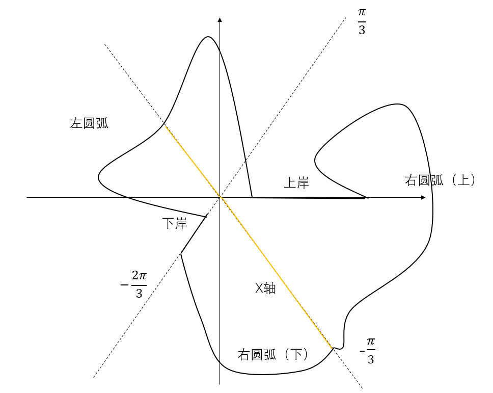

# 复变函数6：留数

- Laurent展式 $\Leftrightarrow$ 积分

## 留数介绍

- 解析点 $a$ 的邻域解析，其中的周线 $C$ 满足柯西积分定理
- 孤立奇点 $a$ 的邻域解析，但不是单连通区域
  - 使用Laurent展开，可以把积分换成 $C_{-1}$
- **留数**：$\underset{z = a}{Res}f(z) = \frac{1}{2\pi i}\int_\Gamma f(z)dz$
  - 由二连通复周线柯西积分定理，得到内部任意包含 $a$ 的周线积分都相等
  - 而洛朗展式的一阶系数正好是柯西积分公式的形式： $C_{-1} = \underset{z = a}{Res}f(z) = \int_{\Gamma} \frac{f(\zeta)}{\zeta-a}d\zeta$
    - **理解**：
      - Laurent系数的定义
      - 或逐项积分Laurent展式 + 柯西积分定理 + 重要极限，最后只有 $C_{-1}$ 剩下来
- **柯西留数定理**：
  - 若周线内只有孤立奇点，内部解析周线连续
  - 则 $\int_C f(z)dz = 2\pi i\sum\limits^n_{k = 1}\underset{z = a_k}{Res}f(z)$
  - **证明**：就是复周线积分定理

### 求留数

- **可去奇点的留数为0**：
  - **柯西积分公式理解**：可以补充定义使之解析
  - **Laurent展式理解**：主要部分为0，所以 $C_{-1} = 0$
- **n阶极点的留数**：$\underset{z = a}{Res}f(z) = \frac{\varphi^{(n-1)}(a)}{(n-1)!}$
- **证明**：
  - 首先分离极点因式：$f(z) = \frac{\varphi(z)}{(z-a)^n}$
  - **洛朗系数法**
    - 此时 $\varphi(z)$ 是Taylor展开式的形式，$C_{-1}$ 对应 $\varphi(z)$ 的 $n-1$ 次项的系数
    - 则 $\varphi(z)$ 在 $a$ 点解析，可以对其Taylor展开（形式不变），其 $n-1$ 次项的系数为 $\frac{\varphi^{(n-1)}(a)}{(n-1)!}$
  - **柯西高阶导公式法**：
    - $\frac{\varphi^{(n-1)}(a)}{(n-1)!} = \frac{1}{2\pi i}\int_C\frac{\varphi(z)}{(z-a)^{n}}dz = \frac{1}{2\pi i}\int_C f(z)dz = \underset{z = a}{Res}f(z)$
- **推论**：
  - **一阶极点**：$\underset{z = a}{Res}f(z) = \varphi(a)$
  - **二阶极点**：$\underset{z = a}{Res}f(z) = \varphi'(a)$
  - **非分式函数的极点留数**：
    - **极限法**：$\lim\limits_{z\to a}\frac{\varphi^{(n-1)}(z)}{(n-1)!}$
    - **分式法**：$\large f(z) = \frac{\varphi(z)}{\psi(z)}$，两个函数均解析，且 $a$ 为一阶极点，则用上述方法，在极小圆取周线，从而化为导数形式，得到 $\large\underset{z = a}{Res}f(z) = \frac{\varphi(a)}{\psi'(a)}$
  - **本质奇点的留数**
    - 直接Laurent展开，求 $C_{-1}$

### 习题

- 计算积分
  - 分式：直接裂项求解即可，不用留数
  - 三角函数：无穷留数
    - $\int_{|z| = n}tan\pi zdz$，已知 $\underset{z = k+\frac{1}{2}}{Res}(tan\pi z) = -\frac{1}{\pi}$，所以原式 $ = 2\pi i(-\frac{2n}{\pi})$
  - 解析函数：
    - **分离法（洛朗系数法）**
      - 首先将函数划分为几个部分，分别洛朗展开
      - 因式分解后，将余式 $\lambda(z)$ 看作整体，再次洛朗展开
      - 不断进行下去，直至出现 $C_{-1}$，即得答案
      - （Laurent/Taylor展式 $\Leftrightarrow$ 积分）
    - **实例**：
      - $\large\int_{|z| = 1}\frac{zsinz}{(1-e^z)^3}dz$：
      - 分子分母同时展开，因式分解得到幂级数分式 $\Large-\frac{1}{z} · \frac{(1-\frac{z^2}{3!}+...)}{(1+\frac{z}{2!}...)^3}$
      - 右式在原孤立奇点 $z=0$ 处解析，**故利用二象性**，可以重新Tylor展开为 $-\frac{1}{z} · (1+...)$
      - 从而 $C_{-1} = -1$，$\underset{z = a}{Res}\frac{zsinz}{(1-e^z)^3} = -2\pi i$
    - **极点留数公式法**
    - **实例**：
      - $\large\int_{|z| = 1}\frac{zsinz}{(1-e^z)^3}dz$：
      - 一阶极点 $z = 0$，$f(z) \rightarrow \varphi(z) = zf(z) $
      - 从而 $\underset{z = a}{Res}f(z) = \varphi(0) = \frac{sinz}{z} · \frac{z^3}{(1-e^z)^3} = -1$

### 无穷远点的留数

- **留数**：若无穷远点是孤立奇点，则 $\underset{z = \infty}{Res}f(z) = \frac{1}{2\pi i}\int_{\Gamma^反}f(z)dz\quad (\Gamma: |z| > r)$
  - **证明**：
    - 逐项积分证明
  - **推论**：反号性：$-C_{-1}$
- **无穷远点是可去奇点，但是其留数不为零**：此时公式法失效，只能使用Laurent系数解法，即分离法
  - **实例**：$f(z) = 2+\frac{1}{z}$
- **留数总和为0（复周线转化）**：
  - **本质**：复周线柯西积分定理
  - **应用**：若内部孤立奇点较多，则可以直接画一个无穷大圈计算总留数
- **留数换元公式**：令 $t = \frac{1}{z}$，则 $\underset{z = \infty}{Res}f(z) = -\underset{t = 0}{Res}[f(\frac{1}{t})\frac{1}{t^2}]$
  - **推论**：此时可以应用极点求解法

### 习题

- 复变和高代交叉题目：$\frac{z^{2m}}{1+z^m}$ 的孤立奇点留数

## 实积分化为复积分

- 洛朗展式和积分的相互转化非常便利强大，甚至可以应用到实数积分中，为此我们需要掌握一些对实函数扩充到复函数的技巧

### 三角函数

- $\int_0^{2\pi} R(sin\theta,cos\theta)d\theta$
  - 令 $z = e^{i\theta}$，则由欧拉公式，$\begin{cases} cos\theta = \frac{z+z^{-1}}{2} \\ sin\theta = \frac{z-z^{-1}}{2i}  \end{cases}$，$d\theta = \frac{dz}{iz}$
  - 积分路径为 $|z| = 1$

#### 实例

- $\displaystyle\large\int^{2\pi}_0\frac{d\theta}{1 - 2pcos\theta + p^2}$
  - 数学分析中：可以使用万能代换公式
  - 复变函数中：按上述方法换元为复变函数，应用极点和留数定理
- **韦达定理转化法**：$\displaystyle\int^{2\pi}_0\frac{sin^2\theta}{a+bcos\theta}d\theta$
  - 首先化为复数积分，其中分母可以用二次方程求根公式，因式分解为 $(x-\alpha)(x-\beta)$
  - 利用韦达定理讨论极点的位置，决定求几个分母因式的留数
  - 利用极点配凑 $\alpha\pm\beta$、$\frac{1}{\alpha}$，简化计算相应的留数
- **积分换元**：$\displaystyle\large\int^{2\pi}_0 \frac{d\theta}{1+cos^2\theta}$
  - 首先化为复数积分，然后换元 $u = z^2 \rightarrow e^{2i\theta}$，此时积分路径由一个圆周变成两个圆周（乘积的旋转性）积分变成二倍，从而达到简化目的
- **偶函数化为圆周积分**：$\displaystyle\large\int^\pi_0 \frac{cosmx}{5-4cosx}dx$
  - 首先可以用 $(e^z) = I_1(cos) + iI_2(sin)$ 配凑分子为指数函数，此时用留数计算比较简便，最后用实部和虚部的独立性分离即可

### 反常积分：有理形式

- $\int^{+\infty}_{-\infty}\frac{P(x)}{Q(x)}dx$ 
 

- **极大圆弧积分引理**：
  - 若
    - $f(z)$ 沿圆弧 $S_R: z = Re^{i\theta}$ 上连续
    - $\lim\limits_{R\to +\infty}zf(z) = \lambda$ 在 $R$ 上一致成立
  - 则
    - $\lim\limits_{R\to +\infty}\int_{S_R} f(z)dz = \lambda\int_{S_R}\frac{dz}{z} = i(\theta_2-\theta_1)\lambda$
  - **证明（作差证明）**：首先积分内部作差。再由极限条件构造无穷小 $\frac{\varepsilon}{\theta_2-\theta_1}$，从而在构建弧长积分后得 $\frac{\varepsilon}{\theta_2-\theta_1}\cdot \frac{l}{R} = \varepsilon$
  - **理解**：证明同柯西积分公式、柯西积分定理、柯西高阶导定理
  - **本质**：圆周积分，原理是共轭和切线乘积始终为 $i$，因此可以从圆周推广到圆弧
- **有理积分——留数和定理**：
  - 若
    - $P(z)$ 是m次方，$Q(z)$ 是n次方，且 $n-m \geqslant 2$
    - 在实轴上 $Q(z) \neq 0$
  - 则
    - $\int^{+\infty}_{-\infty}f(x)dx = 2\pi i\sum\limits_{Im\ a_k > 0}\underset{z = a_k}{Res}f(z)$
  - **理解**：
    - 上半圆的留数和 $\Leftrightarrow$ 实数轴上的反常积分
    - 只要圆弧积分为0即可，又由于有理函数收敛于0，所以极限值为0（√）
  - **证明**：
    - 首先由**p-积分**得知反常积分收敛，Cauchy主值为 $P.V.\int^{+\infty}_{-\infty} f(x)dx$
    - 取上半平面半圆作为辅助曲线，令 $R$ 充分大从而包含一切孤立奇点
      - **由留数和定理**，半圆周线积分 = 孤立奇点留数和
    - 又由于 $\displaystyle|zf(z)| = |z\frac{P(z)}{Q(z)}| = |\frac{z^{m+1}}{z^n}| · |\frac{c_0 + ... + \frac{c_m}{z^m}}{b_0 + ... + \frac{b_n}{z^n}}|$
      - 右式有界，左式 $\to 0$，所以 $\lambda \to 0$，即极大圆弧上积分为0
      - 从而实轴积分值（直径积分值）就等于留数值（半圆总积分值）

### 习题

- ：$\large\int^{+\infty}_{0} \frac{dx}{x^4+a^4}$
  - 首先扩充到复平面上，$\large\frac{1}{2}\int^{+\infty}_{-\infty}\frac{dz}{z^4+a^4}$，一共有4个一阶极点，且为收敛有理积分
   
  - 留数和为 $\underset{z = a_k}{Res}f(z) = \large\frac{1}{4z^3}|_{z=a_k} = -\frac{a_k}{4a^4}$
  - 再取上半平面的极点代入即可
- **换元、因式分解得到幂级数**：$\large\int^{+\infty}_{-\infty}\frac{x^4dx}{(2+3x^2)^4}$
  - 在上半平面内只有一个四阶极点
  - 设极点为 $a$，利用 $f(z)$ 换元为 $z = t+a$，可以直接因式分解成幂级数展式，从而得到留数
  - 最后代入即可

### 反常积分：有理指数型

- $\int^{+\infty}_{-\infty}\frac{P(x)}{Q(x)}e^{imx}dx$
 

- **若尔当引理（极大圆弧积分引理）**：
  - 若
    - 函数在半圆周 $\Gamma+R$ 上连续
    - $\lim\limits_{R\to +\infty}g(z) = 0$ 在 $R$ 上一致成立
  - 则
    - $\lim\limits_{r\to +\infty} \int_{\Gamma+R}g(z)e^{imz}dz = 0 \quad (m>0)$
  - **本质**：$e^{imx}$ 的本质是三角函数，只会对积分起到收敛作用
  - **证明**：
    - 首先**积分换元成角度**，再根据极限放缩 + 欧拉公式拆解指数部分
    - 得到 $|\int^\pi_{\Gamma + R} g(z)e^{imz}dz| \leq R\varepsilon\int^{\pi}_{0}e^{-mRsin\theta}d\theta$，变为实数积分
    - **Jordan不等式**：$\frac{2\theta}{\pi} \leqslant sin\theta \leqslant \theta$（左式就是三角函数图像的割线，很好理解）
      - 放缩为可求解的实数积分，积分解得 $\frac{\pi\varepsilon}{m}(1-e^{mR}) < \frac{\pi\varepsilon}{m}$，从而等于0
- **有理指数积分——留数和定理**
  - **证明**：同有理积分，证明圆弧上积分为0即可

### 习题

- $\large\int^{+\infty}_0 \frac{cosmx}{1+x^2}dx$
  - 偶函数性质，变为Cauchy主值积分
  - 转换为留数和
- $\large\int^{+\infty}_{-\infty}\frac{xcosxdx}{x^2-2x+10}$
  - 整合 $isinx和cosx$，配凑$e^{iz}$即可

### 无界函数（积分路径上有奇点）

- **极小圆弧积分**：
  - 若
    - $f(z)$ 沿圆弧 $S_r: z-a = re^{i\theta}$ 上连续
    - $\lim\limits_{r\to 0} (z-a)f(z) = \lambda$ 在 $S_r$ 上一致成立
  - 则 $\int_{S_r}f(z)dz = i(\theta_2-\theta_1)\lambda$
  - **证明**：方法和极大圆弧积分一样
  - **理解**：其实主要看的是极限，如果极限是无穷远，则为极大圆弧积分，如果极限是邻域，则为极小圆弧积分
  - **应用**：可以在奇点邻域内再取一个小扇形，和原本的大扇形构成一个扇形环

### 习题

- $\int^{+\infty}_0 \frac{sinx}{x}dx$
  - 已知其条件收敛，偶函数，则 $I = \frac{1}{2}P.V.\large\int^{+\infty}_{-\infty}$
  - 取辅助函数 $e^{iz}$
  - 绕过奇点 $z=0$ 取半圆环
    - 总积分为0
    - 外圆周积分为0（极限圆弧积分）
    - 内圆周积分为$i\pi$（圆弧积分）
    - 所以 $[R,r]$ 区间的积分为 $P.V. = i\pi$

### 积分路径的选择

- **菲涅尔Fresnel积分**：$\displaystyle\int^{+\infty}_0 cosx^2dx、\int^{+\infty}_0sinx^2dx$
- **解**：
  - 已知**泊松Poisson积分**：$\int^{+\infty}_0 e^{-t^2}dt = \frac{\sqrt{t}}{2}$
  - 设辅助函数 $f(z) = e^{-z^2}$
  - 选择右上平面的扇形积分，得到 $\int^R_0 e^{-x^2}dx + \int_{\Gamma}e^{-z^2}dz + \int^0_R e^{-x^2e^{\frac{\pi}{2}i}} e^{\frac{\pi}{4}i}dx = 0$（角度为 $\frac{\pi}{4}$）
    - 总积分为0
    - 圆弧积分可以依照上式三角换元、Jordan不等式放缩为 $\frac{4\pi}{R}(1-e^{-R^2}) \to 0$
    - 剩余的两式化简并移项为 $\frac{1+i}{\sqrt{2}}\int^{+\infty}_{0}e^{-ix^2}dx = \frac{\sqrt{\pi}}{2}$
    - 左式可以转化为 $\int(cosx^2 - isinx^2)dx$ 的形式，比较实虚部即可得到答案
- $\displaystyle\int^{+\infty}_0e^{-ax^2}cosbxdx,\quad a>0$
  - $b=0$，Poisson积分
  - $b\neq 0$，转化原积分，$cosbx$ 转化为 $Re\ e^{ibx}$，融合到指数函数中
    - 再用偶函数得到Cauchy主值，换元就不会影响到端点（端点依然是无穷大）
    - 换元 $z = x+\frac{b}{2a}i$，转化为 $I = \frac{1}{2}e^{-\frac{b^2}{4a}}Re\int^{+\infty + \frac{b}{2a}i}_{-\infty + \frac{b}{2a}i}e^{-az^2}dz$
    - 选取辅助函数 $e^{-az^2}$，积分路径为矩形
      - 总积分为0
      - $I$ 为顶边积分
      - 两个竖直边积分放缩可得积分为0
      - 底边是Poisson积分

### 多值函数的积分

- $\displaystyle\int^{+\infty}_0 \frac{lnx}{(1+x^2)^2}dx$
  - 辅助函数 $f(z) = \cfrac{Lnz}{(z+i)^2(z-i)^2}$
  - 积分路径：绕开原点的半圆环，则极点包含在积分区域内，需要用留数定理
    - 总积分：计算留数 $\underset{z = a}{Res}f(z) = \varphi'(z)$
    - 圆弧积分均用引理放缩为0
    - 右半段底边是 $I$
    - 左半段底边，化为 $z = xe^{i\pi}$，从而取主值支 $lnz = lnx + i\pi$
    - 此时左右半段同构，所以比较实虚部即可
- $\displaystyle\int^1_{-1}\frac{dx}{\sqrt[3]{(1-x)(1+x)^2}}$
  - 辅助函数 $f(z) = \sqrt[3]{(1-z)(1+z)^2}$，$argf(z) = \frac{2\varphi_L+\varphi_R}{3}$
    - 支点（孤立奇点）：$\pm 1$
    - 取支割线 $[-1,1]$
      - 三个单值解析分支：$0/2/4\pi <argf(z)< 2/4/6\pi$（换成负数也可以）
    - **积分路径**：取无限逼近x轴的骨头状闭曲线，看作有角度变化的直线段
    - **主值支**：取上岸中 $argf(z) = 0$ 的分支，即上岸 $f(z) = e^{0i}f(x)>0$
    - **旋转法**：转到下岸，则 $\varphi_R$ 变化 $2\pi$，$\varphi_L$ 不变。$argf(z)$ 转过 $+\frac{4}{3}\pi$（即$-\frac{2}{3}\pi$），从而下岸 $f(z) = e^{-\frac{2\pi}{3}i}f(x)$
  - **积分**：
    - 总积分为无穷远点留数
      - 在求解过程中出现了 $t=0$ 时的 $\sqrt[3]{-1}$，所以还需要求 $z=+\infty + 0i$ 时在此主值支下的值
      - **旋转法**：在右侧圆弧旋转到 $(1,+\infty)$ 时，$\varphi_R$ 变化 $\pi$，而 $\varphi_L$ 不变，因此 $(1,+\infty)$ 上为 $f(z) = f(x)e^{-\frac{\pi}{3}i}$
    - 圆弧积分放缩为圆周弧长积分，再去分母，转化为实数积分，$\to 0$
    - 两个直线就是同构的 $I$
  - 最后得到结果
- $\displaystyle\int^1_0 \frac{dx}{(x-2)\sqrt[5]{x^2(1-x)^3}}$
  - 辅助函数 $f(z) = \frac{1}{(z-2)\sqrt[5]{z^2(1-z^2)}}$
    - 支点为 $z=0、z=1$
    - 支割线 $[0,1]$，有5个单值解析分支
    - 取骨头状闭曲线，取在 $z=2$ 取负值的一支
  - 总积分为无穷远点留数，Laurent展式$C_1$为0，$Res = 0$
    - 一阶极点 $\underset{z=2}{Res}$ 按照所选的分支，求解后用旋转法化解多值
    - 圆周积分放缩为0
    - 两岸取主值支后同构即可
- **寻找主值支的方法**
  - 化为指数形式，求出k
  - 给出arg关系式，然后确定某个点的角度取值 $e^{i\theta}$，即可推出所有其它点
  - （上面例题均用的第二种方法）

### 图形解析（第二题）

  - 
  - 这幅图是第二题的函数的像，以上岸 $argf(z) = 0$ 为主值支（另外两个主值支中，上岸 $argf(z) = 2\pi 和 4\pi$）
    - 通过**原像的旋转角度**和**辐角的映射关系式**，求出x轴和下岸的对应辐角
      - 因为支点的位置特殊，它们的像是直线，辐角不变
      - 此时可以用实数 $x$ 来指代 $z$，同时乘上一个角度常数来表示旋转

## 辐角原理

- $\triangle Cargf(z)$ $\xLeftrightarrow{欧拉公式+柯西积分}$ 对数留数 $\xLeftrightarrow{柯西积分+幂展开} N-P$

### 对数留数

- **函数的对数留数**：$\displaystyle\frac{1}{2\pi i}\int_C\frac{f'(z)}{f(z)}dz$，$C$ 是周线（被积函数简称为 $\psi(z)$）
  - **零点转化**：$a$ 是 $f(z)$ 的 $n$ 阶零点 $\Rightarrow$ $a$ 是 $\psi(z)$ 的一阶极点，且对数留数为 $n$
    - **证明**：化为零点解析表达式，则 $\psi(z) = \frac{n}{z-a} + \frac{\varphi'(z)}{\varphi(z)}$
      - 由 $\varphi$ 在 $C$ 内解析，$\frac{\varphi'}{\varphi}$ 也解析，其积分为0
      - 前项积分为 $n$
  - **极点转化**：$b$ 是 $f(z)$ 的 $m$ 阶极点 $\Rightarrow b$ 是 $\psi(z)$ 的一阶极点，且对数留数为 $-m$
    - **证明**：化为极点解析表达式，则 $\psi(z) = \frac{-m}{z-b} + \frac{\varphi'(z)}{\varphi(z)}$
      - 同上，积分结果为 $-m$
  - **本质**：
    - 一阶极点：展式的导数迭代性
    - 对数留数：柯西积分定理归0性
- **计算定理**：$f(z)$ 在周线C内部亚纯、在周线上解析且不为0，则对数留数为 $n-m$（零点总阶数 - 极点总阶数）
  - **证明**：
    - 首先已知极点和零点的个数有限（凝聚定理、极点极限性+取倒数、零点孤立性、）
    - 然后由对数留数的上述性质直得
  - **理解**：
    - 亚纯：只有极点
    - 周线上不为0：
- 以后设零点总阶数为 $N$，极点总阶数为 $P$

### 用函数的角度差 讨论 零点分布

- **辐角引理**：$\displaystyle\frac{1}{2\pi i}\int_C\psi(z)dz = \frac{\Delta Cargf(z)}{2\pi}$
  - **证明**：
    - 首先由对数留数中，被积函数是对数函数的导数，可得：
      - $\frac{1}{2\pi i}\int_C\psi(z)dz = \frac{1}{2\pi i}[\int_Cd(ln|f(z)|) + i\int_Cd(argf(z))]$
    - 当C是周线时，由实数积分的N-L定理，右式第一项为0
      - 但由于 $Ln\ z$ 的多值性，右式第二项不一定为0
    - 右式积分得 $\frac{i(\varphi_1-\varphi_0)}{2\pi i} \Rightarrow \frac{\triangle Cargf(z)}{2\pi}$，从而得到原式
  - **理解**：对数函数中角度单独作为虚部（线性余项），是性质非常好的函数，所以可轻易消去实部，引出辐角原理
- **辐角原理**：$f(z)$ 在 $C$ 中亚纯，且边界上解析不等于0，则 $N - P = \cfrac{\triangle Cargf(z)}{2\pi}$
- **辐角原理（连续版本）**：$f(z)$ 在 $C$ 中内闭连续，且边界上不等于0，则上式依然成立
  - **理解**：此时无孤立奇点，只有零点
    - 可去奇点不影响计算定理
    - 连续得有界，无极点
    - 本质奇点必定存在某个方向无界，所以也无本质奇点
  - **本质**：亚纯（解析但并不完全连续）和连续（连续但不一定解析）并没有强弱之分
- **奈奎斯特定理**：（奈奎斯特稳定性判据）
  - 若
    - n次多项式 $P(z)$ 在虚轴上没有零点
  - 则
    - 零点全在左半平面上 $\Leftrightarrow$ $\underset{y(-\infty\to +\infty)}{\triangle arg}P(iy) = n\pi$
    - （函数遍历虚轴则函数值旋转 $\frac{n\pi}{2}$）
  - **证明**：取右半边的极大圆弧 + 虚轴，构成闭半圆周线
    - n次多项式 $P(z)$ 可以分解为两个函数的乘积 $mz^n(1+\frac{\sum}{kz^n})$
    - 由复数乘积的旋转性，$P(z)$ 的角度也可以分解为两函数的角度之和
    - 半径取极限，右因式函数 $\to 0$，相当于角度无变化。所以角度只取决于 $mz^n$，它是个幂函数，遍历圆弧时角度变化 $n\pi$
    - 若零点全在左半平面，则右半平面没有零点，则由辐角原理，圆弧和虚轴角度变化相等（若符号一正一负，则由辐角原理，相加为 $N = 0$，符合题设）
    - 所以遍历虚轴角度变化 $n\pi$
  - **理解**：多项式的分解性 + 幂函数辐角倍增性
  - **本质**：多项式的好性质在辐角上的体现
- **鲁歇Roche定理**：
  - 若
    - $f(z),\varphi(z)$ 在周线 $C$ 内解析，在周线 $C$ 上连续
    - 具有严格的模大小关系 $|f(z)| > |\varphi(z)|$
  - 则
    - $f(z)$ 和 $f(z)+\varphi(z)$ 在C的内部有同样多的零点总阶数
  - **证明**：分解为 $f(z)(1 + \frac{\varphi(z)}{f(z)})$
    - 右因式函数中，$\frac{\varphi(z)}{f(z)}$ 的模小于1，所以右因式函数的值域在 $|z-1| < 1$ 中，则任意周线在右因式下的像不会绕过原点
    - 从而右因式的辐角角度差恒为0，即总角度差等价于 $f(z)$ 的角度差
  - **本质**：模关系得到辐角关系，辐角原理 + 解析性得到零点关系
  - **几何理解**：原像空间上的任意周线，其在 $f(z)$ 下的像是外圈，在 $\varphi(z)$ 下的像是内圈
    - 沿 $C$ 走一圈，$f(z)$ 走过的路和 $\varphi(z)$ 相同，但转过的角度更小
    - 结合前面的支点大循环和小循环。显然此时 $f$ 是小循环，$\varphi$ 是总循环。所以 $f$ 的辐角可以全部决定 $f+\varphi$ 的辐角
- **单叶解析函数没有驻点**：即没有一阶以上的零点
  - **证明**：反设存在驻点 $z_0$
    - 取极小邻域 $|z-z_0|<\delta$，由无穷可微性 + 零点孤立性，其内部只有一个驻点，即 $f(z)-f(z_0)$ 只有一个零点，它的阶数 $n > 1$
    - 构造 $0<|-a|<\inf|f(z)-f(z_0)|$，则 $-a$ 和 $f(z)-f(z_0)$ 满足鲁歇定理
      - 因为只有一个驻点，所以 $f(z)-f(z_0)-a$ 的零点只能为一阶，
      - 因为零点总阶数相等，所以只能有n个零点，与单叶性矛盾，$f(z)$ 只能是多值函数（**证毕**）
  - **理解**：导数消去常数项，鲁歇定理分离常数项并打通导数和函数的零点关系，零点和常数项有关，从而得到矛盾
  - **本质**：单射当然没有驻点，只不过用鲁歇定理说明一下零点罢了

### 习题

- $n$ 次多项式中，$t$ 次项系数 $|a_t| > \sum|a_i|$，则其在单位圆内有 $t$ 个零点
  - **证明**：分解成 $f(z) = a_tz^t$ 和 $\varphi(z) = \sum a_iz^i$，应用鲁歇定理 + 代数基本定理
  - **应用**：分圆多项式中，快速判断单位根
- $|a| > e$ 时，方程 $e^z-az^n =0$ 在单位圆内部有n个根
  - **证明**：根就是零点，分解成两个函数 $e^z和-az^n$，应用鲁歇定理
- **证明代数基本定理**
  - **证明**：取 $f(z) = a_nz^n$，$\varphi(z)$ 为余项
    - （**有n个零点**）取充分大的R（分步放缩），使得 $|\varphi(z)|$ 首先放缩成R的幂级数，然后把R都放缩成 $R^{n-1}$，再迭代放缩得到 $< |a_n|R^n = |f(z)|$，满足鲁歇定理条件
      - 这里有一个分步放缩的技巧，即取 $R > max\{\frac{|a_1|+...+|a_n|}{|a_0|},1\}$，可以同时把里面两个数的性质都应用出来
    - 从而多项式和幂函数在R圆内的零点个数相等，为n
    - （**仅有n个零点**）$p(z) \geq |f(z)| - |\varphi(z)| > 0（在圆外不等号方向相反）$，从而在圆外没有根
- 方程 $z^7-z^3+12 = 0$ 的根都在圆环 $1<|z|<2$ 内
  - **证明**：
    - 首先 $12 > 1+|-1|$，它在单位圆内没有根
    - 然后在 $|z|=2$ 上，$|12-z^3|<|z^7|$，满足鲁歇定理，（**证毕**）
    - （简单应用而已，很容易看出来）
- **Hurwitz定理**：
  - $\{f_n(z)\}$ 是区域D内的解析函数序列，在D内一致收敛于 $f(z)\not\equiv 0$
  - 周线 $C \subset D$，$f(z)$ 在C上无零点，则 $\exist N，\forall n>N，f_n(z)和f(z)$ 在C内有相同的零点
  - **证明**：
    - 首先设 $\mathop{min}\limits_{z\in C}|f(z)| = m$ 
    - 由一致收敛定义，令 $\varepsilon = m$，逆用三角不等式得 $f_n(z)$ 和 $f(z)-f_n(z)$ 满足鲁歇定理条件，从而零点数量相等
  - **理解**：余项函数模无穷小，即始终小于 $f_n(z)$，从而是大循环
  - **本质**：零点的一致收敛性传递