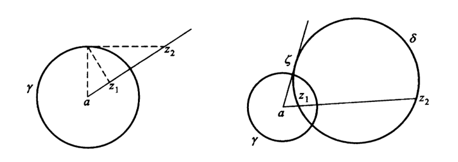
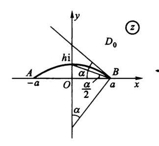
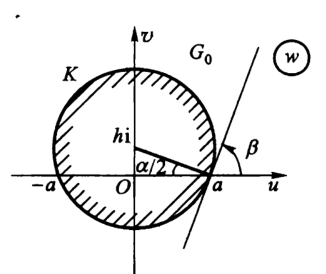
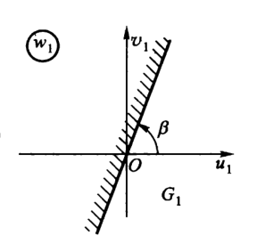

# 复变函数7：共形映射

## 解析变换

### 保域性

- **保域定理**：若 $w = f(z)$ 在区域D内解析且不为常数，则 $G = f(D)$ 也是一个区域
  - **证明**：
    - **先证明内点性**
    - 取G内一点 $w_0 = f(z_0)$，**证明 $\forall w_*\to w_0，f(z) = w_*$ 在D内有解**
    - 添项得 $(f(z) -w_0) + (w_0-w_*) = 0$
      - 由零点孤立性，存在 $O(w_0,\delta)$ 使得前项不为0，从而 $\exist\varepsilon < $ 前项。
      - 再把 $w_*$ 取在 $O(w_0,\varepsilon)$ 内，得到|前项| < |后项|（稳定的模大小关系），从而满足鲁歇定理，整体解的数量等于后项解的数量。
      - 因为后项一定有解，所以整体有解
    - **再证明单连通性**
    - 在D内可以取折线 $z(t)$，由解析性，$f(z(t))$ 必定存在，但是可能是曲线。不过由于解析性，曲线可求长，从而可用折线逼近曲线，所以可以证明单连通
  - **理解**：用鲁歇定理，将 $f(z)$ 连续转为像平面连续
  - **本质**：解析函数的连通性
  - **推论（几个相似的条件）**：
    - $f(z)$ 单叶解析，则保域
      - （单叶性，必定不为常数）
    - $f(z)$ 在扩充复平面内亚纯，且不恒为常数，则保域
      - （广义域上的解析函数）
- **局部单叶性定理**：只要某点解析，且导数不为0，则必定存在一个单叶解析邻域
  - **证明**：解析性得到解析邻域，导数不为0得到单叶性

### 保角性

- **导数的几何意义**
  - **原像平面**：光滑路径转化为一元函数 $z(t)$
    - 切向量为 $z'(t_0)$，倾角为 $\psi = argz'(t_0)$
  - **像平面**：路径的像光滑（无穷可微性，导数必定连续）
    - 切向量为 $w'(t_0) = f'(z_0)z'(t_0)$
    - 倾角为 $\Psi = argf'(z_0) + argz'(t_0)$（乘积旋转性）
  - 设 $f'(z_0) = Re^{i\alpha}$，则 $\Psi-\psi = \alpha$，$\dis\lim\limits_{\triangle z\to 0}|\frac{\triangle w}{\triangle z}| = |\frac{f'(z(t_0))z'(t_0)}{z'(t_0)}| \normalsize = R$
    - **导数值的辐角（旋转角）**：变换 $w = f(z)$ 在任意一条曲线上，任意像点和其原像点的切向量的夹角
    - **导数值的模（伸缩率）**：像和原像中无穷小阶数的比
    - 旋转角、伸缩率具有不变性（导数与路径无关）
- **两条曲线在某点的夹角**：切线的夹角
- **保角点**：$f(z)$ 在 $z_0$ 处
  - 伸缩率不变
  - 任意两曲线的夹角在映射后大小和方向不变
- **解析点保角定理**：解析函数在导数不为0的点保角
  - **单叶保角定理**：函数在单叶解析区域内保角

### 习题

- **直线族变换**：$\begin{cases}A:Re\ z = C_1 \\ B:Im\ z = C_2\end{cases}$，其中这个 $C_1、C_2$ 是可变常量，而不是常量。所以变换可以直接写成 $u+iv = e^{i(C_1+iC_2)}$，这就已经囊括了复平面上的所有的点

### 共形性

- **共形映射**：单叶且保角
  - **非单值解析函数**：局部共形，若跨过分支则不共形
  - **相似性**：像和原像相似
  - **复合传递性**：共形映射复合依然共形
- **邻域共形定理**：解析变换在导数不为0的点的邻域内共形
  - **证明**：局部单叶性定理
- **反函数单叶性、求导性**：单叶解析函数的反函数也单叶解析，且满足反函数求导定理
  - **证明**：首先单叶解析函数无驻点，从而是双射，反函数单叶
    - 由隐函数存在定理，两个分部函数存在连续反函数。因此仿照数分，分式变形即可得到反函数导数

## 分式线性变换

### 复合性

- **分式线性变换（莫比乌斯变换）**：$w = \frac{az+b}{cz+d} = L(z)$（不为常数）
  - **扩充性**：一般在扩充复平面上补充定义，使无穷远点是可去奇点
  - **复合性**：
    - **仿射变换**：$w = kz + h = \rho e^{i\alpha}z + h$
      - **几何意义**：$\alpha$ 旋转、$\rho$ 伸缩、$h$ 平移
      - **局限性**：不能改变顶点的顺序（不能翻转）
    - **反演变换**：$\dis w = \frac{1}{z} = \overline{\frac{1}{(\overline{z})}}$
      - **几何意义**：
        - 共轭：实轴对称
        - 共轭倒数：单位圆周对称
      - **局限性**：只能翻转
- **不动点**：$L(z) = z \red\longrightarrow cz^2 + (d-a)z - b = 0$，最多只有两个

### 共形性

- **分式线性变换在扩充复平面上共形**
- **证明**：
  - **反演变换**：在解析处共形
    - **证明**：
      - 保角性：
        - 定义 两条曲线在无穷远点的交角 $\alpha\Leftrightarrow$ 反演变换下在原点的交角 $\alpha$
        - 定义 0和 $\infty$ 关于单位圆周对称
        - 此时无穷远点也是保角的
      - 单叶性：易得
  - **仿射变换**：均为整函数，且具有共形性
    - **证明**：
      - 整函数：易得
      - 保角性：
        - 在 $z\neq \infty$，易得单叶解析，从而保角
        - 在 $z=\infty$，设 $\lambda = \frac{1}{z}\to 0，\mu = \frac{1}{w}$
          - 则 $\mu = \frac{\lambda}{h\lambda + k}$，从而 $\frac{d\mu}{d\lambda} \to \frac{1}{k}\neq 0$
          - 由解析点保角定理，其保角
      - 单叶性：易得
  - 再由共形复合传递性即可

### 保交比性

- **交比**：$\dis(z_1,z_2,z_3,z_4) = \frac{z_4-z_1}{z_4-z_2}:\frac{z_3-z_1}{z_3-z_2}$
  - **几何意义**：
- **分式线性变换的保交比性**：四点交比不变
  - **证明**：直接算
- **三点确定性**：若已知三个点的分式变换的原像和像，则可以唯一确定分式线性变换
  - **证明**：用保交比性直接算
    - 设 $\dis w_i = \frac{az_i + b}{cz_i + d}$
      - 则 $\dis w_i-w_j = \frac{(ad-bc)(z_i-z_j)}{(cz_i+d)(cz_j+d)}$
    - 交比为 $\dis (w_1,w_2,w_3,w_4) = \frac{w_4-w_1}{w_4-w_2}:\frac{w_3-w_1}{w_3-w_2}$
      - 约分得 $\dis \frac{z_4-z_1}{z_4-z_2}:\frac{z_3-z_1}{z_3-z_2} = (z_1,z_2,z_3,z_4)$

### 保圆周性

- **圆周公式**：$Az\bar{z} + \bar{\beta}z + \beta\bar{z} + C = 0\quad (|\beta|^2 > AC)$
  - **退化性**：$A=0$ 则退化为直线
  - **仿射变换**：把圆周变成圆周、直线变成直线
  - **反演变换**：把A和C、$\bar{z}$ 和 $z$ 的位置改变，依然是圆周或直线
- **确定圆周内部和外部是否颠倒**：
  - 方法一：取点法
  - 方法二：沿圆周取路径，观察区域在左方还是右方
- **周延性**：若存在两个圆周区域，则一定有相应的共形映射

### 保对称点性

- **两点关于圆周对称**：$z_1,z_2$ 在过圆心 $a$ 的同一条直线上，且 $|z_1-a||z_2-a| = R^2$
  - **扩充**：圆心关于无穷远点对称
  - **退化性**：若圆周为直线，则退化为轴对称
- **反演意义**：$a^* = \large\frac{R^2}{\bar{a}}$
- **几何意义**：两点关于 $\odot\gamma$ 对称 $\Leftrightarrow$ 通过两点的任意圆周与 $\odot\gamma$ 正交（交点切线过圆心）
  - **证明**：见几何作图，利用相似三角形即可
  - 
- **保对称点性**：分式线性变换下，“两个圆周对称点的像” 关于 “圆周的像” 对称
  - **证明**：分式线性变换的保角性

### 习题和应用

- **上半平面自映射**：系数行列式 > 0的分式线性变换
  - **分类讨论法**：
    - **实轴**：分式线性变换把实轴变成实轴
    - **象限**：由分式连续性，象限内的点不会脱离象限
    - **方向**：导数 $\dis\frac{dw}{dz} = \frac{\small\begin{vmatrix} a & b \\ c & d \end{vmatrix}}{(cz+d)^2} > 0$，实轴的像和实轴同向，故平面位置相同
  - **算式分析法**：直接对 $Im\ w$ 变形为 $kIm\ z(k>0)$
  - **本质**：分式线性变换具有平面封闭性
  - **推论**：分式线性变换只有半平面自映射（$det>0$）和半平面反映射（$det<0$）两种
    - 若添加条件 $L(i) = 1+i，L(0) = 0$，代入两个点求系数即可
- **上半平面 $\to$ 单位圆**：$\large w = e^{i\beta}\frac{z-a}{z-\bar{a}}$（a为零点的像）
  - **解**：
    - **形状**：由保圆周性，必定是一个分式线性变换
    - **原点**：设 $a$ 的像是原点，则由保对称点性，其关于实轴的对称点 $\bar{a}$ 的像为 $\infty$
    - **待定系数法**：设 $\large w = k\frac{z-a}{z-\bar{a}}$
      - 其像为某个圆
      - 直径的原像是以过 $a、\bar{a}$ 的圆周在上半平面的半圆弧
      - 取实轴上一点代入，发现 $|k|=1$，设 $k = e^{i\beta}$ 即可
  - **推论**：$\beta$ 依赖于该映射的旋转角
    - 代入法求解
    - 旋转角法求解：$\arg w'(a) = \beta - \frac{\pi}{2}$ （?）
  - **推论**：如果改为映射到单位圆外部，分式取倒数即可
- **单位圆 $\to$ 单位圆**：$\large w = e^{i\beta}\frac{z-a}{1-a\bar{z}}$
  - **解**：
    - **形状**：由保圆周性，必定是一个分式线性变换
    - **代入法**：讨论特殊点：无穷远点和零点，得到 $w = k\cfrac{z-a}{z-\frac{1}{(\bar{a})}}$
    - **待定系数**：旋转角法求解：$\arg w'(a) = \beta$
    - 直径的原像是（过 $a、\frac{1}{(\bar{a})}$ 的圆周在单位圆内的圆弧）
- **复合映射**：上半平面 $\to |w-w_0| < R$ 的分式
  - 首先有映射 $\xi = \frac{w-w_0}{R}:\odot_w \to \odot_1$
  - 然后 $w\circ\xi^{-1}$ 复合即可
- 总结：解析表达式 $w = k\cfrac{z-a}{z-b}$
  - 分式线性变换的奇点：无穷远点的原像
  - 分式线性变换的零点：零点的原像
  - 分式线性变换的系数：伸缩率
  - 它们可以完全确定分式线性变换

## 初等共形映射

### 幂函数、指数函数

- **幂函数**：
  - **保角域**：$\Complex - \{0,\infty\}$
  - **共形域**：单叶解析域（角形区域）
  - **几何意义**：将大角形映射成小角形
- **分步复合法求共形映射**
  - **实例**：具有割线段 $\begin{cases} Re\ z = a \\ 0\leqslant Im\ z \leqslant h \end{cases}$ 的上半 $z$ 平面 $\to$ 上半 $w$ 平面。$a+ih\mapsto a$
  - **解**：
    - 割线段平移到虚轴上：$z_1 = z-a$
    - 将上半平面扩大为全平面：$z_2 = z_1^2$
      - 此时下半平面变为右实轴割线，割线段旋转到左实轴上
    - 割线平移到右半实轴上：$z_3 = z_2 + h^2$
    - 带割线的全平面，缩小成上半平面：$z_4 = \sqrt{z_3}$
    - 最后调整位置：$w = z_4+a$
    - 综上，$w = \sqrt{(z-a)^2+h^2}+a$
  - **本质**：将割线作为参照物，应用共形映射的复合传递性
- **分式线性变换调整法**（已知三个点）
  - 首先用 $\xi = [(e^{\frac{\pi i}{4}}\cdot z)^{\frac{1}{3}}]^4$，先把角形区域变为标准角形，然后再升幂扩充成平面
  - 再用交比不变性求分式线性变换，复合即可
- **根式函数**：
  - **保角域**：z平面（其为整函数，导数恒不为0）
  - **共形域**：z平面（其为多值函数，总单叶）
  - **几何意义**：将小角形映射成大角形
- **指数函数**
  - $e^z$：带状区域 $\to$ 角形区域
    - 竖线的像是圆（x不变，即模不变。y周延，则角度周延）
    - 横线的像是角形边（x周延，则模周延。y不变，则角度不变）
  - $a^z$：需要分类讨论，不够初等，不再讨论范围
- **对数函数**
  - $Ln\ z$：角形区域 $\to$ 带状区域

### 复合初等映射

- **圆弧角形**：角边为圆弧的角形（阴阳鱼）
  - 交角为 $\frac{\pi}{n}$ 的两个圆弧构成的有限区域（月牙） $\to$ 上半平面
    - **解**：
      - 首先把圆弧映射成直线（分式线性变换）
      - 然后把角形映射成平面（幂函数）
      - 综上，$w = (k\frac{z-a}{z-b})^n$
  - 上半单位圆 $\to$ 上半平面
    - **解**：上半单位圆其实就是两个圆弧围成的有限区域
      - 变为第一象限：$\xi = k\frac{z+1}{z-1}$
      - 变为上半平面：$w = (-\xi)^2$
  - 相切于a点的两个圆周围成的月牙区域 $\to$ 上半平面
    - **解**：
      - 圆周变为平行直线：$\xi = \frac{cz+d}{z-a}$
      - 月牙变为带状区域 $0 < Im\ \xi < \pi$
      - 变为上半平面：$w = e^\xi$

### 机翼剖面函数

- 机翼剖面可以看成圆弧角形（阴阳鱼形状）
- **机翼轴线变换**：圆弧 $\to$ 单位圆
  - **设点**：在圆弧角形内部取一个圆弧，设坐标系使圆弧关于y轴对称，两端落在x轴上。两个交点设为 $A(-a,0)、B(a,0)$，上半圆弧和虚轴的交点为 $H(0,hi)$
  - **上半弧AB割开的平面** $D_0 \Rightarrow$ **割线平面** $D_1:\arg\xi_1 = \pi-\alpha，(\alpha = 2arctan\frac{h}{a})$
    - $\xi_1 = \frac{z-a}{z+a}$
    -  $\Huge\bs\Downarrow\xi_1$  
    - 首先，两端点可以确定分子分母上的常数。然后，可用两种方法求角度
      - **代入法**：选定 $hi$ 代入得到 $w = -\frac{(a-hi)^2}{a^2+h^2} = -1+\frac{2ahi}{a^2+h^2} = cos(\pi-\alpha)+isin(\pi-\alpha)$，从而得到像。
      - **导数法**：$w' = \frac{1}{2a}$，$argf'(a) = 0$，因此a点处的切线角度不变，而其角度为 $\pi-\alpha$，因此像的角度可以得出
  - **圆周外区域** $G_0:|z-hi| > |AH| \Rightarrow$ **一般半平面** $G_1:\beta-\pi < argw_1<\beta（\beta = \frac{\pi}{2}-\frac{\alpha}{2}）$
    - $w_1 = \frac{w-a}{w+a}$
    -  $\Huge\bs\Downarrow w_1$ 
  - $G_1 \Rightarrow D_1$ （**角形变换**）
    - $\zeta_1 = w_1^2（2\beta = \pi - \alpha）$
  - 综上，$D_0 \overset{\xi_1}{\longrightarrow} D_1 \overset{\zeta^{-1}_1}{\longrightarrow} G_1 \overset{w^{-1}_1}{\longrightarrow} G_0$
    - 复合结果：$w = z+\sqrt{z^2-a^2}$
    - 方程解法：$(\frac{w-a}{w+a})^2 = \frac{z-a}{z+a}$，解出结果 $w(z)$ 即可
      - **理解**：上述三个映射，以及 $D_0\to G_0$ 的映射 $w$，构成一个映射圈。只要寻找一个比较好计算的节点即可
- **推论**：机翼剖面函数的像就是K'
  - **证明**：像平面上和单位圆K相切的圆K'，其原像和圆弧 $AB$ 在a点也相切
    - 再由函数的几何性质，圆 $K'$ 就是圆弧角形（机翼剖面）的像
  - **翼型参数**：
    - 厚度：$d = |BH| = |w_0-hi|$
    - 宽度：$a$
    - 高度：$h$

### 茹科夫斯基函数的单叶性区域

- **茹科夫斯基函数**：$R(z) = \frac{1}{2}(z + \frac{a^2}{z})$
  - （$w = z+\sqrt{z^2-a^2}（D_0\to G_0）$ 的反函数）
- **单叶性区域为圆的外部和内部**
  - **证明**：
    - **标准形式**：因为a对单叶性没有影响，可设 $a=1$
      - 此时 $R(z)$ 把（单位圆外部）映射到（割线平面） $\begin{cases} Re\ z \in [-1,1] \\ Im\ z = 0 \end{cases}$
    - **反演复合**：设 $\eta = \frac{1}{z}$，再由 $R(z)$ 反演变换下还是 $R(z)$，得（单位圆内部）也映射到（割线平面）
    - 综上，$R(z)$ 在 $z = 0、z=\infty$ 都是一阶极点，其余部分解析。共可以分出两个单值解析分支

## 共形映射的同构

### 存在和唯一性定理

- **黎曼存在与唯一性定理**：扩充复平面上的单连通区域D
  - **存在性条件**：
    - 若其边界点不止一点
    - 则有一个D内的共形映射 $w=f(z)$，把D共形映射成单位开圆 $C:|w|<1$。
  - **唯一性条件**：
    - 若 $f(a) = 0$，$f'(a)$ 是正实数
    - 则这种函数只有一个（**导数是实数**）
- **推论**：
  - **唯一性条件的几何意义**：a映射为单位圆的圆心，a点切向量的旋转角为0
    - 导数为实数，其虚部为0，从而无旋转角
  - **唯一性条件的一般形式**：$f(a)=b，f'(a)=\alpha$ 是正实数
    - 此时 $D，C$ 都是一般的单连通区域，$a\in D，b\in C$
  - **唯一性条件的有界区域形式**：$f(a)=b，f'(\xi)=\eta$
    - 此时 $D，C$ 都是边界为周线的区域，$\xi，\eta$ 分别是两区域的边界点
  - **唯一性条件的三点形式**：$f(\xi_i) = \eta_i，(i=1,2,3)$
    - 此时 $D,C$ 都是边界为周线的区域，$\xi_i,\eta_i$ 均为两区域上绕行方向一致的边界点
- **存在性证明**：略
- **唯一性证明**：
  - 反设不唯一，存在 $w_1 = f_1(z)$ 也把 $D$ 映射成单位圆 $C$
  - 因为 $f_1(z)\neq f(z)$，所以存在置换映射 $w_1 = \varPhi(w)$
    - $\varPhi = f_1\circ f^{-1}$，由复合传递性，其单叶解析
    - 由 $f、f_1$ 的题设性质得 $\varPhi(0)=0，\varPhi'(0) = \cfrac{f_1'(a)}{f'(a)}$ 是正实数
  - 由像是单位圆，得 $|w|,|w_1| < 1$，正反函数均满足Schwarz引理（压缩映射性）
    - $|\varPhi(w)| = |w_1|\leqslant |w|$，$\varPhi^{-1}(w_1) = |w|\leqslant |w_1|$
    - 即模相等，从而 $\varPhi(w) = e^{i\alpha}w$
  - 再由 $\varPhi'(0)$ 是正实数，得 $e^{i\alpha} = 1$
  - 从而 $\varPhi(w) = w$，即 $f_1(z) = f(z)$（**证毕**）
- **理解**：
  - 单位开圆的置换映射，其正反映射均是压缩映射，从而不等号互包得模相等，是旋转变换
  - 导数是正实数，则旋转角度为0，从而置换是恒等置换，从而唯一
  - 在推论中，可以再复合一个单位圆共形映射，化为单位圆情况。
- **弱刘维尔定理**：z平面上的解析函数 $f(z)$，若其像不取某条简单弧 $\gamma$ 上的值，则为常函数
  - **证明**：
    - 首先设 $m = \varphi(w)$，定义域是 $\Complex - \gamma$（非整个z平面，不是整函数）
      - 由黎曼存在定理，函数存在且共形（单叶解析），不是常数
      - 它的像是单位开圆，有界
    - $\varphi$ 的定义域和 $f$ 的值域相等，从而可设 $w = f(z)$，则 $m = \varphi(f(z))$，此时变为有界整函数
      - 由刘维尔定理，其为常函数。但是 $\varphi$ 单叶，所以只能是 $f$ 为常函数
  - **理解**：有界非整函数 $\varphi$ 复合后更换定义域，从而变为整函数
    - 但仍保持单叶性不变，从而常数性转移到另一个函数上
  - **本质**：

### 边界对应定理

- **边界对应定理**：
  - 若
    - 有界单连通区域D、G，周线分别为 $C、\Gamma$
    - 存在共形映射 $w=f(z):D\to G$。
  - 则：
    -  $f(z)$ 可以连续延拓成 $F(z)$，使D内 $F(z) = f(z)$
       - 其在D的闭包上连续
       - 其在周线 $C$ 上是单值连续双射
  - **证明**：略
  - **本质**：共形导出的连续延拓性
- **边界对应逆定理**：
  - 若：
    - $f(z)$ 在D内解析，在C上连续
    - 周线上是单值双射
  - 则：
    - $f(z)$ 在D内单叶，从而把D共形映射成G
  - **证明**：只需单叶性即可
  - **原像平面**
    - 设 $w_0\in G$
      - 由辐角原理，$C$ 内 $f(z)-w_0$ 的零点数量等于其沿周线一圈的辐角
        - $N(f(z)-w_0,C) = \cfrac{1}{2\pi}\triangle_\Gamma\arg(w-w_0)$
      - 再因为是边界，所以旋转角为 $\pm2\pi$，从而 $f(z)-w_0$ 在D内只有一个根
    - 设 $w_0\notin G$，则辐角原理得到D内无根
  - **像平面**
    - 设 $w_1\in \Gamma$，反设在D内有根，则有 $f(z_1) = w_1$
      - 因为D是区域，所以 $z_1$ 是内点。由保域定理，$w_1$ 也是内点，和周线矛盾
      - 所以必须在D内无根，即周线映射到周线
    - 综上，$f$ 在 $D$ 内单叶
  - **理解**：
  - **本质**：彰显了解析和单叶的关系，是很有意义的定理

### 习题

- $w = z^2$，表示成极坐标：$w = \rho e^{i\varphi} = r^2e^{2i\theta}$。则圆周 $r=cos\theta$ 的像变成心脏线 $\rho = cos^2\frac{\varphi}{2} = \frac{1}{2}(1+cos\varphi)$