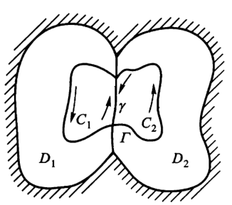
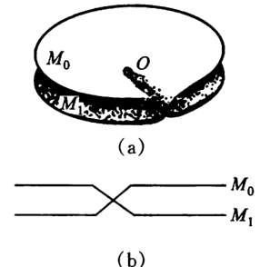
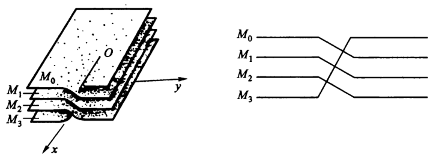
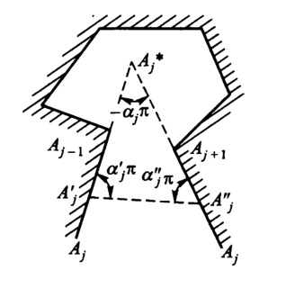

# 复变函数8：解析延拓

- **解析原理**：在延拓函数的时候，不能破坏函数的解析性
  - 它保证了解析延拓的唯一性
- **连续原理**：在延拓函数的时候，不能破坏函数的连续性

## 解析函数的扩充

- **解析延拓**：若 $f(z)$ 在D内解析，若存在一个包含D的区域G，使扩充的函数 $F(z)$ 在G内解析，则称 $f(z)$ 可以解析延拓到G内
  - $F(z)$ 称为 $f(z)$ 在G内的解析延拓
  - **解析延拓的唯一性**：解析函数的内部唯一性
  - **例子**：$f(z) = \sum\limits^{\infty}_{n=0} z^n(D:|z|<1) = \frac{1-z^n}{1-z}$，故 $F(z) = \frac{1}{1-z}$ 是在去掉奇点 $z=1$ 的区域内的解析延拓（虽然形式不一样）
- **解析函数元素**：区域和区域内的单值解析函数，记为 $\{D,f(z)\}$
  - **恒等**：区域重合、其上的函数值对应相等
- **相交区域的解析延拓原理**：两个存在公共区域的解析函数元素
  - 若存在公共区域 $d_{12}$，其上的函数对应相等
  - 则
    - $\{D_1+D_2,F(z)\}$ 也是一个解析函数元素
    - $F(z) = \begin{cases} f_1(z)，当z\in D_1-d_{12} \\ f_2(z)，当z\in D_2-d_{12} \\ f_1(z)=f_2(z)，当z\in d_{12}\end{cases}$
  - **证明**：显然
  - **互为直接解析延拓**：夹挤可得唯一性
    - **单值性**：可以用一个单值解析函数表出
  - **例子**：$\begin{cases} f_1(z) = \sum\limits^\infty_{n=0} (-1)^n(z-1)^n\ (z\in D_1:|z-1|<1) \\ f_2(z) = \sum\limits^\infty_{n=0} (-1)^n(\frac{z-i}{i})^n\ (z\in D_2:|z-i|<1)\end{cases}$
- **解析延拓链**：解析函数元素集 $\{D_1,f_1(z)\},\{D_2,f_2(z)\},...,\{D_n,f_n(z)\}$ ，它首尾相交。
  - **互为间接解析延拓**：隔项的解析函数元素区域不交叠
  - **多值性**：此时第一个和最后一个函数，不互为直接解析延拓，但存在公共像。所以此时解析延拓链可表示成一个多值函数

### 幂级数延拓法

- **幂级数延拓定理**：任意解析函数均可用幂级数求出所有解析延拓
- **证明**：解析函数元素 $\{D,f(z)\}$ 可展成幂级数 $f_1(z) = \sum\limits^\infty_{n=0}c_n^{(1)}(z-z_1)^n$
  - 若收敛半径为 $+\infty$，则幂级数可以表示函数在z平面上的所有点，因此幂级数本身就是 $f(z)$ 的解析延拓
  - 若收敛半径为 $R_1$，因为收敛圆 $\Gamma_1$ 上存在不收敛点，所以 $\Gamma_1$ 超出D外（一段弧或几个点）
    - 然后再选取 $\Gamma_1$ 内点 $z_2$ 进行展开
      - 收敛圆为 $\Gamma_2$，收敛半径为 $R_2$
      - $c_n^{(2)} = \frac{1}{n!}f_1^{(n)}(z_2)$
      - 由于解析范围改变了，两个函数的形式一般也不相同了。所以用 $f_1$ 进行展开
    - 此时分两种可能性（Taylor展开只要遇到一个奇点，其就不能继续扩大收敛圆。但此时仍然可能存在一些方向上可以解析延拓）
      - 若沿着 $z_1z_2$ 的方向不能进行解析延拓，则 $R_2 = R_1-|z_1-z_2|$，从而两圆周切点是两个幂级数的奇点。而 $\Gamma_2$ 上其它的点均收敛
      - 若沿着 $z_1z_2$ 的方向可以进行解析延拓，则 $R_2 > R_1-|z_1-z_2|$，从而产生了 $f_1(z)$ 的直接解析延拓 $f_2(z)$
    - 取遍所有的 $z_2$，即可以得到 $\{\Gamma_1,f_1(z)\}$ 的所有解析延拓
    - 在 $\Gamma_2$ 中再取点展开……最终得到 $\{D,f(z)\}$ 的所有解析延拓
- **理解**：看绿字吧
- **本质**：就是圆链法。由于收敛圆之间存在重合区域，因此可不断将解析性质传递
- **实例**：任意方向都不能解析延拓的函数：$f(z) = \sum\limits^\infty_{n=1}z^{2^n}$ 在单位圆内
  - **证明**：首先易得 $z=1$ 是奇点
    - 再由 $f(z) = z^2+...+z^{2^n} + f(z^{2^n})$，所以 $f(z)$ 在 $\{z\mid \forall n，z^{2^n} = 1\}$ 上均发散，该集合均为奇点
    - $n\to\infty$ 时这些点稠密分布在单位圆上（**证毕**）
  - **理解**：幂函数的n越大，角形扩大的倍数越大，从而被映射到一个点的原像越多
  - **本质**：解析延拓的终点
- **应用**：
  - **取点延拓**：就是上面的方法，在圆中不断取点得到圆链
  - **取曲线延拓**：沿着不经过奇点的曲线取圆链，取遍所有的曲线即可
- **解析延拓对函数定义的补充**：前面知道，$\sin x$ 既可以用复平面上的幂级数定义，也可以用直角三角形与弧度制定义。但前者的定义域是整个复平面，后者的定义域只有正实轴。因此为了将这两个定义等价起来，就需要将后面定义的函数解析延拓到整个复平面上。由解析延拓的唯一性，我们就良定义了复平面上的 $\sin x$

## 对称原理

- **Painleve连续延拓原理**：两个解析函数元素不相交，但存在公共边界。记去掉公共边的开弧为 $\Gamma_1、\Gamma_2$
  - 若函数在自己的区域和开弧上连续，且沿开弧两函数相等
  - 则解析延拓可以相加
  - **证明**：条件已知连续。只要证明 $F(z)$ 沿区域内部的周线 $C$ 积分为0，则由莫雷拉定理得到 $F(z)$ 解析
    - 若周线全部位于区域内，则柯西积分定理得积分为0
    - 若周线跨过公共边，则分割为复周线，在各自区域积分为0（**证毕**）
  - **互为透弧解析延拓**：$\\ \quad$ 
- **Riemann-Schwarz对称原理**：以x轴为透弧，分属上下半平面，且关于x轴对称的两个区域 $D,D^*$
  - 若 $f(z)$ 在 $x$ 轴透弧 $S$ 上取实值，在 $D+S$ 上解析，
  - 则 $\{D^*,\overline{f(\overline{z})}\}$ 是 $\{D,f(z)\}$ 的透弧直接解析延拓
  - **证明**：设 $F(z) = \begin{cases} f(z)，z\in D \\ \overline{f(\overline{z})}，z\in D^* \end{cases}$
    - **内部解析性**：$F(z)$ 在 $D^*$ 内尝试求导得 $\lim\limits_{z\to z_0} \frac{\overline{f(\overline{z})} - \overline{f(\overline{z_0})}}{z-z_0} = \overline{\lim\limits_{z\to z_0} \frac{\overline{f(\overline{z})} - \overline{f(\overline{z_0})}}{\overline{z}-\overline{z_0}}} = \overline{f'(\overline{z_0})}$，即 $\overline{f(\overline{z})}$ 解析
    - **边界连续性**：由共轭易得
    - **公共相等性**：公共边界上共轭相等
    - 综上，满足潘勒韦连续延拓原理（**证毕**）
  - **推论（保共形性）**：单叶解析函数的对称原理在被共形映射后依然成立
    - **证明**：仿照上面步骤即可
- **一般对称原理**：
  - 关于x轴对称 $\Rightarrow$ 关于圆弧或直线段对称
  - 在区域内单叶解析，在透弧上连续
  - **证明**：

### 习题

- 求共形映射使原像平面变为共轭对称平面

## 完全解析函数

- **一般解析函数 $F(z)$**：解析函数元素的集合（不是全集）
- **完全解析函数 $F(z)$**：一个解析函数，包含任意解析函数元素的所有解析延拓（是全集）
  - **存在区域 $G$**：$F(z)$ 的定义域
  - **自然边界**：G的边界（由所有解析函数元素的所有奇点组成）
  - **性质**
    - 唯一性
    - 不可延拓性
    - 自然边界不连续性

### 单值性定理

- **多值判定**：
  - **路径判定法**
    - 若沿着两条路线得到的解析延拓，其值不同
    - 则完全解析函数是多值的
  - **理解**：
  - **支点判定法**
    - 若沿着支点一圈，末端得到的解析延拓和原函数不同
    - 则完全解析函数是多值的
  - 支点法用于理解，路径法用于解题
  - **实例**：
    - 三个区域：$\begin{cases} D_1:|z-1|<R \\ D_2:|z-w|<R \\ D_3:|z-w^2|<R \end{cases}（w是三次单位根，R\in (\frac{\sqrt{3}}{2},1)）$
    - 对 $f(z) = \sqrt{z}$ 进行解析延拓
      - **支点法**：圆链绕一周，绕支点 $z=0$ 一周，因此可得解析函数相反
      - **路径法**：
        - 将 $\{D_1,\sqrt{z}\}$ 沿 $D_1D_2D_3D_1$ 延拓：取对称函数即可
          - $\begin{cases} D_2：w = e^{\large\frac{2\pi i}{3}}z，f(w) = e^{\large\frac{\pi i}{3}}\sqrt{z}（旋转对称） \\\\ D_3：w = \overline{e^{\large\frac{2\pi i}{3}}z}，f(w) = \overline{e^{-\large\frac{\pi i}{3}}\sqrt{z}}（共轭对称） \\\\ D_1: w = ，f(w) = e^{-\large\frac{\pi i}{3}}\cdot \overline{e^{-\large\frac{\pi i}{3}}}\cdot \overline{\sqrt{z}} （旋转对称）\end{cases}$
          - 平方根函数的共轭就是相反数
          - 最终所得解析函数元素为 $\{D_1,-\sqrt{z}\}$
        - 同理，将 $\{D_1,\sqrt{z}\}$ 沿 $D_1D_2D_3D_1$ 延拓，所得解析函数元素为 $\{D_1,-\sqrt{z}\}$
      - 从而是二值的完全解析函数
        - 自然边界是二连通区域（挖去原点、无穷远点）
- **单值性定理**：在扩充z平面上的单连通区域 $D$ 内解析的函数单值
- **证明**：设连接D内任意两点 $a,b$ 的两条路径，构成一条周线 $\gamma$
  - **若周线不包含边界点**：
    - **以直代曲**：
      - 有限覆盖，可用有限个开圆覆盖周线区域
      - 开圆内可以Taylor展开，则圆内为单值解析函数。在圆内可以不定路径积分
      - 圆链法，将弧变成弦，从而得到多边形P
    - **三角形分割**：
      - 假设P内多值，将P分割成三角形，则必定有一个三角形绕过支点集合
      - 对三角形不断中线分割，得到闭区间套，收缩成一点 $\alpha$
      - 由解析的邻域性，构造 $\alpha$ 邻域解析圆，从而闭区间套只需有限次即可得到解析区域
      - 再由支点是奇点，从而解析圆内的解析延拓是单值的，和多值矛盾。
    - **理解**：闭区间套定理 + 反证法
    - **本质**：单连通解析，即不包含支点，从而单值
  - **若周线包含边界点**
    - D的形状：
      - 因为单连通，故边界连续
      - 由于周线不能穿过边界，所以边界必须在周线内部
      - 再因为 $a,b$ 在区域内，所以D只能是无穷远点的邻域
    - 设 $\gamma$ 外部有个圆 $C$，则洛朗展式在C上和C外部单值解析
    - 然后构造 $C$ 和 $\gamma$ 的复周线，因为C上单值解析，所以两个复周线的解析延拓路径末尾值相同。
    - 复周线内无边界点，仿照上面证明即可
- **多值解析函数的解析延拓定义**：
  - 围绕某点的充分小的圆周，对完全解析函数进行延拓，末尾值和起始值不同，则该点称为**支点**，完全解析函数称为**多值函数**
  - 限制延拓的区域，得到首位相同的延拓值，则该区域内的函数值（像点集）称为**单值解析分支**
- **奇点分类定理**：某一支内的单值性奇点不为另一支的单值性奇点
  - **证明**：
  - **实例**：$f(z) = \frac{1}{z}\ln\frac{1}{1-z}，D:0<|z|<1$
    - 原点是主值支的可去奇点，其它支的一阶极点
    - **证明**：$\dis f(z) = \frac{1}{z}\sum\limits^\infty_{n=1} \frac{z^n}{n!} + 2k\pi i$，主值支上 $k = 0$，其它支 $k\neq 0$

### 黎曼面

- **黎曼面**：通过n个单叶区域的像平面的粘合，使z平面上的多值函数变为Riemann面上的单值函数
- **透弧解析延拓法**：取实轴为支割线
  - $w = z^{\frac{1}{2}}$：支点 $z=0,\infty$
    - 首先构造两个平面 $M_0、M_1$，分别对应 $(0,2\pi)、(2\pi,4\pi)$
    - 均用实轴作为支割线割开两平面
    - 把 $M_0$ 的上岸、下岸和 $M_1$ 的下岸、上岸粘合 $\\$ 
    - $\sqrt[n]{z}$ 同理 $\\$ 
  - $w = Ln\ z$：支点 $z=0,\infty$
    - 无穷多个像平面，x方向上无限长，y方向上长度为 $2\pi$
    - 取正实轴为支割线
    - 上下岸粘合
  - $w = \sqrt[3]{(z-a)(z-b)}$：支点 $z=a、b、\infty$
    - 三个像平面，两岸比较复杂，但是仍然一一对应
    - 支割线：线段ab + b的任意一条射线
    - 粘合取值相同的两岸即可
- **黎曼面上的展开式**：收敛圆不同部分在不同叶上（支点不在收敛圆内）
- **多值解析判定**：多值函数的单值分支是否互为解析延拓
  - **等价条件**
    - 支割线处首尾相接
    - 存在可以粘合的黎曼面）
  - **反例**：
    - 一个多值函数：$w = \sqrt{z}$，其解析
    - 两个单值函数：$w = \sqrt{z^2} : \begin{cases} w = +z \\ w = -z \end{cases}$，不互为解析延拓

## 多角形的共形映射

- **Christoffel-Schwarz变换**：
  - 设
    - 有界 $n$ 角形 $P_n$，顶点为 $A_n$，顶角为 $\alpha_n\pi（0<\alpha_j<2）$（位置均已知）
    - 函数 $w = f(z)$ 把上半平面共形映射成 $P_n$（可任意构造）
      - （共形映射必定单叶解析，否则像会重叠）
    - $A_n$ 的原像为 $a_n$
  - 则有
    - $f(z) = C\int^{z}_{z_0} (z-a_1)^{a_1-1}(z-a_2)^{a_2-1}...(z-a_n)^{a_n-1}dz + C_1$
    - $\sum\limits^n_{j=1}\alpha_j = n-2$（多边形内角和公式）
  - **证明**：
    - 根据黎曼存在唯一性定理，$f(z)$，只要确定边界上三个点的像与原像，就满足存在和唯一性。
    - 可以取 $f(x)$ 在实轴上一一对应，则可以应用共形映射的对称原理。再因为实轴上包含所有顶点原像，所以对称原理可以在每个边上应用
    - 假设做了任意多次解析延拓，得到完全解析（无穷多值）函数 $F(z)$。则 $f(z)$ 变成一个单值解析分支
    - **两个单值解析分支的关系**：
      - 因为都是上半平面，所以应当进行偶数个对称解析延拓（偶数个对称变换）
      - 因此对称变换简单可以分解为平移和旋转（没有对称），所以有关系式 $f^{**}(z) \equiv e^{i\beta}f^*(z) + b$
    - **导数对数留数在普通点的性质**
      - 函数单叶解析，则其导数也单叶解析，从而 $f'(z)$ 在上半z平面不为0
      - 因此，导数的对数留数函数 $\varphi(z) = \frac{f''(z)}{f'(z)}$ 在上半z平面单叶解析
      - 由对称性，$\varphi(z)$ 对解析延拓也都是单值的
      - 再由不同分支的关系式得 $\varphi^{**}(z) = \frac{f^{**''}(z)}{f^{**'}(z)} = \frac{f^{*''}(z)}{f^{*'}(z)} = \varphi^*(z)$，所以 $\varphi(z)$ 的值与分支选取无关
      - 因此，除了 $a_j$ ，$\varphi(z)$ 在其余的点都是单值解析的
    - **导数对数留数在顶点原像的性质**
      - 角形变换（变为平角）：$m  = g(z)= (w-w_j)^\frac{1}{\alpha_j}$
      - 原点平角变换：$m = g(z) = [f(z)-w_j]^\frac{1}{\alpha_j}$
        - 因为是平角（上半平面），且单叶解析，所以对称原理得到整个邻域 $O(\alpha_j,\delta)$ 单叶解析，所以 $g(z)$ 可展成Taylor级数 $(c_0 = 0)$
        - 单叶解析，所以无驻点，任意阶导数不为0
      - m展成Taylor级数，再反函数变形：
        - $f(z) = w_j + (z-\alpha_j)^{\alpha_j}[c_1+c_2(z-\alpha_j)+...]^{\alpha_j} \\ = w_j+(z-\alpha_j)^{\alpha_j}h(z)$
      - $h(z)$ 邻域解析，可展成Taylor级数（消去幂）
      - 求导并计算，得到 $\varphi(z)$ 的级数形式，最终转化为洛朗展式，有一阶极点 $z=\alpha_j$，留数为 $\alpha_j-1$
      - 从而总共有n个一阶极点 $\alpha_j$
    - **导数对数留数在无穷远点的性质**
      - 无穷远点是 $(a_n,a_1)$ 的内点，由共形性 $f(z)$ 在无穷远点解析（可去奇点），展成洛朗展式计算得到 $\varphi(\infty) = 0$
    - $\varphi(z)$ 减去所有主要部分，得到 $\psi(z)$。它是整函数，因此是常数
      - 一阶极点处为常数 $C$
      - 无穷远点处为常数0
    - **对数留数积分**：任意路径，$lnf'(z) = \int_C \varphi(z) = \sum\limits^n_{j=1}(\alpha_j-1)ln(z-\alpha_j) + C$
      - 所以 $f'(z) = e^{lnf'(z)}$
      - 积分导函数，最终得到结果（**证毕**）

### 角形退化

- **交角定理**：两条相交直线，在无穷远点的交角 = 有限点交角的反号
  - **证明**：
    - 已知曲线在无穷远点的交角，等于反演变换下在原点的交角
    - 反演变换，得到圆弧角形。由保角性 + 圆弧对称性，两端点处夹角反号
- 角形退化
  - **原像是无穷远点（消去该因子）**
    - 分式线性变换：$\zeta = -\frac{1}{z} + a_n'$ （$a_n\to a_n'$ 可设定为任意常数）
    - 经过变形（把常数都塞进C里），最终可以消去 $(z-a_n)^{a_n-1}$ 因子。
  - **广义多角形（拆为两有限因子）**：有一个或几个顶点在无穷远点
  - 
  - 在无穷远点中截取一段，变为 n+1 角形，并作出相应的 $f(z)$
  - 由反号性 + 三角形内角和 $\alpha_j' + \alpha_j'' = 1 + \alpha_j$
  - 再将两个截点 $\to \infty$，则可以近似看成 $\alpha_j$，因此两个因子合并，指数由上式化为 $\alpha_j' + \alpha_j'' -2 = \alpha_j-1$，与积分式等价，因此成立

### 例子

- **广义三角形**：$-\frac{\pi}{2} < x < \frac{\pi}{2}，y>0$
  - $A_1 = -\frac{\pi}{2}，A_2 = \frac{\pi}{2}，A_3 = \infty$
  - $\alpha_1 = \frac{1}{2}，\alpha_2 = \frac{1}{2}，\alpha_3 = 0$
  - 可以随便设三个点，$a_1 = -1，a_2 = 1，a_3 = \infty$
  - 从原点开始积分 $f(z) = C\int^z_0 (z+1)^{-\frac{1}{2}} (z-1)^{-\frac{1}{2}}dz + C_1 = Carcsin\ z + C_1$
  - 像和原像都已知，代入求解系数即可
- **求第四个点**：首先已知角形，若设出三个点并建立对应关系，则可以根据角形平面的对称关系和透弧的对应关系，得到原像关于弧的对称关系，从而得到第四个点

