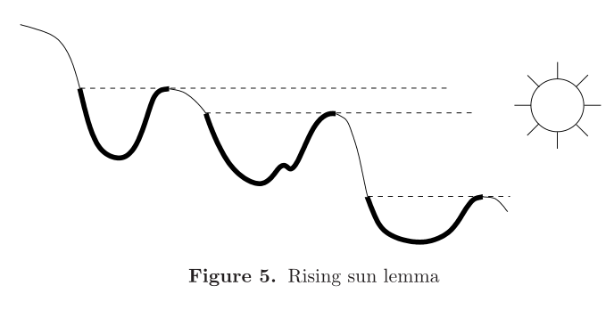

# 微分理论

- **核心思想**
  - 有界变分函数：可微
  - 单调连续函数：强可微
  - 单调连续有界函数：导数可积
  - 绝对连续函数：可积

## 平均导数

### 类上限函数

- **Hardy-Littlewood最大函数**：$f^*(x) = \sup\limits_{x\in B}\dfrac{1}{m(B)}\int_B |f(y)|dy$
  - $B$ 是包含 $x$ 的所有开球
  - 最大函数的定义仅依赖于 $f$
  - **类上限函数性**：类似数分中的 $F(x) = \dis\int^x_0 f(t)dt$
- **（定理1.1）最大函数的性质**
  - 平均值性
  - 可测性
    - **证明**：由平均值性，最大函数的值域限制原像集一定是一个球，由球可测性即得函数可测
  - 积分-测度不等式：$\alpha·m(E\{f^*(x)>\alpha\}) \overset{}{\leq} 3^d·\|f\|_{L^1(R^d)}$
    - **证明**：
      - 由平均值性，得 $\forall E_\alpha$ 中，总存在 $B_x$ 使得 $f^*(x)>\alpha$，球测度转化为积分
      - $E$ 上的紧集可被有限数量开球族覆盖，子堆砌三角不等式，测度转化为球测度
      - 最后紧集放缩为 $R_d$ 即可
    - **本质**：
    - **引论**：Tchebychev不等式 $m(E_\alpha) \overset{}{\leq} \frac{1}{\alpha} \int f$
      - **证明**：区间不等式 + 下界不等式
        - $\int f(x)dm(x) \geq \int\limits_{\{x>\alpha\}} f(x)dm(x) \geq \alpha m(E_\alpha)$
      - **理解**：上面是最大函数值域限制，这里是被积函数值域限制
  - a.e. 有界性：
    - **证明**：积分-测度不等式右侧有界，左侧函数值 $\alpha\to \infty$，则测度 $\to 0$
- **（引理1.2）子堆砌三角不等式**：任意有限数量开球族 $\{B_1,...,B_N\}$，存在子堆砌满足 $m(\mathop{\bigcup}\limits^N_{i=1} B_i) \overset{}{\leq} 3^d\sum\limits^n_{k=1} m(B_{j_k})$
  - **证明**：
    - 两个相交球，小球一定被大球的同心三倍半径球所覆盖（小球直径 + 大球半径）
    - 首先取出半径最大的球以及和它相交的球（相当于取出了同心三倍球），然后以此类推，最多N次可以得到子堆砌（所有的球都不相交时，重复N次）
      - 设子堆砌有n个，三倍同心球为 $\bar{B}$
    - 同时，原球族内任意球必定和子堆砌中元素相交，从而 $m(\mathop{\bigcup}\limits^N_{i=1} B_i) \overset{}{\leq} m(\mathop{\bigcup}\limits^n_{k=1})\bar{B}_{j_k}$
      - 再由三角不等式 + 半径与体积的比例关系 + 测度比例性 得子堆砌三角不等式
  - **本质**：三倍同心球覆盖 + 测度比例性

### 勒贝格导数

- 一维导数的多个意义
  - 极限小区域的平均值（拓展到勒贝格导数）
  - 极限小区域的斜率/增长率（拓展到方向导数）
- **（定理1.3）勒贝格微分定理（平均可导性）**
  - 可积函数 $f$ 满足 $\lim\limits_{\substack{m(B)\to 0 \\ x\in B}} \dfrac{1}{m(B)} \dis\int_B |f(y)|dy = f(x) \ae$
  - **证明**：由紧支连续函数的稠密性，存在 $g$ 与 $f$ 相邻
    - 由连续函数的Riemann可积性，g的上式点态成立
    - 添项g + 取三角不等式得 $|左式-右式| \overset{}{\leq} (f-g)^*(x) + |g(x)-f(x)|$
      - 设三项的值域原像限制集分别为 $E_\alpha、F_\alpha、G_\alpha$，则有 $E_\alpha\subset (F_\alpha\cup G_\alpha)$
      - 两边取积分
        - 左项由积分-测度不等式 + 稠密性得 $F_\alpha$ 测度极小性
        - 右项由Tchebychev不等式 + 稠密性得 $G_\alpha$ 测度极小性
      - 从而 $E_\alpha = \{x\mid |左项-右项|>\alpha\}$ 测度为0，从而 a.e.平均可导
  - **理解**：
    - 由三角不等式，引出具有稠密性的中介 $g$ 和 $\varepsilon$，化稠密性为收敛性
    - 再通过积分不等式，把积分值关系转到测度关系上，才能得到 a.e. 关系
  - **本质**：极限小区域的均值，没有方向性
    - **重心**：取到均值的点 $x$
- **可积性**：$R^d$ 上可积
- **局部可积性**：对任意球，$f(x)\chi_B(x)$ 可积
  - **局部可积函数空间**：$L^1_{\loc}(R^d)$
- **（定理1.4）$L^1_{\loc}(R^d)$ 上函数平均可导性**：取 $g$ 在球内即可

### 可测集的密度

- **可测集点的勒贝格密度**：$\lim\limits_{\substack{m(B)\to 0 \\ x\in B}} \Large\frac{m(B\cap E)}{m(B)} $
  - **可测集E的勒贝格全密点**：密度为1（依赖于所选可测集）
- **（推论1.5）可测点的全密性**：可测集中的点 a.e. 是其全密点，其补集中 a.e. 不是其全密点（a.e.以外指的是边界点）
  - **证明**：
    - 首先，可测集可被球 a.e. 覆盖
    - 测度是特征函数的积分，其 a.e. 平均可导。
    - 平均可导即存在重心，无论如何逼近，最终都收敛到重心上，所以密度总为1。而补集中总有办法收敛到外点上，所以密度不为1
  - **本质**：取勒贝格密度的逼近过程，即为规则收敛的过程
- **函数的勒贝格集合 $Le$**：满足平均可导性的集合（重心的集合）
- **（推论1.6）局部可积函数平均可导性**：若函数在 $R^d$ 上局部可积，则 $Le_f = R_d \ae$
  - **证明**：
    - 设 $r$ 为有理数，构造 $|f(y)-r|$，其仍为局部可积函数，非重心点为零测集
      - 由 $Q$ 可数性，所有 $r$ 的非重心点并集依然是零测
    - 由有理数集稠密性，对于非重心点的补集中 $\forall \bar{x}，\exist r，使得 |f(\bar{x})-r|<\varepsilon$
      - 再由 $B内f(y)、f(\bar{x})、r$ 的三角不等式，化为积分形式可得 $\overline{\lim\limits_{\substack{m(B)\to 0 \\ \bar{x}\in B}}} \frac{1}{m(B)} \int_B |f(y)-f(\bar{x})|dy < 2\varepsilon$，从而非重心点并集外均为重心
  - **理解**：思路和勒贝格可积定理一样，和定理1.4一个意思（前者是就平均可导性而言的，这里是就勒贝格集合的结构而言的）
  - **本质**：用 $r$ 替换 $g$

### 规则收敛

- **集族 $U_\alpha$ 规则收敛到 $\bar{x}$**：
  - $\exist C>0，\forall U_\alpha，\exist B$ 满足 $\bar{x}\in B，U_\alpha\subset B，m(U_\alpha)>Cm(B)$
  - 且极小和极大的 $U$ 均存在
  - **本质**：集族在 $\bar{x}$ 上具有有界同轴性
- **（推论1.7）规则收敛定理**：
  - 局部可积函数 $f$ 满足 $\dis\lim\limits_{\substack{m(U_\alpha)\to 0 \\ x\in U_\alpha}} \frac{1}{m(U_\alpha)} \int_{U_\alpha} |f(y)|dy = f(\bar{x})$
  - **证明**：作差即可
    - $\triangle I(U_\alpha)\overset{}{\leq} \frac{1}{c}\triangle I(B) < \varepsilon$
  - **本质**：任何规则收敛集族均可充当平均导数的积分域

## 良核收敛

- **积分卷积**：$(f*K_\delta)(x) = \int_{R^d} f(x-y)K_\delta(y)dy$
  - 偏移函数 $f(x-y)$，偏移量 $y$，偏移量积分开关 $K_\delta(y)$
  - 积分中考虑所有的偏移量，如果积分开关是良核，则最终收缩于偏移量为0的点，即收敛于恒等映射
- **良核函数**：$K_\delta$
  - 积分为1
  - 绝对值积分有界
  - 核 $\delta\to 0$ 时，正轴上绝对值积分 $\to 0$
- **恒等收敛性**：二元映射 $f\mapsto f*K_\delta$ 关于 $\delta$ 收敛到恒等映射
  - $f$ 的连续点集上，$(f*K_\delta)(x)\to f(x)（\delta\to 0）$
  - 扩充到勒贝格集合上：
    - $K_\delta$ 强化为 **恒等式的近似**
      - 积分为1
      - 极小区间有界不等式：$\forall \delta>0，|K_\delta(x)|\overset{}{\leq} \large\frac{A}{\delta^{d}}$
      - 无穷区间有界不等式：$|K_\delta(x)| \overset{}{\leq} \frac{A\delta}{|x|^{d+1}}$
    - 原条件2：条件2保证在极小区间 $|x|<\delta$ 内积分有界，条件3保证在无穷区间 $|x|>\delta$ 内积分有界
    - 原条件3：条件3即可导出
- **启发函数**：通过连续逼近得到的函数（算是函数列的连续形式，本质是二元映射）
- **狄拉克函数（冲激函数）**：满足 $D(x) = \begin{cases} \infty ，x=0 \\ 0，x\neq 0\end{cases}$，且 $\int_{R^d} D(x)dx = 1$ 的函数
  - **启发式定义**：良核 $K_\delta(x) = \frac{1}{2\delta}，|x|<\delta$，则 $D(x) = \lim\limits_{\delta\to 0} K_\delta(x)$
  - **D充当恒等式近似**：$f*D = \int |f(x-y)D(y)|dy$，权重全部在 $y=0$ 上，此时 $f*D = f$

### 其它恒等式近似例子

- 支撑在单位闭球上的非负有界函数 $\varphi(x)$，积分为1
  - 恒等式近似为 $K_\delta(x) = \Large\frac{\varphi(\frac{x}{\delta})}{\delta^d}$
  - 
- **上半平面的泊松核**：$\mathcal{P}_y(x) = \large\frac{1}{\pi}\frac{y}{x^2+y^2}，x\in R$
  - $\delta = y$
- **热核**：$\mathcal{H}_t(x) = \large\frac{1}{(\sqrt{4\pi t})^d}e^{\frac{-|x|^2}{4t}}$
  - $\delta = \sqrt{t}$
  - $\delta = 4\pi t$，则转化为调制高斯函数
- **圆盘上的泊松核**：$\frac{1}{2\pi} P_r(x) = \begin{cases} \large\frac{1}{2\pi}\frac{1-r^2}{1-2rcosx + r^2}，\normalsize |x|\overset{}{\leq}\pi \\ 0\qquad\qquad\qquad，|x|>\pi \end{cases}（0<r<1）$
  - $\delta = 1-r$
- **费耶核**：$\frac{1}{2\pi}F_N(x) = \begin{cases} \large\dfrac{1}{2\pi N}\dfrac{sin^2(\frac{Nx}{2})}{sin^2(\frac{x}{2})} ，\normalsize |x|\overset{}{\leq}\pi \\ 0\qquad\qquad\quad，|x|>\pi\end{cases}$

### 恒等映射极限

- **（定理2.1）恒等收敛定理**：恒等收敛性 $(f*K_\delta)\to f\pad (\delta\to 0)$ 在 $f$ 的勒贝格集合上 a.e. 成立
  - **证明**：
    - 积分添项得 $(f*K)-f = \int \big[ f(x-y)-f(x) \big]K_\delta(y)dy$
      - 良核的积分为1
    - 原像分解为 $|y|\overset{}{\leq} \delta$ 和 $\sum\limits^\infty_{k=1} \{2^k\delta<|y|\overset{}{\leq} 2^{k+1}\delta\}$
      - 由良核的极小区间有界不等式，前项放缩为 $c\mathcal{A}(\delta)$
      - 由良核的无穷区间有界不等式 + $y>2^k\delta$，后项放缩为 $\sum\limits^\infty_{k=1}\frac{c}{2^k}\mathcal{A}(2^{k+1}\delta)$
      - 由 $\mathcal{A}$ 的极限 + 有界性，原式放缩为 $\varepsilon$（**证毕**）
- **（引理2.2）偏移量性质**
  - 设 $f$ 可积，$x\in Le_f$
    - **偏移量球积分函数**：$\mathcal{A}(r) = \frac{1}{r^d}\int_{|y|\overset{}{\leq} r} |f(x-y)-f(x)|dy（r>0）$
    - 实质是开球定义的积分导数。由平均值性，前项是均值，后项是重心上的定值
  - 则
    - $\mathcal{A}(r)$ 是连续函数
      - 由绝对连续性，零测集上的积分极小，从而 $\mathcal{A}(r+h)-\mathcal{A}(r) < \varepsilon$
    - $\lim\limits_{r\to 0}A(r) = 0$
      - x是积分可微点，从而均值等于重心值
    - $A(r)$ 有界
      - $0<r<1$ 时，由连续性和0极限值得有界
      - $r>1$ 时，由三角不等式，$\mathcal{A}(r)\overset{}{\leq} \frac{1}{r^d}\|f\| + \frac{V(B)}{r^d}|f(x)|$，由可积性得有界
        - 因为 $r$ 无界，所以无界偏移量积分 $\int_{|y|\overset{}{\leq} r} |f(x-y)|dy$ 等于全集积分  $\|f\|$
- **（定理2.3）卷积可积性** 
  - $f$ 可积，良核是恒等式近似，则积分卷积可积，且 $\|(f*K_\delta)-f\|\to 0，\delta\to 0$
    - **证明**：详见Fourier反演公式的良核变换部分

## 级数连续性（绝对连续性）

- 本章节函数均为一维
- **可求长曲线 $\gamma$**：连续参数曲线 $z(t) = (x(t),y(t))（a\overset{}{\leq} t\overset{}{\leq} b）$ 满足任意有限划分的割线长度 $\sum\limits^N_{j=1}|z(t_j)-z(t_{j-1})|$ 有界
- **曲线的长度**：$L(\gamma) = \sup \sum\limits^N_{j=1}|z(t_j)-z(t_{j-1})|$
  - **连续性**：上界 + 取更细的划分即可

### 变分

- **函数的变分**：$\sum\limits^N_{j=1}|F(t_j)-F(t_{j-1})|$
  - 划分越细，变分越大
  - 单增函数的变分为端点值差
  - 处处可导且导数有界，则满足Lipschitz条件，可变分
- **有界变分函数**：所有划分下的变分均有界
  - **反例（无界变分）**：
    - 连续但是不可导，$f(x) = x^2sin\frac{1}{x}，x=0$）
- **（定理3.1）分解定理**：参数曲线可求长 $\LR$ 两个参数函数均有界变分
  - **证明**：偏极限不等式即可
- **总变分**：$T_F(a,x) = \sup\sum\limits^N_{j=1} |F(t_j)-F(t_{j-1})|$
  - 可为复值函数
- **正变分**：$P_F(a,x) = \sup\limits_+\limits\sum\limits^N_{j=1} F(t_j)-F(t_{j-1})$（实际上就是正负分解）
  - 必是实值函数
- **负变分**：$N_F(a,x)$
- **（引理3.2）双重分解**：实值有界变分函数
  - $F(x)-F(a) = P_F(a,x)-N_F (a,x)$
  - $T_F(x) = P_F(a,x) + N_F(a,x)$
  - **证明**：由确界定义，导出 $\varepsilon$，然后再由变分定义直得
  - **理解**：划分分解等于端点值差、正负分解之差等于总变分
- **（定理3.3）** 实值函数 $F$ 有界变分 $\Leftrightarrow$ $F$ 为两个有界递增函数的差
  - **证明**：构造 $\begin{cases} F_1(x) = P_F(a,x)+F(a) \\ F_2(x) = N_F(a,x) \end{cases}$
  - **推论**：复值函数是四个有界递增函数的线性组合

### 有界变分函数的可微性

- **连续性**：有界变分函数连续，则其总变分连续
  - **实例**：连续可求长曲线的长度连续
- **（定理3.4）可微性定理**：有界变分函数 a.e. 可微
  - 以下章节均是证明过程

#### 阴影集合分解

- **（引理3.5）F.Riesz引理（阴影集合引理）**：
  - 设
    - G是R上连续的实值函数，$E=\{x\mid \exist h>0，G(x+h)>G(x)\}$
      - E仅依赖于点的函数值，符合勒贝格积分思想
      - $E^c$ 右侧没有点比它的函数值大
      - $E$ 的图像：（挖去端点）
  - 则
    - E为空集或开集，可分解为互不相交可数开区间的并，且开区间端点函数值相等
  - **证明**：
    - **开区间分解**：E是开集（反证即可），从而可单元分解
    - 比 $a_k,b_k$ 函数值大的点一定在其左侧
      - 因为 $a_k\notin E$，所以 $G(b_k)\overset{}{\leq} G(a_k)$
    - 反设不相等
      - 由中间值定理，$\exist c\in(a_k,b_k)，G(c) = \frac{G(a_k)+G(b_k)}{2} > G(b_k)$
      - 由 $c\in E$，得 $\exist d>c且G(d)>G(c)$。再有 $d<b_k$，
      - 已知 $G(d)>G(b_k)$，由中间值定理得 $\exist c'\in(d,b_k)，且 G(c)=G(c')$
      - c右侧可以一直取到c'。由单调有界收敛定理，存在收敛点。
        - 由连续性，收敛点本身也是 $c'$，一定可以在右侧取到新的c，从而收敛点只能是 $b_k$，矛盾
  - **理解**：讲道理，如果让我来做这道题，可能就在端点放缩和分类讨论的道路上越走越远了。实际上，这个证明也只是多用了一些中间值而已，本质还是放缩
    - 它巧妙的地方，估计还是同化了很多分类讨论的情况
    - （没说可导，不能用中值定理）
  - **本质**：振荡型的连续不可导函数的集合表示
- **（推论3.6）**：对于闭区间上的连续实值函数，E同样具有上述性质
  - **证明**：当 $a_k$ 为左端点时，区间变为左闭右开，$G(a_k)\overset{}{\leq} G(b_k)$

#### 导数分类

- **差商**：$\triangle_h (F)(x) = \frac{F(x+h)-F(x)}{h}$
- **Dini数**：
  - **右上导数**：$D^+(F)(x) = \limsup\limits_{\substack{h\to 0 \\ h>0}} \triangle_h(F)(x)$
  - **右下导数**：$D_+(F)(x) = \liminf\limits_{\substack{h\to 0 \\ h>0}} \triangle_h(F)(x)$
- **可微性等价条件**：
  - 整体写法：$D^+\overset{}{\leq} D_-\overset{}{\leq} D^-\overset{}{\leq} D_+\overset{}{\leq} D^+ < \infty$（四个导数 a.e. 相等）
    - **理解**：$-F(-x)$ 中，内部负号翻转的是左右方向，外部负号翻转的是上界下界
  - 分离写法：
    - $D^+$ a.e. 有界
    - $D^+\overset{}{\leq} D_-$ a.e. 成立

#### 可微性定理

- **可微性充分条件（有界变差充分条件）**：若 $F$ 递增、有界、连续，则其a.e.可微
  - **反例**：除非 $F$ 无界
- **右上导数a.e.有界性（阴影集合 + 斜率不等式）**
  - **证明**：
    - 设
      - **无界集合**：$E_\gamma = \{x\mid D^+(F)(x)>\gamma\}$
      - $G(x) = F(x)-\gamma x$
    - $E_\gamma$ 是可测集
    - 对 $G$ 应用阴影集合引理，
      - （阴影性） $G(b)-G(a) > 0 \red\Rt F(b)-F(a) > \gamma(b-a)$（斜率不等式）
      - 从而 $E = \bigcup (a_k,b_k)$ 是斜率不等式成立的集合
    - 同时斜率不等式也是 $E_\gamma$ 的定义，从而 $m(E_\gamma)\overset{包含}{\leq} m(E) = \sum\limits^\infty_{k=1}m((a_k,b_k))$
      - 右侧累加得 $m(E_\gamma)\overset{}{\leq} \frac{1}{\gamma} (F(b)-F(a))$，由F有界性，a.e.有界
  - **理解**：
    - 函数递增有界（有界变差）（**条件核心**）
    - 单元分解、递增端点合并（**理论核心**）
    - 斜率不等式
- **不等式串**：
  - **证明**：
    - **反例集合**：$E = \{x\in [a,b]\mid D^+(F)(x)>R>r>D_-(F)(x)\}$
    - 反设 $m(E)>0$
      - 由实数稠密性，存在开集 $O$ 使得 $E\subset O\subset (a,b)$ 且 $m(O)\overset{}{\leq} \frac{R}{r}·m(E)$
    - **二重单元分解 + 斜率不等式**
      - O是开集，单元开集分解 $O = \bigcup I_n$
      - 设 $G(x) = F(x)-rx$，
        - 由 $G(b_k)\overset{}{\leq} G(a_k)$ 得 $F(b_k)-F(a_k) \overset{}{\leq} r(b_k-a_k)$
          - 全集 $O = \bigcup I_n$ 中阴影集合 $E$ 分解为 $\bigcup (a_k,b_k)$
          - 由E的定义，$E\cap I_n = (a_k,b_k)$
      - 设 $G(x) = F(x)-Rx$
        - 由 $G(b_k)\geq G(a_k)$ 得 $F(b_{k,j})-F(a_{k,j}) \geq R(b_{k,j}-a_{k,j}) \\$
          - 全集 $I_n$ 中阴影集合 $O_n$ 分解为 $\mathop{\bigcup}\limits_{j,k} (a_{k,j},b_{k,j})$
      - 两不等式统一，$m(O_n)\overset{}{\leq} \frac{r}{R} m(I_n)$
    - **包含关系推测度关系**
    - 再因为 $E\cap I_n \subset O_n \subset I_n$（前者是E和O的关系，后者是分解时的损耗），由测度传递得
    - $m(E) = \sum m(E\cap I_n)\overset{包含}{\leq} \sum m(O_n)\overset{斜率}{\leq} \sum \frac{r}{R}m(I_n) \overset{加和}{\leq} \frac{r}{R}m(O) \overset{定义}{<} m(E)$
    - 上式不可能成立，假设为假，从而 $m(E) = 0$（**证毕**）
  - **理解**：
    - 各个开集的关系：
      - $O$ 分解为 $I_n$，缩小后 $I_n \sim (a_k,b_k)$
      - $(a_k,b_k)$ 分解为 $(a_{k,j},b_{k,j})$，总和为 $O_n\sim I_n$（G分解会损耗掉振荡集的补集）
  - **本质**：单元分解 + 斜率不等式 + 递增函数端点合并性 + 开集包装器O

### 强可微性

- **（推论3.7）可导性强化定理（差商列逼近 + 积分交换理论）**：
  - 单调连续函数满足以下任一条件时可导
    - 导函数非负可测
      - **证明**：
        - 由a.e.可微性，差商列 $G_n(x) = \large\frac{F(x+\frac{1}{n}) - F(x)}{\frac{1}{n}}$ a.e. 收敛于 $F'(x)$
        - 由运算可测性，差商列可测。由极限可测性，导数非负可测
    - N-L不等式：$\int^b_a F'(x)dx \overset{}{\leq} F(b)-F(a)$
      - **证明**：
        - 差商列进行积分，线性分离、区间组合，得到
          - $\frac{1}{n}\int^{b+\frac{1}{n}}_b F(x)dx + \frac{1}{n}\int^{a+\frac{1}{n}}_a F(x)dx \to F(b)-F(a)$
        - 由Fatou引理得到N-L不等式
          - （因为差商列不单调，所以只能用最弱的定理）
      - **理解**：
        - 类似N-L公式证明。但区间不连续不有界，无法使用上限函数
        - 条件弱化为可测性
        - 构造差商函数列，从而应用积分交换理论，得出积分性质（N-L不等式）
      - **本质**：差商列 $\int f_n$，N-L公式 $f$
  - 有界
    - **证明**：
    - **推论**：其导函数可积
      - **本质**：积分有界则可积

## 导数 $\leftrightarrow$ 积分

### 经典反例

- 以数位为迭代序号的数列
  - 连续（其为区间迭代函数列，类似简单函数逼近）递增（序号递增）
  - 任何试图找到边界点的行为，都会被新一轮迭代的区间洗牌所打断
- **Cantor-Lebesgue函数**：
  - 导数为0，但端点值不同
  - 有界变分，但不满足N-L公式

### N-L成立条件

#### 变分连续性

- **绝对连续函数**：$\forall\varepsilon>0，\exist\delta>0$，对任意不相交的 $(a_k,b_k)\subset [a,b]$，若满足 $\sum\limits^N_{k=1} (b_k-a_k)<\delta$ 时，都有 $\sum\limits^N_{k=1} |F(b_k)-F(a_k)|<\varepsilon$，则称 $F$ 在 $[a,b]$ 上绝对连续
  - **一致连续性**：
    - **证明**：令 $N=1$ 即可
  - 有界区间上
    - **有界变分性**：
      - **证明**：变分连续性 $\to$ 变分有界性
    - **总变分绝对连续性**：
      - **证明**：正负分解绝对连续
  - **实例**：
    - 可积函数的上限函数绝对连续
      - **证明**：可积函数在零测集上积分极小
  - **反例**：
    - 连续但不绝对连续：$F(x) =\begin{cases} x\sin\dfrac{1}{x}  & x\neq 0 \\ 0 & x=0\end{cases}$
      - **证明**：取区间列 $I_k = (\dfrac{1}{2k\pi},\dfrac{1}{(2k+1)\pi})$，
        - 易得取足够大的 $N$ 时有 $\sum\limits^\infty_{k=N}|I_k| = \sum\limits^{\infty}_{N} o(2)$ 极小
        - 但对应的两端差值 $\sum\limits^{\infty}_{N}|\D F| = \sum\limits^{\infty}_{N} \dfrac{1}{(2k+1)\pi} = \sum\limits^{\infty}_{N} o(1)$ 无界
        - 故不是有界变差函数，从而在 $x=0$ 处不是绝对连续函数
    - 连续、有界变差，但不绝对连续
      - **Cantor-Lebesgue函数**：$F(x) = \sum\limits^\infty_{k=1} \cfrac{b_k}{2^k}\quad (x\in\mc C)$。其中若 $x = \sum\limits^\infty_{k=1} \cfrac{a_k}{3^k}$（因为支集为Cantor集，故 $a_k = 0,2$），则 $b_k=\cfrac{a_k}{2} = 0,1$
        - **一致连续性**
          - **证明**：对于 $\e = \sum\limits^\infty_{i=1}\dfrac{a_k}{3}$，设其在三进制下第 $N$ 位后出现第一个不为0的数，则只需取在三进制下 $N+1$ 位后才开始不相同的两个 $x_1,x_2$，则有 $|F(x_1)-F(x_2)| \leq \sum\limits^\infty_{i=N} \dfrac{a_k}{2^k} \leq \e$
          - **理解**：三进制下紧挨的两个数，在二进制下依然紧挨
        - **有界变差性**：
          - **证明**：易得其单增有界，从而有界变差
        - **非绝对连续性**：
          - **证明**：
            <!-- - 取三进制下 $a_k = 1$ 的数列 $t_i$，由于在支集以外，故 $F(t_i)-F(t_{i-1}) = 0-0 = 0$，但 $\sum\limits^\infty_{i=1}t_i = \sum\limits^\infty_{i=1} \dfrac{1}{3^i}$ 无界 -->
            <!-- 错误原因：不应该按比例缩小，而应该平移 -->
            <!-- - 对某个固定的 $\e$，取足够大的 $N$，使得 $\sum\limits^\infty_{n=N}\dfrac{1}{3^n} < \e$
            - 取 $I_k = (a_k,b_k) = \Big(\dfrac{1}{3^k} + \sum\limits^\infty_{n=k+1}\dfrac{1}{3^n}，\dfrac{2}{3^k} + \sum\limits^\infty_{n=k+1}\dfrac{1}{3^n}\Big)$
              - 其中 $k>N$ 后每位均相同
            - 则此时
              - $|I_k| = \dfrac{1}{3^{k}}$
              - $|F(b_k)-F(a_k)| = |0-\dfrac{1}{2^N}| = \dfrac{1}{2^k}$
              - 可取 $[N_1,N_2]$，使得其中 $|I_k|$ 的和极小，但 $|\D F_k|$ 的和有界，故 $F$ 在该区域内不绝对连续 -->
            - 设 $n$ 为Cantor集划分次数，$\{I^n_k\}$ 为第 $n$ 次划分时Cantor集的补集中的开区间集合，$k$ 为开区间序号
            - **第一次**：$I^1_1 = (\dfrac{1}{3^1},\dfrac{2}{3^1})$
             
            - **第二次**：$I^2_1 = (\dfrac{1}{3^2},\dfrac{2}{3^2})，I^2_2(\dfrac{2}{3^1}+\dfrac{1}{3^2},\dfrac{2}{3^1}+\dfrac{2}{3^2})$
             
            - **第三次**：
              - $I^3_1 = (\dfrac{1}{3^3}，\dfrac{2}{3^3})$
               
              - $I^3_2 = (\dfrac{2}{3^2}+\dfrac{1}{3^3}，\dfrac{2}{3^2}+\dfrac{2}{3^3})$
               
              - $I^3_3 = (\dfrac{2}{3^1} + \dfrac{1}{3^3}，\dfrac{2}{3^1} + \dfrac{2}{3^3})$
               
              - $I^3_4 = (\dfrac{2}{3^1} + \dfrac{2}{3^2} + \dfrac{1}{3^3}，\dfrac{2}{3^1} + \dfrac{2}{3^2} + \dfrac{2}{3^3})$
             
            - **第 $n$ 次**：$I^n_k = \Big( \sum\limits^{n-1}_{i=1} \dfrac{a_{ik}}{3^i} + \dfrac{1}{3^n}，\sum\limits^{n-1}_{i=1} \dfrac{a_{ik}}{3^i} + \dfrac{2}{3^n}\Big)$
              - 接下来探讨 $a_{ik}$ 的取值规律
              - 可设向量 $\vec a_k = (a_{1k}，a_{2k}，...，a_{(n-1)k})$ 共 $n-1$ 项，其中各个元类似二进制数增加法
                - 比如 $n=3$ 时 $a$ 的顺序是 $(0,0),(0,1),(1,0),(1,1)$
                - 那么 $n=4$ 时 $a$ 的顺序就是 $(0,0,1),(0,1,0),...$
              - 若再设 $\vec x = (\dfrac{1}{3^1},\dfrac{1}{3^2},...,\dfrac{1}{3^n-1})$
              - 那么原式也可写为向量内积形式
                - $I^n_k = (\vec a\cdot \vec x + \dfrac{1}{3^n}，\vec a\cdot \vec x + \dfrac{2}{3^n})$
              - 其实上面也是变相证明了Cantor集的三进制数表示法，以及Cantor-Lebesgue函数的存在性
            - 综上，可以给出 $I^n_k$ 的具体数学形式。易得 $|I^n_k| = \dfrac{1}{3^n}$，其上Cantor-Lebesgue函数的端点差值为 $|\D F| = \dfrac{1}{2^n}$
            - 故 $\sum\limits^n_{k=1} |I^n_k| = (\dfrac{2}{3})^n \to 0\pad (n\to \infty)$，但 $\sum\limits^n_{k=1} |\D F| = 1$，不绝对连续
- **（定理3.8）绝对连续可导性定理**：绝对连续函数 a.e. 可导，且满足零导数常数性
  - **证明**：绝对连续函数是两个连续单调函数的差 + 单调连续函数 a.e. 可导性

#### 球逼近

- **Vitali球覆盖**：有限测度集合，每个点均被任意测度的球覆盖
- **（引理3.9）Vitali内部逼近引理**：有限测度集合的Vitali覆盖中，可以找到互不相交的有限内部逼近。$\forall \varepsilon>0，\sum\limits^N_{i=1}m(B_i) \geq m(E)-\varepsilon$
  - **证明**：
    - 取E的紧子集E'，其可被有限球覆盖。再由子堆砌不等式，$\sum\limits^{N_1}_{i=1}m(B_i) > \gamma m(E')$
    - 检验是否逼近。若逼近未完成，$\sum\limits^{N_1}_{i=1}m(B_i) < m(E)-\varepsilon$，则闭包补集 $E_2>\varepsilon$
      - 在 $E_2$ 中选取紧子集，使得 $m(E_2') > \varepsilon$
      - $E_2'$ 依然满足Vitali覆盖，所以可由子堆砌不等式 $\sum\limits_{N_1<i\overset{}{\leq} N_2}m(B_i) \geq \gamma\varepsilon$
    - 两个不等式相加得 $\sum\limits^{N_2}_{i=1}m(B_i) >2\gamma\varepsilon$
    - 再次检验是否达成逼近条件，重复至 $k\geq \frac{m(E)-\varepsilon}{\gamma\varepsilon}$，此时必定达到逼近
- **（推论3.10）Vitali内部逼近的测度形式**：同样的 $\varepsilon$，Vitali覆盖中可以找到有限子堆砌满足 $\\m(E-\mathop{\bigcup}\limits^N_{i=1} B_i) < 2\varepsilon$
  - **证明**：极小开父集 $O$，三角不等式得 $m(E - \mathop{\bigcup}\limits^N_{i=1}B_i) \overset{}{\leq} m(O)-m(\mathop{\bigcup}\limits^N_{i=1}B_i)$

#### N-L公式

- **常函数条件**：$[a,b]$ 上的绝对连续函数，若零导数集满足 $m(E)=b-a$，则为常函数
  - **证明**：
    - 由导数极限性，设一维开球列 $I_n$ 满足端点差商收敛。其构成一个E的Vitali覆盖
      - 由内部逼近性， $\sum\limits^N_{i=1}m(I_i) > (b-a)-\varepsilon$
      - 只需讨论这些 $I_n$ 和它们的补集
    - 由差商收敛性，N个 $I_n$ 满足 $\sum\limits^N_{i=1} |F(b_i)-F(a_i)| \overset{}{\leq} \varepsilon(b-a)$
    - 由绝对连续性 + 导数a.e.为零，$I_n$ 补集满足 $\sum\limits^M_{k=1} |F(\alpha_k)-F(\beta_k)|\overset{}{\leq} \varepsilon$
    - 两个不等式相加得 $F(b)-F(a)\overset{}{\leq} \varepsilon$
  - **理解**：经典反例C-L函数中，无绝对连续性，所以是 $I_n$ 补集出了问题，导致C-L不是常函数
- **（定理3.11）N-L公式条件**：
  - 正向（函数到导数）：闭区间上的绝对连续函数，其导数 a.e. 可积，则满足N-L公式
  - 反向（函数到积分）：可积函数存在绝对连续原函数，则满足N-L公式
  - **证明**：绝对连续得可导且导数 a.e. 可积
    - 设上限函数 $G(x) = \int^x_a F'(y)dy$，被积函数连续，从而积分绝对连续，从而 $G-F$ 绝对连续
    - 由局部可积函数平均可导性，$G'(x)=F'(x)$ a.e.成立，从而 $G-F$ 的导数 a.e. 为0，是常函数，即 $G = F$。
    - 再用数分证明法，$G(b)-G(a)$ 即可

### 非连续函数

#### 单增非连续函数

- **（引理3.12）**：有界单增函数至多有可数个不连续点
  - **证明**：
    - 单调有界函数的不连续点仅为第一类，故总存在左右极限
    - 若 $x$ 为不连续点，则其左右导数值中间存在一个有理数 $r_x$
    - 若 $x<z$，则由递增性，$f_+(x) < f_-(z)$，从而每个有理数最多对应一个跳跃点，从而可数
- **跳跃点**：$\{x_n\}^\infty_{n=1}$
- **跃度**：$\alpha_n = F(x^+)-F(x^-)$
- **中值比例**：$F(x_n) = F(x_n^-) + \theta_n\alpha_n$
- **中值系数**：$j_n(x) = \begin{cases} 0，x<x_n \\ \theta_n，x=x_n \\ 1，x>x_n \end{cases}$
- **跳跃函数**：$J_F(x) = \sum\limits^\infty_{n=1} \alpha_n j_n(x)$
  - **开关性**：只有当 $x>x_n$，才能把该项加入到总值中
- **（引理3.13）跳跃函数性质**：有界单增函数
  - 跳跃函数的跳跃点和跃度与原函数相等
  - $F-J$ 是连续递增的
- **（定理3.14）跳跃函数阶梯性**：跳跃函数的导数存在且 a.e. 为0
  - **证明**：
    - 给定 $\delta>0$，导数上界的值域限制集 $E$ 可测
    - 级数 $\sum \alpha_n$ 收敛，则极限部分设为 $J_0(x)$，有 $J_0(b)-J_0(a) < \varepsilon$
    - 前面的有界部分，和E的不同点最多为有限个。
    - 可以找到一个E的紧子集K，$m(K)\geq \frac{m(E)}{2}$
      - 由E定义（导数上界值域限制），$J_0(b_x)-J_0(a_x) \geq \delta(b_x-a_x)$
      - 由子堆砌三角不等式，$m(K) \overset{}{\leq} 3·\sum\limits^n_{j=1} m(I_j)$
    - 几个不等式联合得到 $\frac{\delta}{6}·m(E) \overset{}{\leq} J_0(b)-J_0(a) < \varepsilon$，$m(E)$ 必须为0（**证毕**）