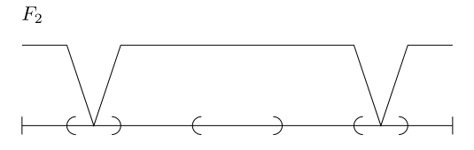

# 测度论

- **核心思想**：矩形覆盖 + Cauchy收敛（高低阶） + 函数极限的集合形式 + 区间分拆
  - 区间分拆方法有：
    - 补集簇（矩形、球体）：$A_n = A-\mathop{\bigcup}\limits^{n-1}_{i=1}A_i$
      - 叫它集合的分拆也行，主要是为了好辩认
    - 开区间（不相交分割）
- **整体思路**：用最简单的矩形情况，结合收敛定理，用矩形逼近一般的集合，从而得到一般的结果
- **两种思路的区别**：
  - 2.1多为定性分析，从外测度的严格定义出发，用极限集合论不断验证新的性质
  - 2.2多为定量分析，它始终从矩形逼近这一“基础对象”出发

## 外测度

- **（引理1.1）不相交矩形的体积可加性**：见2.1
- **（引理1.2）矩形体积三角不等式**：显然
- **（定理1.3）开集分解定理**：见1
- **（定理1.4）矩形分拆定理**：见2.1

### 集合的外测度

- **外测度（闭矩形版本）**：同2.1，但把开矩形换成闭矩形
  - 好处是快速得到离散点集的零测性。坏处是无法直接应用有限覆盖定理
- **矩形测度公式**：设 $Q$ 是矩形，则 $m^*Q = |Q|$
  - **互包证明**：
    - $m^*Q \leq |Q|$
      - 若 $Q$ 为闭矩形：已知 $Q$ 覆盖其本身，故由外测度的下确界性直得结论
      - 若 $Q$ 为开矩形：取闭包，易得体积相同，故转化为闭集情况
    - $m^*Q\geq |Q|$
      - 有一个错误想法是，任意覆盖的总体积肯定都大于 $Q$ 嘛，所以结论是易得的。但我们要知道下确界不一定可以取到，也就是说外测度的值可能不是任何闭覆盖的总体积，所以还是需要从头说明
      - 若 $Q$ 为闭矩形：
        - 任取闭矩形覆盖 $\{Q_j\}$
        - 构造开矩形 $|S_j| = (1+\e)|Q_j|$，显然 $\{S_j\}$ 可以覆盖闭矩形 $Q$
        - 由有限覆盖定理，可找出有限开覆盖 $\{S_j\}^N_{j=1}$
          - 一般不是最小覆盖
        - 再由矩形体积可加性即得 $|Q| \leq \biggm|\mathop{\bigcup}\limits^N_{j=1} S_j\biggm| \leq \sum\limits^\infty_{j=1} (1+\e)|Q_j|$
        - 由 $Q_j$ 和 $\e$ 的任意性，再结合外测度定义即得结论
        - 一个比较难理解的地方是，$\e$ 为什么如同幽灵一般，需要就有，不需要就删
        - 实际上上面只是简化的写法而已，对于有数分基础的人来说，这个过程不难理解
        - 在数分中我们知道，下确界虽然不一定能取到，但必定存在一个闭覆盖序列 $\{Q^{(n)}_j\}^\infty_{n=1}$ 的总体积逐渐逼近下确界
        - 设收敛速度为 $O(m)$，即 $\lim\limits_{n\to\infty} \dfrac{\sum\limits_{j} |Q^{(n)}_j|-m^*Q}{n^m}$ 有界，那么只需令 $\{Q^{(n)}_j\}^\infty_{n=1}$ 对应的 $\{\e^{(n)}\}^\infty_{n=1} = o(m)$，就可使 $\e^{(n)}$ 的存在完全不影响结论，从而可以删去不计
        - 分析的本质是逼近，这个手法是分析的灵魂。高级课程的教材中都默认你理解这个过程，所以都是简化写法。如果数分知识不扎实，那么读书时就会“只领会了思想，但细节完全不会处理”，这样根本无法做题
      - 若 $Q$ 为开矩形：取闭包，转化为闭集情况。再由（有界集合边界的矩形逼近）的体积为 $0$，得开集和闭集结论相同
    - **本质**：大矩形可被小矩形的几乎不交并逼近，再讨论下无穷小量，结论就水到渠成了
- **外测度等价定理**：把2.1定义中的矩形覆盖替换成球覆盖，或任意可求体积的图形覆盖，所得的外测度值不变
<!-- - **矩形逼近定理？**：任意 $E\subset \R^d$，都存在至多可数个矩形 $\{Q_n\}^\infty_{n=1}$ 使得 $m^*E = \sum\limits^\infty_{n=1} |Q_n|$
  - **本质**：
    - 矩形覆盖集合的下确界必定可以取到
    - 1中开集分解定理、2.1中矩形分拆定理的一般形式
  - **证明**：
    - 由 $n$ 任意性，令 $n\to\infty$，不等式依然成立，从而通过取矩形逼近，可将不等式结论推广到任意集合上
        - 对任意 $n\to\infty$，可取 $|S_j|-|Q_j| = \dfrac{\e}{2^n}$，从而可将结论传递给闭矩形覆盖 $Q_j$
        - 取闭包，转化为闭集情况。再由数分结论，（有界集合边界的矩形逼近）的总体积为 $0$，得开集和闭集结论相同 -->
<!-- - **确界可取情况**：若 $E$ 是可数个几乎不相交矩形的并，则 $m^*E = \sum\limits^\infty_{n=1} |Q_n|$
  - **逼近证明**：
    - **有界闭矩形（外部逼近）**：
      - **证明**：易得存在有限开覆盖，对每个开集构造矩形等测包。即得 $|E| \leq \sum |E_i| = m^*E$
    - **开矩形（内部逼近）**：
      - **证明**：首先选择被开集 $E$ 覆盖的闭集族 $E_0$，闭集族上得到矩形逼近。然后利用闭集族体积无限逼近开集体积（De Morgan公式）的性质，得到开集逼近结果
      - **具体证明**：首先内部矩形 $\sum |Q_内| < |R|$，然后外部矩形的体积等价于其边界面积 $O(k^{d-1})$，而总体积 $|R| = k^d$，因此 $\sum |Q_{内\cup 边}| < |R| + O(k^{d-1})$。k趋于无穷可消去O得到不等式
      - **优势**：利用等价量，即极限的思想解释边界体积为0性 -->
- **外测度性质**
  - **单调性**
    - **证明**：若 $E_1\subset E_2$，显然 $E_2$ 的矩形覆盖也都是 $E_1$ 的，从而由外测度定义即得结论
    - **推论**：次可加性（三角不等式）
  - **可数次可加性（可数三角不等式）**：设 $E\subset \mathop{\bigcup}\limits^\infty_{j=1} E_j$，则 $m^*E \leq \sum\limits^\infty_{j=1} |E_j|$
    - **证明**：
      - 无界情况易得
      - 有界情况：
        - 对每个 $E_j$，构造闭矩形覆盖 $\mathop{\bigcup}\limits^\infty_{k=1}Q^j_k$，且满足 $\sum\limits^\infty_{k=1} |Q^j_k| \leq m^*E_j + \dfrac{\e}{2^j}$
        - 显然 $\mathop{\bigcup}\limits_{j,k} Q^j_k$ 是 $E$ 的闭矩形覆盖，故由外测度定义 + 矩形体积可加性，用同上方法删去 $\e$ 即得结论
  - **正则性**：$m^*E = \inf\{m^*O\mid O是开集，O\supset E\}$
    - **互包证明**：
      - 由测度单调性，$m^*E \leq \inf\limits_{E\subset O} m^*O$
      - 设 $E$ 的可数闭矩形覆盖满足 $\sum\limits^\infty_{Q=1} Q_j \leq m^*E + \dfrac{\e}{2}$
      - 取开矩形 $|Q_j^0| \leq |Q_j| + \dfrac{\e}{2^{j+1}}$，显然其并集 $O$ 是 $E$ 的开父集
      - 由外测度三角不等式 + 下确界最小性，$\inf m^*O \leq \sum\limits^\infty_{j=1} m^*Q_j^0 \leq m^*E + \e$
      - 互包即得结论
    - **推论（一般 $G_\d$ 等测包存在性）**：若取一列开父集 $O$ 满足差集测度趋于0，则其交（$G_\d$ 型集）就是 $E$ 的一般等测包
      - 因为下确界不一定能取到，故不能得出存在一般开等测包
    - **推论**：对闭等测核也有类似结论，它和上面关系统称为勒贝格测度的正则性
- **外测度可加条件（完全不相交）**：若 $E = E_1\cup E_2$，且 $d(E_1,E_2) > 0$，则 $m^*E = m^*E_1 + m^*E_2$
  - 题设的意思是两集合完全不相交，即两集合的闭包也不相交。这样才能给矩形覆盖证明法提供空间
    - 注意这里的集合都不是可测集，它跟可测集的可加性不一样
  - 这是非常重要的结论，可以说是勒贝格可测的灵魂。它将Cara定义和等测包定义结合起来，本质上揭示了勒贝格可测集的结构
  - **互包证明**：
    - 由三角不等式易得左 $\leq$ 右
    - 取 $E$ 的闭矩形覆盖满足 $\sum\limits^\infty_{Q=1} Q_j \leq m^*E + \e$。再对 $Q_j$ 剖分，使得 $\forall \diam(Q_j) < d(E_1,E_2)$，则此时不存在同时和 $E_1,E_2$ 相交的 $Q_j$
    - 由达布定理，$Q_j$ 剖分的越细，其体积和越小。故 $m^*E$ 对应的必定是两个不相交的矩形覆盖，从而由矩形体积可加性即得外测度可加性
- **外测度体积公式**：设 $E$ 体积可求，则有 $m^*E = |E|$
  - **证明**：
    - $m^*E \leq |E|$：和上面的手法相同
    - $m^*E \geq |E|$：
      - 用边长为 $\dfrac{1}{k}$ 的矩形网格分割 $\R^d$，设 $\mc Q_1$ 表示 $E$ 内的所有矩形，$\mc Q_2$ 表示和 $E$ 的边界相交的矩形
      - 易得 $E\subset \mathop{\bigcup}\limits_{\mc Q_1\cup \mc Q_2} Q$
      - 再易得 $\sum\limits_{Q\in \mc Q_1} |Q| < |E|$
      - 易得当 $k$ 变化时，$|\mc Q_2| = O(k^{d-1})$
        - 因为体积公式（集合测度）的增长率始终是 $O(d)$，表面积公式（边界测度）的增长率始终是 $O(d-1)$
        - 再由于矩形体积为 $\dfrac{1}{k^d}$，故 $\sum\limits_{Q\in \mc Q_2} |Q| = O(\dfrac{1}{k})$
      - 结合三个式子即得 $\sum\limits_{\mc Q_1\cup \mc Q_2} |Q| \leq |E| + O(\dfrac{1}{k})$，再令 $k\to\infty$ 即得结论
      - 本质是把数分中结论（可求面积图形的边界体积为 $0$）又给证明了一遍
- **外测度分拆公式**：若 $E$ 是几乎不相交的矩形 $Q_j$ 的并，则 $m^*E = \sum\limits^\infty_{i=1} |Q_j|$
  - **证明**：
    - 取 $Q_j$ 的闭矩形核满足 $|Q_j| \leq |R_j| +\dfrac{\e}{2^j}$，显然 $R_j$ 完全不相交。再上面结论易得结果
- 求外测度有两种方法，一种求体积，一种求矩形分拆

## 可测集

- **Lebesgue可测集**：存在工具开等测包的集合
  - **反例**：Vitali集 $S_n$ 不可测
    - **理解**：因为其取法不固定且无法写出，从而没有确定的开等测包
- **勒贝格测度**：可测集的勒贝格外测度称为勒贝格测度
- **可测集性质（可测集可数运算封闭性）**
  - 开集可测性
    - **证明**：显然开集本身即为开等测包，故可测
  - 零测集可测性
    - **证明**：由外测度的等测包性，零测集存在开等测包
  - 可数并封闭性
    - **证明**：对每个可测集取工具开等测包，再由Cauchy收敛原理易得结论
  - Cara条件
    - **证明**：
      - 设 $E$ 可测，$O$ 是其工具开等测包
      - 由外测度的完全不相交可加性，只需证明 $\forall T$，都有 $T\cap E$ 和 $T-O$ 完全不相交即可
      - 反设存在 $x\in T-E$ 但 $d(x,E) = 0$，即 $x$ 是 $E$ 的非孤立边界点，即 $E$ 的聚点
      - 显然 $x$ 也是 $O$ 的聚点，故 $x\in O$。也就是说 $T-O$ 中的点必定和 $T\cap E$ 完全不相交（**证毕**）
  - 紧集可测性
    - **引理**：若闭集 $F$ 和紧集 $K$ 不相交，则其完全不相交
      - **证**：
        - 紧集中任取点 $x$，由不相交得可设 $d(x,F)>3\delta(x)$
          - 此时两边都是关于 $x$ 的函数。可能会出现 $\lim\limits_{x\to x_0} \d(x) = 0$，所以此时还不能得出完全不相交性，必须给出一个具体的 $\inf d(x,F)$ 才行
        - 再取紧集中有限闭球覆盖 $\mathop{\bigcup}\limits^N_{j=1} \ol B\Big(x_j,2\delta(x_j)\Big)$，则由有限性，$\delta(x_j)$ 必定存在下界 $\delta_{min}$
        - 对 $\forall y\in F，x\in K$，三角不等式得 $|y-x| \geq |y-x_j|-|x_j-x| \geq 3\d(x_j)-2\d(x_j) \geq \delta_{min}$，即 $\inf d(x,F) \geq \d_{min}$，从而完全不相交
    - **互包证明**：
      - 设 $F$ 是紧集，取其一般开 $\e$ 等测包 $O$
      - 由于紧集是有界闭集，故差集 $O-F$ 是开集。由矩形分拆定理，其可被几乎不相交的矩形 $\{Q_j\}^\infty_{j=1}$ 分拆
        - 这里是可数个矩形，故不能用体积可加性直接得到 $m^*(O-F) = \sum\limits^\infty_{j=1} m^*Q_j$，必须用其它方法
      - 在其中任取 $N$ 个 $Q_j$，易得其并 $K$ 为紧集，且和 $F$ 不相交，故由引理得 $K$ 和 $F$ 完全不相交
        - 由单调性 + 完全不相交的可加性得 $m^*O \geq m^*F + \sum\limits^N_{j=1}m^*Q_j$
        - 当 $N\to\infty$ 时，由于左侧为有界定值，故右侧收敛，从而不等号可化为等号
      - 再由外测度三角不等式即得 $m^*(O-F) \leq m^*O-m^*F =\sum\limits^\infty_{j=1}m^*Q_j$。再由 $O$ 的等测性即得 $m^*(O-F) \leq \varepsilon$，从而得到工具开等测包
  - 闭集可测性
    - **证明（膨胀法）**：
      - 设 $F$ 为闭集，$B_k$ 是以原点为心，半径为 $k$ 的闭球，则易得 $F\cap B_k$ 是有界闭集，从而是紧集
      - 易得 $\mathop{\bigcup}\limits^\infty_{k=1} B_k = \R$，故 $F = \mathop{\bigcup}\limits^\infty_{k=1} F\cap B_k$，即闭集都是紧集的可数并，从而可测
    <!-- - **理解**：
      - 闭集：不相交的基本前提，用于构造距离函数
      - 紧集：用有限性导出距离函数有界性
    - **本质**：有限易得反向不等式，再由收敛推广到无穷，得到无穷反向不等式 -->
  - 补集可测性
    - **对偶证明**：
      - 设 $E$ 的工具开等测包为 $O$，则易得 $O^c$ 的工具开等测包为 $E^c$，即 $O^c$ 可测
      - 设工具开等测包列 $m^*(O_n-E) \leq \frac{1}{n}$
        - 构造 $S = \mathop{\cup}\limits^\infty_{n=1} O^c_n$，由并集可测性，$S$ 可测。
        - 由外测度单调性，$E^c-S$ 只能是零测集，则 $S$ 存在强等测包，故可测。再由并集可测性即得 $E^c$ 可测。
  - 可数交集可测
    - **对偶证明**：取每个集合的补集，将它们并起来即可
- **可测集可加性**：设 $E_j$ 是不相交的可测集
  - **证明**：
    - 若 $E_j$ 均有界：
      - 设 $E_j$ 的工具闭等测核为 $F_j$，其均为有界闭集（紧集），故均可测。对 $F_j$ 的 $\e$ 应用Cauchy收敛原理取极限，即易得 $m^*E \geq \sum\limits^\infty_{i=1} m^*E_j$
      - 再由测度三角不等式即得反向不等式，从而互包得到等式
    - 一般情况（**膨胀法 + 补集列**）：
      - 设递增矩形 $Q_k$ 逼近 $\R^d$，$S_k = Q_k-Q_{k-1}$
      - 易得 $E = \mathop{\bigcup}\limits_{j,k}(E_j\cap S_k)$（该符号表示遍历 $j$ 和 $k$ 的所有组合）
      - 由于 $S_k$ 是不相交集族，故 $m(E) = \sum\limits_j\sum\limits_{k} m(E_{j,k})$。将右式组合易得 $m(E) = \sum\limits_j m(E_j)$
    <!-- - **本质**：“补集列” + “分析法”（构建补集簇分拆列，从而得到级数，应用可加性） -->
- **单调可测集合测度连续性**：
  - **证明（膨胀法 + 补集列）**：
    - **单增**：同上构造补集列，利用不相交性得到加和形式。然后再合并，并集等于原集
    - **单减**：反向补集列，$E_1 = E\cup (\mathop{\cup}\limits^\infty_{i=1}S_i)$，交集反向则为并集
- **测度逼近定理**：
  - 可测集均存在工具开等测包
    - **证明**：开父集列（单减）的极限
  - 可测集均存在工具闭等测核
    - **证明**：开父集补集列（单增）的极限
  - 测度有限的可测集，均存在工具紧集等测核
    - **证明（膨胀法）**：
      - 选取 $E$ 的工具闭等测核 $F$，设 $B_n$ 是原点为心，半径为 $n$ 的球，$K_n = F\cap B_n$
      - 易得 $E-K_n$ 递减且收敛于 $E-F$
      - 此时 $\lim\limits_{n\to\infty} K_n$ 就是工具紧集等测核
  - 测度有限的可测集，均可被（闭矩形的有限并）内外逼近
    - **证明（放缩 + Cauchy收敛原理）**
      - 构造 $E$ 的（工具闭矩形覆盖等测包 $\mathop{\bigcup}\limits^\infty_{j=1} Q_j$）
      - 由 $E$ 有界得覆盖的体积收敛（**核心**），有限并为 $F$
      - $m(E\triangle F) = m(E-F)+m(F-E)$
        - 前项由有限并化为 $m(\mathop{\bigcup}\limits^\infty_{j=N+1}Q_j)$
        - 后项直接放缩为 $m(\mathop{\bigcup}\limits^\infty_{j=1} Q_j-E)$
      - 矩形测度可加性 + Cauchy收敛原理

### 习题

#### Cantor性质拓展

- **Cantor-Lebesgue函数（指示函数）**：$F:C\to\R，x \mapsto \sum\limits^\infty_{k=1} \cfrac{b_k}{2^k}$
  - 其中若 $x = \sum\limits^\infty_{k=1} \cfrac{a_k}{3^k}$，则 $b_k=\cfrac{a_k}{2}$
  - **理解**：
    - $b_k$ 是用逻辑01来表示三进制中某数位上是否有值
    - $F$ 是将三进制数位换为二进制数位
  - **本质**：已知Cantor集具有连续势，这其实就是给出了 $C$ 到 $\R$ 的双射
  - **存在性（良定义）**：
    - 通用方法是，证明定义域中等价类的像相同
  - **连续性**：
    - **证明**：
  - **满射性**：$F:\mc C\to [0,1]$ 是满射
  - **可延拓性**：$F$ 可延拓为 $[0,1]$ 上的连续函数
    - **证明**：
      - 延拓性：易得 $\mc C^c$ 是Borel集，故 $\exists\bigcup (a,b) \cup \mc C = [0,1]$
      - 连续性：易得 $\forall (a,b)\subset \mc C^c$，有 $F(a) = F(b)$，故定义 $(a,b)$ 上为常函数，由常函数连续性 + C-L函数连续性即得结论
- **Cantor常数剖分 $\mc C_\xi$**：设 $\xi\in (0,1)$
  - 分 $k$ 步移除当前各集合中心位置的 $k$ 个 $\xi$ 长度开区间
  - $k\to\infty$ 时，剩下的集合就是剖分 $\mc C_\xi$
  - **实例**：$\xi = \dfrac{1}{3}$ 时，剖分为Cantor集
  - **补集Borel性**：$\mc C_\xi^c$ 是总长度为 $1$ 的开集并
    - **证明**：第k步后，集合剩余长度为 $(1-\xi)^k$
  - **零测性**：$m^*(\mc C_\xi) = 0$
    - **证明**：可测集运算性质即可
- **类Cantor集 $\wh{\mc C}$**：每次移除 $2^{k-1}$ 个长度为 $\ell_k$ 的开区间，满足 $\sum\limits^\infty_{k=1} 2^{k-1}\ell_k < 1$
  - **可逼近性**：$\forall x\in\wh{\mc C}，\exists \{x_n\}\notin \wh{\mc C}$，满足 $x_n\to x$
    - 且 $x_n\in I_n$，其中 $|I_n|\to 0$ 是补集中的子区间
    - **证明**：
  - **完美性**：所有点都是聚点，不包含开区间
  - **不可数性**
- 存在单增连续双射 $F:[0,1]\to [0,1]$ 将一个Cantor集满射到另一个
  - **证明**：套用C-L函数的构造即可

#### 病态集合（详见实分析汪林）

- **开等测包逼近**：设 $O_n = \{x\mid d(x,E)\leq \dfrac{1}{n}\}$
  - 则仅当 $E$ 是紧集时测度极限相同
  - **反例**：
    - **经典反例**：考虑 $E = \Q$，则 $m^*E = 0$，但 $\lim\limits_{n\to\infty}m^*O_n = \sum\limits^\infty_{n=1} \dfrac{2}{n} \to 2\ln n$
    - **无界闭集**：思路同上，考虑 $E = \bigcup \{n\}$，则 $m^*E = 0$，但 $\lim\limits_{n\to\infty} m^*O_n$ 同上
    - **有界开集**：考虑 $E = $
  - **理解**：只要找到（总测度可表为不收敛级数）的集合即可
- **闭包边界具有正测度的开集**：类Contor集中，去掉奇数步骤
- **（点态极限不Riemann可积）的（正连续函数非升列）**：
  - $\wh{\mc C}$ 是类Cantor集合
  - $F_1$ 是分段线性连续函数，在第一步删去区间的中心取0，余集中取1，值域为 $[0,1]$
  - $F_k$ 同理
    - 
  - 则 $f_n = \prod F_n$ 就是所需函数
  - **理解**：类Cantor集的伴生函数，很容易想到
  - **证明**：
    - 收敛性
    - $\wh{\mc C}$ 不连续性：只需找出 $x_n\to x\in\wh{\mc C}$，满足 $f(x) = 1，f(x_n) = 0$
    - 不可积性
      - 虽然Riemann积分收敛，但不连续点非零测集，故不可积
- **进制测度（同曹广福习题）**：$A\subset [0,1]$ 是十进制中不出现4的数，求其测度
  - **解**：已知 $A = \{x\in[0,1]: x = \sum\limits^\infty_{n=1} \dfrac{x_n}{10^n}，x_n\neq 4\}$
    - 由曹广福的P进制数知识，易得思路是构造A到已知测度集合的双射，而再结合Stein之前习题，应当与Cantor集打通关系
    - 相当于Cantor十分集中，每次削除第四个集合
      - （易得削除第几个集合，或十进制中不出现哪个数，其实结果都一样）
    - 则 $m(A_1) = 1-\dfrac{1}{10} = \dfrac{9}{10}$
    - $m(A_2) = m(A_1)(1-\dfrac{1}{10}) = (\dfrac{9}{10})^2$
- 存在有理数枚举 $\{r_n\}^\infty_{n=1}$ 使得 $\mathop{\bigcup}\limits^\infty_{n=1} O(r_n,\dfrac{1}{n})$ 的补集非空
  - **证明**：（同曹广福习题）

#### 勒贝格测度的性质
  
- **平移不变性**：平移后，覆盖的大小不变
  - **证明**：
- **平移可测性**：$O、E$ 的关系平移后不变
  - **证明**：
- **倍数可测性**：$m(\d E) = \d_1\cdots\d_d m(E)$
  - **证明**：矩形逼近
- **反号不变性**
  - **证明**：
- **线性变换**：
  - 保可测性
  - 保紧集性
  - 保 $F_\sigma$ 性
  - 测度公式：$m(L(E)) = |\det L|m(E)$（详见抽象测度folland）
  - **证明**：矩形逼近
- **可测集夹逼性**
- **可测集稠密性**
  - **实例**：$E\subset [0,1]$，则设 $f(t) = m(E\cap [0,t])$
- **和运算**：
  - 开集之和是开集，闭集之和是可测集
    - **证明**：开集用内点定义，闭集用，反例用
  - **反例**：
    - 闭集之和不一定是闭集
      - **证明**：
    - 开集之和不一定是开集
      - **v证明**：
    - 零测集之和不一定零测
      - **证明**：
        - $(\mc C + \dfrac{\mc C}{2}) \supset [0,1]$
        - $A = I\times \{0\}，B = \{0\}\times I$，则 $A + B = I\times I$
    - 连续映射将可测集映射成不可测集
      - **证明**：$[0,1]$ 上不可测集的C-L函数原像可测
- **差分**：设 $E$ 是正测集，则 $\{z\in\R\mid \exists x,y\in E，z = x-y\}$ 是其差分集
  - **包含原点性**
    - **证明**：（见Hint）
  - **推论**：两个正测集的和包含一个区间

#### 

- **外Jordan内容**：$J^*(E) = \inf \sum\limits^N_{j=1} |I_j|$，其中 $E\subset \mathop{\bigcup}\limits^N_{j=1} I_j$
  - **本质**：外测度的有限版本（有限个区间的并）
  - **闭包相等性**
  - **反例**：
    - 则其为可数集，且 $J^*(E) = 1，m^*(E) = 0$
- **Borel-Cantelli引理**：见概率论

### $\sigma$-代数（详见抽象测度论的程士宏集合代数）

- **$\sigma$-代数**：对可数个交并补运算封闭的集合
- **实例**：
  - Lebesgue可测集 $\sigma$-代数
  - Borel $\sigma$-代数 $B_{Rd}$：
    - **最小性**：包含所有开集的最小 $\sigma$-代数
    - **独立性和唯一性**：所有开集 $\sigma$-代数 的交集
    - **开集可测性**：Borel是可测 $\sigma$-代数 的子集
    - **完备性**：与Borel集相差零测集的集合可测
      - **证明**：并集可测性，利用开集外部逼近 + 闭集内部逼近构造具体集合（同曹广福）
    - **本质**：可测的等测包开父集定义（Lebesgue可测集是Borel的完备化，在抽象测度论中会具体介绍）
- Borel集
  - 开集和闭集（最简单）
  - 可数个开集的交（$G_\sigma$）、可数个闭集的并（$F_\sigma$）

### 选择公理（详见拓扑Munkres）

- **选择公理**：不可数的索引集，每个索引元素可以对应（经由选择函数进行映射）目标集E中的一个元素。
- **线性有序**：定义偏序
- **良序集**：非空子集均存在最小元
  - 自然数是良序集
- **良序原理**：任何集合可以定义为良序的
  - 证明选择公理：如果定义了序关系，则可以把不可数集合
  - **选择公理证明良序原理**：
  - **良序原理证明Zorn引理**：