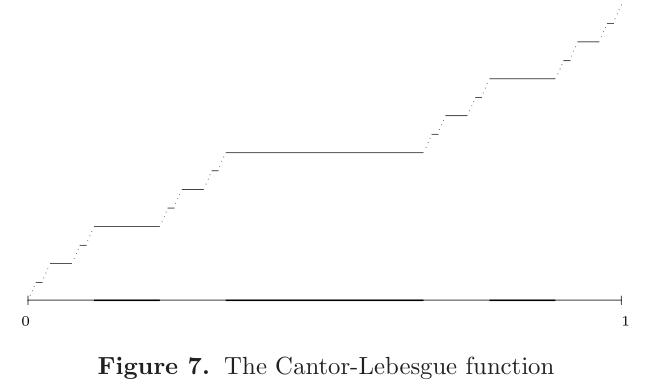

# 微分理论

<!-- - **核心思想**
  - 有界变差函数：可微
  - 单调连续函数：强可微
  - 单调连续有界函数：导数可积
  - 绝对连续函数：可积
- **动机**：
  - 勒贝格积分扩充了定积分的含义，应当也有对应的微积分基本原理
  - 为了寻找微积分基本原理，首先应当针对可测函数，构造相应的上限函数和微分理论 -->
- **符号约定**：
  - 若没有特别说明，则 $B$ 一般表示开球

## 导数的平均值意义

- 一维导数的多个意义
  - 平均值意义：$f'(x_0)$ 可以看作 $f$ 在 $x_0$ 附近平均值的极限
    - 在此意义上，可拓展得到勒贝格导数
  - 增长率意义：$f'(x_0)$ 可以看作 $f$ 在 $x_0$ 附近斜率的极限
    - 在此意义上，可拓展得到方向导数
- **切比切夫不等式**：设 $f$ 可积，则对 $\forall \a> 0，m\Big( \{|f(x)| > \a\} \Big) \leq \dfrac{1}{\a} \|f\|_{L^1(\R^d)}$
  - **证明**：
    - 由区间可加性 + 积分上下界不等式易得 $$\dis\int |f(x)|dx \geq \int\limits_{\{|f(x)| > \a\}} |f(x)|dx \geq \a\cdot m\Big( \{|f(x)| > \a\} \Big)$$
  - **本质**：这个不等式揭示了 $f$ 水平集与积分值的关系，
- **（引理1.2）球堆砌三角不等式**：
  - 设有限数量开球族 $\mc B = \{B_1,...,B_N\}$，则其中存在不相交子族 $\wt {\mc B} = \{B_{j_1},...,B_{j_n}\}$ 满足 $$m\dkh{\mathop{\bigcup}\limits^N_{i=1} B_i} \leq 3^d\sum\limits^n_{k=1} m(B_{j_k})$$
  - **证明**：
    - 已知对于任意两个相交球，小球一定被大球的同心三倍半径球所覆盖
      - 取三倍半径的意义是半径 $\geq$ 小球直径 + 大球半径
    - 在 $\mc B$ 中，由于数量有限，故可取出半径最大的球 $B_0$
      - 再找出所有和 $B_0$ 相交的球，从 $\mc B$ 中删去（相当于取出了同心三倍球）
    - 以此类推，最多进行 $N$ 次后，就可以得到 $\wt {\mc B}$
      - 若 $\mc B$ 中所有的球都不相交，则会重复 $N$ 次
    - 此时 $\mc B$ 内任意的球都必定和 $\wt B$ 中某球相交，且后者为大球
      - 对于每一个这样的相交球，设 $\bar B_{j_k}$ 为大球 $B_{j_k}$ 的同心三倍半径球
      - 由之前结论即得 $m(\mathop{\bigcup}\limits^N_{i=1} B_i) \leq m(\mathop{\bigcup}\limits^n_{k=1}\bar B_{j_k} )$
      - 再由测度三角不等式 + 半径与体积的比例关系 + 测度乘积性，即可得题设不等式

### 类上限函数

- **Hardy-Littlewood最大函数**：$f^*(x) = \sup\limits_{x\in B}\dfrac{1}{m(B)}\dis\int_B |f(y)|dy$
  - 平均值性：$f^*(x)$ 表示在所有包含 $x$ 的开球 $B$ 中，选取出一个最大平均值
  - 对应性：$f^*$ 仅和 $f$ 有关
  - 类上限函数性：它的地位类似 $\dis\sup_x F(x) = \sup_x\int^x_0 f(t)dt$
    - 如果我们能证明当 $f$ 可积时，$f^*$ 有界，那么就能得到上限函数的存在性
- **（定理1.1）HL最大函数的性质**：设 $f$ 可积，则 $f^*$ 满足
  - **最大性（非负性）**：$\forall x，f^*(x) > |f(x)| \geq 0$
    - **证明**：定义直得
  - **可测性**：$f^*$ 可测
    - **证明**：
      - 设 $E_\a = \{f^*(x) > \a\}$，只需证明其为开集即可
        - 若 $x_0\in E_\a$，则存在 $B$ 使得积分平均值 $>\a$
        - 取定 $B$ 后，此时存在 $\d$ 使得当 $|x - x_0| < \d$ 时，$x\in B$，由定义易得此时 $x\in E_\a$
        - 依赖关系 $\a\xto{决定} B \xto{决定} x$
        - 显然此时存在邻域 $O(x_0,\d) \subset E_\a$，由开集定义即得 $E_\a$ 是开集
      - 已知开集可测，故 $f^*$ 可测
  - **HL积分-测度不等式**：$m\Big( \{f^*(x)>\a\} \Big) \leq \cfrac{3^d}{\a}\cdot \|f\|_{L^1(\R^d)}$
    - 虽然形式和切比切夫不等式类似，但它是 $f^*$ 和 $f$ 之间的关系，不是同一个函数
    - **证明**：
      - 取定 $\a$，则由上述证明得 $\forall x\in E_\a，\exists B_x$ 使得 $f^*(x)>\a$，将其变形即可得 $m(B_x) < \dfrac{1}{\a} \|f\|_{L^1(\R^d)}$
      - 由Heine-Borel定理，$E_\a$ 内的任意紧集 $K$ 均可被有限数量的开球族覆盖
      - 再由球堆砌三角不等式，存在不相交开球族 $\wt {\mc B}$ 使得 $$m(K) \leq m\dkh{\mathop{\bigcup}\limits^N_{i=1} B_i} \leq 3^d\sum^n_{k=1} m(B_{j_k})$$
      - 再由前面的不等式得右式 $\leq \dis\frac{3^d}{\a}\sum^n_{k=1} \int_{B_{j_k}} |f(y)|dy$
      - 再由积分的区间可加性，最后经过放缩即可得到题设不等式
    - **本质**：
      - 它实际上说明了，$f^*$ 的水平集大小和 $f$ 的积分值是等价量
      - 也就是说，$f^*$ 的无界区域大小和 $f$ 的积分值挂钩
  - **几乎处处有界性**：$f^*(x) < \infty \ae x$
    - **证明**：
      - 由 $f$ 可积得其 $1$ 范数有界，从而在积分-测度不等式中令 $\a\to\infty$ 即得结论

#### 习题

- **HL最大函数不一定可积**：实际上要它的可积性也没啥用
    - **反例**：

### 平均可导

- **（定理1.3）勒贝格微分定理**
  - 若 $f$ 勒贝格可积，则其满足 $f(x) = \lim\limits_{\substack{m(B)\to 0 \\ x\in B}} \dfrac{1}{m(B)} \dis\int_B f(y)dy \ae$
  - 相当于数分中的 $F'(x) = f(x)$
  - **证明**：
    - 为了书写简便，设积分平均值 $\dfrac{1}{m(B)} \dis\int_B f(y)dy = f_B$
      - 由勒贝格积分的线性易得 $B$ 运算符具有线性
    - 由 $L^1$ 空间上紧支连续函数集的稠密性，存在紧支连续函数 $g$ 与 $f$ 相邻
    - 由 $g$ 的连续性易得题设等式关于 $g$ 成立，即 $g(x) = \lim\limits_{\substack{m(B)\to 0 \\ x\in B}}g_B$
    - 添项 $g$ + 三角不等式得以下式子对任意 $B$ 都成立 $$|f(x) - f_B| \leq |f_B-g_B| + |g_B-g(x)|+|g(x)-f(x)|$$
      - 在两边令 $m(B)\to 0$ 并取上极限
        - 由 $g$ 成立题设等式得右边第二式为 $0$
        - 由 $B$ 运算符的线性 + H-L最大函数的定义 + 积分绝对值不等式，得右边第一式可放缩为 $(f-g)^*(x)$
    - 此时我们得到 $$\limsup\limits_{\substack{m(B)\to 0 \\ x\in B}} |f_B-f| \leq (f-g)^*(x) + |g(x)-f(x)|$$
      - 设从左到右三项的（表示值大于 $\a$ 的水平集）分别为 $E_\a、F_\a、G_\a$
        - 由上面的不等式易得 $E_\a\subset (F_\a\cup G_\a)$
        - 由积分-测度不等式 + $g$ 的相邻性得 $\forall \e>0， m(F_\a)<\e$
        - 由Tchebychev不等式 + $g$ 的相邻性得 $\forall \e>0，m(G_\a)<\e$
      - 综上即得 $\forall \e > 0，m(E_\a) < \e$，从而 $m(E_\a) = 0$，从而题设等式几乎处处成立（**证毕**）
  - **理解**：
    - 由三角不等式，引出具有连续性的中介函数 $g$，将题设等式转化为证明差值的极小性
    - 再通过测度-积分不等式，把积分值大小关系转到测度大小关系上，最终得到结论
  - **本质**：极限小区域的均值，没有方向性
  - **反例**：
    - $f(x) = \begin{cases} \dfrac{1}{x} & x\neq 0 \\ 0 & x=0 \end{cases}$，其在 $x=0$ 处不满足题设等式
      - 因为奇点处积分值无界，但可进行有界延拓。所以两边不相等
      - 如果函数没有无界不可积奇点（局部可积），则题设等式总是成立的
- **函数的勒贝格集合 $\Le(f)$**：所有满足 $f$ 有界且 $\dis\lim\limits_{\substack{m(B)\to 0 \\ x\in B}}\int_B |f(y)-f(x)|dy = 0$ 的点
  - 所有成立勒贝格微分定理的点
- **局部可积性**：若对任意开球 $B$，$f(x)\chi_B(x)$ 可积，则称 $f$ 局部可积
  - **等价定义**：
    - 在任意开球上可积的函数
    - 在任意紧集上可积的函数
  - **实例**：
    - $f(x) = \begin{cases} \dfrac{1}{|x|} & |x|\geq 1 \\ 0 & x\in (-1,1) \end{cases}$ 局部可积，但整体不可积
      - **证明**：
        - 对任意有限闭区间，显然积分值都有界
        - 在整个实数轴上，积分值为 $2\ln x|^\infty_1$，无界
      - 这个函数在无穷远处反常不可积
  - **反例**：
    - $f(x) = \dfrac{1}{x} \pad (x\neq 0)$ 不局部可积
      - **证明**：易得其在 $[-1,1]$ 上的反常积分发散
      - 这个函数在某点上无界不可积
- **局部可积函数空间**：$L^1_{\loc}(\R^d)$ 表示 $\R^d$ 上全体局部可积函数
- **（定理1.4）局部可积函数的平均可导定理**：$L^1_{\loc}(\R^d)$ 上的函数都满足勒贝格微分定理
  - 将 $f$ 的勒贝格可积条件弱化为局部可积条件
  - **证明**：取 $g$ 在球内，证明方法相同

### 可测集的密度

- **勒贝格密度**：$d_E(x) = \lim\limits_{\substack{m(B)\to 0 \\ x\in B}} \lfrac{m(B\cap E)}{m(B)} $ 称为点 $x$ 在可测集 $E$ 上的勒贝格密度
  - 密度必须定义在可测集的点上，且依赖于具体可测集的选取
- **勒贝格全密点**：若 $d_E(x) = 1$，则称 $x$ 为 $E$ 的全密点
  - **实例**：
    - 开集的密度处处为 $1$
- **（推论1.5）可测集的全密性**：
  - 设 $E$ 是可测集（如果不是可测集，那么没办法定义积分）
  - 则
    - $E$ 中几乎处处是全密点
    - $E^c$ 中几乎处处不是全密点（a.e.以外指的是边界点）
  - **证明**：
    - 由区间逼近定理，可测集可被开球 a.e. 覆盖
    - 已知 $f(x) =1$ 可积，故由勒贝格微分定理 $$d_E(x) = \lim\limits_{\substack{m(B)\to 0 \\ x\in B}} \frac{1}{m(B)}\int_{B\cap E}dx = 1 \ae$$
    - 平均可导即存在重心，无论如何逼近，最终都收敛到重心上，所以密度总为1。而补集中总有办法收敛到外点上，所以密度不为1
  - **本质**：取勒贝格密度的逼近过程，即为规则收敛的过程
- **（推论1.6）局部可积函数平均可导性**：若 $f\in L^1_{\loc}(\R^d)$，则 $\Le(f) = \R_d \ae$
  - （勒贝格集合的定义式）强于（勒贝格微分定理的等式），所以本定理和1.4不是一个东西
  - **证明**：
    - 设 $r$ 为有理数，构造 $g_r(y) = |f(y)-r|$，易得其仍为局部可积函数
      - 设 $E_r = \Le(g_r)^c$，由局部可积性得 $m(E_r) = 0$
      - 由 $\Q$ 可数性得 $m(E) = m(\mathop{\bigcup}\limits^\infty_{r=1} E_r) = 0$
    - 任取 $x_0 \notin E$，使得 $f(x_0)$ 有界
      - 由有理数集稠密性，$\forall \e > 0，\exist r_0\in\Q$，使得 $|f(x_0)-r_0|<\e$
      - 将勒贝格集合的定义式中添项 $r_0$，再应用三角不等式可得 $$\lim\limits_{\substack{m(B)\to 0 \\ \bar{x}\in B}} \frac{1}{m(B)} \int_B |f(y)-f(x_0)|dy < 2\e$$
      - 最后由 $x_0$ 的任意性即得结论
  - **理解**：
  - **本质**：

### 规则收敛

- **规则收敛**：
  - 设 $U_\a$ 是以 $\a$ 为指标的集族
  - 若
    - $\exist C>0，\forall x_0 \in U_\a，\exist B$ 满足 $x_0 \in B，U_\a\subset B，m(U_\a)>Cm(B)$
    - 极小和极大的 $U$ 均存在
  - 则称集族 $U_\a$ 规则收敛到 $\bar{x}$
  - **本质**：集族在 $\bar{x}$ 上具有有界同轴性
- **（推论1.7）规则收敛定理**：
  - 设 $f$ 局部可积，则其满足 $\dis f(\bar{x}) = \lim\limits_{\substack{m(U_\a)\to 0 \\ x\in U_\a}} \frac{1}{m(U_\a)} \int_{U_\a} |f(y)|dy$
  - **证明**：
    - 作差即可
    - $\triangle I(U_\a)\leq \frac{1}{c}\triangle I(B) < \e$
  - **本质**：任何规则收敛集族均可充当平均导数的积分域

## 良核收敛

- **积分卷积**：$(f*K_\delta)(x) = \int_{R^d} f(x-y)K_\delta(y)dy$
  - 偏移函数 $f(x-y)$，偏移量 $y$，偏移量积分开关 $K_\delta(y)$
  - 积分中考虑所有的偏移量，如果积分开关是良核，则最终收缩于偏移量为0的点，即收敛于恒等映射
- **良核函数**：$K_\delta$
  - 积分为1
  - 绝对值积分有界
  - 核 $\delta\to 0$ 时，正轴上绝对值积分 $\to 0$
- **恒等收敛性**：二元映射 $f\mapsto f*K_\delta$ 关于 $\delta$ 收敛到恒等映射
  - $f$ 的连续点集上，$(f*K_\delta)(x)\to f(x)（\delta\to 0）$
  - 扩充到勒贝格集合上：
    - $K_\delta$ 强化为 **恒等式的近似**
      - 积分为1
      - 极小区间有界不等式：$\forall \delta>0，|K_\delta(x)|\leq \large\frac{A}{\delta^{d}}$
      - 无穷区间有界不等式：$|K_\delta(x)| \leq \frac{A\delta}{|x|^{d+1}}$
    - 原条件2：条件2保证在极小区间 $|x|<\delta$ 内积分有界，条件3保证在无穷区间 $|x|>\delta$ 内积分有界
    - 原条件3：条件3即可导出
- **启发函数**：通过连续逼近得到的函数（算是函数列的连续形式，本质是二元映射）
- **狄拉克函数（冲激函数）**：满足 $D(x) = \begin{cases} \infty ，x=0 \\ 0，x\neq 0\end{cases}$，且 $\int_{R^d} D(x)dx = 1$ 的函数
  - **启发式定义**：良核 $K_\delta(x) = \frac{1}{2\delta}，|x|<\delta$，则 $D(x) = \lim\limits_{\delta\to 0} K_\delta(x)$
  - **D充当恒等式近似**：$f*D = \int |f(x-y)D(y)|dy$，权重全部在 $y=0$ 上，此时 $f*D = f$

### 其它恒等式近似例子

- 支撑在单位闭球上的非负有界函数 $\varphi(x)$，积分为1
  - 恒等式近似为 $K_\delta(x) = \Large\frac{\varphi(\frac{x}{\delta})}{\delta^d}$
  - 
- **上半平面的泊松核**：$\mathcal{P}_y(x) = \large\frac{1}{\pi}\frac{y}{x^2+y^2}，x\in R$
  - $\delta = y$
- **热核**：$\mathcal{H}_t(x) = \large\frac{1}{(\sqrt{4\pi t})^d}e^{\frac{-|x|^2}{4t}}$
  - $\delta = \sqrt{t}$
  - $\delta = 4\pi t$，则转化为调制高斯函数
- **圆盘上的泊松核**：$\frac{1}{2\pi} P_r(x) = \begin{cases} \large\frac{1}{2\pi}\frac{1-r^2}{1-2rcosx + r^2}，\normalsize |x|\leq\pi \\ 0\qquad\qquad\qquad，|x|>\pi \end{cases}（0<r<1）$
  - $\delta = 1-r$
- **费耶核**：$\frac{1}{2\pi}F_N(x) = \begin{cases} \large\dfrac{1}{2\pi N}\dfrac{sin^2(\frac{Nx}{2})}{sin^2(\frac{x}{2})} ，\normalsize |x|\leq\pi \\ 0\qquad\qquad\quad，|x|>\pi\end{cases}$

### 恒等映射极限

- **（定理2.1）恒等收敛定理**：恒等收敛性 $(f*K_\delta)\to f\pad (\delta\to 0)$ 在 $f$ 的勒贝格集合上 a.e. 成立
  - **证明**：
    - 积分添项得 $(f*K)-f = \int \big[ f(x-y)-f(x) \big]K_\delta(y)dy$
      - 良核的积分为1
    - 原像分解为 $|y|\leq \delta$ 和 $\sum\limits^\infty_{k=1} \{2^k\delta<|y|\leq 2^{k+1}\delta\}$
      - 由良核的极小区间有界不等式，前项放缩为 $c\mathcal{A}(\delta)$
      - 由良核的无穷区间有界不等式 + $y>2^k\delta$，后项放缩为 $\sum\limits^\infty_{k=1}\frac{c}{2^k}\mathcal{A}(2^{k+1}\delta)$
      - 由 $\mathcal{A}$ 的极限 + 有界性，原式放缩为 $\e$（**证毕**）
- **（引理2.2）偏移量性质**
  - 设 $f$ 可积，$x\in Le_f$
    - **偏移量球积分函数**：$\mathcal{A}(r) = \frac{1}{r^d}\int_{|y|\leq r} |f(x-y)-f(x)|dy（r>0）$
    - 实质是开球定义的积分导数。由平均值性，前项是均值，后项是重心上的定值
  - 则
    - $\mathcal{A}(r)$ 是连续函数
      - 由绝对连续性，零测集上的积分极小，从而 $\mathcal{A}(r+h)-\mathcal{A}(r) < \e$
    - $\lim\limits_{r\to 0}A(r) = 0$
      - x是积分可微点，从而均值等于重心值
    - $A(r)$ 有界
      - $0<r<1$ 时，由连续性和0极限值得有界
      - $r>1$ 时，由三角不等式，$\mathcal{A}(r)\leq \frac{1}{r^d}\|f\| + \frac{V(B)}{r^d}|f(x)|$，由可积性得有界
        - 因为 $r$ 无界，所以无界偏移量积分 $\int_{|y|\leq r} |f(x-y)|dy$ 等于全集积分  $\|f\|$
- **（定理2.3）卷积可积性** 
  - $f$ 可积，良核是恒等式近似，则积分卷积可积，且 $\|(f*K_\delta)-f\|\to 0，\delta\to 0$
    - **证明**：详见Fourier反演公式的良核变换部分

## 有界变分函数

- **讨论范围**：
  - 本章中所有函数均为一维实函数
- **可求长曲线 $\gamma$**：设连续参数曲线 $z(t) = (x(t),y(t))\pad (a \leq t\leq b)$。若存在 $M$ 使得任意有限划分下都有 $\sum\limits^N_{j=1}|z(t_j)-z(t_{j-1})| \leq M$，则称为可求长曲线
  - 即任意有限划分的割线总长度都有相同的界
  - 这个相同的界很关键，它保证我们能应用数分的单调有界收敛原理，从而得到极限状态下的有界性，从而割线极限收敛，从而曲线长度存在
- **曲线的长度**：$L(\gamma) = \sup \sum\limits^N_{j=1}|z(t_j)-z(t_{j-1})|$
  - **连续性**：$L$ 是关于曲线 $\g$ 的连续泛函
  - **拼接性**：$L(A\to B) + L(B\to C) = L(A\to C)$

### 变分

- **函数的变分**：设 $D:a=t_0<...<t_N = b$ 是 $[a,b]$ 上的划分，则 $\sum\limits^N_{j=1}|F(t_j)-F(t_{j-1})|$ 称为 $F$ 在划分 $D$ 上的变分
  - **单调性**：划分越细，变分越大
  - **实例**：闭区间上的单调函数，其变分值为两端点函数值之差
- **有界变分函数**：所有划分下的变分均有相同上界的函数
  - 有界变分函数就是可求长曲线的隐函数形式
  - **实例**：
    - 若函数处处可导且导数有界，则其满足Lipschitz条件，从而任意变分均有界
    - 单调有界函数
      - 
  - **反例**：
    - 连续但是不可导的函数
      - $f(x) = x^2\sin\frac{1}{x}$，在含有原点的区间内其变分无界
- **（定理3.1）可求长定理**：参数曲线可求长 $\LR$ 参数曲线中的所有参数函数均为有界变分函数
  - **证明**：
    - 使用数分中的坐标极限不等式即可
- **总变分**：$T_F(a,b) = \sup\sum\limits^N_{j=1} |F(t_j)-F(t_{j-1})|$ 函数表示在 $[a,b]$ 上的变分上确界
  - 当 $F$ 为复值函数时，定义依然有效
- **正变分**：$P_F(a,x) = \sup\limits_+\limits\sum\limits^N_{j=1} F(t_j)-F(t_{j-1})$ 表示所有单增点上函数值之差的极限
  - 实际上就是总变分的正部分
  - 因为没有取模运算，所以这里的 $F$ 必须是实值函数
- **负变分**：$N_F(a,x) = \sup\limits_-\limits\sum\limits^N_{j=1} -\Big[ F(t_j)-F(t_{j-1}) \Big]$ 表示所有单减点上函数值之差的极限
  - 实际上就是总变分的负部分
  - 因为没有取模运算，所以这里的 $F$ 必须是实值函数
- **（引理3.2）分解定理**：
  - 设 $F$ 是实值有界变分函数
    - 有界变分性是为了保证变分的存在性
  - 则
    - $F(x)-F(a) = P_F(a,x)-N_F (a,x)$
      - 全体增长部分减去全体下降部分，就是总体增长部分
      - 本公式实际上说明了正负变分能代表函数总体的变化
    - $T_F(a,x) = P_F(a,x) + N_F(a,x)$
      - 总变分的正负分解
      - 本公式实际上说明了上确界的可加性
  - **证明**：
    - 由确界定义，导出 $\e$，然后再将两个 $\e$ 合并成一个，从而得到新的确界
- **单调化简定理**：设 $F$ 是单调函数，则其有界变分性等价于有界性
  - **证明**：
    - 显然单调函数的总变分就是两端的函数值之差，故结论易得
  - 就是因为单调函数有着这么良好的变分性质，所以本章的定理基本都要求函数单增
- **（定理3.3）单调分解定理**：设 $F$ 是实值函数，则 $F$ 有界变分 $\LR F$ 是两个单增有界函数的差
  - **证明**：构造 $\begin{cases} F_1(x) = P_F(a,x)+F(a) \\ F_2(x) = N_F(a,x) \end{cases}$，显然它们满足题意
  - **推论**：复值函数是四个有界递增函数的线性组合
- **连续性定理**：设 $F$ 是有界变分函数。若 $F$ 连续，则其总变分 $T_F(a,x)$ 连续
  - **实例**：
    - 连续可求长曲线的长度关于曲线连续

### 有界变分函数的可微性

#### 日升引理

- **（引理3.5）F.Riesz引理（日出引理）**：
  - 设 $G$ 是 $\R$ 上连续的实值函数
  - 若取阴影集合 $E=\{x\mid \exist h>0，G(x+h)>G(x)\}$
      - 集合 $E$ 仅依赖于点的函数值，符合勒贝格积分思想
      - $E^c$ 右侧没有点比它的函数值大
      - $E$ 的图像为下图阴影中的所有点
      
  - 则
    - $E$ 为空集或开集
    - 设开集分解后 $E = \mathop{\bigcup}\limits_{k} (a_k,b_k)$，则当开区间有限时 $G(a_k) = G(b_k)$
      - 区间两端点处的函数值相等
  - **证明**：
    - **开集性**：
      - 任取 $x\in E$，则 $\exists h_x$ 使得 $G(x+h_x) - G(x) = \e > 0$
      - 再由 $G$ 的连续性，存在 $\d_{x,\e}$ 使得 $O(x,\d)$ 内都有 $G(y) < G(x+h_x)$，从而 $O(x,\d) \subset E$
      - 由定义即得 $E$ 是开集
      <!-- - 反设 $E$ 不是开集，则存在 $x_0\in E$ 使得存在一列 $x_n\notin E$ 满足 $x_n\to x_0$
        - 若 $x_n$ 从左边趋于 $x_0$，则由 $E$ 的定义得 $f(x_n)$ 单不增 -->
    - **阴影性**：
      - 因为 $a_k,b_k\notin E$，所以 $G(b_k)\leq G(a_k)$
      - 反设不相等
      - 由连续函数的介值定理，$\exist c\in(a_k,b_k)$ 使得 $G(c) = \dfrac{G(a_k)+G(b_k)}{2} > G(b_k)$
        - 易得 $\exist d>c$ 满足 $G(d)>G(c)$
          - 因为 $c\in E$
        - 再易得必须是 $d<b_k$
          - 因为 $G(d) > G(c) > G(b_k)$，且 $b_k$ 的右侧没有函数值更大的点
      - 再由连续函数的介值定理得 $\exist c_1\in(d,b_k)$ 使得 $G(c)=G(c_1)$
      - 在 $(c_1,b_k)$ 上再次重复上述过程。我们发现总可以找到相应的 $c_n > c_{n-1}$
        - 由单调有界收敛定理即得 $c_n\to b_k$
        - 但此时对任意的 $n$ 都有 $G(c_n) = G(c) > G(b_k)$，与极限保号性矛盾。所以只能是 $G(a_k) = G(c) = G(b_k)$
  <!-- - **理解**：
    - 讲道理，如果让我来做这道题，可能就在端点放缩和分类讨论的道路上越走越远了。实际上，这个证明也只是多用了一些中间值而已，本质还是放缩
    - 它巧妙的地方，估计还是同化了很多分类讨论的情况
  - **本质**：振荡型的连续不可导函数的集合表示 -->
- **（推论3.6）日升引理**：
  - 对于闭区间 $[a,b]$ 上的连续实值函数，阴影集合 $E$ 同样具有上述性质
  - 但当 $a_k = a$ 时，只能得到 $G(a_k) \leq G(b_k)$
  - **证明**：
    <!-- - 当 $a_k$ 为左端点时，区间变为左闭右开，$G(a_k)\leq G(b_k)$ -->

#### 可微性条件

- **差商**：$\D_h F(x) = \dfrac{F(x+h)-F(x)}{h}$
- **Dini导数**：
  - **右大导数**：$D^+(F)(x) = \limsup\limits_{\substack{h\to 0 \\ h>0}} \triangle_h F(x)$
  - **右小导数**：$D_+(F)(x) = \liminf\limits_{\substack{h\to 0 \\ h>0}} \triangle_h F(x)$
  - **左大导数**：$D^-(F)(x) = \limsup\limits_{\substack{h\to 0 \\ h<0}} \triangle_h F(x)$
  - **左小导数**：$D_-(F)(x) = \liminf\limits_{\substack{h\to 0 \\ h<0}} \triangle_h F(x)$
  - 最好不要写成 $x\nearrow 0$ 的形式，容易符号混淆
- **Dini可测定理**：Dini导数是可测函数
  - **证明**：
    - 由 $F$ 连续得 $\D_h F(x)$ 关于 $x$ 和 $h$ 均连续
    - 取 $g_n(x) = \sup\limits_{h\in (0,\dfrac{1}{n})} \D_hF(x)$
      - 由差商函数连续性，其上确界能被可数序列逼近，即在 $(0,\dfrac{1}{n})$ 中存在收敛序列 $h_k$ 使得 $\lim\limits_{k\to\infty}\D_{h_k}F(x) = g_n(x)$
      - 再由极限可测性即得 $g_n(x)$ 可测
    - 再由上极限可测性即得 $\limsup\limits_{n\to\infty} g_n(x) = D^+(F)(x)$ 可测
  - **理解**：
    - 利用可测的极限封闭性证明结论
    - 但为了得到极限，必须先将Dini导数转化为可数函数列的形式，也就是构造 $g_n$
- **可微性等价条件**：
  - 整体写法：$D^+\leq D_-\leq D^-\leq D_+\leq D^+ < \infty \ae$
  - 最简写法：
    - **有限性**：$D^+ < \infty \ae$
    - **有序性**：$D^+\leq D_- \ae$
    - **证明**：
      - 易得对任意 $F$ 都有 $D_+ \leq D^+$ 且 $D_- \leq D^-$
      - 再对 $F$ 的中心对称函数 $-F(-x)$ 应用上式，即得 $D^- \leq D_+$
    - 实际上还是数分中左右导数相等那一套
- **可微性充分条件**：设 $F$ 在 $[a,b]$ 上单增、有界、连续，则其几乎处处可微
  - 由于Weierstrass函数的存在，只满足连续有界时不能得到 a.e. 可微性
  - 但本定理表明，加上单增性就可以了
  - **证明（Dini数有限性）**：
    - 设 $E_\g = \{x\mid D^+ > \g\}$，其中 $\g > 0$
      - 由Dini数可测定理，该集合是可测的
    - 设 $G(x) = F(x)-\g x$，易得其连续
      - 由日升引理得阴影集合 $E = \mathop{\bigcup}\limits_{k} (a_k,b_k)$，且 $F(b_k)-F(a_k) \geq \g(b_k-a_k)$
      - 再易得 $E_\g \subset E$
        - 因为当 $D^+(F)(x) > 0$ 时，$x$ 右侧肯定存在 $F(y) > F(x)$，从而 $x\in E$。由元素分析法即可得包含关系
      - 从而 $m(E_\g) \leq m(E)\leq \dfrac{1}{\g}\sum F(b_k)-F(a_k)\leq \dfrac{1}{\g}\Big[ F(b)-F(a) \Big]$
        - 第一个不等号是测度单调性，第二个是三角不等式，第三个是日升结论
    - 综上得 $\lim\limits_{\g\to\infty}m(E_\g) = 0$，从而得到Dini数有限性
  - **证明（Dini数有序性）**
    - 取两实数 $R>r$，设 $$E = \{x\in [a,b]\mid D^+(F)(x)>R>r>D_-(F)(x)\}$$
      - 显然 $E$ 表示所有不满足Dini有序性的点，只需证明 $m(E) = 0$ 即可
      - 这里的 $R$ 和 $r$ 只是为了辅助证明而临时取的两个中间值
    - 反设 $m(E)>0$，则由实数稠密性，存在开集 $O$ 满足 $\begin{cases} E\subset O\subset (a,b) \\\\  m(O)\leq \dfrac{R}{r}·m(E) \end{cases}$
      - 由开集分解定理，可设 $O = \mathop{\bigcup}\limits_{n} I_n$
      - 显然此时 $E = \mathop{\bigcup}\limits_{n} (E\cap I_n)$
    - 定义函数 $G_1(x) = -\Big[ F(x)-rx \Big]$
      - 任取某个 $n$，在 $-I_n$ 上对 $G_1$ 应用日升引理，再进行中心对称，即可得阴影集合 $O_n = \mathop{\bigcup}\limits_{k} (a_k,b_k) \subset I_n$，且 $$F(b_k)-F(a_k) \leq r(b_k-a_k)$$
      - 因为存在某个 $a_k = a$，所以最多只能得到不等号
    - 定义函数 $G_2(x) = F(x)-Rx$
      - 在每个 $(a_k,b_k)$ 上都对 $G_2$ 应用日升引理，再将所有阴影集合进行合并，即得两个函数的阴影集合 $O_n' = \mathop{\bigcup}\limits_{k,j} (a_{k,j},b_{k,j}) \subset O_n$，且 $$F(b_{k,j})-F(a_{k,j}) \geq R(b_{k,j}-a_{k,j})$$
      - 在 $O_n'$ 中，上面两个不等式可以同时满足
    - 综上可得 $$m(O_n') \overset{定义}{=} \sum_{k,j}(b_{k,j}-a_{k,j}) \overset{结论2}{\leq} \frac{1}{R}\sum_{k,j}\Big[ F(b_{k,j})-F(a_{k,j}) \Big] \\\ \\ \overset{单调性}{\leq} \frac{1}{R}\sum_{k}\Big[ F(b_k)-F(a_k) \Big] \overset{结论1}{\leq} \frac{r}{R}\sum_k (b_k-a_k) \overset{单调性}{\leq} \frac{r}{R}m(I_n)$$
    - **包含关系推测度关系**
    - 再易得 $(E\cap I_n) \subset O_n'$
      - 和上面Dini数有限性的证明方法（元素分析法）相同
    - 综上可得 $$m(E) \overset{定义}{=} \sum_n m(E\cap I_n)\overset{包含}{\leq} \sum_n m(O_n')\overset{上述结论}{\leq} \sum_n \frac{r}{R}m(I_n) \\\ \\\overset{单调性}{\leq} \frac{r}{R}m(O) \overset{定义}{<} m(E)$$
    - 显然上式不可能成立，从而反设不成立，从而 $m(E) = 0$（**证毕**）
  - **理解**：
    - 日升引理的作用只是为了得到上面的“斜率不等式”，从而得到测度大小关系的矛盾点
    - 各个集合的关系：
      - $O$ 进行开集分解，变为 $\mathop{\bigcup}\limits_{n} I_n$
      - $I_n$ 中存在 $G_1$ 的阴影集 $O_n$
      - $O_n$ 进行开集分解，变为 $\mathop{\bigcup}\limits_{k} (a_k,b_k)$
      - 所有 $(a_k,b_k)$ 中都存在 $G_2$ 的阴影集，合并后得到 $O_n'$
  - **本质**：

### 可微性定理

- **（推论3.7）可导性定理**：若 $F$ 单增、连续，则其导函数 $F'$ 几乎处处存在
  - **证明**：
    - 由闭区间上连续函数的有界性 + 可微性充分条件得 $F$ 在任意有限闭区间上几乎处处可微
    - 再由 $\R$ 可被分解成可数个有限闭区间的并，即可得到结论
  - **推论（增长定理）**：导函数 $F'$ 非负可测
      - **证明**：
        - 设差商列 $G_n(x) = \cfrac{F(x+\frac{1}{n}) - F(x)}{\frac{1}{n}}$
        - 由 $F$ 的几乎处处可微性得 $G_n\to F'(x) \ae$
        - 由 $F$ 单增性得 $G_n(x) > 0$，由极限保号性即得 $F'$ 非负
        - 由运算可测性得 $G_n$ 可测。再由极限可测性即得 $F'$ 可测
  - **推论（N-L不等式）**：导函数满足 $\dis\int^b_a F'(x)dx \leq F(b)-F(a)$
    - **证明**：
      - 将差商列 $G_n$ 进行积分、线性分离、区间组合，得到 $$\int^b_a G_n(x)dx = \frac{1}{n}\int^{b+\frac{1}{n}}_b F(x)dx - \frac{1}{n}\int^{a+\frac{1}{n}}_a F(x)dx$$
      - 再由 $F$ 的连续性得右式极限为 $F(b)-F(a)$
      - 再由Fatou引理，$\dis\int^b_a F'(x)dx \leq \liminf\limits_{n\to\infty} \int^b_a G_n(x)dx$
        - （因为差商列不单调，所以只能用最弱的定理）
    - **理解**：
      - 思路类似数分中N-L公式的证明。但这里存在不可微的零测集，故无法使用上限函数
      - 对于积分理论的大部分内容都和积分列有关，所以思路要转移到如何构造合适的积分列上来
  - **推论（可积定理）**：若 $F$ 还满足有界性，则其导函数 $F'$ 勒贝格可积
    - **证明**：
      - 已知有限可测集上，非负可测函数 $F'$ 只有积分值无界时不可积
      - 由 $F$ 有界性 + 上面的N-L不等式即得 $F'$ 积分值有界
- **（定理3.4）有界变分可导定理**：若 $F$ 是有界变分函数，则其导函数 $F'$ 成立上述性质
  - **证明**：
    - 已知有界变分函数可分解为两个单调连续函数的差

## 绝对连续函数

- **绝对连续函数（有界区间）**：
  - **定义**：
    - $\forall\e>0，\exist\delta>0$
    - 若对任意不相交的 $(a_k,b_k)\subset [a,b]$，在满足 $\sum\limits^N_{k=1} (b_k-a_k)<\delta$ 时，都有 $\sum\limits^N_{k=1} |F(b_k)-F(a_k)|<\e$。则称 $F$ 在 $[a,b]$ 上绝对连续
  - **四则运算传递性**：
    - **线性传递**：若 $f,g$ 绝对连续，则 $af+bg$ 绝对连续
      - **证明**：定义即可
    - **乘积传递**：
      - **证明**：
    - **除法传递**：当 $g$ 在 $[a,b]$ 上恒不为 $0$ 时
      - **证明**：
  - **一致连续性**：
    - **证明**：令 $N=1$ 即可
    - 一致连续函数只需要 $\d$ 不依赖于具体的 $x$ 就行了
    - 显然绝对连续函数的 $\d$ 不依赖于 $x$，而且条件比一致连续更强
  - **单调简化定理**：单调函数的绝对连续性等价于一致连续性
    - **证明**：定义易得
    - 思路和有界变分函数的单调简化定理相同
  - **总变分绝对连续性**：
    - **证明**：
      - 由绝对连续的定义可一眼看出总变分一致连续
      - 再由于总变分是单增函数，故一致连续等价于绝对连续
    - 实际上绝对连续定义的本质就是总变分的一致连续性
  - **有界变分性**：
    - **证明**：由总变分连续性易得其有界，从而变分均有界
    - 有界变分函数只需要总变分有界就行了
    - 绝对连续函数还需要总变分一致连续
  - **单调连续分解性**：绝对连续函数可分解为两个单调连续函数的差
    - **证明**：
      - 和有界变分函数相同，可构造 $\begin{cases} F_1(x) = P_F(a,x)+F(a) \\ F_2(x) = N_F(a,x) \end{cases}$
      - 再由总变分连续性得正负变分均连续，从而上面的两个函数均连续
- **绝对连续函数（任意集合）**：定义相同，但不能得到有界变分性

### 绝对连续函数的例子

- **上限函数**：若 $f$ 在 $[a,b]$ 上可积，则 $F(x) = \dis\int^x_a f(y)dy$ 绝对连续
  - **证明**：
    - 定义即可
  
### 绝对连续函数的反例

- **一致连续但不有界变差**：$F(x) =\begin{cases} x\sin\dfrac{1}{x}  & x\neq 0 \\ 0 & x=0\end{cases}$
  - **证明**：
    - 取区间列 $I_k = (\dfrac{1}{2k\pi},\dfrac{1}{(2k+1)\pi})$，
    - 易得取足够大的 $N$ 时有 $\sum\limits^\infty_{k=N}|I_k| = \sum\limits^{\infty}_{N} o(2)$ 极小
    - 但总变分 $\sum\limits^{\infty}_{k=N}|\D F| = \sum\limits^{\infty}_{k=N} \dfrac{1}{(2k+1)\pi} = \sum\limits^{\infty}_{k=N} o(1)$ 无界
    - 故不是有界变差函数，从而在 $x=0$ 处不是绝对连续函数
- **一致连续、有界变差，但不绝对连续**：Cantor-Lebesgue函数
  - **证明**：
    - **一致连续性**
      - **证**：对于 $\e = \sum\limits^\infty_{i=1}\dfrac{a_k}{3}$，设其在三进制下第 $N$ 位后出现第一个不为0的数，则只需取在三进制下 $N+1$ 位后才开始不相同的两个 $x_1,x_2$，则有 $|F(x_1)-F(x_2)| \leq \sum\limits^\infty_{i=N} \dfrac{a_k}{2^k} \leq \e$
      - **理解**：三进制下紧挨的两个数，在二进制下依然紧挨
    - **有界变差性**：
      - **证**：易得其单增有界，从而由定义易得有界变分性
    - **非绝对连续性**：
      - **证**：
        <!-- - 取三进制下 $a_k = 1$ 的数列 $t_i$，由于在支集以外，故 $F(t_i)-F(t_{i-1}) = 0-0 = 0$，但 $\sum\limits^\infty_{i=1}t_i = \sum\limits^\infty_{i=1} \dfrac{1}{3^i}$ 无界 -->
        <!-- 错误原因：不应该按比例缩小，而应该平移 -->
        <!-- - 对某个固定的 $\e$，取足够大的 $N$，使得 $\sum\limits^\infty_{n=N}\dfrac{1}{3^n} < \e$
        - 取 $I_k = (a_k,b_k) = \Big(\dfrac{1}{3^k} + \sum\limits^\infty_{n=k+1}\dfrac{1}{3^n}，\dfrac{2}{3^k} + \sum\limits^\infty_{n=k+1}\dfrac{1}{3^n}\Big)$
          - 其中 $k>N$ 后每位均相同
        - 则此时
          - $|I_k| = \dfrac{1}{3^{k}}$
          - $|F(b_k)-F(a_k)| = |0-\dfrac{1}{2^N}| = \dfrac{1}{2^k}$
          - 可取 $[N_1,N_2]$，使得其中 $|I_k|$ 的和极小，但 $|\D F_k|$ 的和有界，故 $F$ 在该区域内不绝对连续 -->
        - 设 $n$ 为Cantor集划分次数，$\{I^n_k\}$ 为第 $n$ 次划分时Cantor集的补集中的开区间集合，$k$ 为开区间序号
        - **第一次**：$I^1_1 = (\dfrac{1}{3^1},\dfrac{2}{3^1})$
         
        - **第二次**：$I^2_1 = (\dfrac{1}{3^2},\dfrac{2}{3^2})，I^2_2(\dfrac{2}{3^1}+\dfrac{1}{3^2},\dfrac{2}{3^1}+\dfrac{2}{3^2})$
         
        - **第三次**：
          - $I^3_1 = (\dfrac{1}{3^3}，\dfrac{2}{3^3})$
           
          - $I^3_2 = (\dfrac{2}{3^2}+\dfrac{1}{3^3}，\dfrac{2}{3^2}+\dfrac{2}{3^3})$
           
          - $I^3_3 = (\dfrac{2}{3^1} + \dfrac{1}{3^3}，\dfrac{2}{3^1} + \dfrac{2}{3^3})$
           
          - $I^3_4 = (\dfrac{2}{3^1} + \dfrac{2}{3^2} + \dfrac{1}{3^3}，\dfrac{2}{3^1} + \dfrac{2}{3^2} + \dfrac{2}{3^3})$
         
        - **第 $n$ 次**：$I^n_k = \Big( \sum\limits^{n-1}_{i=1} \dfrac{a_{ik}}{3^i} + \dfrac{1}{3^n}，\sum\limits^{n-1}_{i=1} \dfrac{a_{ik}}{3^i} + \dfrac{2}{3^n}\Big)$
          - 接下来探讨 $a_{ik}$ 的取值规律
          - 可设向量 $\vec a_k = (a_{1k}，a_{2k}，...，a_{(n-1)k})$ 共 $n-1$ 项，其中各个元类似二进制数增加法
            - 比如 $n=3$ 时 $a$ 的顺序是 $(0,0),(0,1),(1,0),(1,1)$
            - 那么 $n=4$ 时 $a$ 的顺序就是 $(0,0,1),(0,1,0),...$
          - 若再设 $\vec x = (\dfrac{1}{3^1},\dfrac{1}{3^2},...,\dfrac{1}{3^n-1})$
          - 那么原式也可写为向量内积形式
            - $I^n_k = (\vec a\cdot \vec x + \dfrac{1}{3^n}，\vec a\cdot \vec x + \dfrac{2}{3^n})$
          - 其实上面也是变相证明了Cantor集的三进制数表示法，以及Cantor-Lebesgue函数的存在性
        - 综上，根据给出的 $I^n_k$ 的具体数学形式，容易发现 $|I^n_k| = \dfrac{1}{3^n}$，其上Cantor-Lebesgue函数的端点差值为 $|\D F| = \dfrac{1}{2^n}$
        - 故 $\sum\limits^n_{k=1} |I^n_k| = (\dfrac{2}{3})^n \to 0\pad (n\to \infty)$，但 $\sum\limits^n_{k=1} |\D F| = 1$，不绝对连续

### 绝对连续函数的性质

#### 球逼近

- **Vitali球覆盖**：
  - **定义（数学语言）**：
    - 设 $\mc B$ 是开球族，$E$ 是某个集合
    - 若 $\forall x\in E，\forall \eta > 0，\exists B\in\mc B$ 使得 $x\in B$ 且 $m(B) < \eta$
  - **定义（自然语言）**：若集合 $E$ 中每个点均可被任意小的球覆盖，则称为Vitali球覆盖
  - Vitali覆盖就是可以任意细的球覆盖
  - **实例**：
    - 设 $E = [0,1]^d$，则 $\mc B = \{B(x,r)\mid x\in E，r\in (0,1)\}$ 是一个Vitali球覆盖
- **Vitali覆盖的性质**：
  - **单调传递性**：当 $F\subset E$ 时，$\mc B$ 也是 $F$ 的Vitali球覆盖
- **（引理3.9）Vitali内部逼近引理**：
  - 设 $E$ 是有限可测集，$\mc B$ 是Vitali球覆盖
  - 则 $\forall \e>0$，存在互不相交的 $\{B_1,...,B_N\}$ 使得 $\sum\limits^N_{i=1}m(B_i) \geq m(E)-\e$
  - 因为可以任意细，所以当然可以内部逼近（$N$ 依赖于 $\e$）
  - 本定理其实类似勒贝格测度论中的矩形逼近。但因为球堆砌三角不等式的存在，所以取球覆盖的性质更好
  - **证明**：
    - 不妨设 $m(E) > \e$
      - 由 $E$ 的有限可测性，可取 $E$ 的紧子集 $E'$，使得 $m(E') \geq \e$
      - 已知 $E'$ 可被有限个球覆盖。再由球堆砌三角不等式，可以找到不相交子族满足 $\sum\limits^{N_1}_{i=1}m(B_i) > \gamma m(E')$
      - 得到 $k=1$ 时的关系 $\sum\limits^{N_1}_{i=1}m(B_i) > \gamma\e$
      - 检验是否完成逼近。若逼近未完成，则 $\sum\limits^{N_1}_{i=1}m(B_i) < m(E)-\e$
    - 取补集 $E_2 = E - \mathop{\bigcup}\limits^{N_1}_{i=1} \ol {B_i}$，易得此时 $m(E_2) > \e$
      - 易得 $E_2$ 仍有限可测，故可取 $E_2$ 的紧子集 $E_2'$，使得 $m(E_2') > \e$
      - 由定义易得 $\mathop{\bigcup}\limits^{N_1}_{i=1}\ol{B_i}$ 是 $E_2$ 的Vitali球覆盖，所以由球堆砌三角不等式，可以找到不相交子族满足 $\sum\limits_{N_1<i\leq N_2}m(B_i) \geq \gamma m(E_2')$
      - 两个不等式相加得 $k=2$ 时的关系 $\sum\limits^{N_2}_{i=1}m(B_i) >2\gamma\e$
      - 再次检验是否达成逼近条件，若不满足，则取补集 $E_3 = E - \mathop{\bigcup}\limits^{N_2}_{i=1} \ol {B_i}$
    - 不断进行下去，易得当 $k\geq \dfrac{m(E)-\e}{\gamma\e}$ 时必定完成逼近
- **（推论3.10）Vitali强内部逼近引理**：对于上面的 $\e$，可以找到 $\{B_1,...,B_N\}$ 满足 $\\m(E-\mathop{\bigcup}\limits^N_{i=1} B_i) < 2\e$
  - **证明**：取 $E$ 的开逼近包 $O$，由三角不等式得 $$m(E - \mathop{\bigcup}\limits^N_{i=1}B_i) \leq m(O)-m(\mathop{\bigcup}\limits^N_{i=1}B_i)$$，再添项 $m(E)$ 即可

#### 性质定理

- **（定理3.8）绝对连续可导定理**：设 $F$ 是 $[a,b]$ 上的绝对连续函数，则 $F'$ 几乎处处存在
  - **证明**：
    - 由绝对连续函数的单调连续分解性，其可分解为两个单调连续函数的差
    - 再由单调连续函数的性质即得结论
- **绝对连续函数化常定理**：
  - 设 $F$ 是 $[a,b]$ 上的绝对连续函数，$E = \{x\mid F'(x) = 0\}$
  - 若 $m(E)=b-a$，则 $F$ 为常函数
  - **证明**：
    - 设 $G_n(x)$ 为差商列函数，则由题设条件易得 $\lim\limits_{n\to\infty} G_n(x) = 0$
      - 即 $\forall \e > 0，\exists \d > 0$ 使得 $|b_x-a_x|<\d$ 时 $|F(b_x)-F(a_x)| \leq \e(b_x-a_x)$
    - 设易得所有这样的开区间 $\{(a_x,b_x) \mid x\in E\}$ 构成一个 $E$ 的Vitali球覆盖
      - 由Vitali内部逼近引理，存在有限子族满足 $\sum\limits^N_{i=1}m(I_i) > (b-a)-\e$
        - 我们发现提出Vitali覆盖似乎就只是为了这一句话的应用。那么为什么不直接用开矩形呢？
        - 因为我们要从这里的Vitali覆盖中提取出依赖于 $\e$ 的有限子族。这就要求覆盖本身呈现一定的结构。而在勒贝格测度论的章节中，提出的开矩形逼近都是任意取的，不能保证它满足一定结构的同时还可以逼近。这就是提出Vitali覆盖的意义
      - 由差商收敛性，$N$ 个 $I_i$ 均满足 $\sum\limits^N_{i=1} |F(b_i)-F(a_i)| \leq \e(b-a)$
    - 易得 $\dkh{\mathop{\bigcup}\limits^N_{i=1} I_i}^c = \mathop{\bigcup}\limits^M_{k=1} [\a_k,\b_k]$
      - 由绝对连续性 + $E$ 的定义易得 $\sum\limits^M_{k=1} |F(\a_k)-F(\beta_k)|\leq \e$
      - C-L函数无绝对连续性，在 $I_n$ 的补集出现大跳跃，导致C-L不是常函数
    - 两个不等式相加即得 $F(b)-F(a)\leq \e$
- **（定理3.11）牛顿-莱布尼茨公式**：
  - 设 $F$ 是 $[a,b]$ 上的绝对连续函数，则 $F'$ 可积，且成立N-L公式
    - **证明**：
      - 可积性由之前结论易得
      - 设上限函数 $G(x) = \dis\int^x_a F'(y)dy$，由上限函数绝对连续性得 $G$ 绝对连续，再由四则运算传递性得 $G-F$ 也绝对连续，从而导数存在
      - 由勒贝格微分定理得 $G'(x)=F'(x) \ae$
      - 再由导数线性得 $(G-F)'(x) = 0 \ae$
      - 再由绝对连续函数化常定理得 $G(x) = F(x) + C$
      - 再仿照数分中的证明方法即得N-L公式
  - 设 $f$ 在 $[a,b]$ 上可积，则存在绝对连续函数 $F$ 满足 $F'(x) = f(x) \ae$，且成立N-L公式
    - **证明**：取 $F$ 为 $f$ 的上限函数即可
  - **本质**：函数绝对连续 $\LR$ 函数满足N-L公式
  - **反例**：
    - **几乎处处可导，但不绝对连续**：Cantor-Lebesgue函数
      - **证明**：
        - 由勒贝格可导定理，单增函数几乎处处可导
        - 由于 $m(C) = 0$，故 $F'(x) = 0 \ae$
        - 但由于 $F(0) = 0$，$F(1) = 1$，故不满足N-L公式
      

<!-- - 以数位为迭代序号的数列
  - 连续（其为区间迭代函数列，类似简单函数逼近）递增（序号递增）
  - 任何试图找到边界点的行为，都会被新一轮迭代的区间洗牌所打断 -->

## 勒贝格微分理论

### 函数的不连续点

- **（引理3.12）不连续定理**：有界单增函数至多有可数个不连续点
  - **证明**：
    - 由数分知识，单调有界函数的不连续点均为跳跃间断点，即任意点的左右极限总存在
    - 设 $x$ 为不连续点，则存在 $r_x\in\Q$ 使得 $f'_-(x) < r_x < f'_+(x)$
    - 设 $x<z$，则由单增性，$f'_+(x) < f'_-(z)$，从而每个有理数最多对应一个跳跃点，从而可数
- **跳跃间断点**：函数的左右极限不相等的点
  - 即第一类不连续点
- **跃度**：$\a_n = F(x^+)-F(x^-)$
- **中值比例**：$F(x_n) = F(x_n^-) + \theta_n\a_n$
- **中值系数**：$j_n(x) = \begin{cases} 0，x<x_n \\ \theta_n，x=x_n \\ 1，x>x_n \end{cases}$
- **跳跃函数**：$J_F(x) = \sum\limits^\infty_{n=1} \a_n j_n(x)$
  - 只有当 $x>x_n$，该项的值才不为 $0$
- **（引理3.13）跳跃函数性质**：
  - 跳跃函数是有界单增函数
  - 跳跃函数的跳跃点和跃度与原函数相等
  - $F-J$ 是连续递增的
- **（定理3.14）跳跃函数阶梯性**：跳跃函数的导数存在且 a.e. 为0
  - **证明**：
    - 给定 $\delta>0$，导数上界的值域限制集 $E$ 可测
    - 级数 $\sum \a_n$ 收敛，则极限部分设为 $J_0(x)$，有 $J_0(b)-J_0(a) < \e$
    - 前面的有界部分，和E的不同点最多为有限个。
    - 可以找到一个E的紧子集K，$m(K)\geq \frac{m(E)}{2}$
      - 由E定义（导数上界值域限制），$J_0(b_x)-J_0(a_x) \geq \delta(b_x-a_x)$
      - 由子堆砌三角不等式，$m(K) \leq 3·\sum\limits^n_{j=1} m(I_j)$
    - 几个不等式联合得到 $\frac{\delta}{6}·m(E) \leq J_0(b)-J_0(a) < \e$，$m(E)$ 必须为0（**证毕**）

### 最终的结论

- **勒贝格可导定理**：若 $F$ 在 $[a,b]$ 上单增，则其几乎处处可导
  - **证明**：综合以上结论可得
  - **推论**：若 $F$ 在 $\R$ 上单增，则其几乎处处可导
    - **证明**：将 $\R$ 分为可数个有限闭区间即可
- **有界变差可导定理**：若 $F$ 是 $[a,b]$ 上的有界变差函数，则其几乎处处可导
  - **证明**：
    - 已知有界变差函数可分解为两个单调有界函数，故由勒贝格可导定理即得结论

### 总结

- （绝对连续函数 $\LR$ 满足N-L公式） $\subset$ 有界变差函数 $\subset$ 几乎处处可导