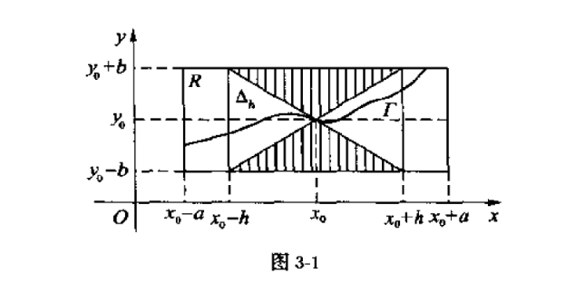

# 常微分方程3：存在和唯一性定理

- 这一章大量应用积分上界不等式，基础是皮卡序列的积分性，推导目标是其一致收敛到积分曲线
- **解的存在性**：若 $G$ 上均无奇点，则称ODE的解存在
- **解的唯一性**：若解只有一族平行曲线（每点上只有一个函数满足该ODE），则称解唯一
- **解的不唯一性**：若存在奇解、特解，则称解不唯一

## 皮卡存在和唯一性定理

- **利普西茨条件**：$|f(x,y_1) - f(x,y_2)| \leq L|y_1 - y_2|$
    - **$y$ 连续性**：若 $f$ 满足Lip条件，则关于 $y$ 的差分 $\D f$ 是 $\D y$ 的高阶无穷小
      - **证明**：等价于 $\lim\limits_{y\to y_0} \dfrac{f(y)}{y-y_0}$
    - **偏导数有界性**：若可导函数 $f$ 满足Lip条件，则在 $G$ 上 $\dpfrac{f}{y}$ 处处有界
      - **证明**：由L中值定理即得 $f_y(x,\xi)\leq L$
  - **常用强化条件**：若 $y$ 偏导数连续，则闭区间上满足Lipschitz条件
    - **证明**：定义易得
    - 很多时候不方便得出Lip条件，一般就用偏导数连续来代替
- **皮卡定理**：
  - 设初值问题为 $(E): \dfrac{dy}{dx} = f(x,y), \quad y(x_0) = y_0$
  - 若
    - $f$ 在闭矩形区域 $R:\begin{cases}|x-x_0| \leq a \\ |y-y_0| \leq b \end{cases}$ 内连续
      - $f$ 可积性：为了使微分方程可转化为积分方程
      - $f$ 一致连续性：为了使皮卡序列连续
    - 对 $y$ 满足Lip条件
      - 为了使皮卡序列一致收敛
  - 则 $(E)$ 在区间 $I = [x_0 - h, x_0 + h]$ 中有且只有一个解
    - 其中 $\begin{cases} 导数最值 M = \max|f(x,y)| \\ 区间半径 h = \min\{ a,\dfrac{b}{M}\} \end{cases}$
    - 首先 $x$ 方向不能超出矩形区域
    - 我们希望防止解函数 $y(x)$ 超出满足Lip条件的矩形区域，故不妨假设所有区域导数都取最大绝对值，那么此时 $y$ 方向的限制就是 $\cfrac{b}{M}$
    - 这两个因素综合起来取交集，才是解的存在区间
- **证明（存在性）**：
  - 用级数逼近极限函数，思想类似Newton切线迭代法
  - 第一步：**微分方程转化为积分方程** $$y = y(x_0) + \int^x_{x_0} f(x,y)dx$$
    - 其中 $F(x_0,y_0)，y(x_0)$ 由初值给出
  - 第二步：**构造皮卡序列，证明连续性**
    - **皮卡序列**：设 $y_0(x) = y_0 = y(0)$，$$y_{n+1}(x) = y_0 + \int^x_{x_0} f\Big(x,y_n(x)\Big)dx \quad (x\in I,n = 0,1,...)$$
    - **有界性**：由积分上界不等式，得 $|y_n(x) - y_0| \leq M|x-x_0|$
    - **连续性**：由积分原函数的连续性，得 $\{y_n(x)\}$ 均连续
  - 第三步：**证明皮卡序列一致收敛**
    - 等价于证明 $\sum\limits^\infty_{n=1} \Big[ y_{n+1}(x) - y_n(x) \Big] = \dis\int^x_{x_0} \Big[ f(x,y_n)-f(x,y_0) \Big]dx$ 一致收敛
      - 函数列收敛性转化为函数项级数收敛性，从而可用级数的判别法
    - **数学归纳法证不等式** $$|y_{n+2}(x) - y_{n+1}(x)| \leq \frac{M}{L} · \cfrac{(L|x-x_0|)^{n+2}}{(n+2)!} $$
      - 对 $n$ 归纳，易得 $n=0$ 时成立
      - 由Lipschitz条件，$$左式 = |\int(f_{k+1}-f_{k})dx| \leq \biggm|\int^x_{x_0} L |y_{k+1}(x) - y_k(x)|dx \biggm|$$，即等式退化一阶
      - 再代入归纳法假设，对右式计算积分即得 $\dis\frac{M}{L} · \frac{(L|x-x_0|)^{k+2}}{(k+2)!}$
    - 由幂级数收敛性 + W判别法，即得 $\{y_n(x)\}$ 一致收敛
  - 第四步：
    - 由一致收敛性，$y_n(x)$ 的极限函数 $\p(x)$ 连续，从而 $f(x,\p(x))$ 可积，且积分和极限可交换
    - 故其极限函数满足积分方程 $\dis y(x) = y_0 + \int^x_{x_0} f(x,y(x))dx$
    - **所以皮卡序列的极限函数就是积分方程的解，且在区间上一致成立**
- **证明（唯一性）**
    - 反设存在两个解 $u(x)$ 和 $v(x)$，写成积分形式后作差，再由连续性进行上界放缩，归纳即得 $|u-v| \leq \cfrac{M}{L} · \cfrac{(L|x-x_0|)^{k+2}}{(k+2)!} \to 0$
  - **理解**：
    - 基本思路是由收敛的完备性证明有解（逼近法、迭代法）
    - 核心是证明收敛使用的Lipschitz条件
    - 依据是构造的皮卡序列，其差值具有“积分内部同构”的形式，可以通过积分上下界不等式简化为简单不等式，而序列迭代（重积分）可以将右侧化为等比序列，从而收敛。

#### 习题

- **求解的存在并唯一区域**：$x\dfrac{dy}{dx} = y + \sqrt{y^2-x^2}$
  - **解**：利用充分条件，即偏导数有界足以解决大部分问题
    - 易得 $f(x,y) = \dfrac{y+\sqrt{y^2-x^2}}{x}$，且 $f_y = \dfrac{1}{x} + \dfrac{y}{x\sqrt{y^2-x^2}}$ 在除了 $x=0,y^2\leq x^2$ 的区域都连续有界，故由皮卡定理直得结论
- **利用收敛级数求解柯西问题**：$\dfrac{dy}{dx} = x+y+1$，初值为 $y(0)=0$
  - **法1**：一阶线性方程，可以直接解
  - **法2**：利用皮卡序列和级数
    - 皮卡序列为：$\begin{cases} y_0 = 0 \\ y_{n+1} = \int^x_{x_0} (x+y_n+1)dx \end{cases}$
    - **转化为裂项级数**：$y_{n+1}-y_n = \int^x_{x_0} (y_n-y_{n-1})dx$
    - **依次求通项**：
      - $y_1 = x+1$
      - $y_2=\int^x_{x_0}(x+(\frac{1}{2}x^2+x)+1)dx$
      - ……
    - 观察易得通项公式为：$y_n = \sum\limits^n_{k=1}\dfrac{x^{k+1}}{(k+1)!} + \sum\limits^n_{k=1}\dfrac{x^k}{k!} = (e^x-x-1)+(e^x-1)$
- **皮卡不等式**：
  - 设 $f$ 在闭矩形上满足Lip条件，$M$ 是最大值，$L$ 是Lip系数，$h$ 是区间半径
  - 则其皮卡序列满足 $\dis|y_n(x) - y(x)| \leq \frac{ML^n}{(n+1)!}h^{n+1}$
  - **证明**：上面的归纳法
- **柯西问题的的近似求解（迭代法）**
  - 已知区间，则可求得区间半径 $h = \min\{a,b\}$ 和导数最大值 $L$
  - 由皮卡不等式可逐次计算每项的误差值
  - 最终找到符合精度的 $y_n(x)$ 就是近似值
  - **例题**：
    - 柯西问题为 $E:\dfrac{dy}{dx} = x-y^2，y(0) = 0$，区域为 $[-0.5,0.5]\times[-1,1]$
    - **解**：
      - **近似解**：$\p_0(x) = y_0 = 0，\p_1(x) = \dfrac{x^2}{2}，\p_2(x) = \dfrac{x^2}{2}-\dfrac{x^5}{20}$
      - **误差计算**：
        - $L = \max\limits_{(x,y)\in D}|\dpfrac{f}{y}| = 2$
        - $M = 1.5$
        - $a = 0.5，b=1，h = \min\set{a,\dfrac{b}{M}} = 0.5$
        - 第一次误差为 $\dfrac{ML}{2!}h^2 = 0.375$
        - 第二次误差为 $\dfrac{ML^2}{3!}h^3 = 0.125$

### 奥斯古德唯一性定理

- **Osagood条件**：
  - $f$ 在 $G$ 内连续
  - 存在一个在 $(0,+\infty)$ 上连续的正值函数 $F(r)$，使得 $\forall y_1 \neq y_2$ 都有 $|f(x,y_1) - f(x,y_2)| \leq F(|y_1-y_2|)$
    - 即 $F$ 只可能在原点处为 $0$，且是差分上界（即 $f'_y \leq F(0)$）
  - 以 $0$ 为瑕点的瑕积分 $\dis\int^{r_1}_0 \frac{dr}{F(r)} = +\infty$
    - 即 $\dfrac{dr}{dx} = F(r)$ 在 $r = 0$ 处只有一个解
    - 且 $F(0) \to 0$
    - 综上，我们发现，这其实就是前面的局部唯一条件，故证明方法也是相同的
  - **弱化性**：同Lip条件相比，它更加弱
    - Lip条件要求差分一致有界，而Os条件仅要求差分存在控制函数
- **唯一性定理**：若函数 $f(x,y)$ 满足Osgood条件，则方程 $y' = f(x,y)$ 的解唯一
  - **证明（端点效应法）**：
    - 反设 $x_0$ 是同时具有两解的点，$x_1$ 是令两个解函数的值不同的某个点
    - 设 $r(x) = y_1(x) - y_2(x)$
      - 两积分曲线的差值
    - 令 $\bar{x} = \sup\set{x | y_1(x) = y_2(x)}$
      - 两积分曲线的值相同区域的右边界
      - 则 $r(\bar{x}) = 0$，且 $[\bar{x},x_1]$ 上 $r(x) > 0$
    - 由题设ODE + Osgoods条件得 $$r'(x) = y_1'(x) -y_2'(x) = f(x,y_1(x)) - f(x,y_2(x)) \\\ \\ \leq F(|y_1(x) - y_2(x)|) = F(r(x))$$
      - 移项并积分 $x$ 即得 $\dis\int^{r(x_1)}_0 \frac{dr}{F(r)} \leq x_1 - \bar{x}$
        - 由微分线性可得 $dr=f(x,y_1)-f(x,y_2)$
        - 由题设瑕积分条件，左式无界。再由于右式有界，矛盾，只能是不存在 $x_0$（**证毕**）
- **理解（线素矛盾：斜率与函数值相互决定（方程），但又相互影响（曲线））**：
  - 由不等式 $$\frac{f(x,y_1)-f(x,y_2)}{F(|y_1-y_2|)} \leq 1 \red\Rightarrow \int^{|y_1-y_2|}_{x:y_1=y_2} \frac{f(x,y_1)-f(x,y_2)}{F(|y_1-y_2|)}_{\to +\infty} \leq |y_1-y_2|_{\to +\infty}$$
    - 再由 $y_1、y_2$ 的任意性，发现上式必须无意义，否则积分曲线处处无界，即解不存在
    - 所以 $y_1=y_2$ 时，$\D f$ 必须 $=0$，或该点压根就不存在（$y_1\neq y_2$ 的地方在无穷远），总之解唯一。
- **反例（米勒）**：对于不满足Lip条件的 $f$，其皮卡序列可能不一致收敛
  - **证明**：设 $F(x,y) = \begin{cases} 0, & x = 0 \\ 2x, & (0,1]\times (-\infty,0) \\ 2x-\dfrac{4y}{x}, & (0,1]\times [0,x^2) \\ -2x, & (0,1]\times [x^2,+\infty) \end{cases}$
    - 其在闭矩形区域 $[0,1] \times (-\infty,+\infty)$ 上连续，但对 $y$ 不满足Lip条件
    - 皮卡序列 $y_n(x) = (-1)^{n+1}x^2，x\in [0,1]$ 不一致收敛
    - 解为 $y = \frac{1}{3}x^2$ ，且唯一

### 习题

#### 解的单向延伸唯一性

- **皮卡定理法**
- **奥斯古德法**
  - **引理**：当斜率仅依赖于 $y$ 时，可以直接将Osgood条件的 $F$ 取为 $f$
    - **证明**：和前面局部唯一条件的证明相同
  - **实例**：
    - $y(0) = 0，\dfrac{dy}{dx} = |y^\alpha|，\a > 0$
      - **解**：
        - 令 $F(r) = |r|^\alpha$，易得 $\lim\limits_{r\to 0}\int\dfrac{dr}{F(r)} = +\infty$，则其满足Osgoods条件，解在右端唯一
    - $y(0) = 0，\dfrac{dy}{dx} = \begin{cases} 0,\quad y=0 \\ y\ln|y|, \quad y\neq 0 \end{cases}$
      - **解**：
        - 用前面的瑕积分定理即可
  - 使用Osgood条件
    - Osgood中的 $y_1和y_2$，原先是在区间中任意取的。但是由其证明方法可以看出，如果把 $y_2$ 取为左端点，则同样可以在 $[x_0,\beta]$ 区间内全部适用
- **单调斜率的解唯一性**：若 $f(x,y)$ 在闭区域上连续，且对于 $y$ 单调递减，则其在初值右侧的解唯一
  - **证明（端点效应法）**：
    - 反设有两解 $y_1(x),y_2(x)$，令 $x_1$ 是两解相等区域的右边界
    - 设差值函数 $r(x) = y_1(x)-y_2(x)$
      - 易得 $r(x_1)=0$
      - 不妨设 $x_1$ 右邻域内 $y_1(x) > y_2(x)$，即 $r(x) > 0$
    - 但由方程定义和 $f$ 单调性，$r'(x_1) = f\Big( x_1,y_1(x_1) \Big)-f\Big( x_1,y_2(x_1) \Big) < 0$
      - 由连续可微性，$x_1$ 右邻域必须 $r(x)<0$，矛盾
      - 若 $f$ 不连续则不一定
  - **理解**
    - $y$ 的值越大，其增长率越小，故积分曲线最终肯定收敛到令 $f(x,y_0)=0$ 的 $y = y_0$ 处  
    - （$y'$ 关于 $y$ 单减，则函数和导数步调相反，而ODE本身也决定了函数和导数的关系，且此时会出现矛盾。如果单增，函数和导数步调一致，就不会矛盾了）

## 皮亚诺存在定理

- **欧拉折线**：
  - 已知柯西问题 $E:\dfrac{dy}{dx} = f(x,y)，y(x_0) = y_0$
  - 若 $f$ 在闭区间 $I$ 内连续，则 $I$ 内积分曲线的斜率有界，即 $|y-y_0| \leq M|x-x_0|$
  - 根据斜率的性质，可以构造简单折线来拟合积分曲线。称为欧拉折线
- **构造方法**：
  - 设矩形区域 $R：\begin{cases} |x-x_0|\leq a \\ |y-y_0|\leq b \end{cases}$
  - 限制积分曲线在矩形区域内：
    - 由 $|y-y_0| \leq b$ 可推出 $|x-x_0| \leq \dfrac{b}{M}$
    - 设 $h = \min\{a,\dfrac{b}{M}\}$，则在区间 $(x_0-h,x_0+h)$ 内，积分曲线不超出矩形 $R$
  - 两个不等式构成了一个水平角形区域
    - 曲线斜率不超过 $M$，故曲线上界是直线 $y=Mx$，曲线下界是直线 $y=-Mx$
    
  - 以 $E$ 的初始点 $P_0(x_0,y_0)$ 为起点，将该点线素延长至 $R$ 内某点 $P_1(x_1,y_1)$
    - 易得线素延长线的表达式为 $P_0P_1:y_1 = y_0 + f(x_0,y_0)(x_1 - x_0)$
    - 显然 $P_1$ 仍然在角形区域内
  - 依此法不断取线素延长线 $P_kP_{k+1}$，它们共同构成**欧拉折线**，表达式即为**欧拉序列（函数项级数 $y_n(x)$ 的关于 $n$ 的上限函数）**：$$\p_n(x) = y_0 + \sum\limits^{s-1}_{k=0} f(x_k,y_k)(x_{k+1}-x_k) + f(x_s,y_s)(x-x_s)$$
    - $n$ 是折线的端点数量，它决定欧拉折线整体的形状。
    - $s$ 是 $x$ 当前所在的端点序号，它表示在某个特定形状的欧拉折线上的某个端点
    - $y_k$ 就是第 $k$ 端点的函数值（积分曲线值）
    - 欧拉序列是函数项级数，$n$ 越大，拟合程度越高，极限函数就是柯西问题的解
      - 它现在还不是皮卡序列，只是朴素的级数而不是积分。但数学本质和皮卡序列相同。后面会证明它和皮卡序列差值无穷小
  <!-- - 类似定积分中Newton-Leibniz公式的几何割线证明 -->

### 阿斯科利引理

- **函数序列一致有界**：若 $\forall n，\exist 常数M$，使得 $|f_n(x)| < M$，则称函数序列 $\{f_n\}$ 一致有界
  - **一致性**：若改为处处有界，则 $M$ 可以是 $n$ 的函数。但一致有界时，$M$ 只能是常数
  - （至少存在两个参量的函数才能定义一致有界性）
- **函数序列等度连续**：若 $\forall \varepsilon，\exist \delta = \delta(\varepsilon)，\forall x_1,x_2 \in I，|x_1-x_2| \leq \delta$，都有 $|f_n(x_1) - f_n(x_2)| < \varepsilon，n = 1,2,...$，则称函数序列 $\{f_n\}$ 等度连续
  - **等度性**：
    - 一个 $\delta(\varepsilon)$ 可以应用于所有的 $n$，即 $\d(\e)$ 不依赖于 $n$
  - **连续性**：
    - 若函数列等度连续，则极限函数也连续
    - 所有 $f_n$ 均一致连续
- **反例**：$f_n(x) = (-1)^n + x^n$
  - 在 $[-\frac{1}{2},\frac{1}{2}]$ 上，一致有界且等度连续
  - 在 $[-1,1]$ 上，一致有界但不等度连续
    - 极限函数 $f(x) = \begin{cases}  \end{cases}$
  - 在 $[-2,2]$ 上，均不满足
    - 等比数列不收敛
- **阿斯科利引理**：函数序列在有界闭区间上一致有界、等度连续，则它有一个一致收敛的子列
  - **证明**：见数分
  - **推论**：
    - 该定理在有限开区间上也成立
      - **证明**：方法和一致连续相同，补充定义即可
    - 该定理无限区间上不成立
      - **反例**：$f_n(x) = \sin\dfrac{x}{n}，x\in \R$
        - 一致有界且等度连续
        - 但任何子列均振荡发散
 - $f_k(x) = \frac{x}{k}$，区间为 $I = \{x\in R,y\in [0,1]\}$
    - 证明一致有界：
    - 证明等度连续：$|f_i(x_1)-f_i(x_2)|<|f_1(x_1)-f_2(x_2)| = \delta$
    - 当 $x = k\to \infty$ 时，$f_k > 1$

### Peano存在定理

- **导出一致收敛**：欧拉序列在区间 $[x_0-h, x_0+h]$ 上至少有一个一致收敛的子序列
  - **证明**
    - 定义易得欧拉序列在矩形区域中一致有界
    - 由于欧拉序列的几何意义是折线段，且每段折线的斜率有界，故易得其等度连续
    - 再由阿斯科利引理即得结论
  - **理解**：
    - 解的存在性只取决于是否收敛，也就是我们只关心极限函数的存在性。而子序列收敛就足以确定一个极限函数
    - 但是解的唯一性要求所有子列收敛到一个极限，这是欧拉序列不能确定的
- **导出皮卡序列**：欧拉折线满足下面的皮卡序列拟合式，且 $\delta_n(x) \to 0$ $$\p_n(x) = y_0 + \int^x_{x_0} f \Big( x,\p_n(x) \Big)dx + \delta_n(x)$$
  - **证明**：
    - 第一步：配凑式子（易得，不是重点）
      - 取 $s$ 个分点
      - 由定积分的黎曼和定义，当端点距离 $\D \to 0$ 时有 $$f(x_i,y_i)\Big( x_{i+1}-x_i \Big) = \int^{x_{i+1}}_{x_i} f(x_i,y_i)dx \tag{1}$$
      - 设积分余项为 $$d_n(i) = \int^{x_{i+1}}_{x_i}\Big[ f(x_i,y_i)-f\Big( x,\p_n(x) \Big) \Big]dx$$
        - 由于 $f$ 表示曲线的斜率，故由N-L公式，$f$ 的积分就表示两端点 $x_i$ 和 $x_{i+1}$ 的积分曲线差值
        - 即 $d_n(i)$ 表示（欧拉折线的端点差值）和（极限函数的端点差值）的差
        - 显然此时等式 $(1)$ 的右边可化为 $\dis\int^{x_{i+1}}_{x_i} f\Big( x,\p_n(x) \Big)dx + d_n(i)$
      - 将余项关于所有的 $x_i$ 累加起来，设为 $\delta_n(x) = \sum\limits^{s-1}_{i=0} d_n(i) + d_n^*$
        - 其中 $d_n^*$ 表示最后一个区间 $[x_s,x]$ 中的余项
    - 第二步：证明余项和 $\d_n(x) \to 0$
      - 由欧拉折线定义 + 角形区域 $\begin{cases} |x_{i+1}-x_i| \leqslant \frac{h}{n} \\ |\p_n(x) - y_i| \leqslant M|x_{i+1}-x_i| \end{cases}$ 中 $f$ 的连续性（有界性） + 区间划分无穷小 + 积分上下界不等式，放缩易得 $\forall d_n(i)<\varepsilon$
      - 再由 $s$ 是有限数，即得 $\delta_n(x) \to 0$
  - **理解**：
  - **本质**：级数定积分拟合
- **Peano存在定理**：若 $f(x,y)$ 在矩形区域 $R$ 中连续，则 $E$ 在区间 $[x_0-h,x_0+h]$ 内存在一个解
  - **证明**：
    - 易得 $\p_n \leq Mh$，故一致有界。再由折线得等度连续，故存在一致收敛的子序列 $\{\p_{n_k}(x)\}$
      - 极限函数连续，故 $f(x,\p_n)$ 可积
      - 积分和极限可交换，故满足积分方程
    - 再由欧拉折线的皮卡序列拟合式，得极限函数满足积分方程 $\dis\p(x) = y_0 + \int^x_{x_0} f\Big( x,\p(x) \Big) dx$，从而是解
  - **理解**：
    - 皮卡定理中用Lipschitz条件得到皮卡序列的一致收敛性
    - 皮亚诺存在定理中用阿斯科利引理得到一致收敛性
    - 这么说吧，欧拉折线 $\p_n(x)$ 就是皮卡序列中具体的一种 $y_n$，它满足积分上下界不等式，但不满足Lip条件
    - 皮卡序列和欧拉折线序列不是一个东西，不能用皮卡序列证明Peano存在定理（皮卡序列的一致收敛依赖于Lipschitz条件）
  - **反例（不连续情况）**：
    - 若 $f$ 在矩形 $R$ 中不连续，则 $E$ 可能无解
    - 设 $f(x,y) = \begin{cases} 1, & 1\leqslant |x+y| < +\infty \\ (-1)^n, & \frac{1}{n+1} \leqslant |x+y| \leqslant \frac{1}{n} \\ 0, & |x+y| = 0 \end{cases}$
    - 则 $(E^*): \frac{dy}{dx} = f(x,y)，y(0) = 0$ 无解
  - **反例（无唯一性）**
    - $f(x,y) = \sqrt{|y|}$ 满足Peano，不满足Picard。解存在，但在 $x$ 轴上不唯一