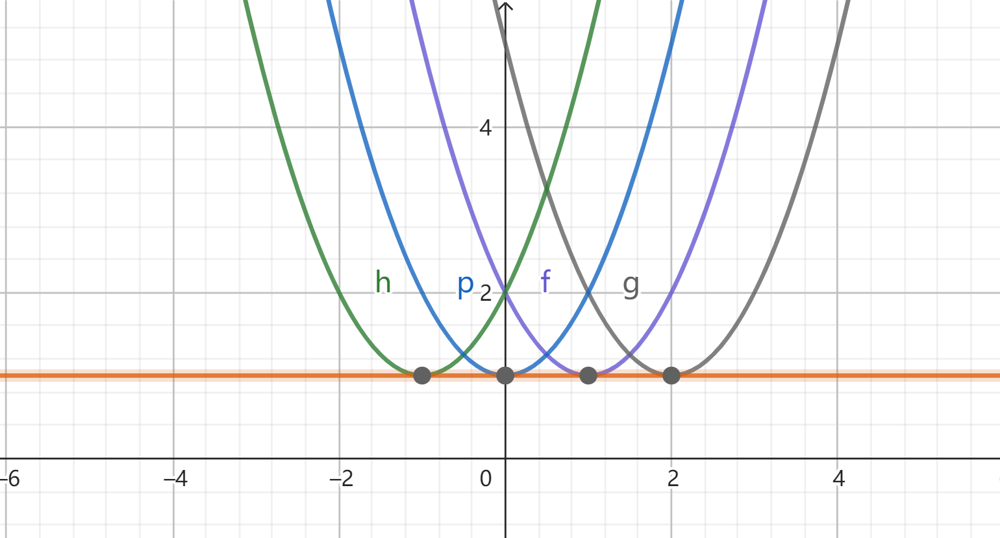

# 常微分方程4：隐式微分方程

## 一阶隐式微分方程

- **一阶显式微分方程**：$\frac{dy}{dx} = f(x,y)$
- **一阶隐式微分方程**：不能用x和y表示出导数的方程

### 微分法

- 设 $p = \frac{dy}{dx}$
- **显式方程形式**：$p = F(x,y)$
- **$y$ 隐式方程形式**（方程的解的形式）：$y = f(x,p)$
  - 对隐式方程进行微分：$p = f_x(x,p) + f_p(x,p)\frac{dp}{dx}$（一阶显式微分方程）
  - 该方程的解：$p = u(x,C)$
  - 原方程的通解：$y = f(x,u(x,C))$
- **$x$ 隐式方程形式**：$x=v(p,C)$
  - 原方程的通解：$y = f(v(p,C),p)$
- **克莱罗方程**：$y = xp+f(p)$，其中 $f''(p)\neq 0$
  - 微分结果：$p = p + x\frac{dp}{dx} + \frac{df}{dp}\frac{dp}{dx}$，即 $(x+\frac{df}{dp})\frac{dp}{dx} = 0$
    - 若 $\frac{dp}{dx} = 0$
      - $p=C$，通解为 $y = Cx + f(C)$
    - 若 $\frac{df}{dp} = -x$
      - 只有单解 $y = -f'(p)·p+f(p)$。
      - 若已知隐函数（逆映射）$p = w(x)$，则可将单解写成x自变量形式
        - $y = xw(x)+f(w(x))$
  - **推论（奇解）**：
    - 每点的单解都与某个通解相切
    - 单解中没有常数，不能由通解给出

#### 习题

- $x(y')^2 - 2yy' + 9x = 0$
  - 一阶隐式方程：$y = \frac{9x}{2p} + \frac{xp}{2}$
  - 微分法：$(\frac{1}{2} - \frac{9}{2p^2})(p-x\frac{dp}{dx}) = 0$
    - 因此 $\frac{dp}{dx} = \frac{p}{x}$ 和 $p^2 = 9$ 均为解
    - 则方程的解为
      - $p = Cx \Rightarrow y = \frac{1}{2}Cx^2 + D$
      - 和两个特解 $p=\pm3 \Rightarrow y=\pm3x+C$

### 参数法

- **无x方程**：$F(y,p) = 0$
- 设$\begin{cases} y = g(t) \\ p = h(t) \end{cases}$，则 $\begin{cases} dx = \frac{g'(t)}{h(t)}dt \\ x = \int\frac{g'(t)}{h(t)}dt + C  \end{cases}$
  - 条件：$p\neq 0，dx\neq 0即dy\neq 0$，因此需要讨论特解 $p = 0$ 和 $dx = 0$
- **无y方程**：$F(x,p) = 0$
- **完全隐式方程**：$F(x,y,p) = 0$，几何意义是空间曲面。参数表达式：$\begin{cases} x=f(u,v) \\ y=g(u,v) \\ p=h(u,v) \end{cases}$
  - $dy = pdx \Rightarrow M(u,v)du + N(u,v)dv =0$，若存在通解 $v=Q(u,C)$，则双参数方程变成单参数方程，从而换元即可得到结果
- **可解的依据**：微分方程是一个条件，导数的意义是另一个条件，两者结合就可求解。
  - 参数法只不过是把这个过程用参数的语言表达了出来。和微分法不同的一点是它更加自由

#### 习题

- 求解 $y^2 + (\frac{dy}{dx})^2 = 1$
  - 平方关系可设三角函数，$\begin{cases} y = cost \\ \frac{dy}{dx} = sint \end{cases}$，则 $x = C-t$，通解为 $y = cos(C-x)$
  - 同时，还有特解：$\begin{cases} y = \pm1 \\ \frac{dy}{dx}=0 \end{cases}$，没有线素矛盾。
  - 但$\begin{cases} y=0 \\ \frac{dy}{dx}=\pm1 \end{cases}$，存在线素矛盾，不是特解
- 参数法求解：$(\frac{dy}{dx})^2 +y-x = 0$
  - 设参数$\begin{cases} x = u \\ p = v \\ y = u-v^2 \end{cases}$，且由p定义得 $v = \frac{dy}{dx} = \frac{du-2vdv}{du} \quad (u\neq 0即v\neq 1)$
    - 此为变量分离方程，通解为 $u = -2v-ln(v-1)^2+C \Rightarrow \begin{cases}x = -2p-2ln(p-1)+C \\ y = -2p-2ln(p-1)+C-p^2 \end{cases}$，特解为 $p=1$
  - 已知了x和y的参数方程即可，p的影响并不用管。
- 参数法求解：$x^3+p^3 = 4xp$
  - 令 $\begin{cases} x = x \\ p = xt \end{cases}$
  - 根据等式求出 $x = \frac{4t}{1+t^3}，p = \frac{4t^2}{1+t^3}$
  - 然后有 $\large\frac{dy}{dt} = \frac{dy}{dx}·\frac{dx}{dt}$，积分即可得到结果

## 奇解

### 奇解的存在判别

- **奇解**：一阶微分方程有特解 $\Gamma$，且 $\Gamma$ 上 $\forall Q$，有一个不同于 $\Gamma$ 的解与其在 $Q$ 点相切，则 $\Gamma$ 为方程的奇解
  - *例子*：克莱罗方程的单解
- **奇解存在的必要条件**：
  - 函数 $F$ 在 $G$ 上连续，且对 $y$ 和 $p$ 有连续偏导数
  - 若 $y = \varphi(x)（x\in J）$ 是一个奇解，且 $(x,\varphi(x),\varphi'(x))\in G$，则其满足p-判别式
  - **奇解p-判别式**：$\begin{cases} F(x,y,p) = 0（方程定义） \\ F'_p(x,y,p)=0 （需要证明）\end{cases}$
  - **p判别曲线**：消去p得到方程 $\triangle (x,y) = 0$，则该方程的曲线称为p判别曲线
  - **证明**：
    - 反设 $\exist x_0$，使得 $F'_p(x,y,p)\neq 0$
      - 其满足隐函数存在条件，所以可唯一确定 $p = f(x,y)$
    - 隐函数求导得：$f'_y(x,y) = \large-\frac{F'_y(x,y,f)}{F'_p(x,y,f)}$
      - 由题设，该函数连续，$f(x,y)$ 满足Lipschitz条件
      - 由皮卡定理，该微分方程的解存在且唯一，而唯一性不满足奇解定义，矛盾
  - **注意**：这里是求偏导，是把 $x,y,p$ 看作独立的自变量的，所以没有 $\frac{dy}{dp}和\frac{dx}{dp}$
  - **本质**：不能存在 $p = f(x,y)$ 的隐函数，所以隐函数存在定理的导数条件必须不成立
  - **推论（非充要条件）**：满足p判别式的 $y = \varphi(x)$ 不一定是微分方程的解，解也不一定是奇解
- **奇解存在的充分条件**
  - 函数 $F$ 在 $G$ 上二阶连续可微，且p判别式得到的函数 $y=\varphi(x)$ 是方程的解
  - 若 $\begin{cases} F'_y(x,\varphi(x),\varphi'(x)) \neq 0 \\ F''_{pp}(x,\varphi(x),\varphi'(x))\neq 0 \\ F'_p(x,\varphi(x),\varphi'(x)) = 0 \end{cases}$，则 $y=\varphi(x)$ 是方程的奇解
  - **证明**
    - 首先，**做变换** $y = \varphi(x) + u$，设 $\frac{du}{dx} = q$
      - 设新方程为 $H(x,u,q)$，初值为 $\varphi(x_0) = -u$
      - 原方程和第三式变为：$\begin{cases} H(x,0,0) =0 \\ H'_q(x,0,0) = 0 \end{cases}$ 
      - 再由 $F$ 二阶连续可微，第一二式变为 $\begin{cases}  H'_u(x,0,0)\neq 0 \\ H''_{qq}(x,0,0)\neq 0 \end{cases}$
      - 即在x方向上H为常数，则 $H_x'(x,0,0) = H''_{xx}(x,0,0) = H''_{xq}(x,0,0) = 0$
    - **存在隐函数**：$u=\phi(x,q)$，初值为 $\phi(x_0,0)=0$
      - $\phi'_x(x,0) = -\cfrac{H_q\frac{dq}{dx} + H_x}{H_u} = 0 = \phi'_q(x,0) = \phi''_{xx}(x,0) = \phi''_{xq}(x,0)$
      - $\phi''_{qq}(x,0) \neq 0$
      - **x和q的偏导组合均为0**
    - **隐函数微分**：$u = \phi(x,q)$，得到 $\begin{cases} q = \phi'_x(x,q) + \phi'_q(x,q)\dfrac{dq}{dx} \\ \cfrac{dq}{dx} = \cfrac{q-\phi'_x(x,q)}{\phi_q'(x)} = h(x,q) \end{cases}$
      - 则 $q\to 0$ 时，$\cfrac{dq}{dx} = \cfrac{0}{0}$ 
      - 由L'Hospital法则 $\cfrac{dq}{dx} = \cfrac{1}{\phi''_{qq}(x,0)} = \tilde{h}(x)$
    - **连续延拓得有解**：构造连续延拓 $s(x,q) = \begin{cases} h(x,q),q\neq 0 \\ \tilde{h}(x),\quad q=0 \end{cases}$ 其在 $(x_0,0)$ 的邻域内连续
      - 由Peano定理，初值问题存在解 $u = \phi(x,r(x))$
    - **证明相切且不同**：该解满足 $\begin{cases} r(x_0) = 0 \\ r'(x_0) = s(x_0,0) = \tilde{h}(x_0)\neq 0 \end{cases}$
      - 奇解p-判别式检验，得到$\begin{cases} \phi(x_0,r(x_0)) = 0, \quad 解性 \\ \phi'(x_0,r(x_0)) = 0, \quad 解性 \\ \phi''(x_0,r_0) =\phi''_{qq}(x_0,r(x_0))(r'(x_0))^2 \neq 0, \quad \end{cases}$，满足奇解要求
- **理解**：
  - 简化操作：做变换转化为讨论0，使得极限容易讨论
  - 求取操作：构造连续延拓，需要满足
    - *第一式*：防止u偏导为0，达不到简化极限计算的效果
    - *第二式*：qq二阶导不为0，奇点极限存在，可被连续延拓，得到解的存在性
      - 同时它本身还满足p-判别式第二式
    - *第三式*：使得xq的偏导组合均为0，从而奇点为 0/0 待定型，可L法则求极限化为二阶导
- **本质**：奇解一定是通解和某个函数 $y = \varphi(x) + \phi(x,r(x))$
- **推论**：缺失条件3的反例
    - $y = 2x+y'-\frac{1}{3}(y')^3$
    - 微分法：$\begin{cases} 2x-y+p-\frac{1}{3}p^3 = 0 \\ 1-p^2=0 \end{cases}$，得到 $\varphi(x) = 2x\pm\frac{2}{3} (p=\pm 1)，\varphi'(x) = 2$
    - *奇解判别*：$\begin{cases} F_y = -1 \neq 0 \\ F_{pp}=-2p\neq 0 \\ F_p = 1-p^2 \neq 0\end{cases}$，第三式不满足条件，存在隐函数满足picard定理，解唯一

### 习题

- 连续函数 $E(y)，有E(0)=0，E(y) \neq 0\quad (0<y\leq 1)$
  - 则 $y=0$ 是奇解 $\Leftrightarrow \int^1_0\frac{dy}{E(y)}$ 收敛
  - **证明**：奇解p判别式直得

## 包络

### 单参数C的曲线族

- **单参数C的曲线族**：$K(C):V(x,y,C)=0$，其中函数连续可微
- **曲线族的包络**：连续可微的曲线 $\Gamma$ 中 $\forall q$，都有一条曲线 $K(C^*)$ 与 $\Gamma$ 相切于q点，且在q点的任何邻域内不同于$\Gamma$，则称曲线 $\Gamma$ 是曲线族$K(C)$的一支包络
  - *例子*：$K(C): y=(x+C)^2+1。\quad \Gamma: y=1$
  - 
- **包络奇解定理（显然）**：微分方程 $F(x,y,p)=0$ 有通积分 $U(x,y,C) = 0$，且通积分曲线族有包络 $\Gamma: y=\varphi(x)$，则包络是微分方程的奇解
  - **证明**：首先包络具有不同性和相切性，只需要包络为解就一定是奇解
    - q（切点）是解，再由q的任意性，即切点的任意性得到全集性，所以是解
- **包络存在的必要条件**：$\Gamma$ 是包络，且可表示为 $C$ 的光滑曲线，则其满足包络C-判别式或消去关系式
  - **包络C-判别式**：$\begin{cases} V(x,y,C)=0 \quad (包络是解)\\ V'_C(x,y,C)=0 \quad(包络相切) \end{cases}$
  - **消去关系式**：$\Omega(x,y)=0$
  - **证明**：包络的解性直得第一式
    - 首先由第一式可设出隐函数：$x=f(C)，y=g(C)$，
    - 对曲线取微分得 $dV(f(C),g(C),c) = V_xf'(C) + V_yg'(C) + V'_C = 0$
      - **包络的切向量**：$(f'(C),g'(C))$ （参数方程形式的 $(1,y'(x))$）
      - **曲线的切向量**：$(-V_y,V_x)$ （隐函数导数形式的 $(-\frac{V_y}{V_x},1)$）
      - 由共线得 $V_xf'(C) + V_yg'(C) = 0$
    - 综上两式得 $V'_C = 0$，第二式成立
  - **理解**：
    - 因为包络相切且遍历曲线族，所以其对每个C都有唯一解
    - 从而若C已知，则可以通过曲线族和包络唯一确定交点的x、y。所以包络可以表示成C的函数
- **包络存在的充分条件**：C判别式确定的曲线 $\Lambda$
  - 若满足非退化性条件 $(f'(C),g'(C))\neq \vec{0}，(V_x,V_y)\neq \vec{0}$，则其为一支包络
  - **证明**：
    - 首先V上可求隐函数 $y(x)$，以及隐函数导数，从而得到切向量 $(-V_y,V_x)$
    - $\Lambda$ 是参数方程，其切向量为 $(f'(C),g'(C))$
    - 然后把第二式逆推，得到两个向量共线即可得到切性
- **推论（周延性）**：
  - 奇解p-判别式求出的结果不完全（因为是必要条件）
  - 而包络C-判别式可以求出所有奇解（因为是根据曲线族来求的）

### 习题

- **利用包络求奇解**
  - 首先利用微分法/参数法求通积分，得到V
  - 然后写出V的C判别式，得到曲线 $\Lambda$ 方程
  - 然后验证非退化性条件，若不满足，则再通过画图等方式判断是否为包络
  - 如果是包络，则为奇解