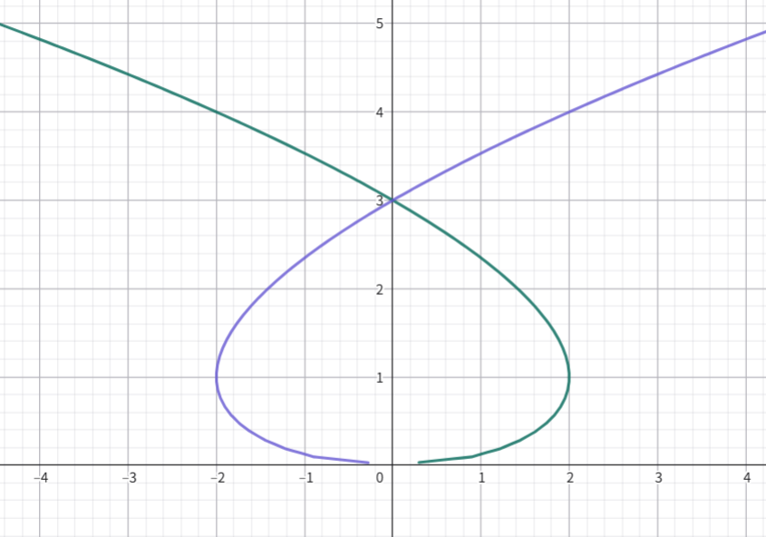

# 常微分方程4：隐式微分方程

- **符号约定**：
  - 设 $p = \dfrac{dy}{dx}$

## 一阶隐式微分方程

- **一阶显式微分方程**：$\dfrac{dy}{dx} = f(x,y)$
- **一阶隐式微分方程**：不能写为上述形式的方程

### 微分法求解

- **$y$ 隐式方程形式**：$y = f(x,p)$
  - **求解**：
    - 对该方程两边关于 $x$ 求导得 $p = f_x(x,p) + f_p(x,p)\frac{dp}{dx}$
    - 变为关于 $p$ 的一阶显式微分方程，用初等积分法求解即可
      - 若该方程的通解为 $p = u(x,C)$，则原方程的通解为 $y = f(x,u(x,C))$
- **$x$ 隐式方程形式**：$x=f(y, p)$
  - **求解**：
    - 对该方程两边关于 $x$ 求导得 $1 = f_y(y,p)p + f_p(y,p)\frac{dp}{dx}$
    - 一般无法求解，这种题还是用参数法吧
- **克莱罗方程**：$y = xp+f(p)$，其中 $f''(p)\neq 0$
  - **求解**：
    - 两边关于 $x$ 求导得 $p = p + x\dfrac{dp}{dx} + \dfrac{df}{dp}\dfrac{dp}{dx}$，化简为 $(x+\dfrac{df}{dp})\dfrac{dp}{dx} = 0$
    - 若 $\dfrac{dp}{dx} = 0$
      - 则此时 $p=C$，通解为 $y = Cx + f(C)$
    - 若 $\dfrac{df}{dp} = -x$
      - 则此时只有一个参数形式的解 $\begin{cases} x = -f'(p) \\ y = -f'(p)·p+f(p) \end{cases}$
      - 若已知隐函数（逆映射）$p = w(x)$，则可将该单解写成关于 $x$ 的函数 $y = xw(x)+f(w(x))$

#### 习题

- **微分法解方程**：求解 $x(y')^2 - 2yy' + 9x = 0$
  - **解（微分法）**：
    - 化为一阶隐式方程得 $y = \dfrac{9x}{2p} + \dfrac{xp}{2}$
    - 求微分得 $(\dfrac{1}{2} - \dfrac{9}{2p^2})(p-x\dfrac{dp}{dx}) = 0$，即 $\dfrac{dp}{dx} = \dfrac{p}{x}$ 和 $p^2 = 9$ 均为解
    - 计算得所有解为
      - **通解** $p = Cx \red\Rightarrow y = \dfrac{1}{2}Cx^2 + D$
      - **特解** $p=\pm 3 \red\Rightarrow y=\pm3x+C$
- **解的参数表达**：$2(y')^3 + y' = y$
  - **解（微分法）**：
    - 微分法易得 $3p^2 + \ln |p| = x+C$
    - 此时无法写出显式解，但可以 $p$ 为参数写出参数函数形式的解 $$\begin{cases} x = 3p^2 + \ln|p| + C \\ y = 2p^3 + p \end{cases}$$
      - 在这个参数函数中，$p$ 的数学意义是自由参量，而非导函数

### 参数法求解

- **$x$ 驻定方程（不含 $x$ 的方程）**： $F(y,p) = 0$
  - **求解**：
    - 若存在函数 $g,h$ 满足 $F\Big( g(t),h(t) \Big) = 0$
    - 则可设 $\begin{cases} y = g(t) \\ p = h(t) \end{cases}$，易得此时有 $\begin{cases} \cfrac{dx}{dt} = \cfrac{g'(t)}{h(t)} \\\\ x(t) = \dis\int\frac{g'(t)}{h(t)}dt  \end{cases}$
    - 计算积分即得参数形式的解
  - **特解**：上面的计算过程要求 $p(t)\neq 0，y'(t)\neq 0$，因此需要讨论这两种情况的特解
- **$y$ 驻定方程（不含 $y$ 的方程）**：$F(x,p) = 0$
  - **求解**：方法同上
- **完全隐式方程**：$F(x,y,p) = 0$，几何意义是空间曲面
  - **求解**：
    - 若存在函数 $f,g,h$ 满足 $F\Big( f(u,v),g(u,v),p(u,v) \Big) = 0$
    - 则可设 $\begin{cases} x=f(u,v) \\ y=g(u,v) \\ p=h(u,v) \end{cases}$
    - 由 $dy = p(x)dx$，代入参数将其变形为 $M(u,v)du + N(u,v)dv =0$
      - 若该方程存在通解 $v=Q(u,C)$，则此时可得原方程的通解的参数形式 $$\begin{cases} x = f\Big( u,Q(u,C) \Big) \\ y = g\Big( u,Q(u,C) \Big) \end{cases}$$
  - **几何意义**：
    - ODE决定了一个曲面，导函数的定义式决定了另一个线性无关的曲面，两者结合就可确定一个曲线，即方程的解
    - 所以参数法的手法也类似数分中用偏导数求曲线方程的手法

#### 习题

- 参数法类似初等变换法，比较灵活，需要一定的观察力来选取合适的参数函数。下面是几种常见的换元技巧
- **三角换元法**：遇到 $ax^2+by^2 = c$ 这种方程时，直接设三角函数就行
  - 求解 $y^2 + (y')^2 = 1$
    - **解**：
      - 设 $\begin{cases} y = \cos t \\ p = \sin t \end{cases}$，则 $x = C-t$，从而通解为 $y = \cos(C-x)$
      - 考虑特解 $\begin{cases} y = \pm1 \\ p = 0 \end{cases}$，易得无矛盾。但 $\begin{cases} y=C \\ p=\pm \sqrt{1-C^2} \end{cases}$，仅当 $C=\pm 1$ 时成立
- **类线性方程**：若只有一个项是高次项，则直接设 $x,p$ 是两个参数即可
  - 求解 $(y')^2 +y-x = 0$
    - **解（微分法）**：直接做就行，其实没必要用参数法
    - **解（参数法）**：
      - 设参数 $\begin{cases} x = u \\ p = v \\ y = u-v^2 \end{cases}$
      - 由 $p$ 定义得 $v = \dfrac{dy}{dx} = \dfrac{du-2vdv}{du} \quad (u\neq 0即v\neq 1)$
        - 此为变量分离方程，容易求得通解为 $u = -2v-\ln(v-1)^2+C$
        - 从而原方程通解为 $\begin{cases}x = -2p-2\ln(p-1)+C \\ y = -2p-2\ln(p-1)+C-p^2 \end{cases}$
        - 取 $u=0$ 即得原方程特解为 $p=1$
- **类齐次方程**：可设 $p=yt$ 或 $p=xt$，让方程降次
  - $x^3+p^3 = 4xp$
    - **解**：
      - 令 $p = xt$，由原方程可得 $x = \cfrac{4t}{1+t^3}，p = \cfrac{4t^2}{1+t^3}$
      - 再由 $\cfrac{dy}{dt} = \cfrac{dy}{dx}\cdot\cfrac{dx}{dt}$，对其积分即可
      - 最终得到
  - 求解 $(y')^3 + y^3-3yy' = 0$
    - **解**：
      - 设 $p = ty$，则原方程化为弱齐次形式 $y^2\Big[ (t^3+1)y + 3t \Big] = 0$
        - $y=0$ 是一个特解
      - 此时可变形为普通方程 $y = \cfrac{3t}{1+t^3}$，从而 $p = \cfrac{3}{1+t^3}$
      - 再由 $\cfrac{dy}{dt} = \cfrac{dy}{dx}\cdot\cfrac{dx}{dt}$，即得 $\cfrac{dx}{dt} = \cfrac{1-2t^3}{1+t^3}$
      - 最终得到
- **参数法比微分法更简单**：
  - $(y')^2-2xy'+1 = 0$
    - **解（微分法）**：微分的 $\cfrac{dp}{dx} = \cfrac{p}{p-x}$，是齐次方程，解得 $|px(2-px)| = Ce^{-x^2}$，然而它并没有给出 $x,y$ 的参数解，故实际上没做出来
    - **解（参数法）**：
      - 设 $p = xy$，则 $x = \cfrac{1}{\sqrt{t(2-t)}}，p = \sqrt{\cfrac{t}{2-t}}$
      - 前面也说了，给出 $x,p$ 的参数表示没有用，必须给出 $x,y$ 的才行
      - 再由于 $y = \dis\int pdx = \int \sqrt{\frac{t}{2-t}} d\Big( \cfrac{1}{\sqrt{t(2-t)}} \Big) = \int\frac{1-t}{t(2-t)^2}dt$，积分即可得参数解
- **可分离方程**：可以分离成 $y = f(x,p)$ 的形式
  - $2yy'-y-x(y')^2 = 0$
    - **解（微分法）**：变形为 $y = \cfrac{xp^2}{2(p-1)}$，两边微分后即可求解
- **因式分解定理**：
  - 若方程可因式分解为 $F(x,y,p)G(x,y,p) = 0$
  - 则可对 $F = 0$ 和 $G=0$ 分别求解得 $f(x,y,C) = 0$ 和 $g(x,y,C) = 0$
  - 此时原方程的解是所有满足 $f(x,y,C_1) = 0$ 和 $g(x,y,C_2) = 0$ 的曲线
  - **证明**：定义即可
- **通积分定理**：在上面情况中，通积分可写成 $f(x,y,C)g(x,y,C) = 0$
  - **证明**：
    - 对其取全微分，易得 $\cfrac{dy}{dx} = -\cfrac{gf_x + fg_x}{gf_y + fg_y}$
      - 由于 $f,g$ 都依赖于 $C$，故我们要想办法消去 $C$
    - 将通积分与该方程联立
      - 当某点 $f = 0，g\neq 0$ 时，代入 $\dfrac{dy}{dx}$ 得 $F=0$
      - 当某点 $f \neq 0，g = 0$ 时，代入 $\dfrac{dy}{dx}$ 得 $G=0$
      - 当某点 $f = g = 0$ 时，其为奇点，单独讨论
      - 综上，可写成 $FG = 0$
  - **实例**：
    - $p(p-1) = 0$
      - **解集**：两个解集为 $y=C_1$ 和 $y = x+C_2$，即全体横线和全体正比例函数
      - **通积分**：$(y-C)(y-x-C) = 0$
        - 对其取全微分得 $\cfrac{dy}{dx} = \cfrac{y-C}{(y-C) + (y-x-C)}$
        - 当 $y-C = 0$ 时 $p=0$
        - 当 $y-x-C = 0$ 时 $p=1$
        - 故 $p = 0\ 或\ 1$，从而可写为 $p(p-1) = 0$，得到原方程

## 奇解

### 奇解的存在判别

- **奇解**：设一阶ODE有特解 $\Gamma$。若对于 $\Gamma$ 上任意点 $Q$，都存在一个不同于 $\Gamma$ 的解与其在 $Q$ 点相切，则 $\Gamma$ 为方程的奇解
  - **实例**：克莱罗方程的解
- **奇解存在的必要条件**：
  - 设函数 $F(x,y,p)$ 在 $G$ 上连续，且对 $y$ 和 $p$ 有连续偏导数
  - 若
    - $y = \varphi(x)\pad (x\in J)$ 是 $F = 0$ 的奇解
    - $x\in J$ 时恒有 $(x,\p(x),\p'(x)) \in G$
  - 则 $y=\p(x)$ 满足**奇解p-判别式**：$\begin{cases} F(x,y,p) = 0（方程定义） \\ F_p(x,y,p)=0 （需要证明）\end{cases}$
  - **p判别曲线**：反用隐函数存在定理，奇解p-判别式可消去 $p$ 得到 $\D(x,y) = 0$，其图像称为p判别曲线（它就是奇解的图像）
  - **证明**：
    - 反设 $\exist x_0\in J$，使得 $F_p(x,y,p)\neq 0$
    - 其满足隐函数存在条件，所以可唯一确定隐函数 $p = f(x,y)$
      - 它同时也是题设隐式微分方程的显式形式
      - 由题设得 $f_y(x,y) = -\cfrac{F_y(x,y,f)}{F_p(x,y,f)}$ 连续，故 $f(x,y)$ 满足Lipschitz条件
      - 故由皮卡定理，$p = \dfrac{dy}{dx} = f(x,y)$ 的解存在且唯一，但唯一性不满足奇解的重合性，矛盾
  - 这里是求偏导，是把 $x,y,p$ 看作独立的自变量的，所以没有 $\frac{dy}{dp}和\frac{dx}{dp}$
  - **本质**：不能存在 $p = f(x,y)$ 的隐函数，所以隐函数存在定理的导数条件必须不成立
  - **推论（无充分性）**：满足p判别式的 $y = \varphi(x)$ 不一定是微分方程的解，解也不一定是奇解
- **奇解存在的充分条件**
  - 设函数 $F$ 在 $G$ 上二阶连续可微，且p判别式得到的函数 $y=\varphi(x)$ 是方程的解
  - 若 $\begin{cases} F'_y(x,\varphi(x),\varphi'(x)) \neq 0 \\ F''_{pp}(x,\varphi(x),\varphi'(x))\neq 0 \\ F'_p(x,\varphi(x),\varphi'(x)) = 0 \end{cases}$，则 $y=\varphi(x)$ 是方程的奇解
  - **证明**
    - 首先，**做变换** $y = \varphi(x) + u$，设 $\frac{du}{dx} = q$
      - 设新方程为 $H(x,u,q)$，初值为 $\varphi(x_0) = -u$
      - 原方程和第三式变为：$\begin{cases} H(x,0,0) =0 \\ H'_q(x,0,0) = 0 \end{cases}$ 
      - 再由 $F$ 二阶连续可微，第一二式变为 $\begin{cases}  H'_u(x,0,0)\neq 0 \\ H''_{qq}(x,0,0)\neq 0 \end{cases}$
      - 即在x方向上H为常数，则 $H_x'(x,0,0) = H''_{xx}(x,0,0) = H''_{xq}(x,0,0) = 0$
    - **存在隐函数**：$u=\phi(x,q)$，初值为 $\phi(x_0,0)=0$
      - $\phi'_x(x,0) = -\cfrac{H_q\frac{dq}{dx} + H_x}{H_u} = 0 = \phi'_q(x,0) = \phi''_{xx}(x,0) = \phi''_{xq}(x,0)$
      - $\phi''_{qq}(x,0) \neq 0$
      - **x和q的偏导组合均为0**
    - **隐函数微分**：$u = \phi(x,q)$，得到 $\begin{cases} q = \phi'_x(x,q) + \phi'_q(x,q)\dfrac{dq}{dx} \\ \cfrac{dq}{dx} = \cfrac{q-\phi'_x(x,q)}{\phi_q'(x)} = h(x,q) \end{cases}$
      - 则 $q\to 0$ 时，$\cfrac{dq}{dx} = \cfrac{0}{0}$ 
      - 由L'Hospital法则 $\cfrac{dq}{dx} = \cfrac{1}{\phi''_{qq}(x,0)} = \tilde{h}(x)$
    - **连续延拓得有解**：构造连续延拓 $s(x,q) = \begin{cases} h(x,q),q\neq 0 \\ \tilde{h}(x),\quad q=0 \end{cases}$ 其在 $(x_0,0)$ 的邻域内连续
      - 由Peano定理，初值问题存在解 $u = \phi(x,r(x))$
    - **证明相切且不同**：该解满足 $\begin{cases} r(x_0) = 0 \\ r'(x_0) = s(x_0,0) = \tilde{h}(x_0)\neq 0 \end{cases}$
      - 奇解p-判别式检验，得到$\begin{cases} \phi(x_0,r(x_0)) = 0, \quad 解性 \\ \phi'(x_0,r(x_0)) = 0, \quad 解性 \\ \phi''(x_0,r_0) =\phi''_{qq}(x_0,r(x_0))(r'(x_0))^2 \neq 0, \quad \end{cases}$，满足奇解要求
  - **理解**：
    - 简化操作：做变换转化为讨论0，使得极限容易讨论
    - 求取操作：构造连续延拓，需要满足
      - *第一式*：防止u偏导为0，达不到简化极限计算的效果
      - *第二式*：qq二阶导不为0，奇点极限存在，可被连续延拓，得到解的存在性
        - 同时它本身还满足p-判别式第二式
      - *第三式*：使得xq的偏导组合均为0，从而奇点为 0/0 待定型，可L法则求极限化为二阶导
  - **本质**：奇解一定是通解和某个函数 $y = \varphi(x) + \phi(x,r(x))$
  - **反例（缺失条件3）**：$$y = 2x+y'-\frac{1}{3}(y')^3$$
      - **证明**：
        - **求解**：
          - 用微分法得 $\begin{cases} 2x-y+p-\frac{1}{3}p^3 = 0 \\ 1-p^2=0 \end{cases}$
          - 计算得 $\varphi(x) = 2x\pm\frac{2}{3} (p=\pm 1)，\varphi'(x) = 2$
        - **奇解判别**：
          - 计算得 $\begin{cases} F_y = -1 \neq 0 \\ F_{pp}=-2p\neq 0 \\ F_p = 1-p^2 \neq 0\end{cases}$，第三式不满足条件
        - **不满足奇解**：存在隐函数满足picard定理，解唯一

### 习题

- **局部唯一条件的奇解表示**：
  - 设 $F(y)$ 连续
  - 若 $\begin{cases} F(0)=0 \\ F(y) \neq 0 &  (0<y\leq 1) \end{cases}$，则 $y=0$ 是奇解 $\LR \dis\int^1_0\frac{dy}{F(y)}$ 收敛
  - **证明**：奇解p判别式直得结论
- **根据奇解构造方程**：
  - 求方程 $F = 0$ 使得 $y=\sin x$ 是奇解
    - **解**：
      - 已知克莱罗方程的奇解为 $\begin{cases} x = -f'(t) \\ y = -f'(t)t+f(t) \end{cases}$
      - 只需求 $-f'(t)t + f(t) = -\sin f'(t)$ 的解
        - 微分法易得解为 $\begin{cases} t = -\cos u - u \\ y = -\sin u + u\cos u + u^2 \end{cases}$
        - 将其写成 $y = f(t)$，则 $F(x,y,p) = y-xp+f(p) = 0$ 就是所需微分方程
## 包络

### 单参数C的曲线族

- **关于参数C的曲线族**：$K(C):V(x,y,C)=0$，其中 $V$ 在定义域中连续可微
- **曲线族的包络**：
  - 设 $\Gamma$ 是连续可微的曲线
  - 若对任意点 $q\in \G$，都有一条曲线 $K(C^*)$ 与 $\Gamma$ 相切于 $q$ 点，且在 $q$ 点的任何邻域内不同于 $\Gamma$
  - 则称曲线 $\Gamma$ 是曲线族 $K(C)$ 的一支包络
  - 微分几何的包络要求与每条积分曲线都相切，这里包络仅要求每点都存在相切的积分曲线
  - 其实这里的包络就是根据奇解的几何意义来定义的，故和微分几何中情况不同
  - **实例**：$\begin{cases} K(C): y=(x+C)^2+1 \\ \Gamma: y=1 \end{cases}$
  
  - 包络是根据曲线族定义的，奇解是根据微分方程定义的。
- **包络奇解定理**：
  - 设微分方程 $F(x,y,p)=0$ 有通积分 $U(x,y,C) = 0$
  - 若通积分曲线族有包络 $\Gamma: y=\varphi(x)$，则包络是微分方程的奇解
  - **证明**：
    - 由定义，包络具有非通性和重合性，故只要包络为解就一定是奇解
    - 由定义，切点 $q$ 是解函数的某点，符合方程。再由 $q$ 的任意性，即得整个包络都是解
- **包络存在的必要条件**：
  - 设 $\Gamma$ 是曲线族 $K(C)$ 的一支包络，且可表示为 $C$ 的光滑曲线，则其满足包络C-判别式
  - **包络C-判别式**：$\begin{cases} V(x,y,C)=0 \quad (包络重合性)\\ V_C(x,y,C)=0 \quad(包络相切性) \end{cases}$
  - **包络曲线**：上面的两函数进行组合消去 $C$ 后形成的 $\Omega(x,y)=0$ 就是包络 $\G$
  - **证明**：
    - 由包络的解性直得第一式
    - 易得包络曲线 $\G$ 可写为参数函数 $\begin{cases} x=f(C) \\ y=g(C) \end{cases}$
    - 求导得 $V'(f(C),g(C),C) = V_xf'(C) + V_yg'(C) + V_C = 0$
      - **包络的切向量**：$(f'(C),g'(C))$ （参数方程形式的 $(1,y'(x))$）
      - **曲线的切向量**：$(-V_y,V_x)$（隐函数导数形式的 $(-\frac{V_y}{V_x},1)$）
      - 由共线得 $V_xf'(C) + V_yg'(C) = 0$
    - 结合以上两式即得 $V_C = 0$，从而第二式成立
  - 和奇解必要条件的证明相同，都是用隐函数。两个证明互换也完全可以，方法不唯一
  - 奇解是用 $p(x,y)$ 隐函数 + 唯一性进行反证
  - 包络是用 $\Big( x(C),y(C) \Big)$ 隐函数 + 全微分进行正证
  - **理解**：
    - 因为包络相切且遍历曲线族，所以其对每个C都有唯一解
    - 从而若C已知，则可以通过曲线族和包络唯一确定交点的x、y。所以包络可以表示成C的函数
- **包络存在的充分条件**：
  - 设 $C$ 判别式确定了曲线 $\Lambda(C):\begin{cases} x = f(C) \\ y = g(C) \end{cases} \pad (C\in J)$
    - C判别式的几何意义是两个曲面的交集，从而可确定一条曲线
    - $\L(C)$ 实际上就是 $\O(x,y) = 0$ 的参数形式
  - 若满足非退化性条件 $\begin{cases} \Big( f'(C),g'(C) \Big)\neq \vec{0} \\\\ \Big( V_x(C),V_y(C) \Big)\neq \vec{0} \end{cases}$，则 $\L$ 为曲线族 $V(x,y,C)$ 的一支包络
    - 非退化性条件其实就是包络和曲线的切向量都不退化为 $\vec 0$，从而可应用隐函数定理
  - **证明**：
    - 取定 $C$，设点 $P = \Big( f(C),g(C) \Big)$
      - 由非退化性条件 + 隐函数存在定理得 $V$ 在 $P$ 点可确定光滑隐函数 $y(x)$，且隐函数切向量 $\a = (-V_y,V_x)$ 始终不为零
      - 由数分知识，$\Lambda$ 在 $P$ 处切向量为 $\b = (f'(C),g'(C))$
    - 由 $V'\Big( f(C),g(C),C \Big) = 0$ 易得 $\a,\b$ 共线，从而 $\L$ 与曲线族处处相切
    - 再由于 $\L$ 是 $C$ 的函数，而曲线族中每个曲线的 $C$ 固定，故 $\L$ 不在曲线族中，从而满足包络定义
  - **推论**：
    - 奇解p-判别式求出的结果不完全（因为是必要条件）
    - 而包络C-判别式可以求出所有奇解（因为是根据曲线族来求的）

### 习题

#### 求奇解的方法总结

- **p判别法**：
  - 首先写出p判别式 $F_p = 0$，再和原方程 $F=0$ 联立，变形得 $\begin{cases} x = f(p) \\ y = g(p) \end{cases}$
    - 这里不能直接把 $F_p = 0$ 当成微分方程求解，必须常规变形
  - 再验证奇解充分性条件，若满足则是奇解。不满足则需要用其它方法进行验证
- **c判别法**：
  - 首先求出通积分 $V$
  - 再写出通积分 $V$ 的C判别式，得到 $\L(C)$
  - 验证非退化性条件，若满足则是奇解。不满足则需要用其它方法进行验证
- **特解法**：
  - 因为奇解必定是特解，故求出全部特解，再验证是否是奇解即可

#### 计算例

- **例1**：$(y-1)^2(y')^2 = \dfrac{4}{9}y$
  - **解（p判别法）**：
    - 易得 $F_p(x,y,p) = 0$ 的解为 $y=0$
    - 验证充分性条件得 $\begin{cases} F_y(x,0,0) =  \dfrac{4}{9} \neq 0\\ F_{pp}(x,0,0) = 2\neq 0 \end{cases}$，故是奇解
  - **解（C判别法）**：
    - 易得通积分为 $(x+C)^2-y(y-3)^2 = 0$
      - 易得 $y=1$ 不是特解，但 $y=0$ 是特解
      - 方程可转化为 $\dfrac{dy}{dx} = \pm\dfrac{2}{3}\dfrac{\sqrt{y}}{y-1}$，变量分离法求解即可
    - 根据包络C判别式，得两条曲线 $\begin{cases} x = C \\ y=0 \end{cases}$ 和 $\begin{cases} x = C \\ y=3 \end{cases}$
      - 易得前者满足非退化条件，故是奇解，但后者不满足，故不是奇解
  - 下面是通积分的一个图像（可在 $x$ 轴方向平移）
  
- **例2**：$(y')^4 - (y')^3 - y^2y' + y^2 = 0$
  - **解（p判别法）**：
    - $F_p(x,y,p) = 0$ 解得 $y^2 = 4p^3-3p^2$
    - 联立原方程得 $\begin{cases} p=0 \\ y= 0 \end{cases}$ 或 $\begin{cases} p=1 \\ y=\pm 1 \end{cases}$
    - 充分性判别得第一个是奇解，但第二个不是
  - **解（C判别法）**
    - 求解得通积分为 $\Big[ y-\dfrac{1}{27}(x-C)^3 \Big]\Big[ y-(x-C) \Big] = 0$
      - 首先将方程因式分解为 $\Big[ (y')^3-y^2 \Big](y'- 1) = 0$，再分别求解两个方程即可
    - 根据包络C判别式，得两条曲线 $\begin{cases} x = C \\ y=0 \end{cases}$ 和 $\begin{cases} x = C\pm 3\sqrt{3} \\ y = \pm 3\sqrt{3} \end{cases}$
    - 易得第一个满足非退化性条件，但第二个不满足