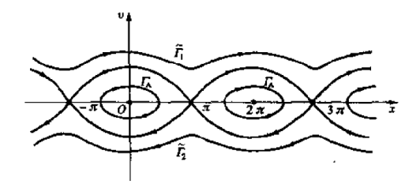
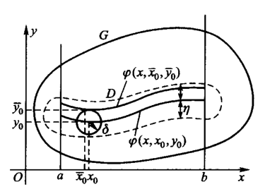

# 常微分方程5：高阶微分方程

- 此时我们进入了一个新领域，在之前我们研究微分方程解的形状，现在我们研究微分方程迭代中间解的形状

## 自治方程

- **驻定方程**：不包含显式自变量x的方程，如 $F(y,\frac{dy}{dx},...,\frac{d^ny}{dx^n}) = 0$
- **常规降价法**：
  - *导数换元*：令 $z = \frac{dy}{dx}$
    - 由链式法则，得到 $F(y,z,z\frac{dz}{dy},...,\varphi(z,\frac{dz}{dy},...,\frac{d^{n-1}z}{dy^{n-1}})) = 0$
  - *退化性*：此时 $y$ 变为自变量，$z$ 变为因变量，从而方程降一阶
  - *迭代求解*：如果降阶后的方程可解，那么对中间解 $z = F(y)$ 再代入 $z = \frac{dy}{dx}$，继续进行求解
    - 最终可得 $x = u(t,C_1,C_2,...)$

### 中间解的形状

- **位移-速度模型**：$v = \frac{dx}{dt}$
  - **轨线**：中间解 $v = F(x)$ 确定的曲线族
  - **相平面**：平面 $Oxv$
  - **相图**：相平面上的轨线分布图
- **自治二阶微分方程的几何作图法**：设方程的解为 $v^2 = 2F(x) + C_1$
  - 首先画出 $2F(x)$ 的图形
  - $v(x)$ 是个分段函数
    - 当 $2F(x) > -C_1$ 时，轨线为 $v = \pm\sqrt{2F(x)+C_1}$
    - 当 $2F(x_1) = -C_1$ 时，轨线为单点 $(x_1,0)$
    - 当 $2F(x) < -C_1$ 时，轨线为 $v$

### 例子

- **单摆方程（简谐运动方程）**：设角速度为 $\dfrac{dx}{dt}$
  - **物理方程**：$F = ma$，即 $-mgsinx = m(l\dfrac{d^2x}{dt^2})$，即 $\dfrac{d^2x}{dt^2}+a^2sinx=0$
    - $a = \sqrt{\dfrac{g}{l}}$
  - **首次积分法求解**：
    - 两边同乘p得到 $p·\dfrac{dp}{dt} + a^2sinx·\dfrac{dx}{dt} = 0$
    - 由积分同时性，两项可单独对 $t$ 积分，得到 $\frac{1}{2}p^2 - a^2cosx = -\frac{1}{2}C_1$
      - $\color{chartreuse}{\int a^2sinx \dfrac{dx}{dt}\cdot dt = a^2cosx + C}$
      - 最终转化为**轨线方程** $\dfrac{dx}{dt} = \pm\sqrt{2a^2\cos x - C_1}$
  - **近似法求解**：$\sin x \approx x$，则原方程化为线性方程，解为 $x = Asin(at + D)$
    - 振幅和速度初值有关：$A = \frac{C_1}{a}$
    - 相位和位移初值有关：$D = aC_2$
    - 即 $w = \frac{k}{m}$
    - 因此，方程的解和初值有关。$C_1$ 表示速度初值，$C_2$ 表示位移初值
  - **当单摆存在大振幅时**：设振幅为 $A$，初值为最大振幅处，则 $C_1 = \cos A$
    - 求周期：对四分之一周期进行变量分离积分
      - $\large\frac{1}{4}T = \int^A_0 \frac{dx}{\sqrt{2a^2cosx - cosA}}$
      - 发现周期和振幅有关
    - **单摆的进动（存在正加速度）**：振幅变大，周期变化，角速度发散
      - 体现在轨线上，$a$ 不变，$C_1$ 变大
  - **相图**：$\Gamma_A$ 是普通轨线，$\Gamma_1、\Gamma_2$ 是进动轨线 $\\$
    
- **悬链线方程**：
  - 设 $\gamma$ 是微分弧 $ds$ 上的重力
    - 水平方向的微分弧受力方程：$H(x) = H(x+\triangle x)$
    - 竖直方向的微分弧受力方程：$V(x+\triangle x) - V(x) =\gamma·ds$
  - 综上，$\begin{cases} H(x) = H，水平方向受力 \\ V'(x) = \gamma\frac{ds}{dx}，竖直方向受力 \end{cases}$
    - 由弧长公式得 $\frac{ds}{dx} = \sqrt{1+(y'(x))^2}$
    - 由张力分解得 $y'(x) = tan\theta = \frac{V(x)}{H}$
  - **物理方程**：$y'' = a\sqrt{1+(y')^2}$，其中 $a = \dfrac{\gamma}{H}$
  - **边值问题**：在题目中
    - 已知两个零阶初值（两个边界初值）$\begin{cases} y(x_1) = y_1 \\ y(x_2) = y_2 \end{cases}$
    - 但不知道每一阶初值 $y(x_0)，y'(x_0)$
  - **求解**：
    - 二阶自治系统，可常规降价，得到含参通解 $y = \frac{1}{a}\cosh a(x+C_1) + C_2$
      - $a,C_1,C_2$ 之间存在依赖关系
    - 由边值条件，得到二阶方程组，求解可得 $C_1(a),C_2(a)$
    - 但是 $a$ 的具体值还没有确定，需要利用边值条件的约束来求取
  - **解的约束条件**
    - **约束1（题目约束：大小）**：$L > \sqrt{(x_1-x_2)^2 + (y_1-y_2)^2}$
      - 弧线 > 割线
      - 可消去不合理解
    - **约束2（边值约束：等价）**：$L = \int^{x_1}_{x_2}\sqrt{1+(y')^2}dx = \frac{1}{a}\int^{x_1}_{x_2}y''(x)dx$
      - 左项是弧长积分公式，右项是悬链线物理方程的性质
      - 可得到 $a$
- **二体问题**：太阳原点坐标系，地球坐标设为 $r(t) = (x(t),y(t),z(t))$
  - 万有引力定律得 $f(t) = -G\dfrac{m_sm_e}{|r(t)|^2}\dfrac{r(t)}{|r(t)|}$
  - 牛顿第二定律得 $m_er''(t) = f(t)$
  - 综上，$\begin{cases} x'' = -\dfrac{Gm_sx}{(\sqrt{x^2+y^2+z^2})^3} \\ y'' = -\dfrac{Gm_sy}{(\sqrt{x^2+y^2+z^2})^3} \\ z'' = -\dfrac{Gm_sz}{(\sqrt{x^2+y^2+z^2})^3} \end{cases}$

## 向量表达

- **n阶微分方程**：$\dfrac{d^ny}{dx^n} = F(x,y,\dfrac{dy}{dx},...,\dfrac{d^{n-1}y}{dx^{n-1}})$，解是 $y(x)$
- **标准方程组形式**：设 $y_1=y，y_2=\frac{dy}{dx}，...$
  - $\begin{cases}
    \frac{dy_1}{dx} = f_1(x,y_1,...,y_n) \\
    \frac{dy_2}{dx} = f_2(x,y_1,...,y_n) \\
    \cdots \\
    \frac{dy_n}{dx} = f_n(x,y_1,...,y_n) \\
  \end{cases}$
  - **知一求n**：已知 $f_i$，则 $k>i$ 时微分，$k<i$ 时积分，可导出所有 $f_k$
  - **依赖性等价定理**：各阶导数之间的微分关系 $\Leftrightarrow$ 方程组刻画的多变量依赖关系
  - **推论**：含有多个未知数的微分方程组，也可以分别将 $u,u',...,v,w$ 等设为 $y_i$，写成标准方程组形式
- **向量形式**：$\dfrac{d\vec{y}}{dx} = \vec{f}(x,\vec{y})$
  - 向量 $\vec{y} = (y_1,...,y_n)$
  - 分量函数（每个方程）$\dfrac{dy_i}{dx} = f_i(x,y) = f_i(x,y,...,y_n)$
  - 向量值函数（方程组）$\vec{f}(x,\vec{y}) = (f_1(x,\vec{y}),f_2(x,\vec{y}),...,f_n(x,\vec{y}))$

### 模

- 模的分类
  - 1-范数（曼哈顿模）：$|\vec{y}| = |y_1|+|y_2|+...+|y_n|$
  - 2-范数（欧几里得模）：$|\vec{y}| = \sqrt{y_1^2+y_2^2+...+y_n^2}$
  - $\infty$-范数：$|\vec{y}| = max\{|y_1|,|y_2|,...,|y_n|\}$
- 只要拥有三种性质，就可以定义为模：
  - 正定性
  - 数乘性
  - 三角不等式
- n维赋范（有模）线性空间
  - 欧氏空间的范数定义：$\|X\| = \sqrt{(X,X)} = \sqrt{X^TX}$
  - 欧氏空间中，模的意义是向量的长度
  - 非欧空间中没有内积（？未完）

### 赋范线性空间上的解定理（证明过程就不写了）

- 皮卡定理
- 阿斯科利引理
- Peano定理

### 线性微分方程组

- **列向量写法**：$\frac{d\vec{y}}{dx} = \vec{y}\vec{A}(x) + \vec{e}(x)$
- 若两个函数在区间 $(a,b)$ 上连续，则成立存在区间的p比较定理

## 解对初值的依赖

- **n阶微分方程的初值问题**：$\frac{d\vec{y}}{dx} = \vec{f}(x,\vec{y},\vec{\lambda})$
  - 把初值当作一个自变量（维度），研究参数对 $f$ 连续性的影响

### 解对初值的对称性

- **方程满足初值条件的解**：$y = \varphi(x;\ x_0,y_0)$
- 则 $x、y$ 和 $x_0、y_0$ 可以调换位置：$y_0 = \varphi(x_0;\ x\,y)$
  - **理解**：
    - 若曲线族的形状确定，则初值决定其位置
    - 反过来，若曲线族的形状和位置确定，则初值可被位置表出
  - **证明**：取任意一点 $(x_1,y_1)$，讨论即可

### 解对初值和参数的连续依赖性

- **实例**：单摆模型中，物理参数 $a$ 和速度与相位初值 $C_1,C_2$ 共同决定了方程的解（曲线积分的形状）
- **初值对解连续性的影响**：（下面的 $y$ 是各阶导数的向量，$\lambda$ 是各个参数的向量）
  - 若
    - $f(x,y,\lambda)$ 在 $G: \begin{cases} |x\leq a \\ |y| \leq b \\ |\lambda-\lambda_0|\leq c \end{cases}$ 上连续
    - 对 $y$ 满足Lipschitz条件
  - 则解 $y = \varphi(x,\lambda)$ 在 $D: \begin{cases} |x|\leq h \\ |\lambda-\lambda_0|\leq c \end{cases}$ 上连续
- **理解**：
  - 先证明皮卡序列对参数的连续性
  - 再证明皮卡序列一致收敛，从而极限函数是方程的解
  - 从而在初值维度上，解是连续的
- **本质**：参数对于皮卡定理的证明无影响，所以就是对初值区间加了一个约束而已
- **证明**：仿照皮卡定理的证明，得到唯一解 $\vec{y} = \vec{\varphi}(x,\vec{\lambda})$，且对于 $(x,\vec{\lambda})\in D$ 连续
  - *皮卡序列易得*（列向量形式）
  - *皮卡序列连续性*：依然由原函数连续性导出（向量的元是独立的，所以分别讨论即可）
  - *积分不等式*：只要模是数，就有积分不等式（n维赋范空间的优越性）
  - *模不等式*：Lipschitz条件$化f为y$，积分不等式消去积分，归纳假设得到结果
  - 一致收敛 + 连续，得到存在极限函数，其连续，则存在唯一解且解连续
- **推论（简单初值问题的连续性）**：若问题 $E$ 中参数只有初值 $y(x_0) = \eta$，则 $E$ 的解在 $Q:\begin{cases} |x-x_0| \leqslant \frac{h}{2} \\ |\eta-y_0| \leqslant \frac{b}{2} \end{cases}$ 上连续
- **拓扑变换**：点和线等的位置关系在变换下不变（数量和形状被忽略）
  - **必要条件**：同胚是拓扑变换
  - 作拓扑变换 $T:\begin{cases} x=x \\ \vec{y} = \vec{\varphi}(x,\vec{\eta}) \end{cases}$，则其把水平直线族变为积分曲线族，由唯一性、连续性可得同胚
- **解的延伸定理**：
  - 若
    - 开区域 $G$ 内 $f(x,y)$ 连续
    - 对 $y$ 满足局部Lipschitz条件
    - 积分曲线族中某个 $y = \xi(x)$ 的存在区间为 $J$
  - 则初值问题 $(E)$ 中， $\forall [a,b]\in J$，$\exist\delta$，如果初值满足 $\begin{cases} a\leq x_0\leq b \\ |y_0-\xi(x_0)|\leq \delta \end{cases}$
    - 则
      - 解在区间 $J$ 上存在
      - 解在管状闭区域 $D_\delta: |y_0-\xi(x_0)| \leqslant \delta$ 内连续
- **证明**：
  - 积分曲线 $\Gamma = \{(x,y)\mid y = \xi(x), a\leq x \leq b\}$
  - 由有限覆盖定理，用满足局部Lipschitz条件的开圆覆盖积分曲线，得到管状闭区域内有整体Lipschitz条件，取最大的L
    - *管状闭区域*：$\Sigma_\sigma: a\leq x \leq b，|y-\xi(x)|\leq \sigma$
  - 从而构造皮卡序列 $\vec{\varphi}_{k+1}(x;x_0,\vec{y_0}) = \vec{y_0} + \int^x_{x_0} \vec{f}(x,\vec{\varphi}(x; x_0,\vec{y_0}))$
    - 皮卡序列初值为 $\varphi_0(x;x_0,\vec{y_0}) = \vec{y_0} + \xi(x) - \xi(x_0)$
  - 要保证皮卡序列不超出 $\Sigma_\sigma$ ，以及一致收敛性
    - 取整数 $\delta = \frac{1}{2}e^{-L(b-a)}\sigma$，易得 $\delta < \sigma$
      - 数学归纳法
      - $k=0$，已经知道不超出区域。也利用L和积分不等式得到连续性条件
      - $k = s$，则 $|\varphi_s(x) - \xi(x)|$ 
        - $= \big|\sum\limits^s_{k=1}[\varphi_k(x) - \varphi_{k-1}(x)] + [\varphi_0(x) - \xi(x)] \big|$
          - （化为作差级数收敛）
        - 由归纳假设，原式 $\leqslant \sum\limits^s_{k=0}\frac{(L|x-x_0|^k)}{k!}|y_0-\xi(x_0)|$
          - （一致收敛性得证）
        - 由 $e$ 的Taylor展开，原式 $ \leqslant e^{L|x-x_0|\delta} \leqslant \sigma$
          - （不超出管状区域得证）
- **理解**：
  - 只有在管道 $\Sigma_\sigma$ 内才满足皮卡定理，从而解连续且唯一
  - 在管道外的 $J$ 上只满足Peano定理，解存在，但不一定连续
  - 在 $J$ 以外，解有可能因无界出现区间断裂，从而不一定存在
  - 管道的宽度被初值约束决定（ $\sigma \geqslant e^{L|x-x_0|\delta}$）
    - 因为皮卡序列的初值被约束决定，
    - 作差级数 + L条件放缩 = e的Taylor展开
- **本质**：还是仿照的皮卡定理证明

### 用函数连续的定义证明连续依赖性（王高雄）

- **初值不等式**：$|\varphi(x) - \psi(x)| \leqslant |\varphi(x_0) - \psi(x_0)|e^{L|x-x_0|}（x\geqslant x_0）$
  - **证明**：
    - 令 $V(x) = \big[ \varphi(x) - \psi(x) \big]^2$
    - $V'(x) \leqslant 2LV(x)$，即 $V(x)e^{-2Lx}$ 单调递减
    - 从而 $V(x)e^{-2Lx} \leqslant V(x_0)e^{-2Lx_0}$，移项开平方得即得初值不等式
  - **理解**：L条件 + e的导数结构得到单调递减性，代入初值即得不等式
- **解对初值的连续依赖定理**：（函数连续的定义） $\forall \sqrt{(\overline{x_0} - x_0)^2 + (\overline{y_0}-y_0)^2} < \delta$，都有 $|\varphi(x;\overline{x_0},\overline{y_0}) - \varphi(x; x_0,y_0)| < \varepsilon$
- 即解函数 $\varphi$ 对于初值变量 $x_0,y_0$ 均连续
  - 
- **证明**
  - 首先有限覆盖定理，得到以 $\varphi(x)$ 为中心线的管状闭区域（宽度半径为 $\eta = \min\{\varepsilon,\frac{\rho}{2}\}$）和整体L常数
  - 设两个初值 $x_0，\overline{x}_0$ 下的解函数分别为 $\varphi(x)$ 和 $\psi(x)$
    - 假设 $\psi(x)$ 无定义，则 $\varphi(x) = \psi(x)$。因此只需讨论有定义的情况
    - 再由 $\psi(x)$ 的在管状区域内的连续性得，$\psi(x)$ 的解必定延伸到管状区域的边界
  - 设 $\delta_1 = \frac{1}{2}\eta e^{-L(b-a)}$，$\delta_2$ 为 $\delta_1$ 内 $\varphi$ 的差值
    - *距离约束*：令设两个初值点的距离为 $\min\{\delta_1,\delta_2\}$
  - 再由（整体Lipschitz条件下的初值不等式）+ 积分曲线连续性
    - 放缩可得，当距离约束成立时，$|\psi(x) - \varphi(x)|^2 \leqslant 4\delta_1^2e^{2L(b-a)} = \eta^2$，**初值连续性得证**
      - 初值不等式 + 添项三角不等式，再使用距离约束，两项均放缩为 $\delta_1$
      - 指数使用距离约束，放缩为 $b-a$
  - 由于 $\eta$ 是管状区域的半径，所以由上式，任意 $\psi(x)$ 均不会触碰到管道壁。再由 $\psi$ 的解延伸到边界，所以 $\psi(x)$ 必定碰到管道的底，即存在区间不小于 $[a,b]$
    - 即管道内的初值均具有连续性（**初值问题解的存在性得证**）
- **本质**：初值不等式 + $x_0,\overline{x}_0$ 的距离约束，可由定义放缩得到连续性
- **解的连续性定理**：三元函数 $y = \varphi(x;x_0,y_0)$ 是连续的

## 解对初值和参数的连续可微性

- **简化**：由解在初值上的连续性，只需考虑 $E:\begin{cases} \dfrac{dy}{dx} = f(x,y,\lambda) \\ y(0) = 0 \end{cases}$ 的解对参数 $\lambda$ 的连续可微性
- **连续可微定理**：
- 若
  - $f(x,y,\lambda)$ 在区域 $G: \begin{cases} |x|\leqslant a \\ |y|\leqslant b \\ |\lambda - \lambda_0| \leqslant c \end{cases}$ 上连续
  - 对 $y$ 和 $\lambda$ 有连续的偏微商
- 则
  - $E$ 的解 $y = \varphi(x,\lambda)$ 在区域 $D : \begin{cases} |x| \leqslant h \\ |\lambda - \lambda_0| \leqslant c \end{cases}$ 上连续可微
- **证明**：
  - 作皮卡序列 $\varphi_{k+1}(x,\lambda) = \int^x_0 f(x,\varphi_k(x,\lambda), \lambda)dx$，其中$\begin{cases} \varphi_0(x,\lambda) = 0 \\ (x,\lambda) \in D \end{cases}$
  - 已知皮卡序列收敛到方程的解 $y = \varphi(x,\lambda)$
  - **皮卡序列在 $D$ 内连续可微**
    - 归纳法证明
  - **皮卡序列 $\lambda$ 偏微分**：$\frac{\partial \varphi_{k+1}}{\partial \lambda} = \int^x_0[\frac{\partial f}{\partial y}(x,\varphi_k,\lambda)\frac{\partial\varphi_k}{\partial\lambda} + \frac{\partial f}{\partial \lambda}(x,\varphi_k,\lambda)]dx$
    - 链式法则
  - **微分序列 $\lambda_k = \{\frac{\partial\varphi_k}{\partial\lambda}(x,\lambda)\}$ 一致收敛**
    - $|\lambda_1|$ 有上界 $\alpha h$
      - 由偏微商 $f_\lambda$ 连续性，设其有上界 $\alpha$
      - 从而 $|\frac{\partial \varphi_1}{\partial \lambda}| \leqslant |\int^x_0|\frac{\partial f}{\partial \lambda}(x,0,\lambda)|dx| \leqslant\alpha|x|$
    - $|\lambda_k|$ 有上界 $e^{\alpha h}$ 
      - 归纳法可得 $|\frac{\partial \varphi_k}{\partial \lambda}| \leqslant \sum\limits^k_{n=1} \frac{(\alpha|x|)^n}{n!} \leqslant e^{\alpha|x|}$
      - **本质**：皮卡序列的多项式迭代积分
    - **作差序列**：设 $v_{k,s} = |\lambda_{k+s}-\lambda_k| = \large|\frac{\partial \varphi_{k+s}}{\partial \lambda} - \frac{\partial \varphi_k}{\partial \lambda}|$
     
    - **递推放缩公式**：$v_{k+1,s} \leqslant |\int^s_0 |\frac{\partial f}{\partial y}(x,\varphi,\lambda)|v_{k,s}dx| + d_{k,s}(x,\lambda)$
      - 其中 $d_{k,s}$ 是三个微分差值的积分
    - **简化公式**：
      - 由皮卡序列收敛性 + 偏微商连续性，$f_{y或\lambda}(\varphi)-f_{y或\lambda}(\varphi_k) < \varepsilon$
        - 从而 $d_{k,s}(x,\lambda) < \varepsilon_k \to 0$
      - 再由 $f_y$ 连续性，其有上界 $\alpha$
      - **简化结果**：$v_{k+1,s} \leqslant \alpha|\int v_{k,s}dx| + \varepsilon_k$
    - **再次放缩**：
      - 由 $\lambda_k$ 有上界 $\beta$，得 $v_{k,s} \leqslant 2\beta$
      - **简化结果**：$v_{k+1,s} \leqslant \alpha\beta|x| + \varepsilon_k$
        - （递推公式简化为多项式迭代积分）
    - **递推得**：$v_{k+m,s} \leqslant 2\beta\frac{(\alpha|x|)^m}{m!} + \sum\limits^{m-1}_{j=0} \varepsilon_{k+(m-1)-j}\frac{(\alpha|x|)^j}{j!} \leqslant 2\beta\frac{(\alpha|x|)^m}{m!} + e^{\alpha h}\delta_k$
      - 其中 $\delta_k = \sup\{\varepsilon_n\mid n\geqslant k\} \to 0$
      - 易得前后项均趋于0，即 $v_{k+m,s}\to 0\quad (m,k\to\infty，\forall$ 有界量 $s$)
      - 由Cauchy收敛原理，$\lambda_k$ 一致收敛
  - **连续可微性**：
    - 已知解一定对 $x$ 连续可微
    - 由皮卡序列对 $\lambda$ 连续可微，且其一致收敛，则极限函数对 $\lambda$ 也连续可微
    - 从而解在 $D$ 上连续可微
- **理解**：
  - 偏微商连续性的作用：
    - 使皮卡序列连续可微
  - 偏微商有界性的作用：
    - 简化递推放缩公式
    - 使 $\lambda_k$ 有上界，从而可化为多项式迭代积分，得到 $e^x$，其有界
    - 消去余项 $d_{k,s}$

### 初值可微性（王高雄）

- **解对初值的可微性定理**：若 $f(x,y)$ 和 $\frac{\partial f}{\partial y}$ 都在 $G$ 内连续，则方程的解 $\varphi(x,x_0,y_0)$ 在存在区间上连续可微
- **证明**：已知解对变量均具有连续性，只需证明偏导数存在且连续
  - 只需证明 $\large\frac{\partial y}{\partial x_0}$ 存在且连续，$y_0$ 方法类似
  - 设邻近初值决定的函数为 $\varphi(x,x_0,y_0)$ 和 $\psi = \varphi(x,x_0+\triangle x_0, y_0)$
  - 构造皮卡序列形式的微分：
    - $\varphi - \psi = \int^x_{x_0} \big[ f(x,\varphi)-f(x,\psi) \big] dx - \int^{x_0+\triangle x_0}_{x_0} f(x,\psi)dx$
   
      - 前项对y使用L中值定理，得到 $\displaystyle\int \cfrac{\partial f(x,\varphi+\theta(\psi-\varphi))}{\partial y}(\psi - \varphi)dx$
  - 再由 $f$ 对 $x,y$ 的连续性，前后项转化得下述方程：
   
  - $\displaystyle\frac{\psi - \varphi}{\triangle x_0} = \int(\frac{\partial f(x,\varphi)}{\partial y} + r_1)\frac{\psi - \varphi}{\triangle x_0}dx - f(x_0,y_0) + r_2$
   
    - 第一项由 $\frac{\partial f}{\partial y}$ 的连续性得出（是函数，若对x求导，其仍保留）
    - 第二项由原函数微分得出（是常数，若对x求导，其消去）
  - 设 $z = \cfrac{\psi-\varphi}{\triangle x_0}$，此时该等式是一阶线性微分方程初值问题的解函数形式
    - $\begin{cases} \displaystyle\frac{dz}{dx} = \big[ \frac{\partial f(x,\varphi)}{\partial y} + r_1 \big] z \\ z(x_0) = -f(x_0,y_0) + r_2 \end{cases}$
    - 解为 $\cfrac{\psi - \varphi}{\triangle x_0}$
  - 再令 $\triangle x_0\to 0$
    - 此时 $r_1,r_2\to 0$
    - 由解对参数的连续性，得 $z$ 对 $\triangle x_0$ 连续
      - 此时极限和微分可交换：$\lim\limits_{\triangle x_0\to 0} \frac{\psi - \varphi}{\triangle x_0} = \frac{\partial\varphi}{\partial x_0}$
  - 解上述初值问题，得 $\dfrac{\partial\varphi}{\partial x_0} = -f(x_0,y_0) e^{\large\int^x_{x_0}\frac{\partial f(x,\varphi)}{\partial y}dx}$
  - 易知其为 $x,x_0,y_0$ 的连续函数（**证毕**）
- **理解**：将（皮卡序列的偏导数）转化为（一阶线性微分方程的初值问题），其解函数存在且连续，从而得到偏导数存在且连续
- **本质**：变分方程

### 变分方程

- **变分方程**
  - 首先根据微分方程，得到皮卡序列（实际上就是积分方程）
  - 在皮卡序列两侧分别对 $x_0,y_0,\lambda$ 求偏导，可以得到三个微分方程
  - 然后设 $z = \cfrac{\partial\varphi}{\partial x_0/y_0/\lambda}$，以 $x$ 为自变量，获得简化后的初值问题
  - 这三个初值问题方程称为变分方程
- **应用**：不用求解原方程，而只需求出变分方程的解，就可以得到对参数的偏导数
- **一阶线性方程** $\frac{dy}{dx} = -p(x)y + q(x)$
  - 只有 $y$ 才是 $x_0/y_0/\lambda$ 的函数，因此 $\frac{\partial y}{\partial x_0} = \int -p(x)\frac{\partial y}{\partial x_0}dx$，即 $z = -\int p(x)zdx$，从而 $\frac{dz}{dx} = -p(x)z$
  - 而初值只需要代入初值到原方程即可求得 $z(x_0) = p(x_0)y_0 - q(x_0)$
- **三角函数方程** $\frac{dy}{dx} = sin(\lambda xy)$
  - $\frac{dz}{dx} = \lambda xcos(\lambda x\varphi)z \quad （z = \frac{\partial y}{\partial x_0}）$