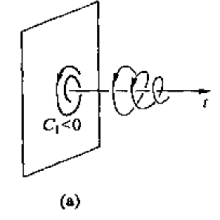
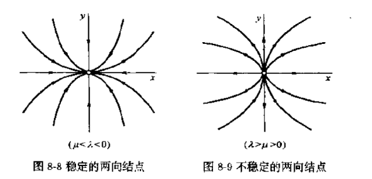
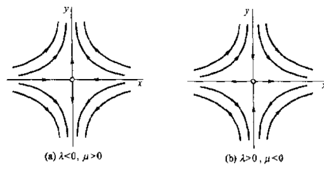
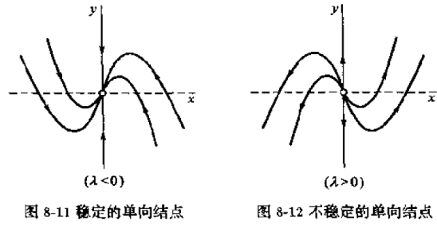
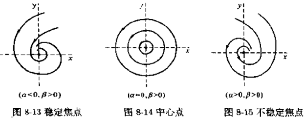
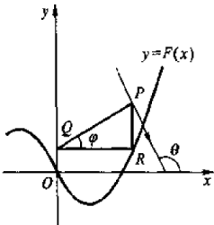
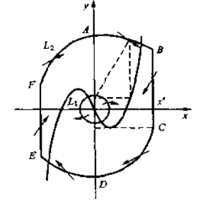

# 常微分方程8：定性理论

- x上面的点数量：对t求导数的阶数

## 动力系统

- **模型**：设运动质点 $M$ 的运动方程为 $\frac{dx}{dt} = v(x)$，其自治
  - 若 $v(x)$ 满足皮卡定理条件，则初值条件 $x(t_0) = x_0$ 下有唯一解 $x = \varphi(t,t_0,x_0)$
  - **动力性**：只要有初值条件，便能描绘出整个运动状态
  - **两重性**：
    - 给定初值后，时间便和位移一一对应，因而 $v$ 也可看作 $t$ 的函数（增广相空间）
    - 但未给定初值时，$v$ 只依赖于 $x$（相空间）
- **相空间**：$x$ 取值的空间 $\R^n$
  - **轨线**：相空间中与向量场（速度场）吻合的光滑曲线
- **增广相空间**：$(t,x)$ 取值的空间 $\R\times \R^n$
  - **积分曲线 $\varphi(t,t_0,x_0)$**：增广相空间中，初值问题的解
- **相图**：轨线族的拓扑结构
- **平衡点（奇点）**：速度场的零点 $v(a) = 0$，此时轨线退化为一个点
- **闭轨**：若解是周期函数，则轨线闭合
- **动力系统**：任何自治微分方程均可刻画一个动力系统
  - **平移不变性**：增广相空间中沿 $t$ 轴平移后还是积分曲线
  - **唯一性**：相空间上每一点上的轨线唯一
  - **接力性**：$\varphi(t_2,\varphi(t_1,x_0)) = \varphi(t_2+t_1,x_0)$

### 实例

- **单位圆系统**：$\begin{cases} v_x = -y + x(x^2+y^2-1) \\ v_y = x+y(x^2+y^2-1) \end{cases}$
- **求解**：化为极坐标方程，然后积分得 $\begin{cases} r = \cfrac{1}{\sqrt{1-C_1 e^{2t}}} \\ \theta = t+C_2 \end{cases}$
- **初值分类**：由 $C_1 = \cfrac{r_0^2-1}{r_0^2}$
  - 初值是原点，轨线就是原点，从而是唯一平衡点。
  - 初值在单位圆周上，则轨线就是单位圆周，逆时针为正
  - 初值在单位圆内，则轨线沿逆时针盘旋，最终趋于原点
  - 初值在单位圆外，则轨线沿顺时针盘旋，最终趋于单位圆周
  - 

### 等效变换

- **等效轨线**：$\displaystyle\frac{dx}{dt} = \frac{v(x)}{\sqrt{1+|v(x)|^2}}$ 的轨线和原方程轨线相同
- **解变换**：
  - 若 $\forall x_0$，解在 $t$ 轴上均存在
  - 则在每个时间点 $t$，均有变换 $\varphi_t:R^n\to R^n，x_0\mapsto \varphi(t,x_0)$
  - **方程意义**：不同初值下，同一时间点的值
  - **几何意义**：（初值点确定的曲线）在给定时间上的点（在相空间的投影）
  - **性质**
    - 单射性
      - **证明**：解的唯一性
    - $\varphi_0(x_0) \equiv x_0$ 是恒同变换
    - 再生性：$\varphi_s\circ\varphi_t = \varphi_{s+t}$（就是接力性）
      - **推论**：解变换的像集 $\Sigma$ 对复合运算形成群
    - 连续性：$\varphi(t,x_0)$ 在增广相空间上连续
      - **证明**：解对初值的连续性
- **抽象动力系统**：具有上述性质的单参数变换群（又名拓扑动力系统）
- **微分动力系统**：可微的抽象动力系统
- **非自治系统的扩充**：$\cfrac{dx}{dt} = v(t,x)$
  - 设 $y = \begin{pmatrix} x \\ s \end{pmatrix}，w(y) = \begin{pmatrix} v(s,x) \\ 1 \end{pmatrix}$（即设 $s=t$，将其作为自变量）
  - 此时系统等价于 $n+1$ 维相空间中的自治系统 $\frac{dy}{dt} = w(y)$

## 解的稳定性

- **平衡点的分类**
  - **渐进稳定平衡点**：附近的轨线最终趋于该点
    - 单位圆系统的原点平衡点 $(0,0)$
  - **稳定平衡点**：附近的轨线周期运动，但不趋于该点
    - **实例**：单摆问题的下垂平衡点 $(2k\pi,0)$
  - **不稳定平衡点**：附近的轨线若受到微小扰动，则会逐渐偏离该点
    - **实例**：单摆问题的上举平衡点 $((2k+1)\pi,0)$
- **解的分类（Lyapunov意义下）**：
  - 设：
    - 对x满足Lipschitz条件的连续函数 $f(t,x)$
    - 方程有一个解 $\varphi(t)$ 在 $t\in [t_0,+\infty)$ 上有定义
  - **$\varphi(t)$ 是稳定解**：
    - $\forall \varepsilon > 0$，$\exist \delta(\varepsilon) > 0$，$\forall |x_0-\varphi(t_0)| < \delta$，就有：
      - 以 $x(t_0) = x_0$ 为初值的解 $x(t,t_0,x_0)$ 在 $[t_0,+\infty)$ 上有定义
      - $\forall t\geqslant t_0$，有 $|x(t,t_0,x_0) - \varphi(t)| < \varepsilon$
    - **理解**：只要某解和它初值在极小邻域内，就在后面差值极小
  - **$\varphi(t)$ 是渐进稳定解**：
    - 解是稳定的
    - $\exist \delta_1<\delta(\varepsilon)，\forall |x_0-\varphi(t_0)| < \delta_1$，有 $\lim\limits_{t\to\infty}(x(t,t_0,x_0) - \varphi(t)) = 0$
    - **理解**：进一步缩小邻域。只要初值在邻域内，就最终收敛到该解
    - **推论**：
      - **渐进稳定域（吸引域）**：使解满足上述条件的区域
      - **全局渐近稳定**：吸引域是全空间
  - **$\varphi(t)$ 是不稳定解**：不满足稳定性
- **简化性**：只考虑方程的零解的稳定性 $\color{chartreuse}f(t,0)\equiv 0$

### 线性近似法

- **线性分离**： $\frac{dx}{dt} = A(t)x + N(t,x)$
  - $A(t)$ 是 $n\times n$ 矩阵函数，对 $t\geqslant t_0$ 连续
  - $N(t,x)$
    - **满足皮卡定理**
      - 在 $G: t\geqslant t_0，|x|\leqslant M$ 上连续
      - 对 $x$ 满足Lipschitz条件
    - **以0为奇点**：$N(t,0) \equiv 0$
    - **0处高阶无穷小性**：$\lim\limits_{|x|\to 0} \frac{|N(t,x)|}{|x|} = 0$
  - **性质**：该系统以0为奇点
- **齐次常数定理**：$\frac{dx}{dt} = A(t)x$ 中，若 $A(t)$ 是常矩阵，则
  - 零解是渐近稳定的 $\Leftrightarrow$ A的全部特征根都有负实部
  - 零解是稳定的 $\Leftrightarrow$ A的全部特征根实部非正，且实部为0的特征根对应的Jordan块均为一阶
  - 零解不稳定 $\Leftrightarrow$ A的特征根中至少有一个实部为正，或至少有一个实部为0且Jordan块高于一阶
  - 详细说明见后面的二维平面，将其方法推广到多维即可
- **非齐次常数定理**：$\frac{dx}{dt} = A(t)x + N(t,x)$
  - $A(t)$ 是常数矩阵，且全部特征根都具有负实部，则零解渐近稳定
  - $A(t)$ 是常数矩阵，且特征根中至少有一个有正实部，则零解不稳定
  - 由零解为奇点，且 $N$ 在0处高阶无穷小即可得上述充分性

### Lyapuonv方法

- **导出例**：单位圆系统中
  - 设 $x,y$ 方向上的 $t$ 导数分别为 $f(x,y)，g(x,y)$
    - $V(x(t),y(t))$ 是连续可微函数
    - 沿轨线 $\Gamma$ 的方向导数为 $\frac{dV}{dt} = \pfrac{V}{x}f(x,y) + \pfrac{V}{y}g(x,y)$，称为全导数
  - 若 $V = \frac{x^2+y^2}{2}$
    - **原点渐近稳定性**
      - *函数定正性*：$(x,y)\neq 0$，则 $V(x,y) > 0$
        - 几何意义：$V(x) = C$ 是等高线（环绕原点且不相交的闭曲线）
      - *导数常负性*：去心单位圆内，$\frac{dV}{dt} < 0$
        - 几何意义：轨线收缩，穿过所有等高线
- **Lyapunov函数**：用于判别的某个函数 $V(x,y)$（其连续可微）
  - **定正函数**：$V(0) = 0$，若 $x\neq 0$，则 $V(x) > 0$
  - **定负函数**：若 $x\neq 0$，则 $\cfrac{dV}{dt} = \lsum^n_{k=1} \pfrac{V}{x_k} f_k < 0$
  - **常负函数**：$\cfrac{dV}{dt} \leqslant 0$
- **Lyapunov方法**
  - 第一方法：利用微分方程的级数解
  - 第二方法：
    - **四大条件**：
      - （1）$V$ 定正
      - （2） $V'(t)$ 定负
      - （2*）$V'(t)$ 常负
      - （3）$V'(t)$ 定正
    - **判别法**：
      - 若1，2成立，则零解渐近稳定
      - 若1，2*成立，则零解稳定
      - 若1，3成立，则零解不稳定
    - **几何理解**：$V$ 其实就是周线函数，函数值代表离原点的距离

## 二维平面动力系统

### 常点

- **拓扑变换性**：常点附近的轨线同胚于一个平行直线族

### 齐次系统

- $\cfrac{d}{dt}\tvek{x}{y} = \bf A\tvek{x}{y}$
  - $\bf A$ 是常数矩阵
  - 原点是奇点
- **初等奇点**：若A非退化，则原点是初等奇点
  - **孤立性**：所有系统的初等奇点均孤立（详见高阶定性理论）
- **高阶奇点**：若A退化，则原点是高阶奇点
  - **线性非孤立性**：线性系统的高阶奇点均非孤立
  - **非线性不定性**：非线性系统的高阶奇点可能孤立，此时是多个初等奇点的复合
- **轨线结构**：将 $A$ 化为Jordan标准型 $J$
  - **本质**：用J判断曲线走向，用通解判断曲线形状
  - $J = \tvek{\lambda & 0}{0 & \mu}$，则通解为 $y = C|x|^{\large\frac{\mu}{\lambda}}$，特解为 $x=0$（奇点）
    - 若 $\lambda = \mu$，则为正比例直线的一半
      - $\lambda < 0$：射向原点，渐近稳定
      - $\lambda > 0$：射向无穷远，不稳定
    - 若 $\lambda \neq \mu$
      - 两者同号，则为抛物线
        - $|\frac{\mu}{\lambda}| > 1$，下凸，与x轴相切
        - $|\frac{\mu}{\lambda}| < 1$，上凸，与y轴相切
        - 均取负值则射向原点（渐近稳定），均取正值则射向无穷远（不稳定）
        - **两向结点**：
      - 两者异号，则为双曲线
        - 任意情况均不稳定
        - **鞍点**：
  - $J = \tvek{\lambda & 0}{1 & \lambda}$，则通解为 $y = Cx + \frac{x}{\lambda} ln|x|$，特解为 $x=0$（奇点）
    - $\lambda > 0$，不稳定
    - $\lambda < 0$，不稳定
    - **单向结点**：在原点均与y轴相切
  - $J = \tvek{\alpha & -\beta}{\beta & \alpha}$，则通解为 $r = Ce^{\large \frac{\alpha}{\beta}\theta}\quad (C\geqslant 0)$
    - $\beta$ 决定方向
      - $\beta>0$，顺时针方向
      - $\beta<0$，逆时针方向
    - $\alpha$ 决定形状
      - $\alpha<0$，螺线族，趋于原点。渐近稳定（**稳定焦点**）
      - $\alpha>0$，螺线族，负向渐近稳定（**不稳定焦点**）
      - $\alpha = 0$，同心圆，稳定（**中心点**）
      - 
- **初等奇点判定定理**：
  - 设 $\begin{cases} p = -tr(A) = -(a+d) \\ q = det(A) = ad-be \end{cases}$
  - **原点类型**：
    - $q<0$，鞍点
    - $q>0，p^2-4q > 0$，两向结点
    - $q>0，p^2-4q = 0$，单向结点
    - $q>0，p\neq 0，p^2-4q < 0$，焦点
    - $q>0，p=0$，中心点
  - **原点稳定性**：$p>0$ 则稳定，$p<0$ 则不稳定
- **二阶齐次线性系统的作图技巧**
  1. 首先判断奇点类型、稳定性 
  2. 查看有无**特殊方向**（沿直线趋于原点的方向）
  3. 由于向量场关于原点对称，只需知道一半的相图即可

### 非线性系统

- $\begin{cases} \frac{dx}{dt} = ax + by + \varphi(x,y) \\ \frac{dy}{dt} = cx + dy + \psi(x,y) \end{cases}$
- **系统线性化**：只保留线性项
- **系统的定性结构**：奇点类型、奇点稳定性
- **定性相同条件**：设 $r = \sqrt{x^2+y^2}$
  - 条件A：$\begin{cases} \varphi(x,y) = \omicron(r) \\ \psi(x,y) = \omicron(r) \end{cases}\quad (r\to\infty)$
  - 条件A*：$\forall \varepsilon > 0，\begin{cases} \varphi(x,y) = \omicron(r^{1+\varepsilon}) \\ \psi(x,y) = \omicron(r^{1+\varepsilon}) \end{cases}\quad (r\to 0)$
  - 条件B：$\exist \delta>0，\varphi,\psi$ 在 $O(\bf 0,\delta)$ 内连续可微
- **定性相同分类**：非线性系统与其线性化系统在原点附近的定性结构相同的情况
  - 原点是焦点：条件A成立
  - 原点是鞍点或两向结点：条件A、B成立
  - 原点是单向结点，条件A*成立
  - 原点是星形结点，条件A*、B成立
- **$\varepsilon-$ 邻近系统**：设 $\chi$ 为平面上偏微分函数连续可微的动力系统全集
  - 若
    - 两个系统 $\Phi,\Psi$ 分别以 $P,Q$ 和 $X,Y$ 为偏微分函数
    - 满足 $|X-P| + |\pfrac{X}{x} - \pfrac{P}{x}| + |\pfrac{X}{y} - \pfrac{P}{y}| + |Y-Q| + |\pfrac{Y}{x} - \pfrac{Q}{x}| + |\pfrac{Y}{y} - \pfrac{Q}{y}| < \varepsilon$（函数和偏导数均相近）
  - 则它们互为 $\varepsilon-$ 邻近系统
- **轨道拓扑等价**：轨线同胚，且在同胚映射下保持定向
- **结构稳定系统**：$\exist \varepsilon>0$，使得该系统与其任意 $\varepsilon-$ 邻近系统轨道拓扑等价
- **平面双曲定理**：
  - 若线性部分矩阵 $A$ 的特征值实部均不为0（此时的原点称为双曲奇点）
  - 则
    - 系统在原点附近局部结构稳定
    - 系统轨道拓扑等价于其线性化系统
  - **Hartman-Grobman定理**：双曲定理推广到欧氏空间中
  - **推论（非双曲平面奇点）**：
    - A有零特征根，则奇点是高阶奇点
      - 变换法，将其分解为几个初等奇点
    - A有共轭纯虚根，则线性化后奇点是中心点。
      - 判定中心点与焦点
        - **细焦点**：中心点加上高阶项后形成的焦点（结构不稳定）
  - **推论（）**：若稳定性相同，则初等结点、焦点均轨道拓扑等价
    - **渊（汇）**：稳定的结点和焦点
    - **源**：不稳定的结点和焦点

### 极限环

- **极限环（孤立闭轨）**：某个环形邻域内无其它闭轨的闭轨
  - **极限性**：$\Gamma$ 的某个邻域内的闭轨均盘旋趋于它
- **轨道稳定性**：
  - **稳定极限环**：两侧均在正或负极限趋于 $\Gamma$
  - **半稳定极限环**：一侧在负极限处趋于 $\Gamma$，另一侧在正极限处趋于 $\Gamma$
- **庞加莱-本迪克松环域定理**：
  - 设 $D$ 是简单闭曲线 $L_1,L_2$ （内外境界线） 围成的环域
    - $\overline{D}$ 上无奇点
    - 从边界上出发的轨线均不离开或进入 $\overline{D}$
    - 边界均不是闭轨线
  - 则 $D$ 内至少存在一条闭轨线 $\Gamma$ 不能收缩为一点
  - **物理意义**：从边界流入D的流体，在D内存在环流

#### 实例

- **李纳方程**：$\dis\frac{d^2x}{dt^2} + f(x)\frac{dx}{dt} + g(x) = 0$
  - **等效变换系统**：令 $y = -\int g(x)dt$，则原式化为 $\begin{cases} \frac{dx}{dt} = y-F(x) \\ \frac{dy}{dt} = -g(x) \end{cases}$

### Lienard作图法

- 
1. 任选向量场中一点 $P$
2. 从P点引出y轴平行线PR（R为与轨线的交点）
3. 从R点引出x轴平行线RQ（Q为与y轴的交点）
4. 与PQ垂直的方向就是向量场在P点的方向
- **证明**：$\tan PQ = \frac{y-F(x)}{x}$，从而 $\tan PQ_\perp = \frac{-x}{y-F(x)}$
  - 由定义即得结论
- **范德波尔方程**：$\dis\frac{d^2x}{dt^2} + \mu(x^2-1)\frac{dx}{dt} + x = 0$
  - **物理意义**：三极管电路的数学模型
  - **闭轨存在性**：其至少有一个闭轨
    - **证明**：设 $\mu = 1$
      - 其为Linard方程，有等价系统：$\begin{cases} \frac{dx}{dt} = y-(\frac{x^3}{3}-x) \\ \frac{dy}{dt} = -x \end{cases}$
      - 设Lyapunov函数为 $V = \frac{x^2+y^2}{2}$
        - 易得 $|x|<\sqrt{3}$ 时，$\frac{dV}{dt} = x^2(1-\frac{x^2}{3})$，函数定正，导数定正，原点不稳定
        - 从而可以取一个小圆周 $C$ 作为内境界线
      - 用Linard作图法构造外境界线：
        - 导数的右项 $F(x) = \frac{x^3}{3}-x$ 的极小值点为 $(-1,-\frac{2}{3})$
        - 取 $x^*$ 足够大，以 $S(0,-\frac{2}{3})$ 为中心，以 $x^*+\frac{4}{3}$ 和 $x^*$ 为半径作圆弧 $\arc{AB}$ 和 $\arc{CD}$
          - 与y轴交点为A和D，与 $x=x^*$ 交点为B和C
        - 再取对称图形。连接即得外境界线
      - 当 $x^*$ 足够大，满足 $y_A < F(x^*)$，则B在 $F(x)$ 下方，从而 $BC$ 上 $\frac{dx}{dt} = y-F(x) < 0$，指向外境界线内部
      - 
      - 再由Linard作图法，在弧上也指向内部
      - 从而构成了庞加莱-本迪克松环域，且奇点在环域外
      - 由P-B环域定理，环域内至少有一个闭轨

### 后继函数法

- 平面系统的闭轨 $\Gamma$，其上任取一点 $P$ 作闭轨的法线 $MPN$（M在内部，N在外部）
  - **无切线段**：法线在 $P$ 两侧邻近的线段
    - 无切线段上 $P_0\to P$ 时，由解对初值的连续依赖性，$P_0$ 的轨线也与 $MPN$ 相交
  - **后继点**：$P_0$ 轨线与 $MN$ 的首个正向交点。设为 $P_1$
  - **庞加莱映射**：$MN$ 上 $f: P_0\to P_1$
    - 不动点即为系统所有的闭轨
  - **轨线坐标法**：单维坐标 $n$
    - **坐标原点**：$P$ 满足 $n = 0$
    - **正方向**：$\Gamma$ 的外法线方向
    - **后继函数**：$P_0$ 坐标为 $n_0$，$P_1$ 坐标为 $n_1 = g(n_0)$
    - **稳定性**：
      - 设 $h(n_0) = g(n_0)-n_0$
      - 外侧稳定性：$0<n_0\ll 1 $ 时
        - $h(n_0)<0$，稳定
        - $h(n_0)>0$，不稳定
      - 内侧稳定性：$-1\ll n_0< 0 $ 时
        - $h(n_0)>0$，稳定
        - $h(n_0)<0$，不稳定
    - **极限性**：
      - 若 $0$ 是 $h$ 的 $k$ 阶零点（k重根），则 $h(n_0) = \frac{h^{(k)}(0)}{k!}(n_0)^k + O(|n_0|^{k+1})$
      - **单重极限环**：0是 $h$ 的单重根
      - **k重极限环**：0是 $h$ 的k重根
- **稳定定理**：系统的单重极限环均结构稳定
  - **推论**：$\exist \varepsilon>0，\Gamma$ 的环形邻域 $\mathcal{U}$，使得任意 $\varepsilon$-邻近系统在 $\mathcal{U}$ 内有唯一闭轨，且和 $\Gamma$ 具有相同稳定性

## 分支现象

### 全局结构稳定性

- $\chi(\Sigma)$：定义在平面圆盘 $\Sigma$ 上的二阶连续可微系统，向量场与边界不相切
- **结构稳定定理**：系统结构稳定的充要条件：
  - 只有有限个奇点，且均为双曲奇点
  - 只有有限个闭轨，且均为单重极限环
  - 没有从鞍点到鞍点的轨线
- 