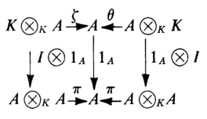

# 模张量关系

## 张量积

### 平衡映射

- **平衡映射（中线性映射）**：$f:A\times B\to C$，满足
  - **双分配性**：$\forall a,a_1,a_2\in A，b,b_1,b_2\in B$（分配律不涉及 $r$）
    - $f(a_1 + a_2,b) = f(a_1,b) + f(a_2,b)$
    - $f(a,b_1 + b_2) = f(a,b_1) + f(a,b_2)$
  - **交换对称性**：$f(ar,b) = f(a,rb)$
- **张量积 $A\otimes_R B$**：
  - 设 $A$ 是右R模，$B$ 是左R模，$F$ 是集合 $A\times B$ 上的自由阿贝尔群
  - 设 $K$ 是 $F$ 中（对直积运算满足双分配性和交换对称性的元素）生成的子群（**平衡子群**）
  - 则 $F/K$ 即为张量积
  - **本质**：不满足模上直积双分配性、直积交换性的元素全体（类似换位子群）
  - **实例**：
    - 向量空间 $V$ 中，设 $g,h\in V^*$，则 $f(\a,\b) = g(\a)h(\b)$ 就是张量积
    - 欧氏空间中，向量的内积是张量积
- **元素的陪集**：对 $\forall a\in A,b\in B$，陪集运算为 $a\otimes b = (a,b)+K$
  - **平衡性**：陪集运算是平衡映射
    - **证明**：易得其双分配性、对称性
  - **规范平衡映射**：$i:A\times B\to A\otimes_R B，(a,b)\mapsto a\otimes b$ 是R模同态
    - **证明**：易得 $a\otimes b = 0\otimes b = 0$，线性组合公式由平衡性易得
  - **生成元系性**：张量积由其所有元素的陪集生成
    - **证明**：易得生成元系具有商群传递性
  - **真子群性**：存在 $(a,b) \neq a\otimes b$
    - **证明**：
  - **非唯一性**：存在 $a\otimes b = a'\otimes b'$，但 $a\neq a'，b\neq b'$
    - **证明**：
- **标准形式**：$\sum\limits^r_{i=1} n_i(a_i,b_i)$
- **（定理5.2）张量表出性（泛性）**：设 $A,B$ 是环 $R$ 的右模和左模，$C$ 是阿贝尔群
  - 若 $g:A\times B\to C$ 是平衡映射
  - 则存在唯一群同态 $\ol g:A\otimes_R B\to C$ 满足 $\ol gi = g$
  - **证明（存在性）**：设 $F$ 是 $A\times B$ 上的自由阿贝尔群，$K$ 是平衡子群
    - 由 $F$ 自由性，对于 $g$ 有唯一的 $g_1:F\to C$
    - 由于 $K\subset \ker g_1$，故可诱导 $\ol g:F/K\to C，\Big[ (a,b)+K \Big]\mapsto g_1\Big[(a,b)\Big] = g(a,b)$
      - 再由张量积定义即得结论
    - **证明（唯一性）**：反设还存在 $hi = g$，则计算易得等价
  - **理解**：任何一个平衡映射都可表为张量积
  - **本质**：$i$ 是平衡映射范畴 $\mf M(A,B)$ 的泛对象
  - **推论**：张量积可被同构唯一决定
- **（推论5.3）映射张量**：
  - 设
    - $A,A'\in \M_R，B,B'\in _R\M$
    - $f:A\to A'$ 和 $g:B\to B'$ 是R模同态
  - 则存在唯一群同态 $A\otimes_R B\to A'\otimes_R B'，a\otimes b\mapsto f(a)\otimes g(b)$
  - **证明**：
    - 定义易得 $h:A\times B\to A'\otimes_R B'，(a,b) \mapsto f(a)\otimes g(b)$ 是平衡映射
    - 由张量表出性，存在唯一的 $\ol h$，其即为所需群同态
- **（命题5.4）张量正合列**：
  - 若 $A\xto f B\xto g C\to 0$ 是左R模正合列，$D$ 是右R模
  - 则 $D\otimes_R A\xto{1_D\otimes f} D\otimes_R B\xto{1_D\otimes g} D\times_R C\to 0$ 是阿贝尔群正合列
  - 同理适用于第一个变量
  - **证明**：
- **（定理5.5）张量同态定理**：设 $R,S$ 是环，$_S A_R，_RB，C_R，_RD_S$ 是模
  - 则
    - $A\otimes_R B$ 是左S模，且满足 $s(a\otimes b) = sa\otimes b$
    - 若 $f:A\to A'$ 是S-R双模同态，$g:B\to B'$ 是R模同态
      - 则 $f\otimes g:A\otimes_R B\to A'\otimes B'$ 是左S模同态
  - 且
    - $C\otimes_R D$ 是右S模同态，且满足 $(c\otimes d)s = c\otimes ds$
    - 若 $h:C\to C'$ 是R模同态，$k:D\to D'$ 是R-S双模同态
      - 则 $h\otimes k:C\otimes_R D'$ 是右S模同态
  - **证明**：

### 双线性映射

- **双线性映射**：若 $R$ 是交换环，$A,B,C$ 是其上的模，则满足双线性、对称性的映射 $f:A\times B\to C$ 就是双线性映射
  - **区别**：比平衡映射多了交换性和数乘性
  - **实例**：
    - 设 $R$ 交换，$A$ 是R模，则像映射 $A\times A^*\to R，(a,f)\mapsto \lang a,f \rang$ 是双线性的
- **规范双线性映射**：$i:A\times B\to A\otimes_R B，(a,b)\mapsto a\otimes b$
- **（定理5.6）张量表示性**：
- **（定理5.7）幺模自反性**：若 $R$ 是含幺环，$A\in\M_R，B\in _R\M$ 是幺模，则存在R模同构 $A\otimes_R R \cong A，R\otimes_R B\cong B$
  - **证明（仅B）**：
    - 已知 $R$ 是R-R双模，$R\otimes_R B$ 是左R模，$R\times B\to B，(r,b)\mapsto rb$ 是平衡映射
    - 存在群同态 $\a:R\otimes_R B\to B，r\otimes b\mapsto rb$，同时也是左R模同态
    - $\b:B\to R\otimes_R B，b\mapsto 1_R\otimes b$ 是R模同态，$\a\b = 1_B，\b\a = 1_{R\otimes_R B}$，从而得到同构关系
- **（定理5.8）双模结合律**：若 $R,S$ 是环，$A\in \M_R, B\in _S\M_R, C\in _S\M$，则存在同构 $(A\otimes_R B)\otimes_S C \cong A\otimes_R (B\otimes_S C)$
  - **证明**：
- **（定理5.9）直积传递性**：若 $R$ 是环，$A,A_i$ 是右R模，$B,B_j$ 是左R模，则有群同构
  - $(\sum\limits_{i\in I}A_i)\otimes_R B \cong \sum\limits_{i\in I} (A_i\otimes_R B)$
  - $A\otimes_R (\sum\limits_{j\in J} B_j) \cong \sum\limits_{j\in J} (A\otimes_R B_j)$
  - **证明**：
- **（定理5.10）伴随结合律**：设 $R,S$ 是环，$A_R，_RB_S，C_S$ 是模
  - 则存在阿贝尔群同构 $\a: \text{Hom}_S(A\otimes_R B,C) \cong \text{Hom}_R(A,\text{Hom}_S (B,C))$
  - $f:A\otimes_R B\to C$，其中 $[(\a f)(a)](b) = f(a\otimes b)$
- **（定理5.11）唯一表出性**：设 $R$ 是含幺环，若 $A$ 是右R幺模，$F$ 是自由左R模，基为 $Y$
  - 则 $\forall u\in A\otimes_R F$ 可被唯一表示为 $\sum\limits^n_{i=1} a_i\otimes y_i$
  - **证明**：
- **（推论5.12）自由传递性**：设 $R$ 是含幺环，$A_R,\ _RB$ 是自由R模，基为 $X,Y$
  - 则 $A\otimes_R B$ 是自由右R模，基为 $W = \{x\otimes y\}$，基数为 $|X||Y|$
  - **证明**：
- **（推论5.13）子环自由张量**：设 $S$ 是含幺环，$R$ 是其含幺子环
  - 若 $F$ 是自由R左模，基为 $X$
  - 则 $S \otimes_R F$ 是自由左S模，基为 $\{1_S\otimes x\mid x\in X\}$，基数为 $X$
  - **证明**：

## PID上的模（可应用阿贝尔群结构性质的模）

- **（定理6.1）自由遗传性**：设 $R$ 是PID，$F$ 是自由R模，则任意子模 $G$ 也自由，且 $\rank G\leq \rank F$
  - **证明**：
- **（推论6.2）有限生成遗传性**：设 $R$ 是PID，若 $A$ 是 $n$ 个元素生成的R模，则其任意子模可被某个 $m\leq n$ 个元素生成
  - **证明**：
- **（推论6.3）投射自由性**：设 $A$ 是PID上的幺模，则 $A$ 是自由模 $\LR A$ 是投射模
  - **证明**：
- **（定理6.4）挠子模性质**：设 $R$ 是整环，$A$ 是左R模
  - **阶理想**：
  - **挠子模**
  - **挠模**
  - 无挠模
- **（定理6.5）**：设 $R$ 是PID，$A$ 是有限生成的无挠模，则其自由
  - **证明**：
- **（定理6.6）有限生成模的挠分解**：设 $R$ 是PID，$A$ 是有限生成模，则 $A = A_t\oplus F$，其中 $F$ 是有限秩自由R模
  - **证明**：
- **（定理6.7）素幂子模**：设 $R$ 是PID，$A$ 是挠模
- **（引理6.8）**：设 $R$ 是PID，模 $A$ 满足 $\exists n\in\N^+，p\in\P_R$ 使得 $p^nA = 0，p^{n-1}A \neq 0$，$a\in A$ 的阶为 $p^n$，则
  - 若 $A\neq Ra$，则存在非零元 $b\in A$ 使得 $Ra\cap Rb = 0$
  - 存在 $A$ 的子模 $C$ 使得 $A = Ra\oplus C$
  - **证明**：
- **（定理6.9）第一西罗定理**：设 $R$ 是PID，$A$ 是有限生成 $p$ 模，则 $A$ 是 $p^{n_i}$ 阶循环群的直和（$n_1\geq n_2\geq \cdots \geq n_k\geq 1$）
  - **证明**：
- **（引理6.10）**：设 $R$ 是PID，$A,B,A_i$ 是模，$r\in R，p\in\P_R$
- **（引理6.11）初等分解引理**：设 $R$ 是PID，$r = \prod\limits^n_{i=1} p_i^{n_i}$
  - 则存在R模同构 $R/(r)\cong R/(p_1^{n_1})\oplus \cdots \oplus R/(p_k^{n_k})$
  - **证明**：
- **（定理6.12）分解定理**：设 $R$ 是PID，$A$ 是有限生成模，则
  - **不变分解**：$A$ 是（有限秩自由子模）和（有限循环挠模）的直和
    - **唯一性**：$F$ 的秩和主理想 $(r_i)$ 由 $A$ 唯一决定
    - **不变性**：挠模的阶满足 $r_1\mid \cdots \mid r_t$
  - **初等分解**：$A$ 是（有限秩自由子模）和（有限循环挠模）的直和
    - **唯一性**：$F$ 的秩和主理想 $p_i^{s_i}$ 由 $A$ 唯一决定
    - **不变性**：挠模的阶满足 $p_1^{s_1},...,p_i^{s_i}$
- **（推论6.13）同构条件**：PID的两个有限生成模 $A,B$ 同构 $\LR A,B$ 的不变【初等】因子相同，且 $A/A_t，B/B_t$ 秩相同
  - **证明**：

## 代数

- **K(作用)代数（交换K模）**：设 $K$ 是含幺交换环，则 满足下列条件的交换环 $A$ 是 $K$ 代数
  - **模性**：$(A,+)$ 是幺左K模
  - **数乘交换律**：$\forall a,b\in A，k\in K$，都有 $k(ab) = (ka)b = a(kb)$
- **可除K代数（可逆交换K模）**：$A$ 同时还是除环
- **有限维代数（等价于有限维向量空间）**：（$K$ 是域）$A$ 是维度有限的向量空间
- **实例**：
  - **$\Z$ 代数**：环都是Z模，易得也是Z代数
  - **多项式代数**：若 $K$ 是含幺环，则多项式环和形式幂级数环都是K代数
  - **线性变换代数**：若 $V$ 是域 $F$ 上向量空间，则自同态环 $\Hom_F(V,V)$ 是F代数
  - **环中心代数**：设 $A$ 是含幺环，$K$ 是其中心的含幺子环，则 $A$ 是K代数
    - 含幺交换环是自身代数
  - $\C$ 和实四元除法环都是 $\R$ 上的可除代数
  - **群代数**：$G$ 是乘法群，$K$ 是含幺交换环，则群环 $K(G)$ 是K代数，模结构为 $K(\sum r_ig_i) = \sum(kr_i)g_i$
  - **矩阵代数**：若 $K$ 是含幺交换环，则其上所有 $n$ 阶方阵是K代数
  - **交换性**：交换环上的左右K模是同一个
- **（定理7.2）**：设 $K$ 是含幺交换环，$A$ 是左K幺模，则
  - **积映射**：$A$ 是K代数 $\LR $ 存在K模同态 $\pi:A\otimes_K A\to A$ 满足下面交换图
  
  - **单位映射**：$A$ 含幺 $\LR $ 存在K模同态 $I:K\to A$ 满足下面交换图（$\zeta,\t$ 是同构）
  
  - **证明**：

### 

- **子代数**：子环，同时也是K子模
- **代数理想**：环的理想，同时也是K子模
- **K代数同态**：环同态，同时也是K模同态
- **（定理7.4）K代数的张量积**：设 $A,B$ 是含幺交换环 $K$ 上的代数
  - 设 $\pi$ 是映射 $(A\otimes_K B)\otimes_K (A\otimes_K B) \xto{1_A\otimes \a \otimes 1_B} (A\otimes_K A)\otimes_K (B\otimes_K B) \\ \xto{\pi_A\otimes \pi_B} A\otimes_K B$
    - 其中 $\pi_A,\pi_B$ 是积映射
  - 则 $A\otimes_K B$ 在积映射 $\pi$ 下是K代数
- **证明**：