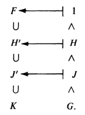

# 伽罗瓦理论

## 基本伽罗瓦理论

- **F在K上的伽罗瓦群**：$F$ 的K自同态群 $\aut_K F$
  - **无交换性**：数乘自同构和加法自同构之间不可交换
  - **遗传性**：伽罗瓦群的子群也是伽罗瓦群，在后面[固定域]()的部分会得到证明
- **（定理2.2）K同构保根性**：设 $F\geq K，f\in K[x]$
  - 若 $u\in F$ 是 $f$ 的根，$\sigma\in\aut_K F$，则 $\sigma(u)\in F$ 也是 $f$ 的根
  - **证明**：和根的同构传递性类似，$0 =\sigma(f(u)) = \sum k_i\sigma(u)^i = f(\sigma(u))$
  - **推论**：
    - 伽罗瓦群的元素 $\sigma$ 完全由其在基上的作用决定
    - 设 $m$ 是 $f$ 在 $K(u)$ 上的根数，则 $|\aut_K K(u)|\leq m$
      - 因为
  - **实例**：
    - **平凡伽罗瓦群**：$F = K$ 时，$\aut_K F = 1$
      - $\aut_\Q\  \Q(\sqrt[3]{2}) = 1$
      - $\aut_\Q\R = 1$
    - $\aut_\R \C \cong \Z_2\cong \aut_\Q \ \Q(\sqrt{3})$（恒等映射）（原基不变、新基取反的映射）
    - $F = \Q(\sqrt{2},\sqrt{3})$
      - $\set{1,\sqrt{2},\sqrt{3},\sqrt{6}}$ 是 $F$ 在 $\Q$ 上的基
      - $\aut_\Q F \cong \Z_2\oplus\Z_3$
- **K自同构的可动点**：对于 $a\in F$，若存在K自同构 $\sigma$ 满足 $\sigma(a) \neq a$，则 $a$ 称为K自同构的可动点
- **E的非稳定K自同构**：设域 $K\leq E\leq F$，对于 $\sigma\in \aut_K F$，若存在点 $a\in E$ 满足 $\sigma(a) \neq a$，则 $\sigma$ 称为E的非稳定K自同构
- **（定理2.3）对应定理**：设域 $K\leq E\leq F$，群 $H\leq \aut_K F$，则
  - **固定域**：$H' = \set{v\in F\mid \forall \sigma\in H，\sigma(v) = v}$ 是中间域
    - **对应性**：$H = \aut_{H'} F\leq \aut_K F$
    - （群 $H$ 中K自同构）（共同的不动点集），其外均为K自同构的可动点
    - **证明**：域同构可定义加减乘除为像的加减乘除，易得封闭
      - 由于 $H$ 是K自同构，故 $K$ 均为 $H$ 不动点，$K\leq H'$
      - 再由 $H'$ 定义在 $F$ 中，即得是中间域
  - **稳定子群**：$E' = \set{\sigma \in \aut_K F\mid \forall u\in E，\sigma(u) = u}$
    - **对应性**：$E' = \aut_E F\leq \aut_K F$
    - （域 $E$ 上K自同构作用）的（稳定子群），其外均为E上的非稳定K自同构
    - **证明**：易得是群，再由元素分析法得是子群
  - **本质**：每个中间域 $E$ 都对应一个伽罗瓦子群 $\aut_E F$，伽罗瓦群的每个子群 $H = \aut_{H'}F$ 都对应一个中间域 $E$，从而是伽罗瓦群
- **伽罗瓦扩张**：设域 $F\geq K$，若 $(\aut_K F)' = K$，则 $F$ 称为伽罗瓦扩张
  - **等价命题**：$\forall u\in F-K，\exists \sigma\in \aut_K F$ 满足 $\sigma(u)\neq u$
  - $F$ 上（所有K自同构的最大共同不动点集）是 $K$
  - $F-K$ 均为K自同构的可动点
  - **实例**：
    - **固定域进化性**：任意域扩张都是固定域的伽罗瓦扩张
      - **证明**：定义易得
    - **固定域不变性**：设 $\aut_K F$ 的固定域为 $K_0$，则 $\aut_K F = \aut_{K_0}F$
      - **证明**：
        - 由 $K_0\geq K$，保持 $K_0$ 不变的自同构一定也保持 $K$ 不变，故 $\aut_{K_0} F\subset \aut_K F$
        - 由固定域定义，$K_0$ 是所有 $K$ 同构的不动点，故 $\\ \aut_K F \subset \aut_{K_0} F$
    - **无穷超越扩张伽罗瓦性**：设 $K$ 是无限域，则 $K(x)$ 是 $K$ 的伽罗瓦扩张
      - **证明**：
        - 首先，$K(x)\geq K$，故 $\aut_{K(x)} F\leq \aut_K F$
        - 若 $K$ 是不动点，则有理分式 $K(x)$ 当然也是不动点。故 $\aut_K F\leq \aut_{K(x)} F$
    - $\C = \R(i)$ 是 $\R$ 的伽罗瓦扩张
      - **证明**：反设 $\C-\R$ 上有不动点 $a+bi$
        - 则对 $\forall \sigma\in \aut_\R \C$，有 $\sigma(a+bi) = a + b\sigma(i) = a+bi$，即 $\sigma(i) = i$，只能是恒等映射
    - $\Q(\sqrt{d})$（$d\in \Q$ 非负）是 $\Q$ 的伽罗瓦扩张
      - **证明**：反设有不动点 $a + b\sqrt{d}$，同上即可得结论
- **相对维数**：中间域 $L\leq M$ 中，$[M:L]$ 称为它们的相对维数
- **相对指数**：伽罗瓦群 $H\leq J$ 中，$[H:J]$ 称为它们的相对指数
- **理解**：
  - $[M:L]$ 的意义是规定了基所考虑的范围。$M$ 规定了上界，$L$ 规定了下界
    - 因为所有 $L$ 以内元素都可以被幺元 $1$ 表出，故都等价于 $1$
    - 而 $M$ 外的元素不予考虑
    - 所以最终需要考虑的只有 $M-L$ 的基
  - $[L':M']$ 的意义是规定了同构所考虑的范围。$L'$ 规定了上界，$M'$ 规定了下界。
    - 因为任意同构复合一个 $M'$ 中元素后，都可以在保持 $M$ 内元素不变的情况下，变成另一个任意同构。也就是说，若两个同构在 $M$ 上作用相同，则它们在 $M'$ 陪集下等价。故考虑 $[L':M']$ 的元素时，只需要考虑其在 $M$ 内元素上的作用即可
    - 而 $L'$ 则规定我们考虑的任意同构都必须在 $L$ 上是恒等映射
    - 所以最终需要考虑的只有同构在 $M-L$ 上的作用
  - 以后将伽罗瓦群 $\aut_L M$ 中的下标 $L$ 称为**下界**，$M$ 称为**上界**

### 伽罗瓦理论的证明

- **倒向对应链**：设 $G = \aut_K F$，则易得对应关系如下图
   $\whhh$ 
  - 此时称 $[M:L]$ 和 $[L':M']$ 为倒向对应关系，上面图片中的两个扩张链和其倒向对应关系称为倒向对应链
- **（定理2.5）基本伽罗瓦理论**：设 $F$ 是 $K$ 的有限维伽罗瓦扩张，则存在中间域族和伽罗瓦子群族的双射，满足
  - **指数对应性**：任两个中间域的相对维数和对应两个子群的相对指数对应相等（倒向对应链均取等）
    - **证明**：由闭对应性定理，存在闭域和闭子群的双射。再由维度倒向收敛条件，有限维伽罗瓦扩张的所有中间域和子群都是闭的，故总存在双射，且相对指数/维数相等
  - **全闭性**：$F$ 是所有中间域的伽罗瓦扩张（所有中间域都是闭的）
  - **伽罗瓦正规性**：中间域 $E$ 是 $K$ 的伽罗瓦扩张 $\LR E' = \aut_E F\lhd G = \aut_K F$
    - **证明**：
      - **必要性**：由于中间域都是有限维的，故均是代数扩张。若再是伽罗瓦扩张，则是稳定中间域，从而是正规子群
      - **充分性**：若 $E'\lhd \aut_K F$，由稳定正规性得 $E''$ 是稳定中间域。再由 $E$ 是闭域，得 $E = E''$，从而由稳定中间域的伽罗瓦传递性，即得 $E$ 也是伽罗瓦扩张。
    - **推论**：$G/E'$ 同构于 $\aut_K E$
  - **本质**：（有限维伽罗瓦扩张）的（倒向对应链）具有三个良好的对应性质

#### 相对维度关系

- **（引理2.6）倒向关系引理**：设域 $K\leq L,M \leq F$，群 $H,J\leq G = \aut_K F$，则
  - 稳定子群 $F' = 1，K' = G \whh$ 固定域 $G' = K，1' = F$
    - **证明**：定义易得
  - 域 $L\leq M\red\Rt M'\leq L'\whh$ 群 $H\leq J \red\Rt J'\leq H'$
    - **证明**：定义易得
  - $L\leq L''，H\leq H''$。若 $F$ 是伽罗瓦扩张，则取等
    - **证明**：定义易得
  - $L' = L'''，H' = H'''$ 
    - **证明**：用上面几个结论，互包证明即可  
- **闭域【闭伽罗瓦群】**：
  - **闭包定义法**：对于扩张 $K\leq F$，设 $X$ 是中间域【伽罗瓦子群】，若 $X = X''$，则 $X$ 是闭的
    - 可以说 $X''$ 就是 $X$ 的闭包。易得 $X''$ 是 $\aut_X F$ 的所有共同不动点生成的域。也就是说，闭域 $X$ 是包含X同构的所有不动点的域
    - 闭域依赖于扩张关系 $K\leq F$，改变 $K$ 或 $F$ 时，闭域判定也会变
  - **伽罗瓦定义法**：$F$ 是 $K$ 的伽罗瓦扩张 $\LR K$ 是闭的
    - **证明**：由倒向关系引理（3）直得结论
    - 倒向对应链的两端 $K,F$ 一定是闭的
- **（定理2.7）闭对应性**：闭中间域族和闭伽罗瓦子群族之间存在**固定双射** $E\mapsto E'$
  - **证明**：由闭域性，$(E')' = E'' = E$，故是双射
  - **笨方法证明**：设 $E$ 是闭中间域，则由闭域等价性得 $F$ 是 $E$ 的伽罗瓦扩张，从而 $F-E$ 的元素均对于E自同构可动
    - **单射性**：反设不是单射，即存在两个闭域 $E_1>E_2$，但 $E_1' = E_2'$
      - 此时使 $E_2$ 不动的自同构也必定使 $E_1$ 不动（我知道这并不是定义的等价叙述，但只要选取其中有用的部分就行了）
      - 则 $\forall a\in E_1-E_2$
        - 由 $E_1$ 是闭的，得 $a$ 在 $E_1$ 自同构下均不动
        - 由 $E_2$ 是闭的，得 $a$ 在 $E_2$ 自同构下可动，矛盾
    - **满射性**：由伽罗瓦稳定子群的定义即可
    - 好吧，我实际上把倒向关系引理又证了一遍
- **（引理2.8）域的维度倒向单不增性**：设域 $K\leq L\leq M\leq F$。若 $[M:L]$ 有限，则 $[L':M'] \leq [M:L]$
  - **归纳证明**：$[M:L] = 1$ 时，$M=L$，结论显然成立。下面设 $[M:L]<n$ 时结论均成立
    - 取 $u\in M-L$，由维度代数关系，$M\geq L$ 是代数扩张，故 $u$ 为代数元素，设其最小多项式 $f\in L[x]$ 的次数为 $k$。则此时 $[L(u):L] = \deg f = k$，则 $[M:L(u)] = \dfrac{n}{k}$
      
    - 若 $k<n$，则由归纳假设，$[L':L(u)'] \leq k，[L(u)':M'] \leq \dfrac{n}{k}$，从而 $[L':M'] \leq n = [M:L]$，得证
    - 若 $k=n$，则 $M = L(u)$
      - 只需构造（$[L':M']$ 的左陪集 $S$）到（$f$ 的根集合 $T$）的单射，即可得到 $[L':M'] = |S|\leq |T| = [L(u):L] = [M:L]$（根集合即为干域中被商去的理想）
      - 设 $\tau M'\pad (\tau\in L')$ 是左陪集元素
        - 若 $\sigma\in M'$，则由 $u\in M$ 得 $\tau\sigma(u) = \tau(u)$
        - 再由 $\tau\in L'$，$u$ 是 $f\in L[x]$ 的根，则由 $\tau$ 在 $L$ 上不动得 $\tau(u)$ 也是 $f$ 的根。即 $\tau(u)\in T$
        - 综上，存在**陪集像映射** $\p:S\to T，\tau M'\mapsto \tau(u)$
        - 反设其不是单射，则存在 $\tau(u) = \tau_0(u)$，则 $\tau_0^{-1}\tau$ 以 $u$ 为不动点，从而 $L(u) = M$ 是其不动点集，即 $\tau_0^{-1}\tau\in M'$，从而两映射在陪集下等价。故 $\p$ 是单射
  - **理解**：有限维扩张是代数扩张，从而只需要考虑单扩张情况即可。前面的归纳假设都不重要。重要的是将 $M$ 与 $L(u)$ 比较。当 $M=L(u)$ 时，基的数量转化为多项式根的数量，从而由同构保根性易得结论
    - 对每一个L同构映射 $\tau$，都可找到 $L(u)$ 的根 $u$ 在其下的像 $\tau(u)$。也就是说，同构等价类（陪集 $\{\tau M'\mid \tau\in L'\}$）的数量不多于元素等价类的数量（基的数量/多项式的根数 $\{\tau(u)\mid \tau\in L'\}$）
  - **本质**：
    - 若同构的数量比基的数量还多，而某个根 $u$ 在这些同构下的所有像都是根，则根的数量多于 $\deg f$，这不可能
    <!-- - 这一点在后面的[稳定中间域](#域稳定性)中会更加明朗 -->
  - **推论**：若 $[F:K]$ 有限，则 $|\aut_K F| = |K'| = [K':F'] \leq [F:K]$
- **（引理2.9）群的维度倒向单不增性**：设伽罗瓦群 $H\leq J\leq \aut_K F$。若 $[J:H]$ 有限，则 $[H':J'] \leq [J:H]$
  - **证明**：反设 $[J:H] = n，[H':J'] > n$，则存在线性无关集 $\{u_1,...,u_{n+1}\}\in H'$
    - 设 $\{\tau_i\}^n_{i=1}$ 是 $[J:H]$ 的左陪集代表元系，<!--则其满足 $\begin{cases} J = \mathop{\bigcup}\limits^n_{i=1} \tau_iH \\ \tau^{-1}_i\tau_j\in H \LR i=j \end{cases}$ -->
    - 取 $n$ 个 $n+1$ 未知数的线性方程 $\sum\limits^{n+1}_{j=1} \tau_i(u_j)x_j = 0\pad (1\leq i\leq n，x_j\in F)$。由系数矩阵形状得存在非平凡解空间，不妨设某个维度最小解为 $x = (1_F,...,a_r,0,...,0)$
    - 只需 $\exists \sigma\in J$ 使得 $\sigma x$ 是不同的解，则此时取 $x-\sigma x$ 依然为解，但只有 $r-1$ 个非零元，与维度最小性矛盾。故只能是 $[H':J']\leq n$（也就是无解或仅零解）
      - **不同性**：$x$ 不是所有 $\sigma$ 的不动点
        - 由陪集定义，此时必有一个 $\tau_i\in H$，不妨设为 $\tau_1$。由 $u_i\in H'$，所有 $u_i$ 都是其不动点，则代入得此时有 $\sum\limits^r_{i=1} u_ia_i = 0$。再由 $u_i$ 在 $J'$ 中线性无关且 $a_i$ 非零，只能是 $\exists a_i\notin J'$，不妨设为 $a_2$。再由固定域定义（可动性）得存在 $\sigma a_2 \neq a_2$
      - **解性**：用 $\sigma$ 作用于原方程组是同解的
        - $\forall \sigma\in J$，由群论易得 $\{\sigma\tau_i\}^n_{i=1}$ 也是 $[J:H]$ 左陪集代表元系
          - 因此，$\sigma$ 是对 $\{\tau_i\}$ 的置换。即对任意 $\sigma\tau_k$，都有 $\tau_{i_k}$ 和其在一个陪集中
          - 若 $\zeta,\t$ 在同个 $[J:H]$ 的陪集 $\sigma\tau_i H$ 中，则由 $u_j$ 均是 $H$ 的不动点得 $\zeta(u_j) = \sigma\tau_i(u_j) = \t(u_j)$
        - 综上，$\sigma$ 作用于原方程组后，原系数 $\tau_i(u_j)$ 均不变，新方程组是同解变换（**证毕**）
  - **理解**：利用非零式构造线性方程组。横向是作用数量，纵向是基数量。通过矩阵形状与秩和解的关系发现结论
    - 由线性无关性，取 $H'-J'$ 中基的非零式只能是仅零解。再由于 $J$ 中同构都是同解变换，故线性方程组的行数（非零式在作用下像的数量）（非零式上作用的数量）（由基的表出性，或者说基是 $H'-J'$ 元素的等价类，该数量等于 $J$ 中同构在 $H'-J'$ 上作用的数量，也就是 $[J:H]$ 的值）必须不小于 $[H':J']$（基的数量）（线性方程组的列数），否则存在横向长条的系数矩阵，其必有非零解。
  - **本质**：
    - 若基的数量比同构（可看作基的置换）数量还多，则由高代知识，存在一组非零系数 $(x-\sigma x)\in J'$，使得基的线性组合为0，即基线性相关。显然这不可能。
- **（引理2.10）维度倒向收敛条件**：设域 $K\leq L \leq M\leq F$，伽罗瓦群 $H\leq J\leq \aut_K F$
  - 若 $L$ 是闭的，$[M:L]$ 有限，则 $M$ 也是闭的，$[L':M'] = [M:L]$
    - 闭域的有限维扩张是闭的，且倒向维度不变
    - **证明**：同下
  - 若 $H$ 是闭的，$[J:H]$ 有限，则 $J$ 也是闭的，$[H':J'] = [J:H]$
    - 闭群的有限维扩张是闭的，且倒向维度不变
    - **证明**：$[J:H]\leq [J'':H] = [J'':H''] \leq [H':J']\leq [J:H]$
  - 若 $F$ 是 $K$ 的有限维伽罗瓦扩张，则所有中间域和伽罗瓦子群都是闭的，也即 $|\aut_K F| = [F:K]$
    - **证明**：
      - 由伽罗瓦扩张的闭性，$K$ 是闭域。再由中间域都是有限扩张，得中间域都是闭的。
      - 由于 $F' = \lang 1 \rang$ 是闭的，故由遗传性，$\aut_K F$ 的有限伽罗瓦子群均是闭的
  - **本质**：闭域的定义就是为了倒向维度相等服务的。故这个结论是显然易证的
  - **总结**：
    - 一般的扩张中，只有在闭域/闭群上倒向链维度值不变，其余情况均减小。故最终到达 $F$ 时会收敛到某个值
    - 而伽罗瓦扩张中，倒向链的维度始终保持不变，也就是说，所有域/群都是闭的

#### 具有正规性的中间域

- **稳定中间域**：设域 $K\leq E\leq F$，若 $\aut_K F \subset \Aut E$，则 $E$ 称为稳定中间域
  - K自同构中，E内的点和E外的点无关
  - **逆映射传递性**：
    - **证明**：由同构可逆性，$\forall \sigma^{-1}\in \aut_K F$，由 $E$ 定义即得其也为 $E$ 自同构
  - **进化性**：$\forall \sigma\in \aut_K F，\sigma|_E \in \aut_K E$
    - **证明**：定义易得
    - **理解**：之前讨论的伽罗瓦子群都是将下界 $K$ 改为 $E$，现在则换成了将上界 $F$ 改为 $E$。本节的目的是：对于一个给定的域 $K$，将其所有伽罗瓦扩张按维度大小来分出层次
  - **有限伽罗瓦性**：设 $F$ 是有限维扩张，则 $E$ 是稳定中间域 $\LR E$ 是伽罗瓦扩张
    - **证明**：后面两个引理可分别推出充分和必要性
      <!-- - 设 $[E:K] = n$，基为 $u_1,...,u_n$
      - **必要性**：由于 $[K':E']\leq [E:K]$，设 $\tau_i\in K'$ 是 $E$ 的陪集代表元系，构造线性方程组 $\sum\limits^n_{j=1} \tau_i(u_j)x_j = 0(x_j\in E)$
        - 再由稳定中间域定义，$\forall \tau_i(u_j)\in E$，依然是基。此时线性方程组只能是零解或无解，。也就是说，至少有 $n$ 个不同的 $\tau_i$，也即 $[K':E'] = [E:K]$，即 $E,K$ 都是闭域，从而 $E$ 是伽罗瓦扩张
      - **充分性**：思路同上，逆推即可-->
    <!-- - **本质**：和群的维度倒向单不增关系证明不同的是，$a_j$ 不能超出 $E$，此时可得更强的结论  -->
- **（引理2.11）稳定正规性**：设域 $F\geq K$
  - 若 $E$ 是稳定中间域，则 $E' = \aut_E F\lhd \aut_K F$
    - **证明**：任取 $u\in E，\sigma\in \aut_K F$，则由 $E$ 稳定性，$\sigma(u)\in E$，从而 $\forall \tau\in E'，\tau\sigma(u) = \sigma(u)$，从而 $\sigma^{-1}\tau\sigma(u) = u$。再由 $u,\sigma$ 的任意性即得正规性
  - 若 $H\lhd \aut_K F$，则 $H'$ 是稳定中间域
    - **证明**：任取 $\sigma\in \aut_K F，\tau\in H$，则由正规性，$\sigma\tau^{-1}\sigma\in H$，从而 $\forall u\in H'，\sigma(u)$ 是所有 $\tau$ 的不动点，从而 $\sigma(u)\in H'$。任意性即得结论
  - **理解**：
    - 已知正规子群 $N$ 在共轭轨道中稳定，即 $N$ 中元素的共轭轨道必定全部位于 $N$ 中
    - 而稳定中间域 $E$ 在K自同构轨道中稳定，即 $E$ 中元素的K自同构轨道必定全部位于 $E$ 中
    - 故稳定中间域的K自同构群是伽罗瓦群的正规子群
- **（引理2.12）伽罗瓦扩张的遗传条件**：若域 $F\geq K$ 是伽罗瓦扩张，$E$ 是稳定中间域，则 $E\geq K$ 也是伽罗瓦扩张
  - **证明**：设 $u\in E-K$，则由伽罗瓦扩张的可动性，存在 $\sigma\in \aut_K F$ 满足 $\sigma(u)\neq u$。再由稳定性，$\sigma|_E\in \aut_K E$，从而 $E$ 也是伽罗瓦扩张
  - **理解**：当上界 $F$ 给定时，伽罗瓦扩张（K自同构不动点）只会随下界 $K$ 变化而变化。因此将考虑范围由 $F$ 变为 $E$ 时，上下界均不变，故伽罗瓦性不变
- **（引理2.13）伽罗瓦扩张的稳定条件**：设域 $K\leq E\leq F$，若 $E$ 同时是代数扩张和伽罗瓦扩张，则其稳定
  - **证明**：设 $u\in E$，其最小既约多项式为 $f\in K[x]$，在 $E$ 中的所有根为 $\{u_1,...,u_r\}$。则由代数扩张结构公式，$r\leq n = \deg f$
  - **可分性 + 分裂性**：
    - 设 $g(x) = \prod\limits^r_{i=1} (x-u_i)\in E[x]$。易得其系数均为根 $u_i$ 的对称式。再由K同构是根的置换，即得 $g(x)$ 的系数都是 $\aut_K E$ 的不动点
      - 再由 $E$ 是伽罗瓦扩张，故不动点只能在 $K$ 内，从而 $g\in K[x]$
      - 由 $u_i$ 均是 $g$ 的根，而 $f$ 是最小既约多项式，故 $f\mid g$
      - 再由于 $\{u_r\}$ 是 $g$ 全部的根，但不一定是 $f$ 全部的根，故 $\deg g\leq \deg f$
      - 综上得只能是 $f = g$（即 $E$ 是 $f$ 的可分的分裂域）
  - **稳定中间域**：
    - 由 $g$ 定义即得 $f$ 的根均在 $E$ 中
      - 任取 $\sigma\in \aut_K F$，由K同构保根性，$\sigma(u_i)$ 也是 $f$ 的根，从而 $\sigma(u_i)\in E$
      - 再由于代数扩张中，$\{1_K,u_i,...,u_i^{n-1}\}$ 是基，故对任意 $E$ 中元素也成立 $\sigma(u) \in E$，从而 $E$ 是稳定中间域。
  - **理解**：代数扩张的基由某个最小多项式 $f$ 的根集组成，故可转化为讨论 $f$ 根集的稳定性
    - 巧妙地取一个在 $E$ 中分裂的对称多项式 $g$，其在根置换下不动。而题设中的伽罗瓦扩张将置换的不动区域限定在 $K$ 中，从而 $g$ 在 $K[x]$ 中，即 $K$ 中有一个在 $E$ 中分裂的多项式。再证明 $g$ 在 $K[x]$ 中最小既约，则 $E$ 就是 $K$ 中 $f$ 的的分裂域
    - 而分裂域中包含全部的根，即包含代数扩张的全部基。当然对于根置换是稳定的
  - **本质**：代数扩张 + 伽罗瓦扩张 = 可分的分裂域 $\subset$ 稳定中间域
  - **反例**：若 $E$ 不是代数扩张，则不成立
    - 设 $K$ 是无限域，则 $K(x,y) \geq K$ 的中间域 $K(x)$ 是伽罗瓦扩张，但不稳定
      - **证明**：伽罗瓦性由习题得到，不稳定性由自同构 $\sigma:x\mapsto y$ 得到

#### 中间域K同构的可延拓条件

- **可延拓K同态**：设域 $K\leq E\leq F$，对于 $\tau\in \aut_K E$，若 $\exists\sigma\in \aut_K F$ 使得 $\sigma|_E = \tau$，则称 $\tau$ 关于 $F$ 可延拓
- **（引理2.14）稳定中间域的可延拓性**：设域 $F\geq K$
  - 若 $E$ 是稳定中间域
  - 则商群 $\aut_K F/\aut_E F$ 同构于（$\aut_K E$ 中所有关于 $F$ 可延拓的元素）
  - **证明**：
    - 由 $E$ 稳定性，易得**取限制映射** $\p:\aut_K F\to \aut_K E，\sigma\mapsto \sigma|_E$ 是群同态，其像是关于 $F$ 可延拓的K自同构所组成的子群
    - 易得其核为 $\aut_E F$，由第一同构定理，可得规范群同态是同构
  - **理解**：
    - 在 $E$ 上恒等的K同构（即 $\aut_E F$）在延拓到 $F$ 上时是等价的，故要将其商去，也就是取规范群同态
    <!-- - $\aut_K F$ 实际上都对应一个可延拓映射，但彼此可能等价 -->
    - 若 $E$ 不是稳定中间域，则可能 $\sigma$ 取限制后不再是同构，此时 $\p$ 不是良定义的
  - **本质**：
- **（引理2.15）Artin**：设 $F$ 是域，$G = \Aut F，K = G'$，则
  - $F$ 是 $K = (\Aut F)'$ 的伽罗瓦扩张
    - **证明**：
      - $K$ 是所有F自同构的不动点，显然其必定小于 $F$，故可设 $u\in F-K$
      - 由 $K = (\Aut F)'$，其外元素均可动，故存在 $\sigma\in G$ 满足 $\sigma(u)\neq u$。由 $u$ 任意性，得只有 $K$ 是 $\aut_K F$ 的固定域，从而 $F$ 是伽罗瓦扩张
    - **理解**：可将 $\Aut F$ 看作 $\aut_{1} F$，这样问题本质就变成了已经证明的结论（任意扩张域 $F\geq 1$ 对于其固定域 $K$ 都是伽罗瓦扩张）
  - 若 $G$ 是有限的，则 $F$ 是 $K$ 的有限维伽罗瓦扩张，伽罗瓦群为 $G$
    - **证明**：
      - 此时 $[F:K] = [1':G'] \leq [G:1] = |G|$，从而 $F$ 是有限维扩张
      - 再由于 $F$ 为伽罗瓦扩张，得 $G$ 是闭域。即 $\aut_K F = K' = G'' = G$
    - **理解**：
  - **本质**：倒向对应链在两端上的特例
    - 这里实际上是讨论了（自同构群固定域）的伽罗瓦扩张性，这是一种新的伽罗瓦对应视角（在Milne书中的定义）。但Hungerford不详细讨论
    - 维度倒向对应关系
      - 域：$[F:(\Aut F)'] \leq [\Aut F:1] = |\Aut F|$
      - 群：$|\aut_{F_0} F| = [\aut_{F_0} F:1] \leq [F:(\Aut F)']$

### 习题

- **域上环自同态**：$\p:F\to F$ 均为单同态，且保幺元
- **多项式伽罗瓦扩张引理**：设 $f/g\in K(x)\j K$，则
  - **最小超越引理**：
    - $x$ 是 $K(f/g)$ 的代数元素
    - $[K(x):K(f/g)] = \max\{\deg f,\deg g\}$
    - **证明**：
      - 易得 $x$ 是 $\p(y) = \dfrac{f(x)}{g(x)}g(y) - f(y)$ 的根，再由 $\p\in K(f/g)[y]$ 即得代数性
      - 再易得 $\deg \p = \max\{\deg f,\deg g\}$
      - 再易得 $\p$ 既约，从而得维数公式
        - 易得 $f/g$ 是 $K$ 的超越元素，不妨设为 $z$。再由 $\p$ 在 $K[z][y]$ 中是一次函数，故既约，从而在 $K(z)[y]$ 中也既约
  - **最小超越性**：对任意中间域 $E\neq K$，$[K(x):E]$ 均有限
    - **证明**：
      - 首先，对任意中间域 $E$ 都有 $f/g\in K(x)$ 满足 $K(f/g)\leq E$
      - 再由于 $\forall f/g\in K(x)$ 中 $f,g$ 的次数均有限，故由维数公式即得结论
  - 存在同态 $\sigma:K(x)\to K(x)，x\mapsto f/g$
    - **证明**：$\forall a_i\in K$，$\sigma(\sum\limits^n_{i=0} a_ix^i) = \dfrac{f(\sum\limits^n_{i=0} a_ix^i)}{g(\sum\limits^n_{i=0} a_ix^i)} = \sum\limits^n_{i=0} a_i\dfrac{f(x)^i}{g(x)^i} = \sum\limits^n_{i=0} a_i\sigma(x)^i$
    - **本质**：多项式本身就具有同态式的性质
  - **稳定条件**：$\sigma$ 为K同态 $\LR \max\{\deg f,\deg g\} = 1$
    - **证明**：
      - 右式的本质为 $f/g$ 是 $K$ 的超越元素
      - **必要性**：
      - **充分性**：
  - **多项式K同态生成定理**：$\aut_K K(x)$ 可由所有同构 $\sigma:x\mapsto \cfrac{ax+b}{cx+d}$ 生成
- **多项式伽罗瓦扩张定理**：
  - 若 $K$ 是无限域，则 $K(x)\geq K$ 是伽罗瓦扩张
    - **证明**：反设不是伽罗瓦扩张，则由多项式域的最小超越性，$K(x)$ 是 $(\aut_K K(x))'$ 的有限维扩张，但 $\aut_E K(x) = \aut_K K(x)$ 是无穷的，和域的维度倒向单不增性矛盾
      - [前面也用可动点方法来证明过](#无限伽罗瓦扩张)
  - 若 $K$ 是有限域，则 $K(x)\geq K$ 不是伽罗瓦扩张
    - **证明**：反设是伽罗瓦扩张，则由群的维度倒向单不增性，$\aut_K K(x)$ 是无穷的，但由多项式K同态生成定理，其是有限的，矛盾
- **闭群有限性**：若 $K$ 是无限域，则闭伽罗瓦子群只有自身和有限子群
  - **证明**：
- **伽罗瓦扩张的传递条件**：设 $K\leq E\leq F$
  - 若每次扩张都是伽罗瓦的，且 $\aut_K E$ 均可延拓到 $\aut_K F$ 上
  - 则 $F\geq K$ 是伽罗瓦的
  - **证明**：
    - 由可延拓性，易得 $E$ 内无不动点
      - 反设存在 $a$ 不动，则 $\forall \sigma\in \aut_K F，\sigma(a) = a$
      - 但由于 $E\geq K$ 是伽罗瓦的，故 $\forall \tau\in \aut_K E$ 有 $\tau(a) \neq a$
      - 再由于 $\tau$ 可延拓为某个 $\sigma_\tau$，与前面的矛盾
    - 再由 $F\geq E$ 是伽罗瓦的，故 $F-E$ 内也无不动点
    - 综上即得结论
  - **本质**：伽罗瓦扩张的遗传需要稳定性，传递需要可延拓性（说到底，这类问题分析讨论可动点就行）
  - **反例**：$\Q(\sqrt[4]{2})$，详见[正规扩张](13.域和根的关系.md)
- **多元伽罗瓦扩张公式**：设 $F\geq K$ 是有限维伽罗瓦扩张，$L,M$ 是两个中间域，则
  - $\aut_{LM} F = \aut_L F \cap \aut_M F$
  - $\aut_{L\cap M} F = \aut_L F \lor \aut_M F$
  - 若 $\aut_L F \cap \aut_M F = 1$，则？
   
  - **证明**：讨论可动点 + 互包即可
- **伽罗瓦闭包**：设 $F\geq K$ 是有限维伽罗瓦扩张，$E$ 是中间域
  - 则存在唯一最小的 $E\leq L\leq F$ 满足 $L\geq K$ 是伽罗瓦扩张
  - **证明**：
    - 由于是有限维的，故均为代数扩张，从而中间域的伽罗瓦性等价于稳定性。只需要找到最小稳定中间域即可
    - 再由稳定中间域等价于正规伽罗瓦子群，故只需找到 $\aut_E F$ 的最大正规子群，证明其唯一即可
    - 由提示取 $\aut_L F = \mathop{\bigcap}\limits_{\sigma\in \aut_K F} \sigma(\aut_E F)\sigma^{-1}$，即共轭轨道的交集
    - **最大正规性**：由正规子群的共轭定义，易得共轭轨道的交集正规
      - 本质上是 $K = \mathop{\bigcap}\limits_{g\in G} gHg^{-1}$，证明 $K\lhd H$
      - 首先它是子群，因为 $g\in N_G(H)$ 时 $gHg^{-1} = H$。在此基础上对其它的 $g$ 再取交集，则只会缩小，而不会扩大
      - 然后它正规。因为由陪集的等度平移，$hKh^{-1} = \mathop{\bigcap}\limits_{g\in G} (hg)H(hg)^{-1} = K$
      - 然后它最大。因为可反设 $\exists x\in H\j K$，但有 $hxh^{-1}\in \lang K,x \rang \leq H$，由 $K$ 的定义必有 $x\in K$，矛盾
    - **唯一性**：已知伽罗瓦子群都是 $\aut_M F$ 的形式，反设它也最大，只需要证明 $\aut_L F \cong \aut_M F$
      - 由稳定中间域的可延拓性，设 $L^F$ 是 $\aut_K L$ 中可关于 $F$ 延拓的元素 $\sigma_L$ 组成的子群，则 $\aut_K F/\aut_L F\cong L^F$。再由于不同的元素，其延拓也不同，故不妨 $\sigma_L$ 视为其关于 $F$ 的延拓 $\sigma_L'$。同理，$\sigma_M$ 也可视为其关于 $F$ 的延拓 $\sigma_M'$，则由同构关系即得 ${L^F}'\cong {M^F}'$，从而 $\aut_K F/\aut_L F \cong \aut_K F/\aut_M F$，从而由商群同构性 $\aut_M F \cong \aut_L F$
      - 本质上就是代数扩张的同构延拓唯一性

#### 例子

- $\aut_\Q \R = 1$
  - **证明**：前面环中已证 $\Aut\R = 1$
- 设 $d\in \Q$ 非负，则 $\aut_\Q \Q(\sqrt{d})$ 是 $\lang e \rang$ 或 $\Z_2$
  - **证明**：
    - 易得是代数扩张，故只需考虑 $\Q$ 自同构在基上的作用
    - 若 $d$ 是完全平方数，则 $\sqrt{d}\in \Q$，从而 $\aut_\Q \Q(\sqrt{d}) = \lang e \rang$
    - 若 $d$ 不是完全平方数，则 $\Q(\sqrt{d})$ 的基为 $\{1_\Q, \sqrt{d}\}$。再由 $\aut_\Q \Q(\sqrt{d})$ 的保根性，得其为基置换，故？
- $\Q(\sqrt{2},\sqrt{3},\sqrt{5})\geq \Q$ 的伽罗瓦群
  - **解**：此时基为 $\{1,\sqrt{2},\sqrt{3},\sqrt{5}\}$，设为 $\a_1,\a_2,\a_3,\a_4$，其置换群是 $S_4$
    - 其中所有保证 $1$ 不动的置换 $\{(1),(234),(243),(23),(24),(34)\}$ 即为伽罗瓦群
- **多项式伽罗瓦扩张**：设 $G = \{\sigma_1,\sigma_2,\sigma_3\}$，其中 $\begin{cases} \sigma_1 = 1 \\\\ \sigma_2:x\mapsto\dfrac{1_K}{1_K-x} \\\\ \sigma_3:x\mapsto \dfrac{x-1_K}{x} \end{cases}$
  - 则 $G\leq \aut_K K(x)$，固定域为
- **无穷伽罗瓦群**：设 $\char K = 0$，$G\leq \aut_K K(x)$ 由 $\sigma:x\mapsto x+1_K$ 生成
  - 则 $G$ 无限，固定域为，$[K(x):E] = $
- **无穷伽罗瓦扩张**：
  - $\Q(x)\geq \Q$ 中，$\Q(x^2)$ 是闭中间域，但 $\Q(x^3)$ 不是
    - **证明**：
- **自变量置换**：$K(x_1,...,x_n)$ 中，有理函数自变量的置换 $\sigma\in S_n$ 是 $K$ 同构
  - **证明**：

### 对称有理函数（高代中的对称式）

- **自变量置换**：设 $D_n = \{1,2,...,n\}$，$\sigma:D_n\to D_n$ 是序号置换
  - 将 $\sigma$ 应用到域 $K(x_1,...,x_n)$ 上的自变量序号中，则 $\sigma$ 也是 $K$ 自同构
  - 此时 $\rho:S_n\to \aut_K\ K(x_1,...,x_n)，\sigma\mapsto \sigma$ 是群的单同态，从而 $S_n\leq \aut_K\ K(x_1,...,x_n)$。
  - 易得对称有理函数即为 $S_n$ 的固定域 $E$
  - 由Artin引理得 $K(x_1,...,x_n)$ 是 $E$ 的伽罗瓦扩张，其中伽罗瓦群为 $S_n$
- **（命题2.16）伽罗瓦扩张存在性**：设 $G$ 是有限群，则其存在伽罗瓦扩张，且伽罗瓦群同构于 $G$
  - **证明**：设 $|G| = n$，由Cayley定理，$G$ 同构于 $S_n$ 的子群，也将其设为 $G$
    - 设 $K$ 是域，$E$ 是 $K(x_1,...,x_n)$ 的对称有理函数子域，已知其为 $S_n$ 的固定域，故 $G$ 的固定域 $E_1\supset E$
    - 由固定域定义，$K(x_1,...,x_n)$ 也是 $E_1$ 的伽罗瓦扩张，即 $\aut_{E_1}\ K(x_1,...,x_n) = G$
  - **理解**：已知群都可看作一般字典 $D_n$ 的置换。故在这里将群作用于有理函数的自变量序号，发现

#### 一般表出性

- **总结**：$K\subset K(f_1,...,f_n)\subset E\subset K(x_1,...,x_n)$
- **（命题2.17）一般对称函数的基**：设 $K$ 是域，$\{f_1,...,f_n\}$ 是一般对称函数，$\{x_1,...,x_n\}\in K$
  - 对任意 $1\leq k\leq n-1$，任取 $\{h_1,...,h_k\}\in K[x_1,...,x_n]$ 是 $x_1,...,x_k$ 的一般对称函数
  - 则 $\forall h_j$ 均可被 $f_1,...,f_n$ 和 $x_{k+1},...,x_n$ 表出
  - **反归纳证明**：
    - 令 $f_i = \sum\limits_{i} x_1...x_i$，比如 $f_1 = \sum\limits^n_{i=1} x_i，f_n = x_1...x_n$
     - 当 $k=n-1$ 时，令 $\begin{cases} h_1 = f_1-x_n \\ h_j = f_j-h_{j-1}x_n \end{cases}$ 即可
     - 设 $k=r+1$ 时已成立，设 $g_1,...,g_{r+1}$ 是一般对称函数，则令 $\begin{cases} h_1 = g_1-x_{r+1} \\ h_j = g_j-h_{j-1}x_{r+1} \end{cases}$ 即可表出 $h_r$ 函数
   - **本质**：就是高代里面的对称式表出。
- **（定理2.18）有理对称的一般表出**：设 $K$ 是域，$E$ 是对称有理函数子域
  - 则任取一般对称函数 $f_1,...,f_n$，都有 $E = K(f_1,...,f_n)$
  - **证明**：
- **（引理2.19）多项式域的有理对称表出**：设 $K$ 是域，$E$ 是对称有理函数子域
  - 则 $X = \set{x_1^{i_1}x_2^{i_2}\cdots x_n^{i_n}\mid \forall k，0\leq i_k < k}$ 是 $K(x_1,...,x_n)$ 在 $E$ 作用下的基
  - **证明**：
- **（命题2.20）表出定理**：设 $K$ 是域，$\{f_i\}^n_{i=1}$ 是 $K(x_1,...,x_n)$ 上的一般对称函数，则
  - $K[x_1,...,x_n]$ 中多项式均可唯一写成 $n!$ 个 $x_1^{i_1}x_2^{i_2}\cdots x_n^{i_n}$ 和 $K[f_1,...,f_n)$
  - $K[x_1,...,x_n]$ 的每个对称多项式都在 $K[f_1,...,f_n]$ 中
  - **证明**：