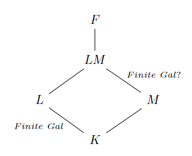

# 域和根的关系

- 本章考虑的扩张都是代数扩张。超越扩张性质不行，不被考虑
- **大小关系**：代数闭域（全部多项式分裂） $\subset$ 分裂域（关于 $f$ 分裂）
  - 代数闭包用于生成代数闭域，正规扩张用于生成分裂域，代数扩张生成的域不确定
  - 代数伽罗瓦扩张 = 正规扩张 + 可分扩张，用于生成可分的分裂域
    - 若要保证基的可动性，则根必须是互不相同的。否则两个重根之间的置换，在外界看来等价于不动。
  - 代数闭包 $\subset$ 正规扩张，因为后者的 $S\subset K[x]$ 不是所有既约多项式，而前者的 $S\subset F[x]$ 是所有既约多项式，差了两个条件呢

## 分裂域

- **分裂多项式**：设 $F$ 是域，$f\in F[x]$ 是有限次多项式，若 $f$ 可被写成 $F[x]$ 中一次因式的积，则称 $f$ 在 $F$ 上分裂【或称为在 $F[x]$ 中分裂】
- **分裂域**：设域 $F\geq K$，$S$ 是 $K[x]$ 上某个有限次多项式集
  - 若 $\forall f\in S$ 在 $F[x]$ 上都分裂，且 $F = K(u_1,...,u_n)$（$u_i\in F$ 是 $f$ 的全部根）
  - 则 $F$ 称为 $K$ 上多项式集合 $S$ 的分裂域
  - **实例**：
    - $\Q(\sqrt{2})$ 是 $\Q$ 上 $\{x^2-2\}$ 的分裂域
    - $\C$ 是 $\R$ 上 $\{x^2+1\}$ 的分裂域
    - $\Q[\sqrt{b^2-4ac}]$ 是 $\Q$ 上 $\{ax^2+bx+c\}$ 的分裂域
    - 设 $f(x) = x^3+ax^2+bx+c$ 在 $\C$ 上的根为 $\a_1,\a_2,\a_3$
      - 则 $\Q[\a_1,\a_2,\a_3] = \Q[\a_1,\a_2]$ 是 $f(x)$ 的分裂域
      - **证明(Milne)**：
  - **反例**：若 $u$ 是既约多项式的根，则 $K(u)$ 可以不是分裂域
    - 设 $u$ 是2的立方根，但 $\Q(u)$ 不是 $\Q$ 上 $\{x^3-2\}$ 的分裂域
  - **代数性**：分裂域是 $S$ 的所有根生成的域，从而是代数扩张。且当 $S$ 有限时是有限维扩张
  - **次数不定性**：$F$ 不一定是 $n-1$ 维扩张
    - **反例**：比如 $\Q$ 上 $3$ 次既约多项式，若仅含有一个实根，则其分裂域 $F$ 满足 $[F:\Q] = 6$
      - **证明**：此时有一个实根 $a$ 和两个共轭复根 $b,c$
        - 由根的本原性，$c = b^2$
        - 由代数扩张结构公式，$[F:\Q]$ 的基为 $\{1_\Q,a,a^2,b,b^2,ab,a^2b^2\}$，故是 $6$ 维扩张
      - **推论**：若知道各个根所处的最小域，就可以求出分裂域的维数。
    - **有限情况**：但当分裂域有限时，它的阶数确实可以确定的。详见[有限域分裂性](15.域的分类.md)
  - **中间域遗传性**：
    - 设域 $K\leq E\leq F$，其中 $E = K(u_1,...,u_r)$（$u_i$ 是 $f\in K[x]$ 的部分根）
    - 则 $F$ 是 $K$ 上 $f$ 的分裂域 $\LR$ $F$ 是 $E$ 上 $f$ 的分裂域
    - **证明**：定义易得
    - **本质**：分裂域的定义只依赖于 $f$。不管系数域是 $K$ 还是 $E$，只要 $F$ 是 $f$ 的分裂域，就始终是分裂域
    - **推论**：对任意多项式集合 $S$ 也成立
  <!-- - **因子遗传性（本质就是下面的复合性）**：
    - 设域 $K\leq F$，$T$ 是 $S$ 中所有既约因子
    - 若 $F$ 是 $K$ 上 $S$ 的分裂域，则其也是 $T$ 的分裂域
    - **证明**： -->
  - **复合性**：$S_1 = \{f_1,...,f_n\}$ 的分裂域和 $S_2 = \{f_1\cdots f_n\}$ 的分裂域相等
    - **证明**：易得两集合中多项式的根完全相同，故根生成的分裂域也完全相同
  - **对应性**：【有限维】代数伽罗瓦扩张都是某个多项式【有限】集合的分裂域
    - **证明**：见后面
- **（定理3.2）分裂域存在性**：若 $K$ 是域，$f\in K[x]$ 的次数为 $n\geq 1$，则存在分裂域 $F$ 满足 $[F:K]\leq n!$
  - **证明**：$f$ 分裂时显然 $K$ 自身就是分裂域。下面对 $\deg f$ 归纳
    - $n=1$ 时<!-- $f(x) = x-a\pad (a\in K)$ -->，显然 $K$ 自身就是分裂域
    - $n>1$ 且 $f$ 不分裂时，可设 $g\in K[x]$ 是其大于1次的既约因式
      - 由标准干域存在性，可设 $u\notin K$ 是 $g$ 的根，则 $[K(u):K] = \deg g$
      - 由 $u$ 的根性，可设 $f = (x-u)h\pad (h\in K(u)[x])$。由归纳假设，存在 $K(u)$ 上 $h$ 的分裂域 $F$，且 $[F:K(u)]\leq (n-1)!$
      - 易得 $F$ 也是 $K$ 上 $f$ 的分裂域，且 $[F:K] = [F:K(u)][K(u):K] \leq (n-1)!\deg g \leq n!$
  - **理解**：已知标准干域总存在，即 $\forall f\in K[x]$，总有一个 $F\geq K$ 包含 $f$ 的一个根。再由 $f$ 的根数有限，不断归纳即得结论
  - **本质**：标准干域存在性的直接推论（如此看来，Milne中让分裂域紧跟在干域后面不是没有道理的，反而是Hungerford有点奇怪）
  - **实例（分裂域是单扩张的几个例子）**：
    - **分圆多项式的分裂域**：设 $f(x) = \dfrac{x^p-1}{x-1}\in \Q[x]$
      - 设 $\zeta$ 是扩张域中的根，易得其它的根为 $\zeta^i$，从而 $f$ 的分裂域为 $\Q[\zeta]$
      - 实际上，$F[\a]$ 是分裂域 $\LR F$ 包含所有本原单位根。当 $n$ 是特征 $p$ 时，由新生之梦得 $x^p-1 = (x-1)^p$，故 $F$ 满足条件
    - 设 $\char F = p$，$f(x) = x^p-x-a \in F[x]$
      - 设 $\a$ 是扩张域中的根，则其它根为 $(\a+1),...,(\a+p-1)$，从而 $f$ 的分裂域为 $F[\a]$
  - **推论**：实际上 $[F:K]$ 整除 $n!$
    - **证明**：设 $\a_1,...,\a_n$ 是 $f$ 的所有根，则 $F = K(\a_1,...,\a_n)$
      - 再由 $K$ 可分，得 $F\geq K$ 是伽罗瓦扩张，从而由闭域得 $[F:K] = |\aut_K F|$
      - 取作用同态 $\aut_K F\to S_n$，其为单射，故 $|\aut_K F|$ 整除 $|S_n|$
- **（定理3.3）代数闭域 $F$**：下列定义等价
  - $F[x]$ 中的非常数多项式均存在 $F$ 中的根
  - $F[x]$ 中的非常数多项式均在 $F$ 上分裂
  - $F[x]$ 中的既约多项式均为一次
  - $F$ 没有代数扩张
  - 存在域 $K\leq F$ 满足 $F$ 是 $K$ 的代数扩张，且 $K[x]$ 中的多项式均在 $F[x]$ 中分裂
  - **证明**：
    - $(1)\to(2)$：由 $f$ 在 $F$ 上有根，可设 $f(x) = (x-x_1)g(x)\pad (x_1\in F)$，若 $g$ 是非常数多项式，则也存在根，从而可再次分裂，不断进行即得 $f$ 在 $F$ 上分裂
    - $(2)\LR (3)$：定义直得
    - $(1)(2)(3)\to (4)$：此时 $F$ 包含其所有的代数元素，当然没有代数扩张
    - $(4)\to (5)$：任取 $u_n\in F$ 是代数元素，设 $K = F-(u_n)$ 即可
      - 已知 $F = K(u_n)$，再由于 $F$ 包含所有代数元素，故 $F$ 也由 $K[x]$ 的所有根生成
    - $(5)\to (1)$：设 $f(x) = \sum\limits^n_{i=1} a_ix^i\in F[x]$
      - 由标准干域存在性，其在有限维扩张域中有根 $\a$，可设为 $K[a_0,...,a_n,\a]$ 
      - 由维度代数关系，其为代数扩张，即 $\a$ 是 $K$ 的代数元素，存在 $g\in K[x]$ 以其为根
      - 由题设，$g$ 在 $F[x]$ 中分裂，故 $g$ 在 $K[a_0,...,a_n,\a]$ 中的根均在 $F$ 中，从而 $\a\in F$，即得结论
  - **本质**：全部多项式分裂的域（无法代数扩张的域）（不存在既约多项式的域）是代数闭域
  - **实例**：由代数基本定理，$\C$ 是代数闭域
  - **反例**：有限域均不为代数闭域
    - **证明**：若 $K = \{a_0,...,a_n\}$，则 $a_1 + \prod\limits^n_{i=0} (x-a_i)$ 的根不在 $K$ 中
  - **推论（封闭性定义）**：设 $F\geq K$，若 $K$ 含于 $F$ 的最大代数扩张为 $K$ 本身，则 $K$ 是代数闭的
    - **证明**：定义易得
- **（定理3.4）代数闭包 $\ol F$**：设 $R\supset F$ 是整环，则 $\ol F = \set{\a\in R\mid \a 是 F 的代数元素}$ 是 $F$ 在 $R$ 中的代数闭包（这里 $R$ 起到一个兜底的作用）
  - **等价定义**：
    - $\ol F$ 是 $F$ 上既约多项式全集的分裂域
    - $\ol F$ 是 $F$ 的代数扩张，且是代数闭域
  - **证明**：
    - $(2)\LR (3)$：定义易得
    - $(1)\to (3)$：设 $\a,\b$ 是 $F$ 代数元素，则 $F[\a,\b] = F[\a][\b]$ 是有限维扩张，由维度代数关系即得是代数扩张。由代数元素的加减乘除封闭性得是代数闭域。归纳即可
  - **本质**：$F$ 加上其所有代数元素扩张成的域
  - **推论（同态性定义）**：$F\geq K$ 是代数扩张，且对 $K$ 的任何代数扩张 $E$，都存在K单同态 $E\to F$
  - **推论（同构性定义）**：$F\geq K$ 是代数扩张，且对任意同构域 $\sigma:K_1\cong K$ 的代数扩张 $E\geq K_1$，$\sigma$ 都可延拓为 $E\to F$
  - **遗传性**：若 $K\leq F$，则 $\ol F$ 也是 $K$ 的代数闭包
    - **证明**：
      - 定义易得 $\ol K$ 是代数闭域，再由代数性的扩张传递，$\ol K$ 也是 $K$ 的代数扩张
- **（引理3.5）代数扩张可数性**：若 $F$ 是 $K$ 的代数扩张，则 $|F|\leq \alef_0|K|$
  - **证明（Hungerford）**：设 $T$ 是 $K[x]$ 中有限次首一多项式全集
    - $\forall n\in \N^+$，设 $T_n$ 是 $n$ 次多项式全集，则 $|T_n| = |K^n|$，存在系数和多项式的双射 $f_n:T_n\to K^n$
      - 再由 $n$ 不同时 $T_n$ 两两不相交，得 $f:\mathop{\bigcup}\limits_{n\in\N^+}T_n\to \mathop{\bigcup}\limits_{n\in\N^+}K^n，u\mapsto f_n(u)$ 也是双射，从而 $|T| = \biggm|\mathop{\bigcup}\limits_{i\in\N^+} T_n\biggm| = \alef_0 |K|$
    - 对所有既约多项式 $f\in T$，首先对其根设置一个良序
      - 设 $\p:F\to T\times\N^+，a\mapsto (f,i)$
      - 由于 $F$ 是代数扩张，故 $\forall a\in F$ 均为代数元素，则总存在最小首一既约多项式 $f\in T$ 以其为良序下第 $i$ 个根
      - 从而 $\p$ 是单射，则 $|F|\leq \alef_0|T| = \alef_0|K|$
  - **本质**：代数扩张是可数个代数元素单扩张的复合
  - **证明（Milne）**：给定自然数 $N$，易得次数 $n \leq N$ 且系数 $|a_i| \leq N$ 的整系数多项式是有限的，且根均有限，故 $N\to \infty$ 时，至多有可数个代数元素
- **（定理3.6）代数闭包存在唯一性**：域 $K$ 均存在代数闭包，且 $K$ 的代数闭包彼此K同构
  - **证明**：
    - 对任意域 $K$，都可设集合 $S$ 满足 $\alef_0|K| \leq |S|$。再由 $|K|\leq \alef_0|K|$，得必定存在单射 $\t:K\to S$，不妨设 $K\subset S$
      - 也可以在同构意义下用 $K\subset K\cup (S-\Im\t)$ 代替
    - 设 $\mc S$ 是所有K代数扩张 $E\subset S$ 的集族
      - $E$ 中的加法/乘法可看作笛卡尔积 $E\times E\times E$，易得其含于 $S\times S\times S$
      - 从而存在单射 $\tau: \mc S\to \prod\limits^7_{i=1} S，E\mapsto (E,+,\times)$。由于陪域 $P$ 是集合，故其子类 $\Im \tau$ 也是集合。再由 $\mc S$ 是 $\Im\tau$ 在 $\tau^{-1}$ 下的像，故由选择公理，$\mc S$ 也是集合。
    - 已知 $K\subset \mc S$，故其非空
      - 定义域扩张偏序，易得每个全序链的并集是其上界，由Zorn引理得存在 $\mc S$ 的最大元 $F$
    - 反设 $F$ 不是代数闭域，则存在 $f\in F[x]$ 在 $F$ 上不分裂，则存在真代数扩张 $F(u)$，其中 $u\notin F$ 是 $f$ 的根
      - 此时 $F(u)$ 是代数扩张，从而由代数扩张可数性，$|F(u)-F|\leq |F(u)| \leq \alef_0|K| < |S|$
      - 再由 $|S|$ 是无限集，且 $|S| = |S-F|+|F|$，得 $|S| = |S-F|$，从而 $|F(u)-F|<|S-F|$，即 $F$ 的恒等映射可延拓为单射 $\zeta:F(u)\to S$
        - 定义加法乘法为像的加法乘法后，$\Im \zeta$ 可变为域
        - 再由恒等映射延拓得 $F\leq \Im \zeta\leq S$，则此时 $\zeta:F(u)\to \Im\zeta$ 是F同构
        - 从而 $\Im\zeta$ 是 $F$ 的真代数扩张。再由 $\Im\zeta\subset S$，其与 $F$ 的偏序最大性矛盾
    - 唯一性在后面
- **（推论3.7）分裂域存在性补充**：实际上就是将定理3.2的 $f$ 换成了 $S$
  - 若 $K$ 是域，$S$ 是 $K[x]$ 中某个有限次多项式的集合，则存在 $K$ 上 $S$ 的分裂域
  - **证明**：取 $K$ 的代数闭包，其即为 $S$ 的分裂域
- **（定理3.8）同构的分裂域延拓**：
  - 设 $\sigma:K\to L$ 是域同构，$S$ 是 $K[x]$ 的某个有限次多项式集合，$S'= \sigma(S)$
  - 若 $F$ 是 $K$ 上 $S$ 的分裂域，$M$ 是 $L$ 上 $S'$ 的分裂域
  - 则 $\sigma$ 可延拓为同构 $F\cong M$
  - **证明（单多项式）**：首先设 $S = \{f\}$，对 $[F:K] = n$ 归纳
    - $n=1$ 时，$F = K$，即 $f$ 在 $K$ 上分裂。由同构性即得 $L = M$，$\sigma f$ 在 $M$ 上分裂。此时 $\sigma$ 自身就是所需同构
    - $n>1$ 时，$K$ 不是分裂域，故 $f$ 存在一个大于一次的既约多项式因子 $g$。设 $u\in F$ 以 $g$ 为极小多项式
      - 若 $v\in M$ 是 $\sigma g$ 的根，则由代数扩张同构可延拓性，$\sigma$ 可延拓为同构 $\tau:K(u)\cong L(v)，u\mapsto v$
      - 再由 $[K(u):K] = \deg g > 1$，则 $[F:K(u)] < n$。再由 $F$ 是 $K(u)$ 上 $f$ 的分裂域，$M$ 是 $L(v)$ 上 $\sigma f$ 的分裂域，由归纳假设即得 $\tau$ 可延拓为 $F\cong M$
    - **理解**：归纳法，将分裂域同构性转化为同维度代数扩张同构性
  - **证明（多项式集合）**：再设 $S$ 是任意多项式集合
    - 设 $\mc S$ 是 $(E,N,\tau)$ 集族，其中 $K\leq E\leq F，L\leq N\leq M，\tau:E\to N$ 是原同构的延拓
    - 定义域扩张偏序，易得非空且全序链有上界，故由Zorn引理存在最大元 $(F_0,M_0,\tau_0)$
    - 反设 $F_0\neq F$，则存在 $f\in S$ 在 $F_0$ 上不分裂
      - 再由 $f$ 的根均在 $F$ 中，故 $F$ 中存在一个 $F_0$ 上 $f$ 的分裂域 $F_1$
      - 同理 $M$ 中也存在 $M_0$ 上 $\tau_0 f = \sigma f$ 的分裂域 $M_1$
      - 由之前结论，$\tau_0$ 可延拓为 $\tau_1:F_1\cong M_1$，但此时与最大元相矛盾
- **（推论3.9）分裂域唯一性**：
  - 设 $K$ 是域，$S$ 是 $K[x]$ 的某个有限次多项式集合，则 $K$ 上 $S$ 的分裂域均K同构
  - **证明**：令 $\sigma = 1_K$，已知其可延拓为任意分裂域的同构。再由恒等性即得该同构就是分裂域的K同构
  - **推论**：$K$ 的代数闭包均K同构（分裂域和代数闭包息息相关，上面是用集合的原始工具来推导，这是用分裂域的域论工具来推导）

#### 习题（Milne上的定理补充）

- 设 $f\in K[x]$
  - $E$ 是某些根生成的代数扩张
  - $F$ 是 $K$ 上 $f$ 的分裂域
- 则
    - 存在K同态 $\p:E\to F$
    - 设 $P = \{\p\}$ ，则 $|P| \leq [E:K]$，仅当 $f$ 无重根（可分）时取等
    - **归纳证明**：实际上就是分裂域的遗传性
      - 设 $E = K[\a_1,...,\a_m]$，则 $\a_1$ 的最小多项式 $f_1\mid f$，故若 $f$ 无重根，则 $f_1$ 无重根
      - 由之前习题，存在同态 $\p_1:K[\a_1]\to F$，且数量最多为 $[K[\a_1]:K]$，且取等条件为 $f$ 无重根
      - $\a_2$ 在 $K[\a_1]$ 上的的最小多项式为 $\Big( f_2\in K[\a_1][x] \Big)\mid f$，此时 $L = \p_1K[\a_1]，g = \p_1f_2$。此时 $\p_1f_2$ 在 $F$ 中分裂，从而若 $f$ 无重根，则 $\p_1f_2$ 也无重根
      - 由之前习题，每个 $\p_1$ 可延拓为 $\P_2:K[\a_1,\a_2]\to F$，且数量最多为 $[K[\a_1,\a_2]:K[\a_1]]$，且取等条件为 $f$ 无重根
      - 归纳并组合即可
  - **推论**：设 $E,F\geq K$，$E$ 是有限维扩张，$\p:E\to F$ 是K同构，$P = \{\p\}$
    - 则 $|P|\leq [E:K]$
    - **证明**：设 $E = K[\a_1,...,\a_m]$，$f\in K[x]$ 是所有根的极小多项式积。则 $E$ 由 $f$ 在 $K$ 中的根生成
      - 设 $L$ 是 $f$ 的分裂域，则存在F同态 $E\to L$，数量最多为 $[E:K]$。再由F同态 $E\to F$ 也可看作 $E\to L$，即得结论
- **分裂域仅依赖于 $f$**：设 $f,g\in K[x]，F\geq K$。若 $r(x)$ 是 $K[x]$ 中的最大公因式，则也是 $F[x]$ 中的最大公因式。
  - **证明**：
    - 设 $r_K，r_F$ 分别是最大公因式，易得 $r_K\mid r_F$
    - 再由裴蜀等式，$af + bg = r_F\pad (a,b\in K[x])$，从而 $r_F\mid r_K$
  - **推论**：若两个首一既约多项式不同，则它们在任何扩张域中均无相同的根
    - **证明**：最大公因式为 $1$

### 可分性

- **可分多项式**：设 $K$ 是域，$f\in K[x]$ 是既约多项式。若 $K$ 上 $f$ 的分裂域中，每个 $f$ 的根都是单根，则 $f$ 是可分的
  - 非既约多项式不讨论可分性
  <!-- - **特征与重根**：若 $\char K = 0$，则既约多项式均可分
    - **证明**：求导即可 -->
  - **实例**：
    - $f(x) = x^2+1\in \Q[x]$ 是可分的
      - **证明**：易得 $\Q$ 上 $f$ 的分裂域为 $\C$，易得根均为单根
  - **反例**：
    - $f(x) = x^2+1\in \Z_2[x]$ 是不可分的
      - **证明**：实际上它是非既约的，$x^2+1 = x^2+\ol 2x+1 = (x+1)^2$
  - **等价反命题**：若 $f$ 有重根，则
    - $F$ 有特征 $p$，且 $f$ 是 $x^p$ 的多项式
      - **证明**：由有重根得 $\gcd(f,f')\neq 1$。再由 $f$ 既约得只能是 $f' = 0$
        - 再由于 $f' = \sum\limits^{n-1}_{i=1} ia_ix^{i-1}$，故 $f'= 0$ 等价于 $F$ 有特征 $P$ + $\forall p\nmid i，a_i=0$，即 $f$ 可写成 $x^p$ 的多项式
    - $f$ 的所有根是重根
      - **证明**：此时 $f(x) = g(x^p)$，设 $g$ 在分裂域中为 $\prod (x-a_i)^{m_i}$
        - 在某个中间域中存在 $\a^p = a_i$，其中 $\a$ 是 $f$ 的根
          -  反设 $a$ 不是 $p$ 次幂，则 $x^p-a$ 既约，但其在分裂域中可写为 $(x-\a)^p$（其中 $\a\notin F$）。此时常数项只有 $-\a^p$，故 $-\a^p = -a$，矛盾。
        - 则此时 $f(x) = g(x^p) = \prod (x^p-a_i)^{m_i} = \prod (x-\a_i)^{pm_i}$，即 $\a_i$ 均为重根
    - **理解**：因为扩张中的根必定共轭出现，所以简单的零特征扩张并不会有重根。只有存在特征时，才可能在扩张后有重根
      - 有了特征后，$p$ 次方因式就等价于平方项，再由多项式的变量和系数都是平方项，即得因式均等价于平方因式，即根均为重根
    - **本质**：既约的式子却有重根，本身就是非常奇怪的事情。除非有些项被消掉了。怎么消掉的呢？只能是被域的特征消掉了。
      - 再由二项式定理，只有完全 $p$ 次方项才不含特征，故 $f$ 只能是 $p$ 次项构成的因式，其它项均被特征消掉了
      <!-- - 由标准干域的结构公式，任何域收缩都可看作商去一个多项式。也就是说，$f$ 中有些项被商等价消掉了 -->
- **完美域**：$\char F = 0$，或 $\char F = p$ 且每个元素都是 $p$ 次幂（可写为 $K = K^p$）
  - **可分判定法**：$F$ 是完美域 $\LR$ 既约多项式均可分
    - **证明**：
      - 零特征时，已知无重根，故可分
      - 特征为 $p$ 时，由前面不可分的等价命题，不可分多项式均可写成 $\Big[ \prod (x-\a_i)^{m_i} \Big]^p$ 的形式，故不既约
  - **并集封闭性**：
  - **实例**：
    - 有限域是完美域，因为Frobenius自同态是双射
    - 代数闭域是完美域
  - **反例**：
    - 若 $\char F = p$，则 $F[x]$ 不是完美域，因为 $x$ 不是 $p$ 次幂
- **可分元素**：设域 $F\geq K$，$u\in F$ 是代数元素。若它的极小多项式可分，则 $u$ 称为可分元素
- **可分扩张**：若每个 $F$ 中元素都可分，则其为可分扩张
  - 在这里，我们认为可分扩张必须是代数扩张
  - **实例**：由根的共轭性，$\C\geq \R$ 是可分扩张
  - **反例**：$\C\geq \Z_2[x]$ 不是可分扩张，因为 $i$ 的极小多项式 $x^2+1$ 在 $\Z_2$ 上不可分
  - **生成传递性**：设 $F\geq K$
    - 若 $u_1,...,u_n\in F$ 在 $K$ 上可分，则 $K(u_1,...,u_n)\geq K$ 是可分扩张
    - **证明**：定义易得
    - **推论**：$\{u_i\}$ 无限时也成立
  - **遗传性**：设 $F\geq E\geq K$
    - **下界上升**：若 $F$ 在 $K$ 上可分，则 $F$ 在 $E$ 上也可分
      - **证明**：元素分析法（对任意元素 $u$ 成立）即可
        - $F$
    - **上界下降**：若 $F$ 在 $K$ 上可分，则 $E$ 在 $K$ 上可分
      - **证明**：
- **（定理3.11）可分与分裂**：设域 $F\geq K$，则下列条件等价
  - $F$ 是代数扩张和伽罗瓦扩张
  - $F$ 在 $K$ 上可分，且是 $K[x]$ 上某个多项式集合 $S$ 的分裂域
  - $F$ 是 $K$ 上某个可分多项式集合 $T$ 的分裂域
    - $[F:K]$ 有限时，$F$是 $K$ 上某个既约因子均可分的 $f$ 的分裂域
  - **证明**：
    - $(1)\to (2)$：
      - 前面伽罗瓦扩张稳定条件中已证单集合 $S = \{f\}$ 的情况
      <!-- - 设 $u\in F$ 是既约多项式 $f$ 的根，已知在伽罗瓦扩张稳定条件的证明中，已得 $f = g = \prod (x-u_i)$，即 $u$ 是可分元素。 -->
      - 设 $\{v_i\mid i\in I\}$ 是 $[F:K]$ 的基，$f_i$ 是对应既约根式。则归纳得 $f_i$ 均在 $F[x]$ 上分裂且可分。再由基的表出性，对任意多项式集合 $S$，都有 $F$ 是 $K$ 上 $S$ 的分裂域
      - 就是前面定理的直接推论
    - $(2)\to (3)$：
      - 设 $f\in S，g\in K[x]$ 是 $f$ 的首一既约因子
      - 由于 $f$ 在 $F[x]$ 中分裂，得 $g$ 是某些 $u\in F$ 的既约根式。由 $F$ 可分，得 $g$ 可分
      - 再由分裂域的复合性，$F$ 也是 $g$ 的分裂域
      - 取 $T$ 为 $f$ 首一既约因子集合即得结论
      - 仔细一看，这个结论是显然的……
    - $(3)\to (1)$：
      - 已知分裂域都是代数扩张，故由结构公式，$\forall u\in F-K$，都存在 $f_i\in T$（设根为 $v_i$），使得 $u\in K(v_1,...,v_n)$
      - 设 $u\in E = K(u_1,...,u_r)$，其中 $\{u_1,...,u_r\}\in F$ 是 $f_1,...,f_n$ 的全部根，显然 $[E:K]$ 是有限维扩张
      - 由于 $f_i$ 均在 $F$ 上分裂，得 $E$ 是 $K$ 上 $\{f_1,...,f_n\}$ 的分裂域
      - 若 $[F:K]$ 有限时结论成立
        - 则 $E$ 是伽罗瓦扩张，即 $u$ 是 $\aut_K E$ 的可动点，可设 $\tau\in \aut_K E$ 满足 $\tau(u)\neq u$
        - 再由分裂域遗传性，$F$ 也是 $E$ 上 $T$ 的分裂域。由同构的分裂域延拓定理，得 $\tau$ 可延拓为 $\sigma\in \aut_K F$，从而 $u\notin (\aut_K F)'$，是可动点
        - 由 $u$ 的任意性即得 $F\geq K$ 是伽罗瓦扩张
      - **证明（有限维情况）**：设 $[F:K]$ 有限，则 $\aut_K F$ 是有限群
        - 此时仅存在有限个不同根多项式 $g_1,...,g_t\in T$ 在 $F$ 上分裂
        - 设 $K_0$ 是其固定域，则由固定域定义得 $F\geq K_0$ 是有限维伽罗瓦扩张，从而是闭域，即 $[F:K_0] = |\aut_K F|$。只需证 $K = K_0$，或 $[F:K] = |\aut_K F|$，即可得伽罗瓦扩张性
        - 对 $[F:K]$ 归纳
          - 当 $n=1$ 时，$F = K$，显然是伽罗瓦扩张
          - 若 $n-1$ 以下均成立，则存在 $\deg g_1 = s>1$，否则 $g_1$ 在 $K$ 中分裂，由分裂域唯一性即得 $F = K$
            - 设 $u\in F-K$ 是 $g_1$ 的根，则 $[K(u):K] = s$。再由 $g$ 可分性，存在 $s$ 个不同的根
            - 再由域的维度倒向单不增性中的讨论，存在（$H = \aut_{K(u)} F$ 的左陪集）到（$g_1$ 在 $F$ 中所有根）的单射，从而 $[\aut_K F:H] \leq s$
            - 若 $v\in F-K$ 是 $g_1$ 的另一个根，则由同构的超越扩张可延拓性，存在K同构 $\tau:K(u)\cong K(v)$。由于 $F$ 对这两个域上的 $T$ 均分裂，由同构的分裂域可延拓性，$\tau$ 可延拓为 $\sigma\in \aut_K F$，从而每个 $g_1$ 的根都是 $H$ 左陪集的像，即 $[\aut_K F:H] = s$。再由分裂域的因子遗传性，$F$ 也对 $g_i$ 在 $K(u)$ 上的既约因子 $h_j$ 分裂，且由 $g_i$ 可分性得 $h_j$ 均可分
            - 此时达到降维目的，$[F:K] = [F:K(u)][K(u):K] = |H|s = |H|[\aut_K F:H] = |\aut_K F|$，从而得到结论
        - 分裂域 + 可分性 = $f\in K[x]$ 在 $F$ 中有 $\deg f$ 个不同的根，从而是稳定中间域，再由代数扩张性即得伽罗瓦性
  - **推论（代数伽罗瓦遗传性）**：设 $F\geq E\geq K$
    - **中间遗传**：若 $F\geq K$ 是代数伽罗瓦扩张，则 $F\geq E$ 也是
    - **连续遗传**：若 $F\geq E，E\geq K$ 都是伽罗瓦扩张，$F$ 是 $E$ 上 $S\subset K[x]$ 的分裂域，则 $F\geq K$ 是伽罗瓦扩张
      - **证明**：代数遗传性 + 伽罗瓦的稳定域遗传性 + 可分遗传性即可
- **（定理3.12）广义基本伽罗瓦理论**：设 $F\geq K$ 是代数伽罗瓦扩张，则
  - **一一对应性**：存在中间域和闭子群的一一对应
  - **伽罗瓦性**：$F$ 是所有中间域的伽罗瓦扩张
    - **证明**：由闭对应性定理，只需要每个中间域都是闭域即可得到一一对应关系。
      - 由可分与分裂定理，$F$ 是 $K$ 上某个可分多项式集合 $T$ 的分裂域，从而由遗传性，$F$ 也是 $E$ 上 $T$ 的分裂域。再由可分与分裂定理，$F\geq E$ 为伽罗瓦扩张，即 $E$ 是闭域
  - **无指数对应性**
    - **反例**：
  - **无全闭性**：总存在非闭的伽罗瓦子群
    - **反例**：只要中间域不稳定，就不是伽罗瓦扩张，从而伽罗瓦子群非闭
  - **正规性**：$E$ 是 $K$ 的伽罗瓦扩张 $\LR E'\lhd \aut_K F$
    - **证明**：由 $F$ 是代数扩张，得中间域均为代数扩张，类似基本伽罗瓦理论的证明，可得正规性结论
  - **商性**：若 $E$ 是正规扩张，则 $G/E'\cong \aut_K E$
    - **证明**：由于 $E$ 是代数伽罗瓦扩张，由伽罗瓦扩张稳定条件，$E$ 是稳定中间域
      - 从而由稳定中间域与可扩张性，$G/E' = \aut_K F/\aut_E F$ 同构于 $\aut_K E$ 的可扩张子群
      - 再由 $F$ 同时是 $K,E$ 分裂域，得 $K$ 同构均可扩张

#### 习题

- **拉格朗日定理**：设 $F\geq L,M\geq K$
  - 若 $L\geq K$ 是有限维伽罗瓦扩张
  - 则 $LM\geq M$ 是有限维伽罗瓦扩张（提示：本质是证明 $\aut_M LM \cong \aut_{L\cap M} L$）
  
  - **证明**：
      - **有限性**：设 $L = K(u_1,...,u_n)$，则 $LM = M(L) = M(1_K,u_1,...,u_n)$，故也是有限维扩张
      - **伽罗瓦性**：要么用维度倒向单不增性，要么用可动点定义（稳定遗传性）证明
        <!-- - 反设 $LM$ 不稳定，则存在 $a\in M(L), \sigma\in \aut_M F$ 使得 $\sigma(a) \notin M(L)$ -->
        - 任取 $\sigma\in\aut_M LM$
        - 由于 $\sigma$ 保持 $M$ 不动，故我们只需考虑 $\sigma$ 在 $L$ 基上的作用，从而得到提示中的同构式
          - 详细的证法就是，把 $a$ 用 $L,M$ 中的基表示出来，然后将同构映射转化取限制或取延拓，转化一下即可
        - 再由于 $L\geq K$ 是伽罗瓦扩张，故 $\aut_K L$ 在 $L-K$ 上无不动点，由同构即得 $\sigma$ 在 $LM-M$ 无不动点，即是伽罗瓦的
  - **本质**：这算是一种约化。即（$L$ 在 $M\geq K$ 上的扩张作用）和（$L$ 在 $K$ 上的扩张作用）的关系。和群论中的陪集等式类似

#### 例子

- 设 $F$ 是 $\Q$ 的代数闭包，$E\leq F$ 是 $\Q$ 上 $\{x^2+a\}$ 的分裂域，易得 $E$ 是代数伽罗瓦扩张
  - $E = \Q(X)，X = \{\sqrt{p}\mid p为-1或素数\}$
  - $\forall \sigma\in \aut_\Q E$ 有 $\sigma^2 = 1_E$
    - **证明**：
    - **推论**：$\aut_\Q E$ 是 $\Z_2$ 向量空间
  - $\aut_\Q E$ 不可数
    - **证明**：提示
  - ……

### 正规扩张

- **正规扩张**：设 $F\geq K$ 是代数扩张，若所有在 $F$ 中有根的既约 $f\in K[x]$ 均在 $F$ 上分裂，则 $F$ 是正规扩张
- **（定理3.14）等价定义**：设 $F\geq K$ 是代数扩张，则下列命题等价
  - $F$ 是正规扩张
  - $F$ 是分裂域
  - 设代数闭包 $\ol K \geq F$，则对任意K单同态 $\sigma:F\to \ol K$ 都有 $\Im \sigma = F$，即可进化为K自同构（$\sigma\in \aut_K F$）
  - **证明**：
    - $(1)\to (2)$：
      - 设 $\{u_i\mid i\in I\}$ 是 $[F:K]$ 的基，$S = \{f_i\}$ 是其既约根式，由基的线性组合表出性 + 多项式线性组合的同解性，得任意多项式集合 $T$ 可被 $S$ 线性表出，从而均在 $F$ 中分裂，即 $F$ 是 $K$ 上 $S$ 的分裂域
      - 由定义得显然
    - $(2)\to (3)$：
      - 设 $F$ 是 $K$ 上 $\{f_i\mid i\in I\}$ 的分裂域，$\sigma:F\to \ol K$ 是K单同态
      - 由分裂性，$\forall f_j = c\prod\limits^n_{i=1}(x-u_i)\pad (u_i\in F，c\in K)$
      - 由 $\ol K[x]$ 是UFD + 同态保根性得 $\sigma(u_i)$ 是根集 $\{u_i\}$ 的置换。再由 $F$ 是代数扩张，其可由某些 $f_i$ 的根 $u_i$ 生成，类似[可分与分裂](#可分与分裂)的证明，即得 $\sigma\in \aut_K F$
      - 上面是由代数扩张 + 伽罗瓦扩张得分裂域，这里是由代数扩张 + 分裂域反推伽罗瓦性（虽然最终推得的结论较弱）
    - $(3)\to (1)$：
      <!-- - 由 $\ol K$ 是 $F$ 的代数闭包，由代数闭包遗传性，$\ol K$ 也是 $K$ 的代数闭包 -->
      - 任取 $f\in K[x]$，设有根 $u\in F$，则由代数闭包性，$\ol K$ 包含 $f$ 的所有根
        - 若 $v\in \ol K$ 也是 $f$ 的根，则由同构的分裂域延拓性，存在K同构 $\sigma:K(u)\cong K(v)，u\mapsto v$，且可延拓到 $\ol K$ 上
      - 此时 $\sigma|_F$ 是单同态，由题设得 $\sigma\in\aut_K F$，则 $v = \sigma(u)\in F$。由 $v$ 任意性得 $f$ 在 $F$ 上分裂。再由 $f$ 任意性得 $F$ 是正规扩张
  - **推论**：$(3)$ 中将代数闭包替换成正规扩张时，结论也成立
- **（推论3.15）正规进化为伽罗瓦的条件**：设 $F\geq K$ 是代数扩张，则 $F$ 是伽罗瓦扩张 $\LR F$ 是正规可分扩张
  - **证明**：由正规扩张等价命题，$F$ 分裂。再由 $F$ 可分即得伽罗瓦性
  - **理解**：主要难点在可分与可裂关系定理的 $(3)\to (1)$ 部分
  - **推论**：若 $\char F = 0$，则 $F$ 是伽罗瓦扩张 $\LR F$ 是正规扩张
- **（定理3.16）正规闭包**：设 $E\geq K$ 是代数扩张，则存在 $F\geq E$ 满足以下三个条件
  - $F$ 是 $K$ 的最小正规扩张
  - 若 $E$ 可分，则 $F$ 是 $K$ 的伽罗瓦扩张
  - $[F:K]$ 有限 $\LR [E:K]$ 有限
  - **证明**：设 $X = \{u_i\mid i\in I\}$ 是 $[E:K]$ 的基，$f_i\in K[x]$ 是 $u_i$ 的既约根式
    - $(1)$：由分裂域存在性，可设 $F$ 是 $E$ 上 $S = \{f_i\}$ 的分裂域。再由分裂域遗传性，$F$ 也是 $K$ 上 $S$ 的分裂域，从而 $F$ 在 $K$ 上正规
      - 此时正规扩张的上界为 $F$，下界为 $K$，且代数扩张是有限的（离散的），故其中必然存在最小的正规扩张
    - $(2)$：若 $E$ 在 $K$ 上可分，则每个 $f_i$ 可分，从而 $F$ 是 $K$ 的伽罗瓦扩张
    - $(3)$：
      - **必要性**：易得
      - **充分性**：若 $[E:K]$ 有限，易得基 $X$ 和多项式集 $S$ 也有限。从而 $[F:K]$ 也有限
    <!-- - **最小性**：中间域 $E\leq F_0\leq F$ 必定包含所有的 $u_i$。若 $F_0$ 在 $K$ 上正规，则 $F\leq F_0$，从而 $F = F_0$ -->
  - **唯一性**：$F$ 在E自同构意义下唯一，称为 $K$ 的正规闭包
    - **证明**：
      - 反设 $F_1$ 是另一个正规闭包，则由正规性 + 含根性，$F_1$ 包含 $K$ 上 $S$ 的分裂域 $F_2$，且 $E\leq F_2$
      - 则 $F_2$ 在 $K$ 上正规，从而由 $F_1$ 的最小正规性，只能是 $F_2 = F_1$，从而 $F,F_1$ 都是 $K$ 上 $S$ 的分裂域，从而也是 $E$ 上 $S$ 的分裂域。
      - 由分裂域同构的可扩张性，$E$ 的恒等映射可扩张为E同构 $F\cong F_1$
    - **理解**：$F_1$ 也是 $E$ 的分裂域，由分裂域唯一性即得结论

#### 习题

- **正规扩张的正规性/稳定性**：设 $F\geq K$ 是代数伽罗瓦扩张，中间域 $E$ 是正规扩张，则 $E'\lhd \aut_K F$
  - **证明**：
    - 即证 $E$ 是稳定中间域
    - 由 $E$ 是代数扩张，基可表为 $f\in K[x]$ 的根幂 $\{u^i\}$。再由 $E$ 是正规扩张，得 $u\in E$
    - 由K同构保根性，$\sigma(u)$ 依然是 $f$ 的根，故 $\sigma(u)\in E$，故 $\forall \tau\in E'$ 有 $\tau\sigma(u) = \sigma(u)$，故 $\sigma^{-1}\tau\sigma(u) = u$，即得正规性
- **正规扩张的遗传条件（上界下降）**：若 $F\geq K$ 是正规扩张，则中间域 $E$ 是正规扩张 $\LR E$ 是稳定中间域
  - **证明**：定义即可，或模仿伽罗瓦扩张（这是废话，这书的题里哪个不是用定义就能做的？甚至需要的构造都在题里帮你写好）
  - **理解**：可分性是一定会遗传的，而伽罗瓦扩张 = 正规扩张 + 可分扩张，故伽罗瓦扩张的遗传条件等价于正规扩张的遗传条件
  - **本质**：基本伽罗瓦理论的正规扩张表达
  - **推论（正规扩张的可延拓性）**：$(\aut_K F)/(\aut_E F) \cong \aut_K E$
    - **证明**：
      - 只需证所有 $\aut_K E$ 均可延拓到 $\aut_K F$ 上
      - 由 $F$ 的正规扩张性（分裂性），其包含所有的 $F-K$ 基置换，再由 $\aut_K E$ 是所有的 $E-K$ 基置换，即得可延拓性
    - **理解**：实际上真正发威的是代数扩张这个条件，使得我们可以用基的方法来标准化问题
- **正规扩张无传递性**：设 $F\geq E，E\geq K$ 均是正规扩张，但 $F\geq K$ 不一定是正规扩张
  - **反例**：
    - $\Q(\sqrt[4]{2}) \geq \Q(\sqrt{2}) \geq \Q$ 中
      - 每次扩张均为二次，故是正规扩张，但 $\sqrt[4]{2}$ 的共轭 $i\sqrt[4]{2}$ 不在 $\Q(\sqrt[4]{2})$ 中
      - 即 $\Q$ 上多项式 $x^4-2$ 在 $\Q(\sqrt[4]{2})$ 中有根 $\sqrt[4]{2}$，但不在 $\Q(\sqrt[4]{2})$ 中分裂
- **正规扩张的元素传递**：设 $F\geq K$ 是代数扩张，中间域 $E\geq K$ 是正规扩张
  - 若 $F$ 的元素均在 $E$ 中，则 $F$ 是正规扩张
  - **证明**：
- **正规等价定理**：代数扩张 $F\geq K$ 正规 $\LR$ 任意既约的 $f\in K[x]$ 在 $F[x]$ 中都可分解为（次数相同的既约因子）
  - **本质**：在伽罗瓦性中删去可分性后，置换性被保住，但重根性被舍去。为了保证置换性，各个不同的重根数量必须相等
- **分裂域的正规扩张性（另一种证法）**
  - **证明**：提示

#### 例子

- $2$ 次扩张是正规扩张
- 

### 代数基本定理

- $\C$ 是代数闭域，从而多项式均可解
- **（引理3.17）无限域单扩张定理**：设 $F$ 是无限域的有限可分扩张，则 $\exists u\in F$ 使得 $F = K(u)$
  - **证明**：
- **（引理3.18）**：$\C$ 没有2维扩张
  - **证明**：
- **（定理3.19）代数基本定理**
- **（推论3.20）**：$\R$ 的代数扩张都同构于 $\C$