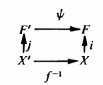
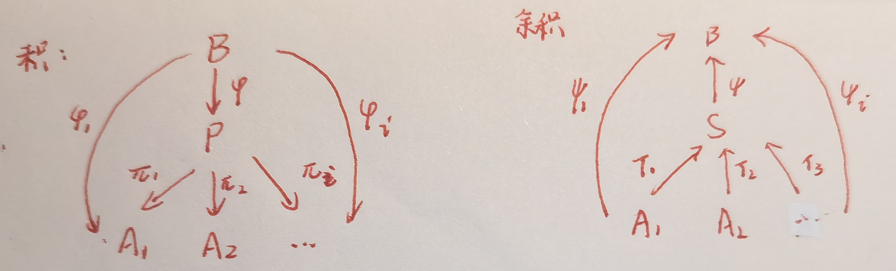

# 群与范畴
  
## 简单范畴

- 提出范畴论的意义：
  - 集合 < 类 < 范畴
  - 类是广义集合，范畴可以不是集合

### 基础范畴论

- **范畴**：（具有态射和态射复合）的（对象）的类 $\mathcal{C}$，满足态射结合律、态射类不相交性、恒等态射存在性
  - **态射**：$f: A\to B$
    - **态射类**：$\hom(A,B)$
    - **域**：$A\quad$ **陪域**：$B$
  - **复合态射**：$fg: A\to C$
    - **复合态射类**：$\hom(A,B)\times \hom(B,C) \to \hom(A,C)$
    - **不相交性**：若 $\hom(A,B)\cap \hom(A',B')\neq \varnothing$，则 $\begin{cases} A = A' \\ B = B' \end{cases}$
    - **结合律**：$(fg)h = f(gh)$
    - **恒等态射**：$\forall A\in\mc C，\exist 1_A\in \hom(A,A)$，使得 $\forall e\in\hom(A,B)，1_Ae = e = e1_A$
  - **等价**：若存在逆态射 $g:B\to A$ 使得 $fg = 1_A$，则 $A\sim B$
    - **推论**：逆唯一性、$gf = 1_B$
  - **实例**：
    - **集合范畴**：所有集合的范畴中，态射就是映射
    - **群范畴**：所有群的范畴中，态射是同态，等价是同构
    - **单个群的范畴**：只有一个元素，态射是 $\hom(G,G)$，复合即运算的复合
    - **范畴 $\mc C$ 中的全体态射 $\mc F$**：$\mc F$ 的态射 $\hom(f,g)$ 是 $\mc C$ 中所有中间态射 $\{\a,\b^{-1}\}$ 的集合
      - $\a g\b^{-1} = f$，故 $g = \a^{-1}f\b$。**交换图**如下：
      $\\$ 
    - **所有偏序集的范畴**：态射是保序映射
      - **链范畴**：对象是自然数，态射是序关系
- **对象族的积**：对于范畴 $\mathcal{C}$ 中的对象族 $\{A_i\mid i\in I\}$ 和任意对象 $B$
  - 若对象 $P$ 满足
    - 存在态射 $\pi_i:P\to A_i$ 
    - 存在唯一态射 $\varphi:B\to P$，使得 $\forall i\in I，(\pi_i\varphi = \varphi_i): B\to A_i$
  - 则称 $P = \prod\limits_{i\in I}A_i$ 是 $\{A_i\}$ 的积
  - **实例**：
    - 集合范畴中的笛卡尔积
      - $P = A_{i_1}\times A_{i_2}\times ... = (a_1,a_2,...)$ 是总空间
      - $B$ 是任意维度的子集
      - $\pi_i: \prod A\to A_i$
        - 投影映射
      - $\Big(\varphi = \prod\limits_{i\in I}\{\pi_i^{-1}\varphi_i\}\Big) : B\to\prod A$
        - 逆投影映射（高维映射）（向量值映射）
      - $\varphi_i : B\to A_i，b_i\mapsto a_i$
        - 高维映射的坐标分量
      - 可以看看拓扑的[Urysohn度量化定理](../拓扑学/点集拓扑/第4章下：度量化与扩张性.md)证明
    - 群范畴的直积
      - $P = G$ 是原始群，$A_i$ 为其弱内直积因子 $N_i$
      - $B$ 是任意群
      - $\pi_i: G\to N_i，g\mapsto\begin{cases} 0 & g\notin N_i \\ g & g\in N_i \end{cases}$
        - 限制映射
      - $\p:H\to G，h\mapsto g$
        - 某个群到原始群的同态
      - $(\p_i=\pi_i\p):H\to N_i$
        - 同态映射 $\p$ 到各个因子的嵌入
      - 若觉得不好理解，可以看看后面的[小总结](#小总结)
- **积唯一性**：若 $(P,\{\pi_i\})$，$(Q,\{\psi_i\})$ 都是同一个对象族的积，则它们等价
  - **证明**：即证 $f:P\to Q$ 和 $g:Q\to P$ 互逆
    - 易得 $(\psi_i fg = \psi_i): P\to A_i$
    - 再由恒等态射定义，$fg = 1_Q$。同理 $gf = 1_P$，从而等价
- **对象族的余积**：
  - 若对象 $S$ 满足
    - 存在态射 $\tau_i: A_i\to S$
    - 存在唯一态射 $\psi: S\to B$，使得 $\forall i\in I，(\psi\tau_i = \psi_i): A_i\to B$
  - 则称 $S = \coprod\limits_{i\in I} A_i$ 是 $\{A_i\}$ 的余积
  - **实例**：
    - 积拓扑范畴中
      - $A_i$ 为 $X_i$ 的开集，$\tau_i$ 是逆投影映射，$\psi$ 是基到开集的映射
      - $S$ 是 $A_i$ 生成的积拓扑基，$B$ 是积空间开集
      - $\psi_i: A_i\to B，a_i\mapsto b_i$
        - 低维开集到高维开集的映射
    - 阿贝尔群范畴的直和
      - $A_i$ 为 $Z$，$S$ 为[自由阿贝尔群](./4.阿贝尔群的结构.md)，$B$ 为任意阿贝尔群
      - $\tau_i$ 是规范逆投影，$\psi$ 为表出同态
      - $\psi_i: \lang  a_i \rang\to \bigm\lang \bigcup \lang a_i \rang \bigm\rang，a_i \mapsto (0,\cdots,0,a_i,0,\cdots)$
        - 将（自由阿贝尔群 $S$ 中同态对应 $B$ 中某元素循环子群 $\lang b_i \rang$ 的 $A_i$）同态嵌入到 $B$ 中
    - 群范畴的直积
      - $A_i$ 为一些交集只有幺元的群 $N_i$（否则积不是直积）
      - $S$ 为这些群的（弱内）直积 $G = \prod N_i$
      - $B$ 是某个群 $H$
      - $\tau_i: N_i\to \Big(\prod N_i = G\Big)$
        - 因子嵌入到直积中（规范逆投影）
      - $\psi:G\to H$
        - $G$ 到某个群 $H$ 的同态
      - $(\psi_i=\psi\tau_i):N_i\to H$
        - 同态映射在各个因子上的限制
        - 若 $N_i = G/\ker\psi$，则 $\psi$ 为规范同态
      - 详细证明过程在后面的[弱内直积定理](#弱内直积)
  - **本质**：范畴中，积与余积都是直积关系的描述，只不过前者是限制，后者是嵌入，方向相反而已。
  - **推论**：余积唯一性
    - **理解**：由于 $A_i$ 给定，当然唯一
- **底层集合 $\sigma(A)$**：态射在其上退化为函数的集合
  - 任何态射 $f:A\to B$ 都是相应底层集合的某个函数 $f:\sigma(A)\to\sigma(B)$
  - 恒等态射 $1_A$ 是底层集合恒等函数 $I_{\sigma(A)}$
  - 复合态射 $fg$ 是相应复合函数 $f\circ g$
- **具体范畴**：对于范畴 $\mathcal{C}$，存在映射 $\sigma$ 将其对象 $A$ 映成其底层集合 $\sigma(A)$
  - **实例**：
    - 群范畴
    - 阿贝尔群范畴
    - 偏序集范畴
  - **反例**：单个群组成的范畴
- **自由对象（由全部基生成的对象）**：对于具体范畴 $\mathcal{C}$ 中的非空集合 $X$
  - 若对象 $F\in\mc C$ 满足
    - 存在态射 $i:X\to F$
    - 对任意态射 $f:X\to A$，存在唯一态射 $\bar{f}:F\to A$，使得 $\forall i\in I，\bar{f}i = f %\\ (A \in \mc C)$
  - 则称对象 $F$ 在集合 $X$ 上自由
  - **理解**：关系和余积类似
    - $X$ 是基的子集，$F$ 是全部基，$A$ 是某个高维集合
    - $i$ 是基集合的包含映射，$\bar{f}$ 是基生成某个高维集合，$f$ 是基映成高维集合
    - 由于高维基一般有多种选取方式，且完全由 $X$ 生成，故低维集合 $X$ 也可看作高维基 $F$ 的基
  - **本质**：将（低维集合到高维集合的一般映射）化为（使用基处理的标准方法）
    - 自由的意思是，$F$ 完全由 $X$ 生成，不受任何其它约束，从而是范畴中由 $X$ 生成的集合里基数最大的
  - **推论**：定义域为 $F$ 的态射仅依赖于 $i(X)$ 的像部分
    - **证明**：由 $\bar{f}$ 唯一性易得
    - **理解**：将问题用基标准化后，就可以只通过基的性质来分析问题了
  - **实例（群范畴的自由群）**：
    - 群范畴中，态射是同态映射
      - $X = \{1\}$
      - 初始元 $f: X\to G，1\mapsto g$
        - 本质是将加法元素 $1$ 映射为以原根 $g$ 为底的幂元素 $1$
      - 恒等嵌入 $i:X\to Z，1\mapsto 1$
        - 加法基只有幺元一个
      - 幂运算 $\bar{f}: Z\to G，n\mapsto g^n$
        - 幂映射将加法基 $1$ 映射为以 $g$ 为底的幂基 $1$
    - 则 $Z$ 在 $X$ 上自由，若想确定任何 $Z\to G$，只需考虑1的像即可
      - 也即，每个涉及到加法群的同态映射，只需考虑加法基在其上的像，即可通过相应同态得到所有元素的像
    - **本质**：加法运算群（$Z$）和乘法运算群（$G$）的运算对应关系
  - **实例（阿贝尔群范畴中的自由阿贝尔群）**：（见后面[阿贝尔群的结构](./4.阿贝尔群的结构.md)）
    - 任取阿贝尔群 $A$，设其生成元系为 $\{g_i\}^k_{i=1}$
      - 此时即可设 $X = \{x_i\}^k_{i=1}$ 是自由阿贝尔群 $F$ 的基
    - 任取 $\sum\limits^k_{i=1} n_ix_i\in F$
      - $i$ 是基的嵌入映射
      - $\bar f:F\to A，\sum\limits^k_{i=1} n_ix_i \mapsto \sum\limits^k_{i=1} n_ig_i$
      - $f:X\to A，\{x_k\}\mapsto \{g_k\}$
    - **本质**：由后面结论可知，任意两个自由阿贝尔群的基均等势（维度相等），故已知 $X$ 时，可构造以 $X$ 为基的阿贝尔群 $F$ 做高维基，然后表出任意阿贝尔群 $A$
  - **实例（模/线性空间中的自由模/自然基）**
    - 任取向量空间 $V^n$，则其生成元系（基）为 $\{a_i\}^n_{i=1}$
      - 此时即可设 $X = \{e_i\}^n_{i=1}$ 是向量空间 $F^n$ 的基（向量空间均是自由对象）
    - 
  - **实例（诱导拓扑的特征性）**：
    - $i$ 是（子空间拓扑的包含映射）/（积拓扑的规范逆投影）/（商拓扑的嵌入映射）
    - $f$ 是嵌入映射
    - $\ol f$ 是嵌入映射在像集上的的限制
  - **反例**：
    - 有理数加法群 $(\Q,+)$ 不存在同态 $Q\to S_3$，从而不自由
- **自由对象唯一性**：具体范畴 $\mathcal{C}$ 中
  - 若 $F$ 在 $X$ 上自由，$F'$ 在 $X'$ 上自由，且 $|X| = |X'|$
  - 则 $F\leftrightarrow F'$
  - **证明（无字证明）**：阶相同的集合存在双射，设 $f:X\to X'$，如下图即可
  - 
- **泛对象（初始对象） $I$**：对范畴 $\mathcal{C}$ 中任意对象 $C$，均存在唯一态射 $I\to C$
- **余泛对象（终端对象）$T$**：对范畴 $\mathcal{C}$ 中任意对象 $C$，均存在唯一态射 $C\to T$
- **泛对象唯一性**：范畴中任意两个泛对象等价
  - **证明**：同上
  - **实例**：
    - 平凡群是群范畴的 $I$ 和 $T$
    - 投影模和单射模是模范畴的 $I$ 和 $T$
    - 张量积是中线映射范畴的 $I$

### 小总结

- $B$ 是泛对象/余泛对象，$P$ 和 $S$ 是自由对象
  - 泛对象和余泛对象可被自由对象的唯一态射表出（前者是起点，后者是终点）
  - 自由对象：要么可分解为积，要么可分解为余积
  - 等到[阿贝尔群分解](./4.阿贝尔群的结构.md)章节会更加明朗

### 习题

#### 范畴与态射

- **指向集**：$(S,x)$（S是集合，x是其中某元素）
  - **态射**：$(f,x,x')$，其中 $f:S\to S'，x\mapsto x'$
  - **指向集范畴 $\mc S_*$**：
    - **态射结合律**：映射结合律
    - **态射类不相交性**：$\hom(S,S')$ 就是其中的所有映射。由映射定义，只要像与原像中有一个不相等，则映射不相等
    - **恒等态射**：恒等映射
- **逆唯一性**：若 $f:A\to B$ 是范畴 $\mc C$ 上的等价，则满足 $gf = 1_A，fg = 1_B$ 的态射 $g$ 唯一
  - **证明**：

#### 积与余积

- **群范畴中的积**：群范畴 $\mc G$ 中，群 $G_1\times G_2$ 和态射（同态）$\begin{cases} \pi_1:G_1\times G_2\to G_1 \\ \pi_2:G_1\times G_2\to G_2 \end{cases}$ 构成直积
- **阿贝尔群范畴中的积**
- **集合余积存在性**：集合范畴中，任何指标集族 $\{A_i\mid i\in I\}$ 均含有余积
  - **证明**：使用不交并即可
    - **不交并**：$\bigsqcup A_i = \set{(a,i)\in (\cup A_i\times I)\mid a\in A_i}$
    - 映射 $A_i\to \bigsqcup A_i，a\mapsto (a,i)$
- **指向集积/余积存在性**
  - **楔积**：指向集的余积

#### 自由对象

- **具体单射**
  - 设 $F$ 是具体范畴 $\mc C$ 中，集合 $X$ 上的的自由对象
  - 若 $\mc C$ 包含一个至少两个元素的底层集合
  - 则高维基映射 $i:X\to F$ 是单射
  - **证明**：

## 群的直积与直和

- **笛卡尔积** $\prod\limits_{i\in I}G_i = \{g_i\}$：笛卡尔积是指标映射的集合 $\{f:I\to \mathop{\bigcup}\limits_{i\in I}G_i\}$
  - **指标映射**：$i$ 是分量序号，$f(i) = g_i\in G_i$
  - **唯一性**：每个给定的笛卡尔积的分量值是已确定的，从而映射是可唯一确定的（也就是说，笛卡尔积和指标映射是一一对应的，从而可以用指标映射定义笛卡尔积）
- **直积（完全直和）**：映射像乘群 $(\prod\limits_{i\in I}G_i,\cdot)$
  - **集合**：原集合的笛卡尔积
  - **二元运算**：像乘运算（结果为一个新的映射，其像为两个映射的像相乘）
    - **映射表示**：$fg : I\to \bigl\lang \mathop{\bigcup}\limits_{i\in I}G_i \bigl\rang，i\mapsto f(i)g(i)$
    - **像表示**：若 $f = (a_i)_{i\in I}，g = (b_i)_{i\in I}$，则 $fg = (a_ib_i)_{i\in I}$
  - 这里暂时还看不出来，后面会看到这样定义的深意
  - **推论**：
    - **群封闭性**：群的直积还是群
    - **规范投影** $\pi_k:\prod\limits_{i\in I}G_i\to G_k，(g_1,...)\mapsto g_k$ 是群上的满射
    - **证明**：
      - **封闭性**：由同态映射直接传递过来
      - **含幺性**：幺元素为 $\prod\limits_{i\in I}e_i$，易得交换性、唯一性、幺性
      - **可逆性**：$(\prod\limits_{i\in I}g_i)^{-1} = \prod\limits_{i\in I}g_i^{-1}$
      - **满射性**：易得
      - **非单射性**：$\pi_1: (g_1,g_2...)\mapsto g_1$，且 $(g_1,g_2',...)\mapsto g_1$
- **范畴直积定理**：（群的直积）等价于（群范畴中对象的积）
  - **证明**：只需证明唯一性和同态性。详见前面的实例
  - **推论**：（阿贝尔群直积）等价于（阿贝尔群范畴中对象的积）
- **弱外直积 $\prod\limits_{i\in I}\\^w G_i$**：只有有限个分量不为幺元的直积
  - **外直和**：（所有群均为阿贝尔群的）弱外直积
  - **推论：**
    - **正规性**：弱外直积是直积的正规子群
    - **规范单射** $\tau_k: G_k\to \prod\limits_{i\in I}\\^w G_i，g_k\mapsto\begin{cases} e_i\quad (i\neq k) \\ g_k\quad (i=k) \end{cases}$ 是群上的单射
    - **证明**：
      - **子群性**：易得
      - **正规性**：即证 $g\cdot\prod\limits_{i\in I}\\^w G_i = \prod\limits_{i\in I}\\^w G_i\cdot g$。不妨设 $I$ 是无穷
        - 若 $g$ 在弱外直积内，由子群封闭性易得交换性
        - 若 $g$ 在弱外直积外，等价于证 $(g_1h_1g_1^{-1},\cdots)$ 中有限个分量不为幺元
          - 若 $h_i$ 为幺元，易得积的该分量也是幺元
          - 若 $h_i$ 不为幺元，则最多只有有限个 $g_ih_ig^{-1}_i$ 不为幺元
        - 综上得成立正规性（正规性的本质就是共轭封闭性）
      - **单射性**：单值性直得
      - **非满射性**：存在一个以上非幺元的像点均不在值域内
- **范畴余积定理**：（阿贝尔群族中的外直和定义）等价于（群范畴的余积定义）
  - 阿贝尔群族 $\{A_i\mid i\in I\}$，$B$ 是任意阿贝尔群（映射均同态）
  - 分量映射 $\psi_i: A_i\to B$
  - 投影映射 $\tau_i:\sum\limits_{i\in I}A_i\to A_i $
  - 高维映射 $\psi_i\tau_i^{-1} = \psi:\sum\limits_{i\in I}A_i\to B$ 唯一
  - **证明**：（由阿贝尔群交换性，可将运算用加法表示）
    - 余积中仅有有限个非零元素，$I = \{i_1,...,i_r\}$
    - **存在性**：可构造高维映射 $\psi$ 如下：
      - $\psi(\{0\}) = 0$
      - $\psi(\{a\}) = \psi\big (\sum\limits_{i\in I}\tau_i(\{a\})\big )  = \sum\limits_{i\in I} \psi\tau_i(a_i) = \psi_{i_1}(a_{i_1}) + ... + \psi_{i_r}(a_{i_r})$
        - 易得同态性、像中只有有限个非幺元
      - （由于 $a_i$ 属于不同的群，从而结果不是任何群的元素，本质上与直积相同）
    - **唯一性**：反证易得
  - **本质**：余积与阿贝尔群上的加法运算，直积与群上的乘法运算，都可以看作一个东西。只要满足结果是所有群均不含有的新元素即可（比如线性空间直积，以及下面的证明）
  - **推论**：由范畴论，同一个交换群族上的余积等价（同构）
    - 非交换群族上的余积不等价
- **弱内直积定理**：设 $\{N_i\mid i\in I\}$ 是群 $G$ 的正规子群 
  - 若满足
    - **生成性**：$G = \lang \mathop{\bigcup}\limits_{i\in I}N_i \rang$
    - **独立性**：$\forall k\in I，N_k\cap \lang \mathop{\bigcup}\limits_{i\neq k}N_i \rang = \lang e \rang$（各子群除幺元外无重复元素）
  - 则 $G\cong \prod\limits_{i\in I}\\^w N_i$，称为正规子群的弱内直积。若是阿贝尔群，则可称为弱内直和
  - **证明**：
    - G的状态：
      - 由正规子群交换性，$G = N_1...N_i...$
      - 由题设独立性，还可看作 $G = N_1\times N_2\times...$（均可产生新元素）
    - 设 $\{a_i\}\in \prod\limits_{i\in I}\\^w N_i$，则设 $I_0 = \{i\in I\mid a_i\neq e\}$
      - （同一个群中的正规子群，它们的幺元素相同）
      - **其为有限集**：由于G存在，故其中元素 $a = a_1a_2...a_n...$ 序列必须收敛，从而必须只有有限个非幺元素
    - 设 $\varphi: \prod\limits_{i\in I}\\^w N_i\to G，\{a_i\}\mapsto \prod\limits_{i\in I_0} a_i$
      - 由范畴余积定理，其为同态（高维映射）
      - **其为满射**：由正规子群可交换性，同族的直积等价，具有唯一性，从而 $\forall a$ 均可表示为 $\prod\limits_{i\in I_0} a_i$，从而是满射
      - **其为单射**：反设 $\{a_i\}\{b_i\}^{-1} = e$，则 $\prod\limits_{i\in I_0} a_i = e$，由独立性，只能是 $\forall a_i = e$，从而是单射（√）
  - **本质**：
    - **生成元视角**：群的弱内直积就是生成元系的并
    - **子群视角**：群都是其不相交正规子群生成元（如果存在）的直积
  - **反例**：当某个 $N_i$ 不正规时，同构可能不成立
    - $?$
- **弱内直积**：上例中的 $G$ 即为 $\{N_i\}$ 的弱内直积（若是加法群，可称为弱内直和）
  - **本质**：弱内直积 $\Leftrightarrow$（非幺元素）均为（非幺元素的唯一有限个积）（$a = a_{i_1}...a_{i_n}$）
  - **区别**：
    - 弱内直积和弱外直积同构，但不相同
    - 弱外直积是 $N_i$ 的同构副本
    - 弱内直积是 $N_i$ 本身
- **向量值函数**：设同态映射 $f_i:G_i\to H_i$
  - 则 $f: \prod\limits_{i\in I} G_i\to \prod\limits_{i\in I} H_i，\{a_i\}\mapsto \{f(a_i)\}$ 也是同态映射。称为向量值函数
  - **传递性**
    - $f$ 的像与核分别为 $f_i$ 像与核的直积
    - $f$ 同构 $\LR f_i$ 同构
  - **推论**：
    - 正规子群直积传递性
      - 商群传递性：$(\prod\limits_{i\in I} G_i)/(\prod\limits_{i\in I} N_i) \cong \prod\limits_{i\in I} (G_i/N_i)$
    - 正规子群弱直积传递性
      - 商群传递性：$\prod\limits_{i\in I}\\^w G_i/\prod\limits_{i\in I}\\^w N_i \cong \prod\limits_{i\in I}\\^w (G_i/N_i)$
    - **证明**：均定义易得

### 小总结

- 内外区别：同构是外，可表为 $(H,K)$。本身是内，可表为 $HK$
- 强弱区别：无限制是强，仅有限个分量不为幺元是弱

### 习题

- $S_3、Z_p、Z_{p^n}$ 不是其任何真子群的直积（不可分）
  - **证明**：
    - $S_3$ 只能分解成 $2,3$ 阶子群，但它们均为阿贝尔群，矛盾
    - 反设 $Z_m\times Z_n = Z_p$，则 $[m,n] = p$，不可能为真子群
- **直积不唯一性**：直积因子彼此不同构，但 $H_1 \times H_2 \cong K_1\times K_2$
  - **反例**：同余类即可
- **积不等同**：群范畴上，弱直积可以不是余积（事实上，非阿贝尔群均不成立这个性质）
  - 只需考虑二维 $N\times N'$ 情况，规范逆投影 $\tau_i$ 是包含映射，是同态，$\psi_i$ 是映射
- **循环传递条件**：若 $G,H$ 是有限循环群，则 $G\times H$ 是循环群 $\LR \gcd(|G|,|H|) = 1$
  - **证明**：同构于同余类即可
- **正规分解**
  - 设 $H,K,N$ 是 $G$ 的非平凡正规子群
  - 若 $G = H\times K$
  - 则 $N$ 是 $G$ 的中心，或 $N$ 和 $H,K$ 中的一个存在非平凡交集
  - **证明**：设 $N\cap \lang H,K \rang = \lang e \rang$，则只需证 $N$ 是中心
    - 由直积性，$\forall g\in G$，其要么在 $H$ 中，要么在 $K$ 中。再因为三个正规子群均不相交，由前面的[强可交换性](./1.群的概念.md)即得结论
  - **实例**：$G = S_3\times S_2$
- **商群直积**：若 $G$ 是子群 $H,K$ 的直积，则 $H\cong G/K$，$K\cong G/H$
  - **证明**：
    - **内直积**：只需 $\forall h_1\neq h_2\in H$，都有 $h_1h_2^{-1}\notin K$ 即可。由内直积定义得显然成立
    - **外直积**：此时 $G/K$ 元素为 $(h,k)K = (hK,K)$
      - 构造映射 $f:h\mapsto (hK,K)$ 即可。双射性、同构式均易得
  - **本质**：商群是直积的逆运算
- **直积因子**：$G$ 的正规子群 $H$，满足 $\exists K$ 使得 $G = H\times K$（详见[内半直积](5.有限群的结构.md)）
  - **正规传递性**：直积因子的直积因子也是原始群的正规子群
    - **证明**：若 $K = A\times B$，则已知 $hk_1 = k_2h$，那么 $h(a_1,b_1) = (a_2,b_2)h$，即 $(ha_1,hb_1) = (a_1h,b_1h)$。
      - 由于直积不相交性，只能是 $a_1h = ha_1$，从而 $A\lhd G$，同理 $B\lhd G$
    - **实例**：之前列举的两个反例中 $Z_4,D_4$ 均为单群，不存在直积因子
  - **同态延拓性（Artin）**：任何直积因子同态 $H\to G$ 均可延拓为自同态 $G\to G$
- **商运算无同构传递性**：设 $H_i\lhd G_i\pad (i=1,2)$，则下面情况均能找到反例
   
  - $G_1\cong G_2，H_1\cong H_2 \red\Rt G_1/H_1\cong G_2/H_2$
   
    - **本质**：$G/N$ 无同构传递性
    - **反例**：$\begin{cases} G_1 = G_2 = H _1 = \Z \\ H_2 = 2\Z \end{cases}$
      - 则 $G_1/H_1 = \lang 0 \rang$，$G_2/H_2 = \lang 0,1 \rang$
   
  - $G_1\cong G_2，G_1/H_1\cong G_2/H_2 \red\Rt H_1\cong H_2$
   
    - **反例**：$\begin{cases} G_1 = G_2 = \prod\limits_{i\in\Z} \Z \\ H_1 = (\Z,0,\cdots) & H_2 = 0 \end{cases}$
      - 则 $G_1/H_1 = \prod\limits_{i\in\Z} \Z$（降了一维，但还是无穷维） $= G_2/H_2$
    - **本质**：$G/(G/N)$ 无同构传递性
   
  - $H_1\cong H_2，G_1/H_1\cong G_2/H_2 \red\Rt G_1\cong G_2$
       
    - **反例**：$\begin{cases} G_1 = \Z\oplus \Z_2 & G_2 = \Z \\ H_1 = (\Z,0) & H_2 = 2\Z \end{cases}$
    - **本质**：$(G/N)\times N$ 无同构传递性
  - **本质**：无穷维惯出来的毛病

## 自由群

### 自由群的字典表示法

- **字母表（字典）**：已知集合 $X$，
  - $X$ 为空集，则 $X$ 即为空字母表（此时 $F = \lang 1 \rang$）
  - $X$ 非空，则选取一个与其等势且不相交的集合，设为 $X^{-1}$，再选取一个新元素定为 $1$，它们的并集即为字母表
  - **群性**
- **字（单词）**：$(a_1,a_2,...)$，满足 $a_i\in X\cup X^{-1}\cup \{1\}$，且无穷序号上的值均为1
  - **空字**：$1 = (1,1,...)$
  - **字母**：字中的分量
  - **既约字 $F(x)$**：满足
    - $x$ 和 $x^{-1}$ 不相邻
    - $1$ 后元素均为 $1$
  - **既约字运算**：拼接
    - $xx^{-1} = 1$
- **自由群**：此时 $F(x) = \lang X \rang$，且其构成一个群，称为 $X$ 上的自由群
  - **证明**：
    - **含幺性**：1
    - **可逆性**：$x^{-\delta_n}_{n}x^{-\delta_{n-1}}_{n-1}...x^{-\delta_1}_{1}$ 即为逆
    - **结合律**：定义左乘运算 $|x^\delta|:F\to F，1\mapsto x^\delta$，其为 $F$ 上的置换
      - 设 $A(F)$ 是F的对称群，$F_0$ 为该映射生成的子群，其上满足结合律
      - 则 $\varphi: F\to F_0，x_1^{\delta_1}x_2^{\delta_2}....x_n^{\delta_n}\mapsto |x_1^{\delta_2}| |x_1^{\delta_2}|...|x_n^{\delta_n}|$ 是满同态
      - $|x_1^{\delta_2}| |x_1^{\delta_2}|...|x_n^{\delta_n}|(1) = x_1^{\delta_1}x_2^{\delta_2}....x_n^{\delta_n}$，从而 $\varphi$ 为单射
      - 则两群同构，从而F满足结合律
  - **本质**：在前面Burnstein定理、Polya定理那里也有体现，字典是群的基本元素，仅由字典决定的群即为最自由的群
    - 字和既约字的本质就是将元素抽象成字母，将运算抽象为字母的排列，将化简抽象为单词的既约写法
    - 自由群以字典为基，从而可和自由对象联系起来
  - **推论**：
    - 只有一阶字典上的自由群才可交换
      - **证明**：设 $x,y\in X$，则 $x^{-1}y^{-1}xy$ 是既约的，且不为 $1$，从而不可能交换
    - 群中元素的阶均为无穷
      - **证明**：定义或反证都可
    - 子群也为某些集合的自由群
      - **证明**：（$X$ 上自由群的子群）是（$X$ 子集的自由群），显然，不写了
  - **实例**：
    - $X = \lang x_1,x_2 \rang$
    - 置换群 $S_3 = \lang (12),(23) \rang$
    - $F:X\to S_3，\begin{cases} x_1\mapsto (12) \\ x_2\mapsto (23) \end{cases}$，其为同态
  - **实例**：
    - $X=\{a\}$，则 $F\cong Z$
  - **本质**：生成元可以以任意方式结合，产生的元素无限且唯一

### 自由群的表出性

- **范畴自由定理**：（自由群的定义）等价于（群范畴中字母表上自由对象的定义）
  - **证明**：字母可以是任意元素，这里将其作为 $G$ 的元素
    - 字还原映射 $\Big( \bar{f}(字) = \prod f(字母) \Big): F\to G$（字与一般群中元素的对应）
    - 字母左乘映射 $\tau : X\to F，字母\mapsto 字$（自由群中的投影映射）
    - 字母还原映射 $f : X\to G，字母\mapsto 元素$（字母与一般群中因子元素的对应）
    - 唯一性反证易得
  - **理解**：$\bar{f}\tau = f$，先扩充字母（左乘），再还原整个字，等价于还原字母
  - **推论**：
    - **循环的自由群**：$Z$ 的自由群均与 $X = \{e\}$ 同构（自由等价定理也是同样的结论）
      - **证明**：Z的字母表为 $1$
        - 可发现映射都是一模一样的
        - 字母还原映射 $f(n) = g^n$，字母左乘映射 $i(n) = 1\cdot n$，字还原映射 $\bar{f}(n_1...n_m) = g^{n_1}...g^{n_m}$ 即 $\bar{f}(m) = g^m\equiv f(m)$
    - **自由群表出性**：每个群均为某个自由群的同态像
      - **证明**：$X$ 是 $G$ 的生成元群，$F$ 是 $X$ 的自由群（既约字）
        - 字还原映射 $\bar{f}: F\to G，x\mapsto x\in G$。由生成元性，其为满同态
    - **自由群决定性**：每个群上的映射由字母左乘映射的像（字）决定
- **平凡群商性定理**：$\forall G$ 均同构于商群 $F/N$
  - $F$ 是群元素对应的既约字，$N$ 是字还原映射 $\ol f$ 的核
  - $N$ 的生成元满足 $e = x_1^{\delta_1}x_2^{\delta_2}....x_n^{\delta_n} \in N$
  - **推论**：
    - 群 $G$ 可被生成元集 $X$ 和生成元关系集 $R$ 确定
      - **实例**
      - 6阶群分类：
        - 生成元 $\{g\}$，生成关系 $g^6 = e$
        - 生成元 $\{a,b\}$，关系 $a^2 = b^3 = a^{-1}b^{-1}ab = e \LR a = g^3，b=g^2$
    - 具有既约字集合 $Y$ 的集合 $X$，在关系 $e = w\in Y$ 下可生成 $G$
      - **实例**：
      - 生成元 $X=\{a,b\}$，既约字 $ab^{-1} = e$，则 $G$ 中 $a=b$
      - $Y$ 是 $X$ 的既约字，$F$ 是 $X$ 的自由群，$N$ 是 $Y$ 生成的 $F$ 的正规子群
        - **由S生成的G正规子群**：所有包含 $S$ 的 $G$ 的正规子群的交
        - 若 $w = x_1^{\delta_1}x_2^{\delta_2}....x_n^{\delta_n}\in Y$，则 $w\in N$
        - 由N交换性+封闭性，$N = (x_1^{\delta_1}N)(x_2^{\delta_2}N)....(x_n^{\delta_n}N)\in F/N$，从而 $w = e\in (G = F/N)$
      - **总结：由生成元 $X$ 和关系 $e=w\in Y$ 定义的群 $G\cong F/N$**
      - **群G的代表**：$(X\mid Y)$
  - **理解**：
  - **本质**：平凡群导出的商群等价于本身 + 映射传递
- **（Van Dyck）最大定理**：若 $H$ 由 $X$ 生成，且满足关系，则存在满同态 $G\to H$
  - **证明**：由自由群同构性 + 自由群伴随性，存在满同态 $\varphi: F\to H$，$Y\subset Ker\ \varphi$，从而 $N = \lang Y \rang \subset Ker\ \varphi$，
    - 同时，$\psi:F/N\to H/0$ 是满同态，从而 $\psi\varphi: G\cong F/N\to H/0\cong H$ 是满同态
  - **实例**：
    - 八阶四元群 $Q_\delta$：生成元 $X = \{a,b\}$，关系 $a^4 = a^2b^{-2} = abab^{-1} = e$（Y的全体元素），等价于 $a$ 阶为4，$b$ 阶为2
      - 对 $\forall G = (X\mid Y)$，存在满同态 $G\to Q_\delta$，从而 $|G|\geq 8$
      - 再由 $a^ib^jN \in F/N$，得 $|G\cong F/N| \leq 8$
      - 综上，$\forall G\cong Q_\delta$
    - 二面体群 $D_n$：生成元 $a,b$，a阶为n，b阶为2，$ba=a^{-1}b$
    - 同余加法群：生成元 $b$，阶为m
    - **X的自由群**：生成元为 $X$，且没有关系的群

### 自由积

- 设群族 $\{G_i\mid i\in I\}$
  - 幺元素不统一，需要额外引入
- 字母表为 $\{X = \mathop{\bigcup}\limits_{i\in I} G_i\}\cup \{1\}$
- 既约字：
  - 字母均不为某个的幺元素
  - 字母所属的群互不相同
  - 字母既约性
- **群族的自由积**：既约字全集 $\prod\limits_{i\in I}\\^* G_i$ 形成的群（并列运算）
  - **单射性**：积运算 $\tau_k : G_k \to \prod\limits_{i\in I}\\^* G_i，e\mapsto 1，a\mapsto (a,1,...)$ 是单同态
  - **交换律**：$A*B \cong B*A$
  - **结合律**：$(A*B)*C \cong A*(B*C)$
- **范畴的自由积定理**

### 习题

- **循环子群正规性**：设 $F$ 是自由群，$N(n) = \{x^n\mid x\in F\}$，则 $N(n)\lhd F$
  - **证明**：易得
- **商群自由传递条件**
  - 设 $F$ 是 $X$ 上的自由群，$Y\subset X$
  - 若 $H$ 是包含 $Y$ 的最小正规子群，则 $F/H$ 也是自由群
  - **证明**：
  - **理解**：如果包裹 $Y$ 的正规子群过大，导致 $|H| = |F| = \infty$，那么就不自由了。虽然最小情况显然成立，但实际上，保持自由的最大子群都是问题，是一个复杂的问题
- **正规传递性**：若 $N\lhd (A*B)，N = \lang A \rang$，则 $(A*B)/N \cong B$
  - **证明**
- **自由群强不可交换性**：非平凡自由群 $G,H$ 的积 $G*H$ 是无限群，中心为 $\lang e \rang$
  - **证明**：
- **自由群分解定理**：自由群均可表为循环群的自由积
  - **证明**：
- **自由积同态定理**：
  - 若 $f:G_1\to G_2，g:H_1\to H_2$ 均为同态
  - 则存在唯一同态 $h: G_1*H_1 \to G_2*H_2$ 使得 $h|G_1 = f，h|G_2 = g$
  - **证明**：