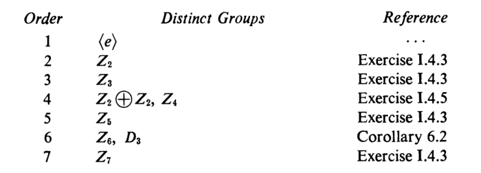
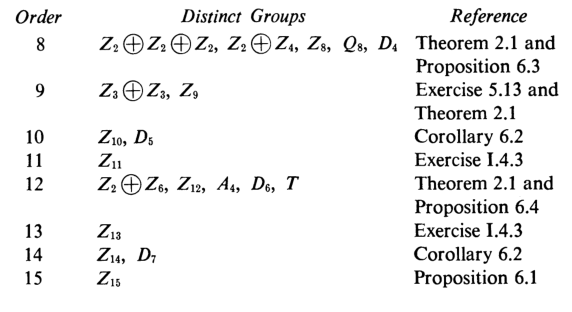

# 有限群的结构

## 群作用

### 轨道等价

- **群 $G$ 在集合上 $S$ 的作用**：
  - 映射 $G\times S\to S，(g,x)\mapsto gx$
  - 满足 $\forall x\in S，g_1,g_2\in G$
    - $ex=x$ （幺元） 
    - $(g_1g_2)x = g_1(g_2x)$（结合律）
    - 还暗含着运算的封闭性：$gx\in S$
- **群作用于集合**：存在一个作用
  - **实例**
    - **对称群** $S_n$ 作用于字典 $I_n = \{1,\cdots,n\}$
      - 群元素本身是映射：$(\sigma,x)\mapsto \sigma(x)$
    - **左平移**：群 $H<G$，$H$ 作用于 $G$
      - 集合本身是群元素（左乘映射）：$(h,x)\mapsto hx$
    - **左陪集平移**：群 $H,K<G$，$S$ 是 $K$ 的所有左陪集，$H$ 作用于 $S$
      - 集合本身是群元素（左乘映射）：$(h,xK)\mapsto hxK$
    - **共轭**：正规子群 $H\lhd G$，$H$ 作用于 $G$
      - 集合本身是群元素（共轭映射）：$(h,x)\mapsto hxh^{-1}$
- **（定理4.2）轨道存在性**：设群 $G$ 作用于 $S$
  - **$S$ 上 $G$ 诱导的轨道等价类 $\bar{x}$**：$x\sim x' \LR gx = x'$
  - **不动点集**：$S_0 = \set{x\in S\mid \forall g\in G，gx = x}$
  - **稳定子群/迷向子群/各向同性子群**：设 $x\in S$，则 $G_x = \{g\in G\mid gx = x\}\leq G$
    - **轨道公式**： $|\ol x| = [G:G_x]，|G_x| = \dfrac{|G|}{|Gx|}$
  - **证明**：
    - 封闭性：$(g_1g_2)x = g_1x = x$，故 $g_1g_2\in G_x$
    - 可逆性：$gx = x$，两边左乘 $g^{-1}$ 得 $x = g^{-1}x$，故 $g^{-1}\in G_x$
    - 结合律：由于 $G$ 是群，满足结合律，故 $g_1(g_2g_3) = (g_1g_2)g_3$，即 $G_x$ 也满足结合律
    - 轨道公式：
      - 用商群等价的思路，$G_x$ 相当于 $\ker G$，故商掉后的数量 $[G:G_x]$ 就是轨道等价类的个数
      - 而 $G$ 在 $x$ 上作用后，所有在 $x$ 上不动的 $g$ 均被合并为 $x$。也就是说，用商群阶公式的思路就可得第二式
  - **理解**：
    - $x$ 的稳定子群是所有使 $x$ 不动的置换
    <!-- - 由于 $g$ 就是 $S$ 上的置换，故看作轨道等价类也没有问题 -->
    - 不动点是不会被任何置换改变的集合元素（轨道上只有一个元素）
  - **本质**：轨道等价类 $\ol x$ 是集合 $S$ 上的，它不是子群。要想用群论去研究，需要构造其在 $G$ 上的对应（$G_x$ 的陪集分解）
  - **实例**：
    - 对称作用中，$S = \set{1,2,3,4}$
      - 稳定子群 $G_3 = \{(1),(12),(14),(24),(124),(142)\}$
      - $3$ 的轨道等价类为 $\{G_3\cdot x\mid x\in S\} = \{G_3\cdot 1234\}$
      - 不动点集为空
      - 稳定子群是所有不含该元素的置换，阶为 $(n-1)!$，故轨道等价类基数为 $n$
    - 左平移作用中
      - 稳定子群 $G_x = \lang e \rang\quad (\forall x\in G)$
      - 轨道等价类为 $G$ 全体
      - 不动点集为空
      - 由于幺元唯一性，稳定子群是平凡的
    - 左陪集作用中
      - 稳定子群 $\forall x = aK\pad (a\in G)，H_x = (aKa^{-1})\cap H$
      - 轨道等价类为 $S$ 全体（$G$ 中所有陪集）
      - 不动点集为 $N_G(K)$ 中的 $K$ 陪集
      - 稳定子群只需令陪集不变即可，故为陪集本身
      - 而
    - 共轭作用中
      - 稳定子群 $G_x = C_G(G) = C(G)\quad (\forall x\in G)$
      - 轨道等价类为共轭类
      - 不动点集为 $C(G)$
      - 稳定子群是中心
- **共轭类**：$\bar x = \{gxg^{-1}\mid g\in G\}$
  - **本质**：一种特殊的对称轨道
  - **实例**：
    - 交换群中，就是一般的等价类。（可以看作置换后再逆置换，本质没有变化）
      - 左平移作用下，$Z_p$ 中的同余类
    - 非交换群中，是两个方向的互逆置换，可能不处在同一个单向轨道
      - 左平移作用下，$GL_n(R)$ 中同一相似标准型下的所有矩阵
- **可迁作用/传递轨道**：$G$ 在 $S$ 上只有一个轨道（轨道等价类为 $S$ 全体）
- **群作用的核（作用同态的核）**：在 $S$ 所有元素上均稳定的 $g$ 构成的子群
- **忠实作用**：核为 $\lang e \rang$ 的群作用
- **（定理4.3）轨道公式**：若 $G$ 作用于 $S$，则 $x\in S$ 的轨道中元素数量为 $[G:G_x]$
  - **证明**：设 $g,h\in G$
    - 由于 $gx = hx \LR g^{-1}h\in G_x$
    - 设 $R$ 是 $G_x$ 的左陪集，则 $R\to \bar x，gG_x \mapsto gx$ 是双射，从而两边基数相等
  - **本质**：轨道等价类可看作类商群，稳定子群即为等价集，从而轨道阶数即为稳定子群指数
- **（推论4.4）[共轭数量公式](./1.群的概念.md)**
- **（定理4.5）作用同态**：若 $G$ 作用于 $S$，则其存在与 $S$ 置换群的同态 $\tau:G\to A(S)$
  - **证明**：
    - 对于 $g\in G$，设 $\tau_g : S\to S，x\mapsto gx$，易得其为双射，从而是置换。所有不同的 $\tau_g$ 可组成置换群 $A(S)$
    - 再易得 $\tau_{gg'} = \tau_g\tau_{g'}$，从而映射 $\tau:g\mapsto \tau_g$ 是同态，称为**作用同态**
  - **本质**：群作用都可看作对称作用的子集（$S$ 的置换群）
    - 群元素到其对应作用的映射即为作用同态
    - 稳定子群即为不包含元素 $x$ 的置换，作用同态的核为 $\mathop{\bigcap}\limits_{x\in S} G_x$
    - 有些在置换意义下等价的元素，在群作用意义下不等价。此时作用同态不为单射（比如后面的[共轭作用同态]()）
- **（推论4.6）Cayley**：任意群均存在一个作用单同态
  - **证明**：
    - **存在性**：设 $G$ 左平移作用于其本身，由作用同态定理，存在 $\tau:G\to A(G)$
    - **单射性**：若 $\tau(g) = \tau_g = 1_G$，易得只能是 $g=e$，从而是单同态
  - **本质**：群中的运算可以看作是一种置换，且任何元素的稳定子群均只有幺元
  - **推论（有限群均存在置换表示）**：有限群均作用同构于 $S_n\pad (n = |G|)$

#### 小总结

- 不动点 $S_0$ 是 $S$ 的子集，表示任何 $g$（或 $\tau_g$）作用下均不动的点
- 稳定子群 $G_x$ 是 $G$ 的子群，表示某个 $x$ 上不动的 $g$（或 $\tau_g$）
- 作用核 $\ker\tau = \bigcap G_x$ 是 $G$ 的正规子群，表示任何 $x$ 上均不动的作用
- 显然三者完全不是一回事，要分开讨论

### 习题

- **稳定子群共轭性**：$\forall a,b\in S$，若 $ga = b$，则 $G_a = g^{-1}G_bg$
  - **证明**：由定义 $G_aa = a$，且 $(g^{-1}G_bg)a = g^{-1}b = a$，由消去律即得结论
- 设 $G$ 在 $S$ 上的作用可迁，$N\lhd G$，则 $N$ 的陪集作用的轨道基数均相等
  - **证明**：设 $S = Ga$
    - 任取 $x = ga$，若 $nga = ga$，则 $(g^{-1}ng)a = a$
      - 从而 $N_x = \set{n\in N\mid g^{-1}ng\in G_a} = N\cap (gG_ag^{-1})$
    - 再由[等度平移](./1.群的概念.md) 得 $N_x = g(N\cap G_a)g^{-1} = gN_ag^{-1}$
    - 故 $|Nx| = \dfrac{|N|}{|N_x|} = \dfrac{|N|}{|N_a|} = |Na|$，由 $x$ 任意性即得结论
- **稳定点集**：$S^g = \{s\in S\mid gs = s\}$
  - **平面公式**：$\sum\limits_{s\in S}|G_s| = \sum\limits_{g\in G} |S^g| = |A|$
    - 其中 $A = \{(g,s)\in G\times S\mid gs = s\}$
- **BurnSide公式**：轨道个数 $t = \dfrac{|A|}{|G|}$
  - **证明**：$|A| = \sum\limits_{x\in S} |G_x| = \sum\limits_{x\in S} \dfrac{|G|}{|Gx|} = \sum\limits^t_{i=1}\sum\limits_{x\in Gx_i} \dfrac{|G|}{|G_x|} = \sum\limits^t_{i=1} |G| = t|G|$

#### 例子

- **正 $n$ 边形的置换群**：二面体群 $D_n$
  - 绕中心旋转：$a = (123...n)$，其中 $a^k$ 为 $\dfrac{2k\pi}{n}$ 度旋转
  - 对称变换：$b = \prod\limits_{2\leq i\leq ?} (i, n-i+2)$
- **正多面体的置换群**：三维空间中，仅有 $4,6,8,12,20$ 五种正多面体
  - **顶点、棱、面数量** $(v,e,f)$ 分别为 $(4,6,4),(8,12,6),(6,12,8),(20,30,12),(12,30,20)$
    - **证明**：欧拉公式
  - **轨道公式**：设 $V$ 是顶点集，$G_1$ 是顶点 $1$ 的稳定子群，则 $|G| = |V|\cdot|G_1|$
  - **旋转群**：
    - **正四面体**：$G_1$ 是正三角形旋转群
    - **正六面体**：$G_1$ 是正三角形旋转群
    - **正八面体**：$G_1$ 是正方形旋转群
    - **正十二面体**：$G_1$ 是正三角形旋转群
    - **正二十面体**：$G_1$ 是正五边形旋转群
  - **对称群**：
    - **正四面体**：$G_1$ 是正三角形对称群
    - **正六面体**：$G_1$ 是正三角形对称群
    - **正八面体**：$G_1$ 是正方形对称群
    - **正十二面体**：$G_1$ 是正三角形对称群
    - **正二十面体**：$G_1$ 是正五边形对称群

### 自同构

- **自同构群**：$G$ 的所有自同构组成的群 $\Aut G$，其上运算为映射复合
  - **置换性**：在左平移作用下，其为 $G$ 自身的置换群
- **（推论4.7）共轭的作用同态**：
  - **共轭同构性**：群 $G$ 中每个元素 $g$ 均可通过共轭诱导一个自同构 $\tau_g$
  - **作用同态**：存在同态 $\tau: G\to \Aut G$ 满足 $\ker\tau = C(G)$
  - **证明**：
    - 若 $G$ 共轭作用于其本身，则 $\tau_g:G\to G，x\mapsto gxg^{-1}$ 是双射，易得其也是自同构
    - 再由 $g$ 任意性，易得 $\tau:G\to \Aut G，g\mapsto\tau_g$ 是同态
    - 再易得 $g\in \ker\tau \LR \tau_g = 1_G \LR \forall x\in G，gxg^{-1} = x \LR g\in C(G)$，故 $\ker\tau = C(G)$
  - **本质**：共轭是作用同构
  - **推论**：[共轭形式轨道方程](./1.群的概念)的第二写法
    - $|G| = |C(G)| + \sum\limits^m_{i=1} [G:C_G(x_i)]$，其中 $\{x_i\}^m_{i=1}$ 是中心外部互不相同的共轭类
    - **本质**：群的中心是共轭不动点集
      - 正规子群是共轭封闭群，即任何轨道都必定含于某个正规子群。
        <!-- - 弱内直积本身也是用共轭将群分解成独立的部分。 -->
        - 后面也用这个性质对群关于（素幂阶正规子群）进行轨道分解
- **（命题4.8）陪集的作用同态**：
  - 设 $H<G$，$S$ 是所有 $H$ 的左陪集，$G$ 通过左平移作用于 $S$
  - 则 $\ker \tau \subset H$
  - **证明**：
    - 此时 $\tau:G\to A(S)，g\mapsto \tau_g$，且 $\tau_g(x) = gxH\quad (\forall x\in G)$
    - 若 $g\in \ker\tau$，则 $gxH = xH\pad (\forall x\in G)$
    - 由 $x$ 任意性，可令 $x=e$，得 $gH = H$，从而 $g\in H$。再由 $g$ 任意性即得 $\ker \tau \subset H$
  - **理解**：和推论结合才有用处，事实上本来就应该把它们合成一个定理的几部分……
  - **本质**：$\ker\tau = \mathop{\bigcap}\limits_{g\in G} gHg^{-1}$
- **（推论4.9）陪集作用的同构条件**：
  - 若 $G$ 中存在子群 $H$，使得 $H$ 中不存在 $G$ 的正规子群，且 $[G:H] = n<\infty$
  - 则 $G$ 同构于 $S_n$ 的子群
  - **证明**：由陪集上作用的性质，$\ker\tau \subset H$
    - 再由核必定是正规子群，得只能是 $\ker\tau = \lang e \rang$，从而 $\tau$ 是单同态
    - 而将单同态的像限制在值域 $A(S)$ 中时，即变为同构 $G\cong A(S)$
  - **理解**：找出 $H$ 的陪集作用同态，由无正规子群性得其为单同态，从而进化为同构
    - （本质是陪集作用同态的单射条件）
  - **实例**：
    - 二面体群 $D_n$ 中存在指数为 $n$ 的二阶子群 $\lang b \rang$，故 $D_n$ 均可写成 $S_n$ 置换形式
      - 且 $|D_n| = 2n，|S_n| = n!$，故同构于真子群
  - **反例**：不可写成置换形式的群
- **（推论4.10）最小 $p$ 群正规性**：
  - 设 $H$ 是有限群 $G$ 的指数为 $p$ 的子群，其中 $p$ 是 $|G|$ 的最小素因子，
  - 则 $H$ 是正规子群（实际上是 $H$ 左陪集作用下的 $\ker \tau$）
  - **证明**：设 $L$ 是 $H$ 的左陪集族，则 $|L| = p$。再由Cayley定理，陪域 $S(L)\cong S_p$
    - 设 $K = \ker\tau\subset H$
    - 由于 $K\lhd G$，故 $G/K$ 中商去了所有 $H$ 中的 $G$ 正规子群，满足作用同构条件
      - 即 $G/K$ 同构于 $S_p$ 的子群，从而 $|G/K| = [G:K]$ 整除 $ |S_p| = p!$
    - 再已知 $|G| = |K|[G:K]$，由于 $p$ 是 $|G|$ 的最小因子，得 $[G:K]$ 只能是 $1$ 或 $p$
      - 再由 $[G:K] = [G:H][H:K] = p[H:K]$，得 $[H:K] = 1$，从而 $H = K \lhd G$
  - **本质**：感觉是把西罗定理章节的东西搬到前面来了
  - **推论（最小阶正规子群中心性）**：设 $p$ 是 $|G|$ 最小素因子，若正规子群 $A$ 的阶为 $p$，则 $A\leq C(G)$
    - **证明**：设共轭作用同态 $\tau:G\to S_p$
      - 此时 $\tau(G) \subset \Aut A = \Z_{p-1}$，且 $\ker\tau = C_G(A)$
      - 则 $|G/C_G(A)| = |\Im p|$，其整除 $p-1$
      - 但 $|G/C_G(A)|$ 整除 $|G|$，故由 $p$ 最小性得只能是 $|G/C_G(A)| = 1$，从而 $C_G(A) = G$，即 $A\leq C(G)$

### 习题

- **自同构群实例**：
  - $\Aut \Z\cong Z_2$
    - 恒等同构和取反同构（三倍同构 $1\mapsto 3 = -1 = 1$）
  - $\Aut Z_6 \cong Z_2$
    - 恒等同构和取反同构（五倍同构）（三倍同构的结果只有 $0$ 和 $3$）
  - $\Aut Z_8\cong Z_2\oplus Z_2$
    - 恒等同构、取反同构、三倍同构、五倍同构（七倍同构就是取反同构）
- **同余类的自同构群**：同余类的自同构就是（缩系元素的倍数映射 $\p(g) = pg$）。再由素数同余类缩系为 $p-1$ 个，故有上述结论
  - $\Aut Z_n$ 同构于其缩系生成的乘法群
    - **证明**：首先，由之前结论，同构只能写成倍数形式（[整数加法群的自同构](./1.群的概念)）
      - 若倍数 $k$ 不是缩系，即存在 $mk = n$，则由于 $m\in Z_n$，故 $\sigma(m)=  km = n = 0$，但 $\sigma(n) = 0$，非单射，故倍数不能是缩系
      - 再易得缩系倍数映射是双射（**证毕**）
  - $\Aut Z_p\cong Z_{p-1}$
    - **证明**：推论而已
- **内部自同构**：设 $\In G$ 是内部自同构群（共轭作用的群），则 $\In G \lhd \Aut G$
  - **证明**：只需 $\sigma^{-1}\tau\sigma$ 也是共轭即可
    - 任取 $a\in G$，设 $\sigma(a) = b，\tau(a) = g^{-1}ag，\sigma(g) = h$
    - 则 $\sigma\tau\sigma^{-1}(b) = \sigma(g^{-1}ag) = \sigma(g^{-1})\sigma(a)\sigma(g) = h^{-1}ah$，也是 $a$ 的共轭类（**证毕**）
  - **本质**：自同构保共轭性
  - **实例**：$C(S_4) = \lang e \rang$，从而同构于 $\In S_4$
  - **反例**：$Z_n$ 中，恒等映射是内部自同构，但缩系倍数映射不是内部自同构
- 若 $G$ 中存在元素 $|a| > 2$，则存在非平凡自同构
  - **证明**：
    - 若是非阿贝尔群，则取 $g\notin C(G)$，此时共轭作用同态 $\tau_g$ 即为自同构
    - 若是阿贝尔群，则取 $x\mapsto x^{-1}$ 即可
  - **理解**：
- **商群与自同构**
  - **中心商群同构于内部自同构群**：$G/C(G)\cong \In G$
    - **证明**：定义即可
    - **理解**：把中心（共轭映射的核）商掉之后，剩下的就是双射共轭了
  - **推论**：若 $G/C(G)$ 是循环群，则 $G$ 是阿贝尔群
    - **证明**：此时 $\forall g\in G，\exists a,m$ 使得 $g\in a^mC(G)$
      - 则 $gh = (a^mc_1)(a^nc_2) = a^{m+n}c_1c_2 = (a^nc_2)(a^mc_1) = hg$
    - **理解**：循环群和中心都具有交换性，证明是显然的
  - **反例**：非阿贝尔群的自同构群不是循环群
    - **证明**：
  - **自同构定理**：若 $N\lhd G$，则 $G/C(G)\cong \In G\cong \Aut N$
    - **证明**：前面章节已证，本质就是正规子群的共轭不变性，从而共轭在其上是自同构（[第一章内容](./1.群的概念.md)）
    - 这个定理非常重要，触及到自同构的本质
  - **推论**：设 $H\leq G$，则 $N_G(H)/C_G(H) \cong \Aut H$
    - **证明**：正规化子本质 + 自同构定理直得
  - **推论**：设 $A\leq G$ 是正规阿贝尔子群，则 $G/A$ 共轭作用于 $A$，且存在作用同态 $G/A\to \Aut A$
    - **证明**：易得 $(gA)A(gA)^{-1} = A$，故是共轭
      - 再由 $G = N_G(A)，A\leq C_G(A)$，沿用上个结论即得作用同态存在性
<!-- - **正规化子的本质**：设 $H,K\leq G$，若 $H\lhd K$，则 $K\leq N_G(H)$
  - **证明**：定义直得 -->
- **共轭轨道性推论**：若 $G$ 中某元素 $a$ 正好存在两个共轭元素，则 $G$ 存在非平凡正规子群
  - **证明**：设 $a = g_1bg_1^{-1} = g_2cg_2^{-1}$，即此时必定存在 $g_3$ 满足 $b\xto{g_1} a\xto{g_2^{-1}}c\xto{g_3}b$
    - 仅两个共轭元素，即共轭类只有三个元素，构成一个三元对称环轨
    - 则 $\lang e,a,b,c \rang$ 是正规子群，否则存在 $g_4ag_4^{-1} = d$ 满足 $g_4\notin \lang g_1,g_2,g_3 \rang，d \notin \lang a,b,c \rang$，此时 $d$ 即为新共轭类元素，与仅两个共轭元素矛盾
  - **本质**：
<!-- - 中心化子是正规化子的子群
  - **证明**： -->
- **作用同态的像与核**：设 $H<G$，若 $[G:H]<\infty$，则存在 $N\lhd G$ 满足 $[G:N]<\infty$
  - **证明**：设 $R$ 为 $H$ 的全体左陪集，左陪集作用可诱导作用同态 $\phi:G\to A(R)$
    - 由于是真子群，故 $\ker\phi \neq G$
    - 再由像核对偶性，$G/\ker\phi\cong \Im\phi\subset A(R)$（**核心**）
      - 从而 $|G/\ker\phi| = [G:\ker\phi] < |A(R)| =  [G:H]$，再由 $H$ 指数有限性，得 $\ker\phi$ 是指数有限的正规子群
  - **本质**：若存在指数有限的子群，则其诱导的陪集作用同态的像有限，从而核的指数有限
  - **推论**：若还有 $|G|>n!$，则 $G$ 不是单群
    - **证明**：此时 $G\leq G$ 无法同构于 $S_n$ 的子群
  - **反例**：一般线性群 $GL_n(\C)$ 不存在指数有限的真子群，从而无有限指数正规子群
    - **证明**：反设 $[G:H] = m$
      - 设左陪集作用同态 $\tau:G\to S_m$，则 $|G/\ker\tau| = s\mid m$
        - 则此时 $\forall B\in G$ 有 $B^s\in\ker\tau$
      - 再由[线代结论](../高等代数（李）/7.Jordan（有理）标准型.md)，$\forall t\in\N^+，\exists B$ 使得 $A = B^t$
        - 从而 $\ker\tau = H = G$，矛盾

#### 后面章节的推论

- 设 $H\leq G$，若 $|G| = pn，p>n，|H| = p$，则 $H\lhd G$
  - **证明**：
- 若 $|N| = p$ 是 $|G| = p^n$ 的正规子群，则 $N\in C(G)$
  - **证明**：
- 设 $|G| = 2^nm$，$m$ 是奇数。若存在 $|a| = 2^n$，则存在正规子群 $N$ 满足 $[G:N] = 2^n$
  - **证明**：对 $n$ 归纳
    - $n=1$ 时，取左陪集作用 $\tau$
      - 设 $2$ 阶元素为 $g$，由同态阶缩小性，$|\tau(g)| = 2$，只能是对换的积
      - 再由于左陪集作用是传递轨道，$|G| = 2m$，故 $\tau(g)$ 是 $2m$ 个对换的积
      - 再由 $m$ 是奇数，得 $\tau(g)$ 是奇置换
      - 有奇置换的群必定存在偶置换，故此时 $A_{2m}$ 就是 $N$
    - $n-1$ 均成立时同理
  - **推论**：若 $|G| = 4k+2\pad (k\geq 2)$，则 $G$ 不是单群
    - **证明**：此时 $n=1，m=2k+1$ 是奇数，故存在二分正规子群 $[G:N] = 2$
- 设 $\sigma\in\Aut G$，若其保共轭，则 $|\sigma|$ 的素因子均为 $|G|$ 的因子（但素幂因子不一定，故得不到整除关系）
  - **证明**：设 $|\sigma| = pm$，则 $|\sigma^m| = p$，由保共轭性，可设 $|\sigma| = p$
    - 只需证存在不含 $\sigma$ 不动点的共轭类 $\ol x$
      - 反设均有不动点，设不动点全体的子群为 $H$
      - 由于 $|\sigma| = p$，故 $H\neq G$，从而 $H$ 的共轭子群覆盖 $G$，矛盾
    - 易得此时 $\ol x$ 也不含 $\sigma^k$ 的不动点
      - 任取 $a\in\ol x$，设 $\lang \sigma \rang$ 在 $\ol x$ 上的对称作用为 $\tau$
      - 由于 $a$ 不是不动点，故 $\lang \sigma \rang_a = \{1\}$
      - 从而 $|\lang \sigma \rang_a|= \dfrac{|\lang \sigma \rang|}{|\lang \sigma \rang_a|} = |\lang \sigma \rang| = p$
    - 因为 $\ol x = \mathop{\bigcup}\limits_{a} \lang \sigma \rang a$，故 $p$ 整除 $|\ol x|$ 整除 $|G|$

#### 例子

- $S_3 \cong \Aut S_3$
  - **证明**：设 $S = \set{A_1,A_2,A_3}$ 是 $S_3$ 的对换群全集
    - 设 $\tau$ 是 $S$ 的对称作用，则 $\ker\tau = \set{\sigma\mid \sigma(A_i) = A_i} = \{(1)\}$，从而 $\Aut S_3\leq S_3$
    - 再由 $\In S_3\cong S_3/C(S_3) = S_3$ 即得 $\Aut S_3\cong S_3$

## 有限群的素数分解

- 本节分析素数阶性质的群。在这里，素数的单元性为群的分解提供了强大的助力，简化了很多复杂的轨道，强化了很多阶的性质
- 因此，我们希望用素数阶子群的轨道等价类来分解整个群
  - 其中 $p$ 群是结构很好的群，我们希望用它来陪集分解整个群。
  - 而陪集作用和共轭作用是分不开的，所以要研究 $p$ 群的正规化子，从而有了西罗定理

### 素阶群

- **（引理5.1） $p$ 群不动点引理**：
  - 若 $p^n$ 阶群 $H$ 作用于有限集合 $S$
  - 设 $S_0 = \{x\in S\mid \forall h\in H，hx = x\}$
    - 不动点集合（它不是 $\ker\tau\subset H$）
  - 则 $|S|\equiv |S_0| \pmod p$
  - **证明**：已知轨道 $\bar{x}$ 只有一个元素 $\LR x\in S_0$
    - 从而存在不交并分解 $S  = S_0 \cup \bar{x}_1 \cup \cdots \cup \bar{x}_n\quad (|\bar{x}_i| > 1)$
    - 故 $|S| = |S_0| + \sum\limits^n_{i=1} |\bar{x}_i|$
    - 再由 $|H| = p^n$，得 $|\bar x_i| = [H:H_{x_i}]$ 整除 $p^n$。再由非平凡性，其只能是 $p$ 的倍数，从而由轨道方程即得题设同余式成立
  - **理解**：将 $S$ 用轨道等价类分拆。再由轨道公式，将轨道等价类基数和稳定子群联系起来。再由 $H$ 是素幂群，子群阶数只能为素幂，故轨道等价类基数是 $p$ 的倍数，即全集 $S$ 和不动点集 $S_0$ 构成模 $p$ 同余关系
  - **本质**：此时 $S$ 可被素幂集合（轨道等价类）分拆
- **（定理5.2）Cauchy阶定理**：若 $G$ 是阶数为 $p$ 倍数的有限群，则 $G$ 包含一个 $p$ 阶元素
  - **证明**：$|G| = n = mp$
    - 设 $S = \set{(a_1,...,a_p)\mid a_i\in G，a_1\cdots a_p = e}$
      - 则 $a_p = (a_1\cdots a_{p-1})^{-1}$，即只有一个元素被约束，从而 $|S| = n^{p-1}$
      - $p$ 阶线性方程组的解空间，自由度为 $p-1$
    - 设 $Z_p$ 轮换作用于 $S$，$k(a_1,...,a_p) = (a_{k+1},...,a_p,a_1,...,a_k)\pad (k\in Z_p)$
      - 轮换运算：$0x = x，(k+k')x = k(k'x)$
      - 易得 $(a_1,...,a_p) \in S_0 \LR a_1 = ... = a_p$
        - 易得 $(e,...,e)\in S_0$，从而 $S_0$ 非空
    - 再由 $Z_p$ 是 $p$ 阶群， $p$ 群不动点引理 + 费马定理得 $|S_0| \equiv |S| \equiv 0 \pmod p$，即 $S_0$ 中至少存在 $p$ 个元素
      - 即存在 $a\neq e$ 使得 $(a,...,a) \in S_0$，从而由 $S$ 定义得 $a^p = e$
      - 再由 $p$ 是素数 + 阶的整除性，即得 $|a| = p$
  - **本质**：通过轮换作用，将群阶数和元素阶数联系起来
    - 素数 $p$ 的作用是得到更强的联系（相等），若替换为合数则只能得到整除关系，没啥用
  - **应用**：$6$ 阶群里必有 $3$ 阶元素，不存在元素阶只有 $1,2$ 的 $6$ 阶群

### 素阶元素群

- **$p$ 群**：每个元素的阶均为素数 $p$ 的幂的群
  - **遗传性**：易得 $p$ 群的子群也是 $p$ 群
  - **商传递性**：由 $p$ 群阶定理易得 $p$ 群的商群均为 $p$ 群
- **$G$ 的 $p$ 子群 $H$**：只需 $H\leq G$，且为 $p$ 群
  - **实例**：对 $\forall G,p$，$\lang e \rang$ 是 $G$ 的 $p$ 群
- **（推论5.3）$p$ 群阶定理**：有限群 $G$ 是 $p$ 群 $\LR |G|$ 是 $p$ 的幂
  - **证明**：
    - **必要性**：反设还存在素数 $q$ 整除 $|G|$
      - 由柯西阶定理，存在 $q$ 阶元素 $g\in G$
      - 再由 $G$ 是p群 + 阶的整除性，得 $q=p$，故 $|G|$ 只能是 $p$ 的幂
    - **充分性**：拉格朗日定理直得
  - **理解**：群均由其中元素生成，而 $p$ 群内部的所有元素等阶，故性质传递到整个群的阶上
  - **本质**：群均可分为左平移作用的轨道不交并，轨道公式将元素阶与群的阶联系到一起
- **（推论5.4）中心非平凡性**：非平凡有限 $p$ 群 $G$ 的中心 $C(G)$ 有不止一个元素
  - **证明**：
    - $p$ 群的轨道方程中，$p$ 整除所有 $[G:C_G(x_i)]$ 和 $|G|$，从而整除 $|C(G)|$ 
    - 再由 $|C(G)|>0$，得 $C(G)$ 至少有 $p$ 个元素
  - **理解**：元素均为 $p$ 阶其实是一个很强的性质，因为素数与非平凡性天然是契合的。这几个定理都是在将它如何从每个元素推广到各个特殊子群与整个群
  - **本质**：共轭作用下，轨道方程的推论（共轭不动点集合非平凡）
- **（引理5.5）正规化子引理**：若 $H$ 是有限群 $G$ 的 $p$ 子群，则 $[N_G(H):H] \equiv [G:H] \pmod p$
  - **证明**：设 $S$ 是 $H$ 的左陪集全集，$H$ 左平移作用于 $S$（自身到自身的左陪集平移）
    - 则 $|S| = [G:H]$
      - $xH\in S_0 \LR hxH = xH \LR x^{-1}hx\in H \LR xHx^{-1} = H = x^{-1}Hx \\ \LR x\in N_G(H)$
      - 即此时 $|S_0|$ 也是特殊陪集 $\{xH\mid x\in N_G(H)\}$ 的个数，$|S_0| = [N_G(H):H]$
      - 再综合 $p$ 群不动点引理的同余式，即得题设同余式
  - **理解**：H陪集上的左平移作用，本质就是左陪集分解
    - 此时 $H$ 的不动点集是（$N_G(H)$ 在 $H$ 下的陪集分解等价类），从而可将同余式应用到 $N_G(H)$ 上
  - **本质**：自身陪集作用下的 $p$ 群不动点引理（此时情况得到简化，正规化子对陪集族的作用结果就是不动点集）
    - 要不说引理和推论有区别呢，引理是新考虑一个陪集作用，并分析阶性质在其中的影响，而推论就只是将阶性质推广到特殊子群中而已
- **（推论5.6）正规化子非平凡条件**：若 $H$ 是有限群 $G$ 的 $p$ 子群，且 $p\mid [G:H]$，则 $N_G(H)\neq H$
  - **证明**：
    - 由正规化子引理，此时 $[N_G(H):H] \equiv [G:H] \equiv 0 \pmod p$，故不可能为1
  - **理解**：正规化子具有空隙性，也就是说，不动点集 $N_G(H):H$ 和全集 $G:H$ 之间的差距是以 $p$ 个 $H$（轨道等价类）为单位的。若 $G$ 是 $np$ 个 $H$，那 $N_G(H)$ 只能是 $kp$ 个 $H$，不可能是 $H$
  - **本质**：正规化子非平凡（陪集作用）和中心非平凡性（共轭作用）一样，都是素数导出的非平凡性
- **（定理5.7）第一西罗定理**：
  - 设 $G$ 的阶为 $p^n m\quad (n\in\N_+，p\in\P,(p,m)=1)$
  - 则 $G$ 包含阶为 $p^i\pad (\forall 1\leq i< n)$ 的子群，且该子群也是 $p^{i+1}$ 阶子群的正规子群
  - **归纳证明**：
    - **一阶情况**：由柯西阶定理，$\exist a\in G$，使得 $|a| = p$，易得此时 $|\lang a \rang| = p$
    - **$i$ 阶情况**：假设子群 $|H| = p^i$ 存在
  - **证明（父群存在性和子群正规性）**
    - 此时 $p\mid [G:H]$，由正规化子引理，$p\mid [N_G(H):H]$
      - 从而 $[N_G(H):H] > 1$，即 $H$ 是 $N_G(H)$ 的非平凡正规子群
    - 此时 $N_G(H)/H$ 的阶含有 $p$，由柯西阶定理，存在 $p$ 阶元素，即含有 $p$ 阶子群，可设为 $H_1/H$（商群的子群还是商群）
      - 而此时 $|H_1| = |H|\cdot|H_1/H| = p^{i+1}$，再由商群定义得 $H\lhd H_1$，从而 $H$ 即为当前所需的子群，而 $H_1$ 为下一步归纳的子群，最终 $H_{n-1}$ 即为 $p^n$ 阶子群
  - **理解**：核心是用柯西阶定理将群一步步剔除掉某个 $p$ 阶元素构成的循环子群，从而达到分解效果
    - 然后发现，每次剔除后，由于 $p$ 的素数单元性导出的群空隙，当前 $p^i$ 子群 $H$ 的正规化子总是比 $H$ 大 $kp$ 阶，故对每个幂 $i$ 均存在 $p^{i+1}$ 正规父群 $H_1$
  - **本质**：循环子群 $|\lang a \rang| = p$ 均为自身陪集作用下的轨道等价类，将其累加可得 $|\lang a_1,a_2,...,a_k \rang| = p^k$，故本质就是将 $G$ 的西罗 $p$ 子群轨道分解
    - 或者说，$G$ 的西罗 $p$ 子群是更小 $p$ 子群的不断累加，类似[同余类均可被素因子同余类累加得到](../数论/初等数论/2.同余.md)

### 西罗 $p$ 子群

- **西罗 $p$ 子群**：最大的 $p$ 子群，所有 $p$ 群的父群
- **（推论5.8）西罗推论**：
  - 设 $G$ 是同上的 $p^n m$ 阶群，$H$ 是其 $p$ 子群
  - 则 
    - $H$ 是西罗 $p$ 子群 $\LR |H| = p^n$
      - **证明**：必要性由第一西罗定理直得，充分性由 $p$ 群阶定理直得
    - $G$ 的西罗 $p$ 子群具有共轭封闭性
      - **证明**：共轭不改变阶数，由上个结论直得
      - 其实陪集分解也可，但为什么要用共轭呢？因为共轭所需的条件更强，体现的性质更明晰，当然用比较强的表述更好
    - $G$ 只有一个西罗 $p$ 子群 $P\LR$ 西罗 $p$ 子群 $P$ 是正规的
      - **证明**：共轭封闭性直得
  - **本质**：第一西罗定理中，对最大的 $p$ 子群性质的讨论
- **（定理5.9）第二西罗定理**：
  - 设 $H$ 是有限群 $G$ 的 $p$ 子群，$P$ 是 $G$ 的西罗 $p$ 子群
  - 则存在 $x\in G$ 满足 $H \leq xPx^{-1}$
  - **证明**：
    - 设 $H$ 左平移作用于 $P$ 的左陪集全集 $S$
    - 由 $p$ 群不动点引理，$|S_0|\equiv |S| = [G:P] \pmod p$
    - 再由西罗p子群最大性，$p\nmid [G:P]$，故 $|S_0|$ 非空，从而存在 $xP\in S_0$
      - 此时 $x^{-1}hxP = P \LR x^{-1}Hx\leq P \LR H \leq xPx^{-1}$
  - **理解**：由阶性质，不动点集非空，故存在 $P$ 的偏移集 $xP$ 在 $h$ 下不动。再由陪集平移性质，必定是 $H$ 和 $P$ 存在共轭关系
  - **本质**：前面第一章有个[共轭等价类的代表元系](1.群的概念.md)，说明了子群 $H$ 的共轭类不可能覆盖 $G$。而这里是证明了若 $P$ 是西罗 $p$ 子群，则其共轭类能覆盖 $p^nm$ 中的 $p^n$ 部分
  <!-- - **本质**：西罗 $p$ 子群可通过共轭覆盖 $G$（也就是说，西罗 $p$ 子群一定包含所有共轭不动点） -->
  - **推论**：任意两个西罗 $p$ 子群共轭
    - **证明**：若 $H$ 是西罗 $p$ 子群，则 $|H| = |P|$，由上式即得共轭关系
- **（定理5.10）第三西罗定理**：有限群 $G$ 的西罗 $p$ 子群数量为 $\dkh{kp+1}\Bigm | |G|\pad (k\in\N)$
  - **证明**：设 $P$ 是某个西罗 $p$ 子群
    - 由第二西罗定理，西罗 $p$ 子群的数量即为 $P$ 共轭类的阶数
    - 由共轭定理，共轭类阶数为 $[G:N_G(P)]$，其整除 $|G|$
    - 设 $S$ 是西罗 $p$ 子群全集，$P$ 共轭作用于 $S$
      - 则 $Q\in S_0 \LR xQx^{-1} = Q\pad (\forall x\in P) \LR P \leq N_G(Q)$
      - 已知 $Q\leq N_G(Q)$，则由 $p$ 子群的遗传性得 $P,Q$ 在 $N_G(Q)$ 中也是西罗 $p$ 子群
      - 再由第二西罗定理得 $P,Q$ 在 $N_G(Q)$ 中共轭，从而 $\exists g\in N_G(Q)$ 使得 $P = gQg^{-1}$，再由 $Q\lhd N_G(Q)$ 即得 $P = Q$
      - 由 $Q$ 任意性即得 $S_0 = \{P\}$，即 $|S_0| = 1$
    - 由 $p$ 群不动点引理，$|S| \equiv  |S_0| \pmod p$，从而 $|S| = kp+1$
  - **理解**：通过共轭类在彼此交换时等价，发现西罗 $p$ 子群集族 $S$ 在 $P$ 共轭作用下的不动点集只有 $P$ 本身，再使用 $p$ 群不动点引理即可
  - **本质**：$P$ 共轭作用下的 $p$ 群不动点引理
- **（定理5.11）正规化子不变性**：若 $P$ 是有限群 $G$ 的西罗 $p$ 子群，则 $N_G(N_G(P)) = N_G(P)$
  - **互包证明**：
    - 由正规化子扩大性，易得 $N_G(P) \leq N_G(N_G(P))$
    - 此时 $P\lhd N_G(P) = N$
      - 由交换性，$N$ 中不可能有 $P$ 的共轭类，则由第二西罗定理，$P$ 是 $N$ 中唯一的西罗 $p$ 子群
      - 从而 $x\in N_G(N) \red\Rt xNx^{-1} = N\red{\xto{P唯一性}} xPx^{-1} = P \red\Rt x\in N$
      - 从而 $N_G(N_G(P)) < N$
  - **理解**：$N_G(H)\LR H$ 的共轭轨道唯一
    - 故 $P$ 在 $N_G(P)$ 中轨道唯一，$N$ 也在 $N_G(N)$ 中轨道唯一。从而 $P$ 在 $N_G(N)$ 中也轨道唯一
    - 从而由等价性即得结论
  - **本质**：两个不同的子群间，某个西罗 $p$ 子群的轨道一定不同

### 小总结

- 经典轨道类：有限群均可分解为（稳定子群 + 轨道类）的形式
  - 若轨道类是共轭类，则具体为（中心 + 共轭类）形式
  - 若轨道类是左平移，则具体为（陪集正规化子 + 陪集）形式
- 然后套用p阶群性质定理分析即可

### 习题

- **sb题**：若 $N\lhd G$，且 $N,G/N$ 都是 $p$ 群，则 $G$ 也是 $p$ 群
  - **证明**：$|G| = |N|\cdot |G/N|$ 直得
- **第三西罗推论**：第三西罗定理可应用到任意 $p$ 群上
  - **证明**：设 $|G| = p^nm$，则由第一西罗定理，存在 $p^{n-1}m$ 阶子群 $H$，从而 $p^{n-1}$ 阶 $p$ 群在 $H$ 上是西罗 $p$ 子群，可应用第三西罗定理
- **Cauchy强化**：若 $p$ 是 $|G|$ 的素因子，则 $x^p=1$ 的元素数量为 $p$ 的倍数
  - **证明**：这些元素都在西罗 $p$ 子群中，从而也在某个 $p^k$ 阶子群中
    - 再由于 $a,a^2,...,a^{p-1}$ 的阶均为 $p$，且第三西罗推论得 $p^k$ 阶子群的数量均为 $kp+1$
    - 故阶为 $p$ 的元素总数为 $(kp+1)(p-1) = (kp+1)p-kp-1$ 个，加上 $e$ 就共有 $(kp+1)p-kp$ 个
- **中心非平凡的遗传性**：若 $G$ 是有限 $p$ 群，$H$ 是非平凡正规子群，则 $H\cap C(G) \neq \lang e \rang$
  - **证明**：取 $G$ 在 $H$ 上的共轭作用，只需证明不动点集 $S_0$ 非平凡
    - 由 $p$ 群不动点引理，$|S_0| \equiv |H| \pmod p$
    - 再由 $H$ 非平凡性，以及 $e\in S_0$ 非空性，得 $|S_0| = kp > 1$（**证毕**）
- **无限 $p$ 群分类**：设 $G$ 是无限 $p$ 群，则
  - 要么 $\forall n\in\N^+，G$ 都有 $p^n$ 阶的子群
  - 要么 $\exists m\in\N^+$，使得每个有限子群的阶均不超过 $p^m$
  - **证明**：若子群的阶不存在上限 $p^m$，则有限子群的阶一定可以表为 $p^nm$ 的形式。再由 $p$ 群遗传性，可在其上应用第一西罗定理，即得结论
  - **理解**：无聊的推论
- **同态缩小性**：设 $G$ 是有限群，$P$ 是正规西罗 $p$ 子群，$f:G\to G$ 是自同态，则 $f(P) \leq P$
  - **证明**：设 $|P| = p^n$
    - 由同态阶缩小性，$|f(P)|$ 只能是 $p^m\pad (m<n)$。由第一西罗定理，其含于某个西罗 $p$ 子群中。而由 $P$ 正规性得西罗 $p$ 子群只有一个，故 $f(P)\leq P$
- **西罗 $p$ 子群的交**：设 $G$ 是有限群，$|H| = p^k$ 是正规子群，则 $H$ 含于任何西罗 $p$ 子群中
  - **证明**：首先 $H$ 必定含于某西罗 $p$ 子群 $P$ 中
    - 再由西罗 $p$ 子群的共轭等价性，任取另一个 $Q = gPg^{-1}$，则由等度平移，$H = gHg^{-1} \leq Q$，由 $Q$ 任意性即得结论
  - **理解**：西罗 $p$ 子群相交于一个正规子群
- **西罗 $p$ 子群的并**：设 $G$ 是有限群，$N\lhd G$，若 $(p,|G/N|) = 1$，则 $N$ 包含 $G$ 所有西罗 $p$ 子群
  - **证明**：此时 $N$ 的西罗 $p$ 子群也是 $G$ 的。再由正规子群 $N$ 的共轭不变性，等度平移即得 $\forall g^{-1}Pg \leq g^{-1}Ng = N$
  - **理解**：由互素条件易得 $p^n$ 整除 $|N|$，从而结论直得
- **传递性**：设 $G$ 是有限群，$N\lhd G$，$P$ 是西罗 $p$ 子群
  - **遗传性**：$N\cap P$ 是 $N$ 的西罗 $p$ 子群
    - **证明**：陪集公式得 $[N:N\cap P] = [NP:P]$
  - **商传递性**：$(PN)/N$ 是 $G/N$ 的西罗 $p$ 子群
    - **证明**：$[G/N:(PN)/N] = [G:PN]$，其整除 $[G:P]$
  - **正规化子公式**：$\Big( N_G(P)N \Big)/N = N_{G/N}(PN/N)$（前面也有[正规化子传递性](2.群的映射.md)）
    - **证明**：已知 $\Big( N_G(P)N \Big)/N\subset N_{G/N}(PN/N)$，设右式为 $T/N$
      - 则 $tPt^{-1}\subset PN$，从而 $P,tPt^{-1}$ 均是 $PN$ 的西罗 $p$ 子群，则在 $PN$ 中共轭，从而 $t\in N_G(P)N$，即 $T\subset N_G(P)N$
- **直积情况**：设 $G$ 是有限群，若对任意素数 $p$，$G$ 中所有西罗 $p$ 子群均正规，则 $G$ 是西罗子群的直积
  - **证明**：设 $|G| = \prod\limits^n_{i=1} p_i^{s_i}$，由正规性得，每个 $p_i$ 对应的西罗 $p_i$ 子群只有一个，设为 $P_i$
    - **不相交性**：由于西罗 $p_i$ 子群中的元素阶均为 $p_i$ 的幂，故 $P_i$ 不可能相交
    - **覆盖性**：由于对每个 $p_i$，可将 $|G|$ 视为 $p_i^{s_i}m$。由第二西罗定理，其中的 $p_i^{s_i}$ 部分可被 $P_i$ 的共轭类（此时为 $P_i$ 本身）覆盖，归纳即得 $G$ 可被所有 $P_i$ 覆盖
    - 综上，此时 $G = \prod\limits^n_{i=1} P_i$
- **正规传递性**：设 $G$ 是有限群，$P$ 是其西罗 $p$ 子群，若 $N_G(P)\lhd G$，则 $P\lhd G$
  - **证明**：已知 $P$ 的共轭类均在 $N_G(P)$ 中，故 $P$ 只有一个共轭类，从而正规
- **Fratini推论**：设 $N\lhd G$，$P$ 是 $G$ 的西罗 $p$ 子群，则 $G = N\cdot N_G(P)$
  - **证明**：已知 $\forall g\in G，\exists n\in N$ 使得 $k^{-1}(g^{-1}Pg)k = P$，则 $gk\in N_G(P)$，从而 $g\in NN_G(P)$（**证毕**）
  - **理解**：本质就是西罗正规化子不变性。$P$ 是 $N$ 的西罗子群，而 $G$ 是 $N$ 的正规化子，而由于群在其正规化子中共轭不变，得 $P$ 也是正规化子的西罗子群
    - 故 $P$ 被 $G$ 中任意元素 $g$ 共轭偏移后，$N$ 中都有一个元素 $n$ 可将其再转回来，从而得到逆推关系
- 若 $|G| = p^nq$，其中两素数 $p>q$，则 $G$ 存在唯一的指数为 $q$ 的正规子群
  - **证明**：由柯西阶定理，必存在 $q$ 阶元素 $a$，从而存在 $q$ 阶子群 $\lang a \rang$，其为西罗 $q$ 子群，只需唯一性或正规性
    - 此时西罗 $p$ 子群的共轭类覆盖所有 $p^n$ 阶子群，而西罗 $q$ 子群的共轭类覆盖所有 $q$ 阶子群（？）
- 设 $G$ 是 $S$ 上置换群，$P$ 是西罗 $p$ 子群，$a\in S$
  - 若 $p^m$ 整除 $|Ga|$，则也整除 $|Pa|$
  - **证明**：此时稳定子群 $P_a = G_a\cap P$，由轨道公式得 $|Ga|\dfrac{|G_a|}{|G_a\cap P|} = \dfrac{|G|}{|G_a|}\dfrac{|G_a|}{|P_a|} = \dfrac{|G|}{|P_a|} = [G:P]|Pa|$
  - 再由 $p$ 与 $[G:P]$ 互素，即得结论
- 设 $P_1,...,P_t$ 是有限群 $G$ 的全部西罗 $p$ 子群
  - 若 $\forall 1\leq i\leq t，1\leq j\leq t，i\neq j$，均有 $[P_i:P_i\cap P_j] \geq p^r$
  - 则 $t\equiv 1\pmod{p^r}$
  - **证明**：
- 设 $G$ 是 $S$ 上置换群，$a\in S$，$P$ 是稳定子群 $G_a$ 的西罗 $p$ 子群，$\D$ 是 $Ga$ 在 $P$ 作用下的不动点集合，则 $N_G(P)$ 在 $\D$ 上的作用可迁
  - **证明**：

#### 例子

- **求西罗子群**
  - [解同余方程](../数论/初等数论/2.同余.md)，求出西罗 $p$ 子群个数
  - 挑选共轭轨道中共轭类数量，确定各阶元素数量
  - 写出不同的共轭类
- $S_3,S_4,S_5$ 中的西罗子群
  - 西罗 $2$ 子群：
    - $|S_3| = 6$，故西罗 $2$ 子群的阶为 $2$，个数 $(2k+1)\mid 6$，为 $3$
      - 有三种 $\set{(1),(12)}$，$\set{(1),(13)}$，$\set{(1),(23)}$
    - $|S_4| = 24$，故西罗 $2$ 子群的阶为 $8$，个数 $(2k+1)\mid 24$，为 $3$
      - $\set{(1),(13),(24),(12)(34),(13)(24),(14)(23),(1234),(1432)}$
      - $\set{(1),(12),(34),(12)(34),(13)(24),(14)(23),(1324),(1423)}$
      - $\set{(1),(14),(23),(12)(34),(13)(24),(14)(23),(1243),(1342)}$
    - $|S_5| = 120$，故西罗 $2$ 子群的阶为 $8$，个数 $(2k+1)\mid 120$，为 $15$
      - 有 $\set{(12),(13),(23)}$
  - 西罗 $3$ 子群
    - $|S_3| = 6$，故西罗 $3$ 子群的阶为 $3$，个数 $(3k+1)\mid 6$，为 $1$
      - 仅有 $\set{(1),(123),(132)}$
    - $|S_4| = 24$，故西罗 $3$ 子群的阶为 $3$，个数 $(3k+1)\mid 24$，为 $4$
      - $\lang (123) \rang，\lang (124) \rang，\lang (134) \rang，\lang (234) \rang$
    - $|S_5| = 120$，故西罗 $3$ 子群的阶为 $3$，个数 $(3k+1)\mid 120$，为 $10$
- $12，28，56，200$ 阶群均含有正规西罗 $p$ 子群，从而不是单群
  - **证明**：
    - $200 = 2^3\cdot 5^2$，西罗 $5$ 子群的阶数为 $25$，个数 $(5k+1)\mid 8$，为 $1$，从而 $25$ 阶子群是正规西罗 $5$ 子群
- $24,36,48$ 阶群均不是单群
  - **证明**：
    - $|G| = 2^3\cdot 3$，设西罗 $2$ 子群非正规，则个数 $(2k+1)\mid 24$ 得为 $3$
      - 取共轭作用 $\tau:G\to S_3$，由阶数得不可能是单射，由共轭类不可覆盖全集得不是满射，从而 $\ker\tau$ 是非平凡正规子群，从而 $G$ 不是单群
- $168$ 阶单群中的 $7$ 阶元素数量
- $S_4\cong \Aut S_4$
  - **证明**：
- 6阶非交换群只有 $S_3$
  - **证明**：此时 $|G| = 2\cdot 3$，故可化为正规子群的直积 $\lang a \rang\times \lang b \rang$
    - 由不可交换性，$a,b$ 不可交换，则 $aba^{-1} = b^2$，验证即得同构
- 恰有三个共轭类的有限非交换群
  - **解**：设共轭类阶为 $1\leq m\leq n$，则 $|G| = 1+m+n$
    - 首先，$m\neq n$，否则 $m\mid |G| = 2m+1$，即 $m=1$，与非交换矛盾
    - 再由 $n\mid 1+m+n$ 得 $n = m+1$，从而 $m\mid 2m+2$，则 $m=2$，$|G| = 6$，从而 $G\cong S_3\cong D_3$
- 若 $G$ 是24阶群，中心平凡，则 $G\cong S_4$
  - **证明**：

#### 小总结

- 利用有限群的阶 $|G|$ 的唯一分解，可将其分解为一些重叠的西罗 $p$ 子群，每个西罗 $p$ 子群的结构简单，且可分解为更小的 $p$ 群

## 小阶群的结构

- **（命题6.1）$pq$ 阶群**：设素数 $p>q$
  - 若 $q\nmid p-1$，则 $pq$ 阶群均同构于 $Z_{pq}$
  - 若 $q\mid p-1$，则 $pq$ 阶群只有两种同构：
    - 循环群 $Z_{pq}$
    - 非阿贝尔群 $K$
      - 由 $p,q$ 阶元素 $c,d$ 生成
      - 满足 $dc = c^sd$，其中 $\begin{cases} s\not\equiv 1\pmod p \\ s^q\equiv 1 \pmod p  \end{cases}$
  - **证明**：由柯西阶定理，存在 $|a| = p，|b| = q$，则 $S = \lang a \rang$ 是正规子群，从而 $G/S = \lang bS \rang$，即 $G = \lang a,b \rang$
    - 此时西罗 $q$ 子群的数量 $(kq+1)\mid pq$，只能是 $1或p$
    - 当 $q\nmid p-1$ 时，只能是 $1$，则 $\lang b \rang$ 也是正规子群，构成弱内直积，从而 $G\cong Z_{pq}$
    - 当 $q\mid p-q$ 时，只能是 $p$。由正规性，$bab^{-1} = a^r$，再由于此时西罗 $p$ 子群不唯一，得 $G$ 不是交换群，从而 $r\not\equiv 1\pmod p$
      - 此时 $b^qab^{-q} = a^{rq} = a$，从而 $r^q\equiv 1\pmod p$
- **（推论6.2）$2p$ 阶群**：若 $p$ 是奇素数，则 $2p$ 阶群同构于 $Z_{2p}$ 或 二面体群 $D_p$
  - **证明**：此时 $q = 2$，故 $q\mid p-1$
    - 由上面结论，此时非交换群 $K$ 为 $\lang a,b \mid a^p = b^2 = e，ba = a^{p-1}b \rang$，显然是二面体群
- **（命题6.3）8阶群**：只有2种非阿贝尔8阶群：四元数群 $Q_8$ 或 二面体群 $D_4$
  - **证明**：
    - 首先，根据 $2$ 阶元素的数量，易得 $D_4 \not\cong Q_8$
    - 再易得 $G$ 中不可能只有 $2$ 阶元素
    - 也就是说，$G$ 必定包含 $4$ 阶元素 $a$。由第三西罗定理易得 $\lang a \rang$ 为正规西罗 $2$ 子群
    - 设 $b\notin \lang a \rang$，则由 $|G/\lang a \rang|=2$ 得必定有 $b^2\in \lang a \rang$
      - 若 $b^2 = a^3$，由 $\lang a \rang\lhd G$ 得 $bab^{-1}\in \lang a \rang$，易得只能是 $bab^{-1} = a^3$，则所有元素都有 $b^ia^j$ 的形式，即 $G = \lang a,b \rang$
      - 若 $b^2 = a^2$，则 $G = \lang a,b\mid |a| = 4，b^2 = a^2，ba = a^{-1}b \rang$，此时其为 $Q_8$
      - 若 $b^2 = e$，则 $G = \lang a,b\mid |a| = 4，|b| = 2，ba = a^{-1}b \rang$，此时其为 $D_4$
- **（命题6.4）12阶群**：只有3种非阿贝尔12阶群：
  - 二面体群 $D_6$
  - 交错群 $A_4$
  - 非阿贝尔群 $T = \lang a,b \rang$
    - $\begin{cases} |a| = 6 \\ b^2 = a^3 \\ ba = a^{-1}b \end{cases}$
  - **证明**：设 $P$ 是西罗 $3$ 子群，则 $|P| = 3$，$[G:P] = 4$。由陪集的作用同态得，存在 $P$ 的陪集作用同态 $\p:G\to S_4$，其核为 $K\leq P$，即 $K = P$ 或 $\lang e \rang$
    - 若 $K = \lang e \rang$，则 $\p$ 是单同态，从而 $G$ 同构于 $S_4$ 的子群，易得只能是 $A_4$
    - 若 $K = P$，且 $P$ 是正规西罗子群，从而 $G$ 只有两个 $3$ 阶元素。
      - 设 $c$ 是3阶元素，则由第二西罗定理，其共轭类也是三阶元素，数量为 $[G:C_G(c)] = 1$ 或 $2$
      - 再由于 $C_G(c)$ 只能是6阶或12阶群，故由Cauchy阶定理，存在 $2$ 阶元素 $d\in C_G(c)$，
      - 设 $a = cd$，则 $|a| = 6$，即 $\lang a \rang\lhd G$ 且 $|G/\lang a \rang| = 2$。同前面方法，得此时存在元素 $b\neq e$ 满足 $b\notin \lang a \rang，b^2 \in \lang a \rang$
      - 只能是 $bab^{-1} = a^5$，即 $ba = a^{-1}b$
      - 若 $b^2 = a^2$ 或 $a^4$，则引出矛盾
      - 若 $b^2 = a$ 或 $a^5$，则 $|b| = 12$，即 $G$ 是交换群
      - 若 $b^2 = e$，则 $G = \lang a,b\mid a^6 = b^2 = e，ba = a^{-1}b \rang$，此时其为 $D_6$
      - 若 $b^2 = a^3$，则 $G = \lang a,b\mid a^6 = e，b^2 = a^3，ba = a^{-1}b \rang$，此时其为 $T$

### 半直积

- **内半直积**：设 $G$ 是群，$N\lhd G，H\leq G$，若 $G = NH$，则称为内半直积
- **外半直积**：设 $N,H$ 是群，$\p:H\to \Aut N$ 是同态
  - 定义运算 $(n_1,h_1)\times (n_2,h_2) = \Big( n_1\lang \p(h_1),n_2 \rang ， n_2h_2\Big)$
  - 则其构成一个群 $N\times_\p H$
    - 幺元 $(e_N,e_H)$
    - 逆 $\Big( \lang \p(h^{-1}),n^{-1} \rang ， h^{-1} \Big)$
- **半循环群**：设 $C$
- **内外同构性**：设 $G = NH$，$\p(h)(n) = hnh^{-1}$，则 $G\cong N\times_\p H$
  - **证明**：
    - 此时同构为 $f:G\to N\times_\p H，nh\mapsto (n,h)$
    - 易得 $(n_1h_1)(n_2h_2) = n_1(h_1n_2h_1^{-1})(h_1h_2) = n_1\cdot f(h_1)(n_2)\cdot h_1h_2$
- **分裂引理**：详见[模论部分的正合列](./8.模.md)
  

### 习题

- **思路**：
  - 首先，找出正规西罗 $p$ 子群
  - 将群写成半直积形式，$G = N\ltimes H$
  - 这样就完成了降阶的目的，讨论 $N$ 和 $H$ 的不同结构即可
- **分类20阶群**：
  - **交换群**：见第四节
  - **非交换群**：由第一西罗定理，存在 $4、2、5$ 阶子群
    - 由第三西罗定理，西罗 $2$ 子群个数为 $(2k+1)\mid 20$，即 $k=2$（舍去）或 $k=0$（个数为 $1$）。西罗 $5$ 子群个数为 $(5k+1)\mid 20$，即 $k=0$（个数为 $1$）
    - 若 $\Syl(2)$ 是循环群，则可设 $\begin{cases} \Syl(5) = Z_5 = \lang a \rang \\ \Syl(2) = Z_4 = \lang b \rang \end{cases}$，即此时 $G = \lang a,b \rang$
      - 设 $bab^{-1} = a^i$
      - 若 $i=1$，则与非交换群矛盾，舍去
      - 若 $i=3$，则 $G = \lang a,b^3 \rang$，而 $b^3ab^{-3} = a^{27} = a^2$，故转化为 $i=2$ 的情况
      - 若 $i=2$，则 $G = \lang a,b\mid a^5 = b^4 = 1，ba = a^2b \rang$
        - 此时 $G$ 为 $S_5\times Z_4$ 中由 $a = (12345)\times 1，b = (2345)\times \a$ 生成的子群
      - 若 $i=4$，则 $G = \lang a,b\mid a^5 = b^4 = 1，ba = a^4b \rang$
        - 此时 $G$ 为 $S_5\times Z_4$ 中由 $a = (12345)\times 1，b = (12)(35)\times \a$ 生成的子群
    - 若 $\Syl(2) = \lang b \rang\times \lang c \rang$，则 $G = \lang a ,b,c \rang$
      - 设 $bab^{-1} = a^i$，由定义，$a = b^2ab^{-2} = a^{i^2}$，故 $i^2\equiv 1\pmod 5$，即 $i=1$ 或 $4$
      - 若 $bab^{-1} = a，cac^{-1} = a^4$
        - 设 $x = ab$，则 $\begin{cases} |x| = 10 \\ x^6 = a \\ x^5 = b\end{cases}$
        - 此时 $G\cong D_{10} = \lang x,c\mid x^{10} = c^2 = 1，cx = x^9c \rang = D_5\times Z_2$
      - 若 $bab^{-1} = a^4，cac^{-1} = a$，易得和上面等价
      - 若 $bab^{-1} = a^4，cac^{-1} = a^4$，此时 $bca(bc)^{-1} = ba^4b^{-1} = (a^4)^4 = a$，故也和上面等价
- **分类30阶群**：
  - **交换群**：易得
  - **非交换群(YYH)**：易得存在西罗 $3$ 子群，西罗 $5$ 子群
    - 由第三西罗定理，西罗 $3$ 子群有 $1$ 个 或 $10$ 个，西罗 $5$ 子群有 $1$ 个或 $6$ 个
    - 若西罗 $3$ 子群正规，设 $H$ 是某个西罗 $5$ 子群，则 $N' = NH$ 是 $15$ 阶群
    - 若西罗 $5$ 子群正规，设 $H$ 是某个西罗 $3$ 子群，则 $N' = NH$ 是 $15$ 阶群
    - 总之，$N'$ 是 $15$ 阶群
    - 设 $H'$ 是西罗 $2$ 子群，则其为 $N'$ 的直积因子
    - 易得 $H'\cong Z_2$，再由 $15$ 阶群的分类得 $N' \cong Z_{15}$，从而 $G\cong Z_{15}\ltimes_\p Z_2$
      - 此时存在4种同态 $\p:Z_2\to \Aut Z_{15}，1\mapsto \begin{cases} 1 \\ 4 \\ 11 \\ 14 \end{cases}$
      - **互不同构性**：考虑阶为 $2$ 的元素个数
  - **非交换群(Dummit，各阶元素计数法)**：
- 不存在阶为 $56$ 的单群
  - **证明（各阶元素计数法）**：$|G| = 56  = 2^3\cdot 7$
    - 易得西罗 $7$ 子群个数为 $1$ 或 $8$
      - 若个数为 $1$，则不是单群
      - 若个数为 $8$，则有 $8$ 个 $Z_7$ 互不相交，$G$ 种共有 $6\cdot 8 = 48$ 个 $7$ 阶元素。由西罗 $2$ 子群的存在性和阶数，得剩下的 $8$ 个元素必定组成西罗 $2$ 子群，从而其唯一，是正规子群，即 $G$ 不是单群
- 60阶群若无正规西罗 $5$ 子群，则为单群
  - 由第三西罗定理，易得 $n_5 = 6$
  - 反设存在正规子群 $H$，
    - 若 $5\mid |H|$，则由第二西罗定理，$H$ 包含一个西罗 $5$ 子群 $P$。再由 $H$ 正规性，$H$ 也包含 $P$ 的所有共轭类，即 $|H|\geq 1+4\cdot 6 = 25$，只能是 $|H| = 30$
      - 但由之前结论，$30$ 阶群包含正规西罗 $5$ 子群，矛盾
    - 若 $|H| = 6$ 或 $12$，则 $H$ 包含某个正规西罗子群 $P$，从而 $P$ 也是 $G$ 的正规子群。不妨用 $P$ 代替 $H$
      - 此时 $|P| = 2,3,4$，设 $\ol G = G/H$，则 $|\ol G| = 30,20,15$，已知这些情况均有5阶正规子群 $P$。设其商原像为 $H_1$，则 $H_1$ 是 $G$ 的真正规子群，且 $5\mid |H_1|$，矛盾