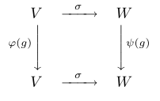

# 基本概念

- **前置知识**：
  - 抽象代数（群环模域）
- **符号约定**：
  - $K^\times$ 表示乘法群
  - $\R_n[x]$ 表示 $\R$ 上的 $n$ 次多项式环

## 群表示

- **一般线性群的同构定理**：设 $V$ 是域 $K$ 上的线性空间，则全体可逆线性变换组成的群为 $GL(V) \cong GL_n(K)$
  - **证明**：
    - 由可逆线性变换与可逆矩阵的一一对应性直得结论

### 线性表示

- **线性表示**：设 $G$ 是群，$V$ 是域 $K$ 上的线性空间，则群同态 $\p:G\to GL(V)$ 称为 $G$ 在域 $K$ 上的线性表示
  - **表示空间**：$V$
  - **表示的次数**：$\deg\p = \dim V$
- **忠实表示**：$\p$ 是单射（$\ker\p = \{e\}$）
- **平凡表示**：$\p$ 是零映射（$\ker\p = G$）
- **单位表示（主表示）$\p_0$**：$1$ 次平凡表示
- 群表示不一定是单射，因为我们有时候只关心群的部分对称性，这时可以商去一些正规子群
- **存在定理**：
  - 给定群 $G$，对任意维数的线性空间都存在线性表示
  - 给定线性空间 $V$，其只能表示某些阶数和结构的群
  - **证明**：详见后面

### 矩阵表示

- **矩阵表示**：设 $G$ 是群，$V$ 是域 $K$ 上的 $n$ 维线性空间，则群同态 $\Phi:G\to GL_n(K)$ 称为 $G$ 在域 $K$ 上的矩阵表示
  - **表示的次数**：$\deg\Phi = n$
- **转换定理**：
  - 设 $(\p,V)$ 是 $G$ 的 $n$ 次线性表示
  - 取 $V$ 中某个基，设 $\Phi(g)$ 是 $\p(g)$ 在该基下的矩阵
  - 则 $\Phi:G\to GL_n(K)，g\mapsto \Phi(g)$ 是矩阵表示
  - **证明**：显然
  - 同一个线性空间 $V$，取不同的对应会有不同的线性表示 $\p$（彼此的关系完全自由）
  - 同一个线性表示，取不同的基会有不同的矩阵表示 $\Phi$。这些矩阵彼此相似，相似矩阵是基过渡矩阵

### 等价表示

- **线性表示等价**：
  - 设 $(\p,V)，(\psi,W)$ 是 $G$ 的两个线性表示
  - 若存在线性空间同构 $\sigma:V\to W$ 使得对任意 $g\in G$，下图都交换，则称 $\p\approx \psi$
  
- **矩阵表示等价**：
  - 设 $\Phi,\Psi$ 是 $G$ 在 $K$ 上的两个矩阵表示
  - 若两表示次数相同，且存在可逆矩阵 $S$ 使得 $\forall g\in G，\Psi(g) = S\Phi(g)S^{-1}$，则称 $\Phi\approx \Psi$
- **等价转换定理**：群的两个有限维线性表示等价 $\LR$ 对应的矩阵表示等价
  - **证明（必要性）**
  - **证明（充分性）**：

### 实数加法群的表示

- **一次等价定理**：设 $\Phi,\Psi$ 是 $G$ 的两个一次 $K$ 表示，则 $\Phi\approx\Psi \LR \Phi = \Psi$
  - 一次情况下，矩阵表示和线性表示完全相等，等价表示也完全相等
  - 但是表示不一定唯一
  - **证明**：
    - 易得一次表示都可写为 $\Phi:G\to K^\times$
    - 由等价性，存在 $s\in K^\times$ 使得 $\forall g\in G，\Phi(g) = s\Psi(g)s^{-1}$
    - 再由于，故 $\Phi(g) = \Psi(g)$，即相等
- **$(\R,+)$ 的一次实表示**：指数型函数 $f_a:\R\to\R^\times，x\mapsto e^{ax}$
  - 一般我们希望表示函数的性质更好（至少可微）
  - 求解可微函数方程 $f(a+b) = f(a)f(b)$ 即可
- **$(\R,+)$ 的一次复表示**：指数型函数 $f_a:\R\to\R^\times，x\mapsto e^{iax}$
  - 证明同上
- **$(\R,+)$ 的二次实表示**：旋转矩阵 $\Phi:\R\to \R^2，t\mapsto \tvec{\cos t & -\sin t \\ \sin t & \cos t}$
  - 瞪眼法？
- **$(\R,+)$ 的 $n$ 次实表示**：
  - 设 $\bs T_a:\R_n[x]\to \R_n[x]，f(x)\mapsto f(x+a)$
  - 则 $\p:(\R,+)\to GL(V)，a\mapsto \bs T_a$ 是 $n$ 次实表示
  - 验证同态性即可

## 置换矩阵表示法

- 由凯莱定理，群都同构于某个置换群，而置换一一对应置换矩阵，故总能用置换矩阵给出群表示
- **群的置换矩阵表示**：
  - 设群 $G$ 作用于 $D = \{x_1,...,x_n\}$
  - 考虑 $K$ 作用于 $D$ 的全体 $n$ 项形式和 $V$，易得它是 $K$ 上的 $n$ 维线性空间，$D$ 是基
  - 则映射 $\p:G\to GL(V)，\p(g)\dkh{\sum\limits^n_{i=1}k_ix_i} = \sum\limits^n_{i=1} k_i(gx_i)$ 是同态，称为置换矩阵表示
- **转换定理**：$g$ 的置换矩阵表示就是 $\p(g)$ 在 $D$ 下的基矩阵
  - 由线性表示和矩阵表示的转换定理直得结论
  - **证明**：
    - $V$ 中的向量 $\sum\limits^n_{i=1} k_ix_i$ 可写成基分解形式 $(x_1,...,x_n)\tvec{k_1 \\ \vdots \\ k_n}$
    - 故 $\p(g): (x_1,...,x_n)\tvec{k_1 \\ \vdots \\ k_n} \mapsto (gx_1,...,gx_n)\tvec{k_1 \\ \vdots \\ k_n}$
    - 也就是说，$\p(g)$ 的基变换就是 $g$ 在 $D$ 上的置换，从而基变换矩阵就是置换矩阵
- **正则表示**：取元素左平移作用的置换矩阵表示 
  - **表示空间**：$K[G] = \hkh{\sum\limits_{g\in G} k_gg\Bigm | k_g\in K}$
  - **忠实性**：显然

### 对称群的置换矩阵表示

- **$S_3$ 的 $3$ 次置换矩阵表示**：
  - **解**：
    - **取作用**：设 $D = \{1,2,3\}$，取置换作用即可
    - **生成元系**：易得 $S_3 = \Bip{(12),(123)}$
    - **生成元置换矩阵**：
      - 将 $\p(12)$ 分别应用到 $1,2,3$ 上，计算得变为 $2,1,3$，故 $\Phi(12) = \tvec{ & 1 \\ 1 \\ && 1}$
      - 将 $\p(123)$ 分别应用到 $1,2,3$ 上，计算得变为 $2,3,1$，故 $\Phi(123) = \tvec{ && 1 \\ 1 \\ & 1}$
    - **全体置换矩阵**：
      - $\Phi(13) = \Phi(123)\Phi(12) = ...$
      - ...
- **对称定理**：设 $E_{ij}$ 是单元矩阵，则 $\Phi(\sigma) = E_{\sigma(1),1} + ... + E_{\sigma(n),n}$
  - **证明**：
    - 设 $D = \{1,2,...,n\}$，取置换作用即可
    - 显然 $\p(\sigma)(1) = \sigma(1)，...$，写成置换矩阵即可

### 习题

#### 循环群的表示

- **三阶循环群的正则表示**
  - **解**：
    - **生成元系**：$a$
    - **生成元基矩阵**：
      - $\rho(a)e = ae = a$
      - $\rho(a)a = aa = a^2$
      - $\rho(a)a^2 = aa^2 = e$
      - 故 $\Phi(a)$ 的置换矩阵为 $P(a) = \tvec{&& 1 \\ 1 \\ & 1 }$
    - **全体置换矩阵**

#### 二面体群的表示

- **正三角形对称群的 $2$ 次实表示**
  - **解**：
    - **生成元系**：已知正三角形的对称群就是二面体群 $D_3$，$a$ 表示旋转，$b$ 表示翻转
    - **生成元置换矩阵**：
      - 高代中已知旋转和翻转对应的矩阵，即 $\Phi(a) = \tvec{-\dfrac{1}{2} & -\dfrac{\sqrt{3}}{2} \\\ \\ \dfrac{\sqrt{3}}{2} & -\dfrac{1}{2}}$，$\Phi(b) = \tvec{-1 & \\ & 1} $
    - **全体置换矩阵**：

