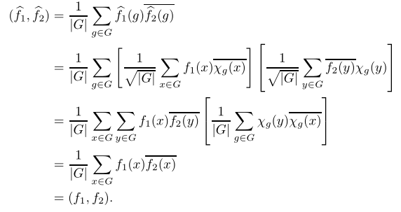

# 特征标

- **思想**：
  - 已知群表示的等价关系就是表示矩阵的相似关系，故相似不变量可用来判断群表示等价
- **符号约定**：
  - $1$ 表示群的幺元
  - 沿用上一章完全分解定理的符号，$m_i$ 是重数，$d_i$ 是维数，$s$ 是本原中心幂等元个数
  - $\d_{ij}$ 是Kronecker记号

## 特征标

- **特征标**：设 $(\p,V)$ 是 $G$ 在 $K$ 上的线性表示，则 $\chi_\p: G\to K， g\mapsto \tr\ddkh{\p(g)}$ 称为 $\p$ 提供的特征标
  - 表示矩阵的全体特征值的和
- **特征标幺元定理**：设 $(\p,V)$ 是 $G$ 在 $K$ 上的线性表示，则 $\chi_\p(1) = \deg(\p)1_K$
  - **证明**：显然
- **特征标相似定理**：设 $(\p,V)$ 是 $G$ 在 $K$ 上的线性表示，则 $\forall a\in G，\chi(gag^{-1}) = \chi(a)$
  - 特征标在共轭类上的值相等，从而是类函数
  - **证明**：由迹的相似不变性直得
- **类函数**：设 $f:G\to K$，若共轭类的值相等，则称为类函数
  - **实例**：特征标是类函数
- **类函数环**：全体类函数组成环 $Cf_K(G)$
- **特征标等价定理**：设 $(\p,V),(\psi,W)$ 都是 $G$ 在 $K$ 上的表示，则 $\p \approx \psi \red\Rt \chi_\p = \chi_\psi$
  - **证明**：
    - 已知等价表示的矩阵相似，再由特征标相似定理即得结论
  - **反例（逆命题不成立）**：
- **特征标直和定理**：若 $\p = \p_U\oplus \p_W$，则 $\chi_\p = \chi_{\p_U} + \chi_{\p_W}$
  - **证明**：
    - 已知直和表示的矩阵是分块对角关系，再由特征标定义即得结论

### 复表示的特征标

- **复特征标单位根定理**：
  - 设有限群 $G$ 的指数为 $m$，$\p$ 是复表示
  - 则 $\forall g\in G，\chi_\p(g)$ 是某些 $m$ 次单位根的和
  - **证明**：
    - 已知复矩阵的迹等于全体特征值的和
    - 由指数得 $\p(g)^m = 1$，故 $\l^m-1$ 是零化多项式，从而特征多项式的根都是 $m$ 次单位根
- **复特征标取逆定理**：
  - 设 $G$ 是有限群，$\p$ 是复表示，则 $\forall g\in G，\chi_\p(g^{-1}) = \ol{\chi_\p(g)}$
  - **证明**：
    - 已知互逆元的表示矩阵互逆，故特征值互逆。再由单位根的逆是共轭值即得结论
- **复特征标幺元定理**：
  - 设有限群 $G$ 的指数为 $m$，$\p$ 是复表示
  - 则 $\forall g\in G，|\chi_\p(g)| \leq \chi_\p(1)$
    - 当且仅当 $\p(g)$ 是 $\l_m$ 倍数乘变换时等号成立（$\l_m$ 是 $m$ 次单位根）
  - **证明**：
    - 设 $\deg\p = n$
    - 显然 $|\chi_\p(g)| = \abs{\sum\limits^n_{i=1} \l_i} \leq \sum\limits^n_{i=1} |\l_i| = n = \chi_\p(1)$
      - 若 $\p(g)$ 是数乘变换 $\l_m I$，则显然等号成立
      - 若等号成立，已知三角不等式的取等条件是线性相关，再由单位根两两线性无关即得只能是特征值都相等，从而 $\p(g)$ 只能是数乘变换 $\l_m I$
- **复特征标幺元唯一定理**：
  - 设 $G$ 是有限群，$\p$ 是复表示
  - 则 $\chi_\p(g) = \chi_\p(1) \LR \p(g) = \p(1)$
  - **证明**：
    - 由幺元定理直得结论

### 模法的特征标

- **扩充表示的特征标**：
  - 设 $(\p,V)$ 是 $G$ 的线性表示，$(\p^*,V)$ 是扩充到群代数 $K[G]$ 的线性表示
  - 则 $\chi^*_\p:K[G]\to K，a\mapsto \tr\ddkh{\p^*(a)}$ 称为左 $K[G]$ 模提供的特征标
- **性质定理**：
  - **线性**：扩充特征标是线性函数
    - 线性函数只能定义在线性空间上，故群的特征标没有线性，只有加性
  - **限制性**：$\chi_\p$ 是 $\chi^*_\p$ 在 $G$ 上的限制
- **特征标同构定理**：若左 $K[G]$ 模 $V\cong W$，则它们提供的特征标相等
  - **证明**：由限制性直得
- **特征标模直和定理**：若左 $K[G]$ 模 $M = M_1\oplus ... \oplus M_s$，则它们提供的特征标也满足加和关系
  - **证明**：由限制性直得

## 不可约特征标

- **符号约定**：
  - $L_{ij}$，$A_s$，$e_s$，$D_i$ 的含义与上一章相同
  - $\p_1,...,\p_s$ 是 $G$ 的全体互不等价的不可约表示

### 正交关系

- **正则关系式**：
  - 设
    - $G$ 是有限群，$\char K$ 不整除 $|G|$
    - $\p_1,...,\p_s$ 是全体互不等价的不可约 $K$ 表示，特征标为 $\chi_i$
    - 正则表示 $\rho$ 的特征标为 $\chi$
  - 则 $\chi^* = \sum\limits^s_{i=1} m_i\chi^*_i$
  - **证明**：
    - 由完全分解定理 + 特征标直和定理即得结论
- **正则特征标公式**：正则表示的特征标满足 $\chi:G\to K，g\mapsto \begin{cases} |G|1_K & g = 1 \\ 0 & g\neq 1 \end{cases}$
  - **证明**：
    - 已知正则表示是置换矩阵。由高代得置换矩阵仅当存在不动向量时迹不为零
    - 再由于群的左平移作用忠实，故只有幺元 $1$ 存在不动点
    - 再由于正则表示的空间为 $K[G]$，$G$ 是基，故 $\chi(1) = \deg\rho 1_K = |G|1_K$
- **正交关系引理**：
  - 设
    - $G$ 是有限群，$\char K$ 不整除 $|G|$
    - $e_1,...,e_s$ 是 $K[G]$ 的全部本原中心幂等元
    - $\p_1,...,\p_s$ 是全体互不等价的不可约 $K$ 表示，特征标为 $\chi_i$
    - 正则表示 $\rho$ 的特征标为 $\chi$
  - 则
    - **互相关系式**：$\forall g\in G，\chi^*_j(ge_i) = \d_{ij}\chi_i(g)$
    - **表出关系式**：$e_i = \cfrac{m_i}{\chi(1)}\sum\limits_{g\in G} \chi_i(g^{-1})g$
  - **证明**：
    - 由正则关系式得 $\chi^*(ge_i) = \sum\limits^s_{j=1} m_j\chi^*_j(ge_i)$
    - 再由定义得 $\chi^*_j(ge_i) = \tr\ddkh{\p^*_j(ge_i)}$
    - **互相关系**：
      - 已知 $\p^*_j$ 的表示空间为 $L_{j1}$，即 $\p^*_j(ge_i)$ 是其上线性变换
      - 任取 $x\in L_{j1}$
        - 若 $j\neq i$，则由 $ge_i\in A_i，x\in A_j，A_iA_j = \{0\}$ 得 $\p^*_j(ge_i)x = (ge_i)x = 0$
        - 若 $j=i$，则由 $x\in L_{i1}，e_i$ 是局部幺元得 $\p^*_i(ge_i)x = ge_ix = gx = \p_i(g)x$
      - 综上即得 $\chi^*_j(ge_i) = \d_{ij}\chi_i(g)$
      - 通过模法，将表示等价于群代数作用，从而得到结合律
      - 再用局部幺元性得到 $\d_{ij}$
    - **表出关系**：
      - 设 $e_i = \sum\limits_{y\in G} k_yy$，用 $g$ 左乘两边后取特征标得 $\chi^*(ge_i) = \sum\limits_{y\in G} k_{g^{-1}y}\chi(y)$
        - 由正则特征标公式， $\chi^*(ge_i) = k_{g^{-1}}\chi(1)$
      - 再由互相关系式得 $\chi^*(ge_i) = m_i\chi_i(g)$，从而 $k_{g^{-1}} = \cfrac{m_i\chi_i(g)}{\chi(1)}$
- **符号总结**：
  - $m_i = \tilde d_i$
  - $d_i1_K = \deg\p_i 1_K = \chi_i(1)$
  - $\sum m_id_i1_K = |G|1_K = \chi(1)$
- **代数闭域符号总结**：
  - $m_i = \tilde d_i = d_i = \deg\p_i = \chi_i(1)$
  - $\sum d_i^2 = |G| = \chi(1)$

### 复表示的正交关系

- **第一正交关系定理**：
  - 设 $G$ 是有限群，$\p_1,...,\p_s$ 是全体互不等价的不可约复表示，特征标为 $\chi_i$
  - 则 $$ \frac{1}{|G|}\sum_{g\in G} \chi_i(g)\ol{\chi_j(g)} = \d_{ij} $$
  - **证明**：
    - 设 $e_1,...,e_s$ 是 $\C[G]$ 的全部本原中心幂等元
    - 由表出关系式得，$e_i = \cfrac{\chi_i(1)}{|G|}\sum\limits_{g\in G} \ol{\chi_i(g)}g$
      - 两边取特征标得 $\chi^*_j(e_i) = ...$
    - 由互相关系式得 $\chi^*_j(e_i) = \d_{ij}\chi_i(1)$
    - 联立上面两等式即得结论
- **复值函数空间**：$G$ 上全体取复值的函数构成酉空间 $\C^G$
  - **证明**：
    - **线性**：定义验证即可
    - **内积**：取 $(\xi,\eta) = \cfrac{1}{|G|}\sum\limits_{g\in G} \xi(g)\ol{\eta(g)}$ 即可
- **复值类函数空间**：$G$ 上全体取复值的类函数构成酉空间 $Cf_\C(G)$
  - **证明**：
    - **线性**：定义验证即可
    - **内积**：易得它是 $\C^G$ 的子空间，故遗传即可
- **正交基定理**：有限群 $G$ 的全体互不相等复特征标是 $Cf_\C(G)$ 的标准正交基
  - **证明**：
    - 由个数定理，此时 $G$ 有 $s$ 个共轭类 $C_1,...,C_s$
    - 取共轭类代表元 $g_i$，**取值映射** $\sigma:Cf_\C(G)\to \C^s，f\mapsto \ddkh{f(g_1),...,f(g_s)}$
      - **线性空间同态性**：易得
      - **双射性**：易得
    - **标准正交性**：由第一正交关系定理直得
    - **基性**：由标准正交性得线性无关性，从而像是 $\C^s$ 的基，即原象是 $Cf_\C(G)$ 的基

### 复表示的正交分解

- **复表示重数定理**：
  - 设 $G$ 是有限群，$\p_1,...,\p_s$ 是全体互不等价的不可约复表示，特征标为 $\chi_i$
  - 任取复表示 $\p$，则 $\p_i$ 在 $\p$ 中的重数为 $(\chi_\p,\chi_i)$ 
  - **证明**：
    - 由重数的定义 + 正交基定理直得
- **复表示特征唯一性**：设 $\p$ 是有限群的复表示，则 $\p\approx \psi \LR \chi_\p = \chi_\psi$
  - **证明**：正交分解即可
- **复表示不可约判定定理**：设 $\p$ 是有限群的复表示，则 $\p$ 不可约 $\LR (\chi_\p,\chi_\p) = 1$
  - **证明**：复表示重数定理即可

### 复表示的共轭归一

- **复特征标表**：
  - 设 $\chi_1,...,\chi_s$ 是有限群 $G$ 的全体互不相等的不可约复特征标，$g_1,...,g_s$ 是共轭类代表元系
  - 则 $W = \ddkh{\chi_i(g_j)}_{s\times s}$ 称为 $G$ 的复特征标表
  - 每行是不同的特征标，每列是不同的共轭类
  - 它包含了特征标的全部可能取值（第一行通常取主特征标）
  - **可逆性**：
    - **证明**：已知共轭类取值映射 $\sigma$ 是同构，故由特征标是基得 $W$ 的行向量线性无关
  - **半酉性**：设 $D = \diag\ddkh{|C_1|,...,|C_s|}$，则 $W\sqrt{\cfrac{D}{|G|}}$ 是酉矩阵
    - **证明**：
      - 由特征标的正交性直得行向量彼此正交
      - 再由第二正交关系定理即得半酉性
- **第二正交关系定理**：
  - 设
    - $\chi_1,...,\chi_s$ 是有限群 $G$ 的全体互不相等的不可约复特征标，$\chi_1$ 是主特征标
    - $g_1,...,g_s$ 是共轭类 $C_i$ 的代表元系，$g_1$ 是幺元
  - 则 $$ \cfrac{1}{|G|}\sum^s_{k=1} |C_j|\chi_k(g_j)\ol{\chi_k (g_i)} = \d_{ij} $$
  - 第一正交关系是对全体元素 $g_k$ 求和，本质是 $W$ 的行正交
  - 第二正交关系是全体特征标 $\chi_k$ 求和，本质是 $W$ 的列正交
  - 由高代知识，行正交必定列正交，摆弄一下矩阵即可
  - **证明**：
    - 由共轭类取值相等得第一正交关系公式可写成 $$ \cfrac{1}{|G|}\sum^s_{k=1} |C_k|\chi_i(g_k)\ol{\chi_j (g_k)} = \d_{ij} $$
    - 设 $D = \diag\ddkh{|C_1|,...,|C_s|}$
    - 将上式写成矩阵形式就是 $(WDW^*)_{i,j} = \d_{ij}|G|$
      - 即 $WDW^* = |G|I_s$
      - 即 $\cfrac{1}{|G|}W^*(WD) = I_s$，计算矩阵的第 $(i,j)$ 元即得结论
  - **理解**：
    - 先用共轭类等值性，化为矩阵乘积（内积）形式。再移项即得序号反转的形式

### 复表示的傅里叶级数

- **不可约复特征标集**：$G$ 的全体不可约复特征标记为 $\Irr(G)$
- **反演公式**：
  - 设 $G$ 是有限群，$A\in \C[G]$
  - 若 $A = \sum\limits_{g\in G} a_gg$
  - 则 $$ a_g = \frac{1}{|G|}\sum_{x\in \Irr(G)} \chi(Ag^{-1})\chi(1) $$
  - **证明**：
    - 由第二正交关系定理，$\cfrac{1}{|G|}\sum\limits_{\chi\in \Irr(G)} |C_j|\chi(g_i)\ol{\chi(g_j)} = \d_{ij}$
    - 任取 $g\in G$，用 $g^{-1}$ 右乘 $A$ 表出式的两边得 $$ Ag^{-1} = \sum\limits_{h\in G} a_h(hg^{-1}) \xto{y=hg^{-1}} \sum\limits_{g\in G} a_{yg}y $$
    - 考虑 $ \sum\limits_{x\in \Irr(G)} \chi(Ag^{-1})\chi(1)$
      - 由上面关系式 + 特征标线性可化为 $\sum\limits_{\chi\in\Irr(G)} \dkh{\sum\limits_{y\in G} a_{yg}\chi(y)} \chi(1) $
      - 重新排序可化为 $\sum\limits_{y\in G}a_{yg} \sum\limits_{\chi\in \Irr(G)} \chi(y)\ol{\chi(1)}$
        - 因为 $\chi(1)$ 是实数，故等价于共轭
      - 由正交性可化为 $a_g\sum\limits_{\chi\in\Irr(G)}\chi(1)\ol{\chi(1)}$
        - 因为不可约特征标彼此正交，故 $y\neq 1$ 时都取零
      - 由第二正交关系式可化为 $a_g|G|$

### 阿贝尔群

- **阿贝尔特征标同构定理**：若 $G$ 是有限阿贝尔群，则 $\Irr(G) = \wh G \cong G$
  - 可以将特征标写为 $\chi_g$
  - **证明**：
    - 此时不可约复表示都是一次（特征标就是特征值），故不可约复表示 $\p_i$ 和特征标 $\chi_i$ 可以等同
    - 同构性由前面章节定理给出，同构运算 $(\chi_1+\chi_2)(g) = \chi_1(g)\chi_2(g)$
  - **实例**：
    - $G = \Z_n$，任取 $t,m\in G$，易得 $\chi_t(m) = e^{2\pi i\dfrac{tm}{n}}$，从而是一一对应
- **阿贝尔群反演公式**：
  - 设 $G$ 是有限阿贝尔群，$A\in \C[G]$
  - 若 $A = \sum\limits_{g\in G} a_gg$
  - 则 $$ a_g = \frac{1}{|G|}\sum_{x\in \wh G} \chi(A)\ol{\chi(g)} $$
  - **证明**：
    - 由阿贝尔群特征标同构性定理得 $\chi(Ag^{-1}) = \chi(A)\chi(g^{-1}) = \chi(A)\ol{\chi(g)}$
- **阿贝尔-傅里叶展开定理**：
  - 设 $G$ 是 $n$ 阶有限阿贝尔群，$\chi_1,...,\chi_n$ 是全部不可约复特征标
  - 则任取 $f\in \C^G$，$f = \sum\limits^n_{i=1} (f,\chi_i)\chi_i$
  - **证明**：
    - 显然有限阿贝尔群的共轭类只有一个元素，故 $Cf_\C(G) = \C^G$
    - 再由正交基定理即得结论
- **阿贝尔-傅里叶变换定理**：
  - 设 $G$ 是有限阿贝尔群， $\wh f:G\to \C，g\mapsto \sqrt{|G|}(f,\chi_g)$
  - 则
    - **傅里叶变换**：$\tau:\C^G\to \C^G，f\mapsto \wh f$ 是酉变换
    - **Parseval等式**：$$ \sum_{g\in G} \wh f_1(g)\ol{\wh f_2(g)} = \sum_{x\in G} f_1(x)\ol{f_2(x)} $$
  - **证明**：直接计算即可
    

### 非阿贝尔群

- 计算比较复杂，详见傅里叶分析

### 习题

- **特征唯一定理**：零特征域上的表示都满足特征唯一性
  - **证明**：

## 计算例

### 二面体群

- 求 $D_5$ 的复特征标表
  - **解**：
    - 前面已求出全体互不等价的不可约复表示，故复特征标表可直接写出 $$\begin{array}{c|lllll} \circ  & 1 & a & a^2 & b \\ \hline \chi_0 & 1 & 1 & 1 & 1 \\ \chi_1 & 1 & 1 & 1 & -1 \\ \chi_2 & 2 & 2\cos\dfrac{2\pi}{5} & 2\cos\dfrac{4\pi}{5} & 0 \\ \chi_3 & 2 & 2\cos\dfrac{4\pi}{5} & 2\cos\dfrac{8\pi}{5} & 0 \end{array}$$