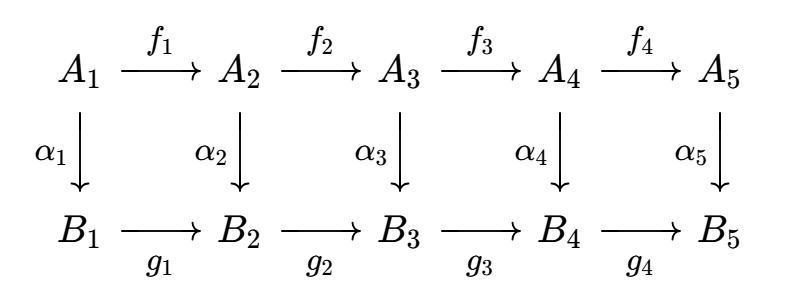
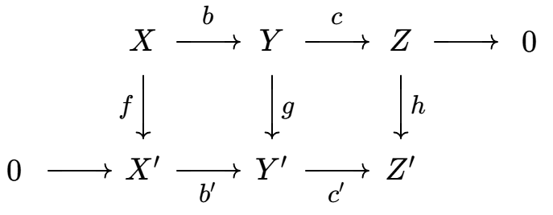
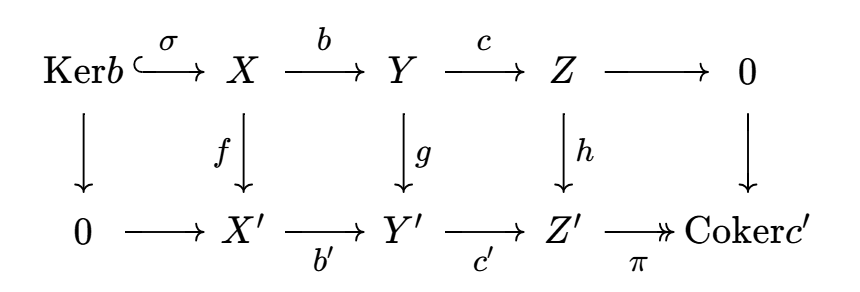

# 模的扩张

- **余像和余核**：设 $f:A\to B$ 是同态
  - **余像**：$\Coim f = A/\ker f$ 
    - 原像中的同态等价类，将像相同的元素合并
    - 核心目的是用商消去非单射的影响。余像中 $f$ 是单射
  - **余核**：$\Coker f = B/\Im f$
    - 陪域中的像等价类，将陪域用像分解
    - 核心目的是用商消去非满射的影响。余核中 $f$ 是零映射

## 正合列

- **正合列**：模同态链 $A_0\xto{f_1} A_1 \xto{f_2} \cdots \xto{f_n} A_n$ 满足 $\Im f_i = \ker f_{i+1}$
  - **本质**：取补性，$f_{i+1}$ 的像都是 $f_i$ 像的补集（核变余像，像变余核）
  - 正合列本质是刻画群/模扩张的工具，可以判断扩张是否分裂，以及对群/模做分类

### 短正合列

- **短正合列**：$0\to A \xto f B\xto g C \to 0$，其中 $f$ 是单同态，$g$ 是满同态
  - $0$ 的意义是规定单性和满性。如果正合列两端不是零则不必单或满
  - **$f$ 扩张性**：由单同态得 $A\cong \Im f$，故 $f$ 将子模 $A$ 嵌入总模 $B$
  - **$g$ 收缩性**：由定义，$\Coker f = B/\Im f = B/\ker g = \Coim g \cong C$，故该步使总模 $B$ 被 $A$ 压缩为商模 $C$
  - **本质（最短性）**：
    - 单射是扩张，满射是收缩。普通的正合列中，每个映射 $f_i$ 都必须保证既有扩张又有收缩，也就是既有单射部分，也有满射部分
    - 所以最短的正合列就是都只有一个
- **右正合性质**：右端为零的正合列
- **左正合性质**：左端为零的正合列

### 分裂的短正合列

- **分裂短正合列**：将模分裂成两个直和因子
- **直和型短正合列**：$0\to A \xto{i} A\oplus B \xto{\pi} B\to 0$
  - **分裂性**：显然
  - 模范畴中，直和型等价于分裂
  - 群范畴中，分裂指的是半直积，故两者不等价
- **商模型短正合列**：$0\to C \xto{i} D \xto{\pi} D/C\to 0$
  - **无分裂性**
    - **反例**：$0\to 2\Z \xto{i} \Z \xto{\pi} \Z_2 \to 0$，其中 $f(n) = 2n$，$g(n) = \begin{cases} 0，偶数 \\ 1，奇数 \end{cases}$
      - 易得 $\Im f = \ker g$，是正合列
      - 但 $\Z\neq \Z\oplus \Z_2$，不是分裂的

### 交换图

- **图**：对象为顶点，态射为边
- **交换图（路径无关性）**：若两端对象相同时，不同路径结果相同，则图称为交换的
  - （物理中的保守力？不定积分的路径无关性？）
- **正合列等价**：存在交换图，且两正合列彼此之间的同态都是同构
- **（引理1.17）短五引理**：
  - 设 $R$ 是环
  - 若下列R模交换图中，两行都是短正合列
  
  - 则 $\a,\g$ 是单/满同态 $\red\Rt \b$ 是单/满同态
  - 追图法：对于闭合的交换图，要证明其中一条边的性质，只需找到另一条通路即可
    - 两条通路的其它映射都是单/满的，故缺失的一条边当然也是单/满的
    - 但要注意不是"任意两个"都成立，因为 $\b$ 正好在 $\a,\g$ 正中间。如果换成 $\a,\b$，由于它们两个已经闭合，故性质与 $\g$ 无关
  - **证明（追图法）**：
    - **单同态传递**：设 $\b(b) = 0$，则只需 $b=0$
      - 由交换图，$\g g(b) = g'\b(b) = g'(0) = 0$，再由 $\g$ 单射性，只能是 $g(b) = 0$
      - 由正合性，$\ker g = \Im f$，从而存在 $f(a) = b$
      - 由交换图，$f'\a(a) = \b f(a) = \b(b) = 0$
      - 由正合性得 $f'$ 是单同态，从而 $\a(a) = 0$，但由 $\a$ 单同态性，得只能是 $a = 0$，故 $b = f(a) = 0$
    - **满同态传递**：设 $b'\in B'$，只需存在对应的 $\b$ 原像即可
      - 由 $\g$ 满射性，存在 $\g(c) = g'(b')$
      - 由正合性，$g$ 是满同态，从而存在 $g(b) = c$
      - 由交换图，$g'\b(b) = \g g(b) = \g(c) = g'(b')$
      - 从而 $g'(\b(b)-b') = 0$，由正合性，可设 $f'(a') = \b(b)-b'$
      - 由 $\a$ 满射性，存在 $\a(a) = a'$
      - 此时 $\b(b-f(a)) = \b(b) - \b(f(a)) = \b(b) - (\b(b)-b') = b'$
  - **本质**：若两个正合列间首尾映射的性质相同，则两列等价（总模等价）
  - **推论（正合列的限制传递性）**：
    - $\ker \a\xto{f''} \ker \b \xto{g''} \ker \g$ 是正合列
    - $A'/\Im\a \xto{f'''} B'/\Im\b \xto{g'''} C'/\Im \g$ 是正合列
    - **证明（追图法）**：同上即可
- **（定理1.18）分裂定理**：
  - 设 $0\to A_1 \xto{f} B \xto{g} A_2 \to 0$ 是R模同态的短正合列
  - 则下列命题等价
    - **直和性**：该列同构于直和型短正合列 $A_1\oplus A_2$ 
    - **嵌入左可逆（左分裂）**：存在R模同态 $k:B\to A_1$ 满足 $kf = 1_{A_1}$
    - **投影右可逆（右分裂）**：存在R模同态 $h:A_2\to B$ 满足 $gh = 1_{A_2}$
  - **证明**：
    - $(1),(2)\to (3),$：尝试画交换图，凑映射即可
    - $(3)\to (1),(2)$：有右逆等价于满射，有左逆等价于单射
  - **理解**：
    
  - 这就是分裂正合列的常用判定定理

## 五引理

- **基本结构**：
  - $0\to M\to 0$ 是正合列 $\LR M = 0$ 
  - $0\to M\xto{f} N$ 是正合列 $\LR f$ 是单同态
  - $M\xto{f} N\to 0$ 是正合列 $\LR f$ 是满同态
  - $0\to M\xto{f} N\to 0$ 是正合列 $\LR f$ 是同构
  - **证明**：
    - 定义易得
- **五引理**：
  - 若下列R模交换图中，每行是正合列
  
  - 则
    - 若 $\a_1$ 是满同态，$\a_2,\a_4$ 是单同态，则 $\a_3$ 是单同态
    - 若 $\a_5$ 是单同态，$\a_2,\a_4$ 是满同态，则 $\a_3$ 是满同态
    - 若 $\a_1,\a_2,\a_4,\a_5$ 是同构，则 $\a_3$ 是同构
  - **证明（1）**：
    - 只需证明 $\ker \a_3 = 0$ 即可
    - **前移**：
      - 设 $\a_3(z) = 0$，则 $g_3\a_3(z) = 0$，由交换性 $\a_4f_3(z) = 0$
      - 由单射性，只能是 $f_3(z) = 0$
      - 再由正合性得 $z\in \ker f_3 = \Im f_2$，即存在 $f_2(y) = z$
    - **前移**：
      - 由定义得 $\a_3f_2(y) = 0$，由交换性 $g_2\a_2(y) = 0$
      - 再由正合性得 $\a_2(y)\in \ker g_2  = \Im g_1$，即存在 $g_1(x) = \a_2(y)$ 
    - **终点**：
      - 由满射性得可设 $x = \a_1(u)$，由定义 $g_1\a_1(u) = \a_2(y)$，再由交换性 $\a_2f_1(u) = \a_2(y)$
      - 由单射性，只能是 $f_1(u) = y$
    - **综合**：
      - 综上得 $z = f_2(y) = f_2f_1(u)$。再由正合性即得 $z = 0$
  - **证明（2）**：仿照上面即可
  - **证明（3）**：由上面两结论直得

### 粘贴定理

- **正合列粘贴定理**：
  - 若 $\begin{cases} 0\to A\to B\xto{f}C\to 0 \\ 0\to C\xto{g} D\to E\to 0 \end{cases}$ 均是模的短正合列
  - 则 $0\to A\to B\xto{gf}D\to E\to 0$ 是正合列
  - **证明**：定义易得
  - **反例**：单射和满射的复合既不单也不满
    - $f:\R\to [0,\infty)，x\mapsto x^2$ 是满射
    - $g:[0,\infty) \to [0,\infty)，x\mapsto \sqrt{x+1}$ 是单射
    - 但 $gf:\R\to [0,\infty)，x\mapsto \sqrt{x^2+1}$ 不单也不满
- **正合列撕裂定理**：每个正合列都可撕裂成多个上面的短正合列
  - **证明**：
    - 只需要 $A\to B$ 是单射，$D\to E$ 是满射，$f$ 满，$g$ 单
    - 只需证明任何映射 $h:X\to Y$ 都可分解为满射 $f$ 和单射 $g$ 的复合即可
      - **像集限制** $f:X\to \Im h，x\mapsto h(x)$，易得其为满射
      - **平凡延拓** $g:\Im h\to Y，h(x)\mapsto h(x)$，易得其为单射
      - 此时 $h = gf$
  - **推论（具体的撕裂方法）**：
    - 设正合列 $0\xto{f_0}A_1\xto{f_1}A_2\xto{f_2}\cdots A_{n-1}\xto{f_{n-1}}A_n\xto{f_n}0$
    - **首尾不变性**：显然 $\ker f_0 = 0$，其为单射，$\Im f_n = 0$，其为满射，也就是说，短正合列的首尾部分不变即可
    - **复合归零性**：任取 $g_k = f_{k+1}\circ f_{k}$，由正合列定义，$g_k$ 是零映射
    - **逐步分解**：$f_1 = gf$，其中 $g$ 单，$f$ 满，即 $A_1\xto{f}\Im f_1\xto{g} A_2$
- **等价性**：短正合列的同构是等价关系

### 蛇引理

- **强形式蛇引理**：
  - 设下列R模交换图中，每行是正合列
  
  - 若 $\a_1$ 是满同态，$\a_5$ 是单同态
  - 则有正合列 $$ \ker \a_2 \xto{\ol f_2} \ker \a_3 \xto{\ol f_3} \ker \a_4 \xto{\pa} \Coker \a_2 \xto{\ol g_2} \Coker \a_3 \xto{\ol g_3} \Coker \a_4$$
    - $\pa$ 称为连接同态，它将核的正合列粘贴到余核的正合列上
    - $\ol f_i$ 是核的同态，通过取限制得到
    - $\ol g_i$ 是余核的同态，通过取投影得到
    - $\pa$ 是核与余核的同态，通过提升 + 投影得到
  - **证明（核同态）**：
    - **取限制**：
      - 由交换性得 $g_2\a_2 = \a_3f_2$，故 $f_2$ 将 $\ker \a_2$ 映入 $\ker \a_3$
      - 取限制得 $\ol f_2 = f_2|_{\ker \a_2}$
      - 同理可得 $\ol f_3 = f_3|_{\ker \a_3}$
    - **正合性**：
  - **证明（余核同态）**：
    - **取投影**：
      - 由交换性得 $g_2\a_2 = \a_3f_2$，显然 $g_2$ 将 $\Im \a_2$ 映入 $\Im \a_3$
      - 由同态基本定理，存在唯一的 $\ol g_2:B_2/\Im \a_2 \to B_3/\Im \a_3$ 
      - 同理可得 $\ol g_3$
    - **正合性**：
  - **证明（连接同态）**：
    - **前移**：
      - 设 $z\in \ker \a_4$，由交换性得 $\a_5 f_4(z) = g_4\a_4(z) = 0$
      - 由单射性得只能是 $z\in \ker f_4$
      - 由正合性得 $z\in \Im f_3$，即存在 $y\in A_3$ 使得 $f_3(y) = z$
    - **前移**：
      - 由交换性得 $g_3\a_3(y) = \a_4 f_3(y) = 0$
      - 由正合性得 $\a_3(y) \in \ker g_3 = \Im g_2$，即存在 $x\in B_2$ 使得 $g_2(x) = \a_3(y)$
    - **定义**：$$ \pa: \ker \a_4 \to \Coker \a_2，z\mapsto (x + \Im \a_2)$$
      - **唯一性（追图法）**：
        - 反设存在 $x'$ 也满足上述条件，则 $f_3(y-y') = 0$
        - 由正合性得 $y-y'\in \ker f_3 = \Im f_2$
        - 即存在 $x_0\in A_2$ 满足 $f_2(x_0) = y-y'$
          - 由交换性 $g_2(x-x') = \a_3(y-y') = \a_3f_2(x_0) = g_3\a_2(x_0)$
          - 由同态性，左端和右端相减得 $x-x'-\a_2(x_0) \in \ker g_3 = \Im g_2$
        - 即存在 $u\in B_1$ 满足 $x-x'-\a_2(x_0) = g_1(u)$
        - 再由满射性得存在 $v$ 使得 $u = \a_1(v)$
          - 由交换性 $x-x'-\a_2(x_0) = g_1\a_1(v) = \a_2f_1(v)$
          - 即 $x-x'\in \Im \a_2$，从而 $x + \Im \a_2 = x' + \Im \a_2$
    - **正合性1**：
    - **正合性2**：$\Im \pa = \Ker \ol g_2$
      - **右包左**：定义易得
      - **左包右**：
        - 设 $x + \Im \a_2\in \ker \ol g_2$，则 $g_2(x)\in\Im \a_3$
        - 即存在 $y\in A_3$ 使得 $g_2(x) = \a_3(y)$
        - 由交换性得 $\a_4f_3(y) = g_3\a_3(y) = g_3g_2(x) = 0$，即 $f_3(y)\in \ker \a_4$
        - 再由定义得 $\pa f_3(y) = x + \Im \a_2$，故 $x+\Im\a_2\in \Im \pa$，从而 $\ker \ol g_2 \subset \Im \pa$
- **蛇引理**：
  - 设下列R模交换图中，每行是正合列
  
  $\whhh\whh\pad$
  
  - 则存在和强形式蛇引理相同的正合列
  - **证明**：
    - 扩充为下列交换图
    
    - 显然 $f\sigma =  \pi h =  0$，由强形式蛇引理即得结论

## 习题

- 设 $\{A_i\}^n_{i=1}$ 是R模族，
- **模嵌入定理**：
  - 设 $R$ 是无幺环，将其嵌入含幺环 $S$ 中
  - 则
    - $S$ 中元素可表为 $r1_S + n1_S\pad (r\in R，s\in\Z)$
    - 若 $A$ 是R模，则 $\forall a\in A$，存在唯一的R模同态 $f:S\to A，f(1_S) = a$
  - **证明**：
    - 设 $f(r1_S + n1_S) = ra + na$ 即可

## 例子

- **同余类模**：设 $A$ 是交换群。若存在 $n\in\N^+$，满足 $\forall a\in A，na = 0$，则 $A$ 是幺 $\Z_n$ 模，作用为 $\ol ka = ka$
- **最大同态**：任意含幺环 $R$ 的模同态都是 $\Z$ 的模同态，即 $\Hom_R(A,B)\subset \Hom_\Z(A,B)$
  - **证明**：线性公式 $f(ra + na) = rf(a)+nf(a)$，由于 $0\in R$，显然可得结论
- **理想衍生模**：设 $I\in\I_{R_L}，A\in\M_R$
  - 若 $S$ 是非空子集，则 $IS = \set{\sum\limits^n_{i=1} r_ia_i\mid n\in\N^+，r_i\in I，a_i\in S}$ 是子模
    - **证明**：理想封闭性即得数乘封闭性
    - **实例**：$S = \{a\}$，则 $IS = Ia = \set{ra\mid r\in I}$
  - 若 $I$ 是双边理想，则 $A/IA\in \M_{R/I}$
    - **证明**：数乘作用为 $(r+I)(a+IA) = ra + IA$
- **反环模**：若 $A$ 是左 $R$ 理想，则 $A$ 是右 $R^{op}$ 模，满足 $ra = ar'$
  - **证明**：$ra \in A$，即 $A$ 是左R模。由反环定义，$ra = ar'\in A$，从而是右 $R^{op}$ 模
- **R模范畴的态射类**：设 $A,B$ 是 $R$ 模，则 $\Hom_R(A,B)$ 是所有 $A\to B$ 模同态的集合
  - **同态群**：若 $A,B$ 是R模，则（所有A到B的R模同态） $\Hom_R(A,B)$ 是阿贝尔群
    - **证明**：
      - 群加法为 $(f+g)(a) = f(a) + f(b)$，易得满足交换性
      - 幺元是零映射
  - **自同态环**：$\Hom_R(A,A)$ 是含幺环
    - **证明**：
      - 环加法同上
      - 环乘法是函数复合
      - 零元为零映射，幺元为恒等映射
  - **自同态模**：$A$ 是左 $\Hom_R(A,A)$ 模，数乘作用就是同态映射 $fa = f(a)$
  - **作用同态**：存在 $\p:A\to \Hom_R(R,A)，a\mapsto f_a$ 是同态
    - **证明**：取 $f_a(r) = ra$ 即可
- **代数整数环（$\Z$ 模）**：设 $d\in \Z$ 无平方因子，则 $R = \begin{cases} \Z[\sqrt{d}]  & d\equiv 2,3\pmod 4 \\ \Z[\dfrac{1+\sqrt{d}}{2}] & d\equiv 1\pmod 4 \end{cases}$ 称为 $\Q(\sqrt{d})$ 的代数整数环
  - **有限生成性**：$R$ 作为 $\Z$ 模是有限生成的（即有限生成阿贝尔群）
    - **证明**：

