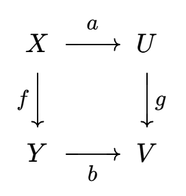
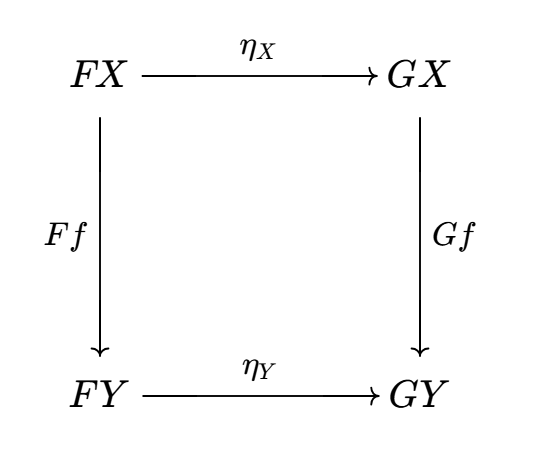
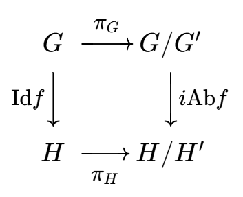
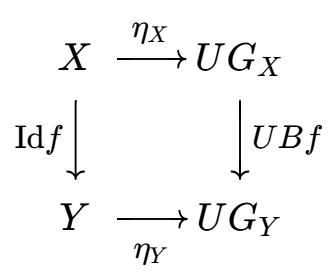
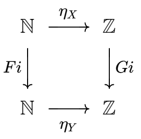
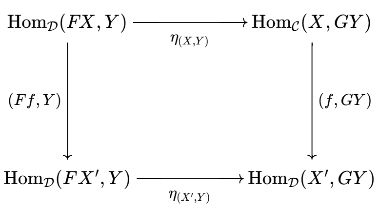
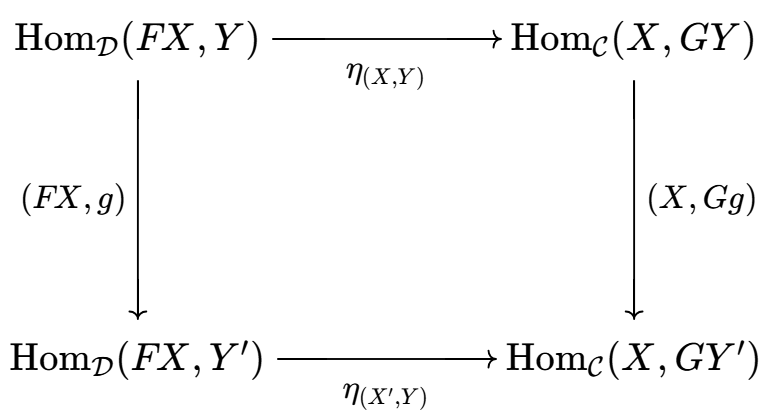

# 范畴论补充

- **背景**：
  - 如果不提前补全函子的知识，就容易迷失在对偶和张量这些复杂结构的细节中，看不到它的目的和本质
- **符号约定**：
  - $X\dto Y$ 表示单态射，$X\mto Y$ 表示满态射

## 范畴

- **单态射**：若任意态射 $fg = fh$ 都有 $g = h$，则称 $f$ 是单态射
  - 满足左消去律的态射
- **满态射**：若任意态射 $gf = hf$ 都有 $g = h$，则称 $f$ 是满态射
  - 满足右消去律的态射
- **进化定理**：单射是单态射，满射是满态射
  - **证明**：显然
  - **反例（反之不成立）**：映射可以是任意的，态射必须是同态。两者像与原象的不匹配导致了不同
    - **单态射不是单射**：
      - 可除阿贝尔群范畴中，商映射 $\pi:\R\to\R/\Z$ 是单态射，但不是单射
        - 反设 $\pi(g-h) = 0$，则 $(g-h)(a) \in \ker\pi = \Z$
        - 由同态保可除性，$(g-h)(A)$ 是 $\Z$ 中可除阿贝尔群，只可能是 $\{0\}$，从而是单态射
    - **满态射不是满射**：
      - 环范畴中，嵌入 $f:\Z\to \Q$ 是满态射，但不是满射
    - **单满态射不是同构**：
      - 环范畴中，$f:\Z\to \Q$ 是单态射 + 满态射，但不是同构

### 范畴的派生

- **反范畴**：设 $\mc C$ 是范畴，则与它对象相同、态射的像与原象颠倒的范畴 $\mc C^{\text{op}}$ 称为反范畴
  - **自反定理**：$(\mc C^{\text{op}})^{\text{op}} = \mc C$
  - **反映射定理**：
    - $\mc C$ 的单态射 $\LR (\mc C)^{\text{op}}$ 的满态射
    - $\mc C$ 的满态射 $\LR (\mc C)^{\text{op}}$ 的单态射
- **积范畴**：
  - 设 $\mc C,\mc D$ 是范畴
  - 则对象是 $\Big( \Ob (\mc C),\Ob (\mc D) \Big)$，态射为 $\Hom\Big( (C,D)，(C',D') \Big)$ 的范畴称为积范畴
- **箭头范畴**：
  - 设 $\mc C$ 是范畴
  - 则对象是态射类 $\Hom(\mc C)$，态射为交换方块的范畴称为箭头范畴 $\Arr(\mc C)$
    - 设 $f:X\to Y，g:U\to V$ 是 $\mc C$ 中两个态射
    - 若一对态射 $(a,b)$ 满足下面的交换图，则该图整体是 $\Arr(\mc C)$ 的态射
    

## 函子

- 一般说函子都是指协变函子
- **协变函子**：
  - 设 $\mc C,\mc D$ 是范畴，$F:\mc C\to \mc D$ 是对象的对应关系
  - 若
    - **诱导协变性**：对任意 $(X,Y)$ 都有对应关系 $$F:\Hom_{\mc C}(X,Y)\to \Hom_{\mc D}\Big(F(X),F(Y) \Big)，f\mapsto Ff$$
    - **保幺性**：$\forall X\in \Ob(\mc C)，F\text{Id}_X = \text{Id}_{F(X)}$
    - **复合协变性**：对任意 $gf$ 都有 $F(gf) = (Fg)(Ff)$
  - 则称 $F$ 是协变函子
  - 跟态射一样，函子也不一定是映射，而只是对应关系（作用）
  - 函子同时是对象作用和态射作用，缺一不可
- **逆变函子**：
  - 设 $\mc C,\mc D$ 是范畴，$F:\mc C\to \mc D$ 是对象的对应关系
  - 若
    - **诱导逆变性**：对任意 $(X,Y)$ 都有对应关系 $$F:\Hom_{\mc C}(X,Y)\to \Hom_{\mc D}\Big( F(Y),F(X) \Big)，f\mapsto Ff$$
    - **保幺性**：$\forall X\in \Ob(\mc C)，F\text{Id}_X = \text{Id}_{F(X)}$
    - **复合逆变性**：对任意 $gf$ 都有 $F(gf) = (Ff)(Fg)$
  - 则称 $F$ 是逆变函子
  - 标准范畴论中，函子只讨论协变和逆变两种
- **对偶定理**：
  - 若 $F:\mc C\to \mc D$ 是协变函子，则 $F:\mc C^{\text{op}}\to \mc D$ 是逆变函子
  - 若 $F:\mc C\to \mc D$ 是逆变函子，则 $F:\mc C^{\text{op}}\to \mc D$ 是协变函子
  - **证明**：显然
  - **实例**：
    - 单位函子 $I_{\mc C}: \mc{C\to C}$，将每个对象和态射映射到其本身。它的逆变就是本身

### 双函子

- **双函子**：
  - 设 $\mc C\times \mc D$ 是积范畴，$\mc E$ 是范畴
  - 若 $F:\mc C\times \mc D\to \mc E$ 满足函子公理，则称为双函子
  - 双函子只有协变，没有逆变
  - 双函子也是函子，故下面的性质也都成立
- **实例**：
  - **双Hom函子**：$\Hom(\cdot,\cdot):\Mod\times\Mod\to\Abel，(A,B)\mapsto \Hom(A,B)$

## 函子实例

### 群范畴

- $\Set$ 表示集合范畴，$\Grp$ 表示群范畴，$\Abel$ 表示阿贝尔群范畴

#### 协变函子

- **遗忘函子**：$U:\Grp \to \Set$，群 $\mapsto$ 底层集合
  - 具体范畴都存在忠实的遗忘函子
  - **证明**：
    - **诱导协变性**：
      - $\Hom(X,Y)$ 是群同态
      - $\Hom\Big( F(X),F(Y) \Big)$ 是集合映射
      - 显然 $Ff$ 就是将群同态替换为底层集合映射，满足一值性
    - **保幺性**：
      - $F\text{Id}_G$ 是群 $G$ 映射成底层集合后，再取集合恒等映射
      - $\text{Id}_{F(G)}$ 是群 $G$ 底层集合的恒等映射
      - 显然两者相等
    - **复合协变性**：
      - $F(gf)$ 就是将（复合同态）替换为（底层集合复合映射）
      - $(Fg)(Ff)$ 就是分别将两个同态替换为底层集合映射，然后复合
- **基-自由群函子**：$B:\Set\to \Grp$，基集合 $\mapsto$ 基生成的自由群
  - **证明**：
    - **诱导协变性**：
      - $\Hom_{\text{Set}}(X,Y)$ 是基集合映射
      - $\Hom\Big( F(X),F(Y) \Big)$ 是自由群同态
      - 由自由群与基的一一对应关系，对每个 $f$，$Ff$ 唯一，从而满足一值性
    - **保幺性**：
      - $F\text{Id}_X$ 是基自身恒等映射后，再生成自由群
      - $\text{Id}_{F(X)}$ 是基生成的自由群恒等同构
      - 显然两者相等
    - **复合协变性**：
      - $F(gf)$ 就是将（基复合映射）替换为（生成的自由群的复合同态）
      - $(Fg)(Ff)$ 就是分别将两个基生成自由群，然后将两个同态复合
- **交换化函子**：$\text{Ab}:\Grp\to \Abel$，群 $\mapsto$ 商去换位子群的交换群
  - **证明**：
    - **诱导协变性**：
      - $\Hom(X,Y)$ 是群同态
      - $\Hom\Big( F(X),F(Y) \Big)$ 是阿贝尔群同态
      - 由换位子群的唯一性，对每个 $f$，$Ff$ 唯一，从而满足一值性
    - **保幺性**：
      - $F\text{Id}_X$ 是群自身恒等映射后，再商为阿贝尔群
      - $\text{Id}_{F(X)}$ 是群生成的阿贝尔群恒等同构
      - 显然两者相等
    - **复合协变性**：
      - $F(gf)$ 就是将（群复合同态）替换为（商得的阿贝尔群的复合同态）
      - $(Fg)(Ff)$ 就是分别将两个群商为阿贝尔群，然后将两个阿贝尔群同态复合
- **包含函子**：$i:\Abel\to \Grp$，阿贝尔群 $\mapsto$ 自身
  - **证明**：显然

#### 逆变函子

- **特征标函子**：
- **上同调**

### 环范畴

- $\Ring$ 表示环范畴

#### 协变函子

- **遗忘函子**：
- **多项式函子**：将环映射为多项式环
- **矩阵环函子**：将环映射为 $n$ 阶矩阵环

#### 逆变函子

- **素谱函子**：将交换环映射为素谱
- **单位群对偶**：

### 模范畴

- $R\Mod$ 表示R模范畴

#### 协变函子

- **基-自由模函子**：$F:\text{Set}\to R\text{-Mod}$，（集合 $X$）$\mapsto$（以 $X$ 为基的自由左R模）
- **协变Hom函子（左Hom函子）**：
  - 设 $D$ 是R模，则 $\Hom(D,\cdot)$ 是函子 $R$-$\Mod \to \Abel，A\mapsto \Hom(D,A)$
- **协变张量函子（左Ten函子）**：
  - 设 $D$ 是R模，则 $D\otimes \cdot$ 是函子 $R$-$\Mod \to \Abel，A\mapsto D\otimes A$

#### 逆变函子

- **自由模-基函子**：遗忘函子
- **逆变Hom函子（右Hom函子）**：
  - 设 $D$ 是R模，则 $\Hom(\cdot,D)$ 是函子 $R$-$\Mod \to \Abel，A\mapsto \Hom(A,D)$
- **逆变张量函子（右Ten函子）**：
  - 设 $D$ 是R模，则 $\cdot\otimes D$ 是函子 $R$-$\Mod \to \Abel，A\mapsto A\otimes D$

## 范畴的同构

- **同构**：
  - 设 $F:\mc C\to \mc D$ 是函子
  - 若存在函子 $G:\mc D\to \mc C$ 使得 $GF = \text{Id}_{\mc C}，FG = \text{Id}_{\mc D}$
  - 则称 $C$ 和 $\mc D$ 同构，即 $C\cong D$
  - 每个函子都存在逆
- **逆**：若 $C \cong D$，则 $G$ 称为 $F$ 的逆

### 等价和对偶

- **等价**：
  - 设 $F:\mc C\to \mc D$ 是函子
  - 若存在函子 $G:\mc D\to \mc C$ 使得 $GF\cong \text{Id}_{\mc C}，FG\cong\text{Id}_{\mc D}$
  - 则称范畴 $C$ 和 $\mc D$ 等价，即 $C\simeq D$
- **伪逆**：若 $C\simeq D$，则 $G$ 称为 $F$ 的伪逆
- **对偶**：
  - 设 $F:\mc C\to \mc D$ 是逆变函子，若对应的协变函子是等价，则称 $C$ 和 $D$ 对偶

### 等价条件

- **满函子**：
  - 设 $F:\mc C\to \mc D$ 是函子
  - 若取任意对象 $(X,Y)$，态射作用 $F:\Hom_{\mc C}(X,Y) \to \Hom_{\mc D}(FX,FY)$ 是满射
  - 则称 $F$ 是满函子
  - 每一个
- **忠实函子**：
  - 设 $F:\mc C\to \mc D$ 是函子
  - 若取任意对象 $(X,Y)$，态射作用 $F:\Hom_{\mc C}(X,Y) \to \Hom_{\mc D}(FX,FY)$ 是单射
  - 则称 $F$ 是忠实函子
- **稠密函子**：
  - 设 $F:\mc C\to \mc D$ 是函子
  - 若对任意对象 $Z\in \mc D$ 都存在对象 $X\in \mc C$ 使得存在 $\mc D$ 上同构 $Z\cong FX$
  - 则称 $F$ 是稠密函子
- **等价定理**：$\mc C\simeq \mc D \LR$ 存在稠密的满忠实函子
  - **证明**：见Jacobson
  - **实例**：

## 函子范畴

- **函子范畴**：设 $\mc C,\mc D$ 是范畴，则存在范畴满足
  - **对象**：两范畴之间的所有函子 $[\mc C,\mc D]$ 
  - **态射**：自然变换
  - **态射复合**：自然变换的逐对象复合
  - **恒等态射**：恒等自然变换 $\Id_{F}$

### 自然变换

- **自然变换**：
  - 设 $F:\mc C\to \mc D$ 和 $G:\mc C\to \mc D$ 是函子
  - 若对任意 $X\in \Ob(\mc C)$，存在态射 $\eta_X:FX\to GX$，使得任意态射 $f:X\to Y$ 有交换图
  
  - 则将 $\eta = (\eta_X)_{X\in \mc C}$ 称为 $F$ 到 $G$ 的自然变换，$\eta_X$ 称为自然变换的分量
  - 自然变换是函子范畴中的态射
    - 抽象范畴中，态射不是映射，而只是一种对应关系
    - 自然变换并不将函子映为函子，而是通过交换图唯一地给出两函子的对应关系
    - 由于函子同时有对象作用和态射作用，而同时包含两作用的最小交换图就是上面这个，所以它就是函子范畴的态射
- **自然同构**：若每个分量 $\eta_X$ 都是同构，则自然变换 $\eta$ 称为自然同构 $F\cong G$
- 逆变函子也有自然变换

### 自然变换实例

- **群恒等函子-交换化函子 $\circ$ 包含函子**：商投影 $\pi_G: G\to G/G'，g\mapsto gG'$ 是自然变换，不是自然同构
  - **证明（自然变换）**：
    - 原范畴是 $\Grp$，态射 $f$ 是群同态 $G\to H$
    - 像范畴是 $\Grp$，态射 $\Id_{\Grp} f，i\Ab f$ 是群同态 $G\to H$
    - 交换图
    
  - **证明（非自然同构）**：
    - 显然 $i\Ab$ 不是双射，而 $\Id$ 是双射，故不是自然同构
- **集合恒等函子-遗忘函子 $\circ$ 自由群函子**：自然变换：集合元素 $\mapsto$ 自由群元素的底层集合
  - **证明**：
    - 原范畴是集合范畴 $\Set$，态射 $f$ 是集合映射 $X\to Y$
    - 像范畴是集合范畴 $\Set$，态射 $\Id_{\Set}f，UBf$ 是群底层集合的映射 $UG_X\to UG_Y$
    - 交换图
    
  - **反例（遗忘函子不能删去）**：
    - 如果删去，则原范畴是 $\Set$，像范畴是 $\Grp$，此时（集合恒等函子）应改为（将集合映射为自由群的基的函子）
    - 但可惜，这种函子不是良定义的，它不和态射作用相容
  - **反例（颠倒顺序不成立）**：
    - （群恒等函子-自由群函子 $\circ$ 遗忘函子）不成立自然变换关系，从而不是自然同构
- **单点函子-集合函子**：
  - 取单点范畴 $\mc C$ 和集合范畴 $\Set$
  - 取函子 $F:\mc C\to \Set，c\mapsto \N$ 和 $G: \mc C\to \Set，c\mapsto \Z$
  - 则任意 $\N\to\Z$ 的映射都是自然变换
  - **证明**：
    - 交换图
    

## 伴随对

- **伴随对**：
  - 设函子 $F:\mc C\to \ms D$ 和 $G:\mc C\to \mc D$
  - 若
    - 对任意对象 $X\in \Ob(\mc C)，Y\in \Ob(\mc D)$ 都存在双射 $$\eta_{X,Y}:\Hom_{\mc D}(FX,Y) \cong \Hom_{\mc C}(X,GY)$$
    - $\eta_{X,Y}$ 关于 $X,Y$ 都是自然的
      - 对 $\mc C$ 中任意态射 $f:X\to X'$ 和 $\mc D$ 中任意对象 $Y$，都有交换图
      
      - 对 $\mc D$ 中任意态射 $g:Y\to Y'$ 和 $\mc C$ 中任意对象 $X$，都有交换图
      
  - 则
    - $(F,G)$ 称为伴随对，$F$ 是 $G$ 的左伴随函子，$G$ 是 $F$ 的右伴随函子
    - $\eta_{X,Y}$ 称为伴随同构

### 