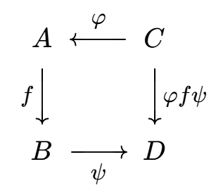
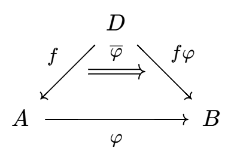
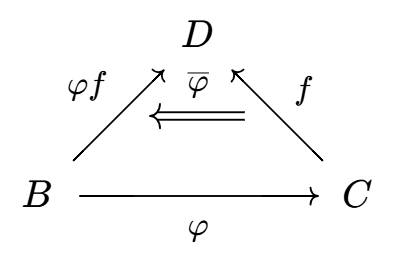
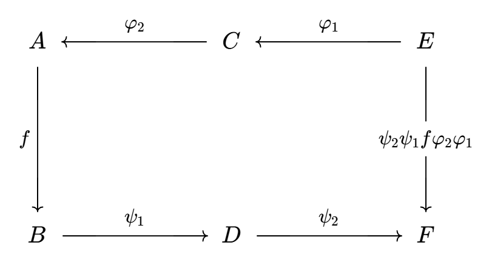

# 对偶模（对偶空间）

- **类似章节**：
  - 高等代数的对偶空间
  - 泛函分析的对偶空间
- **背景**：
  - 态射类和张量积是由已知正合列构造新正合列的常用方法
- **符号约定**：
  - $\M(R)$ 表示环 $R$ 的全体模（左模/右模/双模）

## 态射类的诱导同态

- **（定理4.1）诱导同态定理**：
  - 设 $R$ 是环，$A,B,C,D$ 是R模
  - 若 $\p:C\to A，\psi:B\to D$ 是R模同态
  - 则 $\t:\Hom_R(A,B)\to \Hom_R(C,D)，f\mapsto \psi f \p$ 是阿贝尔群同态
  - 一般记为 $\hom(\p,\psi)$
    - 它只是阿贝尔群范畴中的一个态射，所以用小写hom
    - 注意它不是箭头范畴的态射 
    - 如果 $R$ 是交换环，它就是R模同态
  
  - **证明**：由同态群得R模同态复合封闭性，从而 $\t$ 存在
  - **实例**：$\hom(\p,\id):f\mapsto f\p$ 是原象拉回，$\hom(\id,\psi):f\mapsto \psi f$ 是像的推出
- **诱导同态**：
  - 设 $A,B,D$ 是R模
  - 若存在以下的交换图，则 $\ol\p:\Hom(D,A)\to \Hom(D,B)，f\mapsto f\p$ 称为 $\p$ 的 **左诱导同态**（**协变诱导同态**）
  
  - 若存在以下的交换图，则 $\ol\p:\Hom(C,D)\to \Hom(B,D)，f\mapsto \p f$ 称为 $\p$ 的**右诱导同态**（**逆变诱导同态**）
  
- **诱导同态复合运算法则**：
  - 设 $\p_1:E\to C，\p_2:C\to A，\psi_1:B\to D，\psi_2:D\to F$
  - 则 $\hom(\p_1,\psi_2)\circ \hom(\p_2,\psi_1) = \hom(\p_2\p_1,\psi_2\psi_1)$，指派法则为 $$\Hom(A,B)\to \Hom(E,F)，f\mapsto \psi_1\psi_2 f \p_2\p_1$$
  - 本质是双Hom函子的协变复合性
  
- **传递性**：
  - **协变单射传递性**：若 $\p$ 是单射，则左诱导同态 $\ol \p$ 是单射
  - **逆变满射传递性**：若 $\p$ 是满射，则右诱导同态 $\ol \p$ 是满射
  - **证明**：
    - 反设 $\ol\p(f) = \p f = 0$，则由单射性，只能是 $f = 0$
    - 反设 $\ol\p(f) = f\p = 0$，则由满射性，只能是 $f = 0$

### 正合函子（协变）

- **正合函子**：
  - 设 $F$ 是函子
  - 若对任意正合列 $A\xto{f} B \xto{g} C$，序列 $FA\xto {Ff} FB \xto{Fg} FC$ 也是正合列
  - 则 $F$ 称为正合函子
  - 保正合性的函子
- **短正合函子**：保短正合性的函子
- **保正合定理**：正合函子 $\LR$ 短正合函子
  - **证明**：
    - **必要性**：易得
    - **充分性**：
      - 任取长正合列，由正合列切割定理，将其变为多个短正合列，应用短正合函子。再由正合列粘贴定理即可
- **左正合函子**：保左正合性的函子
- **右正合函子**：保右正合性的函子

### 正合函子（逆变）

- **正合逆变函子**：
  - 设 $F$ 是逆变函子
  - 若对任意正合列 $A\xto{f} B \xto{g} C$，序列 $FC\xto {Fg} FB \xto{Ff} FA$ 也是正合列
  - 则 $F$ 称为正合逆变函子
  - 本质和协变情况相同，只是由于逆变性，序列应当顺序取反
- **左正合逆变函子**：保左正合性的逆变函子

### 正合列的对偶性

- **（定理4.2）诱导正合列1**：设 $R$ 是环，则下列命题等价
  - R模正合列 $$0\to A\xto \p B \xto \psi C$$
  - 任取 $D\in\M(R)$，阿贝尔群正合列（其中 $\ol\p,\ol\psi$ 分别是 $\p,\psi$ 的左诱导同态） $$0\to \Hom_R(D,A)\xto{\ol{\p}} \Hom_R(D,B)\xto{\ol\psi}\Hom_R(D,C)$$
  - 即 $\Hom(D,\cdot)$ 是左正合函子
  - 注意只有左端为零，即只有单射可传递，满射不可传递。右端可无限延伸
  - **证明**：$(1)\to (2)$
    - **单射传递**：由 $\p$ 单射性，易得 $\ol \p$ 也是单射
    - **正合传递（互包）**：
      - 再由正合性，$\psi\p = 0$，易得 $\ol\psi\ol\p = \ol{\psi\p} = 0$，即 $\Im\ol \p \subset \ker\ol \psi$
      - 任取 $g\in \ker\ol\psi$
        - 由定义 $\Im g\subset \ker\psi = \Im\p$
        - 再由于 $\p$ 嵌入性，存在 $\p^{-1}:\Im\p \to A$
        - 综上，若 $h\in\Hom_R(D,A)$ 是复合映射 $D\xto{g} \Im g\subset \Im\ol\p \xto{\p^{-1}} A$，则 $g = \p h = \ol\p(h)$，从而 $\ker\ol\psi \subset\Im \ol\p$
  - **证明**：$(2)\to (1)$
    - 取 $D = \ker\p$，设 $i:D\to A$ 是包含映射
      - 由于 $\ol\p(i) = 0$，由其单射性得 $i=0$，从而 $\p$ 是单射
      - 此时 $0 = \ol\psi\ol\p(1_A) = \psi\p 1_A = \psi\p$，从而 $\Im\p \subset \ker\psi$
    - 取 $D = \ker\psi$，设 $j:D\to B$ 是包含映射
      - 由于 $\ol\psi(j) = 0$，从而 $j\in \Im\ol\p$，即存在 $f:\ker\psi\to A$ 满足 $j = \p f$
      - 取 $\forall x\in \ker\psi$，都有 $x = j(x) = \p j(x)\in \Im\p$，即 $\ker\psi \subset \Im\p$
  - **反例（无右正合性）**：
    - $\Z$ 模正合列 $\Z\to \Z_2\to 0$，但取 $D = \Z_2$ 时 $\Hom(\Z_2,\Z) = 0$，故诱导正合列右端不可能为零
- **（命题4.3）诱导正合列2**：设 $R$ 是环，则下列命题等价
  - R模正合列 $$A\xto \t B \xto \zeta C\to 0$$
  - 任取 $D\in\M(R)$，阿贝尔群正合列（其中 $\ol\t,\ol\zeta$ 分别是 $\t,\zeta$ 的右诱导同态）  $$0\to \Hom_R(C,D)\xto{\ol{\zeta}} \Hom_R(B,D)\xto{\ol\t}\Hom_R(A,D)$$
  - 即 $\Hom(\cdot,D)$ 是逆变左正合函子
  - 注意条件是满射约束，结论是单射约束
  - **证明**：$(1)\to (2)$
    - **左包右**：若 $f\in\ker\ol\t$，则 $\ol\t(f) = 0$，从而 $f(\ker\zeta) = 0$
      - 即诱导同态为 $\ol f:B/\ker\zeta\to D，b+\ker\zeta\mapsto f(b)$
      - 从而存在同构 $\p:B/\ker\zeta\to C，b+\ker\zeta\mapsto \zeta(b)$
      - 则 $\ol\p^{-1}:C\to D$ 是R模同态，满足 $\ol\zeta(\ol f\p^{-1}) = f$，从而 $\ker\ol\t \subset \Im\ol\zeta$
    - **右包左**：同上
  - **证明**：$(2)\to (1)$
    - 取 $D = C/\Im\zeta$，$\pi:C\to D$ 是规范投影
      - 由 $\ol\zeta(\pi) = 0$ 得 $\pi = 0$，从而 $C = \Im\zeta$
    - 取 $D = B/\Im\t$，$\pi:B\to D$ 是规范投影，
      - 从而 $\ker\zeta \subset \Im\t$
    - 取 $D = C$，则 $\ol\t\ol\zeta(1_C) = \zeta\t$，从而 $\Im\t\subset \ker\zeta$
  - **反例（无右正合性）**：
    - $\Z$ 模正合列 $0\to \Z\to \Q$，但取 $D = \Z$ 时 $\Hom(\Q,\Z) = 0$，故诱导正合列右端不可能为零

### 正合性的完全对偶传递

- **（命题4.4）分裂对偶性**：若将上面三列都改为短正合情况，则分裂性相同
  - 短正合列两端为零，约束更强
  - **证明**：
    - $(1)\to(3)$：
      - 由分裂定理，此时 $\p$ 存在左逆 $\a$，易得诱导同态满足 $\ol\p\ol\a = 1_{\Hom_R(A,D)}$，从而 $\ol\p$ 是满同态，由分裂定理即得结论
    - $(3)\to(1)$：
      - 设 $D = A$，则 $\ol\p(f) = 1_A$，从而 $\p$ 为单同态。由分裂定理即得结论
- **（定理4.5）投射模对偶性**：设 $R$ 是环，$P$ 是它的模，则下面几个命题等价
  - $P$ 是投射模
  - **满同态对偶性**：
    - 若 $\psi:B\to C$ 是R模满同态
    - 则 $\ol\psi:\Hom_R(P,B)\to \Hom_R(P,C)$ 是阿贝尔群满同态
  - **短正合对偶性**：
    - 若 $0\to A\xto \p B \xto \psi C\to 0$ 是R模短正合列
    - 则 $0\to \Hom_R(P,A)\xto{\ol{\p}} \Hom_R(P,B)\xto{\ol\psi}\Hom_R(P,C)\to 0$ 是阿贝尔群短正合列
  - 投射模的左Hom函子是短正合函子
  - **证明**：
    - $(1)\LR(2)$：由交换图 $\prol{B}{g}\xto{\psi}\pror{C}{f}{P}\to 0$ 易得结论
    - $(2)\to (3)$：诱导正合列定理
    - $(3)\to (2)$：
      - 取满同态 $\psi:B\to C$，设 $A = \ker\psi$，应用到 $0\to A\xto{\subset}B\xto{\psi}C\to 0$ 即可
- **（定理4.6）内射模对偶性**：设 $R$ 是环，$J$ 是它的模，则下面几个命题等价
  - $J$ 是内射模
  - **单同态对偶性**：
    - 若 $\t:A\to B$ 是R模单同态
    - 则 $\ol\psi:\Hom_R(B,J)\to \Hom_R(A,J)$ 是阿贝尔群单同态
  - **短正合对偶性**：
    - 若 $0\to A\xto \t B \xto \zeta C\to 0$ 是R模短正合列
    - 则 $0\to \Hom_R(C,J)\xto{\ol{\zeta}} \Hom_R(B,J)\xto{\ol\t}\Hom_R(A,J)\to 0$ 是阿贝尔群短正合列
  - 内射模的右Hom函子是逆变短正合函子
  - **证明**：仿照上面证明即可
- **（定理4.7）直积对偶性**：
  - 设 $A_i,B_j$ 是环 $R$ 上的两族模
  - 则
    - $\Hom_R \Big(\sum\limits_{i\in I}A_i,B \Big) \cong \prod\limits_{i\in I} \Hom_R \Big(A_i,B \Big)$
    - $\Hom_R \Big(A,\prod\limits_{j\in J} B_j \Big) \cong \prod\limits_{j\in J} \Hom_R \Big(A,B_j \Big)$
  - **证明**：
    - 设 $\iota_i:A_i\to \sum\limits_{i\in I}A_i$ 是规范逆投影
  - **推论**：
    - 若指标集有限，则 $A_i,B_i$ 的直和等价于直积
    - 若指标集无限，则直和不一定等价于直积

## 双模

- **R-S双模**：$A$ 既是左R模，又是右S模，且满足结合律 $r(as) = (ra)s$
  - **实例**：
    - 环 $R$ 自身是R-R双模
    - 交换环 $R$ 的模都是R-R双模
- **（定理4.8）双模对偶**：
  - 设 $R,S$ 是环，$A$ 是左R模，$B$ 是R-S双模
  - 则（逆变结论）
    - $\Hom_R(A,B)$ 是右S模，作用为 $(fs)(a) \mapsto \Big( f(a) \Big) s$
    - 若 $\p:A\to A'$ 是左R模同态，则存在右R模同态 $\ol\p:\Hom_R(A',B)\to \Hom_R(A,B)$
  - 且（协变结论）
    - $\Hom_R(B,A)$ 是左S模，作用为 $(sf)(a) \mapsto f(as)$
    - 若 $\p:A\to A'$ 是左R模同态，则存在左R模同态 $\ol\p:\Hom_R(B,A)\to \Hom_R(B,A')$
  - **证明**：
    - 定义验证易得是模
    - 此时右诱导同态是右R模同态，左诱导同态是左R模同态
  - **推论**：
    - 若 $A,B$ 都是R-S双模，则 $\Hom_R(A,B)$ 和 $\Hom_{R,S}(A,B)$ 都是R-S双模
    - 当且仅当 $R = S$ 时，$\Hom_R(A,B)$ 是R-R双模
- **（定理4.9）向量直线同构**：若 $A$ 是含幺环 $R$ 上的模，则 $A\cong \Hom_R(R,A)$
  - 注意，左模和右模都同构于 $\Hom(R,A)$
  - **证明**：
    - 已知 $R$ 是R-R双模，$\Hom_R(R,A)$ 是左R模
    - 易得 $\p:\Hom_R(R,A)\to A，f\mapsto f(1_R)$ 是R模同态
    - 易得 $\psi:A\to \Hom_R(R,A)，a\mapsto f_a$，其中 $f_a(r) = ra$ 是R模同态
      - 易得 $\p\psi = 1_A，\psi\p = 1_{\Hom_R(R,A)}$，故互逆，从而是同构
  - **实例**：
    - **有限维实线性空间**：
      - 由线性得 $\Hom(\R,\R^n)$ 满足 $f(t) = tf(1)$，即 $f$ 的图像是过原点的直线，由直线上的点 $f(1)$ 唯一决定
      - 显然（过原点的直线）和（方向向量）一一对应

### 对偶模

- **对偶模**：若 $A$ 是R模，则 $A^* = \Hom_R(A,R)$ 称为它的对偶模
  - 注意，左模和右模的对偶模都是 $\Hom_R(A,R)$
  - **实例**：
    - **有限维实线性空间**：线性空间 $V$ 的对偶空间是全体线性函数 $L(V,\R)$
- **（定理4.10）左右对偶定理**：设 $A,B,C$ 是环 $R$ 上的左模
  - **对偶映射**：
    - 若 $\p:A\to C$ 是左R模同态
    - 则 $\ol\p:C^*\to A^*$ 是右R模同态
  - **直和传递性**：存在R模同构 $(A\oplus C)^* \cong A^*\oplus C^*$
  - **短正合列传递条件**：
    - 若 $R$ 是除环，$0\to A\xto \t B \xto \zeta C\to 0$ 是左向量空间的短正合列
    - 则 $0\to C^*\xto{\ol\t} B^* \xto{\zeta} A^*\to 0$ 是右向量空间的短正合列
  - **证明**：同上

### 第二对偶模

- **第二对偶模**：$A^{**} = (A^*)^* = \Hom_R(A^*,R)$
- **作用符号定理**：
  - 设 $A$ 是左R模，$a\in A，f\in A^*$
  - 若设 $\lang a,f \rang = \lang f,a \rang = f(a)$，则该符号满足双线性
  - **证明**：
    - 易得 $\ip{r_1a_1 + r_2a_2,f} = r_1\ip{a_1,f} + r_2\ip{a_2,f}$
    - 易得 $\ip{a,fr_1 + fr_2} = \ip{a,f}r_1 + \ip{a,f}r_2$
- **典范取值同态**：
  - 设 $A$ 是左R模
  - 则存在同态 $\t:A\to A^{**}$，其中 $\t(a):f\mapsto f(a)$
  - 即 $\t$ 将 $a$ 映射为（$a$ 的取值映射）
  - **证明**：验证即可
- **（定理4.11）自由模对偶定理**：
  - 设 $F$ 是含幺环 $R$ 的自由左模，基为 $X$
  - 若 $f_x:F\to R，y\mapsto \d_{xy}$ 是同态（这里 $\d_{xy}$ 是Kronecker记号）
  - 则
    - **对偶基**：$\{f_x\mid x\in X\}$ 是 $F^*$ 的 $|X|$ 基数线性无关集
    - **自由传递**：若 $X$ 有限，则 $F^*$ 是自由右R模
  - **证明（基）**：
    - 若 $\sum\limits^n_{i=1} f_{x_i}r_i = 0$，则 $$0 = \ip{x_j,0} = \ip{x_j,\sum\limits^n_{i=1}f_{x_i}r_i} = \sum\limits_{i\in I} \ip{x_j,f_{x_i}} r_i = \sum\limits_{i\in I} \d_{ij}r_i = r_j$$，从而满足非零式，线性无关
  - **证明（自由性）**：
    - 设 $X = \set{x_1,...,x_n}，f\in F^*，s_i = \lang f,x_i \rang\in R，f_{x_i} = f_i$
    - 若 $u\in F$，由自由性，可设 $u = \sum\limits^n_{i=1} r_ix_i$，则 $$\ip{ u,\sum\limits^n_{j=1} f_js_j } = \sum\limits_{i}\sum\limits_{j} r_i\d_{ij}s_j =  \sum\limits_{i} r_is_i = \lang u,f \rang$$，从而 $f = \sum\limits^n_{i=1} f_is_i$，由任意性得其即为 $F^*$ 的基，从而 $F^*$ 自由
- **（定理4.12）第二对偶定理**：
  - 设 $A$ 是环 $R$ 上左模，$\t:A\to A^{**}$ 是典范取值同态
  - 若 $R$ 含幺，$A$ 自由，则 $\t$ 是单同态
  - 若 $R$ 含幺，$A$ 自由且基有限，则 $\t$ 是同构
  - **证明（单性）**：
    - 设 $X$ 是基，$a = \sum\limits^n_{i=1} r_ix_i$
    - 若 $\t(a) = 0$，则 $\forall f\in A^*，0 = \lang a,f \rang = \sum\limits_{i} r_i\lang f,x_i \rang$
      - 取 $f = f_{x_j}$ 时得 $r_j = 0$，从而 $a = \sum 0 = 0$，即 $\ker\t = 0$，是单同态
  - **证明（同构）**：
    - 自由对偶定理得
      - $A^*$ 在基 $\hkh{f_x\Bigm| x\in X}$ 上自由
      - $A^{**}$ 在基 $\hkh{g_x:A^*\to R，f_y\mapsto \d_{xy}\Bigm| x\in X}$ 上自由
    - 再由于 $\t(x)\in A^{**}$ 是同态 $A^*\to R，f_y\mapsto \lang x,f_y \rang = \d_{xy} = g_x(f_y)$，从而 $\Im \t = A^{**}$，是满同态

## 习题

- $A,B$ 是交换群，$m,n\in\Z$ 满足 $mA = 0 = nB$，则 $\Hom(A,B)$ 中元素的阶均整除 $(m,n)$
- 设 $\pi:\Z\to \Z_2$ 是规范满同态，则诱导同态 $\ol\pi:\Hom(\Z_2,\Z) \to \Hom(\Z_2,\Z_2)$ 是零映射
  - **推论**：由于 $\Hom(Z_2,Z_2)\neq 0$，诱导同态不是满同态
- 设 $R,S$ 是环，$A_R，_SB_R，_SC_R，D_R$ 是模，$\Hom_R$ 是所有右R模同态，则
  - $\Hom_R(A,B)$ 是左S模，作用为 $sf\times a = s(f(a))$
  - 若 $\p:A\to A'$ 是右R模同态，则诱导同态 $\ol \p:\Hom_R(A',B)\to \Hom_R(A,B)$ 是左S模
  - $\Hom_R(C,D)$ 是右R模，作用为 $gs\times c = g(sc)$
  - 若 $\psi:D\to D'$ 是右R模同态，则 $\ol\psi:\Hom_R(C,D)\to \Hom_R(C,D')$ 是右S模同态
  - **证明**：
- 设 $R$ 是含幺环，则存在环同构 $\Hom_R(R,R)\cong R^{op}$，其中 $\Hom_R$ 指左R模同态
  - **推论**：若 $R$ 交换，则也同构于自身
- **零化子**：设 $S$ 是除环 $D$ 的向量空间 $V$ 上的非空子集，则 $V^*$ 上的子集 $S^0 = \set{f\in V^*\mid \forall s\in S，\lang s,f \rang = 0}$ 称为 $S$ 的零化子
  - **平凡性**：**幺元零化子**：$0^0 = V^*$，**总空间零化子**：$V^0 = 0$
    - 即 $S\neq 0\red\Rt S^0\neq V^*$
  - 若 $W$ 是子空间，

## 例子

- 设 $A$ 是交换群，$m$ 是正整数，则 $\Hom(Z_m,A)\cong A[m]$
- $\Hom(Z_m,Z_n) \cong Z_{(m,n)}$
- $Z_m$ 在充当 $\Z$ 模时有 $Z_m^* = 0$
- $\forall k\geq 1$，$Z_m$ 是 $Z_{mk}$ 模，且此时 $Z_m^*\cong Z_m$
- 