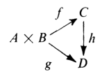
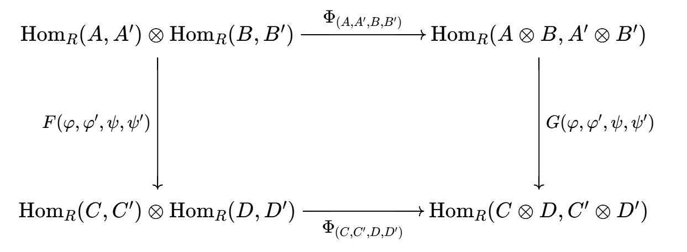

# 多重线性代数

- **符号约定**：
  - $A\otimes_R B$ 表示R模 $A,B$ 的张量积，一般简写为 $A\otimes B$
- **背景**：
  - 高代已经学了双线性函数，它唯一对应一个矩阵（双线性型）
  - 张量其实就是对多重线性函数的统称，矩阵（双线性型）就是二阶张量，往上推广就是高阶张量
  - 线性函数同时也是对偶空间的元素。通过取对偶可令张量阶数上升或下降

## 平衡映射

- **平衡映射（中线性映射）**：
  - 设 $A$ 是右R模，$B$ 是左R模，$C$ 是阿贝尔群
  - 若映射 $f:A\times B\to C$ 满足下列条件，则称为R平衡映射
  - **双加性**：
    - $f(a_1 + a_2,b) = f(a_1,b) + f(a_2,b)$
    - $f(a,b_1 + b_2) = f(a,b_1) + f(a,b_2)$
  - **平衡条件**：$f(ar,b) = f(a,rb)$
- **平衡映射群**：全体平衡映射构成一个群
- **平衡子群**：
  - 设 $A$ 是右R模，$B$ 是左R模，$F$ 是 $A\times B$ 生成的自由阿贝尔群
  - 设 $$  S_1 = \hkh{(a_1+a_2,b)-(a_1,b)-(a_2,b)\Bigm| a_1,a_2\in A，b\in B}  $$ $$ S_2 = \hkh{(a,b_1+b_2)-(a,b_1)-(a,b_2)\Bigm| a\in A，b_1,b_2\in B} $$ $$  S_3 = \hkh{(ar,b)-(a,rb)\Bigm| a\in A，b\in B,r\in R}  $$
  - 则 $S = \ip{S_1,S_2,S_3}$ 称为 $F$ 的平衡子群

## 张量积

- **模的张量积 $A\otimes_R B$**：
  - 设
    - $A$ 是右R模，$B$ 是左R模，$F$ 是集合 $A\times B$ 上的自由阿贝尔群
    - $S$ 是 $F$ 的平衡子群
  - 则 $F/S$ 即为张量积 $A\otimes B$
  - 类似（商去换位子群得到交换群），这里（商去平衡子群得到张量积）
    - 也就是说，张量积是满足双加性和平衡条件的元素
  - 实际上也能用运算性质直接定义张量积，但我们不能保证这个对象一定存在。通过采取"商去平衡子群"的定义，可以同时证明张量积的存在性
- **核定理**：$F$ 的平衡子群是 $F$ 上全体平衡映射核的交集
  - **证明（互包法）**：
    - 易得平衡映射 $f:A\times B\to C$ 可唯一延拓为群同态 $f':F\to C$
      - 只有群同态才有核的概念，所以要先延拓
    - 定义易得平衡子群的生成元都在某个 $\ker f'$ 中，即 $S\subset \bigcap \ker f'$
    - 设商映射 $\pi:F\to F/S$，则 $S = \ker\pi$
      - 再由于 $\pi$ 也是平衡映射，故 $\bigcap \ker f'\subset S$
- **运算定理**：张量积满足双加性和平衡性
  - **证明**：由核定理直得
- **典范平衡映射**：$i:A\times B\to A\otimes B，(a,b)\mapsto a\otimes b$ 
  - **平衡性**
    - **证明**：由张量积的平衡性易得
  - **准同态性**：$i$ 不是群同态，但保平衡延拓到 $F$ 后是群同态
    - **证明**：由张量积的双加性易得
  - **非满射性**
    - **证明**：下面延拓后是满射，故此时不是满射
  - **非单射性**
    - **证明**：
      - 由双加性 + 平衡性易得 $\ker i = \hkh{(a,b)\mid a=0\ 或\ b=0}$
      - 显然它非平凡
- **典范平衡同态**：$\pi:F\to A\otimes B，\sum\limits_{i} n_i(a_i,b_i)\mapsto \sum\limits_i n_i(a_i\otimes b_i)$ 
  - **平衡性**
  - **同态性**
  - **满射性**
    - **证明**：同态基本定理直得
  - **非单射性**

### 张量

- **张量**：模的张量积中的元素
  - **实例**：
    - 设 $R = \K[x]$，$A = R$ 是右R模，$B = R$ 是左R模
      - 则平衡子群 $S = 0$，故 $A\otimes B \cong R$，张量积 $f\otimes g = fg$
- **可分张量**：不能写成张量积的张量
  - **反例**：
    - 张量积的和不一定是张量积
- **分解定理**：可分张量一定能表示成张量积的和，且该表示不唯一
  - **证明**：
    - 由典范平衡同态的满射性直得结论
  - **实例**：

### 张量积的其它定义

- **生成定义法**：张量积由其所有元素的陪集生成
  - **证明**：易得生成元系具有商群传递性
- **交换图定义法**：若下面典范分解定理的图可交换，则称 $A\otimes B$ 是张量积
  - 同时能得到张量积的唯一性

### 张量积范畴

- **平衡映射范畴 $\mathfrak{Bal}(A,B)$**：
  - **对象**： $A\times B$ 的所有平衡映射
  - **态射**：使得下图交换的阿贝尔群同态 $h:C\to D$
  
<!-- - **张量积的泛性质**：张量积 $A\otimes B$ 是 $\mf M(A,B)$ 的始对象
  - **证明**：
    - 由典范平衡同态的存在性易得结论 -->
- **（定理5.2）典范分解定理**：
  - 设 $A$ 是右R模，$B$ 是左R模，$C$ 是阿贝尔群，$i$ 是典范平衡映射
  - 任取平衡映射 $f:A\times B\to C$，存在唯一群同态 $\ol f:A\otimes B\to C$ 满足 $\ol fi = f$
  - 任何一个平衡映射都可提升到张量积上，变为群同态
  - 典范平衡映射 $i$ （以及张量积）是平衡映射范畴 $\mf{Bal}(A,B)$ 的泛对象
  - **证明（存在性）**：
    - 设 $F$ 是 $A\times B$ 上的自由阿贝尔群，$S$ 是平衡子群
    - 由 $F$ 自由性，对于 $g$ 有唯一的 $g_1:F\to C$
    - 由于 $S\subset \ker g_1$，故存在商诱导同态 $$\ol g:F/S\to C，\Big[ (a,b)+S \Big]\mapsto g_1\Big[(a,b)\Big] = g(a,b)$$
      - 再由张量积定义即得结论
  - **证明（唯一性）**：反设还存在 $hi = g$，则计算易得等价
  - **推论**：彼此同构的群的张量积等价

### 张量积的函子性

- **（推论5.3）张量积的函子性**：
  - 设
    - $A,A'$ 是右R模，$B,B'$ 是左R模
    - $f:A\to A'$ 和 $g:B\to B'$ 是模同态
  - 则存在唯一群同态 $f\otimes g:A\otimes B\to A'\otimes B'，a\otimes b\mapsto f(a)\otimes g(b)$
  - 张量积是右R模范畴和左R模范畴的积函子，这里就是它对态射的作用
  - **证明**：
    - 定义易得 $h:A\times B\to A'\otimes B'，(a,b) \mapsto f(a)\otimes g(b)$ 是平衡映射
    - 由典范分解定理，存在唯一的 $\ol h$，其即为所需群同态
- **自然变换**：$$\Phi:\Hom_R(A,A')\otimes \Hom_R(B,B') \to \Hom_\Z(A\otimes B, A'\otimes B')\\\ \\ f\otimes g \mapsto 张量积同态 $$
  - **自然性**：
    - 设函子 $F:(A,A',B,B')\to \Hom_R(A,A')\otimes \Hom_R(B,B')$
    - 设函子 $G:(A,A',B,B')\to \Hom_\Z(A\otimes B, A'\otimes B')$
    - 则 $\Phi$ 是它们的自然变换
    - **证明**：
      - 设态射 $\begin{cases} \p:A\to C & \p':A'\to C' \\\\ \psi:B\to D & \psi':B'\to D' \end{cases}$
      - 易得下面的图交换，从而满足自然映射定义
    
    
  - **同构条件**：
    - 域上的有限维向量空间
    - $A$ 或 $B$ 是有限生成投射模
- **（命题5.4）张量积的右正合列**：
  - 左R模正合列 $$ A\xto f B\xto g C\to 0 $$
  - 则任取右R模 $D$，下面都是阿贝尔群正合列 $$D\otimes A\xto{1_D\otimes f} D\otimes B\xto{1_D\otimes g} D\times C\to 0$$
  - **证明**：
  - **反例（逆命题不成立）**：
    - 设 $R = \Z$
      - 易得 $\Z\xto{乘2} 2\Z\xto{乘0} 0$ 不正合
      - 取 $D = 0$ 时，张量序列 $0\to 0 \to 0$ 正合
      - 取 $D = \Q$ 时，张量序列 $\Q\xto{乘2} \Q \xto{乘0} 0$ 正合
- **张量积的左正合列**：

### 双模张量积

- 设 $M$ 是R-S双模，$N$ 是S-T双模，则 $M\otimes_S N$ 是R-T双模，且满足 $r(m\otimes n)t = (rm)\otimes (nt)$
- $N$ 是R-S双模，则存在双模同构
- **（定理5.5）张量同态定理**：
  - 设 $R,S$ 是环，$_S A_R，_RB，C_R，_RD_S$ 是模
  - 则
    - $A\otimes_R B$ 是左S模，且满足 $s(a\otimes b) = sa\otimes b$
    - 若 $f:A\to A'$ 是S-R双模同态，$g:B\to B'$ 是R模同态
      - 则 $f\otimes g:A\otimes_R B\to A'\otimes B'$ 是左S模同态
  - 且
    - $C\otimes_R D$ 是右S模，且满足 $(c\otimes d)s = c\otimes ds$
    - 若 $h:C\to C'$ 是R模同态，$k:D\to D'$ 是R-S双模同态
      - 则 $h\otimes k:C\otimes_R D'$ 是右S模同态
  - **证明**：

## 双线性映射

- **双线性映射**：
  - 设 $R$ 是交换环，$A,B,C$ 是其上的模
  - 则满足以下条件的映射 $f:A\times B\to C$ 就是双线性映射
  - **双线性**：
    - $f\ddkh{r(a_1+a_2),b} = r\ddkh{f(a_1,b) + f(a_2,b)}$
    - ...
  - **对称性**：$f(a,b) = f(b,a)$
  - 添加交换性，将像规定为模，此时允许将双加性强化为双线性，平衡性强化为对称性
  - 当环交换时，双线性映射和平衡映射定义的张量积是等价的
  - **实例**：
    - 设 $R$ 交换，$A$ 是R模，则**取值映射** $A\times A^*\to R，(a,f)\mapsto \lang a,f \rang$ 是双线性的

### 双线性映射范畴

- **双线性映射范畴 $\mf{Bil}(A,B)$**：
  - **对象**：$A\times B$ 的所有双线性映射
  - **态射**：使得下图交换的阿贝尔群同态
  
- **典范双线性映射**：$i:A\times B\to A\otimes_R B，(a,b)\mapsto a\otimes b$
- **（定理5.6）典范分解定理**：
  - 设 $R$ 是交换环，$A,B,C$ 是R模，$i$ 是典范平衡映射
  - 任取双线性映射 $f:A\times B\to C$，存在唯一群同态 $\ol f:A\otimes B\to C$ 满足 $\ol fi = f$
  - 任何一个双线性映射都可提升到张量积上，变为群同态
  - 典范双线性映射 $i$ （以及张量积）是双线性映射范畴 $\mf{Bil}(A,B)$ 的泛对象
- **（定理5.7）张量积自反性**：
  - 若 $R$ 是含幺环，$A$ 是右模，$B$ 是左模
  - 则存在R模同构 $A\otimes R \cong A，R\otimes B\cong B$
  - **证明（仅B）**：
    - 已知 $R$ 是R-R双模，$R\otimes_R B$ 是左R模，$R\times B\to B，(r,b)\mapsto rb$ 是平衡映射
    - 存在群同态 $\a:R\otimes_R B\to B，r\otimes b\mapsto rb$，同时也是左R模同态
    - $\b:B\to R\otimes_R B，b\mapsto 1_R\otimes b$ 是R模同态，$\a\b = 1_B，\b\a = 1_{R\otimes_R B}$，从而得到同构关系
- **（定理5.8）张量积结合律**：
  - 设 $R,S$ 是环，$A$ 是右R模, $B$ 是S-R双模，$C$ 是左S模
  - 则存在同构 $(A\otimes_R B)\otimes_S C \cong A\otimes_R (B\otimes_S C)$
  - **证明**：
- **（定理5.9）直积传递性**：
  - 设若 $R$ 是环，$A,A_i$ 是右R模，$B,B_j$ 是左R模
  - 则有以下群同构 $$\dkh{\sum\limits_{i\in I}A_i}\otimes B \cong \sum\limits_{i\in I} (A_i\otimes B)$$ $$A\otimes \dkh{\sum\limits_{j\in J} B_j} \cong \sum\limits_{j\in J} (A\otimes B_j)$$
  - **证明**：
- **（定理5.10）伴随结合律**：
  - 设 $R,S$ 是环，$A$ 是右R模，$B$ 是R-S双模，$C$ 是右S模
  - 则存在阿贝尔群同构 $$\a: \text{Hom}_S(A\otimes_R B,C) \cong \text{Hom}_R(A,\text{Hom}_S (B,C))$$
  - 同构映射为 $f:A\otimes_R B\to C，\ffkh{(\a f)(a)}(b) = f(a\otimes b)$
  - **证明**：
- **（定理5.11）基传递性**：
  - 设 $R$ 是含幺环，$A$ 是右R模，$F$ 是自由左R模，基为 $Y = \{y_1,...\}$
  - 则 $\forall u\in A\otimes F$ 可被唯一表示为 $\sum\limits^n_{i=1} a_i\otimes y_i$
  - **证明**：
- **（推论5.12）自由传递性**：
  - 设 $R$ 是含幺环，$A$ 是自由右R模，$B$ 是自由左R模，基为 $X,Y$
  - 则 $A\otimes B$ 是自由右R模，基为 $W = \{x\otimes y\}$，基数为 $|X||Y|$
  - **证明**：
- **（推论5.13）子环自由传递性**：
  - 设 $S$ 是含幺环，$R$ 是其含幺子环
  - 若 $F$ 是自由左R模，基为 $X$
  - 则 $S \otimes F$ 是自由左S模，基为 $\{1_S\otimes x\mid x\in X\}$，基数为 $|X|$
  - **证明**：

### 张量积的对偶

- **内积空间对偶性**：