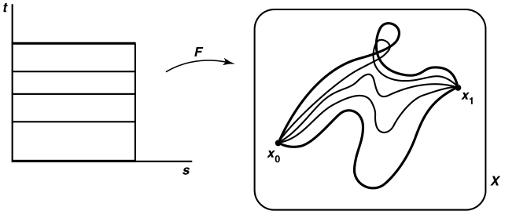
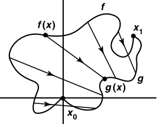
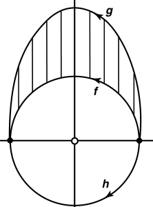
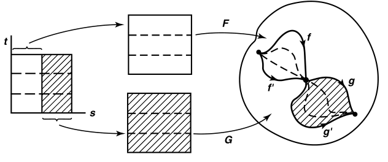
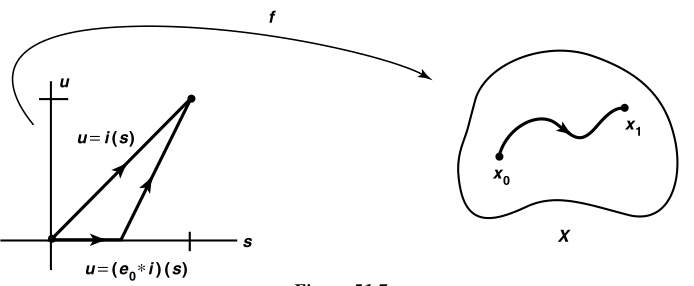
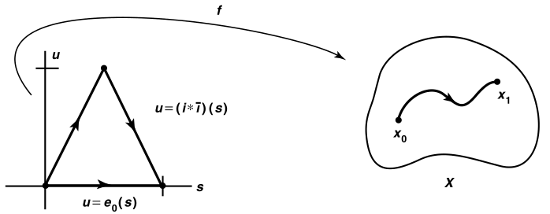
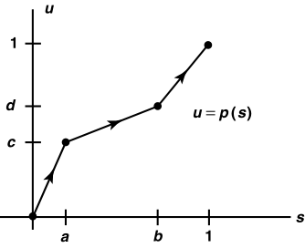

# Munkres

- 证明不同胚的方法
  - **定义法**：不存在同胚映射
  - **性质法**：存在拓扑性质无法传递
  - **代数法**：基本群不同构

## 道路同伦

- **映射的同伦**：
  - 设 $f,f':X\to Y$ 均连续
  - 若存在连续映射 $F:X\times I\to Y$ 使得 $\begin{cases} F(x,0) = f(x) \\ F(x,1) = f'(x) \end{cases} \quad (\forall x)$
  - 则 $f\simeq f'$
  - **理解**：参数族 $\{f_t\}$，其中 $t$ 从 $0\to 1$ 时，$f$ 连续变形为 $f'$
    - （$I$ 一般取为 $[0,1]$）
  - **本质**：
- **零伦映射**：同伦于常映射
  - **反例**：恒等映射不是零伦映射，除非限制在一个点上
- **道路同伦**：
  - 设 $f,f':[0,1]\to X$ 是两个起始点相同的道路
  - 若存在连续映射 $F:I\times I\to X$ 使得 $\begin{cases} F(s,0) = f(s) & F(s,1) = f'(s) \\ F(0,t) = x_0 & F(1,t) = x_1  \end{cases}\\(\forall s,t)$
  - 则 $f\simeq_p f'$
  - **理解**：起始点相同（存在不动点）的同伦
   
- **（引理51.1）同伦等价性**：道路同伦和同伦都是等价关系
  - **证明**：
    - **自反性**：$F(x,t) = f(x)$ 即为自同伦
      - $t$ 上不变的参数函数族
    - **交换性**：设 $F$ 是 $f,f'$ 的同伦，则 $G(x,t) = F(x,1-t)$ 是 $f',f$ 的同伦
      - 将道路首尾颠倒的换元罢了
    - **传递性**：设 $F$ 是 $f,f'$ 的同伦，$F'$ 是 $f',f''$ 的同伦
      -  设 $G(x,t) =  \begin{cases} F(x,2t) & t\in [0,\dfrac{1}{2}] \\ F'(x,2t-1)& t\in [\dfrac{1}{2},1] \end{cases}$，易得其连续
      - 从而是 $f,f''$ 的同伦
      - 将两个同伦拼接在前后段上，同时将 $t$ 上的变化加速了
  - **推论**：两种同伦具有传递性，故可定义 **(道路) 同伦类** $[f]$
  - **实例**：
    - **直线同伦**：$f,g:X\to \R^2$，同伦映射 $F(x,t) = (1-t)f(x) + tg(x)$
    - **圆同伦**：设 $X = \R^2-\{0\}$，则 $\begin{cases} f(s) = (\cos\pi s,\sin\pi s) \\ g(s) = (\cos \pi s,2\sin\pi s) \end{cases}$ 是直线同伦，而 $h = (\cos\pi s,-\sin\pi s)$ 在下半平面，因为要穿过挖去的原点，故不同伦于 $f$
     

#### 习题

- **复合传递性**：若 $k:X\to Y$ 是连续映射，$F$ 是 $X$ 上 $f,f'$ 的道路同伦，则 $k\circ F$ 是 $Y$ 上 $k\circ f,k\circ f'$ 的道路同伦
  - **证明**：定义即可
  - **理解**：同伦是拓扑性质，可由连续映射传递
- **复合运算性**：若 $k:X\to Y$ 是连续映射，$f(1) = g(0)$ 是 $X$ 的道路
  - 则 $k\circ (f*g) = (k\circ f) * (k\circ g)$
  - **证明**：
    - $k\circ (f*g) = \begin{cases} k\circ f(2s) & s\in [0,\dfrac{1}{2}] \\ k\circ g(2s-1) & s\in [\dfrac{1}{2},1] \end{cases} = 右式$
    - **理解**：复合运算与拼接运算是独立的
- **正线性映射的逆封闭性**：$p:[a,b]\to [c,d]，x\mapsto (mx + k)$ 若是正的，则其同伦逆也是正线性映射
  - **证明**：显然
  - **推论**：复合也同理
- **$I$ 的平凡性**：
  - $\forall X$，$X$ 到 $I$ 的映射同伦类只有一个元素
    - **证明**：
  - 若 $X$ 道路连通，则 $I$ 到 $X$ 的同伦类只有一个元素
    - **证明**：
- **可收缩空间**：其上的恒等映射 $i_X:X\to X$ 不是零伦
  - **实例**：
    - $I,\R$
  - **道路连通性**：
  - **平凡条件**：
    - 若 $Y$ 可收缩，则 $\forall X$ 到 $Y$ 的映射同伦类只有一个元素
      - **证明**：
    - 若 $X$ 可收缩，$Y$ 道路连通，则 $X$ 到 $Y$ 的映射同伦类只有一个元素
      - **证明**：

### 广群

- **同伦积**：$f*g \deq h(s) = \begin{cases} f(2s) & s\in[0,\dfrac{1}{2}] \\ g(2s-1) & s\in [\dfrac{1}{2},1] \end{cases}$
  - **理解**：类似同伦传递性，将两个映射拼接起来，形成中间经过定点的同伦
  - **积等价性**：$[f*g] = [f]*[g]$
    - **元素分析互包证明**：麻烦
    - **定义证明**：
      - 任取 $F:f'\simeq f$ 和 $G:g'\simeq g$
      - 则映射 $H(s) = \begin{cases} F(2s) & s\in [0,\dfrac{1}{2}] \\ G(2s-1) & s\in [\dfrac{1}{2},1] \end{cases}$ 即为 $f'*g'$ 和 $f*g$ 的同伦
    - **理解**：如下图
    
  - **非群性（不封闭）**：为了保持连续性，$[f]*[g]$ 仅定义在 $f(1) = g(0)$ 的映射上
- **（定理51.2）广群性**：
  - **左幺右幺存在性**：设常映射 $e_i(s) \equiv i\in X$，则 $\begin{cases} e_L = f\circ e_0 \\  e_R = f\circ e_1 \end{cases}$
    - **证明**：
      - 设 $e_0$ 是 $I$ 上恒 $0$ 映射，$i:I\to I$ 是恒等映射，则 $e_0*i$ 是 $I$ 上 $0\to 1$ 的道路，体现在坐标系中即为下面的左图
      - 由 $I$ 是凸集，得存在 $i$ 和 $e_0*i$ 的道路同伦 $G$
      - 由复合传递性 + 复合运算性
        - $(f\circ G):\Big[ f\circ i \Big] \simeq_p \Big[ f\circ (e_0*i) \color{chartreuse}{= (f\circ e_0)*(f\circ i)}$ $\Big]$ $\\\whhh$ 即 $ f\simeq_p (e_{x_0}\circ f)$
        - 由积等价性，$[f] = [e_{x_0}]*[f]$，即常映射 $e_{x_0}$ 是同伦类的左幺
      - 同理，$e_1$ 是 $I$ 上恒 $1$ 映射，则 $[f]*[e_{x_1}] = [f]$，其为右幺
      
    - **理解**：
      - 左幺与 $f$ 拼接，前半段是起点 $x_0$，后半段是正常的 $f$，则总体上看来还是 $f$，只是加速了而已
      - $f$ 与右幺拼接，后半段是终点 $x_1$，前半段是正常的 $f$，则总体上看来还是 $f$，只是加速了而已
    - **推论**：当 $x_0 = x_1$，即道路为环路时，左右幺相等，幺元唯一
  - **可逆性**：逆写作 $\ol f = f\circ \ol i$
    - **证明**：设 $\ol i(s) = 1-s$，则 $i*\ol i$ 在 $I$ 上是 $0\to 0$ 的道路，从而和 $e_0$ 首尾相同。 则存在 $H$ 是它们的同伦
      - 此时 $(f\circ H): \Big[ f\circ e_0 \Big]\simeq_p \Big[ (f\circ i)*(f\circ \ol i) \Big]$，即 $e_{x_0} \simeq f*\ol f$
        - 从而 $[e_{x_0}] = [f]*[\ol f]$，是互逆关系
      - $e_1$ 同理得 $[\ol f]*[f] = [e_{x_1}]$
      
    - **理解**：道路的倒逆换元而已。逆元本质是反方向的道路
  - **结合律**：$(f*g)*h = f*(g*h)$
    - **证明**：设 $f(1) = g(0)，g(1) = h(0)$ 是 $X$ 上的道路
      - 选择 $(0<a < b < 1)\in I$，设 $X$ 上道路 $k_{a,b} = \begin{cases} f & s\in [0,a] \\ g & s\in [a,b] \\ h & s\in [b,1] \end{cases}$
      - 设 $p:I\to I$ 如下图，证明 $k_{c,d}\circ p = k_{a,b}$ 即可
        - 再由 $p$ 为 $I$ 上 $0\to 1$ 的道路，故存在道路同伦 $P:p\simeq_p i$
        - 再由复合传递性，即得 $(k_{c,d}\circ P):\Big[ k_{c,d}\circ p \Big] \simeq_p \Big[ k_{a,b}\circ i \Big]$
        - 从而 $k_{a,b}$ 和任意 $(0<c<d<1)$ 的道路 $k_{c,d}$ 同伦
      
    - **实例**：
      - $g$ 先拼接 $h$，再拼接 $f$：
        - 此时 $g$ 和 $h$ 先对半分，拼接好后的整体再和 $f$ 对半分
        - 故 $f$ 占 $1/2$ 长度，$g,h$ 各占 $1/4$ 长度
        - 即 $f*(g*h) = \large k_{\frac{1}{2},\frac{3}{4}}$，$a = \dfrac{1}{2}，b = \dfrac{3}{4}$
      - $f$ 先拼接 $g$，再拼接 $h$：
        - 此时 $f$ 和 $g$ 先对半分，拼接好后的整体再和 $h$ 对半分
        - 故 $h$ 占 $1/2$ 长度，$f,g$ 各占 $1/4$ 长度
        - 即 $(f*g)*h = \large k_{\frac{1}{4},\frac{1}{2}}$，$c = \dfrac{1}{4}，b = \dfrac{1}{2}$
      - 按上面方法构造 $p$，即得道路同伦关系
    - **理解**：按不同顺序拼接道路，由于每次拼接是对半分，且最终必须总长度为1，故区别也就是各段的长度不一样了。但是这种分段完全可以通过线性映射的同伦变化过去，所以本质还是一样的
    - **本质**：反正从结果来看，都是途中经过了几个定点。谁先拼接无所谓
- **（定理51.3）线性拼接**：设 $f$ 是 $X$ 上道路，$0 = a_n < a_1 < \cdots < a_n = 1$
  - 若 $f_i:I\to X$ 是 $[a_{i-1},a_i]$ 上等于 $I$ 的正线性映射
  - 则 $[f] = [f_1]*\cdots *[f_n]$
  - **证明**：推理同上，归纳法即可

