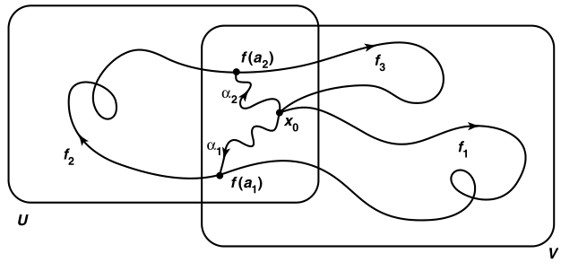

# 曲面上的基本群

## 超球面

- **（定理59.1）V-K引理**：设 $X = U\cup V$ 是分割，$U\cap V$ 道路连通，$x_0\in U\cap V$
  - 设 $i,j$ 是 $U,V$ 的包含映射，则 $i_*,j_*$ 在 $x_0$ 上基本群的像可生成 $\pi_1(X,x_0)$
  - **证明**：
  
  - **推论**：若分割均单连通，且交集道路连通，则总空间单连通
- **（定理59.3）球面单连通**：$S^n\pad (n\geq 2)$ 单连通
  - **证明**：

## 环面

- **（定理60.1）基本群积公式**：$\pi_1(X\times Y, x_0\times y_0)$ 同构于 $\pi_1(X,x_0)\times \pi_1(Y,y_0)$
  - **证明**：
- **投影平面 $P^2$**：$S^2$ 上由对跖点等价导出的商空间
- **（定理60.3）**：投影平面是紧曲面，商映射 $p:S^2\to P^2$ 是覆叠映射
  - **证明**：
  - **推论**：$\pi_1(P^2,y)$ 是二阶群
    - **证明**：
- **投影n空间 $P^n$**：$S^n$ 上由对跖点等价导出的商空间
  - $\pi_1(P^n,y)$ 是二阶群

## 双环面

- **（引理60.5）**：8字形的基本群不是阿贝尔群
  - **证明**：
  - **本质**：两个生成元的自由群
- **（定理60.6）**：双环面的基本群不是阿贝尔群
- **（推论60.7）**：单位球面、环面、投影平面、双环面是四个不同的拓扑曲面