# Munkres

- 证明不同胚的方法
  - **定义法**：不存在同胚映射
  - **性质法**：存在拓扑性质无法传递
  - **代数法**：基本群不同构

## 道路同伦

- **映射的同伦**：
  - 设 $f,f':X\to Y$ 均连续
  - 若存在连续映射 $F:X\times I\to Y$ 使得 $\begin{cases} F(x,0) = f(x) \\ F(x,1) = f'(x) \end{cases} \quad (\forall x)$
  - 则 $f\simeq f'$
  - **理解**：参数族 $\{f_t\}$，其中 $t$ 从 $0\to 1$ 时，$f$ 连续变形为 $f'$
    - （$I$ 一般取为 $[0,1]$）
  - **本质**：
- **零伦映射**：同伦于常映射
  - **反例**：恒等映射不是零伦映射，除非限制在一个点上
- **道路同伦**：
  - 设 $f,f':[0,1]\to X$ 是两个起始点相同的道路
  - 若存在连续映射 $F:I\times I\to X$ 使得 $\begin{cases} F(s,0) = f(s) & F(s,1) = f'(s) \\ F(0,t) = x_0 & F(1,t) = x_1  \end{cases}\\(\forall s,t)$
  - 则 $f\simeq_p f'$
  - **理解**：起始点相同（存在不动点）的同伦
   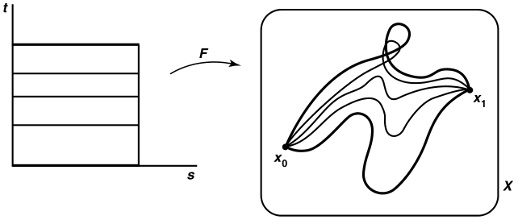
- **（引理51.1）同伦等价性**：道路同伦和同伦都是等价关系
  - **证明**：
    - **自反性**：$F(x,t) = f(x)$ 即为自同伦
      - $t$ 上不变的参数函数族
    - **交换性**：设 $F$ 是 $f,f'$ 的同伦，则 $G(x,t) = F(x,1-t)$ 是 $f',f$ 的同伦
      - 将道路首尾颠倒的换元罢了
    - **传递性**：设 $F$ 是 $f,f'$ 的同伦，$F'$ 是 $f',f''$ 的同伦
      -  设 $G(x,t) =  \begin{cases} F(x,2t) & t\in [0,\dfrac{1}{2}] \\ F'(x,2t-1)& t\in [\dfrac{1}{2},1] \end{cases}$，易得其连续
      - 从而是 $f,f''$ 的同伦
      - 将两个同伦拼接在前后段上，同时将 $t$ 上的变化加速了
  - **推论**：两种同伦具有传递性，故可定义 **(道路) 同伦类** $[f]$
  - **实例**：
    - **直线同伦**：$f,g:X\to \R^2$，同伦映射 $F(x,t) = (1-t)f(x) + tg(x)$
    - **圆同伦**：设 $X = \R^2-\{0\}$，则 $\begin{cases} f(s) = (\cos\pi s,\sin\pi s) \\ g(s) = (\cos \pi s,2\sin\pi s) \end{cases}$ 是直线同伦，而 $h = (\cos\pi s,-\sin\pi s)$ 在下半平面，因为要穿过挖去的原点，故不同伦于 $f$
    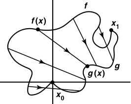 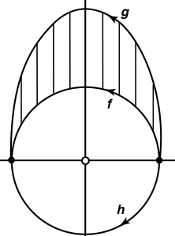

#### 习题

- **复合传递性**：若 $k:X\to Y$ 是连续映射，$F$ 是 $X$ 上 $f,f'$ 的道路同伦，则 $k\circ F$ 是 $Y$ 上 $k\circ f,k\circ f'$ 的道路同伦
  - **证明**：定义即可
  - **理解**：同伦是拓扑性质，可由连续映射传递
- **复合运算性**：若 $k:X\to Y$ 是连续映射，$f(1) = g(0)$ 是 $X$ 的道路
  - 则 $k\circ (f*g) = (k\circ f) * (k\circ g)$
  - **证明**：
    - $k\circ (f*g) = \begin{cases} k\circ f(2s) & s\in [0,\dfrac{1}{2}] \\ k\circ g(2s-1) & s\in [\dfrac{1}{2},1] \end{cases} = 右式$
    - **理解**：复合运算与拼接运算是独立的
- **正线性映射的逆封闭性**：$p:[a,b]\to [c,d]，x\mapsto (mx + k)$ 若是正的，则其同伦逆也是正线性映射
  - **证明**：显然
  - **推论**：复合也同理
- **$I$ 的平凡性**：
  - $\forall X$，$X$ 到 $I$ 的映射同伦类只有一个元素
    - **证明**：
  - 若 $X$ 道路连通，则 $I$ 到 $X$ 的同伦类只有一个元素
    - **证明**：
- **可收缩空间**：其上的恒等映射 $i_X:X\to X$ 不是零伦
  - **实例**：
    - $I,\R$
  - **道路连通性**：
  - **平凡条件**：
    - 若 $Y$ 可收缩，则 $\forall X$ 到 $Y$ 的映射同伦类只有一个元素
      - **证明**：
    - 若 $X$ 可收缩，$Y$ 道路连通，则 $X$ 到 $Y$ 的映射同伦类只有一个元素
      - **证明**：

### 广群

- **同伦积**：$f*g \deq h(s) = \begin{cases} f(2s) & s\in[0,\dfrac{1}{2}] \\ g(2s-1) & s\in [\dfrac{1}{2},1] \end{cases}$
  - **理解**：类似同伦传递性，将两个映射拼接起来，形成中间经过定点的同伦
  - **积等价性**：$[f*g] = [f]*[g]$
    - **元素分析互包证明**：麻烦
    - **定义证明**：
      - 任取 $F:f'\simeq f$ 和 $G:g'\simeq g$
      - 则映射 $H(s) = \begin{cases} F(2s) & s\in [0,\dfrac{1}{2}] \\ G(2s-1) & s\in [\dfrac{1}{2},1] \end{cases}$ 即为 $f'*g'$ 和 $f*g$ 的同伦
    - **理解**：如下图
    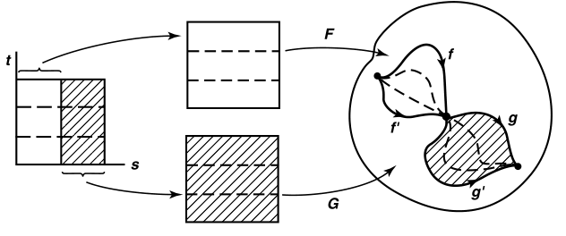
  - **非群性（不封闭）**：为了保持连续性，$[f]*[g]$ 仅定义在 $f(1) = g(0)$ 的映射上
- **（定理51.2）广群性**：
  - **左幺右幺存在性**：设常映射 $e_i(s) \equiv i\in X$，则 $\begin{cases} e_L = f\circ e_0 \\  e_R = f\circ e_1 \end{cases}$
    - **证明**：
      - 设 $e_0$ 是 $I$ 上恒 $0$ 映射，$i:I\to I$ 是恒等映射，则 $e_0*i$ 是 $I$ 上 $0\to 1$ 的道路，体现在坐标系中即为下面的左图
      - 由 $I$ 是凸集，得存在 $i$ 和 $e_0*i$ 的道路同伦 $G$
      - 由复合传递性 + 复合运算性
        - $(f\circ G):\Big[ f\circ i \Big] \simeq_p \Big[ f\circ (e_0*i) \color{chartreuse}{= (f\circ e_0)*(f\circ i)}$ $\Big]$ $\\\whhh$ 即 $ f\simeq_p (e_{x_0}\circ f)$
        - 由积等价性，$[f] = [e_{x_0}]*[f]$，即常映射 $e_{x_0}$ 是同伦类的左幺
      - 同理，$e_1$ 是 $I$ 上恒 $1$ 映射，则 $[f]*[e_{x_1}] = [f]$，其为右幺
      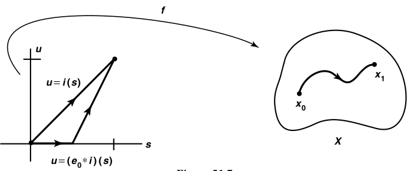
    - **理解**：
      - 左幺与 $f$ 拼接，前半段是起点 $x_0$，后半段是正常的 $f$，则总体上看来还是 $f$，只是加速了而已
      - $f$ 与右幺拼接，后半段是终点 $x_1$，前半段是正常的 $f$，则总体上看来还是 $f$，只是加速了而已
    - **推论**：当 $x_0 = x_1$，即道路为环路时，左右幺相等，幺元唯一
  - **可逆性**：逆写作 $\ol f = f\circ \ol i$
    - **证明**：设 $\ol i(s) = 1-s$，则 $i*\ol i$ 在 $I$ 上是 $0\to 0$ 的道路，从而和 $e_0$ 首尾相同。 则存在 $H$ 是它们的同伦
      - 此时 $(f\circ H): \Big[ f\circ e_0 \Big]\simeq_p \Big[ (f\circ i)*(f\circ \ol i) \Big]$，即 $e_{x_0} \simeq f*\ol f$
        - 从而 $[e_{x_0}] = [f]*[\ol f]$，是互逆关系
      - $e_1$ 同理得 $[\ol f]*[f] = [e_{x_1}]$
      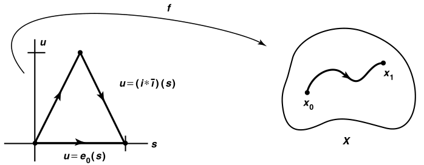
    - **理解**：道路的倒逆换元而已。逆元本质是反方向的道路
  - **结合律**：$(f*g)*h = f*(g*h)$
    - **证明**：设 $f(1) = g(0)，g(1) = h(0)$ 是 $X$ 上的道路
      - 选择 $(0<a < b < 1)\in I$，设 $X$ 上道路 $k_{a,b} = \begin{cases} f & s\in [0,a] \\ g & s\in [a,b] \\ h & s\in [b,1] \end{cases}$
      - 设 $p:I\to I$ 如下图，证明 $k_{c,d}\circ p = k_{a,b}$ 即可
        - 再由 $p$ 为 $I$ 上 $0\to 1$ 的道路，故存在道路同伦 $P:p\simeq_p i$
        - 再由复合传递性，即得 $(k_{c,d}\circ P):\Big[ k_{c,d}\circ p \Big] \simeq_p \Big[ k_{a,b}\circ i \Big]$
        - 从而 $k_{a,b}$ 和任意 $(0<c<d<1)$ 的道路 $k_{c,d}$ 同伦
      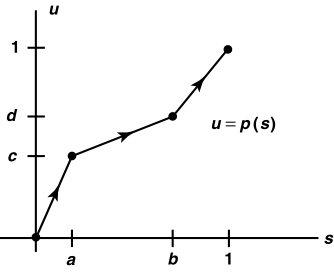
    - **实例**：
      - $g$ 先拼接 $h$，再拼接 $f$：
        - 此时 $g$ 和 $h$ 先对半分，拼接好后的整体再和 $f$ 对半分
        - 故 $f$ 占 $1/2$ 长度，$g,h$ 各占 $1/4$ 长度
        - 即 $f*(g*h) = \large k_{\frac{1}{2},\frac{3}{4}}$，$a = \dfrac{1}{2}，b = \dfrac{3}{4}$
      - $f$ 先拼接 $g$，再拼接 $h$：
        - 此时 $f$ 和 $g$ 先对半分，拼接好后的整体再和 $h$ 对半分
        - 故 $h$ 占 $1/2$ 长度，$f,g$ 各占 $1/4$ 长度
        - 即 $(f*g)*h = \large k_{\frac{1}{4},\frac{1}{2}}$，$c = \dfrac{1}{4}，b = \dfrac{1}{2}$
      - 按上面方法构造 $p$，即得道路同伦关系
    - **理解**：按不同顺序拼接道路，由于每次拼接是对半分，且最终必须总长度为1，故区别也就是各段的长度不一样了。但是这种分段完全可以通过线性映射的同伦变化过去，所以本质还是一样的
    - **本质**：反正从结果来看，都是途中经过了几个定点。谁先拼接无所谓
- **（定理51.3）线性拼接**：设 $f$ 是 $X$ 上道路，$0 = a_n < a_1 < \cdots < a_n = 1$
  - 若 $f_i:I\to X$ 是 $[a_{i-1},a_i]$ 上等于 $I$ 的正线性映射
  - 则 $[f] = [f_1]*\cdots *[f_n]$
  - **证明**：推理同上，归纳法即可

## 基本群

- **环路**：首尾相同的的道路
- **基本群（第一同伦群）**：$x_0$ 上环路的道路同伦类，赋予同伦积运算 $*$ 后，构成基点为 $x_0$ 的基本群 $\pi_1(X,x_0)$
  - **群性**：满足了封闭性
  - **实例**：
    - **平凡群**：基本群 $\pi_1(X,x_0)$ 同伦于**平凡路** $x_0\to x_0$
      - 凸空间中基本群只有平凡群
        - $\pi_1(\R^n,x_0)$ 是平凡群，仅存在恒等映射，其环路均同伦于单点道路 $\{x_0\}$
        - 其上凸子集也是平凡群
    - **非平凡群**：
      - $S^1$ 上的基本群均为圆周（不同元素绕的圈数不同，逆元为反方向绕圈）
- **（定理52.1）基本群同构**：$\wh\a : \pi_1(X,x_0)\to \pi_1(X,x_1)，[f]\mapsto [\ol \a]*[f]*[\a]$，其中 $\a$ 是 $x_0\to x_1$ 的道路
  - **证明**：
    - 同构式易得
    - 双射性：逆映射为 $\wh\b:[h]\mapsto [\ol \b] * [h] * [\b]$，其中 $\b = \ol \a$
  - **理解**：中间必须经过的定点是本来就被固定的两端点，故拼接后还是普通同伦类
  - **（推论52.2）道路基本群**：设 $X$ 是起始点为 $x_0,x_1$ 的道路，则 $\pi_1(X,x_0) \cong \pi_1(X,x_1)$

### 连通性

- **研究范畴**：若 $C$ 是 $X$ 的道路连通分支，则 $\pi_1(C,x_0) = \pi_1(X,x_0)$
  - **证明**：证明同构即可
  - **本质**：只需研究道路连通空间即可
- **单连通空间**：若存在平凡基本群，则基本群均平凡的道路连通空间，
  - **符号表示**：$\pi_1(X,x_0) = 0$
- **（引理52.3）连通等价引理**：单连通空间中，首尾相同的道路均道路同伦
  - **证明**：设 $\a,\b$ 是 $x_0\to x_1$ 的道路，则 $\a*\ol\b$ 是 $x_0$ 上的环路
    - 由单连通性，所有环路都零伦，从而 $[\a*\ol\b]*[\b] = [e_{x_0}]*[\b]$，从而 $[\a] = [\b]$
- **诱导同态**：
  - 设 $h:(X,x_0)\to (Y,y_0)$ 是连续映射
  - 则 $h_*:\pi_1(X,x_0)\to \pi_1(Y,y_0)，[f]\mapsto [h\circ f]$ 是同态
  - **证明**：
    - 连续性：连续映射的复合传递性
    - 同态式：$h_*(fg) = h\circ (f*g) = (h\circ f) * (h\circ g) = h_*(f)*h_*(g)$
  - **理解**：由连续性，先映射再拼接 = 先拼接再映射
  - **本质**：基本群是拓扑不变量，从而在连续映射下性质可以保持
  - **实例**：
    - **平凡同态**：每个像都映射到平凡路
      - 原像均为平凡路的诱导同态是平凡的
        - **证明**：易得
      - 球包含映射的诱导同态：$j_*:\pi_1(S^n,x_0)\to \pi_1(B^{n+1},x_0)$
- **（定理52.4）同态传递性**：
  - 若 $h:(X,x_0)\to (Y,y_0),k:(Y,y_0)\to (Z,z_0)$ 是连续映射，则 $(k\circ h)_* = k_*\circ h_*$
  - 若 $i:(X,x_0)\to (X,x_0)$ 是恒等映射，则 $i_*$ 是恒等同态
  - **（推论52.5）同胚的诱导同态是同构**

### 习题

- **关于 $a_0$ 的星形凸集**：$\forall a_0\in A$，以其为端点的线段含于 $A$ 中
  - **非凸性**：
  - **单连通性**
- **同构拼接**：设道路 $\a:x_0\to x_1，\b:x_1\to x_2$
  - 若 $\g = \a*\b$，则 $\wh\g = \wh\a \circ \wh\b$
  - **证明**：
  - **理解**：
- **阿贝尔基本群**：道路连通空间 $X$ 中，设 $x_0,x_1$ 为定点
  - 则 $\pi_1(X,x_0)$ 是阿贝尔群 $\LR \forall \a,\b:x_0\to x_1$，$\wh\a = \wh\b$
    - **证明**：

## 覆叠空间

- **均匀覆叠**：设 $p:E\to B$ 是连续满射，若开集 $U\subset B$ 的逆像是同胚子集 $V_\a$ 的不交并，则称 $U$ 被 $p$ 均匀覆叠
  - **$p$ 的叶**： $V_\a\subset U$，满足 $p$ 在其上的限制是同胚
  - **$p$ 映射度**：指标集合 $A$（覆叠叶的数量）
  - **遗传性**：$p$ 均匀覆叠的开集 $U$，其子集也被 $p$ 均匀覆叠
    - **证明**：开子空间开集定义即可
- **覆叠映射**：满射 $p:E\to B$，满足每个像点都有被均匀覆叠的邻域
  - **覆叠空间**：此时 $E$ 是 $B$ 的覆叠空间
    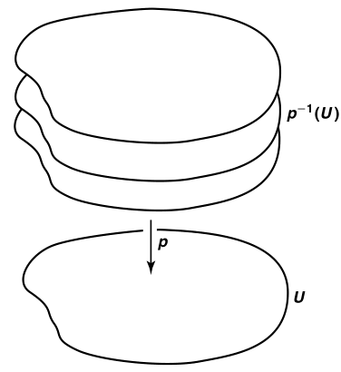
  - **覆叠性**：为什么把它画成上面的形状呢？因为同胚等价性 + 连通的分割定义，每个叶均可连续变形为上面的形状。此时同个 $U$ 的叶不同高度的叶彼此不连通，但两个连通的 $U_1,U_2$ 同一高度上的叶彼此连通。也就是说，覆叠模型是最容易理解的直观代表
  - **离散性**：$\forall b\in B$，子空间 $p^{-1}(b)$ 存在离散拓扑
    - **证明**：每个叶 $V_\a$ 都是开集，且和 $p^{-1}(b)$ 交于单点 $e_\a$。从而由子空间开集定义，该点在 $p^{-1}(b)$ 中是开集，所有叶的该点组成离散拓扑
  - **开性**：覆叠映射是开映射
    - **证明**：设 $A\subset E$ 是开集，由覆叠性，$\forall x\in p(A)$ 存在邻域 $U$ 被均匀覆叠
      - 设 $\{V_\a\}$ 是叶分拆，则存在 $y\in V_\b$ 使得 $p(y) = x$
      - 已知 $V_\b\cap A$ 是开集，再由同胚性，$p(V_\b\cap A)$ 在 $U$ 中也是开集，而由开子空间开集传递性，在 $B$ 中也是开集。
  - **实例**：
    - 复分析中的黎曼面，每个叶就是复变函数取单值的区域。
    - **单覆叠**：恒等映射
    - **投影覆叠**：$X\times \{1,2,...,n\}$，其中 $p(x,i) = x$
    - **标准覆叠**：$p:\R\to S^1，x\mapsto (\cos 2\pi x, \sin 2\pi x)$
      - **证明**：
        - 若 $U\subset S^1$ 是 $x>0$ 的点集，则其叶分拆为 $V_n = (n-\dfrac{1}{4},n+\dfrac{1}{4})$
        - 另一部分同理
      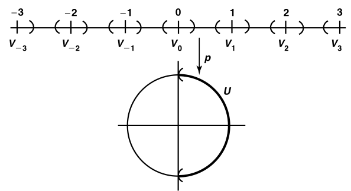
    - **商覆叠**：$p:S^1\to S^1，z\mapsto z^2$
- **局部同胚**：映射 $p:E\to B$ 满足 $\forall e\in E$ 都存在邻域 $U$，其像和 $B$ 中某开集同胚
  - **反例**：局部同胚不一定是覆叠映射
    - $p:\R^+\to S^1，x\mapsto (\cos 2\pi x, \sin 2\pi x)$
      - 此时 $b_0 = (1,0)$ 没有被均匀覆盖的邻域，因为 $V_0$ 在 $\R^+$ 上是端点闭集
- **（定理53.2）遗传性条件**：设 $p:E\to B$ 是覆叠映射，$B_0\subset B$
  - 若 $E_0 = p^{-1}(B_0)$，则其上的限制 $p_0:E_0\to B_0$ 也是覆叠映射
  - **证明**：
    - 设 $U$ 是包含 $b_0\in B_0$ 的某邻域，$V_\a$ 是其叶分拆
    - 此时 $V_\a\cap E_0$ 是不相交开集，其并为 $p^{-1}(U\cap B_0)$，构成同胚
- **（定理53.3）积传递性**：两个覆叠映射的积映射也是覆叠映射
  - **证明**：其它几个同胚传递性直接导出
  - **实例**：
    - $p:\R\times\R\to S^1\times S^1$
      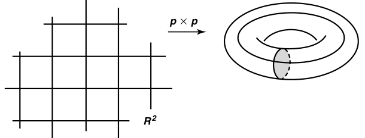
      - **环面同胚性**：已知环面可由 $(0,1)$ 为圆心，$\dfrac{1}{3}$ 为半径的 $xz$ 平面圆沿 $z$ 轴旋转一周得到
        - 设 $C_1$ 为被旋转的圆，$C_2$ 为旋转的轨迹，$f(a\times b)$ 定义为 $a\in C_1$ 在 $C_1$ 被旋转到 $b\in C_2$ 位置时所处的坐标
        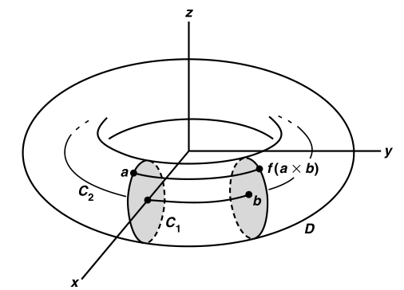
      - **叶分拆**：$[n,n+1]\times [m,m+1]$
    - **8字形空间**：
      - 设 $b_0 = p(0)$，$B_0 = (S^1\times b_0)\cup (b_0\times S^1)$，其为两个交于一点的圆
      - 覆叠空间 $E_0 = p^{-1}(B_0) = (\R\times \Z)\cup (\Z\times \R)$ 是 $\R^2$ 上的网格
      - 此时 $p_0:E_0\to B_0$ 是覆叠映射
    - **黎曼面**：$p\times i:\R\times \R_+\to S^1\times \R_+$
      - 取标准同胚 $f:\R\times \R_+\to \R^2-0$（可以在复变函数中找到该共形映射）
      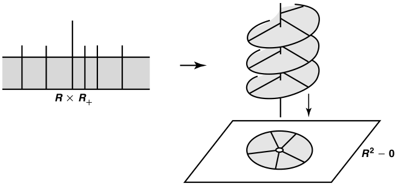
    - **投影**：$Y$ 是离散拓扑空间，$p:X\times Y\to X$ 是首坐标投影，则其为覆叠映射

### 习题

- **复合传递条件**：$p = r\circ q$ 是覆叠映射的复合，若 $r^{-1}(z)$ 总有限，则 $p$ 也是覆叠映射
- **唯一性**：设 $p:E\to B$ 是连续满射，$U\subset B$ 被均匀覆叠
  - 若 $U$ 单连通，则其叶分拆是唯一的
  - **证明**：
- **k叶覆叠**：设 $p:E\to B$ 是覆叠映射，若 $B$ 单连通
  - 则若存在 $p^{-1}(b_0)$ 有 $k$ 个元素，则所有 $b\in B$ 也有 $k$ 个逆投影
  - **证明**：
  - **本质**：叶的单连通性
- **性质传递**：
  - 若 $B$ 是T2、T3、T5、局部紧H空间，则 $E$ 也是
  - 若 $B$ 是紧空间，$p^{-1}(b)$ 总有限，则 $E$ 也是

## 覆叠空间与基本群的关系

- **提升**：设 $p:E\to B$ 是映射，$f:X\to B$ 是连续映射。$\wt f:X\to E$ 若满足 $\wt f\circ p = f$，则称为 $f$ 的提升
  - **本质**：将被覆叠后的空间还原成被覆叠之前
    - 映射具有缩小性，故解复合就是变相的扩大。
- **（引理54.1）道路提升引理**：
  - 设 $p:E\to B$ 是覆叠映射，$p(e_0) = b_0$
  - 则 以 $b_0$ 为起点的道路 $f:[0,1]\to B$ 都有唯一以 $e_0$ 为起点的提升 $\wt f:[0,1]\to E$
  - **构造性证明**：
    - 由覆叠性，可选被 $p$ 均匀覆叠的一系列 $U_i$ 覆盖 $B$，再由勒贝格数引理，可选一列划分 $s_0,...,s_n$ 使得 $f([s_i,s_{i+1}]) = U_i$
    - **归纳法**：取 $\wt f(0) = e_0$，假设 $s_i$ 之前已存在道路提升，$[s_i,s_{i+1}]$ 对应 $U$
      - 设 $U$ 的叶分拆为 $V_\a$，则可设 $\wt f(s_i)\in V_i$
      - 设 $\wt f(s) = \Big(p|_{V_i}\Big)^{-1}\Big(f(s)\Big)\quad x\in [s_i,s_{i+1}]$，由局部同胚性，其是连续映射
      - 不断归纳，即可得到 $[0,1]$ 上的 $\wt f$
    - **唯一性**：反设存在 $\wt g \neq \wt f$，起点相同
      - 假设 $[s_i,s_{i+1}]$ 是第一个不相等的划分段，则由连通性，$\wt g([s_i,s_{i+1}])$ 只能位于一个 $V_\a$ 中，设为 $V_j\pad (j \neq i)$
      - 但由于连续的限制，该段起点处必须有 $\wt f(s_i) = \wt g(s_i)$，从而 $\wt g(s)$ 必定和 $\wt f(s)$ 存在某些相等点，与 $V_\a$ 的不交性矛盾
  - **理解**：由于映射的原像只能有一个像，故提升也只能取一个叶将原像映到上面。再由于各段连续的限制，得必须取同一高度的叶（彼此连通的叶）为一个映射，从而起点像相等的覆叠提升具有唯一性
  - **本质**：覆叠提升 $\wt f$ 完全由起点 $e_0$ 的像决定是否相等
  - **实例**：
    - $[0,1]\to S^1$ 的几个映射 $f,g,h$ 在 $p:\R\to S^1$ 下的起点像为 $0$ 的提升分别是
      - $\begin{cases} f(s)= (\cos\pi s,\sin \pi s) & \wt f(s) = \dfrac{s}{2} & (0\to\dfrac{1}{2}) \\ g(s)= (\cos\pi s,-\sin \pi s) & \wt g(s) = -\dfrac{s}{2} & (0\to -\dfrac{1}{2}) \\ h(s)= (\cos 4\pi s,\sin 4\pi s) & \wt h(s) = 2s & (0\to 2) \end{cases}$
  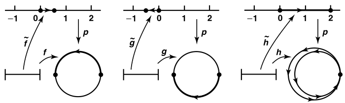
      - 若取起点为 $n$，则相当于取了其它高度的叶为提升的像
- **（引理54.2）同伦提升引理**：
  - 设
    - $p:E\to B$ 是覆叠映射，$p(e_0) = b_0$
    - $F:I\times I\to B，F(0,0) = b_0$ 是连续映射
  - 则存在提升 $\wt F:I\times I\to E，\wt F(0,0) = e_0$
    - **连续性**
    - **唯一性**
    - **道路同伦性**：若 $F$ 是 $B$ 上道路同伦，则 $\wt F$ 也是 $E$ 上道路同伦
  - **证明**：
    - 已知 $0\times I$ 和 $I\times 0$ 可用覆叠提升引理直得
    - 用勒贝格数引理，给出 $I\times I$ 划分 $I_i\times J_j = [s_{i-1},s_i]\times [t_{j-1},t_j]$
    - **归纳法**：
      - 假设 $A = (0\times I)\cup (I\times 0)\cup \set{I_{i_0}\times J_{j_0}\mid (j<j_0) \lor (j=j_0,i<i_0)}$ 上已存在连续提升 $\wt F$
      - 由覆叠性，可选被均匀覆叠的开集 $U\supset F(I_{i_0}\times J_{j_0})$，设 $V_\a$ 是其叶分拆
      - 此时 $C = A\cap (I_{i_0}\times J_{j_0})$ 是 $I_{i_0}\times J_{j_0}$ 的左边和底边，从而连通。由连续映射性，$\wt F(C)$ 也连通，从而只能存在于单个 $V_0$ 中
   $\whhh$ 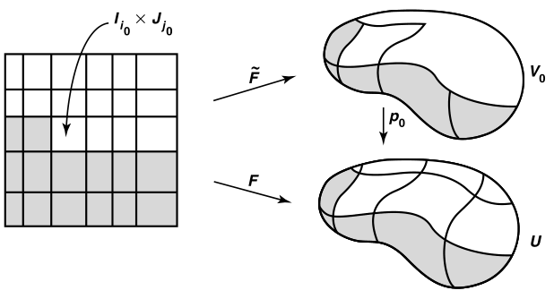
      - 设 $(p|_{V_0} = p_0):V_0\to U$ ，则对 $\forall x\in C，p_0\circ \wt F(x) = p\circ \wt F(x) = F(x)$，从而可在 $I_{i_0}\times J_{j_0}$ 上定义延拓 $\wt F(x) = p^{-1}_0(F(x))$，其也为连续延拓
    - **唯一性**：归纳的每一步中只能有一个连续延拓法，故 $\wt F$ 仅依赖于 $\wt F(0,0)$
    - **道路同伦性**：已知 $F(0\times I) = \{b_0\}$，从而 $\wt F(0\times I) = p^{-1}(\{b_0\})$，但它具有离散拓扑，而原像和函数均连通，故像只能是单点集。同理 $\wt F(1\times I)$ 也是单点集，从而在同高度的叶（单连通空间）上首尾相同，是道路同伦
  - **理解**：只不过是 $X$ 从一维换成了二维而已。每个半开半闭矩形是 $U_i$，对应不同高度的多个叶。先在左边和底边用一维的道路提升引理，然后将该限制进行延拓，由于 $X = I\times I$ 是连续且连通的，故延拓保持了连续性和道路同伦性。同时对限制的延拓显然也具有唯一性
- **（定理54.3）同伦提升定理**：
  - 设
    - $p:E\to B$ 是覆叠映射，$p(e_0) = b_0$
    - $f,g$ 是 $b_0$ 到 $b_1$ 的两条道路，$\wt f,\wt g$ 是它们以 $e_0$ 为起点的提升
  - 若 $f,g$ 是道路同伦，则提升的终点像相同，且也是道路同伦
  - **证明**：
    - 设 $F:I\times I\to B$ 是 $f$ 和 $g$ 的道路同伦，$F(0,0) =  b_0$，$\wt F$ 是其提升，$\wt F(0,0) = e_0$
    - 由同伦提升引理，其也是道路同伦，从而 $\wt F(0\times I) = \{e_0\}，\wt F(1\times I) = \{e_1\}$
    - 考虑 $\wt F|_{(I\times 0)}$，其起点为 $e_0$。由道路提升唯一性，$\wt F(s,0) = \wt f(s)$
    - 同理考虑 $\wt F|_{(I\times 1)}$，其起点为 $e_1$，由道路提升唯一性，$\wt F(s,1) = \wt g(s)$
    - 综上，$\wt F:f\simeq_p g$
  - **理解**：起点相同，则提升所处的叶均为同层，从而终点像相同，且是道路同伦
  - **本质**：同伦提升引理的重点是定性（只需 $\wt F$ 是道路同伦），而本定理重点是定量（原同伦提升后依然是两个原映射提升的同伦）。实际上，它是唯一性的直接推论
- **提升对应**：
  - 设
    - $p:E\to B$ 是覆叠映射，$p(e_0) = b_0$
    - $[f(b_0)]\in\pi_1(B,b_0)$，$\wt f$ 是其提升
  - 则存在映射 $\phi : \pi_1(B,b_0)\to p^{-1}(b_0)，[f(b_0)] \mapsto \wt f(0) \color{chartreuse} = \wt f(1)$
  - 由于提升仅依赖于起点 $e_0$ 的像，故可建立原映射与其提升的对应关系
- **（定理54.4）进化定理**：设 $p:E\to B$ 是覆叠映射，$p(e_0) = b_0$
  - 若 $E$ 道路连通，则提升对应 $\phi$ 是满射。若单连通，则是双射
  - **证明**：
    - 道路连通时，$\forall e_1\in p^{-1}(b_0)$，存在道路 $\wt f:e_0\to e_1$，则 $f = p\circ \wt f$ 即为 $b_0$ 环路，$\phi([f]) = e_1$
    - 单连通时，反设存在 $f,g\in \pi_1(B,b_0)$ 满足 $\phi([f]) = \phi([g])$，则其提升满足 $\wt f(1) = \wt g(1)$
      - 再由单连通性，$E$ 上存在道路同伦 $\wt F: \wt f\simeq_p \wt g$，从而 $p\circ \wt F$ 是 $B$ 上道路同伦
  - **本质**：$E$ 道路连通，则不同高度的叶之间存在道路，故不同层的 $p^{-1}(b_0)$ 之间存在道路，从而所有的不同层 $e_0\to e_1$ 环路都有 $b_0\to b_0$ 对应，从而是满射
    - $E$ 单连通，则叶只有一个高度，从而 $E$ 与 $B$ 同胚（？），提升对应是双射
- **（定理54.5）拓扑同构定理**：圆上的基本群同构于整数加法群
  - **证明**：
    - 已知覆叠映射 $p:\R\to S^1$，设 $e_0 = 0$，则 $p^{-1}(b_0) = \Z$
    - 由 $\R$ 单连通，提升对应是双射，只需证明是同态
      - 设 $n = \wt f(1)，m = \wt g(1)$，则 $\phi([f(b_0)]) = n，\phi([g(b_0)]) = m$
      - 设 $\wt g(s) = n+\wt g(s)$，由 $p(n+x) = p(x)$，$\wt g$ 也是提升，起点为 $n$，同理 $\wt f*\wt g$ 也是提升，起点为 $0$
      - 由于 $\wt g(1)=  n+m$，则 $\phi([f(b_0)]*[g(b_0)]) = n+m = \phi([f(b_0)]) + \phi([g(b_0)])$
  - **理解**：
  - **本质**：基本群是起点不同的圆周，其对应实轴上某个开邻域。而实轴上不交的开区间只有可数个，故等势于 $\Z$。再由圆周旋转对应整数相加，得同构
- **（定理54.6）覆叠同态定理**：设 $p:E\to B$ 是覆叠映射，$p(e_0) = b_0$
  - **覆叠基本群同态**：诱导同态 $p_* : \pi_1(E,e_0)\to \pi_1(B,b_0)$ 都是单同态
    - **证明**：
      - 设 $\wt h$ 是 $e_0$ 环路，则由叶的单连通性，$p_*([\wt h])$ 是平凡道路，从而存在 $p\circ \wt h$ 的零伦映射 $F$
      - 取 $\wt F$ 是 $F$ 的提升，$\wt F(0,0) = e_0$，则由同伦提升定理，$\wt F$ 即为 $\wt h$ 的零伦映射，且其唯一，从而得到 $p_*$ 单射性
    - **理解**：确定了 $e_0$，也就确定了叶的高度，自然是单射
      - 但是由于所有叶都要投射到 $B$ 上，从而单层叶不一定是满射
  - **商提升映射**：
    - 设 $H = p_*(\pi_1(E,e_0))$，则 $\Phi:\pi_1(B,b_0)/H\to p^{-1}(b_0)$ 是单射
    - 若 $E$ 道路连通，则其为双射
    - **证明**：
      - 设 $f,g$ 是 $B$ 上环路，$\wt f,\wt g$ 是起点为 $e_0$ 的提升
        - 则只需证明 $\phi([f]) = \phi([g]) \LR [f]\in H*[g]$ 即可
        - $f,g$ 的提升对应相同 $\Leftrightarrow$ 它们是 $H$ 等价类
        - 两 $b_0$ 环路在 $E$ 上的终点相同 $\Leftrightarrow$ 它们之间只相差一个 $e_0$ 环路像
        - 本质：陪集等价类
      - **充分性**：
        - 设 $[f]\in H*[g]$， 则存在 $e_0$ 上环路 $\wt h$ 以及相应 $b_0$ 环路 $h = p\circ\wt h$，使得 $[f] = [h*g]$
        - 设 $\wt h*\wt g$ 是 $h*g$ 的提升，则 $\wt f$ 和 $\wt h*\wt g$ 终点相同，也即 $\wt f$ 和 $\wt g$ 终点相同，即 $\phi([f]) = \phi([g])$
        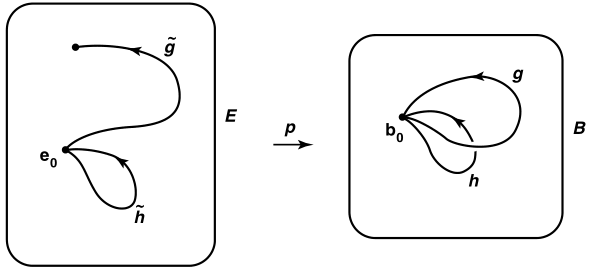
      - **必要性**：此时 $\wt f,\wt g$ 终点相同，故可设 $\wt h = \wt f * \ol{\wt g}$，也即 $[\wt h*\wt g] = [\wt f]$，其为 $e_0$ 环路
        - 设 $\wt F: \wt h*\wt g\simeq_p \wt f$，则设 $h = p\circ \wt h$，即有 $p*\wt F:h*g\simeq_p f$，从而 $[f]\in H*[g]$
      - **推论**：由进化定理，若 $E$ 道路连通，则 $\Phi$ 为满射，从而此时为双射
    - **理解**：$\Phi$ 的定义域中，将 $p^{-1}(b_0)$ 合并为单点来组成商群，从而退化为单射
  - **可提升条件**：
    - 若 $f$ 是 $b_0\in B$ 的环路，则 $[f]\in H \LR f$ 可被提升为 $e_0$ 的环路
    - **证明**：当 $g$ 为常环路时，应用之前等价关系即得 $\phi([f]) = e_0 \LR [f]\in H$，而前者以 $\wt f$ 是 $e_0$ 环路为必要条件
    - **理解**：这不就是H的定义吗……

### 习题

- 
- 环面上的基本群同构于 $\Z\times \Z$ 加法群
- **退化条件**：设 $p:E\to B$ 是覆叠映射，$E$ 道路连通
  - 若 $B$ 单连通，则 $p$ 是同胚
  - **证明**：