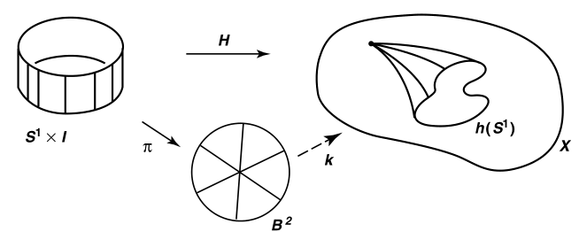
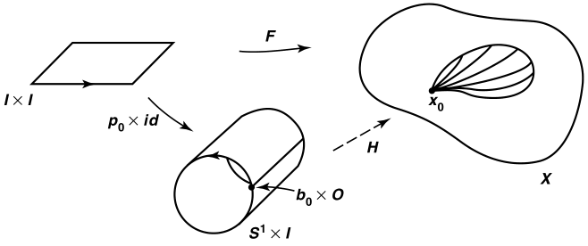
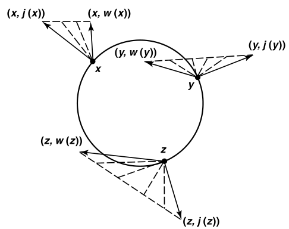
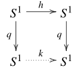
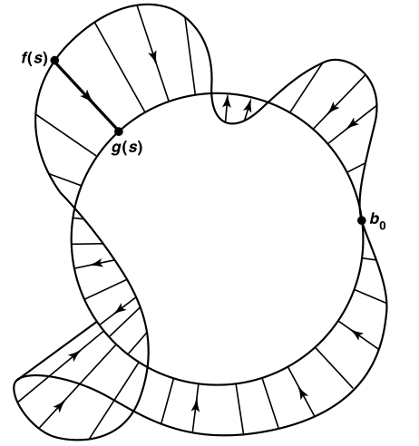
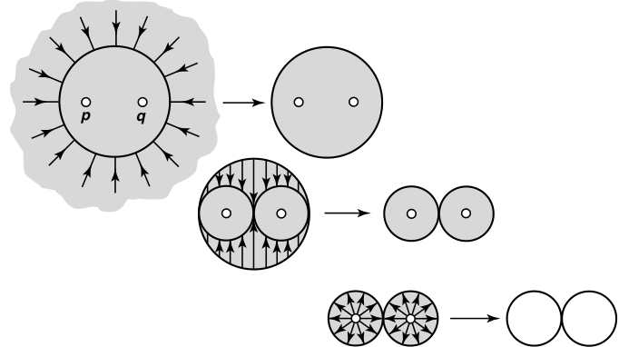
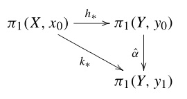
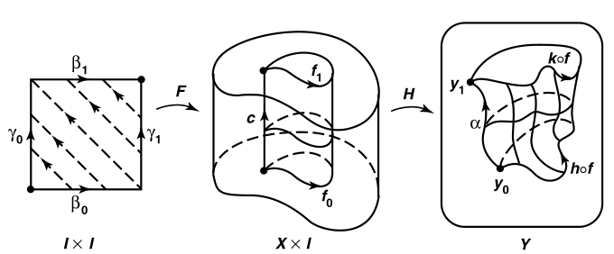
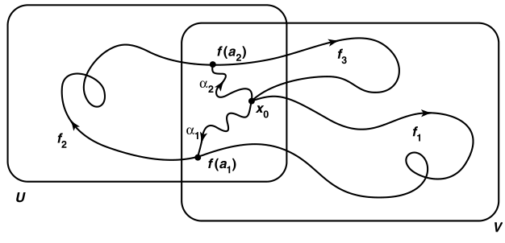

# Munkres

- 接下来主要讨论更广义的同伦，而非仅仅是道路同伦

## 收缩

- **收缩**：设 $A\subset X$，若存在连续映射 $r:X\to A$，其在 $A$ 上的限制是恒等映射，则 $A$ 是 $X$ 的**收缩核**，$r$ 是**收缩映射**
  - **等价命题**：设 $j$ 是包含映射，则满足 $r\circ j = i_A$ 的 $r$ 是收缩映射
    - **证明**：易得
  - **理解（保同伦性）**：$X$ 可连续收缩为 $A$，即过程中保持所有映射的同伦性，不会有映射变到其它同伦类中，或退化为零伦
    - **证明**：
  - **本质**：连通性相同的，具有包含关系的集合可收缩/扩张
    - **证明**：
  - **反例**：若不是收缩，则 $\forall p，\exists x_0\in A，p|_A(x_0) \neq p(x_0)$
- **（引理55.1）收缩的基本群判定法**：
  - 若 $A$ 是 $X$ 的收缩核
  - 则包含映射 $j:A\to X$ 诱导的基本群同态 $p_*: \pi_1(A,a)\to \pi_1(X,a)$ 是单射
  - **证明**：
    - 由 $r\circ j = i_A$，得 $r_*\circ j_*:\pi_1(A,a)\to \pi_1(X,a)$ 也是恒等的，从而 $j_*$ 只能是单射，否则会丢失信息，导致无法由收缩再变回恒等
  - **应用**：该命题的逆否非常有用：若 $r$ 的诱导同态不是单射，则 $r$ 不是收缩映射
  - **理解**：若不是单射，则存在两种内部连通性不同的环路（两种基本群），被映射后连通性相同（压缩成一种基本群）。显然不可能是收缩
  - **本质**：用道路同伦判断收缩。即一个集合是否为收缩（保同伦），可通过包含映射下的基本群（可反映同伦性）来判断
- **（定理55.2）非收缩定理**： $S^1$ 不是 $B^2$ 的收缩
  - **证明**：
    - 反设是收缩，则 $j:S^1\to B^2$ 为单射
    - 但 $S^1$ 二连通，基本群是非平凡的。$B^2$ 单连通，基本群是平凡的。所以诱导同态不可能是单射，从而不可能是收缩
  - **理解**：
    - 此时恒等映射 $i_{B^2}$ 不满足 $B^2\to S^1$ 的陪域关系。Minkowski泛函（圆内点均变为径向对应的边界点）在原点 $\bd 0$ 无定义，若强行定义则不连续。
    - 也就是说，无论如何处理收缩过程，若不挖去点 $\bd 0$ 就不可能被完美解决
  - **本质**：连通性不同，无法收缩
- **（引理55.3）标准零伦**：设 $h:S^1\to X$ 是连续映射，则下面命题等价
  - $h$ 零伦
  - $h$ 可连续延拓为 $k:B^2\to X$
  - $h_*$ 是 $S^1$ 上基本群的平凡同态
  - **证明**：
  - $(1)\to (2)$：
    - 设 $H:S^1\times I\to X$ 是零伦映射
    - 易得 $\pi:S^1\times I\to B^2，(x,t) \mapsto (1-t)x$ 是将圆周各点沿径向移动到圆心的映射，高度越高则移动越多
      - 其为闭的连续满射，也即商映射，核为 $S^1\times 1$
      - 则此时 $(k = H\circ\pi^{-1}):B^2\to X$ 即为 $h$ 的连续延拓
    - $k$ 首先将圆 $B^2$ 中每个圆环依次扩张后垒起，提升成高度为1的圆柱，然后将每个高度变为 $X$ 中的同伦变形过程，其中令最高处 $S^1\times 1$ 的像为常点，即符合零伦性，可作为 $h$ 的延拓
    
    **本质**：先将原图形提升至高维，然后建立高维同伦，从而导出低维映射。这里提升空间起到自由对象的作用
  - $(2)\to (3)$：
    - 设 $j:S^1\to B^2$ 是包含映射，则 $h = k\circ j$，从而 $h_* = k_*\circ j_*$
    - 但已知 $j_*:\pi_1(S^1,b_0)\to \pi_1(B^2,b_0)$ 的像均同伦于平凡路，故为平凡同态
    - 而 $k_*:\pi_1(B^2,b_0)\to \pi_1(X,x_0)$ 的原像均同伦于平凡路，故也是平凡同态
    - 从而 $h_*$ 也是平凡的
    - 延拓和收缩都可将平凡性传递
  - $(3)\to (1)$：
    - 设 $p_0:I\to S^1$ 是标准覆叠映射的收缩，由标准覆叠定义得其为 $S^1$ 的单圈 $b_0$ 环路，从而 $[p_0]$ 可生成基本群 $\pi_1(S^1,b_0)$
    - 设 $x_0 = h(b_0)$，由于 $h_*$ 是平凡映射，得 $f = h_*(p_0) =  h\circ p_0$ 是 $\pi_1(X,x_0)$ 的幺元（平凡路 $b_0$ 的同伦类），也即存在 $f$ 与（$X$ 上恒等映射 $X_{\text{id}}$ 在 $x_0$ 的限制）的道路同伦 $F:f\simeq_p X_{\text{id}}$
    - 再由 $p_0\times I_{id}:I\times I\to S^1\times I$ 是商映射，即闭的连续满射。它将平面卷成圆筒
      - 将平面两端 $0\times t，1\times t$ 均映射成 $b_0\times t$，其余为单射
      - 此时 $F$ 将 $0\times I，1\times I，I\times 1$ 均映射为 $x_0$
    - 此时的连续映射 $\Big(H = F\circ(p_0\times\text{id})^{-1} \Big):S^1\times I\to X$ 即为 $h$ 与 $e_{x_0}$ 的零伦映射
      - 每个圆周对应 $I\times I$ 中一条横线，对应 $X$ 中一个 $x_0$ 的较小环路
      - 圆周轨迹的零伦路从单点 $x_0$ 逐步扩张，直到 $S^1\times 1$（$x_0$ 的某环路）。此时其内部是单连通空间，也即扩张过程中始终保持零伦
    
    - **理解**：3至1的部分是最复杂的。在上图中，同伦映射不被看作一个变化过程，而是一个原空间与 $I$ 的直积空间的商映射
      - 当然也可以用变化过程的方式去理解。已知 $S^1$ 上的同伦
  - **本质（零伦、收缩、基本群判别法，三者的关系）**：一个映射的像集可连续收缩为单点（零伦） $\LR$ 该映射下基本群的像均同伦于单点（平凡诱导同态） $\LR$ 该映射定义域等价于单连通空间（连续延拓/逆收缩）
- **（推论55.4）非零伦定理**：包含映射 $j:S^1\to \R^2-0$ 和恒等映射 $i:S^1\to S^1$ 不是零伦
  - **证明**：
    - 已知存在收缩 $r:\R^2-0\to S^1，x\mapsto \dfrac{x}{\|x\|}$（Minkowski泛函），则由收缩的基本群判定法，$j_*$ 是单射，从而非平凡，从而 $j$ 不是零伦。
    - 同理 $i_*$ 是恒等同态，也非平凡，从而 $i$ 不是零伦
  - **理解**：挖点平面和单位圆周都是二连通，故存在收缩关系，故映射不会退化为零伦
  - **本质**：
    - 收缩是将拓扑空间变为标准型（单连通 $B^2$，二连通 $S^1$，三连通……）的方法，可在判断零伦时进行简化
- **（定理55.5）法向存在性**：$B^2$ 上的非零向量场，存在边界点 $x\in S^1$ 使得该点向量指向外侧或内侧
  - **证明**：
    - 可设向量场为 $(x,v(x))$
      - 第一分量 $x$ 表示向量的起点
      - 第二分量 $v(x)$ 表示向量的方向
        - $v:B^2\to \R^2-\bold 0，x\mapsto v_1(x)\vec i + v_2(x)\vec j$ 是连续映射（本质是流形的坐标化，详见微分流形）
    - 设 $w$ 为 $v$ 在 $S^1$ 上的限制，易得其非平凡且连续
      - 由于 $w$ 可连续延拓到 $B^2$，由标准零伦引理得 $w$ 零伦
    - 选取 $F(x,t) = tx + (1-t)w(x)，x\in S^1$。由于 $w$ 信息不全，故 $F$ 的像集暂时未知
    - 若 $t\in (0,1)$ 时，存在 $F(x,t) = \bold 0$，则 $w(x) = \dfrac{t}{t-1}x$
      - 再由于 $\dfrac{t}{t-1}<0$，得此时 $w(x)$ 为指向圆周内侧的法向量（等式左侧的 $x$ 代表向量起点，等式右侧的 $x$ 代表位置向量，故 $w$ 就是 $x$ 上指向 $\vec x$ 反方向的向量，只不过长度不为1）
    - 若 $t\in (0,1)$ 时，总有 $F(x,t) \neq \bold 0$
      - 则此时陪域缩小为 $F:S^1\times I\to \R^2-\bd 0$
      - 设 $j:S^1\to \R^2-\bd 0$ 是包含映射，其将（单位圆周上的点）映射为（该点对应的坐标向量，即单位圆周的外法向量），则由下图可得直线同伦 $F:w\simeq j$，那么 $j$ 也零伦，但这与圆周上包含映射非零伦矛盾
      
    - 对于外侧向量，只需对 $(x,-v(x))$ 进行同样讨论即可
  - **理解**：
    - 已知内侧法向量不可直线同伦为外侧法向量（在途中会变成 $x$ 上的零向量）
    - 若不存在内侧法向量，则由向量场映射本身的性质，所有像均可直线同伦到外侧法向量上。再由向量场映射定义在单连通区域上，故其零伦于零映射（单连通区域收缩到 $\{\bd 0\}$ 时，其上的所有映射），从而外法向映射（包含映射）也零伦。但外法向映射的定义域不可收缩到 $\{\bd 0\}$（原点的法向方向无法定义），故产生矛盾，必须有一个向量让它们不能同伦
    - 向量场非零的目的在于（使同伦不会被内法向之外的其它零像打断）
  - **本质**：内侧法向量在包含映射和向量场映射之间的地位，就相当于 $\bd 0$ 在 $S^1$ 和 $B^2$ 之间的地位
- **（定理55.6）Brouwer不动点定理**：若 $f:B^2\to B^2$ 是连续映射，则其存在不动点
  - **证明**：反设 $\forall x\in B^2，f(x) \neq x$
    - 则此时 $v(x) = f(x)-x$ 构成非零向量场
    - 由于存在边界点 $x_0$ 拥有外法向量，得 $\exists a>0，f(x_0)-x_0 = ax_0$。但由于 $x_0$ 是边界点，此时 $x_0$ 超出 $f$ 定义域，故不可能存在 $x_0$，矛盾
  - **理解**：
- **（推论55.7）Frobenius定理**：三阶正数方阵的特征值全部为实数
  - **证明**：
    - 设 $T$ 是以三阶正数方阵 $A$ 为矩阵的线性变换，$B$ 是两个第一卦限中 $S^2$ 的交，易得其同胚于 $B^2$，从而连续映射存在不动点
    - 此时 $x$ 分量均非负，且至少有一个为正。再由 $A$ 为正，$T(x)$ 是非零向量场，从而此时 $x\mapsto \dfrac{T(x)}{\|T(x)\|}$ 是 $B$ 中连续映射，存在不动点 $x_0$
    - 则 $T(x_0) = \|T(x_0)\|x_0$ ，从而 $T$ 特征值全部为正
- **（定理55.8）泛函不动点定理**：存在 $\e>0$，使得 $T$ 的任意直径小于 $\e$ 的开覆盖 $\mc A$，$T$ 中存在点至少被三个 $\mc A$ 元素包含
  - **证明**：反设 $\mc A = \{U_1,...,U_n\}$ 是开覆盖，但不存在三个相交元素
    - 边界顶点排序：
      - 若 $U_i\cap \pa T$ 有两个边，设其顶点为 $v_i$
      - 若 $U_i\cap \pa T$ 只有一个边，设其任一顶点为 $v_i$
      - 若 $U_i\cap \pa T$ 不包含边，设 $v_i$ 为任意顶点
    - 设 $\{\phi_i\}$ 是依赖于 $\{U_i\}$ 的单位分解，$k:T\to\R^2，x\mapsto \sum\limits^n_{i=1} \phi_i(x)v_i$，易得其连续
    - 任取 $x\in T$，由假设，最多有两个 $\phi_i(x)\neq 0$
      - 若只有一个 $U_i$，则 $k(x) = v_i$
      - 若有两个 $U_i,U_j$，则 $k(x) = tv_i + (1-t)v_j$
    - 从而 $k(x)\in \pa T$，即 $k:T\to \pa T$，易得其将边界映射为自身
      - 设在边界上的限制为 $h$，其零伦，直线同伦于边界上恒等映射，但后者非零伦，矛盾

### 习题

- 若 $A$ 是 $B^2$ 的收缩核，则任意连续的 $ f:A\to A$ 均存在不动点
- 若 $h:S^1\to S^1$ 零伦，则其存在不动点和保对跖点
- **收缩最小性**：收缩映射的诱导同态是满射

### 代数基本定理

- 数学归纳法 + 带余除法
- Louville定理推论
- 代数拓扑法
- **证明**：考虑复平面上圆周映射 $f:S^1\to S^1，z\mapsto z^n$
  - $f_*$ 单射性
    - 设标准道路 $p_0:I\to S^1: s\mapsto e^{2\pi is}$
    - 则诱导同态 $(f_* = f\circ p_0):\R\to S^1，s\mapsto e^{2\pi i(ns)}$ 将 $p_0$ 覆叠的 $1$ 端点先映射到 $n$ 端点后再覆叠，显然是单射
  - $g:S^1\to \R^2-\bd 0，z\mapsto z^n$ 不是零伦
    - 取包含映射 $j:S^1\to \R^2-\bd 0$，则 $g_* = f_*\circ j_*$ 是单射
  - 当 $\sum\limits^{n-1}_{i=0} |a_i| < 1$ 时，在 $B^2$ 中有一个根
    - 反设无根，设 $k:B^2\to \R^2-\bd 0，z\mapsto \sum\limits^n_{i=0} a_nz^n$，$h$ 为其在 $S^1$ 上的限制，则 $h$ 零伦
    - 再设 $F:S^1\times I\to \R^2-\bd 0，(z,t)\mapsto z^n + t(...)$
      - 易得 $|F|>0$，其为 $g$ 和 $h$ 的同伦，这不可能
  - 取同解变换 $x = cy$，使得 $\sum\limits^{n-1}_{i=0} |\dfrac{a_i}{c^{n-i}}| < 1$ 即可推广到所有系数情况

### 区域均分问题

- **对跖点**：设 $x\in S^n$，则其对跖为 $-x$
- **保对跖映射**：满足 $h(x) = -h(x)\pad (\forall x\in S^n)$
  - **复合传递性**：易得
- **（定理57.1）**：$h:S^1\to S^1$ 若是连续保对跖映射，则其非零伦
  - **证明**：
    - 设 $b_0 = (1,0)\in S^1$，旋转映射 $\rho:S^1\to S^1$ 使得 $\rho\circ h(b_0) = b_0$
      - 已知 $\rho$ 保对跖，故复合 $\rho\circ h$ 保对跖
    - 设二倍角映射 $q:S^1\to S^1，z\mapsto z^2$，则其为商映射（闭的连续满射），其将两个对跖点压缩成一个，从而 $q\circ h(-z) = q\circ h(z)$
    - 由 $q$ 是商映射，还存在连续映射 $k:S^1\to S^1$ 使得 $k\circ q = q\circ h$（群中共轭关系）
      - 由于 $b_0$ 是 $q,h$ 的不动点，故也是 $k$ 的不动点
    
    - 易得 $q$ 是标准覆叠映射
    - 若 $\wt f$ 是 $S^1$ 上 $b_0\to -b_0$ 的道路，则其为 $f = q\circ \wt f$ 的提升，从而 $f$ 是 $\pi_1(S^1,b_0)$ 的非平凡元素
    - 此时 $k_*[f] = [k\circ (q\circ \wt f)] = [q\circ (h\circ \wt f)]$。由 $h$ 保对跖性，$h\circ \wt f$ 依然是 $b_0\to -b_0$ 的道路，从而 $k_*[f]$ 是非平凡的
    - 此时 $k_*$ 是无限循环群到自身的同态，从而是单射。而 $q_*$ 对应整数群中两个元素的积，也是单射。由 $k_*\circ q_* = q_*\circ h_*$，得 $h_*$ 也是单射，从而非零伦
- **（定理57.2）**：不存在连续保对跖映射 $g:S^2\to S^1$
  - **证明**：设 $g:S^2\to S^1$ 是连续保对跖映射，设
    - 其在 $S^1$ 的限制 $h$ 也是连续保对跖映射，由上知非零伦，但此时 $S^2$ 的上半球同胚于 $B^2$，且 $g$ 为 $h$ 连续延拓，矛盾
- **（定理57.3）Borsuk-Ulam定理**：连续映射 $f:S^2\to \R^2$ 存在点 $x$ 满足 $f(x) = f(-x)$
  - **证明**：
    - 即使上式均不成立，还可构造 $g(x) = \cfrac{f(x)-f(-x)}{\|f(x)-f(-x)\|}$。其为 $S^2\to S^1$ 的连续映射，且满足上式
- **（定理57.4）二分定理**：$\R^2$ 中任意两个有界多边形区域，都存在一条直线将其均分
  - **证明**：设 $A_1，A_2$ 是两个 $\R^2\times 1$ 的有界多边形区域
    - 任取 $u\in S^2$，存在过原点的平面 $P$ 以其为单位法向量
    - 设 $f_i(u)$ 为 $A_i$ 在 $P$ 分割下和 $u$ 同侧部分的面积，则 $f_i(u) + f_i(-u) = \text{Area}\ A_i$
    - 设 $F:S^2\to \R^2，u\mapsto (f_1(u),f_2(u))$，则B-U定理得其存在某点 $F(u) = F(-u)$，此时 $f_i(u) = \dfrac{1}{2}\text{Area}\ A_i$
  - **本质**：
  - **推论**：在有穷维中对Jordan可测集均成立

## 形变收缩

- **（引理58.1）同伦不动点**：设 $h,k:(X,x_0)\to (Y,y_0)$ 是连续映射
  - 若它们同伦，且在同伦过程中 $x_0\in X$ 的像始终为 $y_0$
  - 则诱导同态 $h_* = k_*$
  - **证明**：设 $h$ 和 $k$ 的同伦为 $H:X\times I\to Y$
    - 则设 $f$ 是 $X$ 上的 $x_0$ 环路，那么复合映射 $I\times I\xto{f\times i} X\times I \xto{H} Y$ 是 $h\circ f\simeq k\circ f$ 的同伦，其为道路同伦
  - **本质**：彼此同伦的映射，在同伦不动点上的基本群同构
- **（定理58.2）经典包含同构**：包含映射 $j:S^n\to \R^{n+1}-\bd 0$ 的诱导同态是同构
  - **证明**：设 $b_0 = (1,0,...,0)$，$r(x) = \dfrac{x}{\|x\|}$，其为收缩映射
    - 易得 $r\circ j = i_{S^n}$，从而 $r_*\circ j_*$ 是 $\pi_1(S^n,b_0)$ 的恒等同态，其为单射（或由收缩性直得其为单射）
    - 易得 $j\circ r\simeq i_X$，只需构造直线同伦映射 $H(x,t) = (1-t)x + t\dfrac{x}{\|x\|}$
      - 收缩保同伦性，即将 $X$ 中映射均收缩到 $S^n$ 上后，再将其放入 $X$ 中，依然可以通过同伦（扩张）变回原来的映射
      
    - 再易得 $H$ 恒不为 $\bd 0$，且由于 $\|b_0\| = 1$，其为同伦不动点。则由同伦不动点引理，$j_*\circ r_*$ 是 $\pi_1(X,b_0)$ 的恒等同态，其为满射
      - 由于恒等映射是满射，得 $j_*$ 的像扩张后可填满 $X$ 中的 $b_0$ 基本群，故 $j_*$ 是满射，像填满整个 $S^n$ 的 $b_0$ 基本群（$S^n$ 和 $X$ 是收缩扩张关系）
    - 从而 $j_*$ 是同构
  - **理解**：用收缩扩张关系，转化为像是否为 $X$ 上恒等映射的同伦，而该结论易得
  - **本质**：$S^n$ 是 $\R^n-\bd 0$ 的强形变收缩
- **强形变收缩**：设 $A\subset X$
  - 若 $X$ 上的恒等映射同伦于某个（使得 $A$ 上所有点均同伦不动）的映射 $r:X\to A$
  - 则 $A$ 是 $X$ 的形变收缩核，同伦映射 $H$ 是形变收缩同伦
  - **等价命题**：$j\circ r \simeq_A i_X$（同伦，且 $A$ 不动）
  - **等价命题**：
    - 存在 $H:X\times I\to X$ 满足 $\begin{cases} H(x,0) = x & H(x,1) \in A & (\forall x\in X)\\ H(a,1) = a & H(a,t) = a & (\forall a\in A,\forall t)\end{cases}$
  - **本质**：恒等映射 $i_X$ 的定义域可从 $X$ 收缩为 $A$，此过程中 $i_X|_A$ 一直不变
    - $H_0 = i_X \red\Rt H_1 = i_A$
    - $H = j\circ r$ 是包含映射 $j:X\to A$ 和收缩映射 $r = H(x,1)$ 的复合
  - **实例**：
    - 经典包含收缩 $S^n，\R^n-\bd 0$，收缩映射是Minkowski泛函
- **形变收缩**：同伦不动改为同伦不变（即只要最后点回到原来位置，其在同伦过程中也可运动）
  - **等价命题**：$j\circ r \simeq i_X$
  - **等价命题**：
    - 存在 $H:X\times I\to X$ 满足 $\begin{cases} H(x,0) = x ，H(x,1) \in A & (\forall x\in X)\\ H(a,1) = a & (\forall a\in A)\end{cases}$
  - **关系**：
    - 收缩核均为某个形变收缩核的一部分
    - 收缩不是同伦的结果，它只是可以保住这部分的同伦。或者说，收缩不是映射连续变化为恒等，而是直接对映射取恒等限制。由此还可得到结论
      - 形变收缩是收缩
      - 不存在（不是形变收缩核）但（包含某个形变收缩核）的收缩核
- **（定理58.3）一般包含同构**：设 $A$ 是 $X$ 的强形变收缩核，$x_0\in A$，则 $j:(A,x_0)\to (X,x_0)$ 的诱导同态是同构
  - **证明**：方法和经典包含同构相同
  - **实例**：
    - 设 $B$ 是 $\R^3$ 上的 $z$ 轴，则 $\R^3-B$ 的强形变收缩为 $(\R^2-\bd 0)\times 0$
      - 强形变收缩同伦为 $H(x,y,z,t) = (x,y,(1-t)z)$
      - 将平行于z轴的点
      - 故 $\R^3-B$ 存在无限循环的基本群
    - **双穿孔平面**：$\R^2-p-q$
      - 强形变收缩核为 $\t = S^1\cup (0\times [-1,1])$
      - 强形变收缩核为8字形空间
      
      - **推论**：两个空间不是彼此的强形变收缩，但基本群彼此同构
    

### 同伦型

- **同伦等价**：设 $f:X\to Y，g:Y\to X$ 是连续映射
  - 若 $g\circ f，f\circ g$ 均同伦于恒等映射，则 $f,g$ 称为彼此同伦等价
  - **同伦逆**：两个同伦等价的连续映射，彼此互为同伦逆
  - **同伦型**：同伦逆构成等价类，称为具有相同的同伦型
  - **实例**：
    - **形变收缩**：$X$ 和其形变收缩 $A$ 具有相同的同伦型，即 $r\circ j = i_A$，$j\circ r \simeq i_X$
      - **证明**：由一般包含同构定理直得
  - **同伦等价映射**：设 $f:X\to Y$ 连续，若存在与其同伦等价的 $g:Y\to X$，则也称 $f$ 是同伦等价
- **（引理58.4）基本群等价**：设 $h,k:X\to Y$ 是连续映射，$h(x_0) = y_0，k(x_0) = y_1$
  - 若存在同伦关系 $H:h\simeq k$
  - 则 $Y$ 中存在 $y_0\to y_1$ 的道路 $\a$ 满足 $k_* = \wh \a\circ h_*$，即此时 $\a(t) = H(x_0,t)$
  
  - **构造性证明**：
    - 设 $f:I\to X$ 是 $x_0$ 的环路，$\begin{cases} f_0(s) = (f(s),0) \\ f_1(s) = (f(s),1)，\\ c(t) = (x_0,t) \end{cases}$
      - 则 $\begin{cases} H\circ f_0 = h\circ f \\ H\circ f_1 = k\circ f \\ H\circ c = \a \end{cases}$
    - 设 $F:I\times I\to X\times I，(s,t)\mapsto (f(s),t)$，再设 $I\times I$ 的四条邻边如下，则 $\begin{cases} F\circ \b_0 = f_0 \\ F\circ \b_1 = f_1 \\ F\circ \g_0 = F\circ \g_1 = c \end{cases}$
    - 将下图四边粘合成两条路 $\b_0*\g_1，\g_0*\b_1$，由单连通性，两条路存在道路同伦 $G$，此时 $F\circ G$ 即为 $f_0*c，c*f_1$ 的道路同伦，从而 $H\circ F\circ G$ 即为 $(h\circ f)*\a$ 和 $\a*(k\circ f)$ 的道路同伦，由定义 $k_*[f] = \wh\a (h_*[f])$。再由 $f$ 任意性即得结论
    
    
- **（推论58.5）同伦传递性**：若 $h,k:X\to Y$ 是同伦的连续映射，且 $\begin{cases} h(x_0) = y_0\\ k(x_0) = y_1 \end{cases}$
  - 则 $h_*$ 的单射性、满射性、平凡性均可传递到 $k_*$ 上
  - **证明**：此时两个基本群等价，可得诱导同态关系，再讨论即可
- **（推论58.6）零伦平凡性**：若 $h:X\to Y$ 零伦，则 $h_*$ 是平凡同态
  - **证明**：$h\simeq e_i$，而 $e_{i*}$ 是平凡同态，故由传递性，$h_*$ 也是
- **（推论58.7）等价与同构**：设连续映射 $f:X\to Y$ 满足 $f(x_0) = y_0$
  - 若 $f$ 是同伦等价，则 $f_*:\pi_1(X,x_0)\to \pi_1(Y,y_0)$ 是同构
  - **证明**：同伦等价的定义 满足 一般包含同构定理的条件，故直得结论

## 曲面上的基本群

### 超球面

- **（定理59.1）V-K引理**：设 $X = U\cup V$ 是分割，$U\cap V$ 道路连通，$x_0\in U\cap V$
  - 设 $i,j$ 是 $U,V$ 的包含映射，则 $i_*,j_*$ 在 $x_0$ 上基本群的像可生成 $\pi_1(X,x_0)$
  - **证明**：
  
  - **推论**：若分割均单连通，且交集道路连通，则总空间单连通
- **（定理59.3）球面单连通**：$S^n\pad (n\geq 2)$ 单连通
  - **证明**：

### 环面

- **（定理60.1）基本群积公式**：$\pi_1(X\times Y, x_0\times y_0)$ 同构于 $\pi_1(X,x_0)\times \pi_1(Y,y_0)$
  - **证明**：
- **投影平面 $P^2$**：$S^2$ 上由对跖点等价导出的商空间
- **（定理60.3）**：投影平面是紧曲面，商映射 $p:S^2\to P^2$ 是覆叠映射
  - **证明**：
  - **推论**：$\pi_1(P^2,y)$ 是二阶群
    - **证明**：
- **投影n空间 $P^n$**：$S^n$ 上由对跖点等价导出的商空间
  - $\pi_1(P^n,y)$ 是二阶群

### 双环面

- **（引理60.5）**：8字形的基本群不是阿贝尔群
  - **证明**：
  - **本质**：两个生成元的自由群
- **（定理60.6）**：双环面的基本群不是阿贝尔群
- **（推论60.7）**：单位球面、环面、投影平面、双环面是四个不同的拓扑曲面