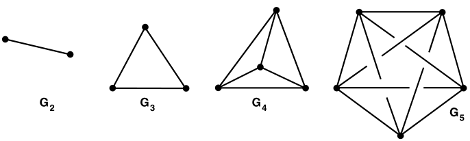
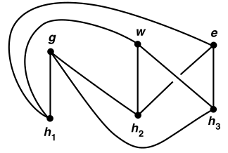
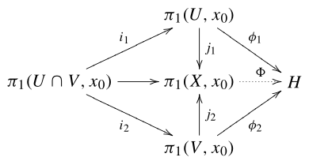

# 平面分割

- 其实有更加现代的方法，但本章使用覆叠空间等古典方法

## Jordan分离定理

- **（引理61.1）**：设 $C$ 是 $S^2$ 上的紧空间，$b\in S^2\j C$，$h:S^2\j b\to \R^2$ 是同态，$U$ 是 $S^2\j C$ 上的开集
  - 若 $b\notin U$，则 $h(U)$ 是 $\R^2-h(C)$ 的有界分支
  - 若 $b\in U$，则 $h(U-b)$ 是 $\R^2-h(C)$ 的无界分支
  - **证明**：
    - **分支性**：
- **（引理61.2）零伦引理**：设 $a,b\in S^2$，$A$ 是紧空间，$f:A\to S^2-a-b$ 是连续映射
  - 若 $a,b$ 位于 $S^2-f(A)$ 的同一分支中，则 $f$ 零伦
  - **证明**：
- **分离分支**：设 $X$ 是连通空间，$A\subset X$
  - 若 $X-A$ 不连通，被分为 $n$ 个连通分支，则称 $A$ 将 $X$ 分离为 $n$ 个分支
- **弧**：同胚于 $[0,1]$ 的空间
- **终点**：满足 $A-p,A-q$ 均连通的两点 $p,q$
  - 其它点均为A内点
- **（定理61.3）Jordan分离定理**：$S^2$ 上的简单闭曲线分离 $S^2$
  - **证明**：
- **（定理61.4）一般分离定理**：设 $A_1,A_2$ 是 $S^2$ 上的连通闭集，交集为 $\{a,b\}$，则并集 $C = A_1\cup A_2$ 分离 $S^2$
  - **证明**：

## 定义域不变性

- **（引理62.1）同伦延拓引理**：
  - 设
    - $X\times I$ 是正规空间，$A$ 是 $X$ 的闭子空间
    - $Y$ 是 $\R^n$ 上开集，$f:A\to Y$ 是连续映射，
  - 若 $f$ 零伦，则其可连续延拓为 $g:X\to Y$，且依然零伦
  - **证明**：
- **（引理62.2）Borsuk引理**：设 $a,b\in S^2$，$A$ 是紧空间，$f:A\to S^2-a-b$ 是连续单射
  - 若 $f$ 零伦，则 $a,b$ 位于 $S^2-f(A)$ 的同一分支中
  - **证明**：
- **（定理62.3）定义域不变定理**：
  - 若 $U$ 是 $\R^2$ 上开集，$f:U\to R^2$ 是连续单射
  - 则 $f(U)$ 是开集，逆映射连续
  - **证明**：

## Jordan曲线定理

- **（定理63.1）**：设 $X = U\cup V$，且 $U\cap V = A\sqcup B$ 是不交并
  - 若存在道路 $(\a\subset U):a\in A\to b\in B，(\b\subset V):b\in B\to a\in A$
  - 则
    - 设 $f = \a*\b$，其道路同伦类生成 $\pi_1(X,a)$ 的无限循环子群
    - 若 $\pi_1(X,a)$ 是无限循环的，则其被 $[f]$ 生成
  - 再设存在道路 $(\g\subset U):a\in A\to a'\in A，(\d\subset V):b\in B\to b'\in B$
      - 若 $g=\g*\d$，则 $[f],[g]$ 生成的子群交集只有幺元
  - **证明**：
- **（定理63.2）非分离定理**：$S^2$ 中的弧 $D$ 不分离 $S^2$
  - **证明**：
- **（定理63.3）一般非分离定理**：设 $D_1,D_2$ 是 $S^2$ 中闭集，且 $S^2-D_1\cap D_2$ 单连通
  - 若 $D_1,D_2$ 均不分离 $S^2$，则其并集也不
  - **证明**：
- **（定理63.4）Jordan曲线定理**：设 $C$ 是 $S^2$ 上简单闭曲线，则 $C$ 将 $S^2$ 分离为两个分支 $W_1,W_2$，且均以 $C$ 为边界
  - **证明**：
- **（定理63.5）**：设 $C_1,C_2$ 是 $S^2$ 上闭的连通子集，交集为两点
  - 若均不分离 $S^2$，则并集将 $S^2$ 分离为两个分支

## 拓扑图在平面的嵌入

- **线性图**：有限个（每对最多交于一个终点）的弧的并，且满足T2公理
  - **实例**：
    - **n-完全图 $G_n$**
      - $n\leq 4$ 时可嵌入 $\R^2$，$n=5$ 时只能嵌入 $\R^3$
      
    - **强正则图**：$2n$ 个顶点的完全二分图
      - 其不能嵌入 $\R^2$
      
- **$\t$ 空间**：三个两两交于终点的 $A,B,C$ 并成的H空间（同胚于 $\t$ 字形的空间）
- **（引理64.1）**：设 $X\subset S^2$ 是 $\t$ 空间
  - 则 $X$ 将 $S^2$ 分离成三个分支 $P,Q,R$，边界分别为 $A\cup B,B\cup C,A\cup C$
  - 且 $P$ 等于 $S^2-A\cup B$ 的某个分支
  - **证明**：
- **（定理64.2）**：强正则图不能被嵌入平面
  - **证明**：
- **（引理64.3）**：设 $X\subset S^2$ 是强正则图，顶点为 $a_1,a_2,a_3,a_4$，
  - 则 $X$ 将 $S^2$ 分离成四个分支，边界为 $X_1,X_2,X_3,X_4$（其中 $X_i$ 为 $X$ 中不含 $a_i$ 的边）
  - **证明**：
- **（定理64.4）**：5-完全图 $G_5$ 不能被嵌入平面
  - **证明**：见图论

## 闭曲线的圈数

- **$h$ 的圈数**：若 $h:S^1\to \R^2-\bd 0$ 是连续映射，则 $h_*$ 将$\pi_1(S^1,x_0)$ 的生成元 映射成 $\pi_1(X,h(x_0))$ 的生成元的整数幂。该幂数即为圈数
- **（引理65.1）圈同构引理**：
  - 设
    - $G$ 是 $S^2$ 上顶点为 $a_1,a_2,a_3,a_4$ 的完全图
    - $C$ 是简单闭曲线 $a_1a_2a_3a_4a_1$ 
    - $p,q$ 分别是 $a_1a_2，a_2a_4$ 的内点
  - 则
    - $p,q$ 位于 $S^2-C$ 不同的连通分支中
    - $j:C\to S^2-p-q$ 的诱导同态是同构
  - **证明**：
- **（定理65.2）圈同构定理**：设 $C\subset S^2$ 是简单闭曲线，$p,q$ 处于 $S^2-C$ 的不同连通分支中
  - 则 $j:C\to S^2-p-q$ 的诱导同态是同构
  - **证明**：

### 柯西积分定理的拓扑表示

- **绕点圈数**：
  - 设 $f$ 是 $\R^2$ 上环路，$a$ 是其像外一点
    - 取 $g = \cfrac{f(s)-a}{\|f(s)-a\|}$，则其为 $S^2$ 上环路
    - 设 $p$ 是标准覆叠映射，$\wt g$ 是提升
  - 则 $n(f,a) = \wt g(1)-\wt g(0)$ 就是 $f$ 绕点 $a$ 的圈数
  - **证明**：
- **自由同伦**：连续映射 $F:I\times I\to X$ 满足 $F(0,t) = F(1,t)$
  - 此时 $f_t(s)$ 是环路，$F$ 是 $f_0(s)，f_1(s)$ 的自由同伦
  - 什么范畴的自由对象？
- **（引理66.1）圈数性质**：设 $f$ 是 $\R^2-a$ 上的环路
  - **逆反公式**：$n(\ol f,a) = -n(f,a)$
  - 自由同伦的两环路绕 $a$ 圈数相等
  - 若 $a,b$ 在 $\R^2-f(I)$ 的同个连通分支中，则 $n(f,a) = n(f,b)$
  - **证明**：
- **简单环路**：$f(s) = f(s')$，仅当 $s = s'$ 或分别为 $0,1$
  - **本质**：除了起始点相同，其余点均不相同的环路
  - 像为简单闭曲线
- **（定理66.2）圈数定理**：设 $f$ 是 $\R^2$ 上简单环路
  - 若 $a$ 在 $\R^2-f(I)$ 的无界连通分支上，则 $n(f,a) = 0$
  - 若 $a$ 在 $\R^2-f(I)$ 的有界连通分支上，则 $n(f,a) = \pm 1$
  - **证明**：
  - **推论**：$1$ 是逆时针，$-1$ 是顺时针

## S-V-K定理

### 第一形式

- **（定理70.1）Seifert-van Kampen定理**：
  - 设
    - $X = U\cup V$ 是分割，$U\cap V$ 道路连通，$x_0\in U\cap V$
    - $H$ 是群，$\phi_1:\pi_1(U,x_0)\to H，\phi_2:\pi_1(V,x_0)\to H$ 是同态
    - $i_1,i_2,j_1,j_2$ 是下面交换图导出的（包含映射的诱导同态）
    
  - 若 $\phi_1\circ i_1 = \phi_2\circ i_2$
  - 则存在唯一同态 $\Phi:\pi_1(X,x_0)\to H$ 满足 $\begin{cases} \Phi\circ j_1 = \phi_1 \\ \Phi\circ j_2 = \phi_2 \end{cases}$
  - **证明**：
  - **本质**：在 $U\cap V$ 上相同的两个同态可导出总空间基本群同态

### 古典形式

- **（定理70.2）S-V-K定理（古典形式）**：
  - 假设条件相同
  - 设 $j:\pi_1(U,x_0)*\pi_1(V,x_0)\to \pi_1(X,x_0)$ 是自由积上可延拓为（包含映射的诱导映射） $j_1,j_2$ 的同态
  - 则
    - $j$ 是满射
    - $\ker j$ 是自由积上包含所有 $\Big( i_1(g)^{-1}，i_2(g) \Big)，g\in \pi_1(U\cap V,x_0)$ 元素的最小正规子群
  - **本质**：$j$ 的核可由所有的 $i_1(g)^{-1}i_2(g)$ 和其共轭生成
  - **（推论70.3）**：若 $U\cap V$ 单连通，则存在同构 $k:\pi_1(U,x_0)*\pi_1(V,x_0)\to \pi_1(X,x_0)$
    - **证明**：
  - **（推论70.4）**：若 $V$ 单连通，则存在同构 $k:\pi_1(U,x_0)/N \to \pi_1(X,x_0)$
    - 其中 $N$ 是 $\pi_1(U,x_0)$ 中包含（同态 $i_1:\pi_1(U\cap V,x_0)\to \pi_1(U,x_0)$ 的像）的最小正规子群
    - **证明**：
  - **实例**：

## 楔形圆上的基本群

- **楔和（一点并）**：某些相交于一点的拓扑空间的并
- **圆楔**：
  - 设 $X$ 是同胚于 $S^1$ 的子空间 $\{S_n\}$ 的并，满足T2公理
  - 若 $\exists p\in X$ 使得 $\forall i\neq j，S_i\cap S_j = \{p\}$
  - 则 $X$ 是圆楔
- **（定理71.1）圆楔自由群**：设 $X$ 是 $\{S_n\}$ 圆楔，$p$ 是公共点，则 $\pi_1(X,p)$ 是自由群
  - 若 $f_i$ 是 $S_i$ 上的环路（基本群生成元），则 $f_1,\cdots,f_n$ 是自由群的生成元
  - **证明**：
- **凝聚拓扑**：设 $X = \prod\limits_{\a\in J} X_\a$，若 $C\cap X_\a$ 在因子空间是闭集，则 $C$ 在积空间中也是闭集
  - **等价命题**：开集
  - **T2性**
- **任意圆楔**：具有凝聚性的圆楔
- **（引理71.2）**：任意圆楔 $X = \prod S_\a$ 是正规空间，且紧子空间含于有限个 $S_\a$ 的交中
  - **证明**：
- **（定理71.3）任意圆楔自由群**：同上
  - **证明**：
  - **实例**
- **（引理71.4）存在性**：任意指标集均对应一个任意圆楔
  - **证明**：
- 